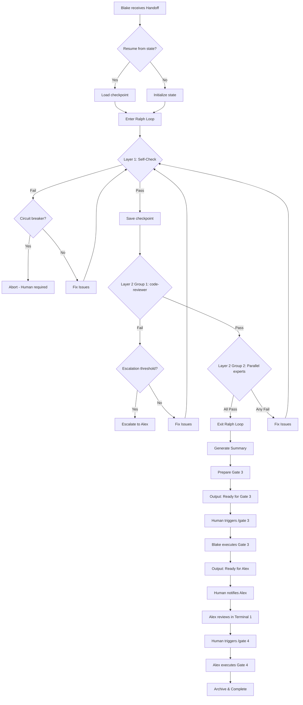

# Handoff Document: Blake + Ralph Loop Fusion
## TAD v2.0 - Autonomous Quality-Driven Development

**From:** Alex (Agent A - Solution Lead)
**To:** Blake (Agent B - Execution Master)
**Date:** 2026-01-26
**Project:** TAD Framework
**Task ID:** TASK-20260126-001
**Handoff Version:** 1.2.0 (Expert Timeout Optimized)

---

## 🔴 Gate 2: Design Completeness (Alex 已完成)

**执行时间**: 2026-01-26 00:43
**专家审查时间**: 2026-01-26 01:00

### Gate 2 检查结果

| 检查项 | 状态 | 说明 |
|--------|------|------|
| Architecture Complete | ✅ | 三层循环架构完整定义 + 专家审查反馈整合 |
| Components Specified | ✅ | Ralph Loop、Expert Criteria、Gate 重定义均已规格化 |
| Functions Verified | ✅ | 基于现有 TAD 配置结构，无需调用不存在的函数 |
| Data Flow Mapped | ✅ | Blake → Layer 1 → Layer 2 → Gate 3 → Alex Gate 4 完整映射 |
| Expert Review | ✅ | code-reviewer + backend-architect 审查完成 |

**Gate 2 结果**: ✅ PASS

### Expert Review Summary

| 专家 | 发现的 P0 问题 | 处理状态 |
|------|---------------|----------|
| code-reviewer | 3 个 P0 (迭代计数、升级阈值、Gate 职责) | ✅ 已整合 |
| backend-architect | 3 个 P0 (状态持久化、超时、断路器) | ✅ 已整合 |
| Human (用户) | 1 个 (专家超时 5min 过短) | ✅ 已调整为分层超时 |

**Alex确认**: 我已验证所有设计要素并整合专家反馈，Blake可以独立根据本文档完成实现。

---

## 📋 Handoff Checklist (Blake必读)

Blake在开始实现前，请确认：
- [ ] 阅读了所有章节
- [ ] 理解了 Ralph Loop 的核心原理（迭代直到专家通过）
- [ ] 理解了新增的 **断路器** 和 **状态持久化** 机制
- [ ] 所有配置文件的修改位置都清楚
- [ ] 理解了真正意图（自动化质量保证，而非取消人类参与）
- [ ] 每个 Phase 的交付物和证据要求都清楚
- [ ] 确认可以独立使用本文档完成实现

❌ 如果任何部分不清楚，**立即返回 Alex 要求澄清**，不要开始实现。

---

## 1. Task Overview

### 1.1 What We're Building

将 **Ralph Wiggum 循环技术** 融合进 TAD 框架的 Blake 执行阶段：
- Blake 执行时自动进入 Ralph Loop
- Expert Agents（code-reviewer, test-runner, security-auditor, performance-optimizer）的审核通过作为退出条件
- 扩展 Gate 3 包含所有技术检查
- 简化 Gate 4 为纯 Alex 验收 + 归档

### 1.2 Why We're Building It

**业务价值**：
- 减少 Blake 的「虚假完成」问题（AI 自认为完成但实际有问题）
- 自动化质量保证流程，降低人工审核负担
- 保持 Human-in-the-Loop 控制权的同时提升效率

**用户受益**：
- Blake 提交给 Alex 的代码已经过多轮自动审核
- 减少 Alex 验收时发现低级问题的概率
- 清晰的责任划分：Blake = 技术完整性，Alex = 业务验收

**成功的样子**：
- Blake 完成实现后，代码已通过 Layer 1 自检（build/test/lint）
- 代码已通过 Layer 2 专家审核（code-reviewer 无 P0/P1）
- Alex 只需关注业务价值验收，不再重复检查技术质量

### 1.3 Intent Statement（意图声明）

**真正要解决的问题**：
AI 容易「自认为完成」，但实际上代码有问题。通过引入外部专家检查作为客观退出条件，确保代码质量有保证。

**不是要做的（避免误解）**：
- ❌ 不是取消人类参与（Human 仍然触发 Gate 3/4）
- ❌ 不是让 AI 无限循环（有最大迭代次数限制 + 断路器）
- ❌ 不是增加流程复杂度（实际上简化了 Gate 4）

**Blake请确认理解**：
```
在开始实现前，请用你自己的话回答：
1. Ralph Loop 的核心理念是什么？
2. Layer 1 和 Layer 2 的区别是什么？
3. 断路器（Circuit Breaker）什么时候触发？
4. 为什么 Gate 4 变简单了？

只有Human确认你的理解正确后，才能开始实现。
```

---

## 📚 Project Knowledge（Blake 必读）

### 步骤 1：识别相关类别

本次任务涉及的领域：
- [x] code-quality - 代码模式/反模式
- [x] architecture - 架构决策
- [ ] security - 安全问题
- [ ] ux - 用户体验决策
- [ ] performance - 性能优化
- [x] testing - 测试模式/边界情况
- [ ] api-integration - 外部 API 集成
- [ ] mobile-platform - iOS/Android 特定问题

### 步骤 2：历史经验摘录

**已读取的 project-knowledge 文件**：

| 文件 | 相关记录数 | 关键提醒 |
|------|-----------|----------|
| architecture.md | 待创建 | 这是架构变更，需要记录决策理由 |

**⚠️ Blake 必须注意的历史教训**：

✅ 已检查，这是新功能，无直接相关的历史记录。但需注意：
- TAD 的 Terminal 隔离规则仍然有效
- 配置文件修改需要保持向后兼容

---

## 2. Background Context

### 2.1 Ralph Wiggum 技术原理

**核心概念**：`while :; do cat PROMPT.md | claude-code ; done`

```
┌─────────────────────────────────────────────────────────┐
│                   Ralph Loop                            │
│                                                         │
│   ┌──────────┐   ┌──────────┐   ┌──────────┐           │
│   │  Start   │──▶│  Execute │──▶│  Check   │           │
│   └──────────┘   └──────────┘   └────┬─────┘           │
│                        ▲              │                 │
│                        │    ┌────────▼────────┐        │
│                        │    │  Pass Criteria? │        │
│                        │    └────────┬────────┘        │
│                        │             │                 │
│                   No   │      Yes    │                 │
│                   ┌────┴────┐   ┌────▼────┐           │
│                   │  Retry  │   │  Exit   │           │
│                   └─────────┘   └─────────┘           │
└─────────────────────────────────────────────────────────┘
```

**关键洞察**：
- Ralph 原版用 `<promise>COMPLETE</promise>` 作为退出条件
- 问题：AI 自判断「完成」容易出错
- 解决：用 **专家 Agent 的客观审核** 作为退出条件

### 2.2 Current TAD Gate Structure

**当前结构**：
- Gate 1: 需求完整性 (Alex)
- Gate 2: 设计完整性 (Alex)
- Gate 3: 实现质量 (Blake)
- Gate 4: 集成验证 (Blake Part A + Alex Part B)

**问题**：Gate 4 职责不清晰，Blake 和 Alex 都有部分工作

### 2.3 Target Structure

**新结构**：
- Gate 1: 需求完整性 (Alex) - 不变
- Gate 2: 设计完整性 (Alex) - 不变
- Gate 3: **实现 + 集成质量** (Blake) - 扩展，包含 Ralph Loop
- Gate 4: **验收 + 归档** (Alex) - 简化，纯业务验收

---

## 3. Requirements

### 3.1 Functional Requirements

- **FR1**: Blake 在执行 handoff 时自动进入 Ralph Loop
- **FR2**: Ralph Loop 包含两层检查
  - Layer 1: 自检（build/test/lint/tsc）
  - Layer 2: 专家审核（code-reviewer, test-runner, security-auditor, performance-optimizer）
- **FR3**: 专家审核通过定义（机器可解析）
  - code-reviewer: severity_threshold = P2 (P0/P1 阻塞)
  - test-runner: pass_rate = 100%, coverage >= 70%
  - security-auditor: no critical/high (条件触发)
  - performance-optimizer: no blocking patterns (条件触发)
- **FR4**: 循环有最大次数限制 + **断路器机制**
- **FR5**: Gate 3 扩展为包含原 Gate 4 Part A 的技术检查
- **FR6**: Gate 4 简化为 Alex 的业务验收 + 归档
- **FR7**: (NEW) 循环状态持久化，支持崩溃恢复
- **FR8**: (NEW) 专家调用有独立超时控制

### 3.2 Non-Functional Requirements

- **NFR1**: 向后兼容 - 不破坏现有 TAD 工作流
- **NFR2**: 配置化 - 循环参数可通过 config.yaml 调整
- **NFR3**: 可追溯 - 每轮循环结果都要记录
- **NFR4**: 成本控制 - Layer 1 便宜检查先执行，通过后才执行 Layer 2 专家审核
- **NFR5**: (NEW) 鲁棒性 - 断路器防止资源浪费
- **NFR6**: (NEW) 可恢复性 - 状态持久化支持断点续传

---

## 4. Technical Design

### 4.1 Architecture Overview (Updated with Expert Feedback)

```
┌─────────────────────────────────────────────────────────────────────────┐
│                    Blake Execution Flow (with Ralph Loop v1.1)          │
├─────────────────────────────────────────────────────────────────────────┤
│                                                                         │
│  ┌─────────────┐                                                        │
│  │ Read Handoff│                                                        │
│  └──────┬──────┘                                                        │
│         ▼                                                               │
│  ┌─────────────────────────────────────────────────────────────────┐   │
│  │                    RALPH LOOP (with State Persistence)           │   │
│  │                                                                  │   │
│  │  [State File: .tad/evidence/ralph-loops/{task}_state.yaml]      │   │
│  │                                                                  │   │
│  │  ┌──────────────────────────────────────────────────────────┐   │   │
│  │  │ LAYER 1: Self-Check (Fast, Cheap)                        │   │   │
│  │  │ ┌────────┐ ┌────────┐ ┌────────┐ ┌────────┐             │   │   │
│  │  │ │  build │ │  test  │ │  lint  │ │  tsc   │             │   │   │
│  │  │ └────────┘ └────────┘ └────────┘ └────────┘             │   │   │
│  │  │                                                          │   │   │
│  │  │  ┌─────────────────────────────────────────────────┐    │   │   │
│  │  │  │ CIRCUIT BREAKER: 3 consecutive same errors      │    │   │   │
│  │  │  │ → Escalate to Human, don't keep retrying        │    │   │   │
│  │  │  └─────────────────────────────────────────────────┘    │   │   │
│  │  │                                                          │   │   │
│  │  │              All Pass? Yes ↓  No → Fix & Retry           │   │   │
│  │  └──────────────────────────────────────────────────────────┘   │   │
│  │                         │                                        │   │
│  │  ┌──────────────────────▼───────────────────────────────────┐   │   │
│  │  │ LAYER 2: Expert Review (Priority Groups)                  │   │   │
│  │  │                                                           │   │   │
│  │  │  Priority Group 1 (Blocking):                             │   │   │
│  │  │  ┌──────────────┐                                        │   │   │
│  │  │  │code-reviewer │ ──── Must pass before Group 2          │   │   │
│  │  │  └──────────────┘     Timeout: 5 min                     │   │   │
│  │  │                                                           │   │   │
│  │  │  Priority Group 2 (Parallel, after Group 1 passes):       │   │   │
│  │  │  ┌──────────────┐ ┌──────────────┐ ┌──────────────┐      │   │   │
│  │  │  │ test-runner  │ │security-audit│ │perf-optimizer│      │   │   │
│  │  │  │  (required)  │ │ (conditional)│ │ (conditional)│      │   │   │
│  │  │  └──────────────┘ └──────────────┘ └──────────────┘      │   │   │
│  │  │  Timeout: 5 min each                                      │   │   │
│  │  │                                                           │   │   │
│  │  │  ┌─────────────────────────────────────────────────┐     │   │   │
│  │  │  │ ESCALATION: 3 failed Layer 2 rounds on same     │     │   │   │
│  │  │  │ category → Escalate to Alex for re-design       │     │   │   │
│  │  │  └─────────────────────────────────────────────────┘     │   │   │
│  │  │                                                           │   │   │
│  │  │           All Experts Pass? Yes ↓  No → Fix & Retry       │   │   │
│  │  └───────────────────────────────────────────────────────────┘   │   │
│  └──────────────────────────────────────────────────────────────────┘   │
│         ▼                                                               │
│  ┌─────────────────────────────────────────────────────────────────┐   │
│  │ GATE 3 (Expanded): Implementation & Integration Quality          │   │
│  │ - All Loop iterations documented                                 │   │
│  │ - Expert review evidence attached                                │   │
│  │ - Knowledge Assessment completed                                 │   │
│  │ - Human confirms to proceed                                      │   │
│  └──────────────────────────────────────────────────────────────────┘   │
│         ▼                                                               │
│  ┌─────────────────────────────────────────────────────────────────┐   │
│  │ Output: Completion Report → Alex (Terminal 1)                   │   │
│  └─────────────────────────────────────────────────────────────────┘   │
└─────────────────────────────────────────────────────────────────────────┘
```

### 4.2 Component Specifications

#### 4.2.1 Ralph Loop Configuration (Updated with P0 Fixes)

**文件**: `.tad/ralph-config/loop-config.yaml`

```yaml
# Ralph Loop Configuration v1.1
# TAD v2.0 - Blake Autonomous Execution
# Updated with Expert Review Feedback

$schema: ".tad/schemas/loop-config.schema.json"  # Schema validation

ralph_loop:
  enabled: true
  version: "1.1.0"

  # ==================== Layer 1: Self-Check ====================
  layer1:
    name: "Self-Check"
    description: "Fast local checks before expert review"

    commands:
      - name: "build"
        command: "npm run build"
        timeout: 120000  # 2 minutes
        required: true
      - name: "test"
        command: "npm test"
        timeout: 300000  # 5 minutes
        required: true
      - name: "lint"
        command: "npm run lint"
        timeout: 60000   # 1 minute
        required: true
      - name: "typecheck"
        command: "npx tsc --noEmit"
        timeout: 120000  # 2 minutes
        required: true

    # NEW: Iteration limits (clear semantics)
    limits:
      max_retries: 15  # Max Layer 1 retry count

    # NEW: Circuit Breaker
    circuit_breaker:
      enabled: true
      consecutive_same_error: 3  # Same error 3 times → human intervention
      action: "escalate_to_human"
      message: "Layer 1 circuit breaker triggered. Same error occurred {count} times. Human intervention required."

  # ==================== Layer 2: Expert Review ====================
  layer2:
    name: "Expert Review"
    description: "Priority-grouped expert agent review"

    # NEW: Priority Groups (code-reviewer first, then others in parallel)
    priority_groups:
      group1:
        name: "Code Quality Gate"
        description: "Must pass before other experts run"
        parallel: false
        experts:
          - name: "code-reviewer"
            subagent_type: "code-reviewer"
            # Tiered timeout based on change size (v1.2 update)
            timeout:
              default: 600000      # 10 minutes - standard
              small_change: 180000 # 3 minutes - single file fix
              large_change: 900000 # 15 minutes - 50+ files
            timeout_selection: "auto"  # auto-detect based on file count
            pass_criteria:
              severity_threshold: "P2"  # P0 and P1 are blocking
              max_issues:
                P0: 0
                P1: 0
                P2: 10  # Allow up to 10 P2 issues
                P3: -1  # Unlimited
            evidence_file: "{date}-code-review-{task}-iter{n}.md"

      group2:
        name: "Verification Experts"
        description: "Run in parallel after Group 1 passes"
        parallel: true
        experts:
          - name: "test-runner"
            subagent_type: "test-runner"
            # Tiered timeout based on test type (v1.2 update)
            timeout:
              default: 600000       # 10 minutes - standard
              unit_only: 180000     # 3 minutes - unit tests only
              with_integration: 600000  # 10 minutes - unit + integration
              with_e2e: 1200000     # 20 minutes - includes E2E tests
            timeout_selection: "auto"  # auto-detect based on test config
            required: true
            pass_criteria:
              test_pass_rate: 100
              coverage_minimum: 70
            evidence_file: "{date}-testing-review-{task}-iter{n}.md"

          - name: "security-auditor"
            subagent_type: "security-auditor"
            timeout: 300000  # 5 minutes - sufficient for pattern scanning
            required: false  # Conditional
            trigger_pattern: "auth|token|password|credential|api.*key|encrypt|decrypt|session|cookie|sql|query|upload|file|exec|eval"
            pass_criteria:
              severity_threshold: "medium"  # critical and high are blocking
            evidence_file: "{date}-security-review-{task}-iter{n}.md"

          - name: "performance-optimizer"
            subagent_type: "performance-optimizer"
            timeout: 300000  # 5 minutes - sufficient for complexity analysis
            required: false  # Conditional
            trigger_pattern: "database|query|cache|batch|loop|sort|search|O\\(n"
            pass_criteria:
              blocking_patterns:
                - "O(n³) without justification"
                - "O(n²) in hot path without justification"
                - "Unbounded recursion"
                - "Obvious memory leak"
            evidence_file: "{date}-performance-review-{task}-iter{n}.md"

    # NEW: Layer 2 specific limits
    limits:
      max_rounds: 5  # Max Layer 2 retry count

    # NEW: Escalation threshold
    escalation:
      enabled: true
      threshold: 3  # 3 failed rounds on same issue category → escalate
      action: "escalate_to_alex"
      message: "Layer 2 escalation triggered. Same category of issue failed {count} times. Returning to Alex for re-design."

  # ==================== Global Limits (Clear Semantics) ====================
  limits:
    description: "Total limits for entire Ralph Loop execution"

    # Iteration counting: Layer 1 retry = 1, Layer 2 round = 1
    total_iterations: 30  # Combined Layer 1 + Layer 2 count
    timeout_minutes: 120  # Global timeout
    per_iteration_timeout: 15  # NEW: Max time per single iteration (minutes)

    abort_conditions:
      - condition: "total_iterations >= 30"
        action: "abort"
        message: "Ralph Loop exceeded {limit} total iterations. Human intervention required."
      - condition: "timeout_minutes >= 120"
        action: "abort"
        message: "Ralph Loop exceeded {limit} minute timeout. Human intervention required."
      - condition: "layer1.circuit_breaker.triggered"
        action: "abort"
        message: "Layer 1 circuit breaker triggered. Human intervention required."
      - condition: "layer2.escalation.triggered"
        action: "escalate"
        message: "Design-level issue detected. Escalating to Alex."

  # ==================== State Persistence (NEW) ====================
  state_persistence:
    enabled: true
    description: "Persist loop state for crash recovery"

    state_file: ".tad/evidence/ralph-loops/{task_id}_state.yaml"
    checkpoint_frequency: "after_each_layer"  # Checkpoint after Layer 1 and Layer 2

    state_schema:
      current_iteration: 0
      layer1_retries: 0
      layer2_rounds: 0
      last_completed_layer: null  # "layer1" or "layer2"
      last_error_category: null
      consecutive_same_error: 0
      started_at: null
      last_checkpoint_at: null

    recovery:
      enabled: true
      on_resume: "continue_from_last_checkpoint"
      stale_threshold_minutes: 30  # If state older than 30 min, start fresh

  # ==================== Evidence and Logging ====================
  evidence:
    directory: ".tad/evidence/ralph-loops"

    files:
      state: "{task_id}_state.yaml"  # Current loop state
      summary: "{task_id}_summary.md"  # Aggregated summary (NEW)
      iterations: "{timestamp}_{task_id}_iter_{n}.md"  # Per-iteration log

    retention_days: 30

    # NEW: Summary file format
    summary_format: |
      # Ralph Loop Summary: {task_id}

      ## Execution Overview
      - Total Iterations: {total_iterations}
      - Layer 1 Retries: {layer1_retries}
      - Layer 2 Rounds: {layer2_rounds}
      - Final Status: {status}
      - Duration: {duration}

      ## Layer 1 Results
      | Iteration | Build | Test | Lint | TSC | Result |
      |-----------|-------|------|------|-----|--------|
      {layer1_table}

      ## Layer 2 Results
      | Round | code-reviewer | test-runner | security | performance | Result |
      |-------|---------------|-------------|----------|-------------|--------|
      {layer2_table}

      ## Evidence Files
      - Final code review: {code_review_link}
      - Final test report: {test_report_link}
      - [Additional files...]

  # ==================== Rollback Strategy (NEW) ====================
  rollback:
    enabled: true
    on_abort:
      action: "git stash push -m 'Ralph Loop aborted: {task_id} iteration {n}'"
      preserve_evidence: true
      notification: |
        Ralph Loop aborted at iteration {n}.
        Partial changes stashed: {stash_ref}
        Evidence preserved at: {evidence_path}
        Human action required: Review and decide next steps.
```

#### 4.2.2 Expert Pass Criteria (Updated - Machine Parseable)

**文件**: `.tad/ralph-config/expert-criteria.yaml`

```yaml
# Expert Agent Pass Criteria v1.1
# Updated with structured, machine-parseable definitions

$schema: ".tad/schemas/expert-criteria.schema.json"

expert_criteria:
  version: "1.1.0"

  code-reviewer:
    description: "Code quality and maintainability check"

    # Machine-parseable pass condition
    pass_condition:
      type: "severity_count"
      rules:
        - severity: "P0"
          max_count: 0
          blocking: true
        - severity: "P1"
          max_count: 0
          blocking: true
        - severity: "P2"
          max_count: 10  # Allow up to 10
          blocking: false
        - severity: "P3"
          max_count: -1  # Unlimited
          blocking: false

    severity_definitions:
      P0:
        name: "Critical"
        description: "Security vulnerability, data loss, crash"
        examples:
          - "SQL injection vulnerability"
          - "Unhandled exception that crashes app"
          - "Data corruption possible"
      P1:
        name: "High"
        description: "Logic errors, race conditions, broken features"
        examples:
          - "Logic error causing wrong calculation"
          - "Race condition in async code"
          - "Feature doesn't work as specified"
      P2:
        name: "Medium"
        description: "Style, naming, minor improvements"
        examples:
          - "Inconsistent naming convention"
          - "Could use more descriptive variable name"
          - "Minor code duplication"
      P3:
        name: "Low"
        description: "Suggestions, nice-to-haves"
        examples:
          - "Could add more comments"
          - "Alternative approach might be cleaner"

  test-runner:
    description: "Test execution and coverage check"

    pass_condition:
      type: "metrics"
      rules:
        - metric: "test_pass_rate"
          operator: "=="
          value: 100
          unit: "percent"
        - metric: "coverage"
          operator: ">="
          value: 70
          unit: "percent"
          configurable: true  # Per-project override

    # Environment-specific overrides
    environment_overrides:
      production:
        coverage: 80
      prototype:
        coverage: 0  # Skip during prototyping

  security-auditor:
    description: "Security vulnerability check"

    pass_condition:
      type: "severity_count"
      rules:
        - severity: "critical"
          max_count: 0
          blocking: true
        - severity: "high"
          max_count: 0
          blocking: true
        - severity: "medium"
          max_count: 5
          blocking: false
        - severity: "low"
          max_count: -1
          blocking: false

  performance-optimizer:
    description: "Performance and efficiency check"

    pass_condition:
      type: "pattern_match"
      rules:
        - category: "algorithm_complexity"
          blocking_patterns:
            - "O(n³) without justification"
            - "O(n²) in hot path without justification"
            - "Unbounded recursion"
          warning_patterns:
            - "O(n²) with justification"
            - "Inefficient data structure choice"
        - category: "memory"
          blocking_patterns:
            - "Obvious memory leak"
            - "Unbounded growth"
          warning_patterns:
            - "Large allocation in loop"
```

#### 4.2.3 Gate Responsibility Matrix (NEW - Resolves P0-3)

**清晰的 Gate 3/4 职责划分**：

| Expert | Gate 3 (Blake) | Gate 4 (Alex) | Notes |
|--------|---------------|---------------|-------|
| test-runner | ✅ Required (Layer 2) | ❌ N/A | Already verified by Blake |
| code-reviewer | ✅ Required (Layer 2) | ⚪ Optional (second opinion) | Alex can re-run if concerned |
| security-auditor | ✅ Conditional (Layer 2) | ⚪ Optional (verification) | Alex reviews evidence only |
| performance-optimizer | ✅ Conditional (Layer 2) | ⚪ Optional (verification) | Alex reviews evidence only |
| ux-expert-reviewer | ❌ N/A | ⚪ Optional (if UI involved) | Business/UX focus |
| product-expert | ❌ N/A | ⚪ Optional (business logic) | Business focus |

**原则**：
- Gate 3 (Blake): 技术质量验证 - **强制**运行技术专家
- Gate 4 (Alex): 业务价值验收 - **可选**运行业务专家，技术专家仅审查证据

#### 4.2.4 Gate 3 Expanded Checklist (Updated)

**更新文件**: `.tad/config.yaml` 的 `quality_gates` 部分

```yaml
# Gate 3 Redefinition (Expanded) v1.1
gate3_implementation_integration:
  name: "Implementation & Integration Quality"
  owner: "Blake"
  description: "All technical quality checks - Ralph Loop + original Gate 3 + Gate 4 Part A"

  # Ralph Loop Evidence (Required)
  ralph_loop_evidence:
    required: true
    checks:
      - "Ralph Loop completed successfully (no abort/escalation)"
      - "State file shows clean completion"
      - "Summary file generated"
    evidence_required:
      - ".tad/evidence/ralph-loops/{task_id}_state.yaml"
      - ".tad/evidence/ralph-loops/{task_id}_summary.md"

  # Expert Evidence (Required)
  expert_evidence:
    required: true
    files:
      - type: "code-review"
        pattern: ".tad/evidence/reviews/{date}-code-review-{task}-final.md"
        required: true
      - type: "testing-review"
        pattern: ".tad/evidence/reviews/{date}-testing-review-{task}-final.md"
        required: true
      - type: "security-review"
        pattern: ".tad/evidence/reviews/{date}-security-review-{task}-*.md"
        required: false  # Only if triggered
      - type: "performance-review"
        pattern: ".tad/evidence/reviews/{date}-performance-review-{task}-*.md"
        required: false  # Only if triggered

  # Original Gate 3 Checks
  implementation_quality:
    checks:
      - "Code compiles without errors"
      - "All functions referenced in handoff exist"
      - "Type checking passes"
      - "No linting errors"

  # Moved from Gate 4 Part A
  integration_verification:
    checks:
      - "All tests pass (unit + integration)"
      - "Coverage meets threshold"
      - "No regression in existing functionality"

  # Knowledge Assessment (MANDATORY)
  knowledge_assessment:
    required: true
    questions:
      - "New discoveries during implementation?"
      - "Category (if yes)"
      - "Brief summary"
    output_location: ".tad/project-knowledge/{category}.md"

  human_trigger:
    command: "/gate 3"
    description: "Blake completes Ralph Loop, Human triggers Gate 3 to confirm"
```

#### 4.2.5 Gate 4 Simplified Checklist (Updated)

```yaml
# Gate 4 Redefinition (Simplified) v1.1
gate4_acceptance_archive:
  name: "Acceptance & Archive"
  owner: "Alex"
  description: "Pure business validation - technical quality already verified by Gate 3"

  # Pre-condition
  prerequisite:
    - "Gate 3 passed"
    - "Blake's completion report received"

  # Business Acceptance (Focus)
  acceptance:
    checks:
      - "Business value delivered matches handoff intent"
      - "User requirements satisfied"
      - "No unexpected side effects on user experience"

    # Review evidence only - no re-run needed
    evidence_review:
      description: "Review Blake's Gate 3 evidence (not re-execute)"
      files:
        - "{task_id}_summary.md"
        - "Final code-review report"
        - "Final testing-review report"

    # Optional subagent calls (business focus)
    optional_experts:
      - name: "ux-expert-reviewer"
        when: "UI/UX changes involved"
      - name: "product-expert"
        when: "Complex business logic"

  # Archive
  archive:
    actions:
      - "Move handoff to .tad/archive/by_task/"
      - "Move evidence to .tad/archive/evidence/"
      - "Update NEXT.md with completion status"

  # Knowledge Assessment (MANDATORY)
  knowledge_assessment:
    required: true
    questions:
      - "New discoveries during acceptance?"
      - "Category (if yes)"
      - "Brief summary"
    output_location: ".tad/project-knowledge/{category}.md"

  human_trigger:
    command: "/gate 4"
```

### 4.3 Blake Command Updates (Updated with State Persistence)

**更新文件**: `.claude/commands/tad-blake.md`

```markdown
## *develop Command (Updated for Ralph Loop v1.1)

When Blake executes `*develop`:

1. **Pre-flight Check**
   - Verify handoff exists and is readable
   - Verify project has required scripts (build, test, lint)
   - Load ralph-config

2. **Check for Resumable State**
   ```
   state_file = ".tad/evidence/ralph-loops/{task_id}_state.yaml"
   if state_file.exists() and state_file.age < 30_minutes:
       resume_from_checkpoint(state_file)
   else:
       initialize_new_state()
   ```

3. **Enter Ralph Loop**
   ```
   while not (limits_exceeded or escalation_triggered or all_pass):

       # Save checkpoint
       save_state()

       # Layer 1: Self-Check
       layer1_results = run_layer1_checks()

       if layer1_results.has_same_error_as_last(3):
           trigger_circuit_breaker()
           break

       if not layer1_results.all_pass:
           fix_issues(layer1_results.failures)
           increment_layer1_retries()
           continue

       # Layer 2: Expert Review (Priority Groups)

       # Group 1: code-reviewer (blocking)
       code_review = run_expert("code-reviewer", timeout=5_minutes)
       if not code_review.pass:
           track_failure_category(code_review.issues)
           if same_category_failures >= 3:
               trigger_escalation_to_alex()
               break
           fix_issues(code_review.issues)
           increment_layer2_rounds()
           continue

       # Group 2: Other experts (parallel)
       experts = get_group2_experts()  # test-runner + conditional
       group2_results = parallel_run(experts, timeout=5_minutes_each)

       if group2_results.all_pass:
           all_pass = true
           break
       else:
           fix_issues(group2_results.failures)
           increment_layer2_rounds()

   # Save final state
   save_final_state()
   ```

4. **Generate Evidence**
   - Create summary file at `.tad/evidence/ralph-loops/{task_id}_summary.md`
   - Copy final expert reviews to `.tad/evidence/reviews/`
   - Clean up intermediate iteration files (optional)

5. **Prepare for Gate 3**
   - Compile completion report
   - List all evidence files
   - Prepare Knowledge Assessment answers
   - Output: "Ralph Loop complete. Please trigger /gate 3"
```

### 4.4 Data Flow (Updated)



---

## 5. Implementation Steps（分 Phase）

### Phase 1: Ralph Config Files + Schemas（预计 3 小时）

#### 交付物
- [ ] `.tad/ralph-config/loop-config.yaml` 创建 (v1.1 with all P0 fixes)
- [ ] `.tad/ralph-config/expert-criteria.yaml` 创建 (machine-parseable)
- [ ] `.tad/schemas/loop-config.schema.json` 创建
- [ ] `.tad/schemas/expert-criteria.schema.json` 创建
- [ ] `.tad/evidence/ralph-loops/` 目录创建
- [ ] `.tad/evidence/reviews/` 目录创建

#### 实施步骤
1. 创建 `.tad/ralph-config/` 目录
2. 创建 `loop-config.yaml` (包含断路器、状态持久化、优先级组)
3. 创建 `expert-criteria.yaml` (机器可解析的通过标准)
4. 创建 JSON Schema 文件用于配置验证
5. 创建证据存储目录结构

#### 验证方法
- YAML 语法验证通过
- JSON Schema 验证配置文件
- 目录结构正确创建

#### Phase 1 完成证据
- [ ] **目录结构截图**：`.tad/ralph-config/` 和 `.tad/evidence/`
- [ ] **配置文件内容**：展示关键配置（断路器、状态持久化、优先级组）
- [ ] **Schema 验证结果**：展示配置通过 schema 验证

---

### Phase 2: Config.yaml Gate Updates（预计 2 小时）

#### 交付物
- [ ] `config.yaml` 中 Gate 3 扩展定义（包含职责矩阵）
- [ ] `config.yaml` 中 Gate 4 简化定义
- [ ] `config.yaml` 中新增 `ralph_loop` 引用部分
- [ ] `version_history` 添加 v2.0.0 记录

#### 实施步骤
1. 备份现有 `config.yaml`
2. 添加 `ralph_loop` 配置引用
3. 更新 `quality_gates.gate3` 为扩展版本
4. 更新 `quality_gates.gate4` 为简化版本
5. 添加 Gate 职责矩阵说明
6. 更新 `version_history` 添加 v2.0.0 记录

#### 验证方法
- YAML 语法验证通过
- 配置加载测试

#### Phase 2 完成证据
- [ ] **Git diff**：展示 config.yaml 的变更
- [ ] **职责矩阵**：展示 Gate 3/4 专家职责划分
- [ ] **版本记录**：新增的 v2.0.0 条目

---

### Phase 3: Blake Command Updates（预计 3 小时）

#### 交付物
- [ ] `/blake` 命令更新支持 Ralph Loop v1.1
- [ ] `/gate 3` 命令更新为扩展版本
- [ ] 新增状态持久化和断路器逻辑
- [ ] 新增优先级组执行逻辑

#### 实施步骤
1. 更新 `.claude/commands/tad-blake.md`
2. 添加状态持久化逻辑（checkpoint/resume）
3. 添加断路器逻辑（consecutive same error detection）
4. 添加优先级组执行逻辑（Group 1 → Group 2）
5. 添加升级阈值逻辑（escalate to Alex）
6. 更新 `/gate 3` 检查项

#### 验证方法
- 命令语法正确
- 流程逻辑完整
- 状态文件格式正确

#### Phase 3 完成证据
- [ ] **命令文件 diff**：展示变更内容
- [ ] **状态文件示例**：展示 `{task}_state.yaml` 格式
- [ ] **流程图更新**：展示新的执行流程（含断路器和升级）

---

### Phase 4: Alex Command Updates（预计 2 小时）

#### 交付物
- [ ] `/alex` 命令更新 Gate 4 部分
- [ ] `/gate 4` 命令更新为简化版本
- [ ] 验收流程文档更新

#### 实施步骤
1. 更新 `.claude/commands/tad-alex.md`
2. 更新 `/gate 4` 检查项（移除技术检查，保留业务验收）
3. 更新验收流程描述
4. 添加证据审查指南（而非重新执行）

#### 验证方法
- 命令语法正确
- Gate 4 检查项与设计一致

#### Phase 4 完成证据
- [ ] **命令文件 diff**：展示变更内容
- [ ] **Gate 4 checklist**：展示简化后的检查项

---

### Phase 5: Documentation & Migration（预计 2 小时）

#### 交付物
- [ ] CLAUDE.md 更新（如需要）
- [ ] README.md 更新 TAD v2.0 说明
- [ ] 迁移指南文档
- [ ] Ralph Loop 使用示例

#### 实施步骤
1. 检查 CLAUDE.md 是否需要更新
2. 更新 README.md 中的版本信息
3. 创建 `.tad/docs/migration-v1.8-to-v2.0.md`
4. 创建 Ralph Loop 使用示例

#### 验证方法
- 文档阅读流畅
- 迁移步骤清晰

#### Phase 5 完成证据
- [ ] **文档更新 diff**：展示文档变更
- [ ] **迁移指南**：展示从 v1.8 到 v2.0 的步骤

---

## 6. File Structure

### 6.1 Files to Create

```
.tad/ralph-config/
├── loop-config.yaml       # Ralph Loop 主配置 (v1.1)
└── expert-criteria.yaml   # 专家通过标准定义 (machine-parseable)

.tad/schemas/
├── loop-config.schema.json    # 配置验证 Schema (NEW)
└── expert-criteria.schema.json # 专家标准 Schema (NEW)

.tad/evidence/
├── ralph-loops/           # Ralph Loop 迭代记录
│   └── .gitkeep
└── reviews/               # 专家审核证据
    ├── .gitkeep
    └── _iterations/       # 历史迭代审核 (NEW)

.tad/docs/
└── migration-v1.8-to-v2.0.md  # 迁移指南 (NEW)
```

### 6.2 Files to Modify

```
.tad/config.yaml              # 添加 ralph_loop 引用，更新 Gate 3/4
.claude/commands/tad-blake.md # 更新 Blake 命令支持 Ralph Loop v1.1
.claude/commands/tad-alex.md  # 更新 Alex Gate 4 流程
.claude/skills/tad-gate/SKILL.md  # 更新 Gate 3/4 定义
CLAUDE.md                     # 如需要，更新规则
README.md                     # 更新版本说明
```

---

## 7. Testing Requirements

### 7.1 Smoke Tests

- 新配置文件语法正确（YAML lint）
- JSON Schema 文件有效
- 目录结构正确创建
- 命令文件格式正确

### 7.2 Integration Tests

- `/blake` 命令能正确加载 ralph-config
- 状态持久化工作正常（checkpoint/resume）
- 断路器正确触发
- 优先级组正确执行
- `/gate 3` 能正确执行扩展检查
- `/gate 4` 能正确执行简化检查

### 7.3 Edge Cases

- 项目没有 `npm test` 命令时的处理
- 专家审核超时的处理
- 达到最大迭代次数的处理
- 进程崩溃后的恢复
- 同一错误连续出现的断路器触发
- Layer 2 升级到 Alex 的处理

---

## 8. Acceptance Criteria

Blake的实现被认为完成，当且仅当：
- [ ] 所有配置文件创建完成（包含 P0 修复）
- [ ] JSON Schema 验证通过
- [ ] config.yaml 正确更新
- [ ] Blake 命令支持 Ralph Loop v1.1
- [ ] 状态持久化和断路器工作正常
- [ ] Alex Gate 4 简化完成
- [ ] 文档更新完成
- [ ] 所有 Phase 证据提供

---

## 9. Important Notes

### 9.1 Critical Warnings

- ⚠️ **保持向后兼容**：现有 TAD 工作流不受影响
- ⚠️ **Terminal 隔离仍有效**：Alex 和 Blake 仍在不同 Terminal
- ⚠️ **Human 控制权不变**：Gate 3/4 仍需 Human 触发
- ⚠️ **断路器重要**：防止无限循环浪费资源

### 9.2 Known Constraints

- Ralph Loop 依赖项目有 build/test/lint 脚本
- 专家审核需要消耗 API quota
- 条件触发专家的正则表达式可能需要调优
- 状态文件 30 分钟过期需要重新开始

### 9.3 Sub-Agent 使用建议

Blake 应该考虑使用：
- [ ] **code-reviewer** - Phase 完成后审查配置文件
- [ ] **test-runner** - 如果有可执行测试

---

## 10. Learning Content

### 10.1 Decision Rationale: Ralph Loop vs Traditional Sequential

**选择的方案**：Ralph Loop with Expert Exit Condition + Circuit Breaker

**考虑的替代方案**：

| 方案 | 优点 | 缺点 | 为什么没选 |
|------|------|------|-----------|
| Ralph Loop + Circuit Breaker（选中）| 自动迭代 + 防止资源浪费 | 配置较复杂 | ✅ 选中 |
| 原版 Ralph (无断路器) | 简单 | 可能无限循环 | 浪费资源 |
| 传统顺序执行 | 简单直接 | AI 自判断不可靠 | 无法解决核心问题 |
| 纯 Human 审核 | 质量可控 | Human 负担太重 | 效率太低 |

**权衡分析**：
- 核心权衡：自动化程度 vs 人工参与度 vs 资源消耗
- 断路器解决了原版 Ralph 的无限循环风险
- 优先级组减少了 Layer 2 的资源浪费
- 状态持久化提高了鲁棒性

**💡 Human学习点**：
1. AI 的「自我判断」往往不可靠，需要客观的外部检查
2. 自动化循环需要断路器防止失控
3. 状态持久化是生产系统的基本要求

---

## 11. Expert Review Integration Log

### code-reviewer 反馈处理

| P0 Issue | 处理方式 |
|----------|----------|
| P0-1: Layer 2 loop back 无升级阈值 | ✅ 添加 `layer2.escalation` 配置 |
| P0-2: `max_rounds` 和 `total_iterations` 关系不清 | ✅ 重新定义语义，分层计数 |
| P0-3: Gate 3/4 职责重叠 | ✅ 添加职责矩阵，明确划分 |

### backend-architect 反馈处理

| P0 Issue | 处理方式 |
|----------|----------|
| Loop state not persisted | ✅ 添加 `state_persistence` 配置 |
| No JSON Schema validation | ✅ 添加 `.tad/schemas/` 目录 |
| No per-expert timeout | ✅ 分层超时配置：code-reviewer/test-runner 支持智能分层（3-15分钟），security/performance 保持5分钟 |
| No circuit breaker | ✅ 添加 `layer1.circuit_breaker` 配置 |

---

**Handoff Created By**: Alex (Agent A)
**Date**: 2026-01-26
**Version**: 1.2.0 (Expert Timeout Optimized)
