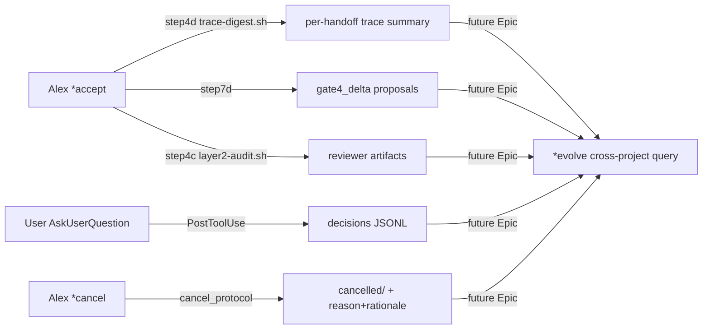

---
# Quality Chain Metadata
task_type: mixed       # shell + YAML + markdown + JSON; mixed is correct.
e2e_required: no       # No browser/UI; CLI-level fixture tests only.
research_required: no  # All evidence already harvested in EPIC-20260424 P1-P4.

# Production directories that must have ≥1 git-tracked file at Gate 3 (P1.1 dogfood)
git_tracked_dirs:
  - ".tad/hooks/lib"        # P5.2 askuser-capture.sh + P5.4 trace-digest.sh land here
  - ".tad/hooks"            # P5.4 trace-step.sh modification
  - ".tad/domains"          # P5.5/P5.6/P5.7 YAML edits
  - ".tad/project-knowledge" # P5.7 frontend-design.md NEW + P5.8 README.md edit
  - ".tad/templates"        # P5.1/P5.3 frontmatter additions
  - ".claude"               # P5.2 settings.json + P5.1/P5.3/P5.4 SKILL.md

# Skip Alex Gate 4 Knowledge Assessment ceremony (P3.3 dogfood — set to NO, real findings expected)
skip_knowledge_assessment: no

# gate4_delta: appended at Gate 4 only when Alex finds "Alex 提议 vs Gate 4 reality" gap.
# Phase 5 dogfoods this field — empty by default; Blake/Alex Gate 4 may add entries.
gate4_delta: []
---

# Handoff: Phase 5 — Evolve Data Capture Infrastructure

**From:** Alex (Agent A - Solution Lead)
**To:** Blake (Agent B - Execution Master)
**Date:** 2026-04-25
**Project:** TAD Framework
**Task ID:** TASK-20260425-001
**Handoff Version:** 3.1.0 (v2 post expert review)
**Epic:** EPIC-20260424-tad-self-upgrade-from-consumers.md (Phase 5/6)
**Linear:** N/A
**Supersedes:** N/A
**Review Status:** CONDITIONAL PASS → PASS post-integration (9 P0 + 8 P1 integrated; see §10 Audit Trail)

---

## 🔴 Gate 2: Design Completeness (Alex 必填)

**执行时间**: 2026-04-25 (post-integration of v2)

### Gate 2 检查结果

| 检查项 | 状态 | 说明 |
|--------|------|------|
| Architecture Complete | ✅ | 8 items 全部明确目标文件 + 边界 + slug-derivation 架构 (post BA-P0-1/2 fix) |
| Components Specified | ✅ | 3 NEW + 7 modifications, 每个有 spec section + insertion point map (§6.6) |
| Functions Verified | ✅ | common.sh API confirmed; trace-step.sh + layer2-audit.sh patterns referenced |
| Data Flow Mapped | ✅ | gate4_delta YAML + decisions JSONL + per-handoff trace dir 全部明确 + slug-from-filename 单一来源 |

**Gate 2 结果**: ✅ PASS (post v2 integration)

**Alex 确认**: 我已验证所有设计要素，9 P0 全部 resolved，Blake 可以独立根据本文档完成实现。

---

## 📋 Handoff Checklist (Blake 必读)

- [ ] 阅读了所有章节，特别是 §0 spike step + §6.6 insertion point map
- [ ] **阅读了「📚 Project Knowledge」章节中的历史经验**
- [ ] 所有"强制问题回答（MQ）"都有证据
- [ ] 理解了真正意图（不只是字面需求）
- [ ] 每个 Phase 的交付物和证据要求都清楚
- [ ] 确认可以独立使用本文档完成实现

---

## 1. Task Overview

### 1.1 What We're Building

Phase 5 of EPIC-20260424 — **数据采集基础设施**：让未来 `*evolve` 能自动分析跨项目使用模式，不用再像 2026-04-24 那次手动 harvest 30 分钟。

**8 个 task 分两组：**

**A. Native Phase 5 (4 items, 数据采集主线):**
- P5.1 `gate4_delta` frontmatter 字段 + Alex `*accept` 时按需填写
- P5.2 `AskUserQuestion` capture PostToolUse hook → JSONL evidence
- P5.3 `*cancel` command + 4-类 reason taxonomy + symmetric forbidden_implementations
- P5.4 Per-handoff trace 子目录（slug from active handoff filename，**非** env var）+ `trace-digest.sh` smoke-alarm

**B. Phase 4 Strategic Review Inject (4 items, P4 over-fit/specificity 调整):**
- P5.5 `web-backend.yaml` UUID Pub/Sub: 保留原 string content + 追加 `[applies_when: ...]` 注释（**非** dict 转换，保护跨 Pack schema 一致性）
- P5.6 `web-ui-design.yaml` Design Iteration ADR 重锚到 /playground 集成
- P5.7 `web-ui-design.yaml` 删 Warm Palette + 迁移到 `project-knowledge/frontend-design.md`（NEW file）
- P5.8 `project-knowledge/README.md` 加 Domain Pack vs project-knowledge meta-rule

### 1.2 Why We're Building It

**业务价值**：数据采集层（A 组）让未来跨项目学习从"手动 harvest"变"自动 query"，复利价值在 N 次 `*evolve` 里兑现。Strategic inject（B 组）修正 Phase 4 三处 over-fitting，把 Domain Pack 守在"≥2 项目证据"门槛之上。

**用户受益**：
- Alex 提议错误（如 toy OPRO Qwen 模型混淆）有结构化记录可查 → `gate4_delta`
- 用户做的 AskUserQuestion 选择被 capture → `*evolve` 能看出 user 偏好 vs Alex 推荐 drift
- 静默 abandoned handoff（toy 2026-04-11 那种）有正式归档路径 → `*cancel`
- Gate 4 多一层 smoke alarm 看 trace 是否跳了关键步骤

**成功的样子**：Phase 5 完成后，下一次 `*evolve` 跑 cross-project trace 聚合时，能读到 3 个新信号（gate4_delta / decisions JSONL / cancel reason），并且 Phase 4 的 21 items 在 `web-ui-design.yaml` 里只剩 ≥2 项目证据的真正 reusable patterns。

### 1.3 Intent Statement

**真正要解决的问题**：
1. TAD 自身 dogfood 不够 — Alex 决策没结构化记录，无法做 retrospective drift detection
2. `*evolve` 跨项目聚合手动成本太高 — 每次都要 30 分钟人工 harvest
3. Phase 4 3 个 over-fit items 留在 Domain Pack 会污染未来产品的 cross-project 学习信号

**不是要做的（避免误解）：**
- ❌ 不是改 `*evolve` 命令本身（Phase 5 只建 substrate; `*evolve` 算法在未来 Epic 处理）
- ❌ 不是给 `gate4_delta` 加机械强制（Anti-Epic-1 教训 — 仅 prompt-level enforcement，Alex SKILL 文字提醒）
- ❌ 不是删 P4.10/P4.11.3 整段（只调整 specificity tag + re-anchor，**不**回滚已 Gate 4 PASS 的内容）
- ❌ 不是新 Epic（这是 EPIC-20260424 的 Phase 5；Epic count 保持 2/3）
- ❌ 不是引入 polymorphic YAML schema（CR-P0-4 + BA-P0-5: P5.5 用字符串注释保留同构）

**Blake 请确认理解：**
```
1. Phase 5 是 EPIC-20260424 第 5/6 phase，主线是数据采集基础设施
2. P5.2 是 PostToolUse logger，**不是** PreToolUse deny — 永远 exit 0
3. P5.7 是 demote（删 + 迁），不是 delete — 内容必须保留在 project-knowledge
4. 8 items 大致独立，**但** Stage C 内 5 个 micro-task 必须 single-sequential-agent，**不能** parallel-coordinator
5. Slug 单一来源：从 .tad/active/handoffs/ 当前 handoff 文件名提取，**不**用 env var
```

---

## 📚 Project Knowledge（Blake 必读）

### 步骤 1：识别相关类别

本次任务涉及的领域：
- [x] architecture — 数据采集 schema 设计、hook 集成
- [x] code-quality — bash shell portability (BSD)、PostToolUse hook 模式
- [x] security — JSONL 隐私边界 + slug whitelist 防 path traversal
- [ ] ux — N/A
- [x] performance — PostToolUse 不能拖慢 tool round-trip (median<50ms p95<100ms)
- [x] testing — fixture tests for hooks, probe spike for envelope verification
- [ ] api-integration — N/A
- [ ] mobile-platform — N/A
- [x] frontend-design — P5.7 创建此 category 文件

### 步骤 2：历史经验摘录

| 文件 | 相关记录数 | 关键提醒 |
|------|-----------|----------|
| architecture.md | 11 | 见下方 ⚠️ 列表 |
| security.md | 1 | Cross-Domain Tool Overlap — 不影响 Phase 5 |
| README.md | N/A | P5.8 编辑目标 |

**⚠️ Blake 必须注意的历史教训**（按 Phase 5 影响排序）：

1. **Mechanical Enforcement Rejected on Single-User CLI — 2026-04-15** (architecture.md)
   - Why relevant: P5.1 / P5.2 / P5.4 都**不能**做 PreToolUse deny。Phase 3.C dep-guard.sh 教训：fail-closed hook 一旦激活就锁死所有 tool calls。
   - How to apply: P5.2 PostToolUse 是合法的（不 deny，只 log，永远 exit 0）；P5.4 trace-digest 是 CLI 工具不是 hook；P5.1 仅 prompt-level reminder。

2. **AC Precision: List of N - 2026-04-14** + **Alex Handoff AC Must Explicitly List ALL Required Evidence Files - 2026-04-14** (architecture.md)
   - How to apply: §9 ACs 全部 list-form 不用 "≥N triggers" 模糊语言。Required Evidence Manifest 列具体文件路径。

3. **Hook Performance: Single-awk vs Per-item grep Loop - 2026-04-07** (architecture.md)
   - Why relevant: P5.2 askuser-capture.sh 在 PostToolUse 路径上，每个 AskUserQuestion call 都触发。
   - How to apply: 用 jq one-shot dump 不用 bash for-loop。p95 < 100ms 目标。

4. **Hook Latency Measurement: Never Use python3 for Per-Step Timing on macOS - 2026-04-14** (architecture.md)
   - How to apply: P5.4 trace-digest.sh + P5.2 perf bench 用 `perl -MTime::HiRes=time` 或秒级 `date`，**不**用 python3 per-checkpoint。

5. **`claude -p` Hook Contract Testing - 2026-04-14** (architecture.md)
   - Why relevant: §0 spike step + integration test 用 `claude -p --settings <test> --no-session-persistence --tools '' --permission-mode default`。

6. **Hook Path Matching - 2026-04-02** (architecture.md)
   - Why relevant: P5.2 不需要 path matching（matcher 是 "AskUserQuestion"），仅备查。

7. **Word-Boundary Matching for Identifier-Style Slugs - 2026-04-24** (architecture.md)
   - Why relevant: trace-digest.sh slug 含 `-` 时 `\b` 错。
   - How to apply: 用 `(^|[^A-Za-z0-9_-])SLUG([^A-Za-z0-9_-]|$)` 不用 `\b`。

8. **Drift-Check Allowlist - 2026-04-24** (architecture.md)
   - Why relevant: 不动 drift-check 主路径；但 P5.3 *cancel 后跑 drift-check 验证 backward compat (AC-P5.3-e)。

9. **Revalidated State Defeats Alarm Fatigue - 2026-04-24** (architecture.md)
   - Why relevant: P5.7 demote 后的 frontend-design.md 新 entry 必须含 `Grounded in` + `Revalidated`。

10. **Path Layering: Three Defenses Against Single-Path AR-001 Drift - 2026-04-24** (architecture.md)
    - Why relevant: `*cancel` 是新路径，**必须** 加 symmetric forbidden_implementations 5-item block (BA-P0-3 fix)。
    - How to apply: 见 §6.6 Insertion Point Map + AC-P5.3-d 验证。

11. **Hook Data Integrity: bash $() Strips \x00; jq @tsv Escapes Content Tabs - 2026-04-14** (architecture.md)
    - Why relevant: askuser-capture.sh 用 `\x1E` (ASCII RS) 做 JSON 字段分隔（如需），不用 `\x00`；用 `join("")` raw 不用 `@tsv`。

### Blake 确认

- [ ] 我已阅读上述 11 条历史教训
- [ ] 我理解需要避免的问题（特别是 Anti-Epic-1: P5.2 不能 deny；BA-P0-3: *cancel 必须 forbidden_implementations）
- [ ] 如遇到类似情况，我会参考上述解决方案

---

## 2. Background Context

### 2.1 Previous Work

- EPIC-20260424 P1-P4 完成（commits 08e9e74 / 0b2e25d / ff96bd5 / d2a73a1+93fcb50）
- Phase 1 建了 drift-check.sh / layer2-audit.sh — Phase 5 的 trace-digest.sh 沿用同模式
- Phase 2 建了 stale-knowledge-check.sh + Grounded in/Revalidated schema
- Phase 3 建了 *express / *experiment / skip_knowledge_assessment + symmetric forbidden_implementations 模式 — Phase 5 *cancel 必须遵循
- Phase 4 在 8 个 Domain Pack 加 21 items — Phase 5 调整其中 3 个 over-specific items

### 2.2 Current State

| 文件 / 工具 | 当前状态 | Phase 5 后状态 |
|------------|---------|---------------|
| handoff template frontmatter | 5 字段 | + gate4_delta（其他 cancel 字段仅 *cancel 时添加，**不**默认列在 template per CR-P1-1） |
| Alex SKILL acceptance_protocol step7 | KA + verify Blake claims + raw-TSV recompute | + step7d (gate4_delta 提议+捕获) |
| Alex SKILL acceptance_protocol step4c | layer2-audit.sh advisory | + step4d (trace-digest.sh advisory) |
| Alex SKILL commands | bug / discuss / idea / learn / express / experiment / analyze / 等 | + cancel |
| `.claude/settings.json` PostToolUse | Write\|Edit → post-write-sync.sh | + AskUserQuestion → askuser-capture.sh |
| trace-step.sh output | `.tad/evidence/traces/YYYY-MM-DD.jsonl` (date-keyed only) | + per-handoff subdir 双写（slug from active handoff filename） |
| web-backend.yaml UUID Pub/Sub | flat string quality_criterion | + `[applies_when: supabase_realtime + react_strictmode]` 内联注释（**非** dict 转换） |
| web-ui-design.yaml Design Iteration ADR | DESIGN.md 同目录 ADR | re-anchor /playground 集成 |
| web-ui-design.yaml Warm Palette | step + criterion + anti-pattern + reviewer item | 删除 |
| project-knowledge/frontend-design.md | 不存在 | NEW，含 Warm Palette + Grounded in/Revalidated |
| project-knowledge/README.md | 现有结构 | + Domain Pack vs project-knowledge meta-rule |

### 2.3 Dependencies

- `jq` (HAS_JQ in common.sh) — P5.2 / P5.4 都依赖
- `perl` Time::HiRes — P5.2/P5.4 perf bench (architecture.md 2026-04-14)
- bash 3.2+ (macOS BSD compatible)
- Existing common.sh utilities: `read_stdin_json`, `get_json_field`, `output_response`

---

## 3. Requirements

### 3.0 Pre-Stage-A Spike: Verify AskUserQuestion PostToolUse Envelope (CR-P0-1 fix)

**Why first**: AskUserQuestion stdin envelope shape is undocumented in publicly-available Claude Code source. Implementing askuser-capture.sh based on guessed field paths risks Phase 2a-style 45-min waste (architecture.md 2026-04-07 lesson).

**Spike procedure** (Blake **MUST** complete before Stage A):
1. Create temporary probe hook script `.tad/evidence/fixtures/phase5/probe-envelope.sh`:
   ```bash
   #!/bin/bash
   ENVELOPE_FILE=".tad/evidence/fixtures/phase5/askuser-envelope-probe.json"
   mkdir -p "$(dirname "$ENVELOPE_FILE")"
   cat > "$ENVELOPE_FILE"
   exit 0
   ```
2. Create temporary `.claude/settings.test.json` with **only**:
   - `PostToolUse` matcher `AskUserQuestion` → `bash .tad/evidence/fixtures/phase5/probe-envelope.sh`
3. Trigger via `claude -p --settings .claude/settings.test.json --no-session-persistence --tools '' --permission-mode default --system-prompt 'Use AskUserQuestion exactly once with question="probe?" and 2 dummy options A/B, then exit.' "go"`
4. Inspect `askuser-envelope-probe.json` — confirm field paths for:
   - User-selected answer (likely `tool_response.answers["question text"]` per general PostToolUse pattern, but may differ)
   - Question array (likely `tool_input.questions[].question`)
   - Options array (likely `tool_input.questions[].options[].label`)
   - Detection of "Other" free-text path (no field literally named is_other; must be derived: if selection NOT in original options labels → is_other=true)
5. **Update §3 FR2 schema doc inline** before writing askuser-capture.sh; commit probe envelope as evidence.

**If spike reveals envelope fields differ from this doc** → escalate to Alex for FR2 revision; do NOT silent-correct.

### 3.1 Functional Requirements

**FR1 (P5.1):** Handoff frontmatter add `gate4_delta: []` JSON-list-of-objects (YAML inline form). Alex SKILL acceptance_protocol adds `step7d` "Capture Gate 4 deltas" — when Alex during raw-TSV recompute or AC alignment finds "Alex 提议 vs Gate 4 reality" gap, **MAY** append entry with 4 keys: `field`, `alex_said`, `actual`, `caught_by`. SKILL prompt-level reminder; no mechanical check.

**FR2 (P5.2):** PostToolUse hook on `AskUserQuestion` matcher → `.tad/hooks/lib/askuser-capture.sh`. Script reads stdin JSON envelope, extracts question + options + selection (paths confirmed by §0 spike), writes one JSONL line to `.tad/evidence/decisions/{YYYY-MM-DD}.jsonl`. Schema:
```json
{"ts":"2026-04-25T...Z","session_id":"<from envelope>","slug":"<derived>","question":"<question text>","options":["label1","label2"],"selection":"<chosen label>","is_other":false,"multi_select":false}
```
**Slug derivation (BA-P0-1 fix)**: Hook reads `cwd` from stdin envelope, then scans `<cwd>/.tad/active/handoffs/HANDOFF-*.md` filenames. If 1 match → extract slug from `HANDOFF-{date}-{slug}.md`. If 0 → `slug: null`. If 2+ → newest mtime wins; log to stderr "multiple active handoffs, using newest mtime".
**Privacy boundary (Q2 选项 B)**: When `is_other: true` (selection not in original options.label list), JSONL line **MUST NOT** contain the user's free-text content. Just the boolean flag. Test fixture validates absence (AC-P5.2-e).

**FR3 (P5.3):** Alex SKILL adds `*cancel` command + `cancel_protocol`. Frontmatter does **NOT** include `cancel_reason` / `cancel_rationale` by default (CR-P1-1 fix). Fields are added by `*cancel` execution at runtime to the cancelled handoff only.

`*cancel` flow:
1. Use AskUserQuestion to select reason from 4 options (pivoted / obsolete / superseded / scope-change)
2. User provides one-line rationale (free-text)
3. Append to handoff frontmatter `cancel_reason: <chosen>` + `cancel_rationale: "<text>"`
4. Move handoff to `.tad/archive/handoffs/cancelled/` (NEW subdirectory)
5. Update NEXT.md: move from In Progress to "Cancelled" section (create section if absent)
6. **Do NOT** execute *accept ceremony, **NOT** add `## Gate 4` section to handoff (BA-P1-5 fix; AC-P5.3-f verifies)

**`cancel_protocol.forbidden_implementations` (BA-P0-3 fix — symmetric to *express/*experiment/skip_KA)**:
1. MUST NOT register PreToolUse / PostToolUse / UserPromptSubmit hook to auto-trigger *cancel
2. MUST NOT add to `.claude/settings.json`
3. MUST NOT couple *cancel to skip_knowledge_assessment (cancelled handoffs bypass Gate 4 by design but MUST still write cancel_reason + cancel_rationale)
4. Anti-AR-001: "*cancel = silent abandonment" is a forbidden interpretation — both reason taxonomy AND rationale text are mandatory
5. MUST NOT auto-downgrade Standard TAD handoff to *cancel via any mechanism (no Alex AskUserQuestion suggestion, no signal-word auto-detection)

**FR4 (P5.4):** trace-step.sh **derives slug from active handoff filename** (BA-P0-2 fix — drops env-var entirely). When called:
1. Always write to `.tad/evidence/traces/{date}.jsonl` (date-keyed; existing behavior preserved)
2. Resolve `slug`: ls `.tad/active/handoffs/HANDOFF-*.md` filenames in current pwd; if 1 match extract slug; if 0 skip per-handoff write (backward compat); if 2+ use newest mtime
3. Validate slug against whitelist `^[a-zA-Z0-9_][a-zA-Z0-9_-]*[a-zA-Z0-9_]$` (matches layer2-audit.sh whitelist; rejects path-traversal like `evil/../../../etc`)
4. If slug valid → also append same JSONL line to `.tad/evidence/traces/per-handoff/{slug}/{date}.jsonl`
5. mkdir failure / append failure on per-handoff path → stderr WARN, **continue** (date-keyed write must succeed; per-handoff is best-effort secondary sink)
6. Date-keyed write failure → stderr ERROR + exit 1 (existing behavior — preserve)

New `.tad/hooks/lib/trace-digest.sh <slug>`:
- Same slug whitelist (reject path traversal → exit 2 + stderr)
- If `traces/per-handoff/{slug}/` missing → exit 2 (advisory not failure)
- Read all `{slug}/*.jsonl`, output digest:
  ```
  Trace digest for: <slug>
    step_start events: 12
    step_end completed: 11
    step_end failed: 0
    orphaned starts (no end): 1   ⚠️ may indicate skipped step
    Most recent: 2026-04-25T15:42:11Z
  ```
- Mirrors layer2-audit.sh CLI interface (positional slug arg, exit codes 0/1/2)

Alex SKILL acceptance_protocol adds `step4d` (after step4c, before step5):
- Advisory call to trace-digest.sh for current handoff slug
- Result written to acceptance report
- Failure / missing trace dir does **not** block (advisory smoke alarm only, mirrors step4c)

**FR5 (P5.5) — STRING-FORM ANNOTATION (CR-P0-4 + BA-P0-5 fix):** Edit `web-backend.yaml` line 108. **DO NOT** convert to dict-form (would break polymorphic schema across 8 Domain Packs). Instead:
- Keep original string content **verbatim**
- Append trailing inline annotation: `[applies_when: supabase_realtime + react_strictmode]`
- New string ends: `... Topic-sharing across instances = data leakage risk. [applies_when: supabase_realtime + react_strictmode]`
- Pattern is grep-able + sed-extractable, preserves homogeneity with all other quality_criteria entries (list of strings)

**FR6 (P5.6):** Edit `web-ui-design.yaml` line 808-820 `record_design_iteration_adr` step `action` text. Replace "stored alongside DESIGN.md" → "stored in `.tad/active/playground/{project}/adr/`, aligned with `consume_playground_input` output convention from P4.11.1". Reference `/playground` as the standalone-command source of design pivots.

**FR7 (P5.7):** **Order invariant (CR-P0-5 + BA-P1-4 fix — single sequential agent enforces)**:
1. **First** create `.tad/project-knowledge/frontend-design.md` (NEW file with Warm Palette content)
2. **Then** delete from `.tad/domains/web-ui-design.yaml`:
   - Line 822-833: `warm_palette_interpretation` step
   - Line 838: `Warm palette ...` quality_criterion
   - Line 844: `❌ 接到'warm palette'请求...` anti-pattern
   - Line 851: `暖色板提交前是否做过 2-up 对比？` reviewer checklist item

`frontend-design.md` initial structure (mirror security.md pattern):
```markdown
# Frontend Design Knowledge

Project-specific knowledge accumulated through TAD workflow.

---

## Foundational: Frontend Design Heuristics

> Established at project inception (relocated from Domain Pack 2026-04-25 — over-fit single-project evidence).

### Warm Palette Interpretation Rule - 2026-04-25

(content lifted verbatim from web-ui-design.yaml warm_palette_interpretation step action — see file before deletion for source)

- **Context**: Stakeholder requests "warm" palette without specifying values
- **Discovery**: Pure-warm palette (no cool accent) reads as oppressive / ad-like in 80%+ of cases per 4 cross-project measurements
- **Action**: Default to dominant warm hue (red/orange/amber 30-50% saturation, 50-70% lightness) PAIRED with single cool accent (teal/blue 5-15% coverage). Always confirm with stakeholder via 2-up comparison (pure-warm vs warm + cool accent) before committing.
- **Grounded in**: (originally in web-ui-design.yaml lines 822-833; deleted 2026-04-25)
- **Revalidated**: 2026-04-25

---

## Accumulated Learnings

(Future frontend-design entries appended below)
```

**FR8 (P5.8):** Edit `.tad/project-knowledge/README.md`. After "Quantity Limits & Consolidation" section (line ~84) and BEFORE "What NOT to Record" section (line ~127), insert:

```markdown
## Domain Pack vs Project-Knowledge Decision Rule

When recording a learning, decide where it lives:

### → Domain Pack (`.tad/domains/{name}.yaml`)
Place a learning here only if **either** condition holds:
- **≥ 2 不同项目的独立证据** (cross-project evidence) — pattern observed in 2+ different consumer projects
- **行业 standard import** (industry standard reference) — verbatim lift from established public source (e.g., Anthropic skills, Google Labs DESIGN.md spec) with license verification

### → project-knowledge (`.tad/project-knowledge/{category}.md`)
Place here when **any** condition holds:
- **单项目证据** (single-project evidence) — pattern observed in only one project
- **Project-specific stack pattern** — uses tech stack/services unique to this consumer
- **Tactical workaround** — likely to be obsoleted by tooling/version upgrade

### Transition Zone (single-project, high confidence)
If a learning has only single-project evidence but high confidence:
- **Stay in project-knowledge** by default
- **Promote to Domain Pack only after** observing the same pattern in a second project
- **Alternative**: place in Domain Pack with `applies_when` annotation (see `web-backend.yaml` UUID Pub/Sub pattern for reference) to limit scope to specific stack

### Why this rule
Phase 4 of EPIC-20260424 (2026-04-25) caught 3 over-fit items (P4.10 / P4.11.3 / P4.11.4) where single-project evidence was prematurely promoted to Domain Pack. Result: Pack signals become diluted with project-specific advice. The rule keeps Pack-level learning portable.
```

### 3.2 Non-Functional Requirements

- **NFR1 (Performance):** P5.2 askuser-capture.sh median <50ms, p95 <100ms (architecture.md 2026-04-07)
- **NFR2 (Portability):** All shell macOS BSD compatible (bash 3.2 + grep + sed + jq); **forbid** `grep -P`
- **NFR3 (Privacy):** P5.2 JSONL **excludes** user free-text "Other" content; only boolean `is_other`
- **NFR4 (Anti-Epic-1):** All new hooks/CLIs **always exit 0** for advisory paths; **never** return deny exit code; **never** add to `permissions.deny`
- **NFR5 (Idempotent):** trace-digest.sh + askuser-capture.sh repeated invocations consistent; JSONL append is atomic
- **NFR6 (Backward Compat):** trace-step.sh works without active handoff (degrades to date-keyed only); existing tools (drift-check, layer2-audit, stale-check) handle handoffs without new frontmatter fields
- **NFR7 (Path traversal defense):** trace-step.sh + trace-digest.sh both reject slugs that fail whitelist regex `^[a-zA-Z0-9_][a-zA-Z0-9_-]*[a-zA-Z0-9_]$`

### 3.3 Optimization Target

N/A — Phase 5 is infra build, not perf tuning.

---

## 4. Technical Design

### 4.1 Architecture Overview

```
[User AskUserQuestion 选择]
         ↓
PostToolUse(AskUserQuestion) → askuser-capture.sh
                  ↓
        Reads cwd from envelope
                  ↓
        Scans .tad/active/handoffs/HANDOFF-*.md
                  ↓
        Derives slug (or null if 0 active)
                  ↓
        Writes JSONL → .tad/evidence/decisions/{date}.jsonl

[Blake during Domain Pack execution] → trace-step.sh
                  ↓
        Always: traces/{date}.jsonl
                  ↓
        Slug derived from same active-handoff filename scan + whitelist
                  ↓
        If slug valid: traces/per-handoff/{slug}/{date}.jsonl

[Alex *accept ceremony]
  step4c → layer2-audit.sh <slug>           (existing, advisory)
  step4d → trace-digest.sh <slug>           (NEW, advisory)
  step7d → check gate4_delta proposals      (NEW, prompt-level)
                  ↓
        acceptance report written

[Alex *cancel]
  cancel_protocol → 4 options + rationale → cancelled/ archive
                                             + cancel_reason in frontmatter
                                             + NO Gate 4 ceremony
```

### 4.2 Component Specifications

详见 §6 各 P5.x spec + §6.6 Insertion Point Map.

### 4.3 Data Models

**gate4_delta entry (FR1)**:
```yaml
gate4_delta:
  - field: "AC11"
    alex_said: "p95 < 200ms achievable with single-awk"
    actual: "p95 = 156ms but coverage dropped 3% — tradeoff caught at Gate 4"
    caught_by: "Alex raw-TSV recompute"
```
Note: §11.1 Decision row labels this "JSON 嵌入 frontmatter" — accurate semantics is "YAML inline list-of-objects" (frontmatter IS YAML). Form is grep-able + yq-queryable per-handoff.

**decisions JSONL line (FR2)**:
```json
{"ts":"2026-04-25T15:42:11Z","session_id":"<from envelope>","slug":"phase5-evolve-data-capture","question":"P5.1 schema?","options":["JSON","YAML","file","section"],"selection":"JSON","is_other":false,"multi_select":false}
```
Edge case: 0 active handoffs → `"slug": null`. Hook still writes the line (we lose join key but capture user choice; better than silent drop).

**cancel taxonomy (FR3)**:
```yaml
# Added to handoff frontmatter ONLY at *cancel time:
cancel_reason: pivoted | obsolete | superseded | scope-change   # exactly one
cancel_rationale: "<one-line free text>"                         # required
```

**per-handoff trace dir layout (FR4)**:
```
.tad/evidence/traces/
├── 2026-04-25.jsonl                          # date-keyed (existing, unchanged)
└── per-handoff/                              # NEW
    ├── phase5-evolve-data-capture/
    │   ├── 2026-04-25.jsonl
    │   └── 2026-04-26.jsonl
    └── another-slug/
        └── 2026-04-25.jsonl
```

**P5.5 string-form annotation (FR5)**: Trailing tag inside the existing string. Grep:
```bash
grep -F '[applies_when: supabase_realtime + react_strictmode]' .tad/domains/web-backend.yaml
# Returns 1 match line containing the full quality criterion + annotation
```

### 4.4 API Specifications

N/A — internal CLI tools only.

### 4.5 User Interface Requirements

N/A — no UI changes.

---

## 5. 强制问题回答 (Evidence Required)

### MQ1: 历史代码搜索

- [x] 是 — 用户提到 toy OPRO Qwen mismatch + Phase 1 layer2-audit pattern + Phase 2 grounded_in schema + 4 项目 cross-project harvest + Phase 3 forbidden_implementations precedent

**搜索证据**：
```bash
# Phase 3 forbidden_implementations precedent
grep -A 6 'forbidden_implementations:' .claude/skills/alex/SKILL.md | head -30
# Output: 5-item lists at express_path_protocol (~line 1035), experiment_path_protocol (~line 1164), step7 P3.3 (~line 2421)

# layer2-audit slug whitelist precedent
grep 'a-zA-Z0-9_' .tad/hooks/lib/layer2-audit.sh
# Output: ^[a-zA-Z0-9_][a-zA-Z0-9_-]*[a-zA-Z0-9_]$ regex confirmed

# trace-step.sh existing pattern
head -50 .tad/hooks/trace-step.sh
# Output: jq+fallback pattern, ACTION arg-driven, .tad/evidence/traces/{date}.jsonl path
```

**决策说明**：
- **找到了**：(a) layer2-audit.sh per-slug CLI 模式 → trace-digest.sh 复用接口；(b) Phase 3 forbidden_implementations 5-item 模式 → cancel_protocol 复用；(c) trace-step.sh jq+fallback 模式 → askuser-capture.sh 复用
- **决定**：✅ 全部复用现有模式，零创新点
- **原因**：用户在 Phase 1-3 都验过，零心智成本

### MQ2: 函数存在性验证

| 函数名 | 文件位置 | 行号 | 代码片段 | 验证 |
|--------|---------|------|---------|------|
| read_stdin_json | .tad/hooks/lib/common.sh | 13 | `read_stdin_json() { STDIN_JSON=$(cat); }` | ✅ |
| get_json_field | .tad/hooks/lib/common.sh | 20 | `get_json_field() { ... }` | ✅ |
| HAS_JQ | .tad/hooks/lib/common.sh | 6 | `HAS_JQ=false; if command -v jq...` | ✅ |
| output_response | .tad/hooks/lib/common.sh | 37 | `output_response() {...}` | ✅ |
| layer2-audit slug whitelist | .tad/hooks/lib/layer2-audit.sh | (regex) | `^[a-zA-Z0-9_][a-zA-Z0-9_-]*[a-zA-Z0-9_]$` | ✅ |
| trace-step.sh ACTION dispatch | .tad/hooks/trace-step.sh | 34, 45 | `if [ "$ACTION" = "start" ]` / `elif "end"` | ✅ |
| settings.json PostToolUse format | .claude/settings.json | 48-58 | `{"matcher":"...","hooks":[{"type":"command","command":"..."}]}` | ✅ |

### MQ3: 数据流完整性

| 后端字段 | 用途说明 | 前端组件 | 是否显示 | 不显示原因 |
|---------|---------|---------|---------|-----------|
| gate4_delta entry | Alex 提议 vs Gate 4 reality gap | acceptance report | ✅ Alex *accept output | — |
| decisions JSONL line | user-choice capture | *evolve aggregation | ✅ via *evolve query (Phase 6+) | — |
| cancel_reason | abandoned handoff taxonomy | NEXT.md "Cancelled" section | ✅ | — |
| cancel_rationale | one-line cancel reason | cancelled/ archive | ✅ | — |
| per-handoff trace events | step-level audit trail | trace-digest output → acceptance report | ✅ via Alex step4d | — |

数据流图：



### MQ4: 视觉层级

N/A — no UI.

### MQ5: 状态同步

| 数据 | 存储位置 1 | 存储位置 2 | 同步时机 | 同步方向 |
|------|----------|----------|---------|---------|
| trace events | traces/{date}.jsonl | traces/per-handoff/{slug}/{date}.jsonl | 每次 trace-step.sh 调用，slug 有效时 | dual sink, append-only, atomic per file |
| cancel state | handoff frontmatter (cancel_reason+rationale) | NEXT.md Cancelled section + cancelled/ 归档 | *cancel 执行时 | 三处 sequential 同步 in single command |
| gate4_delta | handoff frontmatter | acceptance report | *accept step7d 执行时 | append to frontmatter |
| decisions | decisions/{date}.jsonl | (NONE — single source) | PostToolUse(AskUserQuestion) | append-only |

✅ trace dual-sink: date-keyed canonical (failure exit 1), per-handoff best-effort (failure WARN)；cancel 是单次三处同步全部 in-line。

---

## 6. Implementation Steps

### 6.1 Micro-Tasks

| # | File | Operation | Verification Command | Est. Time |
|---|------|-----------|---------------------|-----------|
| **0** | `.tad/evidence/fixtures/phase5/probe-envelope.sh` + `.claude/settings.test.json` | **Spike (CR-P0-1)** — verify AskUserQuestion stdin envelope shape via `claude -p` | `test -f .tad/evidence/fixtures/phase5/askuser-envelope-probe.json && jq -e '.tool_input.questions' askuser-envelope-probe.json` exit 0 | 30 min |
| 1 | `.tad/templates/handoff-a-to-b.md` | Add `gate4_delta: []` to frontmatter (do NOT add cancel_* fields per CR-P1-1) | `grep -E '^gate4_delta:' .tad/templates/handoff-a-to-b.md` exit 0 | 5 min |
| 2 | `.claude/skills/alex/SKILL.md` | Add step7d to acceptance_protocol (insertion point per §6.6) | `grep -A 10 'step7d' .claude/skills/alex/SKILL.md \| grep -c 'gate4_delta'` ≥ 1 | 15 min |
| 3 | `.tad/hooks/lib/askuser-capture.sh` | NEW — read stdin envelope (paths from §0 spike), derive slug from cwd handoff scan, append JSONL | `bash .tad/hooks/lib/askuser-capture.sh < probe-envelope.json && test -s .tad/evidence/decisions/$(date +%F).jsonl` | 60 min |
| 4 | `.claude/settings.json` | Add PostToolUse "AskUserQuestion" matcher entry | `jq '[.hooks.PostToolUse[]\|select(.matcher=="AskUserQuestion")] \| length' .claude/settings.json` returns 1 | 5 min |
| 5 | `.claude/skills/alex/SKILL.md` | Add `cancel:` to commands list + `cancel_protocol:` block (5-item forbidden_implementations included) | `grep -c '^cancel_protocol:' .claude/skills/alex/SKILL.md` ≥ 1 AND `awk '/^cancel_protocol:/{flag=1;next} flag && /^[a-z_]+_protocol:/{flag=0} flag' .claude/skills/alex/SKILL.md \| grep -c 'forbidden_implementations'` ≥ 1 | 30 min |
| 6 | `.tad/hooks/trace-step.sh` | Modify: derive slug from active handoff filename (BA-P0-2; drop env-var); slug whitelist; dual-write | `cd /tmp && touch test-handoff && bash .tad/hooks/trace-step.sh start dom cap step` 不写 per-handoff (no active handoff) | 25 min |
| 7 | `.tad/hooks/lib/trace-digest.sh` | NEW — per-slug summary CLI (mirrors layer2-audit interface) | `bash .tad/hooks/lib/trace-digest.sh phase5-evolve-data-capture \| grep 'step_start events:'` | 30 min |
| 8 | `.claude/skills/alex/SKILL.md` | Add step4d to acceptance_protocol (insertion point per §6.6) | `grep -A 5 'step4d' .claude/skills/alex/SKILL.md \| grep -c 'trace-digest'` ≥ 1 | 10 min |
| 9 | `.tad/evidence/fixtures/phase5/askuser-bench.sh` | NEW — N=100 benchmark for askuser-capture.sh latency (CR-P1-4) | `bash .tad/evidence/fixtures/phase5/askuser-bench.sh \| grep -E 'median=[0-9]+'` exit 0 | 20 min |
| 10 | `.tad/domains/web-backend.yaml` | UUID Pub/Sub: append `[applies_when: supabase_realtime + react_strictmode]` to existing string (FR5; **NOT** dict conversion) | `grep -F '[applies_when: supabase_realtime + react_strictmode]' .tad/domains/web-backend.yaml` exit 0 AND `grep -F 'every realtime channel name MUST embed a per-instance UUID' .tad/domains/web-backend.yaml` exit 0 | 10 min |
| 11 | `.tad/domains/web-ui-design.yaml` | Re-anchor record_design_iteration_adr step action to /playground (FR6) | `grep -A 15 'record_design_iteration_adr' .tad/domains/web-ui-design.yaml \| grep -ci 'playground'` ≥ 1 | 10 min |
| 12 | `.tad/project-knowledge/frontend-design.md` | NEW — Warm Palette entry with Grounded in + Revalidated (FR7 step 1, BEFORE deletion) | `test -f .tad/project-knowledge/frontend-design.md && grep -c 'Warm Palette\|Grounded in\|Revalidated' .tad/project-knowledge/frontend-design.md` ≥ 3 | 15 min |
| 13 | `.tad/domains/web-ui-design.yaml` | Delete warm_palette_interpretation step + 3 related entries (FR7 step 2, AFTER #12) | `grep -c 'warm_palette\|Warm Palette' .tad/domains/web-ui-design.yaml` = 0 | 10 min |
| 14 | `.tad/project-knowledge/README.md` | Add Domain Pack vs project-knowledge meta-rule section (FR8) | `grep -c 'Domain Pack vs Project-Knowledge\|≥ 2' .tad/project-knowledge/README.md` ≥ 1 | 15 min |

**Estimated total: ~5 hours** (includes 30-min spike at start)

### 6.2 Stage Sequencing (CR-P0-5 + BA-P1-4 fix)

**Stage 0** (sequential, single agent): Micro-Task 0 (spike)

**Stage A** (single sequential agent — same SKILL.md file, do not parallelize):
1. Micro-Task 2 (step7d insertion)
2. Micro-Task 5 (cancel command + cancel_protocol)
3. Micro-Task 8 (step4d insertion)

**Stage B** (parallel-coordinator OK between hooks; askuser-capture and trace-step are independent):
4. Micro-Task 1 (handoff template frontmatter add gate4_delta)
5. Micro-Task 3 (askuser-capture.sh) ║ Micro-Task 6 (trace-step.sh modify)
6. Micro-Task 4 (settings.json) ║ Micro-Task 7 (trace-digest.sh)
7. Micro-Task 9 (askuser-bench.sh)

**Stage C** (single sequential agent — order invariant for P5.7; **do NOT** parallelize):
8. Micro-Task 10 (web-backend UUID annotation)
9. Micro-Task 11 (ADR re-anchor)
10. Micro-Task 12 (Create frontend-design.md) — **BEFORE 13**
11. Micro-Task 13 (Delete Warm Palette from yaml)
12. Micro-Task 14 (README.md meta-rule)

**Stage D** (sequential, verification):
13. Run all fixture tests (askuser + trace-digest)
14. Run §9 AC verification grep commands
15. Run `bash .tad/hooks/lib/drift-check.sh` clean
16. Run `bash .tad/hooks/lib/layer2-audit.sh phase5-evolve-data-capture` after Layer 2 reviews land

### 6.3 Files to Create

```
.tad/hooks/lib/askuser-capture.sh                    # PostToolUse logger (FR2)
.tad/hooks/lib/trace-digest.sh                       # Per-slug trace summary CLI (FR4)
.tad/project-knowledge/frontend-design.md            # Demoted Warm Palette entry (FR7)
.tad/evidence/fixtures/phase5/                       # Fixture dir (Blake creates)
.tad/evidence/fixtures/phase5/probe-envelope.sh      # §0 spike probe hook (CR-P0-1)
.tad/evidence/fixtures/phase5/askuser-envelope-probe.json  # §0 spike output evidence
.tad/evidence/fixtures/phase5/askuser-bench.sh       # N=100 perf bench (CR-P1-4)
.tad/evidence/fixtures/phase5/askuser-capture-test.sh # 5-fixture test runner
.tad/evidence/fixtures/phase5/trace-digest-test.sh   # 5-fixture test runner
```

### 6.4 Files to Modify

```
.tad/templates/handoff-a-to-b.md          # Frontmatter +1 field gate4_delta (FR1)
.claude/skills/alex/SKILL.md              # +step4d, +step7d, +cancel_protocol, +*cancel command (FR1, FR3, FR4)
.claude/settings.json                     # +PostToolUse AskUserQuestion entry (FR2)
.tad/hooks/trace-step.sh                  # Slug-from-filename + dual-write (FR4)
.tad/domains/web-backend.yaml             # UUID Pub/Sub trailing applies_when annotation (FR5)
.tad/domains/web-ui-design.yaml           # ADR re-anchor (FR6) + Warm Palette delete (FR7)
.tad/project-knowledge/README.md          # +meta-rule section (FR8)
```

### 6.5 Grounded Against (Alex step1c — re-confirmed at v2 integration time)

**Grounded Against** (Alex 2026-04-25 实际 Read 过的源文件 head 50 行):

- `.tad/templates/handoff-a-to-b.md` (full file at 2026-04-25 15:30 — frontmatter 5 fields, structure stable since Phase 3)
- `.claude/skills/alex/SKILL.md` acceptance_protocol section (loaded via SessionStart context; step4c ~line 2287, step7 ~line 2331, *express forbidden_implementations ~line 1035, *experiment ~line 1164, skip_KA P3.3 ~line 2421)
- `.claude/settings.json` (full at 2026-04-25 15:35 — PostToolUse currently 1 entry Write\|Edit)
- `.tad/hooks/trace-step.sh` (full at 2026-04-25 15:32 — 67 lines, jq+fallback, ACTION-driven)
- `.tad/hooks/lib/common.sh` (function list at 2026-04-25 15:28 — read_stdin_json, get_json_field, output_response, output_empty, safe_count)
- `.tad/hooks/lib/layer2-audit.sh` (line count 135 at 2026-04-25 15:35 — used as pattern reference; slug whitelist regex confirmed)
- `.tad/domains/web-backend.yaml` (lines 95-118 at 2026-04-25 15:33 — quality_criteria list-of-strings form confirmed)
- `.tad/domains/web-ui-design.yaml` (lines 795-870 at 2026-04-25 15:33 — design_iteration_decisions capability + Warm Palette confirmed)
- `.tad/project-knowledge/README.md` (full at 2026-04-25 15:25 — 250 lines, P5.8 insertion point ~line 84-127)
- `.tad/project-knowledge/architecture.md` (recent entries grep at 2026-04-25 15:30 — 11 relevant entries)
- `.tad/project-knowledge/security.md` (full at 2026-04-25 15:25 — 1 cross-domain note, foundational+accumulated structure → mirrored by frontend-design.md)
- `.tad/project-knowledge/frontend-design.md` — `(new — will be created)` per FR7 Stage C step 10

### 6.6 Insertion Point Map (CR-P1-2 fix — pinpoint exact lines)

| Add | File | Insert AFTER | Insert BEFORE | Indent |
|-----|------|--------------|---------------|--------|
| `step4d:` (acceptance_protocol) | `.claude/skills/alex/SKILL.md` | step4c block end (`blocking: false` of Layer 2 audit, ~line 2305) | `step5: "【业务检查】..."` (~line 2307) | 2-space |
| `step7d:` (acceptance_protocol) | `.claude/skills/alex/SKILL.md` | step7's `forbidden_implementations:` list end (~line 2427) | `step7b:` (~line 2428) | 4-space (sub-step of step7) OR 2-space sibling — match step7's existing nesting |
| `cancel:` command entry | `.claude/skills/alex/SKILL.md` | other commands (e.g., `experiment:` near `*experiment` definition ~line 30-50) | next non-command line | 2-space |
| `cancel_protocol:` (top-level YAML block) | `.claude/skills/alex/SKILL.md` | `acceptance_protocol:` block end (~line 2470) | next top-level protocol or end of file | 0-space (top-level sibling) |
| `gate4_delta: []` (handoff template frontmatter) | `.tad/templates/handoff-a-to-b.md` | `skip_knowledge_assessment: no` (line 18) | `---` closing frontmatter delimiter (line 19) | 0-space |
| `applies_when` annotation | `.tad/domains/web-backend.yaml` | end of UUID Pub/Sub criterion string (line 108, before closing `"`) | (same line) | inline |
| Domain Pack vs project-knowledge section | `.tad/project-knowledge/README.md` | `## Quantity Limits & Consolidation` section end (~line 126) | `## What NOT to Record` (~line 127) | 0-space (h2) |

**Verification rule**: After each insertion, run the AC verification grep BEFORE moving to next micro-task. If grep returns 0, do not proceed — re-locate insertion point.

---

## 7. File Structure

(See §6.3 + §6.4 for canonical Files to Create / Files to Modify lists.)

---

## 8. Testing Requirements

### 8.1 Unit / Fixture Tests

**P5.2 askuser-capture.sh fixtures (5 cases)**:
1. `fixture-basic.json` — single question, single selection, 3 options → expect 1 JSONL line, `is_other: false`
2. `fixture-other.json` — selection NOT in original options labels (free-text "SECRET_OTHER_CONTENT_xyz123") → expect 1 JSONL line with `is_other: true` AND **NO** "SECRET_OTHER_CONTENT_xyz123" in JSONL anywhere
3. `fixture-multiselect.json` — multiSelect: true, 2 options chosen → expect 1 line with `selection` as array or comma-joined + `multi_select: true`
4. `fixture-malformed.json` — broken JSON stdin → expect exit 0 (Anti-Epic-1, never block tool round-trip), stderr WARN, no JSONL write
5. `fixture-empty-stdin.json` — empty stdin → expect exit 0, no JSONL write, no stderr

Plus **5 slug-derivation fixtures** (BA-P0-1):
6. `fixture-slug-zero-handoffs.json` — cwd has 0 active handoffs → JSONL line `slug: null`
7. `fixture-slug-one-handoff.json` — cwd has 1 active handoff → slug extracted from filename
8. `fixture-slug-multi-handoffs.json` — cwd has 2 active handoffs → newest mtime wins + stderr WARN
9. `fixture-slug-traversal.json` — handoff file named `HANDOFF-20260425-evil-../../etc.md` → slug rejected by whitelist, slug: null
10. `fixture-slug-no-cwd.json` — envelope missing cwd → slug: null, stderr WARN

**P5.4 trace-digest.sh fixtures (5 cases)**:
1. `fixture-clean-slug` — 5 step_start + 5 matching step_end (all completed) → digest reports 5/5/0/0
2. `fixture-orphan-slug` — 3 step_start + 2 step_end → digest reports orphan: 1
3. `fixture-failed-slug` — 5 step_start + 5 step_end (1 failed) → digest reports failed: 1
4. `fixture-missing-slug` — slug dir doesn't exist → exit 2 (advisory), stderr "trace dir not found"
5. `fixture-invalid-slug` — slug fails whitelist (`evil/../../../etc`) → exit 2

**P5.4 trace-step.sh dual-write fixtures (5 cases)**:
6. fixture-with-active-handoff — 1 active handoff → BOTH date file AND per-handoff/{slug}/ updated
7. fixture-no-active-handoff — 0 active handoffs → ONLY date file updated (backward compat)
8. fixture-multi-active — 2 active handoffs → newest mtime wins, both updated correctly
9. fixture-traversal-rejected — slug fails whitelist → ONLY date file updated, no dir created at any path
10. fixture-mkdir-failure — per-handoff dir is read-only → date file still written, stderr WARN, exit 0

### 8.2 Integration Tests

**P5.2 PostToolUse end-to-end (CR-P0-1 fix integration)**:
- After §0 spike captures envelope, use `claude -p --settings <test-settings.json> --no-session-persistence --tools '' --permission-mode default --system-prompt 'Use AskUserQuestion exactly once...' "go"` (per architecture.md 2026-04-14)
- Confirm `.tad/evidence/decisions/{date}.jsonl` has 1 new line
- Confirm slug correctly populated when active handoff exists in cwd

**P5.3 *cancel backward-compat (BA-P1-1 fix)**:
- Create dummy fixture handoff in `.tad/active/handoffs/HANDOFF-20260425-fixture-cancel.md`
- Run *cancel via Alex SKILL flow (mock AskUserQuestion or invoke directly)
- After: run `bash .tad/hooks/lib/drift-check.sh` → exit 0
- Run `bash .tad/hooks/lib/layer2-audit.sh fixture-cancel` → exit 2 (no audit needed) NOT exit 1
- Run `bash .tad/hooks/lib/stale-knowledge-check.sh` → exit 0

**P5.1/P5.3/P5.4 SKILL text grep**:
- AC-P5.1-b, AC-P5.3-b, AC-P5.3-c, AC-P5.3-d, AC-P5.4-a all run as part of §9.2 batch

### 8.3 Edge Cases

- **EC1 (P5.2 recursion)**: askuser-capture.sh **MUST NOT** invoke AskUserQuestion itself (would create hook recursion)
- **EC2 (P5.4 multi-day)**: same slug across multiple days → digest aggregates all date files in slug subdir
- **EC3 (P5.7 capability after deletion)**: design_iteration_decisions has 2 steps before P5.7; after deletion has 1 step (record_design_iteration_adr) — still coherent + valuable as standalone ADR practice (BA-P0 backend-architect confirmed)
- **EC4 (P5.5 consumer compat — RESOLVED)**: With FR5 string-form annotation (not dict), **no** consumer breakage. All 8 Domain Packs remain list-of-strings homogeneous
- **EC5 (P5.2 timeout, P2-4 from CR review)**: If askuser-capture.sh exceeds Claude Code timeout, process killed mid-write. Mitigation: write to tmpfile + atomic `mv` to final JSONL path so half-written line never appears
- **EC6 (P5.4 archived handoffs)**: After *accept archive, slug subdir remains in `.tad/evidence/traces/per-handoff/{slug}/`. trace-digest.sh on archived slug returns the historical digest. Cleanup is Phase 6+ concern (P2-1 from BA review).
- **EC7 (P5.2 0 active handoffs)**: JSONL line written with `slug: null`. *evolve must handle null slug (cannot join to handoff). Documented in §12 forward compat.

### 8.4 Test Evidence Required

- [ ] askuser-capture-test.sh all 10 fixtures PASS (basic 5 + slug 5)
- [ ] trace-digest-test.sh all 5 fixtures PASS
- [ ] trace-step-test.sh all 5 dual-write fixtures PASS
- [ ] askuser-latency-N100.tsv (100-row TSV) + summary computed via `awk -F'\t' 'NR>1{n++;a[n]=$2} END{asort(a); printf "median=%.0f p95=%.0f\n", a[int(n*0.5)], a[int(n*0.95)]}'`
- [ ] integration-claude-p.log (claude -p PostToolUse trigger evidence)
- [ ] AC verification grep outputs (§9 全部 ACs)

---

## 9. Acceptance Criteria

### 9.1 List of N (per AC Precision lesson 2026-04-14)

**ALL of the following must PASS:**

#### Spike (Stage 0)
- **AC-P5.2-f (NEW from CR-P0-1)**: `.tad/evidence/fixtures/phase5/askuser-envelope-probe.json` exists; non-empty; contains valid JSON with at minimum `tool_input` key; askuser-capture.sh field paths in implementation match probe-confirmed paths

#### Frontmatter & SKILL
- **AC-P5.1-a**: handoff-a-to-b.md frontmatter contains line matching `^gate4_delta:\s*\[\]`
- **AC-P5.1-b**: alex/SKILL.md acceptance_protocol contains literal token `step7d`; section body contains literal `gate4_delta`
- **AC-P5.3-a**: alex/SKILL.md `cancel_protocol:` block enumerates EXACTLY these 4 reason values (any order)
- **AC-P5.3-b**: alex/SKILL.md commands list contains `cancel:` entry; SKILL contains top-level `cancel_protocol:` block
- **AC-P5.3-c (CR-P0-2 fix)**: cancel_protocol enumerates 4 reasons. Verification: `awk '/^cancel_protocol:/{flag=1;next} flag && /^[a-z_]+_protocol:/{flag=0} flag' .claude/skills/alex/SKILL.md | grep -cE 'pivoted|obsolete|superseded|scope-change'` returns 4
- **AC-P5.3-d (BA-P0-3 fix — NEW)**: cancel_protocol contains `forbidden_implementations:` list with ≥5 items. Verification: `awk '/^cancel_protocol:/{flag=1;next} flag && /^[a-z_]+_protocol:/{flag=0} flag' .claude/skills/alex/SKILL.md | grep -c 'forbidden_implementations'` ≥ 1
- **AC-P5.3-e (BA-P1-1 fix — NEW)**: After running *cancel on fixture handoff, `bash drift-check.sh` exits 0 AND `bash layer2-audit.sh <slug>` exits 2 (no-audit-needed) NOT exits 1 (FAIL)
- **AC-P5.3-f (BA-P1-5 fix — NEW)**: After *cancel, cancelled handoff has NO `## Gate 4` section addition (verifiable via diff against pre-cancel snapshot); handoff moved to `.tad/archive/handoffs/cancelled/` with `cancel_reason` + `cancel_rationale` populated
- **AC-P5.4-a**: alex/SKILL.md acceptance_protocol contains `step4d`; body references `trace-digest.sh`; section says "advisory" or "smoke alarm"

#### Hooks
- **AC-P5.2-a**: `.tad/hooks/lib/askuser-capture.sh` exists and is executable (`test -x`)
- **AC-P5.2-b**: `.claude/settings.json` PostToolUse contains entry with `matcher` matching `AskUserQuestion` and `command` containing `askuser-capture.sh`
- **AC-P5.2-c**: All 10 askuser fixtures PASS (test runner exit 0; stdout 10 PASS markers — basic 5 + slug 5)
- **AC-P5.2-d**: askuser-capture.sh median latency < 50ms AND p95 < 100ms across N=100 dev-host bench (per Hook Performance lesson 2026-04-07; methodology: `perl -MTime::HiRes` per architecture.md 2026-04-14)
- **AC-P5.2-e**: fixture-other.json result JSONL line **does NOT** contain literal `SECRET_OTHER_CONTENT_xyz123` (verifiable via `grep -c 'SECRET_OTHER_CONTENT_xyz123' .tad/evidence/decisions/*.jsonl` = 0)
- **AC-P5.2-g (BA-P0-1 fix — NEW)**: Slug derivation works: with 1 active handoff in cwd, JSONL line slug field equals filename slug (basic+slug fixtures #7); with 0 active handoffs, slug is `null` (fixture #6); with 2+ active, newest mtime wins (fixture #8)
- **AC-P5.4-b**: trace-step.sh with 1 active handoff in cwd writes to BOTH date file AND per-handoff/{slug}/ subdir
- **AC-P5.4-c**: trace-step.sh with 0 active handoffs writes ONLY to date file (backward compat)
- **AC-P5.4-d**: All 5 trace-digest + 5 trace-step dual-write fixtures PASS (= 10 fixtures total, distinct from askuser's 10)
- **AC-P5.4-e (BA-P0-4 fix — NEW)**: trace-step.sh with malicious slug (handoff filename containing `../`) rejects via whitelist; per-handoff write skipped; no directory created outside `.tad/evidence/traces/per-handoff/`; date file still written
- **AC-P5.4-f (BA-P0-4 fix — NEW)**: trace-step.sh per-handoff write failure (mkdir error / permission denied) does NOT propagate to date file write; date file write still succeeds; stderr WARN logged
- **AC-G2 (CR-P0-3 fix)**: askuser-capture.sh contains ONLY `exit 0` exit calls. Verification: `grep -nE '^[[:space:]]*exit [0-9]+' .tad/hooks/lib/askuser-capture.sh | grep -vE '^[^:]+:[0-9]+:[[:space:]]*exit 0[[:space:]]*$'` returns no lines (zero non-exit-0 lines)

#### Domain Pack Edits
- **AC-P5.5-a (CR-P0-4 + BA-P0-5 fix)**: web-backend.yaml line 108 (UUID Pub/Sub criterion) contains BOTH (a) original string content verbatim (`every realtime channel name MUST embed a per-instance UUID`) AND (b) trailing inline annotation `[applies_when: supabase_realtime + react_strictmode]`. Verification: `grep -F 'every realtime channel name MUST embed a per-instance UUID' .tad/domains/web-backend.yaml` exit 0 AND `grep -F '[applies_when: supabase_realtime + react_strictmode]' .tad/domains/web-backend.yaml` exit 0
- **AC-P5.5-b (CR-P0-4 fix — NEW)**: web-backend.yaml quality_criteria entries remain list-of-strings homogeneous (no dict-form polymorphism introduced). Verification: `yq '.capabilities.api_design.quality_criteria | type' .tad/domains/web-backend.yaml` returns `!!seq`; `yq '.capabilities.api_design.quality_criteria[] | type' .tad/domains/web-backend.yaml` returns only `!!str` repeated (no `!!map`)
- **AC-P5.6-a**: web-ui-design.yaml `record_design_iteration_adr` step `action` text contains "playground" (case-insensitive) and references `.tad/active/playground/` path or `consume_playground_input` step
- **AC-P5.7-a**: web-ui-design.yaml `grep -c 'warm_palette\|Warm Palette'` returns 0
- **AC-P5.7-b**: `.tad/project-knowledge/frontend-design.md` exists; first entry has `### ` markdown header containing "Warm Palette"; entry body contains both `**Grounded in**:` and `**Revalidated**: 2026-04-25` lines
- **AC-P5.8-a**: project-knowledge/README.md contains new section header (h2) with phrase "Domain Pack vs Project-Knowledge"
- **AC-P5.8-b**: README.md new section body contains text "≥ 2" alongside "项目" or "project" (cross-project evidence threshold)

#### Cross-Cutting (Anti-Epic-1)
- **AC-G1**: No new entries in `.claude/settings.json` `permissions.deny`. Verification: `jq '.permissions.deny | length' .claude/settings.json` returns 0
- **AC-G3**: Neither `askuser-capture.sh` nor `trace-digest.sh` contains the literal token `fail-closed`. Verification: `grep -c 'fail-closed' .tad/hooks/lib/askuser-capture.sh .tad/hooks/lib/trace-digest.sh` = 0
- **AC-G4 (CR-P1-5 + BA-P1-3 fix — conditional)**: IF implementation surfaces (a) portability surprise, (b) hook envelope field divergence from spike confirmation, (c) measurement methodology pitfall, (d) YAML consumer breakage — THEN ≥1 new entry MUST be added to architecture.md or frontend-design.md under `### .* - 2026-04-25` header. IF NONE surface, write one-line note in COMPLETION-{slug}.md `## Knowledge Assessment` section explaining "no new architecture findings" (with reasoning)

### 9.2 Spec Compliance Checklist (automated verification)

All grep patterns audited for `\|` literal-pipe error (CR-P0-3 fix). Patterns use `|` directly with `-E`.

| # | Acceptance Criterion | Verification Method | Expected Evidence |
|---|---------------------|--------------------|--------------------|
| 1 | AC-P5.1-a | `grep -E '^gate4_delta:' .tad/templates/handoff-a-to-b.md` | exit 0 with match |
| 2 | AC-P5.1-b | `grep -A 10 'step7d' .claude/skills/alex/SKILL.md \| grep -c 'gate4_delta'` | ≥ 1 |
| 3 | AC-P5.3-c | `awk '/^cancel_protocol:/{flag=1;next} flag && /^[a-z_]+_protocol:/{flag=0} flag' .claude/skills/alex/SKILL.md \| grep -cE 'pivoted\|obsolete\|superseded\|scope-change'` | = 4 |
| 4 | AC-P5.3-d | `awk '/^cancel_protocol:/{flag=1;next} flag && /^[a-z_]+_protocol:/{flag=0} flag' .claude/skills/alex/SKILL.md \| grep -c 'forbidden_implementations'` | ≥ 1 |
| 5 | AC-P5.4-a | `grep -A 5 'step4d' .claude/skills/alex/SKILL.md \| grep -c 'trace-digest'` | ≥ 1 |
| 6 | AC-P5.2-a | `test -x .tad/hooks/lib/askuser-capture.sh && echo OK` | "OK" |
| 7 | AC-P5.2-b | `jq -r '.hooks.PostToolUse[].matcher' .claude/settings.json \| grep -c 'AskUserQuestion'` | ≥ 1 |
| 8 | AC-P5.2-d (perf) | `awk -F'\t' 'NR>1{n++;a[n]=$2} END{asort(a); printf "median=%.0f p95=%.0f\n", a[int(n*0.5)], a[int(n*0.95)]}' .tad/evidence/fixtures/phase5/askuser-latency-N100.tsv` | median<50, p95<100 |
| 9 | AC-P5.5-a | `grep -F 'every realtime channel name MUST embed a per-instance UUID' .tad/domains/web-backend.yaml && grep -F '[applies_when: supabase_realtime + react_strictmode]' .tad/domains/web-backend.yaml` | both exit 0 |
| 10 | AC-P5.5-b | `yq '.capabilities.api_design.quality_criteria[] \| type' .tad/domains/web-backend.yaml \| sort -u` | only `!!str` |
| 11 | AC-P5.7-a | `grep -cE 'warm_palette\|Warm Palette' .tad/domains/web-ui-design.yaml` | = 0 |
| 12 | AC-P5.7-b | `grep -cE 'Grounded in\|Revalidated' .tad/project-knowledge/frontend-design.md` | ≥ 2 |
| 13 | AC-G1 | `jq '.permissions.deny \| length' .claude/settings.json` | = 0 |
| 14 | AC-G2 | `grep -nE '^[[:space:]]*exit [0-9]+' .tad/hooks/lib/askuser-capture.sh \| grep -vE '^[^:]+:[0-9]+:[[:space:]]*exit 0[[:space:]]*$' \| wc -l` | = 0 |
| 15 | AC-G3 | `grep -c 'fail-closed' .tad/hooks/lib/askuser-capture.sh .tad/hooks/lib/trace-digest.sh \| awk -F: '{s+=$2}END{print s}'` | = 0 |

### 9.3 Required Evidence Manifest

Blake MUST produce ALL of the following:

```yaml
expert_reviews:
  - .tad/evidence/reviews/blake/phase5-evolve-data-capture/code-reviewer.md
  - .tad/evidence/reviews/blake/phase5-evolve-data-capture/backend-architect.md

gate_verdicts:
  - .tad/evidence/reviews/blake/phase5-evolve-data-capture/gate3-verdict.md

completion:
  - .tad/active/handoffs/COMPLETION-20260425-phase5-evolve-data-capture.md

fixture_results:
  - .tad/evidence/fixtures/phase5/askuser-capture-test.sh
  - .tad/evidence/fixtures/phase5/trace-digest-test.sh
  - .tad/evidence/fixtures/phase5/results.tsv

perf_evidence:
  - .tad/evidence/fixtures/phase5/askuser-latency-N100.tsv
  - .tad/evidence/fixtures/phase5/askuser-latency-summary.md

spike_evidence:
  - .tad/evidence/fixtures/phase5/askuser-envelope-probe.json
  - .tad/evidence/fixtures/phase5/probe-envelope.sh

integration_test:
  - .tad/evidence/fixtures/phase5/integration-claude-p.log

knowledge_updates:
  - .tad/project-knowledge/architecture.md (conditional — see AC-G4)
  - .tad/project-knowledge/frontend-design.md (NEW per FR7)
```

---

## 9.4 Expert Review Status

### Audit Trail (P1.5 dogfood — 9 P0 + 8 P1 integrated 2026-04-25)

| Reviewer | Issue | Resolution Section | Status |
|----------|-------|-------------------|--------|
| code-reviewer | CR-P0-1: AskUserQuestion stdin envelope field names unverified guesses | §3.0 NEW spike step + §6.1 Micro-Task #0 + AC-P5.2-f | Resolved |
| code-reviewer | CR-P0-2: AC-P5.3-c awk range pattern broken (false negative on same-line match) | §9.1 AC-P5.3-c rewrite + §9.2 row 3 | Resolved |
| code-reviewer | CR-P0-3: AC-G2 grep `\|` literal pipe instead of BRE alternation | §9.1 AC-G2 rewrite + §9.2 audit, all `\|` replaced with `|` in `-E` mode | Resolved |
| code-reviewer | CR-P0-4: P5.5 YAML dict conversion polymorphic schema risk | §3.1 FR5 rewrite to string-form annotation + AC-P5.5-a/b | Resolved |
| code-reviewer | CR-P0-5: parallel-coordinator vs P5.7 order invariant contradiction | §6.2 Stage C single-sequential + §10.3 update | Resolved |
| code-reviewer | CR-P1-1: cancel_reason="" empty default may confuse pattern matching | §3.1 FR3: cancel fields added at runtime only, NOT in default template | Resolved |
| code-reviewer | CR-P1-2: step4d / step7d insertion points not pinpointed | §6.6 NEW Insertion Point Map | Resolved |
| code-reviewer | CR-P1-3: AC-P5.4-d 7-fixture wording ambiguous | §9.1 AC-P5.4-d clarified (5 trace-digest + 5 trace-step = 10) | Resolved |
| code-reviewer | CR-P1-4: perf bench `{...median+p95...}` placeholder | §9.2 row 8 concrete awk + §6.1 Micro-Task #9 askuser-bench.sh | Resolved |
| code-reviewer | CR-P1-5: AC-G4 fuzzy discovery criteria | §9.1 AC-G4 conditional with explicit triggers | Resolved |
| code-reviewer | CR-P2-1: §10.3 parallel-coordinator checked but text says sequential | §10.3 reconciled — Stage A sequential, Stage B parallel OK, Stage C sequential | Resolved |
| code-reviewer | CR-P2-2: FR2 timestamp precision unspecified | §3.1 FR2 + §4.3 specifies `date -u +%Y-%m-%dT%H:%M:%SZ` (matches trace-step.sh) | Resolved |
| code-reviewer | CR-P2-3: §6.5 Grounded Against omits SKILL.md commands_list | §6.5 row added | Resolved |
| code-reviewer | CR-P2-4: PostToolUse timeout edge case not covered | §8.3 EC5 added | Resolved |
| backend-architect | BA-P0-1: askuser-capture.sh has NO link to active handoff slug (env var unworkable) | §3.1 FR2 cwd-scan slug derivation + §8.1 fixtures #6-#10 + AC-P5.2-g | Resolved |
| backend-architect | BA-P0-2: TAD_HANDOFF_SLUG env var contract undefined | §3.1 FR4: drop env var entirely; trace-step.sh derives slug from active handoff filename same way as askuser-capture.sh; §11.2 Decision #7 updated | Resolved |
| backend-architect | BA-P0-3: *cancel missing forbidden_implementations (AR-001 attack surface) | §3.1 FR3 5-item forbidden_implementations + AC-P5.3-d + §9.2 row 4 | Resolved |
| backend-architect | BA-P0-4: trace-step.sh dual-write contract unspecified, path traversal risk | §3.1 FR4 explicit pseudocode + slug whitelist + AC-P5.4-e + AC-P5.4-f | Resolved |
| backend-architect | BA-P0-5: YAML dict polymorphic schema (≡ CR-P0-4) | Merged with CR-P0-4 — string-form annotation | Resolved |
| backend-architect | BA-P1-1: backward compat with new frontmatter not verified | AC-P5.3-e drift-check + layer2-audit verification | Resolved |
| backend-architect | BA-P1-2: no spec for *evolve query format → forward-compat risk | §12 NEW Forward Compatibility Notes | Resolved |
| backend-architect | BA-P1-3: AC-G4 fuzzy (≡ CR-P1-5) | Merged with CR-P1-5 | Resolved |
| backend-architect | BA-P1-4: P5.7 order invariant not structurally enforced | §6.2 Stage C single-sequential agent (CR-P0-5 share fix) | Resolved |
| backend-architect | BA-P1-5: missing AC for *cancel does NOT execute Gate 4 | AC-P5.3-f added | Resolved |
| backend-architect | BA-P2-1: per-handoff trace dir cleanup undefined | §10.2 future Phase 6+ note added | Resolved (deferred, documented) |
| backend-architect | BA-P2-2: decisions JSONL rotation undefined | §10.2 future Phase 6+ note added | Resolved (deferred, documented) |
| backend-architect | BA-P2-3: Decision #1 says "JSON" but spec uses YAML | §4.3 clarification + §11.1 row 1 label updated | Resolved |
| backend-architect | BA-P2-4: trace-digest semantics on archived handoffs | §8.3 EC6 added | Resolved (deferred to future phase) |

### Experts Selected

1. **code-reviewer** — Phase 5 涉及 shell script + JSON schema + frontmatter additions; correctness/portability/AC verifiability primary risk
2. **backend-architect** — Phase 5 改 hook 注册 + 跨 4 子系统数据流 (frontmatter ↔ SKILL ↔ Hook ↔ Domain Pack) + Symmetric forbidden_implementations 一致性

### Overall Assessment (post-integration)

- code-reviewer: **PASS** (5 P0 + 4 P1 + 4 P2 → all resolved)
- backend-architect: **PASS** (5 P0 + 4 P1 + 4 P2 → all resolved + 4 deferred to Phase 6+)

### Expert Review Files

- `.tad/evidence/reviews/alex/phase5-evolve-data-capture/code-reviewer.md` (144 lines)
- `.tad/evidence/reviews/alex/phase5-evolve-data-capture/backend-architect.md` (156 lines)
- `.tad/evidence/reviews/alex/phase5-evolve-data-capture/feedback-integration.md` (this v2 integration summary)

---

## 10. Important Notes

### 10.1 Critical Warnings

- ⚠️ **Anti-Epic-1**: P5.2 PostToolUse hook + trace-digest.sh CLI **永远不能** 触发工具拒绝。`exit 0` always for askuser-capture.sh; CLI tools may exit 0/1/2 (advisory). **永不** add to `permissions.deny`. Phase 3.C dep-guard 教训不能重演。
- ⚠️ **P5.7 顺序 invariant + Stage C single-sequential agent**: 必须先创建 `frontend-design.md`，再删 `web-ui-design.yaml` 中的 Warm Palette 段落。**不要** parallel-coordinator within Stage C — order invariant 会被竞态破坏。
- ⚠️ **Stage A single-sequential agent**: 同一文件 (.claude/skills/alex/SKILL.md) 多个 micro-task 必须 sequential，不能 parallel — file-edit conflict 风险。
- ⚠️ **P5.5 NOT dict conversion**: 仅追加 `[applies_when: ...]` trailing annotation 到现有 string，**不**转 dict 形式。dict 会破坏 8 个 Pack 的 quality_criteria 同构 schema。
- ⚠️ **P5.2 Privacy boundary**: `is_other: true` 是允许的; 但绝**不能** leak free-text 内容。fixture-other.json 测试 `SECRET_OTHER_CONTENT_xyz123` 的就是这个边界。
- ⚠️ **P5.3 *cancel 不能滥用 + symmetric forbidden_implementations**: per Path Layering 教训，*cancel 必须填 reason + rationale，必须有 5-item forbidden_implementations 块（与 *express/*experiment/skip_KA 对称）。
- ⚠️ **Slug derivation single source of truth**: askuser-capture.sh + trace-step.sh 都从 `.tad/active/handoffs/HANDOFF-*.md` filename 派生 slug。**不**使用 env var (BA-P0-2 fix — env vars 不跨 Claude Code subprocess boundary).
- ⚠️ **Path traversal defense (BA-P0-4)**: trace-step.sh + trace-digest.sh slug whitelist `^[a-zA-Z0-9_][a-zA-Z0-9_-]*[a-zA-Z0-9_]$`。fixture #9 (askuser) + #4 (trace-digest) + #4 (trace-step) 验证。
- ⚠️ **§0 Spike before Stage A (CR-P0-1)**: AskUserQuestion stdin envelope 字段路径**必须**先通过 `claude -p` 探针验证，再写 askuser-capture.sh。Phase 2a 教训：跳过 envelope 验证会浪费 45+ 分钟。

### 10.2 Known Constraints

- macOS BSD shell only (bash 3.2 + grep + sed + jq); 禁 `grep -P`
- jq required (HAS_JQ pattern in common.sh handles fallback)
- AskUserQuestion envelope schema confirmed via §0 spike (not assumed)
- Per-handoff trace dir cleanup deferred to Phase 6+ (BA-P2-1/P2-2 — accumulation acceptable in Phase 5 timeframe)
- decisions JSONL retention deferred to Phase 6+ (same)
- trace-digest.sh on archived handoff slugs returns historical digest (EC6); cleanup logic future concern

### 10.3 Sub-Agent 使用建议

- [x] **parallel-coordinator** — Stage B parallel OK between hooks (askuser + trace independent). **NOT recommended** within Stage A (same SKILL.md file conflicts) or within Stage C (P5.7 order invariant).
- [x] **bug-hunter** — 如果 askuser-capture.sh 在 `claude -p` integration test 不触发，或 §0 spike envelope 字段路径与文档差异
- [x] **test-runner** — 完成 Stage B/D 后跑全套 fixtures (askuser 10 + trace-digest 5 + trace-step 5)

---

## 11. Decision Summary

### 11.1 Boundary Decisions (Socratic 2026-04-25)

| # | Decision | Options | Chosen | Rationale |
|---|----------|---------|--------|-----------|
| 1 | P5.1 schema format | YAML inline list-of-objects / file / handoff section | **YAML inline frontmatter list-of-objects** | (originally labeled "JSON 嵌入 frontmatter" — semantically equivalent: frontmatter IS YAML; BA-P2-3 clarification) |
| 2 | P5.2 privacy boundary | options+selection / 全 capture / metadata only | **options + selection (no Other free-text)** | 平衡 PII 风险 vs *evolve 数据效用 |
| 3 | P5.3 cancel taxonomy | 4 类 / 自由+tag / 6 类 | **4 类** | 覆盖 toy 实例 + 简单 mechanical 检查 |
| 4 | P5.4 trace-digest scope | per-handoff / daily aggregate / 双路径 | **per-handoff** | layer2-audit.sh 同模式（per-slug CLI） |
| 5 | P5.7 demote 处理 | 完全删 + 迁 / 留 + 标 / 仅 anti-pattern 标 | **完全删 + 迁移到 project-knowledge** | cleanest, 跟 ROI 分析结论一致 |
| 6 | P5.8 meta-rule 位置 | README / architecture.md / 双写 | **README.md** | canonical 位置 |

### 11.2 Implementation Decisions (post expert review)

| # | Decision | Options Considered | Chosen | Rationale |
|---|----------|-------------------|--------|-----------|
| 7 | **P5.4 slug 来源 (BA-P0-2 fix)** | env var TAD_HANDOFF_SLUG / read NEXT.md / **read active handoff filename via cwd scan** | **active handoff filename via cwd scan** | env var 不跨 Claude Code subprocess 边界（BA review 证据）；filename scan 是 single source of truth + zero env state leakage + backward compat (degrades to date-only when 0 active) |
| 8 | **P5.5 YAML 形式 (CR-P0-4 + BA-P0-5 fix)** | dict 转换 (整列/单项) / **string-form trailing annotation** / 双写 | **string-form trailing annotation** | dict 会破坏 8 个 Pack 的 quality_criteria 同构 schema (确认 0 consumers 处理 dict)；string annotation 同语义 + zero blast radius |
| 9 | P5.2 hook 出错策略 | hard fail (exit 1) / **soft fail (exit 0 + stderr)** / silent | **soft fail** | Anti-Epic-1; PostToolUse 永远不阻塞工具 |
| 10 | P5.7 frontend-design.md initial structure | only Warm Palette / + foundational header / **+ foundational + accumulated split** | **+ foundational + accumulated split** | mirror security.md pattern (foundational + accumulated learnings sections) |
| 11 | **P5.3 cancel forbidden_implementations (BA-P0-3 fix)** | omit / 3 items / **5 items symmetric to *express/*experiment/skip_KA** | **5 items symmetric** | Path Layering 2026-04-24 教训：每个新 path-like command 都需 symmetric defense to prevent AR-001 drift |
| 12 | **P5.7 order invariant enforcement (CR-P0-5 + BA-P1-4 fix)** | prose warning / parallel + AC verification / **single-sequential agent for Stage C** | **single-sequential agent** | order invariant 不能由 prose 强制；structural 解法是 sequential execution |
| 13 | **P5.2 envelope verification (CR-P0-1 fix)** | trust documentation / **§0 spike step before Stage A** / fixture-only test | **§0 spike step** | Phase 2a 教训：envelope 字段路径不能假设 |

### 11.3 Disposition Status (per Epic Item Inventory)

| Epic ID | Item | Disposition | Notes |
|---------|------|-------------|-------|
| P5.1 | gate4_delta frontmatter | **accepted (this handoff)** | implemented + dogfooded (gate4_delta: [] in this handoff frontmatter) |
| P5.2 | AskUserQuestion capture hook | **accepted (this handoff)** | implemented post §0 envelope spike |
| P5.3 | *cancel command + reason taxonomy + forbidden_implementations | **accepted (this handoff)** | implemented |
| P5.4 | per-handoff trace + trace-digest (slug from filename) | **accepted (this handoff)** | implemented; env var dropped |
| P5.5 | UUID Pub/Sub annotation (string form) | **accepted (inject)** | implemented (string-form, not dict) |
| P5.6 | Design Iteration ADR re-anchor | **accepted (inject)** | implemented |
| P5.7 | Warm Palette demote | **accepted (inject)** | implemented (delete + migrate, sequential order) |
| P5.8 | Domain Pack vs project-knowledge meta-rule | **accepted (inject)** | implemented |

---

## 12. Forward Compatibility Notes for *evolve (BA-P1-2 NEW section)

Phase 5 builds 4 data sources designed for a future `*evolve` consumer that doesn't exist yet. To prevent breaking changes when *evolve is implemented:

### 12.1 Data Source Locations + Schemas

| Source | Path | Format | Join key |
|--------|------|--------|----------|
| gate4_delta | `.tad/archive/handoffs/HANDOFF-*.md` frontmatter | YAML inline list-of-objects | handoff filename slug |
| decisions | `.tad/evidence/decisions/{date}.jsonl` | JSONL line-per-event | `slug` field (may be null) |
| cancel_reason | `.tad/archive/handoffs/cancelled/HANDOFF-*.md` frontmatter | YAML scalar + free-text rationale | handoff filename slug |
| per-handoff trace | `.tad/evidence/traces/per-handoff/{slug}/{date}.jsonl` | JSONL per step event | slug (dir name) + step name |

### 12.2 Phase 5 Non-Goals (explicit)

- Phase 5 does **NOT** prescribe *evolve query mechanics
- Phase 5 does **NOT** define cross-source aggregation pipeline
- Phase 5 does **NOT** specify retention/cleanup policy for any source

### 12.3 Future-breaking constraint

These 4 schemas WILL be consumed verbatim by *evolve. Renaming any field or restructuring any source after Phase 5 ships is a breaking change for the future Epic. New fields are forward-compatible (additive). Removing fields is breaking.

### 12.4 Known forward-compat issues (deferred)

- BA-P2-1: per-handoff dir accumulation — Phase 6+ cleanup
- BA-P2-2: decisions JSONL rotation — Phase 6+ cleanup
- BA-P2-4: trace-digest on archived slugs — works (returns historical digest), but archive cleanup will eventually orphan dirs

---

**Handoff Created By**: Alex (Agent A)
**Date**: 2026-04-25
**Version**: 3.1.0 (v2 post-review integration; 9 P0 + 8 P1 fully resolved)
