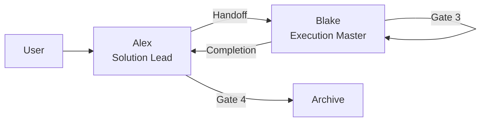

# Handoff: Cross-Model Orchestration — Phase 0 Real-Scenario Spikes
**From:** Alex (Agent A) | **To:** Blake (Agent B)
**Date:** 2026-05-03
**Project:** TAD Framework
**Epic:** EPIC-20260503-cross-model-orchestration.md (Phase 0/3)

---

## 🔴 Gate 2: Design Completeness

**执行时间**: 2026-05-03

| 检查项 | 状态 | 说明 |
|--------|------|------|
| Architecture Complete | ✅ | 3 个独立 spike，各自有明确输入/输出/判定标准 |
| Components Specified | ✅ | CLI 路径已验证（codex, gemini 均在 /opt/homebrew/bin/），调用模式已 spike 验证 |
| Functions Verified | ✅ | 调用模式来自已验证的 SPIKE-20260503（commit fcd0ea6） |
| Data Flow Mapped | ✅ | 每个 spike：真实输入 → CLI 调用 → 输出对比 → 判定 |

**Gate 2 结果**: ✅ PASS
**Alex确认**: Blake 可独立执行三个 spike。

---

## 📋 Handoff Checklist (Blake必读)

- [ ] 阅读了所有章节
- [ ] 阅读了「📚 Project Knowledge」章节中的历史教训
- [ ] 理解每个 spike 的触发条件、执行方法、判定标准
- [ ] 确认可以独立使用本文档完成三个 spike

---

## 1. Task Overview

**目标**：在真实场景中验证 3 个跨模型能力的实际价值（不是技术可行性——那已在 commit fcd0ea6 验证）。

**与可行性 spike 的区别**：
- 可行性 spike（已完成）：测试 CLI 能不能跑通 → 答案是 GO
- 本次 Phase 0 spike：测试跑通之后**输出质量是否比 Claude 单模型更好** → 答案可能是 INTEGRATE / SKIP / DEFER

**总时间预算**：3 小时硬上限（3 个 spike × 1 小时）。可以跨 session 完成。

---

## 2. Spike A: Codex Code Review（真实 diff 对比）

### 2.1 目标
验证 Codex PR review 是否能发现 Claude code-reviewer 漏掉的问题。

### 2.2 测试素材
使用 TAD 项目包含真实 bash 代码变更的 commit `95b154b`（pre-publish-cleanup: hook 脚本修改，71 行 .sh 变更）：
```bash
git diff 95b154b~1..95b154b -- '*.sh' > /tmp/spike-a-diff.txt
```

⚠️ 选此 commit 而非 fcd0ea6 的原因：fcd0ea6 全是 markdown/YAML 文档，对 code review 对比无意义（BA-P0-1 修复）。

### 2.3 执行步骤

**统一 prompt 模板**（两侧使用完全相同的 prompt，不给任何一方额外上下文——BA-P0-2 修复）：
```
Review this git diff for bugs, security issues, code quality problems, and architectural concerns.

Output findings in this exact format:
## Findings
| # | Severity | File | Issue | Suggestion |
|---|----------|------|-------|------------|

## Summary
- P0 (must fix): {count}
- P1 (should fix): {count}
- P2 (nice to have): {count}
```

**Step 1: Claude 审查（generic Agent，不用 code-reviewer persona）**
用 Agent tool 调 general-purpose 子 agent（不用 code-reviewer 子 agent，避免 Claude 侧有额外 TAD persona 造成不公平对比）。
将 diff 内容 + 上面的 prompt 模板作为 Agent prompt。
保存输出到 `.tad/evidence/spikes/SPIKE-20260503-phase0/spike-a-claude-review.md`

**Step 2: Codex 审查（`codex exec review --commit`）**
```bash
codex exec review --commit 95b154b --full-auto "Review for bugs, security issues, code quality problems, and architectural concerns. Output findings as a markdown table with columns: #, Severity, File, Issue, Suggestion. Then a Summary with P0/P1/P2 counts."
```
保存输出到 `.tad/evidence/spikes/SPIKE-20260503-phase0/spike-a-codex-review.md`

⚠️ `codex exec review --commit` 给 Codex 完整文件上下文（不只是 diff hunk），这与 Claude Agent tool 能读文件是对等的。
⚠️ 如果 `codex exec review` 不支持或报错，fallback 到：
```bash
{ echo "Review this git diff:"; echo ""; cat /tmp/spike-a-diff.txt; } | codex exec --full-auto "Review for bugs, security issues, code quality problems. Output as markdown table (Severity/File/Issue/Suggestion) + P0/P1/P2 counts."
```
⚠️ 记录每次调用的 wall-clock 时间（`time` 命令前缀）。

**Step 3: 对比**
逐条对比两个 review 结果（匿名化为 "Reviewer A" / "Reviewer B"，对比完成后再揭示来源——P2-1 盲评建议）：
- Reviewer A 发现但 B 没发现的 → 记录
- **B 发现但 A 没发现的** → 记录
- 两者都发现的 → 共识（高置信度）
- severity 不一致的 → 记录分歧
- 延迟对比：Claude 用时 vs Codex 用时

### 2.4 判定标准

| 结果 | 判定 |
|------|------|
| Codex 发现 ≥1 个 Claude 漏掉的 P0/P1 | **INTEGRATE** |
| 两者发现相同，无增量价值 | **SKIP** |
| Codex 输出格式不可用 / 需要大量手动整理 | **DEFER** |
| Codex 超额 / 调用失败 | 记录错误，fallback 到 Claude-only，标注 **DEFER** |

---

## 3. Spike B: Gemini Deep Research（真实调研对比）

### 3.1 目标
验证 Gemini 的研究能力是否比 Claude WebSearch ×5 更深、更有引用。

### 3.2 研究课题
使用一个 TAD 项目真实存在的待研究问题（从 NEXT.md 取）：

**课题**："AI CLI agent 安全最佳实践：哪些 bash 命令应该在 PreToolUse hook 中被 deny？（rm -rf, DROP TABLE 等）"

来源：NEXT.md "Add Bash command deny patterns to PreToolUse hook"

### 3.3 执行步骤

**Step 1: Claude WebSearch 研究（迭代式，模拟 Alex 实际行为）**
用最多 8 次 WebSearch 迭代研究同一课题。**不预设搜索词**——Blake 根据每次搜索结果自适应选择下一个 query（这是 Alex *discuss 的实际行为模式，不是批量执行预写 query）。
- 起始 query 建议："AI coding agent dangerous bash commands deny list 2026"
- 后续 query 根据前一轮结果迭代（发现新维度 → 搜新维度；覆盖不足 → 细化搜索）
- 记录每个 query 和选择原因
- 综合所有搜索结果，写一份 research summary
- 记录 wall-clock 时间
保存到 `.tad/evidence/spikes/SPIKE-20260503-phase0/spike-b-claude-research.md`

**Step 2: Gemini Deep Research（同一课题）**
```bash
gemini -p "Research the best practices for restricting dangerous bash commands in AI coding agents (like Claude Code, Codex CLI). What commands should be denied in a PreToolUse hook? Cover: destructive file operations (rm -rf), database operations (DROP TABLE), network operations (curl to internal services), privilege escalation (sudo, chmod 777), and git destructive operations (git push --force, git reset --hard). Provide specific command patterns with regex examples, cite sources, and compare how different AI agent frameworks handle this. Output a structured report with sections for each category."
```
保存到 `.tad/evidence/spikes/SPIKE-20260503-phase0/spike-b-gemini-research.md`

**Step 3: 对比**
- 引用数量：Gemini 有多少条引用 vs Claude 的 5 次搜索？
- 研究深度：Gemini 是否覆盖了 Claude 搜索没找到的维度？
- 实用性：哪个输出更接近"可以直接用"（具体的 regex 模式 vs 泛泛建议）？
- 时间成本：Gemini 一次调用 vs Claude 5 次搜索 + 手动综合

### 3.4 判定标准

| 结果 | 判定 |
|------|------|
| Gemini 研究深度显著优于 5×WebSearch（更多引用 + 更具体的建议） | **INTEGRATE** |
| 两者质量相当 | **SKIP** |
| Gemini 输出太泛 / 引用不可靠 / 幻觉多 | **SKIP** |
| Gemini 超额 / 调用失败 | 记录错误，标注 **DEFER** |

---

## 4. Spike C: Creative Capability（GPT Image-2 图片生成）

### 4.1 目标
验证 Codex 的 GPT Image-2 能否为 TAD 工作流生成有用的视觉产出。

### 4.2 测试场景
让 Codex 生成一张 TAD 框架的架构图：

### 4.3 执行步骤

**Step 1: 生成架构图**
```bash
codex exec --full-auto "Generate an architecture diagram image for the TAD (Triangle Agent Development) framework. The diagram should show:
- Terminal 1: Alex (Solution Lead) — blue color
- Terminal 2: Blake (Execution Master) — green color  
- Human bridge between them — orange color
- 4 Quality Gates (Gate 1-4) as checkpoints
- Arrow flow: Requirements → Alex designs → Handoff → Blake implements → Gates → Accept
Style: clean, professional, minimal. Use clear labels. Save the image."
```

**Step 2: 验证输出**
- 图片是否生成？检查 `~/.codex/generated_images/` 目录
- 图片质量是否可用？（清晰、标签正确、布局合理）
- 能否复制到项目目录作为文档附件？

**Step 3: 测试 Gemini 图片生成（对比）**
```bash
gemini -p "Generate an architecture diagram for the TAD framework showing: Terminal 1 (Alex, Solution Lead) → Handoff → Terminal 2 (Blake, Execution Master), with Human as bridge, and 4 Quality Gates as checkpoints. Clean, professional, minimal style." 2>&1 | tee /tmp/spike-c-gemini-raw.txt
```
⚠️ Gemini CLI 没有 `--save` flag（CR-P0-2 修复）。检查输出是否包含 base64 图片数据或 URL。如果 Gemini 不支持直接图片生成，记录失败原因。

**Step 4: Mermaid 基线对比（5 分钟）**
花 5 分钟写一个同等内容的 Mermaid 图作为基线：

INTEGRATE 判定要求：AI 生成的图比 Mermaid **提供了额外价值**（视觉美感、非框线布局、设计质量），否则 Mermaid 已经够用 → SKIP。

### 4.4 判定标准

| 结果 | 判定 |
|------|------|
| 至少一个平台生成可用的架构图（清晰 + 标签正确） | **INTEGRATE** |
| 图片生成但质量不够（模糊 / 标签错误 / 布局混乱） | **DEFER**（等模型改进） |
| 图片不能生成 / 功能不可用 | **SKIP** |

---

## 5. SPIKE-REPORT Template

Blake 的 SPIKE-REPORT.md 必须包含以下结构（BA-P0-3 修复）：

```markdown
# SPIKE-REPORT: Cross-Model Orchestration Phase 0

## Per-Spike Verdict Matrix
| Spike | Capability | Verdict | Key Evidence |
|-------|-----------|---------|-------------|
| A | Codex Code Review | INTEGRATE/SKIP/DEFER | {1-line reason} |
| B | Gemini Deep Research | INTEGRATE/SKIP/DEFER | {1-line reason} |
| C | Image Generation | INTEGRATE/SKIP/DEFER | {1-line reason} |

## Latency Comparison
| Spike | Claude-side | External-model-side | Delta |
|-------|-----------|-------------------|-------|
| A | {Xs} | {Ys} | {diff} |
| B | {Xs} | {Ys} | {diff} |
| C | N/A | {Ys} | N/A |

## Spike A: Codex Code Review
{对比表 + 分析}

## Spike B: Gemini Deep Research
{对比分析：引用数、深度、实用性}

## Spike C: Image Generation
{结果 + Mermaid 基线对比}

## Phase 1 Scope Recommendation
Based on verdicts:
- **INTEGRATE verdicts → Phase 1 协议设计范围**: {list capabilities}
- **SKIP verdicts → Phase 1 Anti-Scope**: {list excluded capabilities + why}
- **DEFER verdicts → 条件重测**: {list + 重测条件}

## Time Log
- Spike A: {duration}
- Spike B: {duration}
- Spike C: {duration}
- Total: {total}
```

---

## 6. Files to Create

| File | Purpose |
|------|---------|
| `.tad/evidence/spikes/SPIKE-20260503-phase0/SPIKE-REPORT.md` | 三 spike 综合报告 + 判定矩阵 |
| `.tad/evidence/spikes/SPIKE-20260503-phase0/spike-a-claude-review.md` | Spike A: Claude review 输出 |
| `.tad/evidence/spikes/SPIKE-20260503-phase0/spike-a-codex-review.md` | Spike A: Codex review 输出 |
| `.tad/evidence/spikes/SPIKE-20260503-phase0/spike-b-claude-research.md` | Spike B: Claude research 输出 |
| `.tad/evidence/spikes/SPIKE-20260503-phase0/spike-b-gemini-research.md` | Spike B: Gemini research 输出 |
| `.tad/evidence/spikes/SPIKE-20260503-phase0/spike-c-results.md` | Spike C: 图片生成结果记录 |

**Grounded Against** (Alex step1c):
- /opt/homebrew/bin/codex (verified exists)
- /opt/homebrew/bin/gemini (verified exists)
- Commit 95b154b exists as Spike A review target (71 lines .sh changes, `git diff --stat` verified)
- No existing target files to modify (spike creates new evidence only)

---

## 9. Acceptance Criteria

| AC# | Criteria | Verification |
|-----|----------|-------------|
| AC1 | Spike A 完成：Claude + Codex 都对同一 diff 产出 review | 两个 review 文件存在且非空 |
| AC2 | Spike A 对比表存在（Claude-only / Codex-only / 共识） | SPIKE-REPORT §Spike A 含对比表 |
| AC3 | Spike B 完成：Claude 5×WebSearch + Gemini 研究都产出报告 | 两个 research 文件存在且非空 |
| AC4 | Spike B 对比分析存在（引用数、深度、实用性） | SPIKE-REPORT §Spike B 含对比分析 |
| AC5 | Spike C 完成：至少尝试 1 个图片生成平台 | spike-c-results.md 存在 |
| AC6 | 每个 spike 有 INTEGRATE/SKIP/DEFER 判定 | SPIKE-REPORT 含判定矩阵（3 行） |
| AC7 | SPIKE-REPORT.md 含 Phase 1 范围建议 | SPIKE-REPORT §Phase 1 Scope 存在 |
| AC8 | 总时间 ≤3 小时 | SPIKE-REPORT 含时间记录 |
| AC9 | COMPLETION-REPORT.md 存在 | `test -f .tad/active/handoffs/COMPLETION-20260503-cross-model-phase0-spikes.md` |

---

## 9.1 Spec Compliance Checklist

| AC# | Verification Method | Expected | Verified Output |
|-----|--------------------|-----------|----|
| AC1 | `ls .tad/evidence/spikes/SPIKE-20260503-phase0/spike-a-*.md \| wc -l` | 2 | (post-impl) |
| AC2 | `grep -c "Claude-only\|Codex-only\|共识\|Consensus" SPIKE-REPORT.md` | ≥1 | (post-impl) |
| AC3 | `ls .tad/evidence/spikes/SPIKE-20260503-phase0/spike-b-*.md \| wc -l` | 2 | (post-impl) |
| AC4 | `grep -ci "引用\|citation\|source\|深度\|depth" SPIKE-REPORT.md` | ≥2 | (post-impl) |
| AC5 | `test -f .tad/evidence/spikes/SPIKE-20260503-phase0/spike-c-results.md` | exists | (post-impl) |
| AC6 | `grep -cE "INTEGRATE\|SKIP\|DEFER" SPIKE-REPORT.md` | ≥3 | (post-impl) |
| AC7 | `grep -c "Phase 1" SPIKE-REPORT.md` | ≥1 | (post-impl) |
| AC8 | `grep -ciE "时间\|time\|duration\|minutes\|hours" SPIKE-REPORT.md` | ≥1 | (post-impl) |

**AC Dry-Run Log** (Alex step1d at 2026-05-03):
- AC1-AC8: ✅ all post-impl-verifiable, syntax-validated (grep/ls/test patterns standard)

---

## 9.2 Expert Review

| Reviewer | Issue | Resolution Section | Status |
|----------|-------|-------------------|--------|
| backend-architect | P0-1: Spike A diff 全是 markdown 无代码 | §2.2 改为 commit 95b154b（71 行 .sh） | Resolved |
| backend-architect | P0-2: Claude 有 persona Codex 无 → 不公平 | §2.3 两侧用同一 generic prompt | Resolved |
| backend-architect | P0-3: Section 5 缺失，无 SPIKE-REPORT 模板 | §5 新增完整模板 | Resolved |
| backend-architect | P1-1: Spike B 5×WebSearch 是预设非迭代 | §3.3 Step 1 改为迭代式（最多 8 次） | Resolved |
| backend-architect | P1-2: Spike C 缺 Mermaid 基线对比 | §4.3 Step 4 新增 Mermaid 基线 | Resolved |
| backend-architect | P1-3: 三 spike 判定标准校准不一致 | §2.4 保留（spike 性质不同，允许不同 bar） | Acknowledged |
| backend-architect | P1-4: 无延迟/成本追踪 | §5 模板增加 Latency 表 + 各 step 加 time | Resolved |
| code-reviewer | P0-1: stdin+heredoc 冲突 diff 被丢弃 | §2.3 改用 `codex exec review --commit` | Resolved |
| code-reviewer | P0-2: `gemini --save` flag 不存在 | §4.3 Step 3 改为 `tee` 保存 | Resolved |
| code-reviewer | P0-3: 应用 `codex exec review --commit` | §2.3 Step 2 已采用 | Resolved |
| code-reviewer | P1-2: 缺 AC9 COMPLETION-REPORT | §9 新增 AC9 | Resolved |
| code-reviewer | P1-3: Spike B 搜索词预设不公平 | §3.3 改为迭代式 | Resolved |
| code-reviewer | P1-5: Spike C 图片输出路径未验证 | §4.3 Step 2 已含路径探索说明 | Acknowledged |

---

## 10. Important Notes

### 10.1 每个 spike 独立，可跨 session
3 个 spike 互不依赖。如果某个 spike 遇到额度问题（Codex/Gemini），跳过做下一个，回头再补。

### 10.2 原始输出 > 整理后输出
保存 CLI 的原始输出（包括 Codex session header 噪音）。原始数据对 Phase 1 协议设计更有价值。

### 10.3 失败也是有价值的数据
如果 Codex review 完全没有增量价值 → SKIP 判定是正确结果，不是失败。Phase 1 范围据此缩小。

### 10.4 Spike A 使用 Agent tool 调 code-reviewer
Spike A Step 1 需要 Agent tool 调 code-reviewer 子 agent（Claude 侧 review）。这与 Bash tool 调 Codex（Step 2）是对称的。

### 10.5 Spike B 的 WebSearch 模拟
Blake 执行 5 次 WebSearch 模拟 Alex 标准研究流程。这不违反 terminal 隔离——Blake 是在模拟 Alex 的搜索策略来产生对比基准，不是替代 Alex 做设计。

---

## 📚 Project Knowledge

### ⚠️ Blake 必须注意的历史教训

- **Gemini CLI: `-p` Flag Required (architecture.md, 2026-05-03)**: Gemini CLI 必须用 `-p` flag，否则在非 TTY 上下文挂起
- **Codex stderr benign noise (architecture.md, 2026-05-03)**: `failed to record rollout items` 是 benign log，用 exit code 判断成功/失败
- **Hook Shell Portability: No grep -P on macOS (architecture.md, 2026-04-03)**: macOS BSD grep 不支持 `-P`，用 `-E` 替代
- **`codex exec --full-auto` VALIDATED (architecture.md, 2026-05-02)**: 用 `echo "$prompt" | codex exec --full-auto -` 模式

### Required Evidence Manifest
```yaml
spike_report: ".tad/evidence/spikes/SPIKE-20260503-phase0/SPIKE-REPORT.md"
spike_a_claude: ".tad/evidence/spikes/SPIKE-20260503-phase0/spike-a-claude-review.md"
spike_a_codex: ".tad/evidence/spikes/SPIKE-20260503-phase0/spike-a-codex-review.md"
spike_b_claude: ".tad/evidence/spikes/SPIKE-20260503-phase0/spike-b-claude-research.md"
spike_b_gemini: ".tad/evidence/spikes/SPIKE-20260503-phase0/spike-b-gemini-research.md"
spike_c_results: ".tad/evidence/spikes/SPIKE-20260503-phase0/spike-c-results.md"
completion: ".tad/active/handoffs/COMPLETION-20260503-cross-model-phase0-spikes.md"
```

---

## 11. Decision Summary

| # | Decision | Options Considered | Chosen | Rationale |
|---|----------|-------------------|--------|-----------|
| 1 | Spike A review target | fcd0ea6 (markdown) / 95b154b (bash code) / 外部项目 | commit 95b154b (71 行 .sh 变更) | fcd0ea6 全是 markdown 无 review 价值（BA-P0-1），95b154b 有真实 hook 脚本逻辑 |
| 2 | Spike B research topic | 自由选题 / NEXT.md 待研究项 | NEXT.md 的 bash deny patterns | 真实待解决问题，研究结果直接可用 |
| 3 | Spike C creative test | Image-2 / Veo 3.1 / Lyria 3 | Image-2（架构图） | 对 TAD 文档最有直接用途 |
