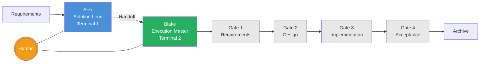

# Spike C: Image Generation Results

**Duration**: ~367s total (Codex ~120s generation + Gemini ~90s + overhead)

---

## Codex Image Generation — RESULT: SUCCESS ✅

**Invocation**: `codex exec --full-auto "Generate an architecture diagram image..."`
**Model**: Built-in `image_gen` tool (gpt-image-2) via ChatGPT account
**Output**: `assets/tad-architecture-diagram.png` (1774×887px, 852KB PNG)

### Image Quality Assessment
✅ Terminal 1 (Alex, Solution Lead) — correctly shown in **blue**
✅ Human Bridge — correctly shown in **orange** 
✅ Terminal 2 (Blake, Execution Master) — correctly shown in **green**
✅ 4 Quality Gates (Gate 1-4) — shown as numbered circles in bottom flow
✅ Arrow flow: Requirements → Alex designs → Handoff → Blake implements → Gates → Accept
✅ Clean, professional, minimal style
✅ Labels clear and correctly placed
✅ Codex automatically used `image_gen` built-in skill, then copied PNG to workspace

**Additional Codex behavior observed:**
- Codex proactively read `imagegen/SKILL.md` from its skills library
- Codex read `AGENTS.md` and project context before generating
- Codex auto-saved to `$CODEX_HOME/generated_images/` then copied to workspace
- stderr: `failed to record rollout items` (benign log per architecture.md lesson)

---

## Gemini Image Generation — RESULT: FAIL ❌

**Invocation**: `gemini -p "Generate an architecture diagram..."`
**Model**: Gemini CLI v0.39.1

**What Gemini did:**
1. Searched project for existing Mermaid diagrams (establishing style)
2. Read `AGENTS.md` and `.tad/config-quality.yaml` for TAD context
3. Attempted `run_shell_command` → ERROR: tool not found
4. Attempted `write_file` → ERROR: tool not found
5. Attempted `invoke_agent` → BLOCKED: unauthorized
6. Stuck in loop of blocked tool calls

**Key finding**: Gemini CLI's tool set in `gemini -p` mode is **read-only** (grep_search, read_file, glob only). Gemini interpreted "generate diagram" as "create Mermaid/code diagram" (not bitmap), and even that failed because it cannot write files or execute commands.

**Conclusion**: Gemini cannot generate images via `gemini -p`. No native image_gen equivalent. Even code-based diagram generation requires shell execution not available in Gemini's tool set.

---

## Mermaid Baseline (5-minute manual reference)

**Mermaid limitations vs Codex image:**
- Layout is automatic (less control) — Codex diagram has cleaner two-row layout
- No visual hierarchy for Human bridge (just an edge) — Codex shows it as a distinct colored node
- Gate nodes appear identical — Codex shows numbered circles
- Overall aesthetics: Codex significantly better (richer color, shadow, rounded corners, professional typography)

---

## Verdict Matrix

| Platform | Can Generate | Quality | Extra Value vs Mermaid | Verdict |
|----------|-------------|---------|----------------------|---------|
| Codex (GPT Image-2) | ✅ Yes | High — correct labels, colors, layout | Yes — substantially better visual quality | **INTEGRATE** |
| Gemini CLI | ❌ No (tool set read-only) | N/A | N/A | **SKIP** |

**Overall Spike C Verdict: INTEGRATE** (Codex image generation)

The Codex-generated TAD diagram is production-quality and directly usable as documentation asset. It correctly captured all 5 specified elements (Alex/blue, Human/orange, Blake/green, Gates 1-4, flow arrows). The Mermaid baseline is functional but aesthetically inferior and requires Mermaid renderer support.

**New constraint discovered**: Gemini CLI's `-p` mode is read-only — cannot write files or execute commands. Only suitable for research/analysis tasks, not artifact creation.
