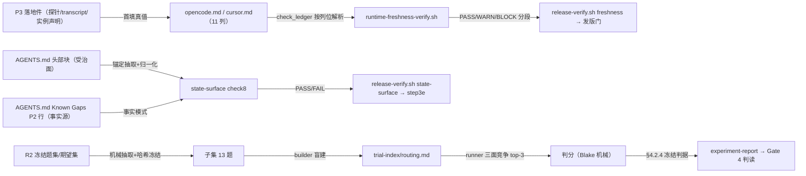

---
# Quality Chain Metadata (Alex 必填 - Phase 4 Hook 将基于此阻塞 Gate 3)
task_type: mixed       # code（两支检查/校验脚本扩类）+ docs（两份新台账、AGENTS.md 改写、实验件）
e2e_required: no      # 无运行时端到端面；组 2 实验的 runner 子会话即其行为面，证据走 run-trace
research_required: no # 组 2 是受控评估实验（判据先行、产物落 evidence），非开放研究

git_tracked_dirs: []

skip_knowledge_assessment: no

gate4_delta: []
---

# Handoff Document for Agent B (Blake)
## TAD v3.1 - Evidence-Based Development

**From:** Alex (Agent A - Solution Lead)
**To:** Blake (Agent B - Execution Master)
**Date:** 2026-10-06
**Project:** TAD 本体自查批 R3（TICKET-20261006-self-review-r3）
**Task ID:** TASK-20261006-SELF-REVIEW-R3
**Handoff Version:** 3.2.0
**Epic:** N/A（自查批，非 Epic）
**Supersedes:** N/A

> **依据链**：票 `.tad/active/TICKET-20261006-self-review-r3.md`；PM 判断正本
> `.tad/evidence/pm/2026-10-06-supplement2-judgment.md`＋追记
> `.tad/evidence/pm/2026-10-06-supplement3-judgment-addendum.md`；提案改法源
> tech-radar 仓 `consult/tad-sweep/proposal-supplement-3-howto.md`（与补充件二冲突处以三为准）。
> **批内不升版**：`.tad/version.txt` 保持 3.2.0，不打 tag；本批产物随下一版本点发布。

---

## 🔴 Gate 2: Design Completeness (Alex必填)

**执行时间**: 待 PM 组织双审后回填（Process Gate 2 = 盘上双份独立评审件，不等人工 `/gate 2` 指令）

### Gate 2 检查结果

| 检查项 | 状态 | 说明 |
|--------|------|------|
| Expert review complete (min 2) | ⏳ 待双审 | 拟派 fit 审＋tech 审两份独立评审件，落 `.tad/evidence/reviews/`，结论回填 §9.2 |
| All P0 resolved | ⏳ 待双审 | 双审 P0 须在开工前清零或经 PM sanctioned 豁免 |
| Architecture Complete | ✅ | 三组各自成件：组 1＝check8 断言＋豁免法三层＋五树 fixture；组 2＝盲法冻结实验；组 3＝双台账＋校验器显式枚举扩围 |
| Components Specified | ✅ | §4 组件规格逐项到文件、锚点、字段与行集；组 3 两台账逐行行集在 §4.3 定稿 |
| Functions Verified | ✅ | §5 MQ2 函数清单逐项盘上验存（文件＋行号） |
| Data Flow Mapped | ✅ | §5 MQ3：台账列位 ↔ 校验器解析列位对照表；组 2 数据流＝冻结件 → builder → runner → scorer 单向链 |
| Risk card | ✅ | 本批命中高风险触发项（发布门脚本改动＋全席装机文件 AGENTS.md 改动），风险卡 `.tad/evidence/self-review-r3-20261006/risk-card.md` 随本 HANDOFF 同批交付，证伪式假设表 ASM-1..3 |
| Load points declared | ✅ | §4.5 逐项列明每个新产物/条文的装载面与触发时点 |

**Gate 2 结果**: ⏳ PENDING（双审未跑，不许开工；双审 PASS 回填后方生效）

**Alex确认**: 设计要素已按仓内原件逐项验存；Blake 可仅凭本文档独立完成实现（双审通过后）。

---

## 📋 Handoff Checklist (Blake必读)

Blake在开始实现前，请确认：
- [ ] 阅读了所有章节（含 §4 三组设计正文与 §4.3 逐行行集）
- [ ] **阅读了「📚 Project Knowledge」章节中的历史经验**
- [ ] 所有"强制问题回答（MQ）"都有证据
- [ ] 理解了真正意图（不只是字面需求）
- [ ] 每个Phase的交付物和证据要求都清楚
- [ ] 确认可以独立使用本文档完成实现
- [ ] **组 2 红线**：你在组 2 中只做机械抽取与判分；建索引与跑题必须由两个彼此独立、且未读过题面/期望集的子会话完成（§4.2 角色分离），不许自建自跑

❌ 如果任何部分不清楚，**立即返回Alex要求澄清**，不要开始实现。

---

## 1. Task Overview

### 1.1 What We're Building

自查批 R3：把技术研究席提案补充件三（改法版）中经 PM 判断采纳的三条改法落进 TAD 本体——

1. **组 1 · 状态面关键词冲突断言**：给 `.tad/hooks/lib/state-surface-check.sh` 扩一类新检查
   **check8**——具名活状态面（首例：仓根 `AGENTS.md` 头部 Runtime status 段）与其事实源
   （同文件 Known Gaps 的 P2 已实施口径）出现关键词级矛盾即判红，治 2026-10-06「头部段说旧话、
   已随 v3.2.0 刷进全席装机」这类事故的复发。设计核心是先答**豁免法**（§4.1.2 三层构造），
   答得出才实施；fixture 用本次事故原文构造五棵正负控树（§4.1.4），正负控成对。
2. **组 2 · 借 4 解冻评估实验**：对「三层索引（wings/rooms/drawers）」做一次可复核的受控小实验：
   只取 incidents 语料建只读试验索引（盘层副本、不回写权威），用 R2 基线同题子集
   （incidents 8 题 Q33–Q40＋无答案 5 题 Q41–Q45）同口径复跑；判据数值在本 HANDOFF §4.2.4
   落字定案、开跑前冻结。产出实验报告＋立项/关闭判读（PM 在 Gate 4 终裁）。
3. **组 3 · C-12 台账补建**：照 Codex 台账同构，为 OpenCode、Cursor 各建一份 runtime-compat
   台账（`.tad/runtime-compat/opencode.md`／`cursor.md`），纳入 `runtime-freshness-verify.sh`
   校验面（缺文件/坏行＝wiring BLOCK），补触发条件，并把 `AGENTS.md` Known Gaps 的
   Deferred 行中 C-12 改写为具名条目（C-5/C-11 原样保留）。

### 1.2 Why We're Building It

**业务价值**：三条都是已实证的短板——状态面旧话已实际随发版扩散到全席装机；借 4 顺延无决策点
会无限期挂账；OC/Cursor 刚装上 hooks 却成唯一无新鲜度台账的运行时面。
**用户受益**：用户 2026-10-06 当面指令「采纳了就改吧」——判断已成，缺的是落地。
**成功的样子**：三组各自交付齐（票 Done 口径）：组 1 断言＋fixture 对全绿；组 2 实验报告＋判读落盘；
组 3 两台账入 freshness 面且复跑有终值、Deferred 行已改具名；Gate 4 PASS 后票 CLOSED。

### 1.3 🆕 Intent Statement（意图声明）

**真正要解决的问题**：把「已判断采纳的改法」变成「盘上可验的机制」，且每组的防复发/判读都必须
是机械可复核的，不许停在散文承诺。

**不是要做的（避免误解）**：
- ❌ 不是借 4 正式立项与实现——本批只出评估判读，立项与否 Gate 4 由 PM 终裁、另走票/Epic
- ❌ 不是给 check8 做全仓关键词扫描——辖区只限具名受治面（§4.1.2 第 1 层），全仓扫必误伤历史叙述
- ❌ 不是顺手刷新 Codex 台账的 C 类 2 条（context_compaction/trace_evidence_capture）——那是
  2026-10-10 补测小单与开放票 TASK-20260916 的面，本批 freshness AC 按双分支增量断言处置（§4.3.4）
- ❌ 不是升版、不是改 tad.sh、不是动 `.sync-conflict` 件、不是解 ChromaDB 许可核查（前置挂账，本批不解）

**Blake请确认理解**：
```
在开始实现前，请用你自己的话回答：
1. 三组各自的交付物是什么、各自的负控是什么？
2. 组 1 为什么必须先有豁免法才许写断言？豁免法三层各防哪类误伤？
3. 组 2 里为什么你不能自己建索引、自己跑题？判据数值在哪里冻结、冻结后能改吗？

只有Human确认你的理解正确后，才能开始实现。
```

### 1.4 卸载记录（Offload Log）

| 时间 | 卸载项 | 依据 | 原文指针 | 回取方式 |
|---|---|---|---|---|
| 2026-10-06 设计时 | patterns/ac-verification.md 与 patterns/shell-portability.md 全文未逐字读完（工具 100KB 上限截断，读至各自中段） | 本步只需其中与 fixture/AC 文法/列位解析相关条目，均在已读部分内 | `.tad/project-knowledge/patterns/ac-verification.md`（offset 216 起未读）、`patterns/shell-portability.md`（offset 201 起未读） | 需要时按 offset 续读 |
| 2026-10-06 设计时 | R2 HANDOFF 本体未读 | R2 基线四件与结果件已直读，口径以盘上结果件为准 | `.tad/archive/handoffs/`（R2 批 HANDOFF） | 需要时按文件名检索回读 |
| 2026-10-06 设计时 | 任务书所列 R2 基线路径 `g5-recall-baseline/` 目录与四件 json/md 文件名在盘上不存在 | 盘上实存为同目录平铺五件（`g5-recall-question-set.md` 等），已按实存件完成设计并在 §2.3 登记此冲突 | `.tad/evidence/self-review-r2-20261006/` 目录清单 | 以实存件为准；PM 验收时请核对此登记 |

---

## 📚 Project Knowledge（Blake 必读）

### 步骤 1：识别相关类别

本次任务涉及的领域：
- [x] testing - fixture 正负控、判据冻结、双分支增量断言
- [x] architecture - 检查脚本辖区设计、台账校验面枚举
- [x] code-quality - shell 脚本扩类的可移植性与自泄漏防护
- [ ] security / ux / performance / api-integration / mobile-platform — 不涉及

### 步骤 2：历史经验摘录

**已读取的 project-knowledge 文件**：

| 文件 | 相关记录数 | 关键提醒 |
|------|-----------|----------|
| principles.md | 3 条直接相关 | ①「Deny-List Beats Allow-List」修订段：集合有界且排除项可完整枚举才谈方向，校验辖区先问边界；②「Coverage Gate 全局计数下限测不出 must-cover 丢失」：保全类校验须按类别/辖区限定，不用全局计数；③「Measure Before Optimizing」：先测基线再设计（组 2 实验即此） |
| patterns/ac-verification.md | 6 条直接相关 | 见下方历史教训 1–4 |
| patterns/shell-portability.md | 4 条直接相关 | 见下方历史教训 5–6 |
| patterns/memory-and-learning.md | 2 条直接相关 | ① Drift-Check/Staleness：跨链共享文件要 allowlist、陈旧检测要留 quieting 路径防告警疲劳；②「摘要会压掉结论」：写进判据的事实必须回读原文——组 2 基线数一律引 R2 结果件原文，不引二手摘要 |
| patterns/runtime-adapter-instance-opencode.md / -cursor.md | 各 1 件（六维声明） | 组 3 两台账逐行行集的事实源（版本、点位映射、残项 R-OC-1/R-OC-2/R-CU-1） |

**⚠️ Blake 必须注意的历史教训**：

1. **[AC 判别力] 空集真空通过**（ac-verification「Verification Commands That Read the Git Index Are Vacuous Before Staging」「AC realism」）
   - 问题：枚举集为空时校验平凡通过；PASS 行不存在也读作绿。
   - 解决方案：本批所有「检查已生效」类 AC 都要求断言目标行**在场**（如 freshness 输出含 `[opencode]` 平台行、state-surface 输出含 `PASS check8` 行），不许只看退出码。

2. **[AC 双分支] 退出码 0 断言与合法 BLOCK 态不可兼得**（ac-verification「Exit-0 ACs Are Unsatisfiable…Use Two-Branch Delta Assertions」）
   - 问题：freshness 现行基线就有 1 个合法 BLOCK（codex context_compaction，归 10-10 补测小单）；若 AC 写「freshness exit 0」即不可满足，且会逼实施者去改日期造绿。
   - 解决方案：组 3 freshness AC 写成双分支增量断言（§4.3.4／AC-G3-3）：新面全 PASS、BLOCK 集恒等于预登记残差集、总量增量恰为 19；**严禁**为凑绿改 codex.md 的日期/状态或改校验器判据表。

3. **[章节作用域] 校验边界须与受治位置同语义**（ac-verification「Section-Scoped Checks Must Share the Governed Location's Exact Boundary Semantics」「A Count-Based AC Constrains the Total, Not the Location」）
   - 问题：整文件 grep 会在错误位置判绿；`/start/,/end/` 范围式抽取会自吞。
   - 解决方案：check8 的受治块抽取用状态式 awk（命中锚点后逐行收集连续 `>` 行），不用范围式；组 3 AGENTS.md 改写 AC 用逐项 per-term 断言（不用合并计数）。

4. **[逐项断言] 合并计数双向失真**（ac-verification 同条 mirror 段，TASK-20261004 Gate 2 C-T2 先例）
   - 问题：`grep -cE 'a|b'` 一条可低估合规散文、一条可被重复词灌满造假绿。
   - 解决方案：本批多词存在性 AC 一律 per-term 循环逐项断言并点名缺项。

5. **[shell 可移植] 本机实测陷阱四件**（shell-portability）
   - `grep -F` 关掉锚点语义（`$` 变字面）——check8 的 stale 模式含 `**` 等元字符，一律 `grep -F` 固定串匹配，位置靠抽取而非锚点；
   - awk 对 CJK 串相等恒真——本批比较一律走 `grep -Fx`/`cmp`/数值比较；豁免字面量遮蔽用 `index()` 定位（`index()` 是该文件实证安全的唯一 awk 串操作）；
   - ugrep 对以 `-` 开头的模式须 `-e` 传参；
   - AC/脚本只用基线工具集（grep/awk/sed/comm/cmp），不许 `rg`、不许 `grep -P`、不许 `import yaml`。

6. **[命令替换吞标记] $() 内 exit 只终子壳**（shell-portability「Command Substitution Swallows Gate Markers」）
   - 问题：校验器在 $() 里打印 GATE 标记会被捕获丢失。
   - 解决方案：check8 与 freshness 扩围都只在主脚本层打印与退出（现行脚本既有形态，扩类照此）。

### Blake 确认

- [ ] 我已阅读上述历史经验
- [ ] 我理解需要避免的问题
- [ ] 如遇到类似情况，我会参考上述解决方案

---

## 2. Background Context

### 2.1 Previous Work

- **R1/R2 自查批**已立先例：state-surface 检查（check1–7）与「版本分诊 live/legacy 口径」
  （`.tad/evidence/releases/3.2.0-version-triage.md`：live 23 处改、残 41 处按 legacy/fixture/归档等
  类别登记豁免）是组 1 豁免法的同构前例；R2 组 5 已立召回基线（组 2 的对照基线）。
- **publish-protocol step3e 第 4 项**（2026-10-06 补）：「散文状态面回读」是组 1 落地前的过渡控制，
  组 1 落地后**保留不删**（脚本查字面、人工查语义，两层互补——删了它，Epic Status 行那类面又成盲区）。
- **Epic Phase 3** 已给 OC/Cursor 装上 hooks 并留下活体 PASS 基线（组 3 首填真值来源）；
  C-12 当时以「不在本 Phase 夹带、是否立项另议」排除，本批正式补建。

### 2.2 Current State（设计时盘面实测，2026-10-06）

| 面 | 现状 |
|---|---|
| state-surface-check.sh | check1–7，活仓实跑 exit 0（§9.1 P-1）；无关键词冲突类断言 |
| AGENTS.md 头部段 | 已由 PM 回写为三家 hook-enabled 口径（提交 a1c3dffd）；旧文在 git 历史 `a1c3dffd^:AGENTS.md` L9–16，sha256 见 §9.1 P-2 |
| AGENTS.md Known Gaps | L177 附近：P2 已实施 bullet 在册；L178 Deferred 行含 C-5/C-11/C-12 三件（grep 实测 C-12 恰 1 次） |
| runtime-compat/ | 仅 `codex.md`（Ledger Version 2，12 条）与 `claude-code.md`（RETIRED 不设门）；无 opencode.md/cursor.md |
| runtime-freshness-verify.sh | 台账枚举为脚本内显式清单（codex 必备 exit 2＋claude retired 跳过）；活仓实跑（TODAY=2026-10-06）：Total 12｜PASS 10｜WARN 1｜BLOCK 1（codex context_compaction），exit 1（§9.1 P-3） |
| R2 召回基线 | incidents Recall@3 4/8、Recall@1 2/8、无答案误报 3/5；题集/期望集 sha256 与 R2 记录值逐字相同（§9.1 P-4）；incidents 语料 25 件 |

### 2.3 Dependencies

- 组 2 依赖 R2 基线四件（盘上实存名）：`.tad/evidence/self-review-r2-20261006/` 下
  `g5-recall-question-set.md`、`g5-recall-expected-set.md`、`g5-recall-run-trace.md`、
  `g5-recall-baseline-result.md`（任务书所列 `g5-recall-baseline/` 子目录与 json 文件名不存在，
  以实存件为准——此冲突已登记 §1.4 并报 PM）。
- 组 3 依赖 P3 落地件：`.tad/evidence/designs/2026-10-06-p3-phase0-probes.md`、
  `.tad/evidence/live-regression/opencode-20261006.md`／`cursor-20261006.md`、
  `.tad/project-knowledge/patterns/runtime-adapter-instance-opencode.md`／`-cursor.md`
  （四件设计时均已验存）。
- 无外部依赖、无新连接器、无网络调用。组 2 builder/runner 子会话由 Blake 在实施环境内 spawn，
  若环境不许 spawn 独立子会话 → §8.4 摩擦项 BLOCKED，不许降级为自建自跑。

---

## 3. Requirements

### 3.1 Functional Requirements

- FR1（组 1）：state-surface-check.sh 新增 check8（关键词冲突断言），辖区、抽取、判读语义与豁免
  机制按 §4.1 落地；既有 check1–7 行为逐字不变；脚本头注释同步增一行 check8 说明。
- FR2（组 1）：五棵 fixture 树＋runner 落 `.tad/evidence/self-review-r3-20261006/`，五树期望
  （§4.1.4 表）全数成立，runner 退出 0。
- FR3（组 2）：试验索引按 §4.2 构造法建成（盘层副本、wings/rooms/drawers、builder 盲法），
  13 题同口径复跑完成，实验报告含逐题对照与按冻结判据的判读结论。
- FR4（组 2）：权威面零回写——incidents 语料＋三索引面的前后 sha256 清单逐字相同。
- FR5（组 3）：`.tad/runtime-compat/opencode.md`（10 行）与 `cursor.md`（9 行）按 §4.3 行集建成，
  列位与 codex.md 逐字同构，首填值全部指到 §4.3 所列盘上出处。
- FR6（组 3）：runtime-freshness-verify.sh 显式枚举扩围至四台账（codex 必备、claude retired 跳过、
  opencode/cursor 必备），缺文件/坏行均 exit 2；判据表（年龄阈值、安全面名单、退出码语义）不变。
- FR7（组 3）：两份控制树（缺文件/坏日期）实跑均 exit 2，控制日志落盘。
- FR8（组 3）：AGENTS.md Known Gaps 按 §4.3.5 改写稿逐字落地：Deferred 行去掉 C-12、C-5/C-11
  原样保留、新增 C-12 具名条目（含台账路径、校验面、触发条件）。

### 3.2 Non-Functional Requirements

- NFR1 可移植：全部脚本/命令只用 bash＋grep/sed/awk/comm/cmp 基线工具，BSD/GNU 双兼容，
  无 `grep -P`、无 `rg`、无 python 依赖（patterns/shell-portability）。
- NFR2 判别力：每类新断言必须有成对负控证明「能红」：组 1 五树、组 3 两控制树、组 2 冻结哈希。
  只绿不红的校验按未建成论。
- NFR3 诚实分段：freshness 终值如实分段报告（总/PASS/WARN/BLOCK 与 BLOCK 集），
  预登记残差（codex context_compaction BLOCK）不许以改日期、改状态、改判据表方式消除。
- NFR4 零越界：写集恰为 §7 清单；组 2 写集不出 `.tad/evidence/self-review-r3-20261006/`；
  全批不升版、不打 tag、不动 `.sync-conflict` 件、不改 codex.md 任何行。

### 3.3 Optimization Target

不设 §3.3 数值优化目标（组 2 的判据数值是验收判据、非 Ralph 优化目标，见 §4.2.4）。

---

## 4. Technical Design

### 4.1 组 1 · 状态面关键词冲突断言（check8）

#### 4.1.1 组件规格

- **改动文件**：`.tad/hooks/lib/state-surface-check.sh`（唯一改动文件）。在 check7 之后、
  汇总段之前插入 check8 代码块；脚本头注释 Checks 清单增一行 check8 说明。
  复用既有 `pass()`（L65）/`fail()`（L66）助手——`fail()` 自增全局计数，退出码语义自动继承
  （任一 FAIL → 汇总 exit 1）。不新增退出码、不改汇总段。
- **装载面不变**：`release-verify.sh state-surface` 子命令（L800 转调）与 publish-protocol
  step3e 第 2 步调用的都是本脚本，check8 随之自动进入发版收口面，**不许也不需要**改
  release-verify.sh 与 publish-protocol 文本。

#### 4.1.2 豁免法（本组先行问题——结论：可落地，按三层构造实施）

票面要求：历史叙述面合法引用旧文如何不误伤，答不出则本组判不实施。设计结论是**答得出**，
豁免不靠「扫的时候跳过像历史的部分」这类语义猜测，而靠三层机械构造叠加——任一层独立成立、
三层合取后误伤面只剩「受治块内、命中旧文模式、且未逐字登记」三条同时成立的文本，
而那正是事故本体：

| 层 | 构造 | 防的误伤 | 前例 |
|---|---|---|---|
| 1 辖区枚举 | check8 只扫**具名配对登记表**里的受治面：每对＝（受治文件＋受治锚点＋事实源文件＋事实源锚点＋旧文模式集）。登记表之外的一切文件/章节天然不在辖区——证据、归档、CHANGELOG、handoff、fixture 文档里引用旧文再多也不扫 | 全仓/整文件扫描把历史叙述、事故记录、引用原文一并判红 | 本脚本既有契约「scan surface is an explicit file list — the list itself is the exclusion contract」；版本分诊 live/legacy 口径（legacy 面不进 live 清单即豁免） |
| 2 锚定抽取 | 受治文件内只抽**锚点块**：头部段＝自 `^> \*\*Runtime status` 行起连续 `>` 行构成的 blockquote 块；块外一切文本（同文件内的历史小节、脚注、变更说明）不进比对 | 同一文件里合法的历史回顾段落被同文件的新断言误伤 | 本脚本 check3 的 P2 口径（裸 `(vX.Y)` 只在头部行/关键词锚行上报）、check5（只扫 session-state 头部索引块、正文永不扫） |
| 3 逐字豁免登记 | 每对可携带**逐字豁免清单**：登记的是归一化后的确切字面串（带日期与理由注释），比对前先把豁免串从抽出块中遮蔽移除，余下才查旧文模式。豁免只认逐字全等，不认正则、不认「意思相近」；登记的豁免串若在块中已不存在，只报 INFO 提示登记卫生，不判 FAIL（防清理豁免反被罚） | 受治块内确需引用旧文的合法形态（如块内加「此前写 X、已被 Y 取代」的更正注）被一刀切判红 | 版本分诊的类别豁免登记（41 处残项逐类登记）；check4 OLD_PAT 的「维护点＋注释说明」形态 |

**残余风险（如实写明）**：三层之后仍有一种误伤可能——有人把一句合法的历史回顾直接写进受治块
且未登记豁免。此残余不靠机制消解，靠判读纪律：check8 的 FAIL 文案必须点名命中的模式与配对号，
处置路径是「改写该句／逐字登记豁免」二选一并留痕，与 step3e 第 4 项人工回读互为备份。
此残余面恰是本断言要守的面本身，故可接受；Gate 2 tech 审如不同意第 3 层（认为豁免登记开口过大），
可单独否决第 3 层、保留 1＋2 层实施——三层可拆，设计不绑死。

#### 4.1.3 断言语义（配对登记表 · 首对即本批唯一对）

**PAIR-1**：
- 受治面：仓根 `AGENTS.md`，锚点块＝Runtime status blockquote 块（抽取法见下）。
- 事实源：同文件 `## Known Gaps (OpenCode / Cursor)` 节内 P2 bullet
  （行首锚 `- **P2 — Hook adapters`）；事实模式＝该行含字面 `(implemented`。
- 旧文模式集（归一化后字面串，全部出自 2026-10-06 事故原文）：
  `no lifecycle hooks`；`the **hook-enabled** runtime`；`currently get skills + routing + packs`。
- 豁免清单：初始登记 1 条（供 exempt 树验证机制，形态即预期真实用途）：
  字面串 `had "no lifecycle hooks"; superseded by Epic Phase 3`，
  注释注明「块内更正注引用旧文的合法形态，2026-10-06 登记」。

**抽取与归一化**（实现要点，逐项照做）：
1. 受治块：状态式 awk 自锚点行起收集连续以 `>` 开头的行（锚点本身未命中 → 受治锚缺失分支）。
   不用 `/start/,/end/` 范围式（patterns/ac-verification 章节边界条）。
2. 归一化：逐行剥去行首 `>` 与其后至多一个空格 → 以单个空格连接成一行 → 连续空格压成一个。
   （事故原文 `but **no lifecycle` 与下一行 `> hooks**` 归一化后成 `but **no lifecycle hooks**`，
   模式 `no lifecycle hooks` 命中——跨行折行必须先归一化再匹配，这是本断言的承重细节。）
3. 事实源行：`## Known Gaps` 节内 grep 首个行首锚命中行；节或行缺失 → 不可判分支。
4. 匹配：一律 `grep -F` 固定串（模式含 `**` 元字符，禁用 -E）；位置由抽取保证，不用 `^/$` 锚。
5. 豁免遮蔽：对每条登记豁免串，用 awk `index()` 定位并切除（`index()` 是本仓实证安全的串操作；
   禁用 awk 串相等比较、禁用 `${var//pat/}` glob 替换——豁免串含引号与标点，glob 会误义）。

**判读分支**（fail-closed 优先，照 patterns/ac-verification 不可判输入条）：
| 情形 | 结果 |
|---|---|
| 受治锚缺失 | FAIL check8（点名「governed surface anchor missing」——受治面消失＝登记腐坏，必须红） |
| 事实源锚缺失 | FAIL check8（点名「fact-source anchor missing」——不可判 ≠ 通过） |
| 事实源在场但事实模式不命中 | PASS check8＋INFO 行（源未断言已实施，旧文模式不构成矛盾） |
| 事实成立＋豁免遮蔽后任一旧文模式命中 | FAIL check8（点名命中的模式字面与 `PAIR-1`） |
| 事实成立＋无命中 | PASS check8 |
| 登记豁免串在块中不存在 | 附加 INFO 行（登记卫生），不改判读 |

#### 4.1.4 Fixture 设计（五树＋runner）

- **落点**：树根 `.tad/evidence/self-review-r3-20261006/g1-fixtures/<tree>/`；
  runner `.tad/evidence/self-review-r3-20261006/g1-fixture-runner.sh`（R2 组 3 fixture 先例：
  runner 与日志同落批证据目录）；日志 `g1-fixture-<tree>.log` 与汇总 `g1-fixture-summary.log`。
- **共享骨架**（五树相同，仅 AGENTS.md 按树变体）：使 check1–7 在每棵树上全 PASS，
  于是退出码与 FAIL 行可唯一归因于 check8——
  `.tad/version.txt`＝`3.2.0`；`NEXT.md` 前 15 行内含 `当前版本：3.2.0`；
  `ROADMAP.md` 首 6 行内含 `for v3.2.0`；`README.md`／`INSTALLATION_GUIDE.md`／
  `PROJECT_CONTEXT.md`／`docs/MULTI-PLATFORM.md` 各一行 `# stub`（零版本字面）；
  `.tad/active/session-state.md` 以 blockquote 索引行 `` > INDEX: `.tad/project-knowledge/principles.md` `` 开头、
  其后 `## Body` 标题；`.tad/project-knowledge/principles.md` 一行 stub；
  `.tad/brain-index.md` 前 20 行内含 `Generated: 2026-10-06`。
  AGENTS.md 变体共同部分：`## Knowledge Ingress` 节仅一行
  `- Every role activation reads \`.tad/project-knowledge/principles.md\` first.`
  （check6 恰抽出此 1 条无条件路由且实存）。
- **两段逐字原文**（禁止手抄，一律机械抽取并记录 sha256）：
  旧头部块：`git show a1c3dffd^:AGENTS.md` 中自 `^> \*\*Runtime status` 起的连续 `>` 块
  （设计时实测该块 sha256＝`8370d424a387d7608e019f9f0860d26ce2ca8090ab595a20e45d389b62b49f32`，
  抽取命令见 §9.1 P-2，Gate 3 复算须逐字相同）；
  现行头部块：活仓 `AGENTS.md` 同锚抽取（实施时抽取并记录 sha256 入 fixture 构建日志）。
  P2 bullet：活仓 AGENTS.md Known Gaps 节 P2 行整行逐字（组 3 的改写不触此行，五树建成后组 3 再改
  Deferred 行也不影响 fixture——fixture 是冻结副本，这正是要点）。
- **五树与期望**（runner 逐树断言退出码＋check8 行，其余 check 行须全 PASS）：

| 树 | AGENTS.md 变体 | 期望退出 | 期望 check8 行 |
|---|---|---|---|
| `pos` | 现行头部块＋P2 bullet | 0 | `PASS check8` 在场 |
| `neg` | 旧头部块（事故原文）＋P2 bullet | 1 | 恰一条 FAIL 且为 check8、点名模式 `no lifecycle hooks` |
| `exempt` | 现行头部块＋块内更正注行 `> Historical note (2026-10-05): this block previously stated that OpenCode and Cursor had "no lifecycle hooks"; superseded by Epic Phase 3.`＋P2 bullet | 0 | `PASS check8`（豁免遮蔽生效） |
| `outside` | 现行头部块＋P2 bullet＋块外 `## Historical Notes` 节含句 `Before 2026-10-06 this file stated that OpenCode and Cursor had no lifecycle hooks.` | 0 | `PASS check8`（锚定抽取不扫块外） |
| `undecidable` | 现行头部块＋Known Gaps 节仅含 P4 bullet（P2 bullet 缺失） | 1 | `FAIL check8` 点名 fact-source anchor missing |

- **runner 语义**：逐树以 `bash <仓>/.tad/hooks/lib/state-surface-check.sh --repo <树绝对路径>` 实跑，
  输出落该树日志；逐树断言（退出码／FAIL 行计数／check8 行字面）后打印汇总；
  任一断言不成立 runner 退出 1 并点名树与项。runner 自身只用基线工具。

### 4.2 组 2 · 借 4 解冻评估实验

#### 4.2.1 实验面与产物清单（全数落 `.tad/evidence/self-review-r3-20261006/g2-borrow4-trial/`）

| 产物 | 内容 |
|---|---|
| `questions-subset-13.md` | 自 R2 题集机械抽取 Q33–Q45 题面（按题号行抽取，不改字），落盘即算 sha256 记入 build-record |
| `expected-subset-13.md` | 自 R2 期望集机械抽取 Q33–Q45 行，同上冻结；**runner 与 builder 均禁读** |
| `authority-manifest-before.sha256` / `-after.sha256` | 语料 25 件＋`incidents/_index.md`＋`brain-index.md`＋`patterns/_index.md` 共 28 行 sha256 清单，建索引前与判分后各算一次，须逐字相同 |
| `trial-index/drawers/` | 25 件 incident 原文的 `cp` 副本（一件一 drawer，文件名与原文件同 stem） |
| `trial-index/routing.md` | runner 唯一可读的试验面：wing→room→drawer 树形渲染，每 drawer 恰一行 hook |
| `build-record.md` | 构造记录：wing/room/drawer 全树清单与计数、抽取命令、全部冻结件 sha256、builder 读物清单与禁读声明 |
| `run-trace.md` | 跑题留痕：runner 读物清单与声明、起止时间、逐题返回序列、routing.md 冻结 sha256 |
| `experiment-report.md` | 逐题对照表（基线判定 vs 本轮 top-3 与判定）、三项指标、本轮判读（按 §4.2.4 机械套用）、ChromaDB 挂账注记 |

#### 4.2.2 试验索引构造法（builder 子会话执行；Blake 只验构造记录、不亲手写 hook）

- **Wing 规则（机械，禁自创）**：取 `incidents/_index.md` 每条的 `linked:` 字段归一化为 L2 文件 slug
  （如 `ac-verification`、`pack-evaluation`、`shell-portability`、`gate-design`、`pack-build-rules`、
  `research-methodology`、`memory-and-learning`）；linked 指向 L1 principles 的条目归 wing `principles-linked`。
  预期 wing 数 8（以 build-record 实数为准，Gate 3 按 _index 逐条复算映射）。
- **Room 规则**：wing 内按故障主题聚类，每 wing 1–4 个 room，room 名由 builder 据 incident 标题自拟；
  全树（wing→room→drawer 归属）在 build-record 中先行落字，落字后不许因跑题结果回改（跑题在建索引之后，
  且 builder 不参与跑题——见 §4.2.3 角色分离）。
- **Drawer 规则**：一 incident 一 drawer；routing.md 中每 drawer 恰一行：
  `- <stem> — <关键词组>; <一句话要旨>`，整行 ≤160 字符；要旨必须据 drawer 原文写，
  且至少含一个该 incident 特有的判别词（工具名/标志位/命名规则/阈值——照 pack-evaluation
  anti-slop 口径：泛领域名词不算）。drawer 副本只作 hook 的写作依据，**runner 禁读 drawers/**。
- **只读机械保证**：构造全程只许 `cp` 出、不许写回源路径；索引根在本批 evidence 目录内，
  天然不在 `.tad/project-knowledge/` 权威树下；前后清单（产物表第 3 行）为对账凭据。

#### 4.2.3 跑题协议（与 R2 同口径；唯一变量＝incidents 路由面）

- **槽位竞争保真（承重）**：runner 的检索面与 R2 相同为三面、面序相同
  （① `.tad/brain-index.md` → ② `.tad/project-knowledge/patterns/_index.md` → ③ incidents 面），
  唯一替换：③ 由 `incidents/_index.md` 换成 `trial-index/routing.md`。三面共同竞争 top-3，
  面内按行序、去重取前 3——若只让 runner 看试验索引，top-3 必被 drawer 填满、召回机械虚高，
  与基线不可比；此保真不可省。
- **runner**：独立子会话，只见 `questions-subset-13.md` 与上列三面；逐题返回 top-3 候选序列
  （③ 面候选记 drawer stem）；允许返回空候选（无答案题口径同 R2）。禁读：语料本体、
  drawers/、expected-subset、R2 结果件、build-record。读物清单与声明记入 run-trace。
- **判分（Blake 机械执行）**：drawer stem ↔ incident 文件为恒等映射（build-record 在册）；
  Q33–Q40 命中＝期望 incident 文件 ∈ top-3（文件级粒度，同 R2）；Q41–Q45 给出任一候选＝误报。
  判分在 routing.md 与 expected-subset 双冻结后进行，判分表入 experiment-report。

#### 4.2.4 判据数值（本 HANDOFF 落字定案，双审通过即冻结，实施开跑后不许改）

| 项 | 定案值 |
|---|---|
| 主指标 | incidents Recall@3（Q33–Q40，文件级，同 §4.2.3 口径）；基线 **4/8** |
| 守门指标 | 无答案误报数（Q41–Q45）；基线 **3/5** |
| 附值（只报不判） | incidents Recall@1（基线 2/8）；逐题命中位 |
| **立项建议线** | Recall@3 **≥ 6/8**（较基线 +2 题）**且**误报 **≤ 3**（不升）→ 报告判读＝**建议立项**（正式立项另走票/Epic，PM Gate 4 终裁） |
| **关闭线** | 其余一切结果（含 Recall@3＝5/8）→ 报告判读＝**关闭记因**：报告须逐项写明未达哪条线；5/8 记为「marginal：低于预登记线」 |
| 冻结与失效 | 判据冻结时点＝本 HANDOFF Gate 2 PASS；题子集、期望子集、routing.md 各以 sha256 冻结于跑题前；任一冻结件在跑题后哈希不符、或任一禁读路径被打开（以 run-trace/build-record 读物声明与盘面时间为据）→ 本轮判读＝**INVALID** 并记成因，INVALID 不得被用来支持立项；本批内不许改判据重跑，再测须新票预登记新判据 |
| 向量后端 | 试验期禁用；ChromaDB 许可核查维持挂账、报告末节注记，本批不解 |

### 4.3 组 3 · C-12 台账补建

#### 4.3.1 两份台账的格式契约（格式即解析契约，先读懂再建）

`runtime-freshness-verify.sh` 的 `check_ledger()`（L68）按**列位**解析台账表：
`$2`=surface、`$7`=last_verified、`$8`=volatility、`$9`=next_review、`$12`=status
（awk -F'|'，含行首空位）。故两份新台账必须与 codex.md **逐字同构的 11 列表头**
（surface｜owner｜current_behavior｜source｜runtime_version｜last_verified｜volatility｜
next_review｜regression_required｜fallback_behavior｜status），且：
- 表头行须匹配校验器锚 `^\|[[:space:]]*surface[[:space:]]*\|.*owner`，其后紧跟分隔行；
- 单元格内**禁出现字面 `|`**（会错列位）；日期列只许 `YYYY-MM-DD`；volatility 只许 high/medium/low；
- status 取值照 codex.md 在册集：verified／verified_partial／accepted_limitation
  （`unknown_current_behavior` 在安全面名单上的行会直接 BLOCK，本批新行一律不用此值）；
- 安全面名单（校验器 L16：hooks ask_user_question_hook sandbox_approval_permissions
  trace_evidence_capture subagents_custom_agents context_compaction）对所有台账同等生效——
  新台账中同名行的 status 均非 unknown，故不新增 BLOCK（设计已核）。

文件头照 codex.md 形态：标题、`**Platform:**`、`**Ledger Version:** 1`、`**Last Updated:** 2026-10-06`、
`**Source:**` 行（写 P3 探针件＋两份 transcript＋两份实例声明的路径）、Drift Response Policy 节
（Detected 路径用本平台 slug）、Recheck triggers 行（§4.3.3）。

#### 4.3.2 逐行行集（首填真值；出处缩写：INS-OC/INS-CU＝两份实例声明，PROBE＝p3-phase0-probes，TR-OC/TR-CU＝两份 2026-10-06 活体 transcript，均 PASS）

**opencode.md**（owner 一律 `opencode_adapter`，runtime_version 一律 `opencode 1.18.33`，
last_verified 一律 2026-10-06）：

| # | surface | current_behavior（要点，落盘时成句） | source | vol | next_review | regr | fallback | status |
|---|---|---|---|---|---|---|---|---|
| 1 | entry_headless | `opencode run --model <id>` 无头面；stdin 必须关闭（`</dev/null`），不关则进程无限阻塞、零输出（Phase 0 首跑实证） | INS-OC ①＋PROBE OC-6 | high | 2026-11-05 | no | 交互式 TUI 会话 | verified |
| 2 | skill_loading | `.agents/skills/` 为一等发现路径；`/alex` `/blake` 调用成立 | INS-OC ③＋TR-OC | high | 2026-11-05 | no | 直读引用文件 | verified |
| 3 | agents_guidance_AGENTS_md | AGENTS.md 被原生读取 | INS-OC＋TR-OC | medium | 2026-12-05 | no | 直读文件 | verified |
| 4 | hooks | 适配件 `.opencode/plugins/tad-hooks.ts`（tad.sh 单文件投影）；四点位 session.created／experimental.session.compacting／tool.execute.after(write,edit)／session.compacted 映射共享 `.tad/hooks/*.sh` | INS-OC ③＋TR-OC＋raw trigger traces | high | 2026-11-05 | yes | 手工门前检查（pre-accept/pre-gate） | verified |
| 5 | session_start_context_injection | R-OC-1：无 SessionStart 上下文注入面；session.created 只触发副作用，compacting push 为部分对等 | INS-OC ⑥＋TR-OC 第 5 字段 | high | 2026-11-05 | yes | compacting 点位提醒 push | accepted_limitation |
| 6 | ask_user_question_hook | R-OC-2：无头面无 question 工具，ask-user 捕获不注册 | INS-OC ⑥ | high | 2026-11-05 | yes | 编号选项纯文本回退 | accepted_limitation |
| 7 | sandbox_approval_permissions | config `permission` 面可编程；`edit: deny` 实测生效（write/edit 自会话名册消失） | INS-OC ④＋`.tad/templates/runtime-permission-examples/opencode-permission.json` | medium | 2026-12-05 | no | 默认 permission 配置 | verified |
| 8 | context_compaction | experimental.session.compacting → compact 提醒 push；session.compacted → precompact 快照（handler 级证明，基线会话内无真实 compaction 事件） | INS-OC ③＋TR-OC 第 5 字段 | high | 2026-11-05 | yes | session-state.md 文件式恢复 | verified_partial |
| 9 | trace_evidence_capture | 插件调共享脚本写 `.tad/evidence/traces/<日期>.jsonl`（与 Codex 面同源同格式）；2026-10-06 活体触发行已捕获 | INS-OC ⑥＋TR-OC raw 指针 | medium | 2026-12-05 | no | 手工证据收集 | verified |
| 10 | release_sync_install | tad.sh 单文件投影 tad-hooks.ts：preflight 分歧 FATAL／project cmp／rollback 对称 | INS-OC ③＋TR-OC raw phase1-install.log | low | 2027-04-04 | no | 手工拷贝 | verified |

**cursor.md**（owner 一律 `cursor_adapter`，runtime_version 一律 `agent 2026.10.01-e373342`，
last_verified 一律 2026-10-06）：

| # | surface | current_behavior（要点） | source | vol | next_review | regr | fallback | status |
|---|---|---|---|---|---|---|---|---|
| 1 | entry_headless | `agent -p --trust` 无头面；未信任工作区 exit 1 并提示信任确认；stdin 关闭 | INS-CU ①＋PROBE OC-2 | high | 2026-11-05 | no | 交互式 IDE 会话 | verified |
| 2 | skill_loading | `.agents/skills/` 发现；`/alex` `/blake` 调用成立 | INS-CU＋TR-CU | high | 2026-11-05 | no | 直读引用文件 | verified |
| 3 | agents_guidance_AGENTS_md | AGENTS.md 被原生读取 | INS-CU＋TR-CU | medium | 2026-12-05 | no | 直读文件 | verified |
| 4 | hooks | `.cursor/hooks.json`（version 1）＋垫片 `cursor-session-start.sh`／`cursor-post-write.sh`；sessionStart／postToolUse(Write)／preCompact 映射共享脚本；各条目不设 failClosed | INS-CU ③＋PROBE OC-2/OC-3/OC-7＋TR-CU | high | 2026-11-05 | yes | 手工门前检查 | verified |
| 5 | ask_user_question_hook | R-CU-1：无 question-tool 事件，ask-user 捕获无落点 | INS-CU ⑥ | high | 2026-11-05 | yes | 编号选项纯文本回退 | accepted_limitation |
| 6 | sandbox_approval_permissions | `.cursor/cli.json` 为可编程声明面（厂商文档确证）；TAD 样例为 inert、不随安装器分发（PM 裁断 D-4），故本面是已声明、未由 TAD 强制 | INS-CU ④＋`.tad/templates/runtime-permission-examples/cursor-cli.json` | medium | 2026-12-05 | no | 运行时默认权限 | verified_partial |
| 7 | context_compaction | preCompact 直调共享 precompact-session-snapshot，envelope 兼容已实测（OC-7）；无 compacting-push 对等点 | INS-CU ③ | high | 2026-11-05 | yes | session-state.md 文件式恢复 | verified_partial |
| 8 | trace_evidence_capture | 垫片调共享脚本写 traces jsonl（同源同格式） | INS-CU ⑥＋TR-CU | medium | 2026-12-05 | no | 手工证据收集 | verified |
| 9 | release_sync_install | tad.sh 投影 hooks.json＋垫片：preflight／cmp／rollback 对称 | INS-CU ③＋TR-CU raw 安装记录 | low | 2027-04-04 | no | 手工拷贝 | verified |

行数定案：OC 10 行＋CU 9 行＝**19 行**（freshness 总量增量，AC-G3-3 的预登记值）。
surface 集合取舍说明：只登适配器**已声明并有实测/文档出处**的面；codex 的
`subagents_custom_agents`、`mcp`、`config_toml`、`codex_cloud` 四面在 OC/CU 实例声明中无对应
声明，不臆造、不登（宁缺勿造——台账登未测之面比缺面更糟，缺面由本节与台账 Source 行显式声明）。

#### 4.3.3 触发条件落字（三处，逐字如下）

1. **opencode.md** 的 Recheck triggers 行，在照 codex.md 形态写就的通用触发之后追加：
   `; after any change to this runtime's hooks projection artifacts (.opencode/plugins/tad-hooks.ts or the shared .tad/hooks/*.sh behavior source) — a same-round recheck of this ledger is mandatory`
2. **cursor.md** 的 Recheck triggers 行同式追加（工件名替换为）：
   `.cursor/hooks.json, .tad/hooks/lib/cursor-session-start.sh, .tad/hooks/lib/cursor-post-write.sh, or the shared .tad/hooks/*.sh behavior source`
3. **AGENTS.md** C-12 具名条目（§4.3.5 改写稿）内含同一触发句（装载面不同：台账行在复核时读，
   AGENTS.md 条目在任何会话激活时读——两面各落一份是有意的双通道，不是冗余失误）。

#### 4.3.4 校验器扩围（runtime-freshness-verify.sh，改法照实现现状选「显式清单登记」）

现状枚举是脚本内显式清单，照现状扩，不改枚举范式。理由（如实登记，含考虑过的替代案）：
台账集合是**封闭有界集**（在册运行时由适配器 Epic 增删），且本脚本的既有契约是「缺必备台账＝
wiring BLOCK」——目录 glob 枚举会把任何误落该目录的草稿文件自动升为设门对象、且缺文件时静默
跳过，与 fail-closed 契约相悖；显式清单＋必备守卫使遗漏必响。替代案（glob＋RETIRED 跳过泛化）
已考虑并否决，理由即前句；Gate 2 tech 审可复议。

**逐字改动**（仅三处，其余行不动）：
1. L11–12 附近（`CODEX_LEDGER`/`CLAUDE_LEDGER` 定义之后）增两行：
   `OPENCODE_LEDGER="$COMPAT_DIR/opencode.md"` 与 `CURSOR_LEDGER="$COMPAT_DIR/cursor.md"`。
2. claude retired 跳过块之后、函数定义之前，增两段必备守卫（形态照 L27–31 的 codex 守卫）：
   任一新台账缺失 → `echo "ERROR: missing ledger $<...>_LEDGER" >&2; echo "GATE: runtime-freshness exit=2"; exit 2`。
3. 文件末尾调用区（`check_ledger "codex" ...` 与 claude 条件调用之后）增两行无条件调用：
   `check_ledger "opencode" "$OPENCODE_LEDGER"` 与 `check_ledger "cursor" "$CURSOR_LEDGER"`。

**终值预测与 AC 形态**：实施当日（TODAY＝实施日）新行 age≤数日、next_review 均在未来 → 19 行全 PASS；
总量 Total 12→**31**；BLOCK 集恒为预登记残差 {codex context_compaction}（归 10-10 补测小单，
本批不动），WARN 恒为 {codex trace_evidence_capture}，退出码恒为 1。故组 3 freshness AC 采用
**双分支增量断言**（AC-G3-3）：断言新面全绿＋增量恰 19＋BLOCK/WARN 集恒等，而不是 exit 0；
运行输出落盘并以 honest_partial 注记登记残差归属。**时限注记**：high 行 next_review＝2026-11-05，
实施若滑过该日，新行将因 overdue 转 BLOCK——见 §8.4 摩擦项，滑期即停、不许改日期凑绿。

**负控（两棵控制树，落 `.tad/evidence/self-review-r3-20261006/g3-freshness-controls/`）**：
控制树只含 `.tad/runtime-compat/` 一棵子树，从真台账 `cp` 派生，**绝不改真台账本身**：
- `missing-cursor/`：含 codex.md＋opencode.md 副本、无 cursor.md → 期望校验器 exit 2 且 stderr 点名 cursor 台账；
- `malformed-date/`：三台账齐，opencode.md 副本中恰一行 last_verified 改为字面 `not-a-date`
  → 期望 exit 2（格式校验分支）。
两跑输出落 `g3-control-<name>.log`，runner 以一条 shell 循环手工执行即可，不另写 runner 脚本。

#### 4.3.5 AGENTS.md 改写稿（Known Gaps，逐字照抄，不许改字）

现行 L178 整行：
`- Deferred by reference: C-5 (\`/alex\` \`/blake\` slash projection — only \`/tad-update\` projected on OpenCode), C-11 (updater \`--platform\` gate), C-12 (no runtime freshness ledger for OpenCode/Cursor).`

改为（Deferred 行去掉 C-12，C-5/C-11 字面原样保留）：
`- Deferred by reference: C-5 (\`/alex\` \`/blake\` slash projection — only \`/tad-update\` projected on OpenCode), C-11 (updater \`--platform\` gate).`

并紧随其后新增一条 bullet（逐字）：
`- **C-12 — Runtime freshness ledgers for OpenCode/Cursor (built 2026-10-06, self-review R3)**: \`.tad/runtime-compat/opencode.md\` and \`.tad/runtime-compat/cursor.md\` are gated by \`release-verify.sh freshness\` together with the Codex ledger (a missing ledger file is a wiring BLOCK, exit 2). Recheck cadence and drift policy live in each ledger; trigger: any change to a runtime's hooks projection artifacts (\`.opencode/plugins/tad-hooks.ts\`; \`.cursor/hooks.json\` + \`.tad/hooks/lib/cursor-*.sh\`) requires a same-round recheck of that runtime's ledger.`

改后自检（同 Phase 内）：整仓 `state-surface-check.sh` 须仍 exit 0（含组 1 已落地的 check8——
本改动不触头部块与 P2 bullet，check8 判读不受影响）；改写行内无版本声明字面，不触 check3/check4。

### 4.4 回滚法（按组分立，一组一提交）

- 提交纪律：三组各成一个提交（组 3 → 组 1 → 组 2 顺序见 §6），提交信息带组号；
  evidence 件为 gitignored 面（maintainer-evidence 载体），不进组提交，靠盘面留存。
- 组 1 回滚：`git revert <组1提交>`——check8 是脚本内一块连续新增段＋头注释一行，
  revert 后脚本逐字回到 check1–7 形态；fixture 树为纯新增证据件，保留不删（回滚注记记入票）。
- 组 3 回滚：`git revert <组3提交>`——两份新台账删除、校验器回到双台账枚举、AGENTS.md 回到
  三件 Deferred 形态，三者同在一个提交内原子回退，不留半截状态。
- 组 2 回滚：无权威面改动，无需回滚；判读被 Gate 4 推翻时在 experiment-report 尾部追记作废行，
  产物保留作证据（evidence 只追加不删除的仓内惯例）。

### 4.5 装载点位登记（Gate 2 Canonical「Load points declared」逐项）

| 新产物/条文 | 装载面 | 触发时点 |
|---|---|---|
| check8 断言 | `release-verify.sh state-surface` 转调＋publish-protocol step3e 第 2 步（既有调用链，文本零改） | 每次发版收口、每次手工 state-surface 检查 |
| check8 豁免登记（PAIR-1 豁免串） | state-surface-check.sh 内配对登记表，随 check8 同读 | 同上 |
| g1 fixture 五树＋runner | 人工/Gate 3 按 §9.1 AC-G1-2..6 命令直跑 | 本批 Gate 3；后续改 check8 时回归 |
| 试验索引与实验报告 | 一次性评估件：Gate 4 判读直接读 experiment-report.md | 本批 Gate 4 一次 |
| 借 4 判据数值 | 本 HANDOFF §4.2.4（双审通过即冻结）＋experiment-report 复述 | 实验判读时 |
| opencode.md／cursor.md | `runtime-freshness-verify.sh`（经 `release-verify.sh freshness` 与 publish-protocol 台账复核节奏装载） | 每次发版、每次台账复核批 |
| hooks 投影触发条件 | 两份台账 Recheck triggers 行（复核时读）＋AGENTS.md C-12 条目（会话激活即读） | 投影件变更的同轮 |
| step3e 第 4 项人工回读 | **保留不删**（组 1 落地后与 check8 分工：脚本守具名块、人工守语义面） | 每次发版收口 |

---

## 5. 🆕 强制问题回答（Evidence Required）

### MQ1: 历史代码搜索

**问题**：用户是否提到"之前的"、"原来的"、"我们的方案"？

**回答**：
- [x] 是 → 本批全部三组都是对既有机制的扩展/同构复制，设计已逐项定位既有实现并决定复用

#### 搜索证据
```bash
# 组 1：既有检查脚本结构（check 清单、pass/fail 助手、--repo 参数面）
read .tad/hooks/lib/state-surface-check.sh 全文 → check1–7 + pass() L65 / fail() L66 / norm() L69
# 组 3：校验器解析与枚举现状
read .tad/hooks/lib/runtime-freshness-verify.sh 全文 → check_ledger() L68 按列位解析；
  枚举＝CODEX_LEDGER 必备 + CLAUDE_LEDGER retired 跳过（L10–46）
grep -n "state-surface)\|freshness)" .tad/hooks/lib/release-verify.sh → 转调臂 L800 / L353
# 组 2：R2 协议原文（题集/期望集/run-trace 形态与判分口径）
read .tad/evidence/self-review-r2-20261006/g5-recall-{question-set,expected-set,baseline-result}.md 全文
```

#### 决策说明
- **找到了什么**：三组各有在册前例——check 扩类照 state-surface 既有 check 形态、台账格式照
  codex.md 逐字同构、实验协议照 R2 组 5 的冻结/盲跑/判分三段式。
- **决定**：✅ 全部复用既有机制并在其内扩展；零新造框架、零新脚本文件（组 1/3 只改既有两支脚本）。
- **原因**：三处的「新」都只是既有枚举/配对/协议的一行增量，自造平行机制正是 R1/R2 已治过的病。

**Human验证点**：能看到搜索确实执行了吗？决策理由合理吗？

---

### MQ2: 函数存在性验证

**问题**：设计中调用了哪些函数？它们都存在吗？

**回答**：

#### 函数清单（🆕 必填表格）

| 函数名 | 文件位置 | 行号 | 代码片段 | 验证 |
|--------|---------|------|---------|------|
| `pass()` / `fail()` | `.tad/hooks/lib/state-surface-check.sh` | 65 / 66 | `pass() { echo "PASS $1: $2"; }` / `fail() { echo "FAIL $1: $2"; fails=$((fails + 1)); }` | ✅ |
| `norm()` | `.tad/hooks/lib/state-surface-check.sh` | 69 | `norm() { case "$1" in *.*.*) ...` | ✅（check8 不用，登记备查） |
| `check_ledger()` | `.tad/hooks/lib/runtime-freshness-verify.sh` | 68 | `check_ledger() { local platform="$1" ledger="$2"; ...` | ✅ |
| `is_safety_surface()` | `.tad/hooks/lib/runtime-freshness-verify.sh` | 60 | `is_safety_surface() { local s="$1"; for sf in $SAFETY_SURFACES; ...` | ✅ |
| `days_between()` | `.tad/hooks/lib/runtime-freshness-verify.sh` | 52 | `days_between() { local d1="$1" d2="$2"; ...` | ✅（判读口径来源） |
| （转调臂）`state-surface)` / `freshness)` | `.tad/hooks/lib/release-verify.sh` | 800 / 353 | `exec bash "$SCRIPT_DIR/state-surface-check.sh" --repo "$SS_REPO"` 等 | ✅ |

**Human验证点**：每个函数都有"✅存在"和具体位置吗？

---

### MQ3: 数据流完整性

**问题**：后端计算/返回了哪些字段？前端都显示了吗？（本批无 UI，按「生产者字段 ↔ 消费者解析」口径作答）

**回答**：

#### 数据流对照表（🆕 必填表格）——组 3 台账列位 ↔ 校验器解析（承重：列位错位＝全表误判）

| 台账列（生产者） | 校验器解析位 | 用途 | 是否被消费 | 不消费原因 |
|---------|---------|------|---------|-----------|
| surface（列 1） | `$2` | 行标识、安全面判定、安全面 BLOCK 文案 | ✅ | — |
| owner（列 2） | 不解析（仅表头锚 `.*owner` 用） | 责任归属（人读） | ❌ | 校验器只验新鲜度，归属是治理信息 |
| current_behavior（列 3） | 不解析 | 现行行为陈述（人读＋复核对照） | ❌ | 同上 |
| source（列 4） | 不解析 | 出处指针（复核时回读） | ❌ | 同上 |
| runtime_version（列 5） | 不解析 | 版本真值（人读） | ❌ | 校验器不验版本一致性（另有 step3f/活体面） |
| last_verified（列 6） | `$7` | 年龄计算（high>30d BLOCK／medium>60d WARN／low>180d WARN） | ✅ | — |
| volatility（列 7） | `$8` | 阈值分档；非法值 exit 2 | ✅ | — |
| next_review（列 8） | `$9` | 逾期判定（high 逾期 BLOCK／余 WARN） | ✅ | — |
| regression_required（列 9） | 不解析 | 回归义务登记（step3f 排期读） | ❌ | 由发版清单消费，非本校验器 |
| fallback_behavior（列 10） | 不解析 | 降级路径（人读） | ❌ | 同 owner |
| status（列 11） | `$12` | unknown＋安全面 → BLOCK；必填校验 | ✅ | — |

#### 数据流图（🆕 必填）



**Human验证点**：
- 生产者每个字段都有消费者或显式不消费原因吗？（表内 11 列全覆盖 ✅）
- 列位口径与校验器源码一致吗？（已逐位对 L68 起解析段 ✅）

---

### MQ4: 视觉层级

**问题**：功能有不同状态/类型吗？用户如何区分？

**回答**：
- [x] 无不同状态 → 跳过（本批无 UI/视觉产物；校验输出的 PASS/WARN/BLOCK 分段沿用既有脚本形态，不新设视觉层级）

---

### MQ5: 状态同步

**问题**：数据存在几个地方？什么时候同步？

**回答**：

#### 状态存储位置（🆕 必填）

| 数据 | 存储位置1 | 存储位置2 | 同步时机 | 同步方向 |
|------|----------|----------|---------|---------|
| 运行时状态口径（hooks 已实施） | `AGENTS.md` Known Gaps P2 行（事实源） | `AGENTS.md` 头部 Runtime status 段（受治面） | 发版收口 step3e（check8 机器验＋第 4 项人工回读） | 事实源 → 受治面（头部不得自创口径） |
| 运行时新鲜度事实 | `.tad/runtime-compat/<platform>.md`（单一台账/平台） | 无第二存储（freshness 输出是派生报告，不回写） | 台账复核节奏＋§4.3.3 触发条件 | 单向：落地件证据 → 台账行 |
| 实验冻结件 | `g2-borrow4-trial/` 内子集与 routing.md（sha256 冻结） | R2 原题集/期望集（只读源） | 抽取时一次性派生，其后只读 | 源 → 子集（单向，永不回写） |

#### 状态流图（🆕 必填）

```
落地件实测（探针/transcript） → runtime-compat 台账行（Source of Truth for freshness）
                                  ↓ 校验器只读解析（不回写）
                               freshness 分段报告 → 发版门判读
✅ 每类数据单一真源；派生面（报告/子集/索引）永不回写真源
```

**Human验证点**：
- 清楚标注哪个是主状态了吗？（✅ 表内逐项标注）
- 同步时机明确吗？（✅ 收口步/复核节奏/触发条件三面）
- 是否可能出现不同步？（头部段与 Known Gaps 的不同步正是 check8 的受治对象，机制内闭环）

---

## 6. Implementation Steps（分Phase）

顺序定案：**组 3 → 组 1 → 组 2**（组 3 最小且先把 freshness 面立住；组 1 的 fixture 冻结副本
与组 3 的 AGENTS.md 改写互不干扰，§4.1.4 已注；组 2 最长、独立性要求最高，置末）。
每 Phase 一个提交，提交信息前缀 `[R3-G3]`／`[R3-G1]`／`[R3-G2]`（G2 仅 evidence 件时可无主仓提交，
在 COMPLETION 中记 NONE 并附盘面清单）。

### Phase 1: 组 3 · C-12 台账补建（预计 1–1.5 小时）

#### 交付物
- [] `.tad/runtime-compat/opencode.md`（10 行）、`cursor.md`（9 行）按 §4.3.1/§4.3.2 落成
- [] `runtime-freshness-verify.sh` 三处逐字改动（§4.3.4）
- [] 两棵控制树＋`g3-control-*.log`；freshness 全量运行输出落 `g3-freshness-after.log`
- [] AGENTS.md 按 §4.3.5 改写；改后 state-surface 活仓复跑输出落 `g3-state-surface-after.log`

#### 实施步骤
1. 先跑基线：`bash.tad/hooks/lib/runtime-freshness-verify.sh. 2026-10-06`（或实施日）存
`g3-freshness-before.log`，核对 Total 12／BLOCK 集 {codex context_compaction}（§9.1 P-3 同值）。
2. 照 §4.3.2 行集写两份台账；写毕自查：11 列逐行对齐、无字面 `|` 入单元格、日期格式、status 取值集。
3. 改校验器三处；`bash -n` 语法检；先跑控制树（从真台账 cp 派生两树，逐字按 §4.3.4），两跑均须 exit 2。
4. 跑全量 freshness（TODAY＝实施日），核对 AC-G3-3 五项增量断言，输出落盘＋honest_partial 注记
（残差 BLOCK 的归属：TASK-20260916／10-10 补测小单，非本批）。
5. 改 AGENTS.md（§4.3.5 逐字稿）；跑 state-surface 活仓复跑存档；提交（四文件一提交）。

#### 验证方法
- §9.1 AC-G3-1..5 逐行（Gate 3 同法复跑）。

### Phase 2: 组 1 · check8 ＋ fixture 五树（预计 1.5–2 小时）

#### 交付物
- [] `state-surface-check.sh`：头注释增行＋check8 代码块（§4.1.3 语义、§4.1.2 第 3 层豁免登记 1 条）
- [] `g1-fixtures/` 五树＋`g1-fixture-runner.sh`＋五份日志与汇总日志；旧/现头部块 sha256 记入构建日志 `g1-fixture-build.log`

#### 实施步骤
1. 机械抽取两段头部块与 P2 bullet（锚式 awk，命令照 §9.1 P-2 形态扩展），sha256 入构建日志；
旧块哈希须与 P-2 定案值逐字相同，不同即停（说明 git 锚或抽取法有误，先报 Alex）。
2. 按 §4.1.4 骨架生成五树（骨架文件以脚本生成后逐树 `diff -r` 对账：除 AGENTS.md 外逐字相同）。
3. 实现 check8：配对登记表（PAIR-1 常量块＋维护点注释，形态照 OLD_PAT 先例）、抽取/归一化/
遮蔽/判读五分支，文案点名模式与配对号。
4. 跑 runner，五树期望全数成立才算完；再跑活仓 state-surface（须 exit 0 且含 `PASS check8` 行）；
提交（脚本一文件＋evidence 件清单记 COMPLETION）。

#### 验证方法
- §9.1 AC-G1-1..6 逐行。

### Phase 3: 组 2 · 借 4 解冻评估实验（预计 2–3 小时，含子会话往返）

#### 交付物
- [] `g2-borrow4-trial/` 全套产物（§4.2.1 表 8 件）

#### 实施步骤
1. 机械抽取子集两件（题面按 `^- Q3[3-9]：`/`^- Q4[0-5]：` 行锚抽取——先以
`grep -cE '^- Q(3[3-9]|4[0-5])：'` 在源文件上验得 13／13 再抽；期望子集按表格行首 `| Q` 同法），
sha256 记 build-record；算 authority-manifest-before。
⚠️ 此步你会读到题面——这正是 §4.2 的角色分离原因：抽取是机械动作，但自此你**不得**担任
builder 或 runner，也不得把题面内容转述给 builder/runner（spawn brief 只给路径与规则）。
2. spawn **builder 子会话**：brief 只给——语料路径、§4.2.2 三条构造规则、产物路径、禁读清单
（题集/期望集/R2 结果件/本 HANDOFF §4.2.4 的数值行），要求其在 build-record 尾部自签读物清单。
builder 落盘 routing.md＋drawers/＋build-record 后返回。
3. 冻结 routing.md（sha256 记 run-trace 首行）；spawn **runner 子会话**：brief 只给——子集题面
路径、三面路径与面序、top-3 口径、禁读清单，要求逐题返回候选序列并自签读物清单。
4. 你做判分（机械集合判定，不许改判据）：逐题对照 expected-subset，判分表与三项指标写入
experiment-report，按 §4.2.4 判读行成判读结论；算 authority-manifest-after 并与 before 对账。
5. 报告末节注记 ChromaDB 许可挂账与 patterns 条目级粒度并行观察项（只记观察，不扩围处置）。

#### 验证方法
- §9.1 AC-G2-1..5 逐行。

### Phase 4: 收口自检（预计 20 分钟）

1. 全量复跑三组 AC 命令（§9.1 post-impl 行）并把输出汇总入 COMPLETION 证据节。
2. `git status --porcelain` 对照 §7 写集：多一件、少一件都先停下报 Alex（AC-X-1）。
3. 写 COMPLETION（`.tad/evidence/completions/` 惯例路径）＋更新票面状态注记，交 Gate 3 双审。

---

## 7. File Structure

### 7.1 Files to Create

```
.tad/runtime-compat/opencode.md # 组 3 台账（10 行）
.tad/runtime-compat/cursor.md # 组 3 台账（9 行）
.tad/evidence/self-review-r3-20261006/risk-card.md # 本批风险卡（设计步已落，Alex 件）
.tad/evidence/self-review-r3-20261006/g3-freshness-before.log / g3-freshness-after.log
.tad/evidence/self-review-r3-20261006/g3-freshness-controls/{missing-cursor,malformed-date}/... # 控制树（cp 派生）
.tad/evidence/self-review-r3-20261006/g3-control-missing-cursor.log / g3-control-malformed-date.log
.tad/evidence/self-review-r3-20261006/g3-state-surface-after.log
.tad/evidence/self-review-r3-20261006/g1-fixtures/{pos,neg,exempt,outside,undecidable}/... # 五树骨架+AGENTS 变体
.tad/evidence/self-review-r3-20261006/g1-fixture-runner.sh
.tad/evidence/self-review-r3-20261006/g1-fixture-{build,pos,neg,exempt,outside,undecidable,summary}.log
.tad/evidence/self-review-r3-20261006/g2-borrow4-trial/{questions-subset-13.md,expected-subset-13.md,
authority-manifest-before.sha256,authority-manifest-after.sha256,build-record.md,run-trace.md,
trial-index/routing.md,trial-index/drawers/*.md（25 件）,experiment-report.md}
```

### 7.2 Files to Modify

```
.tad/hooks/lib/runtime-freshness-verify.sh # 组 3：§4.3.4 三处（2 行定义＋2 段守卫＋2 行调用）
AGENTS.md # 组 3：Known Gaps §4.3.5 改写（Deferred 行 1 行改＋新增 1 bullet）
.tad/hooks/lib/state-surface-check.sh # 组 1：头注释 1 行＋check8 代码块（汇总段前）
```

**零改动断言**：`tad.sh`、`.tad/runtime-compat/codex.md`、`.tad/runtime-compat/claude-code.md`、
`.tad/hooks/lib/release-verify.sh`、publish-protocol、`.tad/version.txt`、R2 基线四件、
incidents 语料与两索引面——以上任一出现在 git diff 中即 AC-X-1 FAIL。

### 7.3 Grounded Against (Phase 2 P2.2 — Alex step1c, 2026-04-24)

**Grounded Against**（Alex 设计时实际 Read 过的源文件，2026-10-06）：

- `/home/hatch/workspace/yun-sync/TAD/AGENTS.md`（全文；头部块 L9–16、Known Gaps L173–178 为设计锚）
- `/home/hatch/workspace/yun-sync/TAD/.tad/project-knowledge/principles.md`（全文）
- `/home/hatch/workspace/yun-sync/TAD/.tad/project-knowledge/patterns/_index.md`（全文）
- `/home/hatch/workspace/yun-sync/TAD/.tad/project-knowledge/patterns/ac-verification.md`（读至 100KB 上限处，相关条目全在已读段）
- `/home/hatch/workspace/yun-sync/TAD/.tad/project-knowledge/patterns/shell-portability.md`（读至 100KB 上限处，同上）
- `/home/hatch/workspace/yun-sync/TAD/.tad/project-knowledge/patterns/memory-and-learning.md`（全文）
- `/home/hatch/workspace/yun-sync/TAD/.tad/project-knowledge/patterns/runtime-adapter-instance-opencode.md`（全文）
- `/home/hatch/workspace/yun-sync/TAD/.tad/project-knowledge/patterns/runtime-adapter-instance-cursor.md`（全文）
- `/home/hatch/workspace/yun-sync/TAD/.tad/hooks/lib/state-surface-check.sh`（全文）
- `/home/hatch/workspace/yun-sync/TAD/.tad/hooks/lib/runtime-freshness-verify.sh`（全文）
- `/home/hatch/workspace/yun-sync/TAD/.tad/runtime-compat/codex.md`（全文）
- `/home/hatch/workspace/yun-sync/TAD/.tad/brain-index.md`（全文，路由用）
- `/home/hatch/workspace/yun-sync/TAD/.tad/evidence/self-review-r2-20261006/g5-recall-question-set.md`（全文）
- `/home/hatch/workspace/yun-sync/TAD/.tad/evidence/self-review-r2-20261006/g5-recall-expected-set.md`（全文）
- `/home/hatch/workspace/yun-sync/TAD/.tad/evidence/self-review-r2-20261006/g5-recall-baseline-result.md`（全文）
- `/home/hatch/workspace/yun-sync/TAD/.tad/evidence/live-regression/opencode-20261006.md`（首 12 行＋字段核对）
- `/home/hatch/workspace/yun-sync/TAD/.tad/evidence/designs/2026-10-06-p3-phase0-probes.md`（验存，内容经实例声明转引）
- `/home/hatch/workspace/yun-sync/TAD/.agents/skills/alex/references/publish-protocol.md`（step3e 段 L215–250）
- `/home/hatch/workspace/yun-sync/TAD/.tad/evidence/releases/3.2.0-version-triage.md`（live/legacy 口径段）
- （new — will be created）§7.1 全部新建文件

---

## 8. Testing Requirements

### 8.1 Unit Tests
- 组 1：fixture 五树即 check8 的单元/判别测试集（§4.1.4），runner 全绿为通过定义。
- 组 3：两棵 freshness 控制树即校验器扩围的负控集（§4.3.4）。

### 8.2 Integration Tests
- 活仓双跑：state-surface（组 1＋组 3 改动叠加后）exit 0＋`PASS check8` 在场；
freshness（组 3 后）分段值与 AC-G3-3 恒等式全数成立。
- 组 2：实验全链即集成测试——冻结、盲建、盲跑、机械判分四段缺一即 INTEGRATION FAIL。

### 8.3 Edge Cases
- check8 抽取锚被改名/删除 → 不可判分支必须红（undecidable 树覆盖锚缺失一半；受治锚缺失分支
由代码评审＋Gate 3 可选加跑一棵临时树验证，不进固定五树）。
- 台账单元格误入 `|` → 列位错位会让 freshness 输出行数/判读异常，Phase 1 步骤 2 自查拦截；
Gate 3 以「Total 增量恰 19」兜底捕获。
- runner 返回 ③ 面候选时用文件名全名而非 stem → 判分映射不上即判分步报错停（不许人工对齐凑数）。

## 8.4 Friction Preflight

| Friction Point | Required Step | Expected Fix Path | Allowed Substitute | Gate Impact |
|---------------|---------------|-------------------|--------------------|-------------|
| 组 2 需两个独立子会话（builder／runner）且环境 spawn 受限 | Phase 3 spawn | 在 Blake 实施环境内按 §8f 原生通道 spawn，brief 只给路径与规则 | 无等价替代（自建自跑即污染，ASM-3） | BLOCKED → Phase 3 停，报 PM 改派；不许降级 |
| 实施日期滑过 2026-11-05（台账 high 行 next_review） | Phase 1 排期 | 2026-11-05 前完成 Phase 1；滑期即停报 Alex | 无（改 last_verified 须新探针证据，属另批） | 滑期后 freshness 新行转 BLOCK，AC-G3-3 不成立 → 不许凑绿 |
| git 历史锚 a1c3dffd 在实施环境不可达（浅克隆等） | Phase 2 步骤 1 | 校验 `git cat-file -t a1c3dffd` 先行；不可达即停 | PM 从全量仓导出旧块文件并记录其 sha256 与 P-2 定案值对齐后代入 | 哈希对不齐 P-2 → Phase 2 停 |
| Codex 厂商配额（2026-10-10 才恢复） | 无——本批三组均不调用 Codex 运行时 | — | NOT_APPLICABLE_WITH_REASON | 无 |

**Status Enum**：`READY` / `BLOCKED` / `DEGRADED_WITH_APPROVAL` / `EQUIVALENT_SUBSTITUTE` / `NOT_APPLICABLE_WITH_REASON`

## 8.5 Feedback Collection (Non-Code Artifacts)

N/A（本批产物为脚本、台账与实验报告，无需人判质量维度的非代码交付物；实验判读走 §4.2.4 机械判据＋Gate 4 人裁）

## 8.6 🆕 Test Evidence Required
Blake必须提供：
- [] 三组 AC 的逐行运行输出（§9.1 post-impl 行的 Verified Output 回填于 COMPLETION）
- [] fixture 五树日志＋汇总日志、freshness 前后日志＋两控制日志（路径见 §7.1）
- [] 组 2 run-trace 与 build-record（含两个子会话的读物自签）

---

## 9. Acceptance Criteria

Blake的实现被认为完成，当且仅当 §9.1 全部行 PASS（pre-impl 行为 Alex 设计时已实测基线，
post-impl 行由 Gate 3 逐行复跑）：

- [ ] 组 1：check8 落地且五树 fixture 全绿、活仓 exit 0（AC-G1-1..7）
- [ ] 组 2：实验四段齐备、权威面零回写、报告按冻结判据出判读（AC-G2-1..5）
- [ ] 组 3：双台账建成入面、增量恒等式成立、双控制 exit 2、AGENTS.md 改写逐字对（AC-G3-1..5）
- [ ] 全批：写集恰为 §7、版本不动（AC-X-1..2）

---

## 9.1 Spec Compliance Checklist ⚠️ PRIMARY VERIFICATION SOURCE — Gate 3 executes each row

> 命令均在仓根 `/home/hatch/workspace/yun-sync/TAD` 执行；本机 shell 为 zsh——循环一律显式
> 列举文件，不许靠未引用变量分词（patterns/shell-portability zsh 条）。
> 表内 `\|` 为 markdown 转义，抽出执行时还原为 `|`。

| # | Acceptance Criterion | Verification Type | Verification Method | Expected Evidence | Verified Output (Alex step1d) |
|---|---------------------|-------------------|--------------------|--------------------|-------------------------------|
| P-1 | 基线：state-surface 现行形态全绿、无 check8 | pre-impl-verifiable | `bash .tad/hooks/lib/state-surface-check.sh --repo .` | exit 0；check1–7 PASS、无 check8 行 | exit 0；`state-surface: PASS (repo: ., version 3.2.0)`；check7 INFO age 0d（2026-10-06 实测） |
| P-2 | 基线：事故原文头部块可从 git 锚机械复现 | pre-impl-verifiable | `git show a1c3dffd^:AGENTS.md \| sed -n '9,16p' \| sha256sum` | sha256 ＝ 8370d424…f32 | `8370d424a387d7608e019f9f0860d26ce2ca8090ab595a20e45d389b62b49f32`（2026-10-06 实测） |
| P-3 | 基线：freshness 现行分段（组 3 增量断言的减数） | pre-impl-verifiable | `bash .tad/hooks/lib/runtime-freshness-verify.sh . 2026-10-06` | exit 1；Total 12｜PASS 10｜WARN 1｜BLOCK 1；BLOCK 唯一属 codex context_compaction | 与 Expected 逐字一致（2026-10-06 实测，含 stale 64d 与 next_review overdue 两行 BLOCK 输出、条目计数 BLOCK 1） |
| P-4 | 基线：R2 题集/期望集冻结完整、incidents 语料 25 件 | pre-impl-verifiable | `sha256sum .tad/evidence/self-review-r2-20261006/g5-recall-question-set.md .tad/evidence/self-review-r2-20261006/g5-recall-expected-set.md; find .tad/project-knowledge/incidents -name '*.md' ! -name '_index.md' \| wc -l` | 两哈希与 R2 记录值相同；计数 25 | question `ba370858…2dc`、expected `761de258…090`（与 R2 结果件记录逐字相同）；计数 25（2026-10-06 实测） |
| P-5 | 基线：C-12 仅存于 Deferred 行、两新台账尚不存在 | pre-impl-verifiable | `grep -c 'C-12 (no runtime freshness ledger' AGENTS.md; test ! -e .tad/runtime-compat/opencode.md && test ! -e .tad/runtime-compat/cursor.md; echo absent=$?` | 计数 1；absent=0 | 计数 1（AGENTS.md L178）；absent=0（2026-10-06 实测） |
| AC-G1-1 | check8 在活仓生效且判绿 | post-impl-verifiable | `bash .tad/hooks/lib/state-surface-check.sh --repo .` | exit 0 且输出含一行 `PASS check8`（在场断言，防空转） | (post-impl) |
| AC-G1-2 | fixture neg 树：事故原文必红且只红 check8 | post-impl-verifiable | fixture: `bash .tad/evidence/self-review-r3-20261006/g1-fixture-runner.sh`，查 `g1-fixture-neg.log` | 树退出 1；`FAIL` 行恰 1 条且为 check8、文案含字面 `no lifecycle hooks`；其余 check 行全 PASS | (post-impl) |
| AC-G1-3 | fixture pos 树：现行文本全绿 | post-impl-verifiable | fixture: 同 runner，查 `g1-fixture-pos.log` | 树退出 0；含 `PASS check8`；零 FAIL 行 | (post-impl) |
| AC-G1-4 | fixture exempt 树：逐字豁免遮蔽生效 | post-impl-verifiable | fixture: 同 runner，查 `g1-fixture-exempt.log`；并 `grep -F 'had "no lifecycle hooks"; superseded by Epic Phase 3' .tad/hooks/lib/state-surface-check.sh` | 树退出 0；豁免串在脚本登记处命中 ≥1（带日期注释） | (post-impl) |
| AC-G1-5 | fixture outside 树：块外旧文不误伤 | post-impl-verifiable | fixture: 同 runner，查 `g1-fixture-outside.log` | 树退出 0；含 `PASS check8` | (post-impl) |
| AC-G1-6 | fixture undecidable 树：事实源锚缺失必红 | post-impl-verifiable | fixture: 同 runner，查 `g1-fixture-undecidable.log` | 树退出 1；`FAIL check8` 文案含 `fact-source anchor missing` | (post-impl) |
| AC-G1-7 | check1–7 零回归 | post-impl-verifiable | `bash .tad/hooks/lib/state-surface-check.sh --repo . \| grep -c '^PASS check[1-7]'` | 计数 ＝ 7 | (post-impl) |
| AC-G2-1 | 子集两件与 R2 源逐字派生（无题面改写） | post-impl-verifiable | `grep -E '^- Q(3[3-9]\|4[0-5])：' .tad/evidence/self-review-r2-20261006/g5-recall-question-set.md \| cmp - .tad/evidence/self-review-r3-20261006/g2-borrow4-trial/questions-subset-13.md; grep -E '^\| Q(3[3-9]\|4[0-5]) ' .tad/evidence/self-review-r2-20261006/g5-recall-expected-set.md \| cmp - .tad/evidence/self-review-r3-20261006/g2-borrow4-trial/expected-subset-13.md` | 两 cmp 均无输出（逐字相同）；子集文件不含题面以外的添加行 | (post-impl) |
| AC-G2-2 | 权威面零回写 | post-impl-verifiable | `diff .tad/evidence/self-review-r3-20261006/g2-borrow4-trial/authority-manifest-before.sha256 .tad/evidence/self-review-r3-20261006/g2-borrow4-trial/authority-manifest-after.sha256; wc -l < .tad/evidence/self-review-r3-20261006/g2-borrow4-trial/authority-manifest-before.sha256` | diff 无输出 exit 0；清单 28 行 | (post-impl) |
| AC-G2-3 | 索引结构：一 incident 一 drawer、routing 每 drawer 恰一行 | post-impl-verifiable | `ls .tad/evidence/self-review-r3-20261006/g2-borrow4-trial/trial-index/drawers \| wc -l; for f in .tad/evidence/self-review-r3-20261006/g2-borrow4-trial/trial-index/drawers/*.md; do grep -c "^- $(basename "$f" .md) —" .tad/evidence/self-review-r3-20261006/g2-borrow4-trial/trial-index/routing.md; done \| sort -u` | drawer 数 25；计数集合恰为单一值 `1` | (post-impl) |
| AC-G2-4 | 跑题冻结与盲法留痕 | post-impl-verifiable | path-check `.tad/evidence/self-review-r3-20261006/g2-borrow4-trial/run-trace.md` 含 runner 读物自签与 routing 冻结哈希行；且 `sha256sum .tad/evidence/self-review-r3-20261006/g2-borrow4-trial/trial-index/routing.md` 与该行一致 | run-trace 在册、哈希复算一致；build-record 含 builder 读物自签 | (post-impl) |
| AC-G2-5 | 实验报告齐备且判读机械套用 §4.2.4 | post-impl-verifiable | path-check `.tad/evidence/self-review-r3-20261006/g2-borrow4-trial/experiment-report.md`；`grep -cE '^\| Q(3[3-9]\|4[0-5]) ' <该文件>` | 逐题行 13；含三项指标行与判读行（建议立项／关闭记因／INVALID 三选一且与数值自洽，Gate 4 复算） | (post-impl) |
| AC-G3-1 | 两台账格式契约与触发行在册（逐项断言） | post-impl-verifiable | `for f in .tad/runtime-compat/opencode.md .tad/runtime-compat/cursor.md; do for t in '**Platform:**' '**Ledger Version:** 1' 'Recheck triggers' 'hooks projection artifacts'; do grep -Fq "$t" "$f" \|\| echo "MISSING $f :: $t"; done; done` | 无 MISSING 输出（8 项全在场） | (post-impl) |
| AC-G3-2 | 两台账行数定案（OC 10／CU 9） | post-impl-verifiable | `echo $(( $(sed -n '/^\| surface /,$p' .tad/runtime-compat/opencode.md \| grep -c '^\|') - 2 )); echo $(( $(sed -n '/^\| surface /,$p' .tad/runtime-compat/cursor.md \| grep -c '^\|') - 2 ))` | 依次输出 10 与 9 | (post-impl) |
| AC-G3-3 | freshness 双分支增量断言（钉死日期复算） | post-impl-verifiable | `bash .tad/hooks/lib/runtime-freshness-verify.sh . 2026-10-06` | exit 1（残差所致，非本批）；汇总行 `Total: 31 entries \| PASS: 29 \| WARN: 1 \| BLOCK: 1`；且 `BLOCK`/`WARN` 输出行中含 `[opencode]`/`[cursor]` 者为 0 条（以 `grep -E '^(BLOCK\|WARN)'` 管道复核） | (post-impl) |
| AC-G3-4 | 校验器负控：缺台账与坏日期均 wiring BLOCK | post-impl-verifiable | `bash .tad/hooks/lib/runtime-freshness-verify.sh .tad/evidence/self-review-r3-20261006/g3-freshness-controls/missing-cursor 2026-10-06; echo $?; bash .tad/hooks/lib/runtime-freshness-verify.sh .tad/evidence/self-review-r3-20261006/g3-freshness-controls/malformed-date 2026-10-06; echo $?` | 两次退出均 2；首跑 stderr 含 `missing ledger` 且点名 cursor 路径 | (post-impl) |
| AC-G3-5 | AGENTS.md 改写逐项对（per-term） | post-impl-verifiable | `grep 'Deferred by reference' AGENTS.md \| grep -c 'C-12'; grep -c 'C-12 — Runtime freshness ledgers' AGENTS.md; grep 'Deferred by reference' AGENTS.md \| grep -c 'C-5'; grep 'Deferred by reference' AGENTS.md \| grep -c 'C-11'` | 依次 0、1、1、1（C-12 离开 Deferred 行、具名条目恰 1、C-5/C-11 仍在原行） | (post-impl) |
| AC-X-1 | 变更范围恰为 §7 写集（主仓 tracked 面） | post-impl-verifiable | `git diff --name-only <开工前 base 提交>..HEAD \| LC_ALL=C sort` | 集合 ⊆ {`.tad/hooks/lib/runtime-freshness-verify.sh`, `.tad/hooks/lib/state-surface-check.sh`, `AGENTS.md`, `.tad/runtime-compat/cursor.md`, `.tad/runtime-compat/opencode.md`} 且五件全在；base 哈希记 COMPLETION | (post-impl) |
| AC-X-2 | 不升版 | post-impl-verifiable | `cat .tad/version.txt` | 输出 `3.2.0` | (post-impl) |

---

## 9.2 Expert Review Status (Alex 必填)

### Audit Trail

| Reviewer | Issue | Resolution Section | Status |
|----------|-------|-------------------|--------|
| fit-reviewer（拟派，Gate 2 双审之一） | 待审：三组范围与票 Done 口径的贴合度、组 2 判据数值与票面起始值的关系、豁免法是否正面回答票面先行问题 | — | Open（待双审落盘） |
| tech-reviewer（拟派，Gate 2 双审之二） | 待审：check8 抽取/归一化/遮蔽实现可行性、台账列位契约、freshness 枚举改法、fixture 骨架完备性 | — | Open（待双审落盘） |

### Experts Selected

1. **fit-reviewer** — 本批三组来自外部提案的采纳落地，范围漂移（把评估做成立项、把断言做成全仓扫）是首要风险，须独立贴合审。
2. **tech-reviewer** — 两支门脚本的扩类＋解析列位契约属实现级风险，须独立技术审（含 fixture 可复算性）。

### Overall Assessment (post-integration)

- fit-reviewer: PENDING
- tech-reviewer: PENDING
- 双审落盘并回填本节后，Gate 2 方可标记 PASS（票链路：Gate 2 双审 → PM 裁定 → Blake 实施）。

---

## 10. Important Notes

### 10.1 Critical Warnings
- ⚠️ **台账列位即解析契约**：opencode.md/cursor.md 任一单元格混入字面 `|`、或增删列，
  会让 freshness 全表误判且症状不直观——Phase 1 步骤 2 自查＋AC-G3-2/G3-3 三重兜底，不许跳过。
- ⚠️ **check8 先归一化再匹配**：事故原文的 `no lifecycle` 与 `hooks` 分在两行，
  不归一化则断言对真事故瞎眼（fixture neg 树专为此设）；实现若图省事整文件 grep，
  neg 树或许能红、outside 树必误红——五树缺一不可。
- ⚠️ **组 2 角色分离是效度本体**：builder 见题＝污染，runner 见期望＝作弊；省这两步省掉的
  不是时间，是整个实验的可信度（风险卡 ASM-3）。
- ⚠️ **evidence 件多为 gitignored**：`git status` 看不见 ≠ 没落盘；COMPLETION 必须附 evidence
  盘面清单（路径＋字节数），收口时走 maintainer-evidence 载体同步（PM 收口例行）。

### 10.2 Known Constraints
- 本批不升版：下游装机的旧头部段要等下一版本点刷新才更新，期间口径以 Known Gaps 为准（PM 判断已注）。
- freshness 的 codex 残差 BLOCK 在 2026-10-10 补测前不会消失：任何人不得以「顺手刷新日期」
  方式处理它（NFR3）；本批 AC-G3-3 已按其存在定式。
- 本机默认 shell 为 zsh：一切 AC/脚本禁用未引用变量分词循环（§9.1 表首注）。

### 10.3 🆕 Sub-Agent使用建议

Blake应该考虑使用：
- [x] **builder 子会话**（组 2 必需，非可选）— §4.2.2 构造，独立 spawn、自签读物清单
- [x] **runner 子会话**（组 2 必需，非可选）— §4.2.3 跑题，独立 spawn、自签读物清单
- [ ] **parallel-coordinator** — 三组有文件面交叉（AGENTS.md 同属组 1 fixture 与组 3 改写），已定串行 Phase，不并行
- [ ] **bug-hunter / test-runner / refactor-specialist** — 按需自选，完成时在 §12 登记

---

## 11. 🆕 Learning Content（可选）

### 11.1 Decision Rationale: 四个关键设计裁决

| 决策点 | 选中 | 替代方案 | 为什么没选 |
|------|------|----------|-----------|
| 组 1 实施 vs 不实施 | **实施**（豁免法三层成立） | 只保留 step3e 人工回读为终态 | 人工回读已实证会漏（本事故正是回读清单未覆盖新面所致）；三层构造把误伤面压到与事故面恰好重合，机械防复发成立 |
| check8 辖区 | 具名配对登记（首对仅 AGENTS 头部块） | 全仓关键词扫／整文件扫 AGENTS.md | 前者必误伤历史叙述（第 1 层分析）；后者误伤同文件历史小节（第 2 层） |
| freshness 枚举 | 显式清单＋必备守卫 exit 2 | 目录 glob 枚举＋RETIRED 泛化跳过 | glob 使缺文件静默、草稿自动升门，与 fail-closed 契约相悖（§4.3.4） |
| 组 2 判读分档 | 二值（达线立项建议／余皆关闭记因） | 三值（设「5/8 再测一轮」中间档） | 中间档＝给事后改判据留门，违预登记纪律；再测需求可由新票承接 |
| 台账 surface 集 | 只登实例声明已证之面（OC 10／CU 9） | 照 codex 12 面全镜像 | 镜像会登入未测之面（如 OC 的 mcp/config），台账登未测之面比缺面更糟；缺面已在 §4.3.2 显式声明 |

**💡 Human学习点**：本批的共同形状是「新校验的价值不在能红，而在红得准」——辖区、锚定、豁免、
增量断言、冻结判据，五处设计都在回答同一个问题：怎样让机器判红时，人敢直接信。

---

## 12. 🆕 Sub-Agent使用记录

Blake完成后填写（组 2 的 builder/runner 两行必填，其读物自签原件在 build-record/run-trace）：

| Sub-Agent | 是否调用 | 调用时机 | 输出摘要 | 证据链接 |
|-----------|---------|---------|---------|---------|
| builder（组 2 试验索引构造） | 待填 | Phase 3 步骤 2 | | `g2-borrow4-trial/build-record.md` |
| runner（组 2 跑题） | 待填 | Phase 3 步骤 3 | | `g2-borrow4-trial/run-trace.md` |
| parallel-coordinator | ❌（定串行） | — | | — |
| bug-hunter | 待填 | | | |
| test-runner | 待填 | | | |

---

**Handoff Created By**: Alex (Agent A)
**Date**: 2026-10-06
**Version**: 3.2.0
