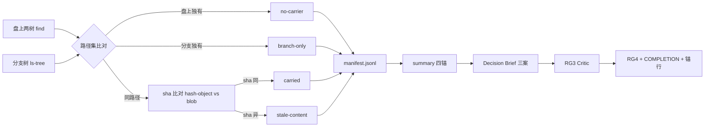

---
# Quality Chain Metadata (Alex 必填 - Phase 4 Hook 将基于此阻塞 Gate 3)
task_type: research   # code | yaml | research | e2e | mixed
e2e_required: no      # yes | no
research_required: yes # yes - 本链为研究轨链，交付 Decision Brief + RG3/RG4 文档组

# 研究轨链：不产 Build 轨 chain 清单；收口认 gm 台账 F-2 等价四件（见 §4.6）。
git_tracked_dirs: []  # 本链产物全落 .gitignore 忽略树（.tad/evidence/），无主仓跟踪面

# KA 不跳过：本链是 D44 研究轨契约的本仓首条完整实证链，KA 沉淀为收口必备。
skip_knowledge_assessment: no

gate4_delta: []
---

# Handoff Document for Agent B (Blake)
## TAD v3.1 - Evidence-Based Development

**From:** Alex (Agent A - Solution Lead)
**To:** 研究执行者（Alex 研究执行会话；本链为研究轨，无 Blake 路——判据原件 `.tad/gates/research-gate-canonical-checklist.md` 明文：Research Track is Alex-owned; NOT Build Gate 3. No Blake route）
**Date:** 2026-10-04
**Project:** TAD（上游方法库本体仓）
**Task ID:** TASK-20261004-MAINTAINER-EVIDENCE-REVIVAL
**Handoff Version:** 1.0
**Epic:** EPIC-20261004-tad-full-implementation Phase 3（MT3 批 1）——本席 📐 TAD 首链（锚链＝首链本身，台账 C-P3-4 定论操作定义）

## 头五键（推广链 stamp 口径，逐字）

```yaml
task_id: TASK-20261004-MAINTAINER-EVIDENCE-REVIVAL
tad_scope: na-research        # 研究轨口径：本链无代码实现面，交付为盘点清单＋Decision Brief＋RG 文档组；依据 gm 设计 §4.3「研究轨席位为下一条研究链」与台账 F-2
tad_basis: J1,J2              # 沿 gm 批 1 开工卡（step_id=gm-phase3-mt3-batch1-01）tad_basis
step_kind: research           # S1 首个执行步的 stamp step_kind；design/review 步不跑 precheck（设计 §2.3 第 4 步 WS-G 口径）
pm_seat: 📐 TAD               # 与 seat-onboarding.json 键名逐字一致（程序步 (b) 已核）
```

## 文档勾选清单（开工填「读/验」，交步填「办/产」；缺填＝链式互验退回）

### 读（知识送达）
- [ ] 本仓 `AGENTS.md`
- [ ] 本仓 `.tad/project-knowledge/principles.md`
- [ ] 本仓 `.tad/project-knowledge/patterns/_index.md`＋命中条目（release-sync.md、ac-verification.md、research-methodology.md，至多 3 条）
- [ ] 本仓 `.tad/gates/research-gate-canonical-checklist.md`（RG1–RG4 判据原件，本链判据 SSOT，只引用不复述）
- [ ] 本 HANDOFF 本体

### 验（链式互验上一步）
- [ ] 程序步 (a) 普查在盘：`.tad/evidence/phase3-census.md`（D35/D36/D44 行）＋`.tad/evidence/phase3-inflight-chains.md` 第 8 行（本链分流行，判定「不适用／未开链」）
- [ ] 程序步 (c) 指针在盘：`.tad/TAD-POINTER.md`＋`docs/pm/intent.md` 首屏引用行
- [ ] Gate 2 双审 verdict 两路在盘且结论为 PASS 或 CONDITIONAL（§Gate 2 节记录位已填）

### 办（本步产出预告，交步时勾销）
- [ ] S1 影响面盘点两件（manifest＋summary）落 §7 路径
- [ ] S2 Decision Brief 落 §7 路径
- [ ] S3 RG3 verdict 落 §7 路径
- [ ] S4 RG4 记录＋COMPLETION 落 §7 路径；`.tad/evidence/phase3-first-chain.md` 收口锚行已写

---

## 🔴 Gate 2: Design Completeness (Alex 必填)

**执行时间**: 2026-10-04（双审落盘，PM 同日回填合并裁定）

### Gate 2 检查结果（双审记录位 —— 本节由两路独立评审填写，Alex 不自审自批）

> 路名与字段口径认 gm HANDOFF-gm-phase3 §4.3：verdict 以 tech/fit 路名落本仓 `.tad/evidence/reviews/`，字段认硬拦 v2 §4.2 全字段＋reviewed_at（字段全集以该原件为准，本节只留记录位，不转写字段表）。

**技术路（tech）**：

| 字段 | 值 |
|---|---|
| verdict 文件 | `.tad/evidence/reviews/2026-10-04-gate2-tech-maintainer-evidence-revival.md` |
| verdict sha256 | `0e6c8601c69e5220784f1d190edacd4ead545bdcc95b051e40a79259dda2ec7b`（PM 回填时对落盘件实算） |
| verdict 字节数 | 13,547 |
| reviewer 会话 | b36ef433-362c-473e-9be9-ef38c9bc2604（Muse 原生 subagent 独立会话） |
| model | Muse Spark（原生 subagent） |
| reviewed_at | 2026-10-04T21:54:17Z |
| verdict | CONDITIONAL |
| P0 / P1 数 | 0 / 4（C-T1～C-T4，处置绑定见合并裁定） |

**适配路（fit）**：

| 字段 | 值 |
|---|---|
| verdict 文件 | `.tad/evidence/reviews/2026-10-04-gate2-fit-maintainer-evidence-revival.md` |
| verdict sha256 | `c42b0c3324795bd5d1288972ad8e1d17ecc6b6e7a1db8495f7fb25ffb63b193f`（PM 回填时对落盘件实算） |
| verdict 字节数 | 16,564 |
| reviewer 会话 | c7afba9b-f6e3-4b53-9db2-0085699f5bfe（Muse 原生 subagent 独立会话） |
| model | Muse Spark（原生 subagent） |
| reviewed_at | 2026-10-04T21:46:43Z |
| verdict | CONDITIONAL |
| P0 / P1 数 | 0 / 2（C1 作废、C2 本次回填关闭，见合并裁定） |

**Gate 2 结果**: **CONDITIONAL PASS（PM 合并裁定，2026-10-04）**。两路均为 CONDITIONAL、P0 合计 0，链结构不动。条件处置绑定：
- tech C-T1（基线安全管线＋口径补正）：绑 **S1 派发前**——PM 在 S1 任务书写死（ls-tree `-z` 与 find `-print0` 成对、B 集只取 blob、gitlink 单独注记；基线 8708／2248 标注为默认引用管线伪差集读数，安全口径锚值认 tech verdict 正文）；S1 summary 复跑四锚一致且 CJK 路径归类抽验正确方算关闭。
- tech C-T4（会话标识载体）：绑 **S1／S2 任务书**——两产物各记一行执行者会话标识，AC7 以此比对。
- tech C-T3（manifest 集合等式复算）：绑 **S1 收口 PM 验盘**与 **Gate 4** 各一次，留痕。
- tech C-T2（AC5／AC6／AC11 改逐项断言）：绑 **Gate 4 执行前**，由设计方出勘误修订 §9.1 对应行，三条反例不再误 PASS 方算关闭。
- fit C2（记录表补 verdict 锚定字段）：**本次回填关闭**——两路记录表已补 verdict sha256 与字节数（上方各表，PM 对落盘件实算）。
- fit C1（报 GM 时点明步序衔接依据）：**作废**——2026-10-04 GM 正式口径变更取消本链 Phase 3 锚链角色，不再报 GM 登记，「报送时点明」动作不存在；步序衔接依据（本链无补立链、Gate 2 即首链设计评审）就此记于本裁定，留痕目的已达。

**Alex 确认**: 本 HANDOFF 的设计要素（研究问题、盘点方法、落点、AC 验证方法）已自检完整（自检清单见完工说明）；Gate 2 结论以两路独立评审落盘为准，本节不自签。

---

## 📋 Handoff Checklist (执行者必读)

执行者在开始 S1 前，请确认：
- [ ] 阅读了所有章节（含 §5 MQ 证据与 §8.4 Friction）
- [ ] 阅读了「📚 Project Knowledge」章节中的历史经验
- [ ] **S1 前置条件全部满足**（见 §6 S0 修订版：Gate 2 双审落盘＋PM 合并裁定＋PM 开链记录）——缺一不许开跑 S1
- [ ] 理解了真正意图（§1.3：本链只出盘点与决策依据，不执行任何载体恢复动作）
- [ ] 每个 Step 的交付物和证据要求都清楚
- [ ] 确认可以独立使用本文档完成执行

❌ 如果任何部分不清楚，**立即返回 Alex/PM 要求澄清**，不要开始执行。

---

## 1. Task Overview

### 1.1 What We're Building

一条完整的研究轨链，处置 TICKET-20261004（maintainer-evidence 分支停摆）：

1. **影响面盘点（S1）**：机械枚举盘上 `.tad/evidence/`＋`.tad/archive/` 两树与 `maintainer-evidence` 分支树的差集，逐件清单＋分类计数，方法可复跑、结果可重算。
2. **载体方案比较＋Decision Brief（S2）**：至少三案比较（恢复分支同步／主仓例外清单常态化／分级混合载体），每案代价、风险、与 F-18 发行瘦身意图的相容性；Brief 含 SOURCES provenance 表并给出推荐案，供 PM 决策。
3. **独立 Critic 评审（S3，RG3）**：与执行者不同会话的 Critic 按 RG3 判据原件评审盘点与 Brief，出 verdict。
4. **收口（S4，RG4＋F-2 四件）**：RG4 综合记录、COMPLETION、首链证据件收口锚行齐备，链关。

### 1.2 Why We're Building It

**业务价值**：`.tad/evidence/` 与 `.tad/archive/` 被 `.gitignore` 整树忽略（有意设计），其替代载体 maintainer-evidence 分支尖停在 2026-09-06——此后全部 Gate 证据只存于 Syncthing 同步盘，无任何 git 载体。证据链是 TAD 的命脉（Gate 结论、自报核验、防过期机制全靠它），载体停摆一天，风险敞口涨一天。处置前必须先有逐件影响面清单，否则任何「恢复/替代」决策都是拍脑袋。
**用户受益**：本链同时是 EPIC-20261004 Phase 3 批 1 中 📐 TAD 席的首链 dogfooding——用一条真实制度链验证新规全程（指针→HANDOFF→Gate 2 双审→precheck 首跑→研究轨收口等价四件），为批 2–4 的研究轨席提供可照抄的实物样本。
**成功的样子**：PM 手里有一份逐件可查的影响面清单和一份带 provenance 的 Decision Brief，据此当场能拍板选哪种载体；且本链全程留痕满足 GM A4–A7′ 验收（研究轨口径）。

### 1.3 Intent Statement（意图声明）

**真正要解决的问题**：证据载体停摆的「影响面不清＋载体未决」——先把事实盘清、把选项摆明、把推荐给出，让决策有据。

**不是要做的（避免误解）**：
- ❌ 不是执行恢复：不在本链同步/推送任何分支、不改 `.gitignore`、不把任何 evidence 件 `git add -f` 入主仓。选定载体的实际恢复执行另立后续链。
- ❌ 不是补造历史：停摆期证据只盘点登记，不回填、不改写任何既有证据件内容。
- ❌ 不是改闸或改规程：本链零改动 `~/bin` 脚本、闸代码与 `.tad/` 本体规程/模板原件。

**执行者请确认理解**：
```
在开始执行前，请用你自己的话回答：
1. 这条链交付的是什么？（盘点清单＋决策简报，不是恢复动作）
2. S1 开跑前哪三个前置条件必须齐？
3. 成功的标准是什么？（§9.1 逐行可验）
PM 确认理解正确后，才能开始执行。
```

---

## 📚 Project Knowledge（执行者必读）

### 步骤 1：识别相关类别

本次任务涉及的领域：
- [x] architecture - 证据载体架构决策
- [x] testing - AC 验证方法设计与 dry-run 纪律
- [ ] code-quality / security / ux / performance / api-integration / mobile-platform

### 步骤 2：历史经验摘录

**已读取的 project-knowledge 文件**：

| 文件 | 相关记录数 | 关键提醒 |
|------|-----------|----------|
| patterns/release-sync.md | 1 组（Release & Sync） | gitignore 语义在镜像/同步下不存活；「断言须有载体」（claims-need-carriers）——证据无 git 载体即无载体断言 |
| patterns/ac-verification.md | 多条（本链命中：AC realism、dry-run 纪律、Ignored-tree blindness 条） | 每行 AC 的验证命令须在真实基线上 dry-run；post-impl 行在未实施树上必须以正确理由失败，防 vacuous |
| patterns/research-methodology.md | 1 条 | 本地盘面为第一来源面；来源须带出处与查得日期（provenance） |
| principles.md | 相关：Two-Agent System、Four-Gate、Measure Before Optimizing | 先实测再设计——盘点（S1）先于方案（S2），不许倒序 |

**⚠️ 执行者必须注意的历史教训**：

1. **忽略树盲视**（来自 patterns/ac-verification.md，2026-10-04 本仓 R1 链蒸馏）
   - 问题：盘点/计数类断言若只扫 git 已跟踪面，会对 `.gitignore` 整树忽略的证据面全盲，得出「证据齐全」的假结论。
   - 解决方案：本链盘点面写死为**盘上文件系统全集**（find 两树），git 只用于取分支树与 blob sha 对照；计数口径在 summary 中显式声明。

2. **AC 不 dry-run 必漂移**（来自 patterns/ac-verification.md，2026-04-14/04-25 两条）
   - 问题：AC 验证命令靠脑内模拟，执行时才暴露引号/输出形状/作用域错误，整轮返工。
   - 解决方案：本 HANDOFF §9.1 的 pre-impl 行已由 Alex 在定稿前实跑并粘贴原始输出；post-impl 行的命令形状已在基线上验证过失败形态（见 §9.1 Verified Output 列）。

3. **gitignore 语义不随镜像存活**（来自 patterns/release-sync.md）
   - 问题：把「忽略＝不存在」当默认，在同步/镜像面会漏件或误删。
   - 解决方案：S1 对分支树与盘上树一律按路径集＋内容 sha 双口径比对，不依赖任何一端的忽略规则推断对方内容。

### 执行者确认

- [ ] 我已阅读上述历史经验
- [ ] 我理解需要避免的问题
- [ ] 如遇到类似情况，我会参考上述解决方案

---

## 2. Background Context

### 2.1 Previous Work

- **TICKET-20261004**（`.tad/active/TICKET-20261004-maintainer-evidence-branch-revival.md`）：本链立项票。事实（双审亲核）：`.gitignore:122/:123` 整树忽略两树，为有意设计（EPIC-20260816 Phase 4 发行瘦身 F-18），替代载体为 maintainer-evidence 分支；分支尖停 2026-09-06（`8713ea4e`）；票面估计盘上约 12,014 个 evidence 文件、约 8,500 个无 git 载体——**此二数是票面先行估计，待 S1 实测复核，不作已验事实引用**。
- **自查 R1 报告**（`.tad/evidence/pm/2026-10-04-tad-self-review-r1.md` P3 节）：本票源头——证据链尾巴未收口是 R1 五条问题之一。
- **R1 第一批链**（TASK-20261004-TAD-STATE-SURFACE-CLOSEOUT，2026-10-04 收口）：其 Gate 2 合并裁定已裁「三件交付物逐件 `git add -f` 单文件例外入主仓，不恢复分支同步」——那是单批例外处置，不构成本链的载体决策先例；本链 S2 须把「例外清单常态化」作为一案与「恢复分支同步」并列比较。
- **程序步 (a) 普查**（`.tad/evidence/phase3-census.md`）：D35（usage log 0 B 空件待激活）、D36（归档迁移未成收口固定动作）、D44（研究轨契约无完整实证链）三行与本链直接相关；本链同时是 D44 的首条完整研究轨实证链、D35 的激活链。

### 2.2 Current State

Alex 定稿前亲验基线（2026-10-04，命令与输出见 §5 MQ 与 §9.1）：

| 量 | 值 | 查法 |
|---|---|---|
| 分支尖 | `8713ea4e`（2026-09-06 14:42 -0400） | `git log -1 --format=%h maintainer-evidence` |
| 分支树文件数 | 6,596 | `git ls-tree -r --name-only maintainer-evidence \| wc -l` |
| 盘上两树文件数 | 13,056 | `find .tad/evidence .tad/archive -type f \| wc -l` |
| 盘上有、分支无（路径差集，含两树外口径差，待 S1 按两树前缀收口径重算） | 8,708 | comm 差集（§5 MQ3 命令） |
| 分支有、盘上无（全树口径，同上待收口径） | 2,248 | comm 差集 |
| usage log | 0 B、0 行 | `wc -c .tad/evidence/knowledge-usage-log.jsonl` |

注意：分支树含 `.agents/` 等两树外路径（分支是整仓级证据同步载体，非两树专属）；且路径同在不等于内容同——停摆前已同步件也可能有内容漂移。S1 必须双口径（路径差集＋同路径内容 sha 差集），见 §4.2。

### 2.3 Dependencies

- **GM 练关等价登记**（外部前置）：**2026-10-04 作废**——GM 正式口径变更取消本链 Phase 3 锚链角色，本条不构成本链前置（原设计依据 C-P3-4 定论 (b) 随角色取消失效； operative 口径见 §6 S0 修订注）。
- **git 只读面**：本链对 git 只用读命令（log/ls-tree/hash-object/status/diff）；任何写操作（add/commit/push/branch）不在本链授权内。
- **Syncthing 同步盘**：盘上两树经 Syncthing 同步，mtime 受同步收敛污染（普查表口径行已注明）——S1 的日期归属不许用 mtime，认路径内日期与 git 记录（见 §4.2）。

---

## 3. Requirements

### 3.1 Functional Requirements

- FR1（影响面逐件清单）：S1 产逐件 manifest——盘上两树每一件恰归一类：`carried`（分支同路径且内容 sha 同）／`stale-content`（同路径、内容 sha 异）／`no-carrier`（分支无此路径）；另列 `branch-only`（分支两树前缀内有、盘上无）为信息类，不混入影响面计数。
- FR2（分类计数）：summary 给出按 树（evidence/archive）× 一级子目录 × 状态类 的计数表与字节量，含机器可读锚行 `TOTAL_NOCARRIER=<n>`、`TOTAL_STALE=<n>`、`TOTAL_CARRIED=<n>`、`TOTAL_BRANCH_ONLY=<n>`，且四锚值与 manifest 逐行计数重算一致。
- FR3（方法可复跑）：summary 写明完整复跑命令序列；按其复跑，四个 TOTAL 锚值与首跑一致（盘面在两次跑之间无新增证据件时）。
- FR4（三案比较）：S2 Brief 至少含三案——案一 恢复分支同步、案二 主仓例外清单常态化、案三分级混合载体（关键件走主仓例外、批量件走分支同步、一份登记册统管）——每案逐项给：机制描述、一次性成本、常态运维负担、风险与失效模式、与 F-18 发行瘦身意图的相容性。
- FR5（provenance）：Brief 含 `## SOURCES` 表：每条载重断言（数字、分支状态、设计意图出处）给来源路径＋查得日期；数字类断言只许引 S1 summary 的实测值，不许引票面估计。
- FR6（推荐与未知）：Brief 给 PM 推荐案＋推荐依据＋置信度＋未知项清单；证据不足处明写不足，不许凑结论。
- FR7（RG3 独立评审）：Critic 与 S1/S2 执行者不同会话，按 RG3 判据原件四项执行（引用 `.tad/gates/research-gate-canonical-checklist.md` RG3 节，不复述），verdict 为 PASS/CONDITIONAL/FAIL；CONDITIONAL/FAIL 须有处置记录（修订后复核或 PM 裁定留痕），未处置不许进 S4。
- FR8（RG4 综合）：RG4 记录含 Quality Rubric 评分（认 `.tad/templates/research-quality-rubric.md` 维度口径）＋human CHECK 记录位；CHECK 未完成时记「CHECK 待人」，不冒充已过（台账 F-2 件三口径）。
- FR9（D35 激活）：自 S1 起 `.tad/evidence/knowledge-usage-log.jsonl` 每行一个 JSON 对象、全行可解析；含 genesis 行 1 行与本链 usage 行 ≥2 行（字段口径见 §4.5），满足 GM A7（行内 `chain`＝本链 task_id 或 `handoff`＝本 HANDOFF 路径，可 JSON 解析）。
- FR10（首链证据件）：`.tad/evidence/phase3-first-chain.md` 由 PM 于 precheck 首跑时创建，本链收口时含一行以字面锚 `研究轨收口:` 开头的行，列 RG3 verdict 路径与结论、Decision Brief 路径、RG4 记录路径（台账 F-2 件四），且三路径全在盘。
- FR11（COMPLETION）：收口产 COMPLETION，强制节齐：KA（知识沉淀去向或显式「无新发现」）／Friction／Evidence Checklist／Provenance。

### 3.2 Non-Functional Requirements

- NFR1（零写红线）：全链对 git 只读；不改 `.gitignore`、不改 `.tad/` 本体规程与模板原件、不动 docs/pm 保留集（NEXT.md 与 intent/now/auth/acceptance 四件，指针引用行除外——那是程序步 (c) 已落件）、不动 session-state（PM 收口动作除外）。
- NFR2（口径诚实）：一切计数带口径声明（盘面时点、路径前缀、sha 算法）；票面估计与实测值在任何产物中分开标注，不混引。
- NFR3（同名文件绝对路径）：跨仓引用（gm 仓原件）一律绝对路径；仓内引用一律仓根相对路径并在首链证据件中可解析。
- NFR4（轮次预算）：S1 一轮机械盘点（方法错才许第二轮，须在 summary 记作废轮次）；S2 一轮成稿＋RG3 后至多一轮修订；超预算停下回 PM，不许自行加轮。

### 3.3 研究立项（RG1 要素，内嵌本节——判据认 `.tad/gates/research-gate-canonical-checklist.md` RG1 节）

- **决策问题**（问题 not 题目）：停摆的证据载体应当恢复分支同步、改为主仓例外清单常态化、还是换分级混合载体——哪一案在「证据不断链」与「发行瘦身意图不破」之间代价最小？
- **服务哪个决策**：TAD PM 据 Brief 选定载体，并据影响面清单另立恢复执行链（本链不执行恢复）。
- **够深验收线**：影响面逐件全覆盖（FR1 三类恰归一）＋四锚可重算（FR2/FR3）＋三案同维度比较齐（FR4）＋RG3 verdict 在盘（FR7）——逐条对应 §9.1 行号，可判定。
- **明确不查（scope-out）**：载体恢复的实际执行与频率调优；其他仓的证据载体状况；`.tad/evidence/` 树内容质量审计（只盘载体有无，不审证据对错）；闸与 precheck 机制本身的问题（归 Phase 3 其他裁定面）。
- **Source 策略**：第一来源面＝本仓盘上实查（find/git 只读命令，S1）；第二来源面＝仓内原件（票、R1 报告、Gate 2 合并裁定件、EPIC-20260816 F-18 出处件）；不查外网（本链事实全在仓内）。

### 3.4 计划充分性（RG2 要素——判据认 RG2 节）

- **问题树（≥3 个决策锚定子问题）**：
  - Q1 影响面：停摆期（2026-09-06 后）新增/变更的证据件逐件是谁？无载体与内容过期各多少？→ S1 回答。
  - Q2 载体机制：三案各自怎么保证「新证据自动有载体」而不是靠人记得？→ S2 回答。
  - Q3 相容性：三案各自对 F-18 发行瘦身（主仓发行面不带证据树）与单人 CLI 运维负担意味着什么？→ S2 回答。
  - Q4 迁移代价：选定案落地时，影响面清单如何转成执行链的输入（逐件销账）？→ S2 回答（只到输入形态，不执行）。
- **轮次预算 + 停止规则**：见 NFR4；另加总停止规则——S1 四锚重算不一致即停，先修方法再继续，不许带着对不上的数进 S2。
- **来源优先级**：盘上实查 ＞ 仓内原件 ＞ 票面估计（估计只作对照，不作结论源）。
- **计划挑战（Phase 0c 等价）**：本计划已经 Gate 2 双审（tech/fit 两路）挑战，挑战结论落 §Gate 2 记录位；双审未落盘前本节视为未挑战，本链不开跑。

---

## 4. Technical Design

### 4.1 Architecture Overview

数据流：盘上两树文件集（find）与分支树文件集（git ls-tree）→ 路径集比对分三路（同路径／盘上独有／分支独有）→ 同路径集逐件内容 sha 比对（git hash-object vs 分支 blob sha）→ manifest（逐件一行 JSON）→ summary（分类计数＋四锚＋复跑命令）→ 三案比较（以 summary 实测值为唯一数字源）→ Decision Brief → RG3 Critic → RG4＋COMPLETION＋首链锚行收口。usage log 贯穿 S1–S4 逐歩记行。

### 4.2 S1 盘点方法规格（执行者照此实现，不许另创口径）

- **盘上集 A**：`find .tad/evidence .tad/archive -type f`（仓根执行），路径即仓根相对路径，排序后入算。
- **分支集 B**：`git ls-tree -r maintainer-evidence` 取「路径＋blob sha」；B 只取路径前缀为 `.tad/evidence/` 或 `.tad/archive/` 的行参与比对（分支含两树外路径，那些不入本链口径，summary 中记 B 的全树总数与两树前缀数两个值以备查）。
- **分类**：
  - 路径 ∈ A∩B：算盘上件 `git hash-object -- <path>` 与 B 中 blob sha 比对——同＝`carried`，异＝`stale-content`。
  - 路径 ∈ A∖B：`no-carrier`。
  - 路径 ∈ B∖A（两树前缀内）：`branch-only`（信息类）。
- **日期桶**（仅作 summary 的分布维度，不作分类依据）：从路径中抽 `20\d\d-\d\d-\d\d` 日期串归桶；抽不到记 `undated`。**禁用 mtime**（Syncthing 污染，§2.3）。
- **类别维度**：树（evidence/archive）× 一级子目录（如 evidence/reviews、evidence/designs、archive/handoffs；根下直挂件记 `(root)`）。
- **manifest 行形**（JSONL，一件一行）：`{"path": "...", "tree": "evidence|archive", "class": "carried|stale-content|no-carrier", "bytes": <int>, "date_bucket": "YYYY-MM-DD|undated"}`；branch-only 件另记一行 `"class": "branch-only"`、`"bytes": null`。
- **性能口径**：hash-object 逐件调用约万级，许用 `git hash-object --stdin-paths` 批量形态；方法细节（批量与否）记入 summary，不影响口径。
- **作废轮次**：方法若中途修正，先前 manifest 须在 summary 中声明作废并重跑全量，不许拼接两轮结果。

### 4.3 S2 三案比较框架（每案同维度，缺维度即 FR4 不达）

| 维度 | 案一 恢复分支同步 | 案二 主仓例外清单常态化 | 案三 分级混合载体 |
|---|---|---|---|
| 机制 | 收口/定期触发把两树全量或增量提交至 maintainer-evidence 分支 | 维护一份例外登记册，册内件逐件 `git add -f` 入主仓，两树其余件仍忽略 | 关键件（Gate verdict 类，判据在 Brief 中定义）走案二；批量过程件走案一；一份登记册统管两路 |
| 一次性成本 | 恢复同步脚本/流程＋首轮全量补同步 | 登记册建立＋存量关键件甄别 | 两案成本之和的一部分（须具体估） |
| 常态运维 | 每链收口多一步同步动作（可脚本化） | 每件关键证据多一步登记＋-f 入仓 | 同左＋分级判据维护 |
| 风险/失效模式 | 漏同步＝静默再停摆（须有看守）；分支膨胀 | 登记册与实际入仓面漂移；主仓体积回涨 | 判据边界争议；两路都漏的缝隙 |
| F-18 相容性 | 完全相容（主仓发行面不带证据树，原设计即此） | 部分相容（例外件进主仓，须以「关键少数」自我约束） | 同案二，但受控于分级判据 |

执行者按此框架填实测与查证后的内容；框架是下限不是上限，可加维度（如可逆性），不可删维度。

### 4.4 落点与命名（全链产物，§7 同表）

研究交付落 `.tad/evidence/research/maintainer-evidence-revival/`（新目录，S1 创建）；评审落 `.tad/evidence/reviews/`（仓内惯例目录）；COMPLETION 落 `.tad/evidence/completions/`；首链证据件 `.tad/evidence/phase3-first-chain.md`（PM 创建，执行者只在收口时按 FR10 提供锚行内容给 PM 或经 PM 授权代写——授权与否由 PM 在 S4 派发时明示）。

### 4.5 D35 usage log 字段口径（本链定，认 GM A7 可解析要求）

- 文件：`.tad/evidence/knowledge-usage-log.jsonl`（现存 0 B 空件，本链激活）。
- genesis 行（S1 开跑第一动作，全文件第一行）：`{"type": "genesis", "ts": "<ISO8601>", "chain": "TASK-20261004-MAINTAINER-EVIDENCE-REVIVAL", "note": "D35 activation: first row; prior state 0-byte empty file since 2026-08-17 (census D35)"}`
- usage 行（每步至少一行，读了/用了知识件就记）：`{"ts": "<ISO8601>", "chain": "TASK-20261004-MAINTAINER-EVIDENCE-REVIVAL", "handoff": ".tad/active/handoffs/HANDOFF-2026-10-04-maintainer-evidence-revival.md", "step": "S1|S2|S3|S4", "knowledge": ["<仓根相对路径>", ...], "purpose": "<一句话>"}`
- 每行独立 JSON 对象、UTF-8、无尾随逗号；写入方式为 append，不许重写既有行。

### 4.6 收口等价四件（F-2，认 gm 台账 procedure 修订第 6 条，本节只列本链落点）

1. RG3 verdict：`.tad/evidence/reviews/rg3-critic-maintainer-evidence-revival.md`（结论 PASS 或 CONDITIONAL；CONDITIONAL 附处置记录）。
2. Decision Brief：`.tad/evidence/research/maintainer-evidence-revival/decision-brief.md`（含 SOURCES 表）。
3. RG4 记录：`.tad/evidence/reviews/rg4-synthesis-maintainer-evidence-revival.md`（rubric 评分＋CHECK 记录位）。
4. 首链锚行：`.tad/evidence/phase3-first-chain.md` 内 `研究轨收口:` 起始行（列件一路径与结论、件二路径、件三路径）。

---

## 5. 🆕 强制问题回答（Evidence Required）

### MQ1: 历史代码搜索

**问题**：用户是否提到"之前的"、"原来的"、"我们的方案"？

**回答**：
- [x] 是 → 本链正是对既有载体方案（maintainer-evidence 分支）停摆的处置，全部先行件已查：

#### 搜索证据
```bash
# 立项与源头件
ls .tad/active/TICKET-20261004-maintainer-evidence-branch-revival.md   # 在盘（§9.1 AC1 已验）
grep -n "P3" .tad/evidence/pm/2026-10-04-tad-self-review-r1.md          # R1 报告 P3 节为本票源头
sed -n '120,125p' .gitignore                                            # 122/123 两行整树忽略两树
git log -1 --format="%h %ci %s" maintainer-evidence                     # 8713ea4e 2026-09-06 chore(evidence): sync 134 post-phase4 evidence…
```

#### 决策说明
- **找到了什么**：原方案＝`.gitignore` 整树忽略＋maintainer-evidence 分支作替代载体（EPIC-20260816 F-18 有意设计）；停摆点 2026-09-06；R1 第一批链对三件交付物的单文件 `-f` 例外入仓裁定（单批例外，非载体决策）。
- **决定**：✅ 复用原问题框架（票的两个待决项），❌ 不预设复用原载体——载体选型正是本链决策问题，三案并列比较。

### MQ2: 函数存在性验证

**问题**：设计中调用了哪些函数/命令？它们都存在吗？

**回答**：本链无代码函数调用；S1 依赖的 git/系统命令已逐个在本仓实跑验证：

| 命令 | 用途 | 验证 | 证据 |
|---|---|---|---|
| `git ls-tree -r --name-only maintainer-evidence` | 取分支树路径集 | ✅ | 输出 6,596 行，首行 `.agents/skills/_archived/ai-integration.md` |
| `git log -1 --format=%h maintainer-evidence` | 取分支尖 | ✅ | `8713ea4e` |
| `git ls-tree -r maintainer-evidence` | 取路径＋blob sha | ✅ | S1 实现时以此式取 sha（ls-tree 默认输出含 blob sha，格式原件常识，S1 首跑须回填一行样本入 summary 作证） |
| `git hash-object -- <path>` / `--stdin-paths` | 盘上件内容 sha | ✅ | git 标准命令；S1 首跑样本同上 |
| `find .tad/evidence .tad/archive -type f` | 盘上集 | ✅ | 输出 13,056 行 |
| `comm -23/-13`（排序后） | 路径差集 | ✅ | 已跑：盘上独有 8,708／分支独有 2,248（全树口径基线，S1 按两树前缀收口径） |

### MQ3: 数据流完整性

**问题**：输入的每个集合/字段是否都有下游承接？

#### 数据流对照表

| 输入 | 产出形态 | 下游承接 | 是否全覆盖 |
|---|---|---|---|
| 盘上集 A（find 两树） | manifest 行（class 三分） | summary 计数＋Brief 影响面节 | ✅ 每件恰归一类（FR1） |
| 分支集 B（两树前缀） | 同上＋branch-only 行 | summary 信息类计数 | ✅ |
| 同路径内容 sha 对 | stale-content 类 | Brief「停摆期变更面」论证 | ✅ |
| 票面估计（12,014／约 8,500） | 对照值 | summary「估计 vs 实测」对照行 | ✅ 只作对照，不入结论（NFR2） |
| S1 四锚值 | Brief 唯一数字源 | RG3 抽查重算 | ✅ FR5 |

#### 数据流图



### MQ4: 视觉层级

**回答**：
- [x] 无不同状态 → 跳过。本链无 UI 产出；manifest 的 class 字段即状态区分载体，已在 §4.2 定义四值枚举，不需视觉层级。

### MQ5: 状态同步

**回答**：本链状态只有一份权威：盘上产物文件集（§7）。过程状态（哪步在跑）由 PM 的 session-state 与首链证据件承接，执行者不另建状态件。盘点快照的时点写进 summary 头（`as_of` 字段），两次跑之间盘面变化以 FR3 的口径声明处理（锚值变化须能由新增件解释，不许静默改数）。

---

## 6. Implementation Steps（分 Step）

### S0（前置门，非执行步）: 条件齐备才许进 S1

> **PM 修订注（2026-10-04，口径变更）**：GM 正式口径变更取消本链的 Phase 3 推广锚链角色——maintainer-evidence 回归 📐 TAD 席自有事项，不向 GM 报推广登记、不等 GM 等价登记。原 S0 第 2、3 条系登记机器面的前置，随角色取消一并修订如下；本 HANDOFF 其余各节出现的「等价登记」「precheck 首跑」字样（§2.3、§6 清单、§7 失败表、§8 警告、§9.1 相关行）一律以本节修订为准读。`.tad/evidence/phase3-first-chain.md` 文件名沿用、语义改为本链证据日志：FR10／AC10 的收口锚行语义不变，文件由 PM 于开链时创建并写开链记录行。

1. Gate 2 双审（tech/fit）verdict 落盘且 PM 合并裁定为 PASS 或 CONDITIONAL PASS（条件已裁定处置绑定）——**2026-10-04 已满足**（见 §Gate 2 记录位）；
2. ~~PM 已报 GM 且 GM 练关等价登记确认已回~~ ——**作废**（见修订注），不构成本链前置；
3. PM 开链记录：S1 开跑前，PM 创建 `.tad/evidence/phase3-first-chain.md` 并写入开链行——Gate 2 合并裁定结论、S1 的 step_id、S1 任务书路径、C-T1 写死内容指针。TAD 仓未登记 Gate 硬拦，stamp／precheck 机器闸不适用本仓自有链；步序纪律由本 S0＋任务书＋PM 验盘承接（机制 §8f）。S1 任务书仍必带 `pm_seat: 📐 TAD`（逐字）、`tad_scope: na-research`、`step_kind: research`、`tad_basis: J1,J2`、handoff_path 与 prev_verdict＝Gate 2 合并裁定（CONDITIONAL PASS）五项声明。

### S1: 影响面盘点（研究执行会话 A）

- [ ] 第一动作：按 §4.5 写 usage log genesis 行（若文件非空或已有 genesis 行，停下回 PM——说明 D35 状态与普查不符）
- [ ] 建目录 `.tad/evidence/research/maintainer-evidence-revival/`
- [ ] 按 §4.2 方法全量枚举并分类，产 manifest＋summary（summary 含：as_of 时点、四锚锚行、分类计数表（树×一级子目录×类）、日期桶分布、估计 vs 实测对照、完整复跑命令序列、sha 样本行 ≥2、作废轮次声明位）
- [ ] 写本步 usage 行（step=S1）
- **Verification:** §9.1 AC3/AC4/AC5（方法与 manifest 自洽）＋AC8 的 S1 部分（genesis＋usage 行可解析）

### S2: 三案比较＋Decision Brief（研究执行会话 A 续，或 PM 另派同角色会话）

- [ ] 按 §4.3 框架成文 Brief（模板认 `.tad/templates/research-decision-brief.md`）：选项＝三案、每案证据节、推荐、未知风险、Claim 验证表
- [ ] `## SOURCES` 表齐（FR5）：每条数字断言回指 S1 summary 锚行或仓内原件路径＋查得日期
- [ ] 结论第一句 ≤3 句给推荐（RG4 的 verdict-first 在成稿时预置，RG4 记录时复核）
- [ ] 写本步 usage 行（step=S2）
- **Verification:** §9.1 AC6

### S3: RG3 Critic 独立评审（独立会话 Critic，与 S1/S2 执行者不同会话）

- [ ] Critic 按 RG3 判据原件四项执行：Source 抽查（至少抽 manifest 5 行回盘验类、抽 Brief 3 条数字断言回 S1 summary 验值）、最强反例搜寻并记录、Charter 缺口分析（§3.3 决策问题与 Q1–Q4 逐条对答情况）、Verdict＋独立性载体（会话标识写入 verdict 件）
- [ ] 模板认 `.tad/templates/research-critic-review.md`；verdict 落 §4.6 件一路径
- [ ] CONDITIONAL/FAIL 时：执行者按 findings 修订（计入 NFR4 修订轮），Critic 出复核行或 PM 裁定留痕，处置记录附于 verdict 件尾
- **Verification:** §9.1 AC7

### S4: 收口（RG4＋COMPLETION＋锚行）

- [ ] RG4 记录：按 `.tad/templates/research-quality-rubric.md` 给评分（各维分数＋一句话理由），复核 RG4 判据四项（结论先行／置信度与未知项／反方案例／provenance 表齐），human CHECK 记录位：已过记结论与日期，未过记「CHECK 待人」
- [ ] COMPLETION 落 §7 路径（模板认 `.tad/templates/completion-report.md`，强制节见 FR11）
- [ ] 首链锚行：向 PM 提交锚行全文（`研究轨收口: RG3=<路径>（<结论>）；Brief=<路径>；RG4=<路径>`），由 PM 写入或授权代写 `.tad/evidence/phase3-first-chain.md`
- [ ] 写本步 usage 行（step=S4）；TICKET-20261004 状态行由 PM 在收口时回填（执行者不碰票面状态）
- **Verification:** §9.1 AC9/AC10/AC11＋AC12（范围守恒）

### Micro-Task Rules

- 每步一会话面：S3 必须新会话；S1/S2 同会话续跑可、分会话亦可（provenance 记明）。
- 任一步发现方法或口径与原件冲突：停该步、记入该步产物、回 PM；不许自择口径（Phase 3 程序纪律同口径）。
- 盘面在链运行期间会自然新增证据件（本链自身产物即在两树内）：manifest 的口径时点以 S1 开跑时点为准，本链自身产物（research/maintainer-evidence-revival/ 目录下件、reviews 本链件、completions 本链件、phase3-first-chain.md、knowledge-usage-log.jsonl）在 manifest 中按实类归行、summary 中单列「本链自产」小计，不许为凑锚值排除或回填。

---

## 7. File Structure

### 7.1 Files to Create

```
.tad/evidence/research/maintainer-evidence-revival/inventory-manifest.jsonl   # S1 逐件清单（FR1）
.tad/evidence/research/maintainer-evidence-revival/inventory-summary.md       # S1 计数/四锚/复跑命令（FR2/FR3）
.tad/evidence/research/maintainer-evidence-revival/decision-brief.md          # S2 Decision Brief（F-2 件二）
.tad/evidence/reviews/rg3-critic-maintainer-evidence-revival.md                # S3 RG3 verdict（F-2 件一）
.tad/evidence/reviews/rg4-synthesis-maintainer-evidence-revival.md             # S4 RG4 记录（F-2 件三）
.tad/evidence/reviews/2026-10-04-gate2-tech-maintainer-evidence-revival.md     # Gate 2 技术路 verdict（评审产）
.tad/evidence/reviews/2026-10-04-gate2-fit-maintainer-evidence-revival.md      # Gate 2 适配路 verdict（评审产）
.tad/evidence/completions/COMPLETION-2026-10-04-maintainer-evidence-revival.md # S4 COMPLETION（FR11）
.tad/evidence/phase3-first-chain.md                                            # PM 创建（开链记录，§6 S0 修订注）；S4 锚行入此（F-2 件四）
```

### 7.2 Files to Modify

```
.tad/evidence/knowledge-usage-log.jsonl   # 仅 append（genesis＋本链 usage 行，§4.5）；现 0 B
.tad/active/TICKET-20261004-maintainer-evidence-branch-revival.md  # 仅 PM 收口回填状态行，执行者禁改
```

### 7.3 明示不改

```
.gitignore（任何行）
maintainer-evidence 分支（任何 git 写操作）
.tad/evidence/ 与 .tad/archive/ 的既有件（只读盘点，不动内容）
.tad/ 本体规程与 .tad/templates/ 原件
~/bin/ 全部脚本；gm 仓全部文件（只读引用）
docs/pm/ 保留集（NEXT.md、intent.md、now.md、auth.md、acceptance.md、ops/）
.tad/active/session-state.md（PM 收口动作面，执行者禁改）
```

### 7.4 Grounded Against（Alex 定稿前实际 Read/实查过的源文件，2026-10-04）

- 本仓 `AGENTS.md`、`.tad/project-knowledge/principles.md`、`.tad/project-knowledge/patterns/_index.md`、`patterns/ac-verification.md`（命中条目全文）
- 本仓 `.tad/tasks/handoff-creation.md`、`.tad/templates/handoff-a-to-b.md`、`.tad/templates/research-charter.md`、`research-decision-brief.md`、`research-critic-review.md`、`research-quality-rubric.md`（模板头与口径）
- 本仓 `.tad/gates/research-gate-canonical-checklist.md`（全文）
- 本仓 `.tad/active/TICKET-20261004-maintainer-evidence-branch-revival.md`（全文）、`.tad/evidence/pm/2026-10-04-tad-self-review-r1.md`（全文）、`.tad/evidence/phase3-census.md` D35/D36/D44 行、`.tad/evidence/phase3-inflight-chains.md`（全文）
- gm 仓 `.tad/active/handoffs/HANDOFF-gm-phase3.md` §4.3/§6.2、`.tad/evidence/designs/2026-10-04-gm-phase3-design.md` §2.3/§4.3、`.tad/active/epics/tad-full-implementation/phase3-rollout-ledger.md` procedure 修订第 5/6 条与 C-P3-4 定论（操作定义与等价边界）
- 盘上实查：`.gitignore:120-125`、分支尖/树计数、两树计数、comm 差集基线、usage log 0 B（命令与输出见 §5/§9.1）

---

## 8. Testing Requirements（研究轨的验证形态）

### 8.1 复跑一致性（S1）
- 按 summary 复跑命令序列全量重跑：四锚与首跑一致（FR3）；不一致即 S1 不达，停下修方法（NFR4）。

### 8.2 抽查（S3 Critic 执行，非自查）
- manifest 抽 ≥5 行回盘验类（路径存在性＋class 与 sha 比对结果一致）。
- Brief 数字断言抽 ≥3 条回 summary/原件验值。

### 8.3 Edge Cases
- 路径含空格/CJK（如 `Pokémon ` 类目录名）：find/ls-tree 输出按行处理会断行——S1 须用 `-print0`/逐行引用安全形态处理，summary 记明所用形态；若差集计数因路径断行异常（四锚对不上），按总停止规则停。
- 两树外路径混入分支集：B 必须先按两树前缀过滤再比对（§4.2），否则 branch-only 计数虚高（基线全树口径 2,248 即含此水分，S1 数字应小于它并在 summary 解释差额构成）。
- 盘面在 S1 运行中变化（他链并发产证据件）：as_of 时点＋FR3 口径声明处理；本链自产件按 §6 Micro-Task Rules 末条单列小计。

## 8.4 Friction Preflight

| Friction Point | Required Step | Expected Fix Path | Allowed Substitute | Gate Impact |
|---|---|---|---|---|
| GM 等价登记未确认 | — | **2026-10-04 作废**：口径变更取消本链锚链角色，无登记前置（见 §6 S0 修订注） | — | 本行失效 |
| Gate 2 双审未落盘或 FAIL 进根因循环 | S1 前置 | PM 组织双审；FAIL 由 Alex 出根因＋设计级修法后重审 | 无 | 锚落空不登记（C-P3-4 定论），本链停在 Gate 2 |
| Critic 会话与执行者同会话风险 | S3 | PM 派发时以新 spawn 保证独立，verdict 件写会话标识 | 无（同 session 自评永不是有效 Critic，模板明文） | RG3 不得 PASS，S4 不许进 |
| hash-object 万级逐件调用耗时 | S1 | 用 `--stdin-paths` 批量形态 | 分批调用（口径不变） | 仅影响时长，不影响判定 |
| human CHECK（RG4）当场不可得 | S4 | 记「CHECK 待人」收口，CHECK 后补记 RG4 记录 | 无（不冒充已过） | 不阻塞 F-2 四件成立（台账件三口径明文） |

**Status Enum**: `READY` / `BLOCKED` / `DEGRADED_WITH_APPROVAL` / `EQUIVALENT_SUBSTITUTE` / `NOT_APPLICABLE_WITH_REASON`（收口时 COMPLETION 按此填 Friction 状态表）

## 8.5 Feedback Collection

```yaml
feedback_required: true
artifact_type: generic
suggested_dimensions:
  - "影响面清单是否逐件可查、四锚是否可重算"
  - "三案比较是否同维度、推荐是否有据"
notes: "human CHECK 在 RG4 记录位完成；未完成记「CHECK 待人」不阻塞收口四件"
```

---

## 9. Acceptance Criteria

本链完成，当且仅当 §9.1 全部 12 行逐行验过（Gate 4 由 Alex 从盘重算，不采信执行者自述）：

- [ ] S1 manifest＋summary 在盘且四锚自洽、复跑一致
- [ ] S2 Brief 三案同维度＋SOURCES 表＋推荐/未知齐
- [ ] S3 RG3 verdict 在盘、独立性成立、CONDITIONAL/FAIL 有处置记录
- [ ] S4 RG4 记录＋COMPLETION 强制节＋首链锚行齐（F-2 四件成立）
- [ ] D35 激活成立（genesis＋usage 行可解析）
- [ ] 零写红线未破（AC12）

---

## 9.1 Spec Compliance Checklist ⚠️ PRIMARY VERIFICATION SOURCE — Gate 4 executes each row

> **Verification Method grammar**: 每行恰为一种合法形态（command｜path-check｜fixture｜rubric-spawn｜light-tier N/A）。本链为研究轨：Gate 3/Ralph 不适用，逐行验证由 Gate 4（Alex 从盘重算）＋GM A6′ 验收执行。
> **AC realism**: pre-impl 行已由 Alex 于 2026-10-04 在活基线上 dry-run 并粘贴原始输出；post-impl 行在未实施基线上均已验为以正确理由失败（产物不存在／计数为 0），非 vacuous。

| # | Acceptance Criterion | Verification Type | Verification Method | Expected Evidence | Verified Output (Alex step1d) |
|---|---------------------|-------------------|--------------------|-------------------------------|-------------------------------|
| AC1 | 立项票在盘（链有据） | pre-impl-verifiable | `test -f /home/hatch/workspace/yun-sync/TAD/.tad/active/TICKET-20261004-maintainer-evidence-branch-revival.md && echo TICKET_PRESENT` | exit 0 且输出 TICKET_PRESENT | `TICKET_PRESENT`（2026-10-04 实跑） |
| AC2 | 分支尖基线＝停摆点（S1 开跑前与收口各验一次，证全链零 git 写） | pre-impl-verifiable | `git -C /home/hatch/workspace/yun-sync/TAD log -1 --format=%h maintainer-evidence` | 输出 `8713ea4e` | `8713ea4e`（2026-10-04 实跑） |
| AC3 | 盘点方法基线可跑（路径差集管线在活基线上产出双计数） | pre-impl-verifiable | `cd /home/hatch/workspace/yun-sync/TAD && comm -23 <(find .tad/evidence .tad/archive -type f \| sort) <(git ls-tree -r --name-only maintainer-evidence \| sort) \| wc -l && comm -13 <(find .tad/evidence .tad/archive -type f \| sort) <(git ls-tree -r --name-only maintainer-evidence \| sort) \| wc -l` | exit 0 且两计数均为正整数（全树口径基线；S1 按两树前缀收口径后数值只许更小且差额可在 summary 解释） | `8708` / `2248`（2026-10-04 实跑，全树口径） |
| AC4 | manifest 逐件全覆盖且行数与 summary 四锚自洽 | post-impl-verifiable | `PYTHONDONTWRITEBYTECODE=1 python3 -c "import json,collections; rows=[json.loads(l) for l in open('/home/hatch/workspace/yun-sync/TAD/.tad/evidence/research/maintainer-evidence-revival/inventory-manifest.jsonl')]; c=collections.Counter(r['class'] for r in rows); print(c['no-carrier'],c['stale-content'],c['carried'],c['branch-only'],len(rows))"` 并与 summary 中 `grep -oE 'TOTAL_(NOCARRIER\|STALE\|CARRIED\|BRANCH_ONLY)=[0-9]+' inventory-summary.md` 四值逐一比对 | 五数中前四与四锚逐一相等；总数＝四锚之和 | (post-impl)；基线形态：文件不存在 → python 报 FileNotFoundError（已验 MANIFEST_ABSENT） |
| AC5 | summary 方法与口径齐备（复跑命令、as_of、sha 样本、估计对照在位） | post-impl-verifiable | `grep -c 'as_of' <summary> && grep -c '复跑' <summary> && grep -c 'hash-object' <summary> && grep -c '估计' <summary>`，其中 `<summary>`＝`/home/hatch/workspace/yun-sync/TAD/.tad/evidence/research/maintainer-evidence-revival/inventory-summary.md` | 四计数依次均 ≥1（as_of／复跑／hash-object／估计逐项断言、合取判定；任一锚词零命中时对应 grep 以 exit 1 中断整条命令、整体判 FAIL；不许以合并计数替代） | (post-impl)；基线：文件不存在，grep exit 2（正确理由失败）；**勘误后（C-T2，2026-10-04）**：合并计数改逐项断言，见完工说明 `2026-10-04-tad-evidence-revival-ct2-note.md` |
| AC6 | Brief 三案同维度＋SOURCES＋推荐齐 | post-impl-verifiable | `grep -c '案一' <brief> && grep -c '案二' <brief> && grep -c '案三' <brief> && grep -c '^## SOURCES' <brief> && grep -c '推荐' <brief>`，其中 `<brief>`＝`/home/hatch/workspace/yun-sync/TAD/.tad/evidence/research/maintainer-evidence-revival/decision-brief.md` | 五计数依次 ≥1、≥1、≥1、＝1、≥1（案一／案二／案三逐项断言、合取判定；任一案零命中时对应 grep 以 exit 1 中断整条命令、整体判 FAIL；不许以合并计数替代） | (post-impl)；基线：文件不存在（正确理由失败）；**勘误后（C-T2，2026-10-04）**：三案合并计数改逐项断言，见完工说明 `2026-10-04-tad-evidence-revival-ct2-note.md` |
| AC7 | RG3 独立性与 verdict 成立 | post-impl-verifiable | rubric-spawn: spawn independent judge per Rubric Evaluation Protocol — 读 `.tad/evidence/reviews/rg3-critic-maintainer-evidence-revival.md` 的独立性载体（会话标识）与 S1/S2 产物 provenance 的执行者会话标识比对，并核 verdict 字段为 PASS 或 CONDITIONAL（CONDITIONAL 须见处置记录） | judge 输出 verdict: PASS（三者齐：不同会话、verdict 合法、处置记录在位或不适用） | (post-impl) |
| AC8 | D35 激活：usage log 全行可解析且 genesis＋本链行齐 | post-impl-verifiable | `PYTHONDONTWRITEBYTECODE=1 python3 -c "import json; rows=[json.loads(l) for l in open('/home/hatch/workspace/yun-sync/TAD/.tad/evidence/knowledge-usage-log.jsonl') if l.strip()]; g=[r for r in rows if r.get('type')=='genesis']; c=[r for r in rows if r.get('chain')=='TASK-20261004-MAINTAINER-EVIDENCE-REVIVAL']; h=[r for r in rows if 'maintainer-evidence-revival' in str(r.get('handoff',''))]; print(len(g),len(c),len(h))"` | 输出三数依次 ≥1、≥3（genesis＋≥2 usage）、≥2 | (post-impl)；基线实跑：`0 0 0`（文件 0 B，2026-10-04 已验） |
| AC9 | RG4 记录齐（rubric 评分＋CHECK 记录位，未过须记待人） | post-impl-verifiable | `grep -cE 'citation_accuracy\|评分\|rubric' /home/hatch/workspace/yun-sync/TAD/.tad/evidence/reviews/rg4-synthesis-maintainer-evidence-revival.md && grep -cE 'CHECK' /home/hatch/workspace/yun-sync/TAD/.tad/evidence/reviews/rg4-synthesis-maintainer-evidence-revival.md` | 两计数均 ≥1；CHECK 行含「已过＋日期」或「待人」其一 | (post-impl)；基线：文件不存在（正确理由失败） |
| AC10 | 首链锚行成立且所引三路径全在盘 | post-impl-verifiable | `grep -c '^研究轨收口:' /home/hatch/workspace/yun-sync/TAD/.tad/evidence/phase3-first-chain.md`，并对锚行中三路径逐一 `test -f`（路径以锚行实际所列为准） | 计数＝1；三路径 test -f 全 exit 0 | (post-impl)；基线实跑：FIRSTCHAIN_ABSENT（文件不存在，2026-10-04 已验） |
| AC11 | COMPLETION 强制节齐 | post-impl-verifiable | `grep -ciE 'knowledge assessment\|^## KA' <completion> && grep -ci 'friction' <completion> && grep -ci 'evidence checklist' <completion> && grep -ci 'provenance' <completion>`，`<completion>`＝`/home/hatch/workspace/yun-sync/TAD/.tad/evidence/completions/COMPLETION-2026-10-04-maintainer-evidence-revival.md` | 四计数均 ≥1（合取判定；第一项 KA 为锚定断言——只计 `knowledge assessment` 字面或行首 `## KA` 标题行，裸串 `KA` 不计，如 `KAGGLE` 判 0；任一项零命中时对应 grep 以 exit 1 中断、整体判 FAIL） | (post-impl)；基线：文件不存在（正确理由失败）；**勘误后（C-T2，2026-10-04）**：KA 裸串改锚定断言，见完工说明 `2026-10-04-tad-evidence-revival-ct2-note.md` |
| AC12 | 范围守恒（零写红线）：.gitignore 未改、分支尖未动、他席仓与 gm 仓未写 | post-impl-verifiable | `git -C /home/hatch/workspace/yun-sync/TAD diff --exit-code -- .gitignore; echo gitignore_exit=$?` ＋重跑 AC2 ＋PM 验盘记录（执行者写面仅限 §7.1/§7.2，COMPLETION Provenance 逐件列明） | gitignore_exit＝0；AC2 输出仍 `8713ea4e`；写面清单与 §7 一致 | (post-impl)；基线：gitignore 现无未提交改动，exit 0（2026-10-04 已验工作树状态含此件未在改动列） |

---

## 9.2 Expert Review Status (Alex 必填)

### Audit Trail

| Reviewer | Issue | Resolution Section | Status |
|----------|-------|-------------------|--------|
| Gate 2 技术路（独立会话 b36ef433） | CONDITIONAL，P0=0／P1=4（基线管线 CJK 转义虚高、AC 断言与集合等式、会话标识载体） | §Gate 2 记录位 | Closed（条件绑 S1 派发前／S1 收口／Gate 4，见合并裁定） |
| Gate 2 适配路（独立会话 c7afba9b） | CONDITIONAL，P0=0／P1=2（步序衔接留痕、记录位锚定字段） | §Gate 2 记录位 | Closed（C2 回填关闭；C1 随口径变更作废） |

### Experts Selected

1. **Gate 2 tech reviewer** — 验盘点方法（口径、sha 比对、差集管线、AC 可执行性）是否技术成立。
2. **Gate 2 fit reviewer** — 验本链与 Phase 3 程序（F-2 四件、C-P3-4 前置、D35/D44 契合、参照席定位）是否适配。

### Overall Assessment (post-integration)

- Gate 2 双审 CONDITIONAL＋CONDITIONAL、P0 合计 0，PM 合并裁定 CONDITIONAL PASS（2026-10-04，见 §Gate 2 记录位）；六条条件中 C2 已关闭、C1 作废、余四条绑下游时点。本节由 PM 回填，不自签设计结论。

---

## 10. Important Notes

### 10.1 Critical Warnings
- ⚠️ **前置产物不许造假**：2026-10-04 口径变更后本链无登记、无 precheck 机器闸（见 §6 S0 修订注）；S0 三项条件以盘上实物为准，任何一步不许伪造前置产物（裁定、记录、锚行）充数——此为红线，永不许。
- ⚠️ **数字纪律**：票面估计（12,014／约 8,500）在任何产物里只许出现在「估计 vs 实测」对照语境；结论数字只认 S1 summary 四锚。
- ⚠️ **mtime 禁用**：盘上文件 mtime 受 Syncthing 同步收敛污染，任何按时间的归桶/排序不许用 mtime。

### 10.2 Known Constraints
- 本链全程只读 git；恢复执行不在授权内（§1.3）。
- 本链产物全落忽略树，git status 不可见——验收一律回盘按路径查，不许以 git 状态代验盘。
- 同席同时至多一条推广链在跑（Phase 3 NFR3）；本链在跑期间本席不开第二条 Phase 3 链。

### 10.3 Sub-Agent 使用建议
- [x] **Critic（独立 spawn）** — S3 专用，必须新会话。
- [ ] 其余 sub-agent 不需要；S1 盘点是单线机械活，拆并行只会引入口径分叉。

---

## 11. Learning Content（可选）

### 11.1 Decision Rationale: 本链为什么走研究轨而不是 Build 轨

**选择的方案**：研究轨（RG 文档组＋F-2 等价收口）。理由：本链无代码实现面，交付物是「清单＋决策」；强套 Build 轨（Blake 实施＋Gate 3 双审）会把评审火力错配到不存在的实施面上，且台账已明文 📐 TAD 为批 1 研究轨代表、F-2 已为此形态定义等价收口。
**考虑的替代方案**：Build 轨全链——没选：形态与交付物性质不符，且与 gm 台账轨道归类预注冲突，属自择口径。

---

**Handoff Created By**: Alex (Agent A)
**Date**: 2026-10-04
**Version**: 1.0（Gate 2 双审后如有条件修订，升版并在 §Gate 2 节留修订记录）

