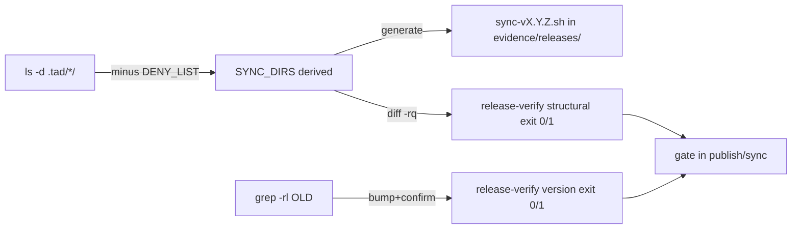

---
# Quality Chain Metadata (Alex 必填 - Phase 4 Hook 将基于此阻塞 Gate 3)
task_type: mixed      # code (shell libs) + yaml/doc (SKILL upgrades) — mixed
e2e_required: no      # no live downstream sync in P1; dogfood is on synthetic dirs in TAD repo
research_required: no # design fully grounded by phase1-grounding.md + DR

git_tracked_dirs: [".tad/hooks/lib"]  # the new stable verification primitives must be git-tracked

skip_knowledge_assessment: no  # mixed/code → keep the ceremony

gate4_delta: []
---

# Handoff Document for Agent B (Blake)
## TAD v3.1 - Evidence-Based Development

**From:** Alex (Agent A - Solution Lead)
**To:** Blake (Agent B - Execution Master)
**Date:** 2026-06-01
**Project:** TAD Framework
**Task ID:** TASK-20260601-001
**Handoff Version:** 3.1.0
**Epic:** EPIC-20260601-self-deriving-release-sync.md (Phase 1/2)
**Supersedes:** N/A

---

## 🔴 Gate 2: Design Completeness (Alex必填)

**执行时间**: 2026-06-01

### Gate 2 检查结果

| 检查项 | 状态 | 说明 |
|--------|------|------|
| Architecture Complete | ✅ | Two stable libs + 2 SKILL upgrades. Boundaries from DR + grounding three-category model. |
| Components Specified | ✅ | `release-verify.sh` (structural/version modes), `derive-sync-set.sh` (deny-list + sub-path rule), runbook derive+verify, alex gate wiring. |
| Functions Verified | ✅ | Mirrors `codex-parity-check.sh` style (exit-code contract, LC_ALL=C, BSD-safe). `sync-v2.21.0.sh` `diff -rq` verify pattern reused. |
| Data Flow Mapped | ✅ | `ls -d .tad/*/` → minus DENY_LIST → SYNC_DIRS → per-release script + `diff -rq` gate. grep `$OLD` → bump → grep-confirm. |

**Gate 2 结果**: ✅ PASS

**Alex确认**: 我已验证所有设计要素，Blake可以独立根据本文档完成实现。

---

## 📋 Handoff Checklist (Blake必读)

- [ ] 阅读了所有章节
- [ ] **阅读了「📚 Project Knowledge」章节中的历史经验**
- [ ] 所有"强制问题回答（MQ）"都有证据
- [ ] 理解了真正意图（不只是字面需求）
- [ ] 每个Phase的交付物和证据要求都清楚
- [ ] 确认可以独立使用本文档完成实现

---

## 1. Task Overview

### 1.1 What We're Building
Kill the recurring "publish/sync silently misses files" disease by replacing TAD's three hardcoded
release lists with **structure-derived rules** + **structure-agnostic verification gates** that
HARD-BLOCK a minor+ release on any mismatch.

Concretely, P1 delivers:
1. `.tad/hooks/lib/release-verify.sh` — stable verification primitives: `structural` (`diff -rq`
   source-vs-target over derived paths) + `version` (`grep` zero-stale).
2. `.tad/hooks/lib/derive-sync-set.sh` — deny-list derivation of the SYNC dir set (three-category model,
   incl. `capability-packs` registry-only sub-rule + per-release-script-to-`evidence/releases` rule).
3. Convert the sync to deny-list derivation (per-release `sync-vX.Y.Z.sh` generated from the derived set,
   written under `.tad/evidence/releases/`).
4. Convert version bump to grep-derivation (with the LOCATION-precise history-table-row exclusion — §4.2 Version Exclusion Contract).
5. Upgrade `release-runbook` SKILL — add the derive+verify procedure; demote the 18-item + 14-dir
   hardcoded tables to "DERIVED — illustrative only / non-authoritative".
6. Wire a release-time HARD-BLOCK verification gate (minor+ block, patch advisory; NOT a settings.json
   hook) into `publish_protocol` + `sync_protocol` in `.claude/skills/alex/SKILL.md`.

### 1.2 Why We're Building It
**业务价值**：Every past release silently omitted files (codex frozen a month, tad.sh stuck at 2.19.1,
config.yaml stuck at 2.8.0). The root cause is always the same: hardcoded lists go stale when the doc
structure evolves. Derived rules don't drift; the gate catches any omission regardless.
**用户受益**：A new framework dir (the next `codex`-type) is auto-included with zero list edits; a new
version-ref location is auto-covered; a release with any omission is BLOCKED, not silently shipped.
**成功的样子**：When you can add `.tad/foo/` to source, run `*sync`, and `foo` reaches downstream with no
list edit — AND a deliberately-omitted dir HARD-BLOCKS the release — this is done.

### 1.3 🆕 Intent Statement（意图声明）

**真正要解决的问题**：The hardcoded-list disease. Encode RULES (derive + verify), not LISTS.

**不是要做的（避免误解）**：
- ❌ 不是 a capability pack — this is TAD's own internal SOP, a `release-runbook` SKILL upgrade.
- ❌ 不是 a settings.json PreToolUse/SessionStart hook — single-user-CLI lesson (architecture.md
  2026-04-15). The gate is **release-time only**, invoked inside `*publish`/`*sync`.
- ❌ 不是 running a live downstream sync in P1 — dogfood is on SYNTHETIC dirs in the TAD repo only.
  Blast radius = TAD repo.
- ❌ 不是 tad.sh installer changes — that is P2 (separate code path).

**Blake请确认理解**：
```
在开始实现前，请用你自己的话回答：
1. 这个功能解决什么问题？(为什么 deny-list 比 14-dir allow-list 更抗腐化？)
2. 三类目录模型 (zero-touch / framework / transient) 各包含哪些目录？capability-packs 的特殊规则是什么？
3. 成功的标准是什么？(AC4 反剧场 dogfood 为什么是 load-bearing 的？)

只有Human确认你的理解正确后，才能开始实现。
```

---

## 📚 Project Knowledge（Blake 必读）

**⚠️ MANDATORY READ — Blake 在开始实现前，必须执行以下 Read 操作：**
1. Read ALL `.tad/project-knowledge/*.md` files listed in 步骤 2 below
2. Read this handoff's "⚠️ Blake 必须注意的历史教训" entries carefully
3. This is NOT optional — project knowledge prevents repeated mistakes

### 步骤 1：识别相关类别

本次任务涉及的领域：
- [x] code-quality - shell 脚本模式/反模式 (grep bugs, heredoc, LC_ALL=C)
- [x] architecture - derive-don't-hardcode, single-user-CLI gate placement, registry desync
- [x] security - CLI arg validation in shell libs
- [ ] ux / performance / testing / api-integration / mobile-platform — 无直接相关

### 步骤 2：历史经验摘录

**已读取的 project-knowledge 文件**：

| 文件 | 相关记录数 | 关键提醒 |
|------|-----------|----------|
| architecture.md | 4 | single-user-CLI: soft reminders not mechanical hooks (2026-04-15); registry/scan separation (2026-05-04); Drift-check allowlist shared files (2026-04-24); `.router.log` 5-tuple = consumed-output contract |
| code-quality.md | 3 | **grep -c + sort -u \| wc -l 总是返回 1** (2026-05-27); `comm -12` CJK needs `LC_ALL=C` on BOTH sorts AND comm (2026-05-31); `\|` in ERE is literal not alternation |
| security.md | 1 | bash heredoc 中插值 user CLI 参数前必须整数/格式校验 (2026-05-28) |

**⚠️ Blake 必须注意的历史教训**：

1. **Mechanical Enforcement Rejected on Single-User CLI** (architecture.md, 2026-04-15) ⚠️ SAFETY
   - 问题：PreToolUse hooks fail-closed on missing deps → deny all tool calls. User verdict: 日常恢复成本 > 收益.
   - 解决方案：The verification gate MUST be release-time only — invoked inside `*publish`/`*sync` protocol
     steps. It must NEVER be wired into `.claude/settings.json` (AC6 asserts `grep -c` on settings.json = 0).

2. **AC grep-count bug: `grep -c … | sort -u | wc -l` always returns 1** (code-quality.md, 2026-05-27)
   - 问题：`grep -c` 对单文件输出 ONE number → `sort -u` on one number → `wc -l` = 1, regardless of content.
   - 解决方案：For "count distinct matches" use `grep -oE 'a|b|c' file | sort -u | wc -l` (drop `-c`).
     ALL §9.1 commands in this handoff already follow this. Do NOT reintroduce `-c` in count pipelines.

3. **`\|` in ERE is a literal pipe, not alternation** (code-quality.md / template §9.1 pipe-escape note)
   - 问题：Markdown tables render `|` as `\|`. Running the rendered form `grep -cE 'a\|b\|c'` matches the
     literal string `a|b|c` (nothing). 0 hits looks like "clean" — a false negative.
   - 解决方案：UN-ESCAPE before running: `grep -E 'a|b|c'`. §9.1 commands below are written in BARE-PIPE
     runnable form already (no `\|`). Run them verbatim.

4. **`comm`/`sort` over text that MAY contain non-ASCII needs `LC_ALL=C`** (code-quality.md, 2026-05-31)
   - 问题：ambient `en_US.UTF-8` collation mis-pairs lines → phantom set-intersections / wrong diffs.
   - 解决方案：Any `sort`/`comm` in the new libs → prefix `LC_ALL=C` (mirror codex-parity-check.sh).

5. **Registry / scan separation — decision state belongs in a side-file** (architecture.md, 2026-05-04;
   code-quality.md, 2026-05-31)
   - 问题：A flag added to an auto-regenerated file is clobbered on next regen.
   - 解决方案：The DENY_LIST is the only hand-maintained datum — keep it as an explicit, documented constant
     IN `derive-sync-set.sh` (a `.sh` is not auto-regenerated), not injected into any scanned registry.

### Blake 确认
- [ ] 我已阅读上述历史经验
- [ ] 我理解需要避免的问题
- [ ] 如遇到类似情况，我会参考上述解决方案

---

## 2. Background Context

### 2.1 Previous Work
- `.tad/scripts/sync-v2.21.0.sh` (116 lines) — this session's brittle per-release script. Its
  `FRAMEWORK_DIRS` is a hardcoded 15-item list (old 14 + codex). Its `verify_one()` already uses
  `diff -rq` source-vs-target per dir — that IS the omission-catcher pattern we systematize. **Reuse the
  `diff -rq` verify shape; replace the hardcoded list with derivation.**
- `.tad/hooks/lib/codex-parity-check.sh` (this session's sibling) — the per-owner derive+gate style to
  mirror: `set -euo pipefail`, exit-code contract (0=ok / 1=drift / 2=usage), `LC_ALL=C` on sort/comm,
  BSD-safe (no `grep -P`), fail-CLOSED on parse error, usage block, named layers with echo headers.

### 2.2 Current State
- `release-runbook/SKILL.md`: Phase 2 has the hardcoded **18-item version table** (L70-110), Phase 5 has
  the hardcoded **14-dir framework table** (L183-244). Both are the stale source of the disease.
- `alex/SKILL.md`: `publish_protocol` (L5155) already has a `step3b` Codex parity gate (L5234, BLOCKING on
  minor+, detect-only) and a `step4` Confirm&Execute (L5254) — **the new structural/version gate slots in
  as a sibling step BEFORE Confirm&Execute** (same blocking model). `sync_protocol` (L5278) `step3`
  executes per-project sync; the new gate slots in as a per-project **post-copy** check.

### 2.3 Dependencies
- `bash`, `diff`, `grep`, `sort` (BSD/macOS — no GNU-only flags). No new external tools.
- `.tad/sync-registry.yaml` (read-only here — registry untouched in P1).

---

## 3. Requirements

### 3.1 Functional Requirements
- **FR1 — `release-verify.sh structural <src_root> <target_root>`**: derive the SYNC path set (calls
  `derive-sync-set.sh`), run `diff -rq "$src/.tad/$d" "$target/.tad/$d"` for each derived dir (+ the
  `capability-packs/pack-registry.yaml` file + `.claude/skills`), exit 0 if all identical, exit 1 and
  NAME each missing/differing path otherwise. Structure-agnostic. Mirror sync-v2.21.0.sh `verify_one`.
- **FR2 — `release-verify.sh version <repo_root> <expected_version> [<old_version>]`**: grep the repo for
  any **non-historical** stale version ref; exit 0 if none, exit 1 + list the offending file:line
  otherwise. Exclude `.git`, the zero-touch dirs (read from `derive-sync-set.sh --zero-touch` — NOT a
  second hardcoded list), and — per the **Version Exclusion Contract** in §4.2 — ONLY lines that are BOTH
  in `{README.md, INSTALLATION_GUIDE.md, CHANGELOG.md}` AND match the history-table-ROW regex (the only
  legit `$OLD` survivors). Usage error → exit 2.
- **FR3 — `derive-sync-set.sh [--dirs|--report|--zero-touch|--registry-only] [<root>]`**: print the derived
  SYNC dir set = `{ls -d .tad/*/} − DENY_LIST`. `--report` additionally prints the three-category
  classification so a newly-included dir is VISIBLE (bias-to-sync + REPORT the synced set). `--zero-touch`
  prints the 8 category-A dirs (consumed by `version`); `--registry-only` prints
  `capability-packs/pack-registry.yaml` (consumed by the generator + `structural`). Emit `capability-packs`
  in `--dirs`; the registry sub-path rule is exposed via `--registry-only` (single enforcement point);
  emit the per-release-script destination note (`.tad/evidence/releases/`).
- **FR9 — Unconditional synced-set REPORT each gate run (resolves arch-S4 — promoted to AC, see AC8)**: the
  release gate (both publish and sync wiring) MUST emit the `derive-sync-set.sh --report` synced set on
  EVERY run (not only on failure), so a newly-included dir is auditable at gate time per the bias-to-sync
  design. This is now an AC (AC8), not a prose-only requirement.
- **FR4 — Deny-list derivation correctness**: `DENY_LIST = {project-knowledge, active, archive, evidence,
  pair-testing, decisions, github-registry, research-notebooks, working, spike-v3, reports, checklists}`
  + top-level deny `sync-registry.yaml` + sub-path rule `capability-packs → only pack-registry.yaml`. A
  new unclassified dir defaults to SYNC (framework).
- **FR5 — Sync uses deny-list derivation**: the per-release one-shot script (`sync-vX.Y.Z.sh`) is
  GENERATED from `derive-sync-set.sh --dirs` output (not a hand-typed list), and is written under
  `.tad/evidence/releases/` (zero-touch ⇒ NOT in the synced set ⇒ keeps `scripts/` framework-clean).
- **FR6 — Version bump is grep-derived**: documented procedure: `grep -rl "$OLD"` (scoped) enumerates ALL
  refs to bump → bump → `grep -rn "$OLD"` (same scope, excluding version-history lines) MUST be empty.
- **FR7 — runbook upgraded**: derive+verify procedure present; the 18-item + 14-dir tables marked
  "DERIVED — illustrative only / non-authoritative".
- **FR8 — release-time gate wired**: into `publish_protocol` (before tag/Confirm&Execute) + `sync_protocol`
  (after per-project copy) as **minor+ HARD BLOCK / patch advisory**; NOT in settings.json.

### 3.2 Non-Functional Requirements
- **NFR1**: BSD/macOS-safe shell only (no `grep -P`, no GNU `sed -i` without `''`). `LC_ALL=C` on all
  sort/comm. Mirror codex-parity-check.sh conventions.
- **NFR2**: `release-verify.sh` is the **stable** (written-in-stone) lib — structure-agnostic, exit-code
  contract is a consumed API (the gate reads exit codes). Document the contract in a header CONTRACT block
  (per `.router.log` 5-tuple lesson — consumed output needs a contract). The CONTRACT header MUST also pin
  the `--dirs` OUTPUT FORMAT (one ASCII basename per line, `LC_ALL=C sort`, no trailing slash, no path
  prefix) as a consumed contract — the generator AND `structural` parse it, so a format change (trailing
  slash / full path) is a breaking change (arch-S2).
- **NFR4 — P2 embeddability contract (resolves arch-P1-3).** `tad.sh` installs via `curl … | bash` on a
  FRESH machine where `.tad/hooks/lib/` does NOT yet exist, so P2 CANNOT `source` these libs at install
  time. `derive-sync-set.sh` MUST therefore keep its derivation **logic** as a pure, repo-context-free
  block: accept `<root>` (already does) AND express `DENY_LIST` + `ZERO_TOUCH` + the `grep -vxE` derivation
  as a single COPY-PASTEABLE constant+pipeline block. The CONTRACT header MUST mark which part is
  "embeddable verbatim into a standalone installer" (the DENY_LIST constant + the `ls -d | sed | grep -vxE
  | LC_ALL=C sort` pipeline) vs "repo-context only" (anything reading `.tad/` siblings). This lets P2's
  `tad.sh` either curl-fetch the lib then source it, OR inline-embed the SAME constant block — preventing a
  second drifting copy of the derivation (the Epic's stated anti-goal). Forward-compat field added now per
  architecture.md "pre-allocate forward-compatibility fields".
- **NFR3**: fail-CLOSED on parse/usage error (exit 2 treated as FAIL at the release gate), mirroring the
  parity gate (`if check errors (exit 2) → treat as FAIL`).

---

## 4. Technical Design

### 4.1 Architecture Overview
Two stable libs in `.tad/hooks/lib/` (the only written-in-stone part) + two SKILL upgrades. The libs
DERIVE; the SKILLs INVOKE + document. The per-release script is transient (regenerated each release,
archived under evidence). The verification gate — not the script's freshness — is the real guarantee.

```
ls -d .tad/*/  ──┐
                 ├─► derive-sync-set.sh ──► SYNC_DIRS (20 on today's 32-dir tree, auto-grows)
DENY_LIST  ──────┘                              │
                                                ├─► generate sync-vX.Y.Z.sh (→ evidence/releases/)
                                                └─► release-verify.sh structural ─► diff -rq ─► exit 0/1
grep -rl "$OLD" (scoped) ─► bump ─► release-verify.sh version ─► grep zero-stale ─► exit 0/1
                                                                       │
            publish_protocol (pre-Confirm&Execute) ◄──── exit 0/1 ────┤  minor+ = HARD BLOCK
            sync_protocol   (post per-project copy) ◄──── exit 0/1 ────┘  patch  = advisory
```

**Three-gate composition (publish-side source-consistency — no source-consistency hole) — resolves cr-P0-2 + arch-P1-4:**

At `*publish` there is NO target tree to diff, so `structural` (source-vs-target) is **sync-only by
design**. The publish-side intra-repo consistency is covered by a NON-OVERLAPPING composition of three
already-owned gates — there is **NO source-consistency hole**:

| Gate | Runs at | Guards (publish-side intra-repo axis) | Status |
|------|---------|----------------------------------------|--------|
| **step3b — codex parity** (`codex-parity-check.sh`, already wired, BLOCKING minor+) | publish | cross-vendor edition drift: codex/gemini SKILL editions vs Claude editions are at parity | existing |
| **step3c — version** (`release-verify.sh version`, NEW this handoff) | publish | zero non-historical stale version refs anywhere in the source repo | NEW |
| **scan-packs registry regen** (`scan-packs.sh`, existing release pre-flight) | publish | `capability-packs/pack-registry.yaml` is regenerated from the live pack tree (registry-vs-tree consistency) — note: this is a regen, run it before tag | existing (note) |
| **structural** (`release-verify.sh structural`, NEW) | **sync only** | source-vs-target byte-identity over derived framework paths | NEW (sync-side) |

Composition statement (state verbatim in the runbook + lib CONTRACT header): *"Publish-side
source-consistency = step3b (codex parity) + step3c (version zero-stale) + scan-packs registry regen.
`structural` is sync-only by design (no target exists at publish). There is NO publish-time
source-consistency hole — the three publish gates cover the cross-vendor / version / registry-vs-tree axes
respectively."* No additional intra-repo structural self-check is required; the gap cr-P0-2 flagged is
covered by this explicit composition, not left silent. (If a future axis emerges that NONE of the three
cover, add a lightweight intra-repo structural self-check at publish then — out of P1 scope, none exists
today.)

### 4.2 Component Specifications

**`derive-sync-set.sh`** (CREATE) — the **SOLE source of truth** for DENY_LIST, the zero-touch subset, AND
the capability-packs registry-only sub-rule. All three consumers (`--dirs` output, the per-release script
generator, `release-verify.sh structural`/`version`) READ these from here; NONE re-implements a basename
mini-list (resolves cr-P1-3 + cr-P1-4).
- Usage: `derive-sync-set.sh [--dirs|--report|--zero-touch|--registry-only] [<root=.>]`. Default `--dirs`.
- `DENY_LIST` = explicit documented constant (the 12 dirs above). `ZERO_TOUCH` = the **8 category-A dirs**
  (`project-knowledge active archive evidence pair-testing decisions github-registry research-notebooks`) —
  a NAMED subset of DENY_LIST (the remaining 4 are category-C transient). `TOP_DENY="sync-registry.yaml"`.
  `REGISTRY_ONLY="capability-packs"` (sub-path rule marker) with `REGISTRY_FILE="pack-registry.yaml"`.
- **`--dirs`**: `ls -d "$root"/.tad/*/` → basename (normalize: strip any leading `./` and trailing `/`) →
  `grep -vxE` the DENY_LIST → `LC_ALL=C sort` → print one dir per line. (Use a `grep -vxE '(a|b|c)'`
  whole-line alternation — BARE pipe, no `\|`.) `capability-packs` IS emitted here as a normal dir line;
  its sub-path rule is exposed separately via `--registry-only` (consumers must NOT special-case the
  basename themselves — they query `--registry-only`).
- **`--zero-touch`**: print the 8 category-A dir names (one per line, `LC_ALL=C sort`). This is the ONLY
  authoritative source of the version-scope exclusion set — `release-verify.sh version` reads it instead of
  hardcoding a second zero-touch list (resolves cr-P1-4 + arch-S1).
- **`--registry-only`**: print the single machine-readable line `capability-packs/pack-registry.yaml` (the
  ONE sub-path rule). The per-release generator and `release-verify.sh structural` BOTH read this to know
  "for `capability-packs`, sync/diff only this file, never the dir tree" — so the registry-only basename
  special-case lives HERE ALONE and is consumed, never re-implemented in 3 places (resolves cr-P1-3).
- **`--report`**: print three sections (ZERO-TOUCH / FRAMEWORK-SYNC / TRANSIENT) + the special-case notes
  (capability-packs registry-only; per-release scripts → evidence/releases/). This is the
  "REPORT the synced set" requirement so a newly-included dir is auditable.
- Exit 0 normal; exit 2 on bad flag / missing root.

**`release-verify.sh`** (CREATE) — header CONTRACT block (consumed exit-code API).
- `structural <src_root> <target_root>`: for each dir from `derive-sync-set.sh --dirs "$src_root"`:
  if the dir matches the basename in `derive-sync-set.sh --registry-only` (i.e. `capability-packs`), diff
  ONLY the sub-path that command names (`capability-packs/pack-registry.yaml`) — do NOT dir-level diff it;
  otherwise `diff -rq "$src/.tad/$d" "$target/.tad/$d"`. **The registry-only special-case is READ from
  `--registry-only`, never hardcoded as a `== capability-packs` check here** (resolves cr-P1-3). Also
  `diff -rq "$src/.claude/skills" "$target/.claude/skills"`. Collect non-empty diffs → print each named
  path → exit 1; all clean → exit 0.
- **`structural` byte-identity contract (resolves arch-P1-2).** `structural` runs **AFTER** the SYNC copy
  step (it is the sync-side post-copy gate), where files are copied VERBATIM (`cp -R`) — so the derived
  framework dirs + `capability-packs/pack-registry.yaml` ARE expected byte-identical source-vs-target, and
  `diff -rq` is the correct equality check. **`install.sh`/`tad.sh` transforms (codex AGENTS.md generation,
  frontmatter rewrites, edition-specific edits) are a tad.sh/P2 concern — NOT this gate.** This gate diffs a
  VERBATIM-SYNCED target, not an install-transformed one. Paths expected byte-identical post-sync: every
  derived framework dir under `.tad/` (verbatim `cp -R`) + `capability-packs/pack-registry.yaml`. NOTE on
  `.claude/skills`: include it in the diff ONLY for the verbatim-synced skills path; if a downstream target
  is install-transformed (mixed-vendor editions), that target is out of this gate's scope (it gates the
  verbatim sync output, per the sync_protocol post-copy wiring in §6.2). The first-real-release advisory
  mode (§ below) exists precisely to surface any unexpected install-transform diff before it HARD-BLOCKs.
- `version <repo_root> <expected> [<old>]`: build the grep scope = repo minus `.git` minus the **zero-touch
  dirs read from `derive-sync-set.sh --zero-touch`** (NOT a second hardcoded list — see Version Exclusion
  Contract below, resolves cr-P1-4 + arch-S1); `grep -rn "$OLD"` for a stale version ref; drop ONLY the
  whitelisted historical-version-history LINES per the contract below; print survivors → exit 1; none →
  exit 0. Bad args → exit 2.
- Mode dispatch via `case "$1"`; unknown mode → usage + exit 2.

**Version Exclusion Contract (concrete, testable — resolves cr-P0-1 + arch-S1).** The exclusion is the
load-bearing logic; it is a LOCATION-precise file+line rule, NOT a shape-only match that would silently
exclude any stale ref sitting in a table cell:

1. **File allow-list for history exclusion (exact set — no other file may exclude a `$OLD` ref):**
   `README.md`, `INSTALLATION_GUIDE.md`, `CHANGELOG.md` (match by basename anywhere in the repo). A `$OLD`
   ref in ANY OTHER file is ALWAYS a straggler → reported (this is precisely the tad.sh / config.yaml live
   assignment class, which is NOT in these three files → never excluded).
2. **Line-region rule WITHIN those three files (BSD `grep -E`, bare-pipe):** a `$OLD` match line is excluded
   ONLY IF it is BOTH (a) in one of the three allow-list files AND (b) the line itself matches the
   history-row regex
   `^[[:space:]]*\|.*v?[0-9]+\.[0-9]+\.[0-9]+.*\|`
   (a markdown table ROW — leading optional-space `|`, a semver token, a closing `|`). This is an
   ON-THE-LINE test, so there is NO heading-to-EOF region ambiguity (the `### 9.1` vs `## 9.1` depth hazard,
   code-quality.md 2026-05-31, does not apply — we never key on a heading terminator). A `$OLD` in a
   PROSE line, a code-assignment line, or a non-table line in these same files is STILL reported.
3. **Implementation shape (single pass, fail-CLOSED):**
   `grep -rn "$OLD" <scope>` → for each hit, exclude iff `file ∈ {README.md, INSTALLATION_GUIDE.md,
   CHANGELOG.md}` AND `line =~ ^[[:space:]]*\|.*v?[0-9]+\.[0-9]+\.[0-9]+.*\|`. Survivors → exit 1 naming
   each `file:line`. (Use `awk`/`grep -E` filters; LC_ALL=C; no `grep -P`.)
4. **Why location-precise beats shape-only (the cr-P0-1 false-PASS):** a shape-only `| **vX.Y.Z** |`
   exclusion applied repo-wide would silently drop a stale ref that happens to live in ANY table cell
   (a comparison table, a sync-registry `| project | version |` row, a "current version" badge). Pinning
   the exclusion to BOTH the 3-file allow-list AND the on-line table-row regex means a straggler in a table
   cell OUTSIDE those 3 files is still caught.

### 4.3 Data Models

**The three-category classification (authoritative — from grounding):**

| Category | Dirs | Sync? |
|----------|------|-------|
| **A. zero-touch** (preserve target's own) | `project-knowledge active archive evidence pair-testing decisions github-registry research-notebooks` + top-level `sync-registry.yaml` | NEVER |
| **B. framework** (the silently-omitted ones) | old-14 (`agents data domains gates guides hooks ralph-config references schemas skills sub-agents tasks templates workflows`) + `codex cross-model context tests scripts` + `capability-packs` (registry-only) | SYNC |
| **C. transient / main-only** | `working spike-v3 reports checklists` | do NOT sync |

**DENY_LIST (constant) = A's dirs (8) + C's dirs (4) = 12.** Live `ls -d .tad/*/` = **32** today (re-run
2026-06-01 on the current working tree); all 12 deny names exist as dirs ⇒ **32 − 12 = 20** SYNC dirs,
incl. `codex cross-model context tests scripts capability-packs`. (Re-verified live by Alex 2026-06-01 —
see §9.1 SC1.) **The `20` is NOT a load-bearing pinned count** — it is the derived result on TODAY's tree
and is expected to grow as framework dirs are added. The acceptance contract is MEMBERSHIP + SET-EQUALITY
(SC1), NOT a fixed `wc -l`. (Supersedes the earlier inconsistent 33/31 figures in grounding/§4.3 — those
were stale snapshots; 32 is the reconciled live total.)

**Special cases (MUST handle explicitly):**
- `capability-packs/` → sync `pack-registry.yaml` ONLY (pack sources reach downstream as installed
  `.claude/skills` via install.sh; existing runbook rule preserved). The one dir with a sub-path rule —
  exposed via `derive-sync-set.sh --registry-only` (single enforcement point; the generator AND
  `release-verify.sh structural` READ it, never re-implement a `== capability-packs` basename check; cr-P1-3).
- per-release one-shot scripts → write to `.tad/evidence/releases/` (under evidence/ = zero-touch ⇒
  auto-excluded from SYNC), NOT to `scripts/` (keeps `scripts/` framework-clean).

### 4.4 API Specifications (exit-code contract — the consumed API)
| Command | exit 0 | exit 1 | exit 2 |
|---------|--------|--------|--------|
| `derive-sync-set.sh --dirs` | printed SYNC dir set (1 basename/line, LC_ALL=C sort — consumed format) | (n/a) | bad flag/root |
| `derive-sync-set.sh --zero-touch` | the 8 category-A dirs (consumed by `version`) | (n/a) | bad flag/root |
| `derive-sync-set.sh --registry-only` | `capability-packs/pack-registry.yaml` (consumed by generator + `structural`) | (n/a) | bad flag/root |
| `release-verify.sh structural` | source==target over derived paths | ≥1 missing/differing (named) | usage |
| `release-verify.sh version` | zero non-historical stale | ≥1 stale (named file:line) | usage |

Gate rule (in both protocols): `exit 0` → proceed; `exit 1 or 2` AND `release_type ∈ {minor,major}` →
HARD BLOCK; `exit 1 or 2` AND `release_type == patch` → advisory WARN + proceed. **The gate MUST echo the
raw exit code + mode on every non-zero (`GATE: release-verify <mode> exit=<n>`), so a fail-CLOSED usage
error (exit 2) is distinguishable from a real drift (exit 1) — both block on minor+, but the operator must
be able to tell a wiring bug from a true omission (resolves cr-P2-5).**

**Advisory / shadow mode for the first real cutover (`TAD_RELEASE_GATE=warn`) — resolves arch-P1-1.** P1
rewires `publish_protocol` + `sync_protocol` to a never-run-on-real-downstream blocker with minor+
HARD-BLOCK authority. To de-risk the FIRST real release, both gate steps MUST honor an env flag
`TAD_RELEASE_GATE=warn` that downgrades `block → warn` (report the verdict + named paths, but proceed) even
on minor+. Default (unset) = HARD-BLOCK on minor+ as specified. The runbook MUST document: "for the first
real minor+ `*publish`/`*sync` after this change, run with `TAD_RELEASE_GATE=warn`, compare the gate's
verdict against a manual check, then UNSET it (flip to hard-block) for all subsequent releases." This is the
ship-the-detector-in-shadow-mode-before-it-gates pattern; ~5 lines per step. (The dogfood in P1 is on
synthetic dirs only and does NOT prove behavior against a real installed downstream — the shadow flag
covers that unproven path.)

### 4.5 User Interface Requirements
CLI text output only (echoed layer headers + named offending paths, mirroring parity-check style). No GUI.

---

## 5. 🆕 强制问题回答（Evidence Required）

### MQ1: 历史代码搜索
**问题**：用户是否提到"之前的"、"原来的"、"我们的方案"？
- [x] 是 → DR + grounding cite the brittle `sync-v2.21.0.sh` and the existing `diff -rq` verify pattern.

#### 搜索证据
```bash
# The brittle per-release pattern to systematize:
.tad/scripts/sync-v2.21.0.sh  # FRAMEWORK_DIRS hardcoded (L11); verify_one() diff -rq (L66-89)
# The sibling derive+gate style to mirror:
.tad/hooks/lib/codex-parity-check.sh  # exit contract, LC_ALL=C, fail-CLOSED, named layers
```
#### 决策说明
- **找到了什么**：sync-v2.21.0.sh already does `diff -rq` source-vs-target verification per dir.
- **决定**：✅ 复用 the `diff -rq` verify shape (FR1); ❌ 创建新的 derivation logic to replace the
  hardcoded `FRAMEWORK_DIRS` list.
- **原因**：The verify shape is correct and battle-tested this session; only the LIST is brittle.

### MQ2: 函数存在性验证
**问题**：设计中调用了哪些函数？它们都存在吗？

| 函数/命令 | 文件位置 | 验证 | 说明 |
|--------|---------|------|------|
| `derive-sync-set.sh --dirs` | NEW (`.tad/hooks/lib/`) | (new — will be created) | Consumed by release-verify.sh structural + generator |
| `derive-sync-set.sh --zero-touch` | NEW (`.tad/hooks/lib/`) | (new — will be created) | Consumed by release-verify.sh version (single-source zero-touch exclusion) |
| `derive-sync-set.sh --registry-only` | NEW (`.tad/hooks/lib/`) | (new — will be created) | Consumed by structural + generator (single-source registry sub-rule) |
| `diff -rq` | system (BSD) | ✅ 存在 | used in sync-v2.21.0.sh:75 |
| `grep -vxE` / `grep -rn` / `grep -rl` | system (BSD) | ✅ 存在 | BSD-safe; NO `grep -P` |
| `LC_ALL=C sort` | system | ✅ 存在 | per codex-parity-check.sh:72 |
| `release-verify.sh structural/version` | NEW (`.tad/hooks/lib/`) | (new — will be created) | Consumed by the gate steps |

### MQ3: 数据流完整性
**问题**：派生出哪些路径？都被验证覆盖了吗？

| 派生路径 | 用途 | 验证覆盖 | 是否覆盖 |
|---------|------|---------|---------|
| derived SYNC dirs (deny-list, set-equality) | 要 sync 的目录 | `diff -rq` per dir | ✅ |
| `capability-packs/pack-registry.yaml` | registry-only sub-rule (read from `--registry-only`) | file-level `diff -rq` | ✅ |
| `.claude/skills` | framework skills | `diff -rq` | ✅ |
| version refs (`grep -rl $OLD`) | 要 bump 的文件 | `grep -rn $OLD` zero-stale | ✅ |



### MQ4: 视觉层级
- [x] 有不同状态 → exit codes are the states.

| 状态 | 视觉表现 | 含义 |
|------|---------|------|
| exit 0 | `✅ identical` / `PASS` | source==target / zero stale → proceed |
| exit 1 | `❌ <named path> DIFF` / stale `file:line` | omission/stale → BLOCK (minor+) |
| exit 2 | `ERROR: usage` | parse/usage → fail-CLOSED (treat as FAIL) |

### MQ5: 状态同步
**问题**：DENY_LIST 存在几个地方？

| 数据 | 存储位置1 | 存储位置2 | 同步 |
|------|----------|----------|------|
| DENY_LIST | `derive-sync-set.sh` (SOLE source) | — | 单一存储 |
| ZERO_TOUCH (8-dir) | `derive-sync-set.sh` (`--zero-touch`) | `release-verify.sh version` READS it | 单一存储（READ，不复制）|
| registry-only rule | `derive-sync-set.sh` (`--registry-only`) | `structural`+generator READ it | 单一存储（READ，不复制）|

```
DENY_LIST + ZERO_TOUCH (8-dir subset) + REGISTRY_ONLY rule → derive-sync-set.sh (唯一存储)
  → release-verify.sh version  READS --zero-touch  (NOT a second hardcoded list — cr-P1-4/arch-S1)
  → release-verify.sh structural + generator  READ --registry-only  (NOT a 3rd == capability-packs — cr-P1-3)
✅ 单一权威存储。runbook table 是 illustrative-only，引用 derive-sync-set.sh，不复制 list。
```
**Human验证点**：DENY_LIST / ZERO_TOUCH / registry-only 必须只在 `derive-sync-set.sh` 一处定义；
`release-verify.sh` version 的 zero-touch 排除、structural 的 registry-only 特例、generator 的 registry 特例
都必须 READ 对应 flag，不得各自硬编码（否则重新制造本 Epic 要杀死的病）。runbook 不得复制成第二份权威 list。

---

## 6. Implementation Steps（分Phase）

> 本 handoff = Epic Phase 1 (单一 Blake 工作单元)。以下 6.x 子步骤顺序执行。

### 6.1 Micro-Tasks

| # | File | Operation | Verification Command | Est. Time |
|---|------|-----------|---------------------|-----------|
| 1 | `.tad/hooks/lib/derive-sync-set.sh` | CREATE: deny-list derivation `--dirs`/`--report`/`--zero-touch`/`--registry-only`, documented DENY_LIST+ZERO_TOUCH constants (single source of truth), sub-path + transient notes, embeddability CONTRACT header | `bash .tad/hooks/lib/derive-sync-set.sh --dirs \| grep -qx codex && echo OK` | 30 min |
| 2 | `.tad/hooks/lib/release-verify.sh` | CREATE: `structural` (diff -rq over derived paths) + `version` (grep zero-stale) modes, CONTRACT header, exit 0/1/2 | `bash .tad/hooks/lib/release-verify.sh structural "$PWD" "$PWD"; echo $?` ⇒ 0 | 40 min |
| 3 | `.claude/skills/release-runbook/SKILL.md` | MODIFY: add derive+verify procedure (Phase 2 + Phase 5); mark 18-item & 14-dir tables "DERIVED — illustrative only"; document evidence/releases per-release-script location | grep checks SC5/SC6 | 30 min |
| 4 | `.claude/skills/alex/SKILL.md` | MODIFY: wire structural+version gate into `publish_protocol` (new step before step4) + `sync_protocol` step3 (post-copy); minor+ HARD BLOCK / patch advisory; NOT settings.json | grep checks SC7/SC8 | 30 min |
| 5 | (dogfood) | AC4 anti-theater synthetic-dir + synthetic version-ref test; AC7 re-derive == v2.21.0 sync set | see §9 AC4/AC7 — paste raw output | 25 min |

### 6.2 实施步骤 (detail)
1. **derive-sync-set.sh**: header (`#!/usr/bin/env bash`, `set -euo pipefail`, CONTRACT note incl.
   embeddability marking per NFR4). Define `DENY_LIST` (12 dirs, documented), `ZERO_TOUCH` (the 8 cat-A
   subset), `TOP_DENY`, `REGISTRY_ONLY="capability-packs"` + `REGISTRY_FILE="pack-registry.yaml"`. `--dirs`:
   `ls -d "$root"/.tad/*/` → normalize basename (strip leading `./`, trailing `/`): `sed 's|.*/.tad/||;s|/$||'`
   → `grep -vxE '(project-knowledge|active|archive|evidence|pair-testing|decisions|github-registry|research-notebooks|working|spike-v3|reports|checklists)'`
   → `LC_ALL=C sort`. `--zero-touch`: print the 8 ZERO_TOUCH dirs (`LC_ALL=C sort`). `--registry-only`:
   print `capability-packs/pack-registry.yaml`. `--report`: three labelled sections + special-case notes.
   Bad flag → exit 2. (Do NOT write the literal word `codex` anywhere, incl. comments — SC2.)
2. **release-verify.sh**: `case "$1"` dispatch. `structural`: loop derived dirs `diff -rq`; for the dir
   named by `derive-sync-set.sh --registry-only` (capability-packs) diff ONLY `pack-registry.yaml` (READ the
   flag, do NOT hardcode the basename); also diff `.claude/skills` (verbatim-synced path only — see §4.2
   byte-identity contract); name every diff; exit 1 if any. `version`: scope = repo minus `.git` minus the
   dirs from `derive-sync-set.sh --zero-touch` (READ the flag); `grep -rn "$OLD"`; apply the §4.2 Version
   Exclusion Contract (exclude a hit ONLY if file ∈ {README.md,INSTALLATION_GUIDE.md,CHANGELOG.md} AND line
   matches `^[[:space:]]*\|.*v?[0-9]+\.[0-9]+\.[0-9]+.*\|`); survivors → exit 1 naming each file:line.
   Fail-CLOSED: bad args/mode → echo usage, exit 2. Mirror parity-check echo headers; echo
   `GATE: release-verify <mode> exit=<n>` on non-zero.
3. **runbook upgrade**: ADD a "Derive + Verify (authoritative)" subsection to Phase 2 (version) and Phase 5
   (sync), each citing the lib commands. Prepend to the 18-item table and the 14-dir table a bold marker:
   `> ⚠️ DERIVED — illustrative only. Authoritative source: \`derive-sync-set.sh\` /
   \`release-verify.sh version\`. Do NOT hand-maintain this table.` Document: (a) per-release scripts go to
   `.tad/evidence/releases/`; (b) the **three-gate composition** (publish-side consistency = step3b parity +
   step3c version + scan-packs registry regen; structural = sync-only — verbatim from §4.1); (c) the
   **first-real-release cutover note**: "run the FIRST real minor+ `*publish`/`*sync` after this change with
   `TAD_RELEASE_GATE=warn` (downgrades block→warn), compare against a manual check, then UNSET it for all
   subsequent releases."
4. **alex SKILL gate wiring**: in `publish_protocol.execution`, INSERT a new step `step3c` AFTER step3b and
   BEFORE step4, named "Self-Deriving Release Verification Gate (version — BLOCKING on minor+)". At publish
   there is NO target, so this step runs **`release-verify.sh version "$PWD" "$NEW" "$OLD"`** ONLY
   (`structural` is the sync-side check — see the §4.1 three-gate composition: publish-side consistency =
   step3b parity + step3c version + scan-packs registry regen, no source-consistency hole). FIRST emit the
   unconditional `derive-sync-set.sh --report` (AC8), THEN branch on exit code: minor+ exit≠0 → HARD BLOCK
   (UNLESS `TAD_RELEASE_GATE=warn` → downgrade to WARN+proceed); patch → advisory WARN. On any non-zero, echo
   `GATE: release-verify version exit=<n>` (distinguish exit 1 drift from exit 2 usage, cr-P2-5).
   In `sync_protocol.execution.step3`, ADD a per-project `d2.` post-copy step running **`release-verify.sh
   structural "$TAD_SRC" "$target"`** (runs AFTER the verbatim `cp -R` copy ⇒ byte-identity expected, see
   §4.2 structural byte-identity contract). FIRST emit `derive-sync-set.sh --report` (AC8), THEN: minor+
   exit≠0 → HARD BLOCK that project, do NOT mark synced (UNLESS `TAD_RELEASE_GATE=warn` → WARN+proceed);
   patch → advisory WARN; echo `GATE: release-verify structural exit=<n>`. Both steps `blocking: true`,
   `detect_only: true`. Add an explicit inline comment:
   `# NOT a settings.json hook — release-time only (single-user-CLI, architecture.md 2026-04-15)`.

### 6.3 验证方法
- SET-EQUALITY (SC1): `diff <(derive-sync-set.sh --dirs) <(live ls-minus-deny)` ⇒ empty, exit 0. NOT a
  pinned `wc -l` (the `20` today is derived, not asserted). Must contain `codex cross-model context tests
  scripts capability-packs` (SC1b membership).
- EXCLUSION (SC1x, HIGHEST STAKES): `derive-sync-set.sh --dirs | grep -cxE '(active|archive|evidence|...)'`
  ⇒ `0` — no zero-touch/transient dir leaks into SYNC.
- `bash .tad/hooks/lib/release-verify.sh structural "$PWD" "$PWD"; echo $?` ⇒ `0`; bad mode ⇒ `2`.
- AC2 DISCRIMINATING version dogfood + AC4 INCLUSION+EXCLUSION dogfood 必须 PASTE raw output (load-bearing — 见 §10).

### 6.4 Phase 1 完成证据（Blake必须提供 — 1:1 with AC1–AC8, resolves cr-P1-1）
- [ ] **AC1**: `derive-sync-set.sh --dirs` + `--report` + `--zero-touch` + `--registry-only` raw output; SC1 set-equality diff (empty) + SC1b membership (no MISSING) + SC2 (`grep -c codex` = 0)
- [ ] **AC2**: version dogfood raw output — `grep -rl/-rn $OLD` enumerate+confirm-zero AND the DISCRIMINATING run (planted history-table-row `$OLD` IGNORED + planted live-assignment straggler `$OLD` REPORTED)
- [ ] **AC3**: `release-verify.sh structural` (self==self ⇒ 0) + `version` raw output + bad-mode ⇒ exit 2 (SC3/SC4)
- [ ] **AC4**: anti-theater dogfood full transcript — INCLUSION (inject `_synthtest` → derive includes → omit → structural exit 1 names it → cleanup) AND EXCLUSION (SC1x `grep -cxE deny` = 0; `_synthdeny` add-to-DENY_LIST → now excluded → revert)
- [ ] **AC5**: grep evidence runbook tables marked non-authoritative (SC5/SC6) + three-gate-composition + `TAD_RELEASE_GATE=warn` note + evidence/releases destination documented
- [ ] **AC6**: gate wired in publish AND sync (SC7 shows both `1` and `2` regions); honors `TAD_RELEASE_GATE=warn`; `grep -c 'release-verify' .claude/settings.json` = 0 (SC8)
- [ ] **AC7**: re-derive SET-EQUALITY vs v2.21.0 framework set (SC10 diff empty, exit 0)
- [ ] **AC8**: gate emits `--report` unconditionally in both protocols (SC11 ⇒ ≥2)

---

## 7. File Structure

### 7.1 Files to Create
```
.tad/hooks/lib/release-verify.sh     # structural (diff -rq) + version (grep zero-stale) primitives; stable lib; exit 0/1/2 CONTRACT
.tad/hooks/lib/derive-sync-set.sh     # deny-list derivation (--dirs/--report); 3-category model; capability-packs registry-only sub-rule
```
(The per-release `sync-vX.Y.Z.sh` is GENERATED at release time into `.tad/evidence/releases/` — not a
committed P1 artifact. P1 ships the generator procedure in the runbook, not a new pinned script.)

### 7.2 Files to Modify
```
.claude/skills/release-runbook/SKILL.md   # ADD derive+verify (Phase 2 + Phase 5); DEMOTE 18-item + 14-dir tables to non-authoritative; evidence/releases note
.claude/skills/alex/SKILL.md              # WIRE gate: publish_protocol (new step before step4) + sync_protocol step3 (post-copy); minor+ HARD BLOCK; NOT settings.json
```

### 7.3 Grounded Against (Alex step1c — read 2026-06-01)
- `.tad/hooks/lib/codex-parity-check.sh` (head + full, read 2026-06-01 — sibling style)
- `.tad/scripts/sync-v2.21.0.sh` (full, read 2026-06-01 — brittle pattern + diff -rq verify shape)
- `.claude/skills/release-runbook/SKILL.md` (full, read 2026-06-01 — Phase 2 L70-110, Phase 5 L183-244)
- `.claude/skills/alex/SKILL.md` (L5140-5549, read 2026-06-01 — publish_protocol L5155 / step3b L5234 / step4 L5254 / sync_protocol L5278 / step3 L5344)
- `.tad/hooks/lib/release-verify.sh` — (new — will be created)
- `.tad/hooks/lib/derive-sync-set.sh` — (new — will be created)

---

## 8. Testing Requirements

### 8.1 Unit Tests (shell — run inline, paste output)
- `derive-sync-set.sh --dirs` SET-EQUALITY: `diff <(--dirs) <(live ls-minus-deny)` ⇒ empty (SC1) — NOT a
  pinned count.
- EXCLUSION (SC1x): `--dirs | grep -cxE '(active|archive|evidence|…)'` ⇒ `0` (no deny-list dir leaks).
- `--zero-touch` ⇒ the 8 category-A dirs; `--registry-only` ⇒ `capability-packs/pack-registry.yaml`.
- `release-verify.sh structural "$PWD" "$PWD"` ⇒ exit 0 (self==self).
- `release-verify.sh version "$PWD" "2.21.0" "2.21.0"` ⇒ exit 0 (no stale, current==current scope sanity).
- Bad flag/mode ⇒ exit 2 (fail-CLOSED).

### 8.2 Integration Tests
- AC2 DISCRIMINATING version: plant a history-table-row `$OLD` (IGNORED) + a live-assignment straggler `$OLD`
  (REPORTED) in the SAME run; assert version mode reports the straggler only.
- AC4 anti-theater INCLUSION: synthetic `.tad/_synthtest/` + synthetic `$OLD` ref → derive includes
  `_synthtest`; grep-version finds the ref; a sync OMITTING `_synthtest` → `structural` exits 1 naming it.
- AC4 anti-theater EXCLUSION: SC1x = 0; `.tad/_synthdeny/` added to DENY_LIST → `--dirs` now EXCLUDES it →
  revert.
- AC7: re-derive against THIS repo reproduces the v2.21.0 framework set (SET-EQUALITY diff empty, incl. codex).

### 8.3 Edge Cases
- A dir with spaces in path (repo path has a space: `01-on progress programs`) — quote all expansions.
- `capability-packs/` MUST NOT be dir-diffed (only `pack-registry.yaml`) — else 299-file downstream
  drift would false-FAIL.
- Empty/transient dirs (`reports checklists`) MUST be in DENY_LIST (do not sync emptiness downstream).

### 8.4 Test Evidence Required
- [ ] All §9.1 SC commands run, raw output pasted in COMPLETION.
- [ ] AC4 full transcript (the load-bearing anti-theater proof).

---

## 9. Acceptance Criteria

> **Based on Epic Phase-1 AC1–AC7, revised in v2: AC1/AC7 converted from a pinned `wc -l == 20` to
> MEMBERSHIP + SET-EQUALITY (arch-P0-1); AC2 made discriminating (cr-P0-1); AC4 extended with an EXCLUSION
> test (arch-P0-2); AC8 added for the unconditional report (arch-S4).**

- [ ] **AC1 (SET-EQUALITY, not count)**: deny-list derivation produces a set equal to `(all live .tad/ dirs)
      MINUS DENY_LIST`, computed LIVE — NOT a pinned count. Assertions: (a) MEMBERSHIP — every framework dir
      `{agents,…,codex,cross-model,context,tests,scripts,capability-packs}` ⊆ derived set; (b) SET-EQUALITY —
      `derive-sync-set.sh --dirs` == `ls -d .tad/*/ | basename | grep -vxE <DENY_LIST>` recomputed live (diff
      empty); (c) dogfood — `.tad/codex/` is auto-included WITHOUT being named in any list. **No AC asserts a
      hardcoded `== 20`** (a pinned count is itself a hardcoded list — the anti-pattern this Epic kills; the
      live derived count is 20 on today's 32-dir tree but is allowed to grow).
- [ ] **AC2 (DISCRIMINATING version dogfood)**: grep-version-bump procedure: `grep -rl '<old>'` enumerates
      ALL refs (incl. tad.sh, codex editions, README), bump, `grep -rn '<old>'` (excluding ONLY history-table
      rows per the §4.2 Version Exclusion Contract) returns zero. **PLUS the discriminating dogfood (cr-P0-1):
      in the SAME run, plant BOTH (i) a legit historical `$OLD` ref as a real history-TABLE ROW line inside
      `CHANGELOG.md` (must be IGNORED — not reported), AND (ii) a real straggler `$OLD` in a live assignment
      OUTSIDE any history table (e.g. a scratch `foo.sh` `VERSION="$OLD"` line, or a table cell in a
      NON-allow-list file) — assert the straggler IS reported and the historical row is NOT.** Paste both.
      This proves the exclusion DISCRIMINATES, not just "returns zero on a clean tree."
- [ ] **AC3**: `diff -r` structural verify primitive: exit 0 when source==target over derived paths, exit 1 + names the missing path otherwise (stable, structure-agnostic); bad mode → exit 2 (fail-CLOSED).
- [ ] **AC4 (INCLUSION + EXCLUSION anti-theater dogfood)**: structure-resilience dogfood, BOTH directions.
      **INCLUSION:** create a synthetic `.tad/_synthtest/` dir + a synthetic version-ref → (a) deny-list
      derivation includes `_synthtest`, (b) grep-derivation finds the ref, (c) a sync that OMITS `_synthtest`
      → `structural` exits 1 naming it; clean up `_synthtest`. **EXCLUSION (resolves arch-P0-2 — HIGHEST
      STAKES):** (d) assert NO deny-list dir leaks into the SYNC set:
      `derive-sync-set.sh --dirs | grep -cxE '(active|archive|evidence|project-knowledge|pair-testing|decisions|github-registry|research-notebooks|working|spike-v3|reports|checklists)'`
      MUST be `0`; (e) create a synthetic main-only dir `.tad/_synthdeny/`, ADD `_synthdeny` to the DENY_LIST
      constant, re-run `--dirs`, assert `_synthdeny` is now EXCLUDED (proves the deny mechanism is editable
      and effective — the user's escape hatch); revert the constant + remove the dir. Rationale: a broken
      `grep -vxE` leaking a zero-touch dir (active/evidence/…) into SYNC → next sync CLOBBERS downstream
      project data — a WORSE failure than the omission disease, and invisible to inclusion-only ACs. All pasted.
- [ ] **AC5**: `release-runbook` SKILL upgraded — derive+verify procedure present; the 18-item + 14-dir tables marked non-authoritative ("DERIVED — illustrative only"); the three-gate composition statement + the `TAD_RELEASE_GATE=warn` first-cutover note + the evidence/releases destination documented.
- [ ] **AC6**: release-time gate wired into `*publish` (before tag) + `*sync` (after copy) as minor+ HARD BLOCK / patch advisory; honors `TAD_RELEASE_GATE=warn`; NOT in settings.json (`grep -c 'release-verify' .claude/settings.json` = 0).
- [ ] **AC7 (SET-EQUALITY)**: re-deriving against THIS repo reproduces the v2.21.0 framework sync set exactly (incl. codex) — proved by SET-EQUALITY (the derived set diffed against the hand-verified framework set is empty in BOTH directions), NOT by an absolute count. `comm`/`sort` use `LC_ALL=C`.
- [ ] **AC8 (unconditional report — promoted from prose, arch-S4)**: the release gate emits the
      `derive-sync-set.sh --report` synced set on EVERY run (publish + sync), not only on failure — verified
      by grep that both protocol gate steps invoke `--report` unconditionally before the exit-code branch.

---

## 9.1 Spec Compliance Checklist (for automated verification)

> **Pipe-escape note**: all commands below are in BARE-PIPE runnable form (no `\|`). Run verbatim.
> **grep-count note**: NO command uses `grep -c … | sort -u | wc -l` (that pipeline always returns 1).
> "Count distinct" commands use `grep -oE 'a|b|c' | sort -u | wc -l` (no `-c`).

| # | Acceptance Criterion | Verification Type | Verification Method (run verbatim) | Expected Evidence | Verified Output (Alex step1d) |
|---|---------------------|-------------------|-----------------------------------|-------------------|-------------------------------|
| SC1 | AC1: deny-list derivation == (live `.tad/` dirs MINUS DENY_LIST), SET-EQUALITY not count | post-impl | `diff <(bash .tad/hooks/lib/derive-sync-set.sh --dirs) <(ls -d .tad/*/ \| sed 's,.tad/,,;s,/,,' \| grep -vxE 'project-knowledge\|active\|archive\|evidence\|pair-testing\|decisions\|github-registry\|research-notebooks\|working\|spike-v3\|reports\|checklists' \| LC_ALL=C sort); echo $?` | empty diff, exit `0` (derived == live-minus-deny) | ✅ Alex re-ran live 2026-06-01: derived 20 dirs == live-minus-deny, diff empty (see SC1-pre) |
| SC1b | AC1: MEMBERSHIP — every framework dir present (codex auto-included, never named) | post-impl | `for d in agents codex cross-model context tests scripts capability-packs; do bash .tad/hooks/lib/derive-sync-set.sh --dirs \| grep -qx "$d" \|\| echo "MISSING $d"; done` | no output (all present) | (post-impl) |
| SC1x | AC4: EXCLUSION — NO deny-list dir leaks into SYNC set (HIGHEST STAKES, arch-P0-2) | post-impl | `bash .tad/hooks/lib/derive-sync-set.sh --dirs \| grep -cxE '(active\|archive\|evidence\|project-knowledge\|pair-testing\|decisions\|github-registry\|research-notebooks\|working\|spike-v3\|reports\|checklists)'` | `0` (zero zero-touch/transient dirs in SYNC) | ✅ Alex re-ran live 2026-06-01 ⇒ `0` |
| SC2 | AC1: `codex` not hardcoded in any list inside the derivation lib | post-impl | `grep -c 'codex' .tad/hooks/lib/derive-sync-set.sh` | `0` (codex only appears via derivation, never named — forbid the literal word `codex` anywhere in the file incl. comments/CONTRACT) | (post-impl) |
| SC3 | AC3: structural self==self ⇒ exit 0 | post-impl | `bash .tad/hooks/lib/release-verify.sh structural "$PWD" "$PWD" >/dev/null; echo $?` | `0` | (post-impl) |
| SC4 | AC3: bad mode ⇒ fail-CLOSED exit 2 | post-impl | `bash .tad/hooks/lib/release-verify.sh bogusmode 2>/dev/null; echo $?` | `2` | (post-impl) |
| SC5 | AC5: runbook contains derive+verify procedure | post-impl | `grep -E 'derive-sync-set\.sh\|release-verify\.sh' .claude/skills/release-runbook/SKILL.md \| head -1` | ≥1 line referencing a lib | (post-impl) |
| SC6 | AC5: 18-item + 14-dir tables demoted to non-authoritative | post-impl | `grep -oE 'DERIVED — illustrative only\|illustrative only\|non-authoritative' .claude/skills/release-runbook/SKILL.md \| sort -u \| wc -l` | `≥1` | (post-impl) |
| SC7 | AC6: gate wired into BOTH publish_protocol AND sync_protocol regions (count PROTOCOLS, not lines) | post-impl | extract each protocol's line-range and assert the token in EACH: `awk '/publish_protocol:/{p=1} /sync_protocol:/{p=2} /release-verify/{print p}' .claude/skills/alex/SKILL.md \| sort -u` | output contains BOTH `1` (publish region) AND `2` (sync region) — proves wired in BOTH protocols, not 2× in one | (post-impl) |
| SC8 | AC6: gate is NOT in settings.json | post-impl | `grep -c 'release-verify' .claude/settings.json` | `0` | (post-impl) |
| SC9 | AC4: synthetic dir auto-included by derivation | post-impl | `mkdir -p .tad/_synthtest && bash .tad/hooks/lib/derive-sync-set.sh --dirs \| grep -cx _synthtest; rmdir .tad/_synthtest` | `1` (then cleanup) | (post-impl) |
| SC10 | AC7: re-derived set == hand-verified v2.21.0 framework set, SET-EQUALITY | post-impl | `diff <(bash .tad/hooks/lib/derive-sync-set.sh --dirs) <(printf '%s\n' agents capability-packs codex context cross-model data domains gates guides hooks ralph-config references schemas scripts skills sub-agents tasks templates tests workflows \| LC_ALL=C sort); echo $?` | empty diff, exit `0` (derived == hand-verified framework set incl. codex) | ✅ Alex pre-verified live 2026-06-01 (20-dir set matches) |
| SC11 | AC8: gate emits `--report` unconditionally (both protocols) | post-impl | `grep -c 'derive-sync-set.sh --report' .claude/skills/alex/SKILL.md` | `≥2` (one per protocol gate step, before the exit-code branch) | (post-impl) |

**SC1-pre (Alex dry-run, re-run LIVE 2026-06-01 on the CURRENT working tree)** — derivation reconciled
against the real tree (supersedes the stale 33/31 figures):
```
$ ls -d .tad/*/ | wc -l
32                       # live total (NOT 33, NOT 31 — re-run 2026-06-01)
$ ls -d .tad/*/ | sed 's|.tad/||;s|/||' | grep -vxE 'project-knowledge|active|archive|evidence|pair-testing|decisions|github-registry|research-notebooks|working|spike-v3|reports|checklists' | wc -l
20                       # 32 − 12 = 20 (all 12 deny names exist as dirs)
$ ... | grep -cxE '(active|archive|evidence|project-knowledge|pair-testing|decisions|github-registry|research-notebooks|working|spike-v3|reports|checklists)'
0                        # SC1x EXCLUSION: zero deny-list dirs leak into SYNC
# 20-dir set: agents capability-packs codex context cross-model data domains gates guides hooks
#   ralph-config references schemas scripts skills sub-agents tasks templates tests workflows
```
> The `20` above is the DERIVED RESULT on today's 32-dir tree, recorded for reconciliation — it is NOT a
> pinned acceptance count. SC1/SC10 assert SET-EQUALITY (diff empty), which holds as the tree grows.

> Note: SC9/SC1x/SC11 use `grep -cx`/`grep -cxE`/`grep -c` as a COUNT of fixed/whole-line matches (returns
> 0/1 or a line count) — NOT a `grep -c … | sort -u | wc -l` distinct-match pipeline (which always returns
> 1), so `-c` is correct and safe here. All `|` in the table above are RENDERED as `\|`; UN-ESCAPE to bare
> `|` before running (per §9.1 header pipe-escape note).

---

## 9.2 Expert Review Status (Alex 必填)

### Audit Trail
| Reviewer | Issue | Resolution Section | Status |
|----------|-------|-------------------|--------|
| _(Conductor will run expert review — not done by Alex per this handoff's instructions)_ | — | — | Open |

### Experts Selected
1. **code-reviewer** — shell-lib correctness (exit codes, BSD-safety, quoting, grep-bug avoidance, fail-CLOSED).
2. **backend-architect** — derive-don't-hardcode boundary, gate placement (release-time not settings.json), consumed exit-code contract stability.

### Overall Assessment (post-integration)
- (pending Conductor-run review)

---

## 10. Important Notes

### 10.1 Critical Warnings
- ⚠️ **Single-user-CLI: the gate is RELEASE-TIME ONLY.** It is invoked inside `*publish`/`*sync` protocol
  steps. It must NEVER be added to `.claude/settings.json` (no PreToolUse/PostToolUse/SessionStart entry).
  AC6/SC8 assert `grep -c 'release-verify' .claude/settings.json` = 0. (architecture.md 2026-04-15 — a
  fail-closed hook denies all tool calls; daily recovery cost > benefit.)
- ⚠️ **AC4 anti-theater synthetic-dir dogfood is LOAD-BEARING.** A mechanism that only works on today's
  structure is EXACTLY the failure this DR exists to kill. The proof is NOT "20 dirs derived today" — it
  is: inject `.tad/_synthtest/` → derivation includes it WITH NO LIST EDIT → a sync that OMITS it →
  `structural` exits 1 NAMING `_synthtest`. Paste the full transcript incl. cleanup. "It worked on the
  current tree" is validation theater (architecture.md YOLO-audit lesson) — the synthetic dir is the only
  evidence of structure-resilience.
- ⚠️ **Bias new-dir-to-SYNC, but REPORT the synced set.** A future unclassified `.tad/` dir defaults to
  SYNC (fixes the omission disease — the next `codex` is auto-included). The gate / `--report` MUST print
  the synced dir set each run so a newly-included dir is VISIBLE and auditable; if it turns out main-only,
  it's then added to the explicit DENY_LIST. Do NOT default-to-skip (that re-creates the disease).

### 10.2 Known Constraints
- `capability-packs/` is the ONE dir needing a sub-path rule: sync `pack-registry.yaml` ONLY, never the
  pack source dirs (packs reach downstream as installed `.claude/skills`). Do not dir-level diff it. The
  rule is defined ONCE (`derive-sync-set.sh --registry-only`) and READ by all consumers — never a third
  `== capability-packs` check (cr-P1-3).
- The version-scope zero-touch exclusion is read from `derive-sync-set.sh --zero-touch` (the SAME source of
  truth as DENY_LIST), NOT a second hardcoded list in `release-verify.sh` (cr-P1-4 / arch-S1).
- Per-release one-shot scripts → `.tad/evidence/releases/` (zero-touch), NOT `scripts/`. Keeps
  `scripts/` framework-clean and the script out of the synced set.
- DENY_LIST lives in EXACTLY ONE place (`derive-sync-set.sh`). The runbook table references it; it must
  not become a second authoritative copy (MQ5).
- Version-bump grep-confirm excludes ONLY lines that are BOTH in `{README.md, INSTALLATION_GUIDE.md,
  CHANGELOG.md}` AND match the history-table-ROW regex (§4.2 Version Exclusion Contract) — NOT whole files,
  NOT a shape-only match repo-wide. Those rows are the only legit `$OLD` survivors; a `$OLD` in any other
  file, or in a non-table line of those three files, is ALWAYS reported.
- Repo path contains a space (`01-on progress programs`) — quote every path expansion.
- P1 does NOT run a downstream sync. Dogfood is synthetic, in the TAD repo only. Blast radius = TAD repo.

### 10.3 🆕 Sub-Agent使用建议
- [ ] **test-runner** — after creating each lib, to run the §9.1 SC commands.
- [ ] **bug-hunter** — if any §9.1 command output mismatches expected.

---

## 11. 🆕 Decision Summary

**Decision Record**: `DR-20260601-self-deriving-release-sync.md` (Accepted, human-authorized 2026-06-01).

**核心决策（reference DR for full rationale）**：
1. Encode RULES (derive + verify), not LISTS — replace the 14-dir allow-list (→ deny-list), the 18-item
   version table (→ grep-derived), and the per-file checklist (→ `diff -r` + `grep` zero-stale).
2. Form = a `release-runbook` SKILL upgrade, NOT a capability pack (TAD's own internal SOP).
3. The real guarantee is the verification GATE, not the per-release script's freshness. The verification
   PRIMITIVES are the only written-in-stone part (stable lib in `.tad/hooks/lib/`).
4. Release-time HARD BLOCK (minor+) in `*publish`/`*sync` — same model as the Codex parity gate (DR
   sibling DR-20260601-codex-edition-parity-architecture.md). NOT a settings.json hook
   (single-user-CLI lesson).
5. Old runbook hardcoded tables → demoted to non-authoritative (they are the stale source).

**Grounding**: `.tad/evidence/yolo/self-deriving-release-sync/phase1-grounding.md` (three-category dir
classification + derivation rule + anti-theater dogfood spec — authoritative design input).

| 方案 | 优点 | 缺点 | 为什么没选/选 |
|------|------|------|-----------|
| deny-list 派生（选中）| 新 framework dir 自动纳入；抗结构腐化 | 需 REPORT 让新纳入可审计 | ✅ 选中 — 直击 omission disease |
| 继续维护 allow-list | 直观 | 每次结构变化必腐化（已证实失败 5+ 次）| ❌ 正是本 DR 要杀死的病 |
| settings.json hook 强制 | 自动 | fail-closed 锁死单用户 CLI | ❌ architecture.md 2026-04-15 否决 |

**💡 Human学习点**：派生规则 + 结构无关验证 > 硬编码清单。清单随结构腐化；`diff -r` 不在乎结构怎么变。

---

## 12. 🆕 Sub-Agent使用记录
（Blake完成后填写）

| Sub-Agent | 是否调用 | 调用时机 | 输出摘要 | 证据链接 |
|-----------|---------|---------|---------|---------|
| test-runner | ✅/❌ | | | |
| bug-hunter | ✅/❌ | | | |

---

## Required Evidence Manifest

Blake MUST produce these files / pasted outputs (Gate 3 + Gate 4 will verify):

| Evidence | Location | Proves (AC) |
|----------|----------|--------|
| COMPLETION report | `.tad/active/handoffs/COMPLETION-20260601-self-deriving-release-sync-phase1.md` | All AC1–AC8 status + raw SC1–SC11 outputs |
| `derive-sync-set.sh` | `.tad/hooks/lib/derive-sync-set.sh` (git-tracked) | **AC1** deny-list derivation (set-equality), `--zero-touch`/`--registry-only` single-source-of-truth, embeddability CONTRACT header |
| SC1 set-equality + SC1b membership + SC2 | in COMPLETION | **AC1** derived == live-minus-deny (diff empty); all framework dirs present; `codex` never named |
| AC2 version dogfood transcript | in COMPLETION (`## AC2 Discriminating Version Dogfood`) | **AC2** straggler REPORTED + history-table-row IGNORED in the SAME run |
| `release-verify.sh` | `.tad/hooks/lib/release-verify.sh` (git-tracked) | **AC3** structural+version primitives; exit 0/1/2 CONTRACT header; version reads `--zero-touch`+Exclusion Contract |
| AC4 dogfood transcript | in COMPLETION (`## AC4 Anti-Theater Dogfood`) | **AC4** INCLUSION (`_synthtest` derive→omit→structural exit 1 names it→cleanup) + EXCLUSION (SC1x = 0; `_synthdeny` add-to-DENY→excluded→revert) |
| runbook diff | `git diff .claude/skills/release-runbook/SKILL.md` | **AC5** derive+verify added; tables non-authoritative; three-gate composition + `TAD_RELEASE_GATE=warn` note + evidence/releases destination |
| alex SKILL diff | `git diff .claude/skills/alex/SKILL.md` | **AC6** gate wired in publish+sync (SC7 both regions); honors `TAD_RELEASE_GATE=warn`; NOT settings.json (SC8) |
| AC7 re-derive comparison | in COMPLETION (`## AC7 v2.21.0 Reproduction`) | **AC7** derived set == hand-verified v2.21.0 framework set (SET-EQUALITY, SC10 diff empty) |
| AC8 unconditional report grep | in COMPLETION (SC11) | **AC8** `--report` emitted on every run in both protocols (`grep -c` ⇒ ≥2) |
| Layer 2 review files | `.tad/evidence/reviews/blake/self-deriving-release-sync-phase1/` | code-reviewer + backend-architect (Conductor-run) |
| Gate 3 verdict marker | COMPLETION frontmatter `gate3_verdict: pass|fail|partial` | observational trace (post-write-sync.sh) |

---

**Handoff Created By**: Alex (Agent A)
**Date**: 2026-06-01
**Version**: 3.1.0 → **v2 (revised post-expert-review 2026-06-01)**

---

## v2 Revision Log

> Revised the v1 design after code-reviewer + backend-architect expert review found 2 P0 each. Live re-run
> of `ls -d .tad/*/` on 2026-06-01 = **32 dirs** (reconciles the stale 33/31/20 figures); derived SYNC set =
> 20 on today's tree, asserted by SET-EQUALITY not a pinned count. Every fix below edits this handoff in place.

| ID | Source | Issue | Resolved in section(s) |
|----|--------|-------|------------------------|
| **arch-P0-1** | backend-architect | SC1/AC7 pinned `wc -l == 20` is itself a hardcoded list; 33/31/20 arithmetic inconsistent | §9 AC1/AC7 (→ MEMBERSHIP + SET-EQUALITY, live-computed); §9.1 SC1/SC1b/SC10 (diff-based); §4.3 (32−12=20 reconciled, live re-run); §4.1 diagram |
| **arch-P0-2** | backend-architect | EXCLUSION path never tested — a broken `grep -vxE` leaking a zero-touch dir → CLOBBERS downstream data (HIGHEST STAKES) | §9 AC4 (EXCLUSION clause d+e); §9.1 SC1x (`grep -cxE deny ⇒ 0`); §8.2 EXCLUSION test; synthetic `_synthdeny` add-to-DENY dogfood |
| **cr-P0-1** | code-reviewer | version historical-exclusion in prose only → false-pass straggler OR false-fail historical | §4.2 **Version Exclusion Contract** (3-file allow-list + on-line history-row regex, location-precise); §9 AC2 DISCRIMINATING dogfood (planted historical IGNORED + straggler REPORTED, same run); FR2; §8.2; §10.2 |
| **cr-P0-2** | code-reviewer | publish=version/sync=structural leaves intra-repo drift unchecked at tag time | §4.1 **Three-gate composition** table + statement (3b parity + 3c version + scan-packs regen; structural sync-only; NO source-consistency hole) |
| **cr-P1-3** | code-reviewer | capability-packs sub-rule split across 3 consumers → drift | §4.2 `--registry-only` single enforcement point; structural + generator READ it; §4.3 / §10.2 / MQ5 |
| **cr-P1-4 / arch-S1** | both | version-mode zero-touch exclusion = a 2nd hardcoded list | §4.2 `--zero-touch` flag; `version` READS it; FR2; §10.2; MQ5 |
| **arch-P1-1** | backend-architect | no fallback for first real release | §4.4 **`TAD_RELEASE_GATE=warn`** advisory/shadow mode; §6.2 step 4 wiring; AC5/AC6 + runbook cutover note |
| **arch-P1-2** | backend-architect | structural vs installed target false-positive | §4.2 **byte-identity contract** (structural runs post-verbatim-sync; install.sh transforms are tad.sh/P2 scope) |
| **arch-P1-3** | backend-architect | P2 curl|bash cannot source the lib | §NFR4 **embeddability contract** (DENY_LIST+pipeline copy-pasteable; CONTRACT header marks embeddable-verbatim vs repo-context) |
| **cr-P1-1** | code-reviewer | §6.4 evidence not 1:1 with AC1–AC7 | §6.4 rewritten 1:1 with AC1–AC8; Required Evidence Manifest enumerated per-AC |
| **cr-P1-2** | code-reviewer | 32-not-31 arithmetic provenance | §4.3 (32−12=20, live re-run); §9.1 SC1-pre re-run live |
| **arch-S2** | backend-architect | `--dirs` output format is a consumed contract | §NFR2 (output format pinned); §4.4 |
| **arch-S4** | backend-architect | unconditional REPORT was prose-only | §FR9 + §9 **AC8** + §9.1 SC11 (`--report` emitted every run, both protocols); §6.2 step 4 |
| **arch-S3 / cr-P2-5** | both | `--report` should be human-facing; gate must distinguish exit 1 vs 2 | §4.4 gate echoes `GATE: release-verify <mode> exit=<n>`; §6.2 step 4 |
| **SC7 fix (cr-P2-2)** | code-reviewer | `grep -c ⇒ ≥2` counts lines not protocols (2× in one protocol false-passes) | §9.1 SC7 → awk region-tagging asserts token in BOTH publish (`1`) AND sync (`2`) regions |
| **SC2 hardening (cr-P2-2)** | code-reviewer | `codex` self-leak in comments | §9.1 SC2 + §6.2 step 1: forbid literal `codex` anywhere incl. comments |

**§9.1 command bug-freeness re-verified**: no `grep -c … | sort -u | wc -l` pipeline (the always-returns-1
bug); all distinct-count use `grep -oE … | sort -u | wc -l` (no `-c`); `grep -cx`/`-cxE`/`-c` used only for
fixed/whole-line COUNTS (0/1 or line-count, safe); all table `|` rendered as `\|`, un-escape to bare `|`
before running (§9.1 header note). SC1 and SC10 set-equality `diff <(...) <(...)` dry-run by Alex live
2026-06-01 ⇒ empty diff, exit 0.
