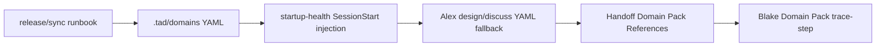

# Handoff Document for Agent B (Blake)
## TAD v3.1 - Evidence-Based Development

**From:** Alex (Agent A - Solution Lead)  
**To:** Blake (Agent B - Execution Master)  
**Date:** 2026-06-11  
**Project:** TAD Framework  
**Task ID:** TASK-20260611-001  
**Handoff Version:** 3.1.0  
**Epic:** EPIC-20260611-pack-system-unification.md (Phase 1/3)  
**Supersedes:** N/A

---

## 🔴 Gate 2: Design Completeness (Alex必填)

**执行时间**: 2026-06-11 02:41 UTC / 2026-06-10 22:41 EDT

### Gate 2 检查结果

| 检查项 | 状态 | 说明 |
|--------|------|------|
| Architecture Complete | ✅ | Phase 1 boundary is explicit: retire YAML Domain Packs and runtime/docs references only; installer symmetry waits for Phase 2/3. |
| Components Specified | ✅ | Active surfaces identified: `.tad/domains`, startup hook, domain router artifacts, sync derivation/runbook, Alex/Blake protocols, README, knowledge docs, T2 skill-library. |
| Functions Verified | ✅ | No new callable functions are designed. Existing scripts to inspect/modify are grounded in §7.3. |
| Data Flow Mapped | ✅ | Runtime flow being removed: SessionStart startup-health -> `.tad/domains/*.yaml` summary -> Alex/Blake Domain Pack references -> trace-step. Sync flow being changed: derive-sync-set / runbook must stop treating `.tad/domains` as active framework sync surface. |

**Gate 2 结果**: ✅ PASS

**Alex确认**: 我已验证所有设计要素，Blake可以独立根据本文档完成实现。

---

## 📋 Handoff Checklist (Blake必读)

Blake在开始实现前，请确认：
- [ ] 阅读了所有章节
- [ ] 阅读了「📚 Project Knowledge」章节中的历史经验
- [ ] 理解 Phase 1 不包含 Capability Pack installer changes
- [ ] 每个 archive / retire / rewrite decision has evidence
- [ ] §9.1 commands are the source of truth for Gate 3 verification

❌ 如果任何部分不清楚，立即返回Alex要求澄清，不要开始实现。

---

## 1. Task Overview

### 1.1 What We're Building

Retire YAML Domain Packs as an active TAD runtime/sync mechanism. Archive the remaining `.tad/domains` content, remove SessionStart/domain-router live references, update Claude/Codex protocols and release docs so SKILL.md Capability Packs are the only active pack format, and preserve useful single-project evidence as T2 skill-library references.

### 1.2 Why We're Building It

**业务价值**: Remove a dead routing system that still charges context and maintenance tax every session.  
**用户受益**: Future TAD sessions stop seeing stale Domain Pack injection and stop maintaining two incompatible pack systems.  
**成功的样子**: A user can reason about “packs” as one SKILL.md-based mechanism across Claude Code and Codex; archived YAML knowledge remains findable without being loaded or synced as an active runtime system.

### 1.3 Intent Statement

**真正要解决的问题**: TAD currently pays runtime/docs/sync cost for YAML Domain Packs even though the live routing mechanism is effectively unused. Phase 1 removes that active mechanism while preserving evidence and a migrate-on-demand path.

**不是要做的（避免误解）**:
- ❌ 不是把 9 个 YAML Domain Packs bulk-convert into SKILL.md packs.
- ❌ 不是修改 `.tad/capability-packs/*/install.sh`; that is Phase 2.
- ❌ 不是 deleting historical evidence under `.tad/evidence`, `.tad/archive`, or release history.
- ❌ 不是 adding a new permanent hook/check; Phase 1 uses AC verification only.

**Blake请确认理解**:
```
在开始实现前，请用你自己的话回答：
1. Phase 1 removes which live mechanisms?
2. Which content must be preserved, and where?
3. Which installer/platform-symmetry work is explicitly out of scope?

Only Human confirmation is needed if your understanding differs from this handoff.
```

---

## 📚 Project Knowledge（Blake 必读）

### 步骤 1：识别相关类别

本次任务涉及的领域：
- [x] architecture - sync derivation, pack system architecture, platform parity
- [x] code-quality - shell/doc sweep, active-vs-historical reference hygiene
- [x] security - supply-chain-security preservation boundary
- [x] testing - AC command dry-run and false-positive/false-negative tradeoffs
- [x] hook-contracts - retiring SessionStart/router hook behavior
- [x] pack-build-rules - Domain Pack vs Capability Pack migration policy

### 步骤 2：历史经验摘录

**已读取的 project-knowledge 文件**:

| 文件 | 相关记录数 | 关键提醒 |
|------|-----------|----------|
| `.tad/project-knowledge/principles.md` | 4 | Measure before optimizing; deny-list sync; every copy granularity needs matching verifier; body/reference discipline. |
| `.tad/project-knowledge/patterns/pack-build-rules.md` | 4 | Domain keyword curation is historical; Capability Packs require SKILL frontmatter; supply-chain-security scope is pre-install trust. |
| `.tad/project-knowledge/patterns/hook-contracts.md` | 2 | Hook side-output can be API; router.log contract is historical/load-bearing if any consumer remains. |
| `.tad/project-knowledge/patterns/ac-verification.md` | 3 | ACs are operational contract; dry-run commands; removal rationale must avoid self-leaking forbidden terms. |
| `.tad/project-knowledge/security.md` | 2 | supply-chain-security is distinct from code-security and has user-specific litellm poisoning context. |
| `.tad/project-knowledge/frontend-design.md` | 1 | Some Domain Pack content was already demoted to project knowledge because single-project evidence should not be global pack law. |

**⚠️ Blake 必须注意的历史教训**:

1. **Deny-List Beats Allow-List for Sync Sets** (`principles.md`)
   - 问题: hardcoded sync allow-lists silently omit new framework dirs.
   - 解决方案: when changing sync surfaces, use derived deny-list logic and verify exclusion/inclusion explicitly.

2. **Deny-List Must Be Applied at EVERY Copy Granularity** (`principles.md`)
   - 问题: fixing dir sync does not fix nested/package/install copy behavior.
   - 解决方案: Phase 1 only changes `.tad/domains` active sync surface; do not claim installer symmetry is fixed.

3. **Mechanical Enforcement Rejected on Single-User CLI** (`principles.md`)
   - 问题: adding hooks/checks for convenience can increase recovery cost.
   - 解决方案: do not add a new permanent hook in Phase 1; use scripts/ACs and docs.

4. **Domain Pack Keyword Curation** (`pack-build-rules.md`)
   - 问题: keyword routing required manual CJK/unique curation and was a maintenance system.
   - 解决方案: archive the old routing artifacts; do not rebuild keyword routing under another name.

5. **Security Pack Scope and Review Patterns** (`pack-build-rules.md`, `security.md`)
   - 问题: supply-chain-security answers “Should I trust this dependency?” and has real user motivation.
   - 解决方案: preserve it as a T2 reference, but do not fast-track a production pack without a real task and validation.

6. **AC Verification Drift Pattern** (`ac-verification.md`)
   - 问题: mental simulation of grep/find commands causes false gates.
   - 解决方案: dry-run every pre-impl command and syntax-check post-impl commands.

7. **.router.log 5-Tuple as Load-Bearing Hook Output Contract** (`hook-contracts.md`)
   - 问题: if any downstream consumer still reads router logs, format retirement is a breaking change.
   - 解决方案: scan for consumers before deleting/retiring router artifacts; if consumers remain, rewrite them or mark historical.

**Staleness note**: `stale-knowledge-check.sh` reported stale/warn items for some Domain Pack references and sync scripts. Treat this as a reason to re-ground current files before editing; do not blindly trust old paths.

### Blake 确认

- [ ] 我已阅读上述历史经验
- [ ] 我理解需要避免的问题
- [ ] 如遇到类似情况，我会参考上述解决方案

---

## 2. Background Context

### 2.1 Previous Work

`IDEA-20260610-pack-system-unification.md` measured two issues:

- YAML Domain Packs are effectively unused as a runtime system, but `.tad/hooks/startup-health.sh` injects their summaries into every session.
- Capability Pack install symmetry is broken, but that is a later phase.

This handoff executes only the first part: retire Domain Packs as active runtime/sync surface.

### 2.2 Current State

Current active `.tad/domains` files:

```text
.tad/domains/DOMAIN-PACK-ROADMAP.md
.tad/domains/HOW-TO-CREATE-DOMAIN-PACK.md
.tad/domains/hw-circuit-design.yaml
.tad/domains/hw-enclosure.yaml
.tad/domains/hw-firmware.yaml
.tad/domains/hw-testing.yaml
.tad/domains/mobile-development.yaml
.tad/domains/mobile-release.yaml
.tad/domains/mobile-testing.yaml
.tad/domains/mobile-ui-design.yaml
.tad/domains/supply-chain-security.yaml
```

Known live references exist in:

- `.tad/hooks/startup-health.sh`
- `.tad/hooks/userprompt-domain-router.sh`, `.tad/hooks/keywords.yaml`, `.tad/hooks/generate-keywords.sh`
- `.tad/hooks/trace-step.sh`
- `.tad/hooks/post-write-sync.sh`
- `.tad/hooks/lib/derive-sync-set.sh`
- `.tad/portable-extract.sh`
- `.tad/portable-rules.md`
- `codex-tad-bundle/.tad/domains/`
- `codex-tad-bundle/.tad/codex/codex-alex-skill.md`
- `.claude/skills/release-runbook/SKILL.md`
- `.agents/skills/release-runbook/SKILL.md`
- `.claude/skills/alex/SKILL.md`
- `.agents/skills/alex/SKILL.md`
- `.claude/skills/alex/references/{design,discuss,handoff-creation,sync,experiment,intent-router}-protocol.md`
- `.agents/skills/alex/references/{design,discuss,handoff-creation,sync,experiment,intent-router}-protocol.md`
- `.claude/skills/blake/SKILL.md`
- `.agents/skills/blake/SKILL.md`
- `.claude/skills/research-notebook/SKILL.md`
- `.agents/skills/research-notebook/SKILL.md`
- `.claude/skills/capability-upgrade/SKILL.md`
- `.agents/skills/capability-upgrade/SKILL.md`
- `.tad/templates/domain-pack-handoff-template.md`
- `.tad/tests/test-domain-pack.md`
- `README.md`
- `.tad/project-knowledge/README.md`
- `.tad/config.yaml`

Historical/archive/evidence mentions are allowed if clearly historical.

### 2.3 Dependencies

- No external network dependency.
- Migration manifest path may depend on existing Upgrade Lifecycle files. Directory deletion is supported by migration schema (`delete` with `type: "dir"`), so Blake should prefer a migration manifest and use `.tad/deprecation.yaml` only as explicit fallback.
- Changes must preserve Claude/Codex parity: modify `.claude/skills/...` and `.agents/skills/...` counterparts together.

---

## 3. Requirements

### 3.1 Functional Requirements

- FR1: Archive all active Domain Pack YAML/docs from `.tad/domains` into `.tad/archive/domains/` with an archival README or manifest.
- FR2: Remove SessionStart Domain Pack injection from `.tad/hooks/startup-health.sh`.
- FR3: Retire domain-router artifacts (`userprompt-domain-router.sh`, `keywords.yaml`, `generate-keywords.sh`) so they are no longer active runtime hooks or release-runbook checks.
- FR4: Remove `.tad/domains/` from active sync/portable/bundle derivation and release documentation, with migration/deprecation handling for downstream cleanup.
- FR5: Rewrite Alex/Blake protocol references so SKILL.md Capability Packs are the only active pack format; Domain Pack references must be historical or removed.
- FR6: Create T2 skill-library references for toy-proven hardware content and supply-chain-security, pointing to archived sources and migrate-on-demand criteria.
- FR7: Preserve historical evidence and release notes; do not rewrite `.tad/evidence` or `.tad/archive` history except for the new archive destination.

### 3.2 Non-Functional Requirements

- NFR1: No Capability Pack installer behavior changes in Phase 1.
- NFR2: Claude Code and Codex skill trees must receive equivalent protocol edits.
- NFR3: No new permanent hooks/settings enforcement.
- NFR4: Verification commands must distinguish live-runtime references from historical release/evidence mentions.
- NFR5: Archive/migration rationale must be explicit enough for future `*sync` and `*publish`.

---

## 4. Technical Design

### 4.1 Architecture Overview

Phase 1 replaces the old active mechanism:

```text
OLD:
SessionStart -> startup-health reads .tad/domains/*.yaml
             -> injects Domain Pack descriptions
             -> Alex/Blake may load YAML fallback
             -> Blake may trace Domain Pack step execution
             -> release/sync treats .tad/domains as framework dir

NEW:
SKILL.md Capability Packs are the only active pack format.
Archived YAML remains under .tad/archive/domains.
T2 skill-library notes preserve selected learnings without runtime loading.
```

### 4.2 Component Specifications

#### Archive strategy

- Move/copy active `.tad/domains/*` to `.tad/archive/domains/2026-06-11-domain-pack-retirement/`.
- Add a README in that archive directory explaining:
  - retired by measurement
  - migrate-on-demand policy
  - list of archived files
  - T2 references created
- Remove active `.tad/domains` from sync surface. If an empty marker remains, it must say retired and must not contain active YAML packs.

#### Runtime reference cleanup

- `startup-health.sh`: remove the Domain Pack detection block and stop appending `DOMAIN_DETAIL`.
- Router artifacts: archive/delete/retire `userprompt-domain-router.sh`, `keywords.yaml`, `keywords.yaml.draft`, and `generate-keywords.sh` as active runtime artifacts. If files are kept for history, place them under archive, not active `.tad/hooks`.
- `trace-step.sh`: either retire if only Domain Pack step tracing remains, or rewrite comments to historical and ensure no active protocol tells Blake to call it.
- `post-write-sync.sh`: remove Domain Pack creation/update special handling or mark it historical if the hook still exists for other sync actions.

#### Protocol/docs cleanup

- In both `.claude` and `.agents`, remove YAML fallback language from Alex/Blake active protocols.
- Use “Capability Pack” for active SKILL.md pack mechanics.
- Preserve historical release notes in README but update current command descriptions such as `*design`.
- In `.tad/project-knowledge/README.md`, replace “promote to Domain Pack” with the current T1/T2/T3 skill-library / Capability Pack route.

#### Migration/deprecation path

- First check whether the migration engine can express directory-level downstream deletion for `.tad/domains`.
- If yes, add a migration manifest entry.
- If no, add/update `.tad/deprecation.yaml` metadata documenting that `.tad/domains` is retired and downstream copies should be removed during next sync using the fallback path.
- Do not block Phase 1 on unfinished Upgrade Lifecycle work; document the fallback in completion.

### 4.3 Data Models

T2 skill-library entries should follow current index style:

```markdown
- [tad-hw-domain-archive](tad--hw-domain-archive.md) — TAD, 2026-06-11, archived hw Domain Pack learnings; migrate on demand
- [tad-supply-chain-security-archive](tad--supply-chain-security-archive.md) — TAD, 2026-06-11, pre-install dependency trust learnings; migrate on demand
```

Each T2 note should include:

- Source archived files
- What to reuse
- What not to reuse
- Criteria for upgrading to a Capability Pack

### 4.4 API Specifications

No external API changes.

### 4.5 User Interface Requirements

No user-facing UI.

---

## 5. 强制问题回答（Evidence Required）

### MQ1: 历史代码搜索

**问题**: 用户是否提到“之前的 / 原来的 / 我们的方案”？  
**回答**: 是。This is a retirement of previous Domain Pack machinery.

#### 搜索证据

```bash
rg -n "domains|userprompt-domain-router|keywords.yaml|generate-keywords|Domain Pack|\\.tad/domains" \
  .tad/hooks .tad/hooks/lib .claude/skills/alex/references .agents/skills/alex/references \
  .claude/skills/blake/SKILL.md .agents/skills/blake/SKILL.md \
  .claude/skills/release-runbook/SKILL.md .agents/skills/release-runbook/SKILL.md \
  README.md .tad/project-knowledge/README.md \
  tad.sh .tad/config*.yaml .codex/hooks.json
```

#### 决策说明

- **找到了什么**: Live Domain Pack references in startup hook, router scripts, release runbook, Alex/Blake protocols, sync protocol, README, and project-knowledge docs.
- **决定**: Retire active mechanisms, preserve historical evidence.
- **原因**: Runtime routing is measured dead, but content/provenance remains useful.

### MQ2: 函数存在性验证

No new functions are designed. Existing script entry points verified by file presence and grounding:

| Script/File | Purpose | Verification |
|-------------|---------|--------------|
| `.tad/hooks/startup-health.sh` | SessionStart health summary and Domain Pack injection | ✅ exists, grounded |
| `.tad/hooks/lib/derive-sync-set.sh` | Sync set derivation source of truth | ✅ exists, grounded |
| `.tad/hooks/userprompt-domain-router.sh` | old Domain Pack router | ✅ exists via rg/file search; retire/archive |
| `.tad/hooks/keywords.yaml` | old router keyword DB | ✅ exists via rg/file search; retire/archive |
| `.tad/hooks/generate-keywords.sh` | old keyword generator | ✅ exists via rg/file search; retire/archive |

### MQ3: 数据流完整性



Phase 1 removes or retires every active edge above, while preserving archived source files and T2 references.

### MQ4: 视觉层级

N/A. No UI.

### MQ5: 状态同步

Primary state after Phase 1:

```text
Active pack state -> .claude/skills/*/SKILL.md + .agents/skills/*/SKILL.md
Archived legacy state -> .tad/archive/domains/2026-06-11-domain-pack-retirement/
T2 reference shelf -> .tad/skill-library/
```

No runtime sync from archive to active pack state.

---

## 6. Implementation Steps

## 6.1 Micro-Tasks

| # | File | Operation | Verification Command | Est. Time |
|---|------|-----------|---------------------|-----------|
| 1 | `.tad/domains/*` | Move active Domain Pack files into dated archive dir; leave no active YAML packs | see §9.1 AC1 raw command | 10 min |
| 2 | `.tad/archive/domains/2026-06-11-domain-pack-retirement/README.md` | Create archive manifest and migrate-on-demand policy | `test -f .tad/archive/domains/2026-06-11-domain-pack-retirement/README.md` | 10 min |
| 3 | `.tad/hooks/startup-health.sh` | Remove Domain Pack scan/injection block | see §9.1 AC2 raw command | 10 min |
| 4 | `.tad/hooks/{userprompt-domain-router.sh,keywords.yaml,keywords.yaml.draft,generate-keywords.sh}` | Archive/delete/retire old router artifacts | see §9.1 AC3 raw command | 10 min |
| 5 | `.tad/hooks/trace-step.sh`, `.tad/hooks/post-write-sync.sh` | Remove active Domain Pack instructions or retire scripts if now obsolete | `rg -n "Domain Pack|domain_pack_trace|\\.tad/domains" .tad/hooks/trace-step.sh .tad/hooks/post-write-sync.sh` returns no live instruction hits | 15 min |
| 6 | `.tad/hooks/lib/derive-sync-set.sh`, portable/bundle/release docs | Remove `.tad/domains` from active sync/portable/bundle surfaces | see §9.1 AC4 raw command | 20 min |
| 7 | `.claude/skills/...` + `.agents/skills/...` | Remove YAML fallback and Domain Pack active protocol text in both platforms | see §9.1 AC5 + AC9 raw commands | 35 min |
| 8 | `.tad/skill-library/*` | Add two T2 references and index rows | see §9.1 AC6 raw command | 15 min |
| 9 | `.tad/deprecation.yaml` and `.tad/migrations/*.yaml` | Add downstream removal metadata/fallback | see §9.1 AC7 raw command | 15 min |
| 10 | README / project-knowledge docs | Rewrite current docs; preserve release history as historical | see §9.1 AC5 raw command | 15 min |

### Phase 1: Domain Pack Retirement

#### 交付物

- [ ] Archived `.tad/domains` content with manifest
- [ ] Startup/domain-router runtime removed
- [ ] Protocol/docs updated for SKILL.md-only active pack system
- [ ] T2 skill-library references added
- [ ] Migration/deprecation fallback documented
- [ ] Gate 3 evidence report with raw command outputs

#### 实施步骤

1. Create an anchor map of every live reference before editing. Classify each as `remove`, `rewrite-as-capability-pack`, `mark-historical`, or `defer-with-rationale`.
2. Archive `.tad/domains` content to a dated archive directory. Preserve filenames.
3. Remove active runtime injection from `startup-health.sh` and active router artifacts from `.tad/hooks`.
4. Update sync derivation and runbook surfaces so `.tad/domains` is not a current full-refresh framework dir.
5. Update Alex/Blake protocol references in both `.claude` and `.agents`.
6. Add T2 skill-library references.
7. Add migration/deprecation metadata.
8. Run §9.1 verification commands and include raw outputs in completion report.

#### Phase 1 完成证据（Blake必须提供）

- [ ] Anchor map showing every reference and disposition.
- [ ] Anchor map artifact at `.tad/evidence/pack-system-unification-phase1/anchor-map.tsv`.
- [ ] Archive manifest path.
- [ ] `git diff --stat` and `git diff --name-only`.
- [ ] Raw §9.1 command outputs.
- [ ] Expert reviews: code-reviewer + spec-compliance-reviewer at minimum.
- [ ] Completion report at `.tad/active/handoffs/COMPLETION-20260611-pack-system-unification-phase1.md`.

---

## 7. File Structure

### 7.1 Files to Create

```text
.tad/archive/domains/2026-06-11-domain-pack-retirement/README.md
.tad/skill-library/tad--hw-domain-archive.md
.tad/skill-library/tad--supply-chain-security-archive.md
.tad/migrations/{date-or-version}-domain-pack-retirement.yaml
.tad/evidence/pack-system-unification-phase1/anchor-map.tsv
.tad/evidence/pack-system-unification-phase1/ac-outputs.txt
```

### 7.2 Files to Modify

```text
.tad/domains/*  # move/archive active files; no active YAML packs remain
.tad/hooks/startup-health.sh
.tad/hooks/userprompt-domain-router.sh
.tad/hooks/keywords.yaml
.tad/hooks/keywords.yaml.draft
.tad/hooks/generate-keywords.sh
.tad/hooks/trace-step.sh
.tad/hooks/post-write-sync.sh
.tad/hooks/lib/derive-sync-set.sh
.tad/portable-extract.sh
.tad/portable-rules.md
codex-tad-bundle/.tad/domains/*
codex-tad-bundle/.tad/codex/codex-alex-skill.md
.claude/skills/release-runbook/SKILL.md
.agents/skills/release-runbook/SKILL.md
.claude/skills/alex/SKILL.md
.agents/skills/alex/SKILL.md
.claude/skills/alex/references/design-protocol.md
.claude/skills/alex/references/discuss-path-protocol.md
.claude/skills/alex/references/handoff-creation-protocol.md
.claude/skills/alex/references/sync-protocol.md
.claude/skills/alex/references/intent-router-protocol.md
.claude/skills/alex/references/experiment-path-protocol.md
.claude/skills/blake/SKILL.md
.agents/skills/alex/references/design-protocol.md
.agents/skills/alex/references/discuss-path-protocol.md
.agents/skills/alex/references/handoff-creation-protocol.md
.agents/skills/alex/references/sync-protocol.md
.agents/skills/alex/references/intent-router-protocol.md
.agents/skills/alex/references/experiment-path-protocol.md
.agents/skills/blake/SKILL.md
.claude/skills/research-notebook/SKILL.md
.agents/skills/research-notebook/SKILL.md
.claude/skills/capability-upgrade/SKILL.md
.agents/skills/capability-upgrade/SKILL.md
.tad/templates/domain-pack-handoff-template.md
.tad/tests/test-domain-pack.md
README.md
.tad/project-knowledge/README.md
.tad/config.yaml
.tad/skill-library/_index.md
```

Do not modify:

```text
.tad/capability-packs/*/install.sh
.claude/skills/*/SKILL.md capability pack content
.agents/skills/*/SKILL.md capability pack content
```

### 7.3 Grounded Against

**Grounded Against** (Alex step1c 实际 Read 过的源文件):

- `.tad/hooks/lib/derive-sync-set.sh` (head 50+ lines, read at 2026-06-11)
- `.tad/hooks/startup-health.sh` (head 50+ lines, read at 2026-06-11)
- `.tad/templates/handoff-a-to-b.md` (read at 2026-06-11)
- `.tad/active/epics/EPIC-20260611-pack-system-unification.md` (read at 2026-06-11)
- `.tad/skill-library/_index.md` (read at 2026-06-11)
- `.tad/archive/domains/2026-06-11-domain-pack-retirement/README.md` (new — will be created)
- `.tad/skill-library/tad--hw-domain-archive.md` (new — will be created)
- `.tad/skill-library/tad--supply-chain-security-archive.md` (new — will be created)
- `.tad/migrations/{date-or-version}-domain-pack-retirement.yaml` (new — preferred; migration schema supports `delete` with `type: "dir"`)
- `.tad/deprecation.yaml` entry (modify — fallback only if migration manifest proves unusable)
- `.tad/portable-extract.sh` / `.tad/portable-rules.md` (head 50 not yet read by Alex; Blake must ground before editing)
- `.agents/skills/release-runbook/SKILL.md` (head 50 not yet read by Alex; Blake must ground before editing)

---

## 8. Testing Requirements

### 8.1 Unit Tests

No application unit tests required. This is a framework/doc/shell retirement task.

### 8.2 Integration Tests

- Run `bash .tad/hooks/startup-health.sh` with a minimal SessionStart JSON payload and verify output contains no Domain Pack injection.
- Run `bash .tad/hooks/lib/derive-sync-set.sh --dirs .` and verify `domains` is absent.
- Run Claude/Codex skill tree parity diff for touched counterpart files.

### 8.3 Edge Cases

- Historical release notes should remain; do not make ACs fail on `docs/HISTORY.md`, archived handoffs, release evidence, or changelog history if clearly historical.
- `.tad/evidence` may contain old Domain Pack references; do not edit evidence.
- If migration manifest cannot remove directories, document fallback instead of inventing a new migration mechanism.
- If `trace-step.sh` is still consumed by non-Domain Pack code, rewrite it narrowly instead of deleting it.

## 8.4 Friction Preflight

| Friction Point | Required Step | Expected Fix Path | Allowed Substitute | Gate Impact |
|----------------|---------------|-------------------|--------------------|-------------|
| Migration manifest may not support this exact deletion in practice | Use migration manifest first (`delete: [{path: ".tad/domains", type: "dir"}]`) and dry-run if possible | If engine rejects it, update `.tad/deprecation.yaml` and completion report fallback | `EQUIVALENT_SUBSTITUTE` only if fallback is consumed by sync/install path | Missing removal metadata prevents Gate 3 PASS |
| Broad reference sweep can over-delete historical context | Classify references as active vs historical before editing | Preserve release/evidence/archive mentions; rewrite only active instructions | Historical notes may remain if clearly marked historical | Over-deleting evidence or release history is a P1/P0 issue |
| Claude/Codex counterpart drift | Modify `.claude` and `.agents` counterpart files together | Run scoped `diff -qr` on touched counterparts | None; parity is required | Drift prevents Gate 3 PASS |
| Review availability | Code-reviewer + spec-compliance-reviewer required | Invoke independent reviewers after implementation | Equivalent independent reviewer with same scope; self-review is never equivalent | Missing/non-equivalent review prevents Gate 3 PASS |

## 8.5 Feedback Collection

N/A. This is not a visual/content artifact requiring Feedback Collector.

```yaml
feedback_required: false
artifact_type: generic
suggested_dimensions: []
notes: "N/A"
```

## 8.6 Test Evidence Required

Blake必须提供：
- [ ] Raw §9.1 command outputs
- [ ] `.tad/evidence/pack-system-unification-phase1/anchor-map.tsv` with columns: `file`, `match`, `classification`, `action`, `rationale`, `ac_covered`
- [ ] `.tad/evidence/pack-system-unification-phase1/ac-outputs.txt` containing raw output for AC1-AC12
- [ ] `git diff --stat`
- [ ] scoped Claude/Codex parity diff output
- [ ] expert review reports

---

## 9. Acceptance Criteria

Blake的实现被认为完成，当且仅当：
- [ ] All FR/NFR above are implemented or explicitly deferred with Alex-approved rationale.
- [ ] §9.1 commands pass.
- [ ] Expert review P0 issues are resolved.
- [ ] Completion report includes friction status and knowledge assessment.

## 9.1 Spec Compliance Checklist

| # | Acceptance Criterion | Verification Type | Verification Method | Expected Evidence | Verified Output (Alex step1d) |
|---|---------------------|-------------------|--------------------|--------------------|-------------------------------|
| AC1 | No active files remain under `.tad/domains` except an optional retired marker | post-impl-verifiable | AC1 raw command below | exit 0 | post-impl; raw command syntax checked by Alex |
| AC2 | Domain Pack SessionStart injection is removed | post-impl-verifiable | AC2 raw command below | exit 0, no matches | post-impl; raw command syntax checked by Alex |
| AC3 | Old router active artifacts are retired from `.tad/hooks` | post-impl-verifiable | AC3 raw command below | exit 0 | post-impl; raw command syntax checked by Alex |
| AC4 | `.tad/domains` is not in active sync/portable/bundle surfaces | post-impl-verifiable | AC4 raw command below | exit 0, no active copy/sync surface | post-impl; raw command syntax checked by Alex |
| AC5 | Runtime/protocol/doc surfaces contain no YAML Domain Pack active guidance | post-impl-verifiable | AC5 raw command below | exit 0, no live guidance matches; historical matches classified in anchor map | post-impl; raw command syntax checked by Alex |
| AC6 | T2 references exist for hw archive and supply-chain-security archive | post-impl-verifiable | AC6 raw command below | exit 0, both index entries present | post-impl; raw command syntax checked by Alex |
| AC7 | Migration/deprecation metadata targets downstream `.tad/domains` removal | post-impl-verifiable | AC7 raw command below | exit 0, metadata contains both `domain-pack-retirement` marker and `.tad/domains` target | post-impl; raw command syntax checked by Alex |
| AC8 | Phase 1 did not modify Capability Pack installer behavior | post-impl-verifiable | AC8 raw command below | exit 0, no installer files in implementation diff/worktree/staged changes | post-impl; raw command syntax checked by Alex |
| AC9 | Claude/Codex touched counterpart files are in parity | post-impl-verifiable | AC9 raw command below | exit 0 for explicit counterpart list | post-impl; raw command syntax checked by Alex |
| AC10 | Startup health still runs and emits valid TAD summary without Domain Pack text | post-impl-verifiable | AC10 raw command below | exit 0, output contains no Domain Pack text | post-impl; raw command syntax checked by Alex |
| AC11 | Archive manifest exists and points to archived source files | post-impl-verifiable | AC11 raw command below | exit 0, manifest includes archived file names and policy | post-impl; raw command syntax checked by Alex |
| AC12 | Completion evidence includes anchor map and raw AC outputs | post-impl-verifiable | AC12 raw command below | exit 0, completion/evidence artifacts include required sections | post-impl; raw command syntax checked by Alex |

### §9.1 Raw Verification Commands

Blake must run these raw commands, not the rendered markdown table text.

```bash
# AC1
[ ! -d .tad/domains ] || [ "$(find .tad/domains -maxdepth 1 -type f ! -name '.gitkeep' ! -name 'README-retired.md' -print 2>/dev/null | wc -l | tr -d ' ')" = "0" ]

# AC2
! rg -n "DOMAIN_DETAIL|Domain Pack \\[|To use: read \\.tad/domains" .tad/hooks/startup-health.sh

# AC3
test ! -e .tad/hooks/userprompt-domain-router.sh &&
test ! -e .tad/hooks/keywords.yaml &&
test ! -e .tad/hooks/keywords.yaml.draft &&
test ! -e .tad/hooks/generate-keywords.sh

# AC4
! bash .tad/hooks/lib/derive-sync-set.sh --dirs . | grep -Fx domains &&
! rg -n "\\.tad/domains|domains/" .tad/portable-extract.sh .tad/portable-rules.md codex-tad-bundle 2>/dev/null

# AC5
! rg -n "YAML fallback|read \\.tad/domains|Domain Pack Loading|Domain Pack References|domain_pack_trace|trace-step\\.sh start|trace-step\\.sh end|userprompt-domain-router|keywords.yaml|promote to Domain Pack|Create technical design \\(with Domain Pack loading\\)" \
  .tad/hooks .claude/skills .agents/skills README.md tad.sh .tad/config.yaml .tad/project-knowledge/README.md .tad/templates .tad/tests .tad/portable-extract.sh .tad/portable-rules.md codex-tad-bundle 2>/dev/null

# AC6
test -f .tad/skill-library/tad--hw-domain-archive.md &&
test -f .tad/skill-library/tad--supply-chain-security-archive.md &&
rg -n "tad--hw-domain-archive|tad--supply-chain-security-archive" .tad/skill-library/_index.md

# AC7
rg -n "domain-pack-retirement" .tad/deprecation.yaml .tad/migrations 2>/dev/null &&
rg -n "\\.tad/domains|path:[[:space:]]*['\"]?\\.tad/domains['\"]?" .tad/deprecation.yaml .tad/migrations 2>/dev/null

# AC8
! { { git diff --name-only HEAD; git diff --cached --name-only; git ls-files --others --exclude-standard; } |
  sort -u |
  rg '^\\.tad/capability-packs/.*/install\\.sh$'; }

# AC9
diff -q .claude/skills/blake/SKILL.md .agents/skills/blake/SKILL.md >/dev/null &&
diff -q .claude/skills/release-runbook/SKILL.md .agents/skills/release-runbook/SKILL.md >/dev/null &&
diff -q .claude/skills/alex/SKILL.md .agents/skills/alex/SKILL.md >/dev/null &&
diff -q .claude/skills/research-notebook/SKILL.md .agents/skills/research-notebook/SKILL.md >/dev/null &&
diff -q .claude/skills/capability-upgrade/SKILL.md .agents/skills/capability-upgrade/SKILL.md >/dev/null &&
for f in design-protocol.md discuss-path-protocol.md handoff-creation-protocol.md sync-protocol.md intent-router-protocol.md experiment-path-protocol.md; do
  diff -q ".claude/skills/alex/references/$f" ".agents/skills/alex/references/$f" >/dev/null || exit 1
done

# AC10
printf '{"source":"startup"}' | bash .tad/hooks/startup-health.sh | tee /tmp/tad-startup-health.out &&
! rg -n "Domain Pack|\\.tad/domains" /tmp/tad-startup-health.out

# AC11
test -f .tad/archive/domains/2026-06-11-domain-pack-retirement/README.md &&
rg -n "hw-circuit-design|supply-chain-security|migrate-on-demand" .tad/archive/domains/2026-06-11-domain-pack-retirement/README.md

# AC12
test -f .tad/evidence/pack-system-unification-phase1/anchor-map.tsv &&
test -f .tad/evidence/pack-system-unification-phase1/ac-outputs.txt &&
test -f .tad/active/handoffs/COMPLETION-20260611-pack-system-unification-phase1.md &&
rg -n "Anchor Map|AC1|AC12|Friction Status|Knowledge Assessment" .tad/active/handoffs/COMPLETION-20260611-pack-system-unification-phase1.md
```

### Step1d Dry-Run Log

All §9.1 rows are post-implementation verifiable. Alex ran the AC command linter after draft creation: `verify-ac-commands: 0 warnings, 0 info`. Expert review then found that raw command blocks were needed to avoid markdown pipe escaping; this revision resolves that by making table cells point to raw commands below the table. Blake must run the raw command block at Gate 3.

---

## 9.2 Expert Review Status (Alex 必填)

### Audit Trail

| Reviewer | Issue | Resolution Section | Status |
|----------|-------|-------------------|--------|
| code-reviewer | P0: Markdown table pipe escaping made §9.1 commands non-runnable | §9.1 Raw Verification Commands | Resolved |
| code-reviewer | P0: Wrong `.tad/deprecations.yaml` path | §4.2, §7, AC7 | Resolved |
| code-reviewer | P0: Codex release-runbook parity missing | §2.2, §7.2, AC5, AC9 | Resolved |
| code-reviewer | P0: Installer guard false-passes with `HEAD~1..HEAD` | AC8 | Resolved |
| code-reviewer | P1: portable/bundle/template/test surfaces missing from scope | §2.2, §7.2, AC4, AC5 | Resolved |
| spec-compliance-reviewer | P0: Reference-sweep AC missed multiple active surfaces | §2.2, AC5 | Resolved |
| spec-compliance-reviewer | P1: AC3 omitted `keywords.yaml.draft` | AC3 | Resolved |
| spec-compliance-reviewer | P1: Evidence manifest lacked anchor map/raw AC artifact paths | §8.6, Required Evidence Manifest, AC12 | Resolved |

### Experts Selected

1. **code-reviewer** — checks shell safety, scope, accidental deletion risk, and implementation completeness.
2. **spec-compliance-reviewer** — checks whether §9.1 actually proves the Epic Phase 1 requirements and whether the handoff has gaps.

### Overall Assessment (post-integration)

- code-reviewer: FAIL on draft, P0/P1 integrated; ready after revision.
- code-reviewer final re-review: PASS, no remaining P0/P1.
- spec-compliance-reviewer: FAIL on draft, P0/P1 integrated; final re-review CONDITIONAL PASS with one P1 on AC7 strength; AC7 strengthened to require both marker and `.tad/domains` target.

---

## 10. Important Notes

### 10.1 Critical Warnings

- ⚠️ Do not delete `.tad/evidence` or `.tad/archive` historical references.
- ⚠️ Do not modify Capability Pack installers in Phase 1.
- ⚠️ Do not leave `.claude` and `.agents` protocol edits out of sync.
- ⚠️ Do not add a new hook/settings enforcement mechanism for this retirement.
- ⚠️ Avoid AC self-leak: when writing “no active Domain Pack” rationale, put rationale in archive/deprecation metadata rather than leaving active runtime instructions that still match the forbidden text.

### 10.2 Known Constraints

- Migration-manifest directory deletion may be unavailable; fallback is allowed if explicit.
- README changelog historical rows may keep old Domain Pack text.
- Some project-knowledge historical entries mention Domain Packs; rewrite active decision rules, but preserve provenance.

### 10.3 Sub-Agent使用建议

Blake should use:
- [ ] **spec-compliance-reviewer** - required for AC completeness and active-vs-historical distinction
- [ ] **code-reviewer** - required for shell/doc change risk
- [ ] **test-runner** - recommended for executing §9.1 ACs

---

## 11. Learning Content

### 11.1 Decision Rationale: Archive + T2 References vs Bulk Migration

**选择的方案**: Archive YAML Domain Packs as-is, create only two T2 references, migrate to Capability Pack on real demand.

| 方案 | 优点 | 缺点 | 为什么没选 |
|------|------|------|-----------|
| Archive + T2 references | Removes runtime tax; preserves evidence; low scope | Requires future migration when a real task needs content | ✅ Selected |
| Bulk-convert all YAMLs to SKILL.md | One format immediately | Recreates live tax and converts near-zero-use content without validation | Not selected |
| Delete without archive | Lowest file count | Loses provenance and supply-chain/security context | Not selected |

**Human learning point**: Retiring a dead mechanism is not the same as deleting knowledge. The right move is to remove runtime load while preserving migration hooks for evidence-backed reuse.

---

## 12. Sub-Agent使用记录

Blake完成后填写：

| Sub-Agent | 是否调用 | 调用时机 | 输出摘要 | 证据链接 |
|-----------|---------|---------|---------|---------|
| code-reviewer | ✅/❌ | Layer 2 | | |
| spec-compliance-reviewer | ✅/❌ | Layer 2 | | |
| test-runner | ✅/❌ | §9.1 verification | | |

---

## Required Evidence Manifest

```yaml
expert_reviews:
  - ".tad/evidence/reviews/2026-06-11-code-review-pack-system-unification-phase1-final.md"
  - ".tad/evidence/reviews/2026-06-11-spec-compliance-pack-system-unification-phase1-final.md"
gate_verdicts:
  - ".tad/evidence/acceptance-tests/pack-system-unification-phase1/acceptance-verification-report.md"
completion:
  - ".tad/active/handoffs/COMPLETION-20260611-pack-system-unification-phase1.md"
blake_reviews:
  - ".tad/evidence/pack-system-unification-phase1/ac-outputs.txt"
  - "Layer 1 raw §9.1 command output embedded in completion report"
  - ".tad/evidence/pack-system-unification-phase1/anchor-map.tsv"
fixture_results:
  - "startup-health SessionStart output without Domain Pack text"
  - "derive-sync-set output without domains"
knowledge_updates:
  - ".tad/skill-library/tad--hw-domain-archive.md"
  - ".tad/skill-library/tad--supply-chain-security-archive.md"
```

---

**Handoff Created By**: Alex (Agent A)  
**Date**: 2026-06-11  
**Version**: 3.1.0
