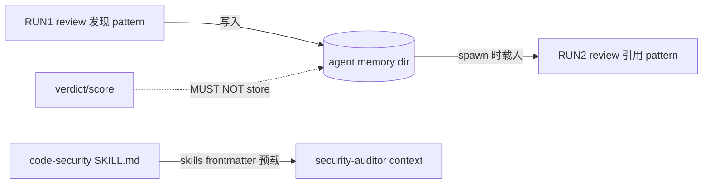

---
# Quality Chain Metadata (Alex 必填 - Phase 4 Hook 将基于此阻塞 Gate 3)
task_type: mixed      # spike (T1) + config/agent-def files + behavioral verification
e2e_required: yes     # Epic success criteria: behavioral evidence REQUIRED (not structural presence)
research_required: no # research base exists (notebook b07a6598); local spike replaces new research

# Production directories that must have ≥1 git-tracked file at Gate 3
git_tracked_dirs: [".claude/agents"]

skip_knowledge_assessment: no  # mixed task_type → default no

gate4_delta: []
---

# Handoff Document for Agent B (Blake)
## TAD v3.1 - Evidence-Based Development

**From:** Alex (Agent A - Solution Lead)
**To:** Blake (Agent B - Execution Master)
**Date:** 2026-07-13
**Project:** TAD Framework
**Task ID:** TASK-20260713-001
**Handoff Version:** 3.1.0
**Epic:** EPIC-20260712-native-capability-adoption.md (Phase 2/4)
**Supersedes:** N/A

---

## 🔴 Gate 2: Design Completeness (Alex必填)

**执行时间**: 2026-07-13 (YOLO Conductor flow)

### Gate 2 检查结果

| 检查项 | 状态 | 说明 |
|--------|------|------|
| Architecture Complete | ✅ | 两阶段设计：T1 spike 先验证未知语义（memory/skills 字段 + project-level shadowing），再按 spike 结论走主路径或降级路径。所有 UNKNOWN 都有显式 spike gate + 降级矩阵，无隐式假设 |
| Components Specified | ✅ | 3 个 project-level agent defs + spike 测试 agent + 行为证据文件 + .gitignore 条目，逐个规格见 §4.2 |
| Functions Verified | ✅ | 非代码任务。所有引用的文件/机制已实地验证：`~/.claude/agents/`（30 files，frontmatter 仅 name/description/model）、blake SKILL.md L550/L584（pack transcription 消费点）、code-security pack 存在、CLI 2.1.172。见 §5 MQ2 |
| Data Flow Mapped | ✅ | memory 写读流 + 内容边界（patterns in / verdicts out）见 §5 MQ3/MQ5 |

**Gate 2 结果**: ✅ PASS

**说明**: `memory`/`skills` 字段在 CLI 2.1.172 的实际语义为 UNKNOWN（研究基底是 doc-level，未本地验证）。设计选择不是"假设可用"，而是把 spike 作为 Phase 1 交付物 + 每条未知都有降级路径（§4.1 降级矩阵）。这是 Epic P3 降级政策的同构应用：value kept, automation deferred, never silently drop。

**Alex确认**: 我已验证所有设计要素，Blake可以独立根据本文档完成实现。

---

## 📋 Handoff Checklist (Blake必读)

Blake在开始实现前，请确认：
- [ ] 阅读了所有章节
- [ ] **阅读了「📚 Project Knowledge」章节中的历史经验**
- [ ] 所有"强制问题回答（MQ）"都有证据
- [ ] 理解了真正意图（不只是字面需求）
- [ ] 每个Phase的交付物和证据要求都清楚
- [ ] 确认可以独立使用本文档完成实现

❌ 如果任何部分不清楚，**立即返回Alex要求澄清**，不要开始实现。

---

## 1. Task Overview

### 1.1 What We're Building

给 TAD 的常驻 reviewer subagents 接上两个 Claude Code 原生能力：

1. **(a) Persistent reviewer memory** — 通过 agent frontmatter 的 `memory` 字段给
   code-reviewer / security-auditor / spec-compliance-reviewer 一个跨 session 持久目录，
   存**缺陷模式和项目惯例**（绝不存历史 verdicts — 反锚定）。
2. **(b) Skills preload** — 通过 frontmatter 的 `skills` 字段把稳定配对的 capability pack
   预载进 reviewer context（首个配对：security-auditor ← code-security），替代该场景下的
   handoff 文本转录；动态场景（implementation agents）**显式保留** handoff 转录机制。

前置于两者的是一个 **T1 spike**：在 CLI 2.1.172 上实测 `memory`/`skills` 字段语义 +
project-level `.claude/agents/` 对 user-level 同名 agent 的 shadowing 语义。实现只信 spike，
不信 doc-level 研究。

### 1.2 Why We're Building It

**业务价值**：reviewer 每次 spawn 都是零记忆冷启动——同一个"BSD grep 无 -P"、"bash 3.2 无关联数组"
类缺陷模式每次重新发现或漏掉。持久 pattern memory 让 review 质量随时间累积。pack preload 砍掉
handoff 里的 pack 规则转录（省 Alex 转录劳动 + 消除转录漂移）。

**用户受益**：更少重复缺陷逃逸；handoff 更薄。

**成功的样子**：reviewer 第二次 review 时**真的用上了**第一次存的 pattern（行为证据，不是文件存在）；
security-auditor spawn 后**不用 Read** 就能引用 code-security 的具体判断规则。

### 1.3 🆕 Intent Statement（意图声明）

**真正要解决的问题**：reviewer 无跨 session 记忆 + pack 知识靠 handoff 文本转录传递（有漂移、有转录成本）。用原生 frontmatter 机制替代，但必须先 spike 验证原生机制真实语义。

**不是要做的（避免误解）**：
- ❌ 不是给 reviewer 存历史 verdicts/评分让它"参考上次结论"——那是 Rubber Stamp 锚定，是本设计**明令禁止**的内容边界另一侧
- ❌ 不是给所有 30 个 user-level agents 加 memory——只动 3 个 TAD 常驻 reviewer，且只建 project-level defs
- ❌ 不是废除 Blake 1_5a 的 handoff pack 转录/自动检测——动态 per-task 场景显式保留（见 §11 决策）
- ❌ 不是编辑 `~/.claude/agents/`（machine-global，不可 git 审查）——任何 machine-global 变更进 completion report §Escalations 由人决定

**Blake请确认理解**：
```
在开始实现前，请用你自己的话回答：
1. 这个功能解决什么问题？
2. 用户会如何使用？
3. 成功的标准是什么？

只有Human确认你的理解正确后，才能开始实现。
（YOLO 模式下：向 Conductor 输出理解确认，继续执行。）
```

---

## 📚 Project Knowledge（Blake 必读）

**⚠️ MANDATORY READ — Blake 在开始实现前，必须执行以下 Read 操作：**
1. Read ALL `.tad/project-knowledge/*.md` files listed in 步骤 2 below
2. Read the handoff's "⚠️ Blake 必须注意的历史教训" entries carefully
3. This is NOT optional — project knowledge prevents repeated mistakes

### 步骤 1：识别相关类别

本次任务涉及的领域（勾选所有适用项）：
- [x] architecture - agent 定义分层（user-level vs project-level）
- [x] testing - spike 验证纪律、行为证据
- [x] security - public repo 的 memory 内容 gitignore
- [x] code-quality - frontmatter YAML 规范

### 步骤 2：历史经验摘录

**已读取的 project-knowledge 文件**：

| 文件 | 相关记录数 | 关键提醒 |
|------|-----------|----------|
| principles.md | 4 条 | Validation Theater / Rubber Stamp / Measure Before Optimizing / fail-open on single-user CLI |
| patterns/gate-design.md | 相关 | 行为证据 ≠ 结构存在；claims-need-carriers |
| patterns/ac-verification.md | 相关 | AC 必须可运行；dry-run 纪律 |
| patterns/shell-portability.md | 相关 | BSD grep / bash 3.2 —— 这本身就是要存进 reviewer memory 的第一批 environment facts |

**⚠️ Blake 必须注意的历史教训**：

1. **Validation Theater**（principles.md 2026-05-15 YOLO audit）
   - 问题：结构检查（文件存在、grep 命中）证明不了能力真的生效。"13/13 installed" ≠ functional quality。
   - 解决方案：本 handoff 的 AC5/AC6 是**行为**证据（两次 spawn 的 memory 回读、preload 后无 Read 的规则引用），是 Epic 人定的成功标准。不许用文件存在替代。

2. **AI/Human Judgment Domain — Rubber Stamp Effect**（principles.md 2026-07-03）
   - 问题：先看到过去的结论会锚定后续判断。
   - 解决方案：memory 内容边界（patterns YES / verdicts NO）必须写进 agent 定义 body（system-prompt 级），不是写在文档里。

3. **Mechanical Enforcement Rejected on Single-User CLI**（principles.md 2026-04-15）
   - 问题：fail-closed 机制在单用户 CLI 上恢复成本 > 收益。
   - 解决方案：spike FAIL 走降级矩阵（§4.1），不是硬阻塞整个 Phase。

4. **Deny-list / verify-at-every-granularity 家族**（principles.md 2026-06-01 ×3）
   - 事实（设计审查 arch P1-1 实地证伪了初稿说法）：`.claude/agents/` 对**两条**分发路径都**不可见**——derive-sync-set.sh 只走 `.tad/*/`，tad.sh 的 .claude/ 拷贝是硬编码 allow-list（skills/settings/workflows/root_files），均无 agents 路径。这正是 2026-06-01 原则烧过的静默遗漏类。
   - 解决方案：**不存在自动兜底**。completion report §Escalations 必须显式登记：下次 *publish 前人工裁决 `.claude/agents/` 的分发策略（推荐 main-repo-only——reviewer defs 是 TAD 项目专属；若未来要分发，必须同时加显式拷贝路径 + 同粒度 verifier）。

### Blake 确认

- [ ] 我已阅读上述历史经验
- [ ] 我理解需要避免的问题
- [ ] 如遇到类似情况，我会参考上述解决方案

---

## 2. Background Context

### 2.1 Previous Work

- Epic Phase 1 已完成（PreCompact hook，merge abca584）。
- 研究基底：`.tad/evidence/research/claude-native-capabilities/`（notebook b07a6598，doc-level，**未本地验证**——grounding 明确：implementation must trust ONLY the local spike）。
- Conductor grounding：`.tad/evidence/yolo/native-capability-adoption/phase2-grounding.md`（本 handoff 全部"实际状态"来源）。

### 2.2 Current State

| 维度 | 现状 | 目标 |
|------|------|------|
| Agent defs 位置 | 仅 user-level `~/.claude/agents/*.md`（30 files，machine-global，不可 git 审查）；本 repo **无** `.claude/agents/` | 新增 project-level `.claude/agents/`（git-tracked），3 个 reviewer defs |
| Frontmatter 字段 | 仅 name / description / model；**无任何** memory/skills 字段 | reviewer defs 增加 `memory` +（稳定配对处）`skills` |
| spec-compliance-reviewer | **无定义文件**——只是 Blake Layer 2 的 prompt persona | 成为注册 agent（project-level def，无同名冲突） |
| Pack 知识传递给 reviewer | handoff "🔧 Capability Pack References" 章节 + Blake SKILL 1_5a 自动检测（L550/L584） | 稳定配对改 frontmatter 预载；动态场景保留现状 |
| reviewer 跨 session 记忆 | 无 | 持久 pattern memory（边界受控） |

### 2.3 Dependencies

- Claude Code CLI 2.1.172（已实测 `claude --version`，见 §9.1 AC0）。
- code-security pack 存在于 `.claude/skills/code-security/SKILL.md`（已实测，见 AC0b）。
- Agent tool（Task）可 spawn subagent —— spike 依赖。
- 无 npm/tsc（本 repo Layer 1 替代：YAML frontmatter parse + spawn-test，见 grounding）。

---

## 3. Requirements

### 3.1 Functional Requirements

- **FR1 (T1 Spike)**：在 project-level 建最小测试 agent，实测并落盘三个语义结论，各给 `VERDICT-<topic>: PASS|FAIL` 一行：
  - `memory`：字段被接受的值形态（boolean? path?）、memory 文件实际落在哪、跨 spawn 是否持久
  - `skills`：字段是否把 pack 内容预载进 agent context（agent 无 Read 即知规则内容）
  - `shadowing`：project-level 同名 def 是否完整取代 user-level（含 model/tools 配置是替换还是合并）
- **FR2 (Reviewer memory)**：spike PASS 后建 project-level defs：`code-reviewer.md`、`security-auditor.md`、`spec-compliance-reviewer.md`（全新，persona 依 Blake Layer 2 的 spec 核对职责撰写）。均带 `memory` 字段（值形态按 spike 结论）。**Shadow 策略按 VERDICT-shadowing 分支**（arch P1-2）：PASS（project 完整取代 user）→ full body-copy；合并语义 → 最小增量 def（只加 memory+边界段）。任何复制了 user-level body 的 def，frontmatter 后必须紧跟机械 provenance 行：`<!-- shadowed-from: ~/.claude/agents/<name>.md md5=<md5 -q 源文件> date=2026-07-13 -->`——漂移检测靠 md5 重算，不靠"记得回头更新"的口头承诺。
- **FR3 (Content boundary in-body)**：每个 memory-enabled def 的 **body** 内必须含边界规则段：
  - YES：recurring defect patterns、project conventions、environment facts（如 "this repo: BSD grep, bash 3.2, no npm Layer 1"）
  - NO：`MUST NOT store past verdicts (PASS/FAIL), scores, or per-handoff conclusions`（反锚定，字面短语 `MUST NOT store past verdicts` 必须出现——AC3 grep 锚点）
- **FR4 (gitignore)**：若 spike 显示 memory 文件落在 repo 内 → `.gitignore` ignore **整棵树**（如 `.claude/agent-memory/`），不逐 agent 记条目；若字段支持自定义路径，**优先 repo 外落点**（model 写的 patterns 可能转写被审代码中的 secret——public repo 泄露面，arch P2-1）。落在 repo 外 → 本 FR 记 `NOT_APPLICABLE_WITH_REASON` + 在 Escalations 提示 machine-global 数据位置。
- **FR5 (Skills preload — static only)**：仅稳定配对上 `skills`：`security-auditor ← code-security`。**已知局限（arch P2-2，def body 必须原样记一行）**：frontmatter 预载对 Blake 1_5a 的 pack≤2 记账**不可见**——两套独立预算，该 agent 的实际上限变为 1+≤2；此为记录在案的取舍，不是疏漏。**动态场景显式不做**（决策记录 §11）：implementation agents 保留 handoff 转录 + Blake 1_5a；不建 per-handoff thin agent defs。
- **FR6 (行为证据)**：
  - memory 回读（arch P1-3 归因加固）：**canary 必须是 repo 特有、不可猜的**——RUN1 样本植入一条虚构但貌似真实的项目约定，含唯一 token（如虚构 lint 规则名 `TAD-QK7`），无记忆的冷 reviewer 不可能从通识推出。三轮：
    - RUN0 负对照：**全新** spawn（未经 RUN1）被问"列出你知道的本项目约定" → 输出必须**不含** canary → `NEG-CONTROL: PASS`
    - RUN1：reviewer 审含 canary 约定的样本并存 pattern
    - RUN2：同类样本，**prompt 与编排上下文均不得携带 canary 或 RUN1 文本**（防对话记忆冒充 frontmatter memory）→ 输出主动引用 canary 约定 → `RUN2-RECALL: PASS`
    证据文件含三轮 transcript 摘录 + 两条结论行 + `SPAWN-METHOD:` 行（说明各轮如何保证是独立 spawn）。
  - skills 预载：spawn security-auditor，令其"列出你已掌握的 code-security 判断规则（不许使用 Read/Bash 工具）"，比对输出与 pack 实际规则 → `SKILLS-PRELOAD: PASS|FAIL` 结论行。
- **FR7 (零 machine-global 写入)**：全程不编辑 `~/.claude/agents/`。开工先建时间戳 marker，收工用 `find -newer` 证明（AC7）。

### 3.2 Non-Functional Requirements

- **NFR1**：所有新 def 的 frontmatter 必须通过 python3 `yaml.safe_load` 解析（本 repo Layer 1）。
- **NFR2**：降级不沉默——任何 spike FAIL 分支必须出现在 completion report §Escalations（Epic 政策）。
- **NFR3**：worktree 纪律——`.claude/agents/` 在 repo 内，正常 git flow；`~/.claude` 只读。

### 3.3 Optimization Target

N/A —— 无数值优化目标，不启用 Autoresearch Mode。

---

## 4. Technical Design

### 4.1 Architecture Overview

**两阶段：spike → 按结论分流。**

```
Phase 1 (Spike)                Phase 2 (Memory)                Phase 3 (Preload + 行为证据)
┌──────────────────┐   PASS    ┌────────────────────┐          ┌─────────────────────────┐
│ tad-spike-memory │──────────▶│ 3 reviewer defs     │─────────▶│ security-auditor skills │
│ -agent.md        │  memory   │ + in-body boundary  │  skills  │ + AC5/AC6 behavioral    │
│ 3 × VERDICT 落盘 │  shadow   │ + .gitignore 条目   │  PASS    │   evidence 落盘          │
└──────────────────┘           └────────────────────┘          └─────────────────────────┘
        │ FAIL(任一)
        ▼
   降级矩阵（下表）→ 交付可交付子集 + Escalations
```

**降级矩阵（spike FAIL 时的显式分流——禁止沉默丢弃）：**

| Spike 结论 | 动作 |
|-----------|------|
| memory FAIL, skills PASS | 只交付 FR5/FR6-skills；memory 侧记 Escalation（"等 CLI 支持"或改用 `.tad/` 内自管 memory 文件——后者是**新设计**，本 handoff 不做，只提案） |
| skills FAIL, memory PASS | 只交付 FR2/FR3/FR4/FR6-memory；preload 侧保留 handoff 转录现状 + Escalation |
| shadowing FAIL（project-level 不能干净取代同名） | 不建 code-reviewer/security-auditor shadow defs；只建**无同名冲突**的 spec-compliance-reviewer.md（承载 memory + boundary + 可选 skills）；shadow 方案进 Escalations |
| 全 FAIL | 交付 = spike report + Escalations（honest partial；Phase 结论为 DEGRADED，不是 Done） |

### 4.2 Component Specifications

1. **`.claude/agents/tad-spike-memory-agent.md`**（spike 用，完成后删除或保留为 fixture——Blake 决定并在 completion report 说明）：最小 frontmatter（name/description/model: haiku 或 sonnet + 待测 memory/skills 字段），body 指令="按 prompt 写/读你的 memory 目录并报告绝对路径"。
2. **`.claude/agents/code-reviewer.md` / `security-auditor.md`**（spike-gated）：user-level 同名文件 body 为基底**复制**进来（自包含、可 git 审查；接受与 user-level 的重复——精度 > DRY，理由见 §11），frontmatter 加 `memory`（security-auditor 另加 `skills: [code-security]` 若 skills PASS），body 尾部追加两段：`## TAD Reviewer Memory Protocol`（FR3 边界，含字面锚点短语）+（security-auditor）`## Preloaded Pack Budget`（占 pack≤2 之 1）。
3. **`.claude/agents/spec-compliance-reviewer.md`**（新注册）：persona = 逐行执行 handoff §9.1 的 Verification Method 并比对 Expected Evidence（与 Blake SKILL Layer 2 语言一致）；同样带 memory + 边界段。
4. **`.tad/evidence/spikes/subagent-frontmatter-2026-07/spike-report.md`**：3 条 VERDICT 行 + 每条的原始命令输出/transcript 摘录 + memory 文件落点路径。
5. **`.tad/evidence/yolo/native-capability-adoption/phase2-behavioral-evidence.md`**：FR6 两项行为测试的 transcript 摘录 + `RUN2-RECALL:` / `SKILLS-PRELOAD:` 结论行。
6. **`.gitignore`**：条件追加 memory 落点（FR4）。

### 4.3 Data Models

Agent frontmatter（目标形态，`memory` 值形态以 spike 为准）：

```yaml
---
name: security-auditor
description: <保留 user-level 描述>
model: opus
memory: <spike-determined shape>   # e.g. true | ".claude/agent-memory/security-auditor"
skills:
  - code-security
---
```

Memory 内容 schema（写进 body 的协议，非强制文件格式）：pattern 条目 = `- [pattern] <缺陷模式一句话> | [env] <环境事实> | [convention] <项目惯例>`；**禁止** verdict/score/handoff 结论字段。

### 4.4 API Specifications

N/A —— 无 API。消费接口是 Claude Code 的 agent frontmatter 契约（spike 实测）。

### 4.5 User Interface Requirements

N/A —— 无 UI。

---

## 5. 🆕 强制问题回答（Evidence Required）

### MQ1: 历史代码搜索

**回答**：
- [x] 是 → "替代 handoff 转录"指向既有机制，必须先定位

#### 搜索证据
```bash
grep -n "Capability Pack" .claude/skills/blake/SKILL.md .tad/templates/handoff-a-to-b.md
# 输出：
# .claude/skills/blake/SKILL.md:550:  a. Look for "🔧 Capability Pack References" section in handoff
# .claude/skills/blake/SKILL.md:584:  If the same pack was already loaded via handoff's Capability Pack References (step 1),
# （模板文件无命中——该章节由 Alex SKILL 动态生成，非模板固定节）
```

#### 决策说明
- **找到了什么**：pack 转录的唯一消费点 = Blake SKILL 1_5a（L550 显式引用 + L584 去重 + 自动检测 fallback + pack≤2 + collision check）
- **位置**：.claude/skills/blake/SKILL.md:546-585
- **决定**：✅ 复用（保留 1_5a 原样，零修改）；`skills` 预载只加在静态稳定配对的 agent def 上
- **原因**：1_5a 是 per-task 动态机制且自带 pack≤2/collision 治理；静态 frontmatter 无法表达 per-task 匹配。替换它 = 破坏动态场景。AC9 锁定 blake SKILL 零改动。

**Human验证点**：能看到搜索确实执行了吗？决策理由合理吗？

---

### MQ2: 函数存在性验证

**问题**：设计中调用了哪些函数？它们都存在吗？

**回答**：非代码任务，无函数调用。等价验证 = 所有被引用的文件/机制实地存在性（Alex 已于 2026-07-13 实测）：

#### 存在性清单（等价于函数清单）

| 引用物 | 位置 | 验证命令 | 验证 |
|--------|------|---------|------|
| user-level agent defs（30 个，frontmatter 仅 name/description/model） | `~/.claude/agents/` | `ls ~/.claude/agents \| wc -l`; `head -12 ~/.claude/agents/code-reviewer.md` | ✅ |
| spec-compliance-reviewer 无定义文件 | `~/.claude/agents/` + repo | `ls ~/.claude/agents \| grep spec` → 空 | ✅（确认缺席） |
| repo 无 `.claude/agents/` | repo 根 | `ls .claude/agents` → No such file | ✅（确认缺席） |
| Blake 1_5a pack 消费点 | .claude/skills/blake/SKILL.md:550,584 | `grep -n "Capability Pack" ...` | ✅ |
| code-security pack | .claude/skills/code-security/SKILL.md | `ls` | ✅ |
| CLI 版本 | — | `claude --version` → 2.1.172 | ✅ |
| .gitignore 已有 memory 相关块（L18、L60-68 风格可循） | .gitignore | `grep -n "memory" .gitignore` | ✅ |

**Human验证点**：每个引用物都有"✅存在/确认缺席"和具体位置吗？

---

### MQ3: 数据流完整性

**问题**：后端计算/返回了哪些字段？前端都显示了吗？

**回答**：无前后端。等价数据流 = reviewer memory 的写/读环：

| 数据 | 产生方 | 消费方 | 是否流通 | 说明 |
|------|--------|--------|---------|------|
| defect pattern / convention / env fact | reviewer RUN-N（review 中发现） | reviewer RUN-N+1（下次 review 引用） | ✅ | AC5 行为验证 |
| 过去 verdict / score / 结论 | reviewer | **无** | ❌（by design） | FR3 边界——反锚定，禁止入 memory |
| code-security 规则 | pack SKILL.md（构建期，经 `skills` 字段） | security-auditor context（spawn 时） | ✅ | AC6 行为验证 |

#### 数据流图



**Human验证点**：❌不流通的字段（verdicts）有合理原因吗？→ 有：Rubber Stamp 反锚定（principles.md 2026-07-03）。

---

### MQ4: 视觉层级

**回答**：
- [x] 无不同状态 → 跳过（无 UI）

---

### MQ5: 状态同步

**回答**：

#### 状态存储位置

| 数据 | 存储位置1 | 存储位置2 | 同步时机 | 同步方向 |
|------|----------|----------|---------|---------|
| reviewer patterns | agent memory dir（spike 定位） | 无 | — | 单一存储 |
| pack 规则 | .claude/skills/code-security/SKILL.md（source of truth） | agent context（spawn 时预载副本） | 每次 spawn 重新载入 | 单向 pack→context |

```
[review 发现] → agent memory dir (唯一存储)
✅ patterns 只有一个状态，无需同步
pack 规则：SKILL.md 为主状态；context 副本每次 spawn 重建 → 不存在陈旧副本持久化
```

**Human验证点**：pack 改版后旧规则会不会滞留？→ 不会，`skills` 预载每次 spawn 重读；memory 里也禁止抄写 pack 规则原文（属 convention 之外的内容，边界段会写明只存"本项目特有"事实）。

---

## 6. Implementation Steps（分Phase）

## 6.1 Micro-Tasks

| # | File | Operation | Verification Command | Est. Time |
|---|------|-----------|---------------------|-----------|
| 1 | `.tad/evidence/spikes/subagent-frontmatter-2026-07/START_MARKER` | `mkdir -p` + `touch`（FR7 基线） | `test -f` | 2 min |
| 2 | `.claude/agents/tad-spike-memory-agent.md` | 建最小 spike agent（memory + skills 字段） | python3 frontmatter parse（AC2 命令） | 5 min |
| 3 | spike 执行 | spawn 测 memory 写读/落点、skills 预载、同名 shadowing（临时同名 def 测完即按结论处置） | 见 Phase 1 步骤 | 30-45 min |
| 4 | `.tad/evidence/spikes/subagent-frontmatter-2026-07/spike-report.md` | 写 3 条 VERDICT + 原始输出 | AC1 grep | 10 min |
| 5 | `.claude/agents/spec-compliance-reviewer.md` | 新建（memory + 边界段） | AC2 + AC3 grep | 15 min |
| 6 | `.claude/agents/code-reviewer.md`、`security-auditor.md` | shadow defs（spike-gated；security-auditor 加 skills） | AC2 + AC3 + AC-scope | 20 min |
| 7 | `.gitignore` | 条件追加 memory 落点 | AC4 `git check-ignore` | 5 min |
| 8 | `.tad/evidence/yolo/native-capability-adoption/phase2-behavioral-evidence.md` | FR6 两项行为测试 + 结论行 | AC5/AC6 grep | 30-45 min |

### Micro-Task Rules
- Each task targets ONE file (or 2-3 closely related files)
- Verification is runnable: a grep, test, or build command

---

### Phase 1: T1 Spike（预计 1 小时）

#### 交付物
- [ ] START_MARKER（FR7 基线）
- [ ] tad-spike-memory-agent.md
- [ ] spike-report.md：`VERDICT-memory:` / `VERDICT-skills:` / `VERDICT-shadowing:` 各一行 PASS/FAIL + 证据

#### 实施步骤
1. `mkdir -p .tad/evidence/spikes/subagent-frontmatter-2026-07 && touch .../START_MARKER`
2. 建 spike agent，`memory` 先试研究基底暗示的形态（boolean），被拒绝/无效则试 path 形态；每次尝试的 frontmatter + 结果记入 report。
3. spawn（Agent/Task tool）→ 指令它写一个 marker 到 memory 并报告绝对路径 → 第二次 spawn 读回。落点在 repo 内/外记入 report（驱动 FR4）。
4. skills 测试：spike agent 加 `skills: [code-security]`，spawn 后令其不使用工具复述 pack 规则要点，比对 SKILL.md。
5. shadowing 测试：建临时 project-level `code-reviewer.md`（body 含独特 marker 短语），spawn `code-reviewer`，看响应体现谁的 body；同时观察 model/tools 是替换还是合并。
6. **spike 收尾（确定性，无裁量，CR P1-2）**：把 `tad-spike-memory-agent.md` 及一切临时 def（除非被 Phase 2 正式版直接覆盖）`mv` 到 `.tad/evidence/spikes/subagent-frontmatter-2026-07/fixtures/`——`.claude/agents/` 不留任何 spike 残留。
7. 写 fm-lint.sh（stdlib-only frontmatter 检查，见 AC2）到 spike 目录。
8. 写 spike-report.md，按 §4.1 降级矩阵决定 Phase 2/3 走向。

#### 验证方法
- `grep -cE '^VERDICT-(memory|skills|shadowing): (PASS|FAIL)$' spike-report.md` → 3

#### 🆕 Phase 1 完成证据（Blake必须提供）
- [ ] spike-report.md 全文（含原始 spawn transcript 摘录、memory 落点路径）
- [ ] 若任何 FAIL：降级矩阵选择的分支声明

**Human审查问题**：VERDICT 有原始输出支撑吗（非转述）？降级分支符合矩阵吗？
**Human决策**：✅ 继续 Phase 2 / ⚠️ 调整（YOLO：Conductor 代审）

---

### Phase 2: Reviewer Memory Defs（预计 1-2 小时，spike-gated）

#### 交付物
- [ ] spec-compliance-reviewer.md（新建，无冲突——shadowing FAIL 时也交付）
- [ ] code-reviewer.md / security-auditor.md shadow defs（仅 shadowing PASS）
- [ ] 每个 def body 含 `## TAD Reviewer Memory Protocol` 段（FR3 边界 + 字面锚点 `MUST NOT store past verdicts`）
- [ ] .gitignore 条目（若 memory 落 repo 内）

#### 实施步骤
1. `cp ~/.claude/agents/code-reviewer.md .claude/agents/`（读取复制允许；**写回 ~/.claude 禁止**），security-auditor 同理。
2. frontmatter 加 `memory`（spike 形态）；body 尾追加边界段。
3. 撰写 spec-compliance-reviewer.md：persona 职责 = 逐行执行 §9.1 Verification Method、比对 Expected Evidence、逐行 pass/fail；同样加 memory + 边界段。
4. 按 spike 落点处理 .gitignore（在 L18 "Claude Code local session/memory" 块附近追加，带注释）。

#### 验证方法
- AC2 frontmatter parse 全绿；AC3 grep 锚点每个 memory-enabled def ≥1。

#### 🆕 Phase 2 完成证据（Blake必须提供）
- [ ] 各 def 的 frontmatter + 边界段代码块摘录
- [ ] `git check-ignore` 输出（或 NOT_APPLICABLE 理由）

---

### Phase 3: Skills Preload + 行为证据（预计 1 小时）

#### 交付物
- [ ] security-auditor.md 加 `skills: [code-security]` + body `## Preloaded Pack Budget` 段（skills PASS 时）
- [ ] phase2-behavioral-evidence.md：AC5 memory 回读 + AC6 预载引用，各含结论行

#### 实施步骤
1. AC5 测试（用 spec-compliance-reviewer 或任一 memory-enabled def）：RUN1 喂一段含"BSD grep 用了 `grep -P`"缺陷的脚本让它 review 并按协议存 pattern；RUN2 喂**另一段**同类缺陷脚本，prompt 零提示，观察是否主动引用存量 pattern。摘录两轮 transcript，写 `RUN2-RECALL: PASS|FAIL`。
2. AC6 测试：spawn security-auditor，"不使用任何工具，列出你掌握的 code-security 判断规则"，与 pack SKILL.md 比对 ≥3 条实质匹配 → `SKILLS-PRELOAD: PASS|FAIL`。
3. FR7 收尾：`find ~/.claude/agents -type f -newer START_MARKER | wc -l` → 0，输出记入证据文件。
4. 任何 FAIL → completion report §Escalations（NFR2）。

#### 验证方法
- AC5/AC6/AC7 命令（§9.1）全部按 Expected Evidence 通过或按降级矩阵记录。

#### 🆕 Phase 3 完成证据（Blake必须提供）
- [ ] phase2-behavioral-evidence.md 全文
- [ ] FR7 find 命令原始输出

---

## 7. File Structure

### 7.1 Files to Create
```
.claude/agents/tad-spike-memory-agent.md                                    # T1 spike agent（去留由 Blake 决定并说明）
.claude/agents/spec-compliance-reviewer.md                                  # 新注册 reviewer（memory + 边界）
.claude/agents/code-reviewer.md                                             # shadow def（spike-gated）
.claude/agents/security-auditor.md                                          # shadow def + skills（spike-gated）
.tad/evidence/spikes/subagent-frontmatter-2026-07/START_MARKER              # FR7 基线
.tad/evidence/spikes/subagent-frontmatter-2026-07/spike-report.md           # 3 × VERDICT + 原始证据
.tad/evidence/yolo/native-capability-adoption/phase2-behavioral-evidence.md # AC5/AC6 行为证据
```

### 7.2 Files to Modify
```
.gitignore   # 条件追加 agent memory 落点（若在 repo 内）
```

### 7.3 Grounded Against (Phase 2 P2.2 — Alex step1c, 2026-04-24)

**Grounded Against** (Alex step1c 实际 Read 过的源文件):

- `.tad/evidence/yolo/native-capability-adoption/phase2-grounding.md`（全文，read at 2026-07-13）
- `.tad/active/epics/EPIC-20260712-native-capability-adoption.md`（全文，read at 2026-07-13）
- `.claude/skills/blake/SKILL.md` L540-600（1_5a pack 消费点，read at 2026-07-13）
- `~/.claude/agents/code-reviewer.md`、`~/.claude/agents/security-auditor.md` head 12（frontmatter 实况，read at 2026-07-13）
- `.gitignore` head 30 + memory 相关行（L18, L60-68，read at 2026-07-13）
- `.tad/templates/handoff-a-to-b.md`（全文；确认无固定 pack 章节，read at 2026-07-13）
- 其余 §7.1 文件均为 (new — will be created)

---

## 8. Testing Requirements

### 8.1 Unit Tests
- 无代码单元。等价：每个 agent def frontmatter 的 YAML parse（AC2，Layer 1 替代——grounding 指定）。

### 8.2 Integration Tests
- spike spawn-tests（Phase 1 步骤 3-5）——memory 写读环、skills 预载、shadowing 精度。

### 8.3 Edge Cases
- `memory` 字段两种形态都被拒 → VERDICT-memory: FAIL → 降级矩阵行 1。
- memory 落点在 repo 外（如 ~/.claude 下） → FR4 NOT_APPLICABLE + Escalation（machine-global 数据位置需人知情）。
- shadowing 合并（而非替换）user-level 配置 → 视为 FAIL（语义不干净，不可依赖）→ 矩阵行 3。
- RUN2 未回想 pattern 但 memory 文件确实存在 → `RUN2-RECALL: FAIL`（行为标准，结构存在不救场）→ Escalation，不许改写为 PASS。

## 8.4 Friction Preflight

| Friction Point | Required Step | Expected Fix Path | Allowed Substitute | Gate Impact |
|----------------|---------------|-------------------|--------------------|-------------|
| `memory`/`skills` 字段在 2.1.172 不支持 | T1 spike | 降级矩阵（§4.1）对应行 + Escalations | DEGRADED_WITH_APPROVAL（Epic 已预授权降级路径：value kept, never silently drop） | 未走矩阵/沉默丢弃 → Gate 3 FAIL |
| spawn 的 subagent 无法二次 spawn（嵌套限制） | AC5 双 RUN 测试 | Blake 主 session 直接连续两次 Task 调用同一 agent type | 若平台限制单 session 双 spawn：跨两个 Blake bash/Task 轮次执行，证据注明 | 无行为证据 → Gate 3 FAIL（e2e_required: yes） |
| 同名 shadow 测试可能短暂影响本机其他并发 session 的 code-reviewer | Phase 1 步骤 5 | 测试窗口内不并发跑其他 review；测完立即定稿或删除 | NOT_APPLICABLE_WITH_REASON（单用户机器、YOLO 单线执行） | 无 |
| reviewer 不可用（Conductor 3-lens 审查） | 专家审查（Layer 2） | Conductor 编排（本 YOLO 流程即此路径） | 等效独立 reviewer（self-review 永不等效） | 缺审查 → Gate 3 FAIL |

**Status Enum**: `READY` / `BLOCKED` / `DEGRADED_WITH_APPROVAL` / `EQUIVALENT_SUBSTITUTE` / `NOT_APPLICABLE_WITH_REASON`

## 8.5 Feedback Collection (Non-Code Artifacts)

N/A —— 产物为 agent defs + 证据文件，验收走 AC 行为证据，无需人类品味反馈环。

## 8.6 🆕 Test Evidence Required
Blake必须提供：
- [ ] spike-report.md（3 × VERDICT + 原始 spawn 输出）
- [ ] phase2-behavioral-evidence.md（RUN1/RUN2 transcript 摘录 + 两条结论行）
- [ ] AC2 YAML parse 命令原始输出
- [ ] FR7 `find -newer` 原始输出

---

## 9. Acceptance Criteria

Blake的实现被认为完成，当且仅当：
- [ ] FR1-FR7 全部实现并验证（或按 §4.1 降级矩阵显式降级 + Escalations）
- [ ] 所有 Phase 完成并提供证据
- [ ] §9.1 全行 PASS（或 NOT_APPLICABLE_WITH_REASON 有据）
- [ ] 行为证据（AC5/AC6）为真实 spawn transcript，非转述
- [ ] Human/Conductor 验证"这是我期望的"

---

## 9.1 Spec Compliance Checklist ⚠️ PRIMARY VERIFICATION SOURCE — Gate 3 executes each row

> 所有命令在 repo 根执行。表格内 `\|` 提取运行时须还原为 `|`（Pipe-escape note）。
> 条件行（spike-gated）在对应 VERDICT=FAIL 时按降级矩阵记 `NOT_APPLICABLE_WITH_REASON` + Escalation 引用，Gate 3 视为该行 PASS-by-degradation。

| # | Acceptance Criterion | Verification Type | Verification Method | Expected Evidence | Verified Output (Alex step1d) |
|---|---------------------|-------------------|--------------------|--------------------|-------------------------------|
| AC0 | CLI 版本基线 | pre-impl-verifiable | `claude --version` | 2.1.x（≥2.1.172） | `2.1.172 (Claude Code)` |
| AC0b | code-security pack 存在 | pre-impl-verifiable | `ls .claude/skills/code-security/SKILL.md` | 文件存在 | `.claude/skills/code-security/SKILL.md` |
| AC0c | repo 尚无 project-level agents（基线） | pre-impl-verifiable | `ls .claude/agents 2>&1` | No such file or directory | `ls: .claude/agents: No such file or directory`（2026-07-13 实测："no project .claude/agents"） |
| AC1 | spike 3 结论落盘 | post-impl-verifiable | `grep -cE '^VERDICT-(memory\|skills\|shadowing): (PASS\|FAIL)$' .tad/evidence/spikes/subagent-frontmatter-2026-07/spike-report.md` | 输出 `3` | (post-impl) |
| AC2 | 全部 agent def frontmatter 可解析（stdlib-only——本机无 pyyaml，P0-1） | post-impl-verifiable | `bash .tad/evidence/spikes/subagent-frontmatter-2026-07/fm-lint.sh`（脚本为 T1 交付物：纯 stdlib 检查每个 `.claude/agents/*.md`——首行 `---`、存在闭合 `---`、frontmatter 含 `name: ` 且值=文件名、无 tab；不用 yaml 模块、不用 `split('---')[1]`） | 输出 `FM-OK (N files)`，无 FAIL 行 | (post-impl) |
| AC3 | 内容边界写入每个 memory-enabled def body（空集防护，P0-2） | post-impl-verifiable | `files=$(grep -l '^memory' .claude/agents/*.md 2>/dev/null); if [ -z "$files" ]; then echo "VACUOUS-PASS (no memory defs)"; else grep -L 'MUST NOT store past verdicts' $files; fi` | 有 memory defs → 输出为空；无 → `VACUOUS-PASS` 行（**仅** memory-VERDICT=FAIL 降级分支合法，否则视为 FAIL） | (post-impl) |
| AC4 | memory 落点已 gitignore（若在 repo 内） | post-impl-verifiable | `git check-ignore -v <spike 报告的 repo 内落点路径>` | exit 0 + 命中行；落点在 repo 外 → NOT_APPLICABLE_WITH_REASON（引 spike-report 落点段） | (post-impl) |
| AC5 | 行为证据：memory 三轮回读（含负对照） | post-impl-verifiable | `grep -cE '^(RUN2-RECALL\|NEG-CONTROL): PASS$' .tad/evidence/yolo/native-capability-adoption/phase2-behavioral-evidence.md` | 输出 `2`（任一 FAIL → Escalation 引用，本行降级记录） | (post-impl) |
| AC6 | 行为证据：skills 预载无 Read 引用规则 | post-impl-verifiable | `grep -c '^SKILLS-PRELOAD: PASS$' .tad/evidence/yolo/native-capability-adoption/phase2-behavioral-evidence.md` | 输出 `1`（skills VERDICT=FAIL 时 → NOT_APPLICABLE_WITH_REASON） | (post-impl) |
| AC7 | 零 machine-global 写入 | post-impl-verifiable | `find ~/.claude/agents -type f -newer .tad/evidence/spikes/subagent-frontmatter-2026-07/START_MARKER \| wc -l` | 输出 `0` | (post-impl) |
| AC8 | spec-compliance-reviewer 注册（无条件交付，shadowing FAIL 亦然） | post-impl-verifiable | `test -f .claude/agents/spec-compliance-reviewer.md && grep -c '^name: spec-compliance-reviewer' .claude/agents/spec-compliance-reviewer.md` | 输出 `1` | (post-impl) |
| AC9 | Blake SKILL / 模板零改动（动态场景保留决策的执行证明） | post-impl-verifiable | `git diff --name-only \| grep -cE 'skills/blake\|templates/handoff-a-to-b'` | 输出 `0`（grep 无命中 exit 1 视为 0） | (post-impl) |
| AC10 | 变更范围 = §7 文件（路径匹配，不依赖 porcelain 状态列——CR P1-3） | post-impl-verifiable | `git status --porcelain \| awk '{print $NF}' \| grep -vE '^(\.claude/agents/\|\.tad/evidence/(spikes/subagent-frontmatter-2026-07\|yolo/native-capability-adoption)/\|\.gitignore$\|\.tad/active/)'` | 输出为空（.tad/active/ 豁免：handoff/epic 状态更新） | (post-impl) |

> ⚠️ §9.1 是 Gate 3 的 PRIMARY VERIFICATION SOURCE，逐行执行，任一行 FAIL 且无降级记录 → Gate 3 BLOCK。

---

## 9.2 Expert Review Status (Alex 必填)

### Audit Trail

| Reviewer | Issue | Resolution Section | Status |
|----------|-------|-------------------|--------|
| (YOLO Conductor 3-lens review) | 本 handoff 由 Conductor 编排的独立审查执行——Alex 依约不自行调用 reviewer | Conductor 审查产物将写入 `.tad/evidence/yolo/native-capability-adoption/phase2-design-review-*.md`；P0 修复后回填本表 | Open |

**Status legend:**
- **Resolved** — fix applied in this handoff
- **Open** — 待 Conductor 审查回填
- **Deferred** — 有意延后，需注明理由

### Experts Selected

1. **backend-architect（建议 lens）** — 分层/shadowing 语义与降级矩阵的结构风险
2. **code-reviewer（建议 lens）** — AC 命令可运行性、grep 锚点稳健性（BSD grep）
3. **security-auditor（建议 lens）** — public repo 的 memory 内容泄露面（gitignore 条目 + 边界规则）

### Overall Assessment (post-integration)

- Pending Conductor review（本 YOLO 流程中 expert review 由 Conductor 独立编排，非 Alex 内联执行）

---

## 10. Important Notes

### 10.1 Critical Warnings
- ⚠️ **绝不编辑 `~/.claude/agents/`**（读取复制允许，写回禁止）。machine-global 诉求一律进 completion report §Escalations（grounding worktree note）。
- ⚠️ **实现只信 spike**：notebook b07a6598 的 memory/skills 结论是 doc-level。任何"研究说支持"都不构成实现依据。
- ⚠️ **行为证据不可结构化替身**：memory 文件存在 ≠ RUN2-RECALL PASS；def 里写了 skills ≠ SKILLS-PRELOAD PASS（Validation Theater 教训）。
- ⚠️ **边界短语是 AC 锚点**：`MUST NOT store past verdicts` 必须逐字出现在每个 memory-enabled 正式 def body（AC3 grep -L 依赖它）。

### 10.2 Known Constraints
- 本机 BSD grep（无 `-P`）、bash 3.2——AC 命令均已按此写（也是首批该存进 reviewer memory 的 env facts，可作 AC5 RUN1 素材）。
- pack≤2 预算：security-auditor 的静态预载占 1，def body 必须写明。
- `.claude/agents/` 新目录将默认进入 publish/sync 派生集（deny-list fail-open-safe）；completion report 提示下次 *publish 人工裁定 sync/deny。
- 同时只能 1 个 Active Epic phase；本 handoff 即 Phase 2 的唯一执行面。

### 10.3 🆕 Sub-Agent使用建议

Blake应该考虑使用：
- [x] **Agent/Task spawn-tests** —— spike 与行为证据的核心手段（本任务必用）
- [ ] **bug-hunter** - 如果 spike 出现难解释的字段行为
- [ ] **parallel-coordinator** - 不建议：phase 间强顺序依赖（spike-gated）
- [ ] **test-runner** - N/A（无测试套件；Layer 1 = YAML parse）

完成后在"Sub-Agent使用记录"中说明使用情况。

---

## 11. 🆕 Learning Content（可选）

### 11.1 Decision Rationale: 静态 preload vs 动态场景怎么切

**选择的方案**：`skills` 预载只用于稳定配对（security-auditor ← code-security）；动态 per-task 场景（implementation agents）保留 handoff 转录 + Blake 1_5a，不建 per-handoff thin agent defs。

**考虑的替代方案**：

| 方案 | 优点 | 缺点 | 为什么没选 |
|------|------|------|-----------|
| A（选中）静态预载稳定对 + 动态保留现状 | 零破坏 1_5a 治理（pack≤2/collision）；表达力匹配（静态字段↔静态配对） | 动态场景收益暂缓 | ✅ 选中 |
| B 全 reviewer 静态预载所有相关 pack | handoff 最薄 | 违反 pack≤2 + context 预算；grounding 明令 "preload everything" 违规 | 否 |
| C per-handoff 生成 thin agent defs | 动态场景也吃到预载 | 每 handoff 造/删 def 文件、生命周期管理复杂、git 噪音；1_5a 已覆盖同一需求 | 否（可作未来 idea 单独立项） |

**权衡分析**：核心权衡 = 表达力匹配 vs 覆盖面。静态 frontmatter 表达不了 per-task 匹配，硬上就得造 C 的机器；而 1_5a 已是治理完备的动态机制。当前优先级：不破坏已验证机制。

**shadow def 复制 body 的次级决策**：接受与 user-level 的内容重复（非 DRY），换取 git 可审查 + 自包含 + 项目边界清晰。若未来 user-level persona 升级，project-level def 需手动跟进——这是已知维护成本，写入 def 头部注释。

**💡 Human学习点**：静态配置字段只该承载静态关系；动态关系交给运行时机制。两者硬凑会催生第三套生命周期管理。

---

## 12. 🆕 Sub-Agent使用记录

Blake完成后填写：

| Sub-Agent | 是否调用 | 调用时机 | 输出摘要 | 证据链接 |
|-----------|---------|---------|---------|---------|
| tad-spike-memory-agent (spawn-test) | ✅/❌ | Phase 1 | [...] | spike-report.md |
| memory-enabled reviewer ×2 RUN (spawn-test) | ✅/❌ | Phase 3 AC5 | [...] | phase2-behavioral-evidence.md |
| security-auditor (spawn-test) | ✅/❌ | Phase 3 AC6 | [...] | phase2-behavioral-evidence.md |

**Human验证点**：应该调用的都调用了吗？

---

**Handoff Created By**: Alex (Agent A)
**Date**: 2026-07-13
**Version**: 3.1.0
