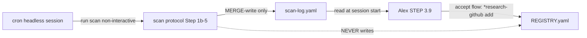

---
# Quality Chain Metadata (Alex 必填 - Phase 4 Hook 将基于此阻塞 Gate 3)
task_type: mixed      # SKILL protocol edits (yaml-in-md) + headless spike (behavioral e2e evidence)
e2e_required: yes     # spike headless probe IS the e2e — behavioral evidence per Epic Success Criteria
research_required: no # research base already exists (DR-20260712 + phase3-grounding.md)

# Production directories that must have ≥1 git-tracked file at Gate 3
git_tracked_dirs: [".tad/evidence/spikes/cron-github-scan-2026-07"]

skip_knowledge_assessment: no  # spike outcome (PASS/FAIL + why) is exactly the kind of finding to assess

gate4_delta: []
---

# Handoff Document for Agent B (Blake)
## TAD v3.1 - Evidence-Based Development

**From:** Alex (Agent A - Solution Lead)
**To:** Blake (Agent B - Execution Master)
**Date:** 2026-07-13
**Project:** TAD Framework
**Task ID:** TASK-20260713-001
**Handoff Version:** 3.1.0
**Epic:** EPIC-20260712-native-capability-adoption.md (Phase 3/4)
**Supersedes:** N/A

---

## 🔴 Gate 2: Design Completeness (Alex必填)

**执行时间**: 2026-07-13

### Gate 2 检查结果

| 检查项 | 状态 | 说明 |
|--------|------|------|
| Architecture Complete | ✅ | Spike-gated two-branch design (PASS → cron prompt handed to Conductor; FAIL → degraded local path). Both branches fully specified; neither is "cancel". |
| Components Specified | ✅ | 3 deliverables: non-interactive scan variant (SKILL edit), standalone cron prompt file, spike evidence with explicit Verdict line. Conditional 4th: STEP 3.9 null-case nudge (FAIL branch only). |
| Functions Verified | ✅ | `gh api` / `gh search` / `yq` usages already live in research-github SKILL.md L347-451 (verified by Read). `claude -p` is the CLI headless mode. CronCreate confirmed main-session-only (grounding) → Conductor executes, NOT Blake. |
| Data Flow Mapped | ✅ | scan (headless or manual) → merge-write scan-log.yaml → Alex STEP 3.9 consumes. Single-writer principle preserved; REGISTRY.yaml explicitly untouched (AC8). |

**Gate 2 结果**: ✅ PASS

**Alex确认**: 我已验证所有设计要素，Blake可以独立根据本文档完成实现。

---

## 📋 Handoff Checklist (Blake必读)

Blake在开始实现前，请确认：
- [ ] 阅读了所有章节
- [ ] **阅读了「📚 Project Knowledge」章节中的历史经验**
- [ ] 所有"强制问题回答（MQ）"都有证据
- [ ] 理解了真正意图（不只是字面需求）
- [ ] 每个Phase的交付物和证据要求都清楚
- [ ] 确认可以独立使用本文档完成实现

❌ 如果任何部分不清楚，**立即返回Alex要求澄清**，不要开始实现。

---

## 1. Task Overview

### 1.1 What We're Building

A spike-gated integration that lets the `*research-github scan` protocol run headlessly, so a
Claude Code scheduled routine (CronCreate, weekly) can keep `.tad/github-registry/scan-log.yaml`
fresh without a human triggering it. Blake delivers: (a) a non-interactive variant of the scan
protocol (SKILL.md edit — today-guard must never prompt in headless context), (b) the exact cron
prompt text as a standalone file for the Conductor to register, (c) spike evidence from a local
`claude -p` headless probe proving gh-auth + skill-resolution + end-to-end scan work headlessly,
with an explicit `Verdict: PASS` or `Verdict: FAIL` line. On FAIL: the degraded local path
(manual cadence doc + Alex STEP 3.9 null-case nudge) ships instead — value kept, automation deferred.

### 1.2 Why We're Building It

**业务价值**：scan-log.yaml 的 `last_scan` 至今是 `null` — routine 从未跑过。Alex STEP 3.9 的
周报机制（已建好）因此从未产出过任何报告。这条自动化补上后，GitHub awesome-list 知识发现层
才真正闭环。
**用户受益**：每周自动获得 registry 更新 + 新 awesome-list 候选，session start 时 STEP 3.9
直接报告，无需记得手动扫描。
**成功的样子**：当一次 headless 运行真实地把 `last_scan: null` 翻成一个日期、且下次 Alex
session start 时 STEP 3.9 报出扫描结果时，这个功能就成功了（行为证据，非结构证据）。

### 1.3 🆕 Intent Statement（意图声明）

**真正要解决的问题**：验证"scheduled cloud agent 能否 headless 跑一个 LLM-driven SKILL 协议
（含 gh CLI auth）"这个未知，并把 scan 协议改造成 headless-safe。这是一个 SPIKE-GATED phase：
先证明可行性，再交付对应分支。

**不是要做的（避免误解）**：
- ❌ 不是把 scan 重写成 bash script——scan 是 LLM-driven SKILL 协议（freshness 判断 + discovery
  过滤是 judgment），保持协议形态，cron prompt 委托给 SKILL 执行。
- ❌ 不是由 Blake 调用 CronCreate——sub-agent 拿不到这个 main-session 工具。Blake 只交付
  prompt 文本 + 证据；实际注册由 Conductor (Alex main session) 在 gate PASS 后执行。
- ❌ 不是修改 REGISTRY.yaml——single-writer 原则：scan-log.yaml 是 routine 的唯一输出。
  REGISTRY.yaml 的 last_checked 由 `*research-github refresh` / STEP 3.9 accept 流程另行维护。
- ❌ spike FAIL 不等于 phase 取消——Epic 明确规定 degrade（本地手动路径），不允许 silently drop。

**Blake请确认理解**：
```
在开始实现前，请用你自己的话回答：
1. 这个功能解决什么问题？
2. 用户会如何使用？
3. 成功的标准是什么？

只有Human确认你的理解正确后，才能开始实现。
（YOLO Epic 模式下：由 Conductor 代行确认——Blake 在 completion report 开头写下三问答案。）
```

---

## 📚 Project Knowledge（Blake 必读）

**⚠️ MANDATORY READ — Blake 在开始实现前，必须执行以下 Read 操作：**
1. Read `.tad/project-knowledge/patterns/ac-verification.md`
2. Read `.tad/project-knowledge/patterns/shell-portability.md`
3. Read `.tad/project-knowledge/patterns/gate-design.md`
4. Read the handoff's "⚠️ Blake 必须注意的历史教训" entries carefully
5. This is NOT optional — project knowledge prevents repeated mistakes

### 步骤 1：识别相关类别

本次任务涉及的领域（勾选所有适用项）：
- [x] code-quality - SKILL 协议编辑模式
- [x] testing - spike 证据设计、AC 判别性
- [x] api-integration - gh CLI（REST + search rate limits）
- [x] architecture - single-writer、spike-gate 分支设计
- [ ] security
- [ ] ux
- [ ] performance
- [ ] mobile-platform

### 步骤 2：历史经验摘录

**已读取的 project-knowledge 文件**：

| 文件 | 相关记录数 | 关键提醒 |
|------|-----------|----------|
| principles.md | 3 条 | Validation Theater（结构检查≠行为证据）；Measure Before Optimizing（spike 带明确 pivot 阈值）；单用户 CLI 用软提醒不用机械强制 |
| patterns/ac-verification.md | 若干 | AC 必须可运行、判别性（fixture discrimination）、dry-run discipline |
| patterns/shell-portability.md | 若干 | macOS/BSD grep/yq 兼容；zsh 下 `echo ===` 会被 glob 展开（本 handoff 起草时实测踩到）|
| patterns/gate-design.md | 若干 | honest_partial：分支未走到的 AC 用 NOT_APPLICABLE_WITH_REASON，不许绿 |

**⚠️ Blake 必须注意的历史教训**：

1. **Validation Theater**（来自 principles.md, YOLO audit 2026-05-15）
   - 问题：结构检查（文件存在、grep 命中）证明不了能力真的工作。
   - 解决方案：本 phase 的核心证据是**行为性的**——`last_scan` 真实翻转 + merge-write 真实保留
     fixture。spike 必须真跑 scan（限定 `--domain` 控制 API 预算），不许 mock。

2. **Phase 2 的 NEGATIVE-RESULT 先例**（来自本 Epic Phase 2, 2026-07-13）
   - 问题：native 能力（`memory`/`skills` frontmatter）在当前 CLI 版本上 INERT——文档说有 ≠ 真的有。
   - 解决方案：grounding 明确要求"verify in spike, do not trust blindly"。headless session 是否有
     gh auth（keychain）、是否加载 project skills，都必须 PROVE，不许引用文档作为证据。

3. **Never Hand-Write What an Existing Tool Already Does**（来自 principles.md, 2026-05-28）
   - 问题：绕过现有机制从记忆重写 → 不完整。
   - 解决方案：现有 SKILL.md L462-490 的 routine prompt 内联复刻了 scan 逻辑（而且是 full-overwrite
     写法，违反 Step 4 的 merge-write）。修法是**让 cron prompt 委托给 SKILL 的 scan 协议**，
     不是再写第三份逻辑。

### Blake 确认

- [ ] 我已阅读上述历史经验
- [ ] 我理解需要避免的问题
- [ ] 如遇到类似情况，我会参考上述解决方案

---

## 2. Background Context

### 2.1 Previous Work

- `.claude/skills/research-github/SKILL.md`（567 行）：`*research-github scan` 完整协议在
  L330-400（Step 1 scope → Step 1b today-guard → Step 2 freshness → Step 3 discovery →
  Step 4 merge-write → Step 5 summary）。L455-500 已有一个 "Setup: Scheduled Routine" 章节，
  内含手工复刻的 routine prompt（有缺陷，见 §3.1 FR2）。
- `.claude/skills/alex/SKILL.md` L369-399：STEP 3.9 消费 scan-log.yaml。已有 staleness
  WARNING（>14d）；`last_scan == null` → **silent skip**（degraded 分支要改的就是这一行为）。
- `.tad/github-registry/scan-log.yaml`：`last_scan: null`，routine 从未跑过。任何一次成功
  headless 运行立即可观测。
- Epic Phase 1（PreCompact hook）与 Phase 2（frontmatter spike，NEGATIVE-RESULT）已完成，
  证据在 `.tad/evidence/yolo/native-capability-adoption/`。

### 2.2 Current State

| 维度 | 现状 | 目标 |
|------|------|------|
| scan 触发 | 仅手动 `*research-github scan`（且从未跑过） | 每周 cron 自动 + 手动仍可用 |
| today-guard | `AskUserQuestion`（headless 下会挂死/失败） | headless 分支：same-day → log-and-exit，不 prompt |
| routine prompt | SKILL 内联复刻逻辑，full-overwrite 写 scan-log | 委托 SKILL scan 协议（non-interactive），merge-write 语义唯一 |
| headless 可行性 | 未知（gh auth? skill 解析? MCP 缺席?） | spike 证据落盘 + 显式 Verdict |
| FAIL 兜底 | 无 | 手动 cadence 文档 + STEP 3.9 null-case 一行 nudge |

### 2.3 Dependencies

- `gh` CLI 已认证（scan 必需，SKILL L35）；headless 上下文能否访问 keychain auth = spike 待证问题 (i)。
- `claude` CLI 支持 `-p`（headless/print mode）——spike 的探针载体。
- `yq`（scan-log 状态变更用到；本 phase 只需存在，不新增用法）。
- CronCreate/CronList/CronDelete：main-session 原生工具，**Blake 不可用**——Conductor 在
  gate PASS 后执行注册（grounding "Sub-agent limitation"，binding）。
- GitHub API 预算：全量 scan ~75 calls；spike 用 `--domain ai-agents` 限定单域（~7 calls）。

---

## 3. Requirements

### 3.1 Functional Requirements

- **FR1 — Non-interactive scan variant（SKILL 编辑）**：在 scan 协议 Step 1b today-guard 中
  增加 headless 分支：当以 non-interactive/scheduled 上下文运行（cron prompt 会显式声明
  "non-interactive mode"）时，若 `last_scan == today` → 输出一行 log（"Already scanned today
  ({last_scan}) — non-interactive mode, exiting without changes."）并 EXIT，**绝不调用
  AskUserQuestion**。手动交互路径的 AskUserQuestion 行为原样保留。
- **FR2 — Routine prompt 去重 + 委托**：重写 SKILL.md "Setup: Scheduled Routine" 章节的
  routine prompt：不再内联复刻 scan 逻辑（现版本 L465-484 复刻且 full-overwrite，违反
  Step 4 merge-write），改为指示 scheduled session：Read 本 SKILL → 以 non-interactive 模式
  执行 `*research-github scan` 协议全步骤（含 Step 4 merge-write）→ 只写 scan-log.yaml →
  别的什么都不做（grounding 待证问题 iv 的答案）。同一 prompt 文本另存为独立文件
  `.tad/evidence/spikes/cron-github-scan-2026-07/cron-prompt.md` 供 Conductor CronCreate 直接取用。
- **FR3 — Headless spike 探针**：本地以 `claude -p "<cron prompt 正文，scope 限定 --domain
  ai-agents>"` 模拟 cron body 端到端跑一次，采集：(i) headless 下 `gh auth status` 结果，
  (ii) skill/协议是否被解析遵循，(iii) scan 是否完成且 merge-write 语义被遵守（fixture 判别，
  见 §8.3），(iv) scan-log.yaml `last_scan` 是否翻转。证据 + 显式 `Verdict: PASS` / `Verdict: FAIL`
  写入 `.tad/evidence/spikes/cron-github-scan-2026-07/spike-evidence.md`。
  判据：(i)(ii)(iii)(iv) 全部满足 → PASS；任一不满足 → FAIL（写明是哪一问失败）。
- **FR4 — Degraded path（仅 spike FAIL 时执行）**：(a) 在 SKILL.md Setup 章节记录手动 cadence
  （每周一次 `*research-github scan`，配合 STEP 3.9 >14d WARNING 已有兜底）；(b) 把
  `.claude/skills/alex/SKILL.md` STEP 3.9 的 `last_scan == null → skip` 改为一行 gentle nudge
  （如 "📡 GitHub Registry 从未扫描过 — 运行 *research-github scan 启动周报"），同步更新
  L398 `suppress_if` 中的 null 条款。Keep tiny；不加新机制。
- **FR5 — Conductor 边界**：Blake 不调用 CronCreate/CronDelete。completion report 的
  §Escalations 记录 "CronCreate registration = Conductor action, post-gate"（PASS 分支），
  以及 "+5min one-shot cron 验真 cron-fires-at-all = Conductor action"（grounding 明示
  claude -p 只是 gh-auth/skill-resolution 问题的 EQUIVALENT_SUBSTITUTE）。

### 3.2 Non-Functional Requirements

- **NFR1 — Single-writer 不破坏**：routine/spike 只写 scan-log.yaml；REGISTRY.yaml 与
  research-notebooks/REGISTRY.yaml 零改动（AC8 验证）。
- **NFR2 — API 预算**：spike 限定 `--domain ai-agents`（1 域 ≈ 6 REST + 1 search）；不跑全量。
- **NFR3 — 手动路径零回归**：交互式 scan 的行为（AskUserQuestion today-guard、Step 2-5）不变。
- **NFR4 — Fail-open**：cron prompt 中指示任何步骤失败时安静退出不重试轰炸（smoke alarm 原则）。
- **NFR5 — 双平台 parity**：`.agents/skills/research-github/SKILL.md` 镜像存在（已验证）——
  SKILL.md 编辑完成后必须重新镜像并 `cmp` 校验（AC10）。FAIL 分支同理镜像 alex/SKILL.md。

### 3.3 Optimization Target

N/A — 无数值优化目标，不触发 Autoresearch Mode。

---

## 4. Technical Design

### 4.1 Architecture Overview

```
[CronCreate weekly routine]  ←(注册: Conductor, post-gate, PASS 分支)
        │ fresh headless session, cron prompt = "non-interactive mode, run scan per SKILL"
        ▼
.claude/skills/research-github/SKILL.md :: *research-github scan
  Step 1b today-guard ──(interactive)──→ AskUserQuestion（原样保留）
                      └─(non-interactive)→ same-day? log-and-exit : continue   ← FR1 新增
  Step 2-3 freshness + discovery (gh api / gh search)
  Step 4 MERGE-write ──→ .tad/github-registry/scan-log.yaml（唯一输出）
        ▼
Alex STEP 3.9（已存在，不改——除非 FAIL 分支的 null-case nudge）
```

Spike 探针 = 用 `claude -p` 在本地模拟上图 "fresh headless session" 一格，其余链路全真。

### 4.2 Component Specifications

| 组件 | 位置 | 规格 |
|------|------|------|
| Non-interactive guard | research-github SKILL.md Step 1b（现 L341-345） | 新增 headless 分支；触发条件 = prompt 声明 non-interactive mode；行为 = same-day log-and-exit |
| Routine prompt v2 | 同文件 "Setup: Scheduled Routine"（现 L455-500） | 委托式 prompt：Read SKILL → run scan non-interactive → 只写 scan-log → 失败安静退出。删除内联复刻逻辑 |
| cron-prompt.md | .tad/evidence/spikes/cron-github-scan-2026-07/ | routine prompt v2 正文的独立拷贝 + 一行注释说明 Conductor 用法（CronCreate weekly, Sunday 23:00） |
| spike-evidence.md | 同上目录 | 四问 (i)-(iv) 各自的原始输出 + fixture before/after + `Verdict: PASS|FAIL` 独立一行 |
| STEP 3.9 nudge（条件） | alex SKILL.md L374 + L398 | 仅 FAIL 分支：null → 一行 nudge；suppress_if 同步 |

### 4.3 Data Models

scan-log.yaml schema 不变（version 1.0.0）：
```yaml
version: 1.0.0
last_scan: YYYY-MM-DD | null
scan_results:
  updates: [{repo, domain, last_commit, previous_checked}]
  new_candidates: [{repo, domain, stars, description, status: pending|accepted|rejected, first_seen}]
```
Spike fixture（判别 merge-write）：探针前手动 seed 一条
`{repo: "tad-spike/fake-rejected-fixture", domain: "ai-agents", stars: 9999, description: "spike fixture", status: rejected, first_seen: 2026-07-13}`
——GC 规则只删 `first_seen < previous last_scan` 的 rejected（previous 为 null → 必须保留）。
探针后该条仍在且 status 仍为 rejected = merge-write 真实执行；消失 = full-overwrite 泄漏 → FAIL(iii)。
证据采集完成后移除 fixture（保留真实 scan 结果）。

### 4.4 API Specifications

无新 API。使用既有：`gh api "repos/{owner}/{repo}/commits?per_page=1"`、
`gh search repos ... --limit 5 --json fullName,stargazersCount,description`（camelCase、
2s delay、403 → wait-60s-retry-once 规则均已在 SKILL Step 2/3 中，不重写）。

### 4.5 User Interface Requirements

CLI 文本输出 only。headless 分支不得产生任何交互式 prompt（这正是 FR1 的全部意义）。

---

## 5. 🆕 强制问题回答（Evidence Required）

### MQ1: 历史代码搜索

**回答**：
- [x] 是 → idea 名为 "cron-**revive**-github-scan"，明示存在既有方案

#### 搜索证据
```bash
grep -n "scan" .claude/skills/research-github/SKILL.md | head -40
# → L330 scan 协议全文；L455-500 已有 "Setup: Scheduled Routine" 章节（手工 /schedule 路径）
grep -n "STEP 3.9\|scan-log" .claude/skills/alex/SKILL.md
# → L369-399 STEP 3.9 消费端完整存在
cat .tad/github-registry/scan-log.yaml
# → last_scan: null（routine 从未运行）
```

#### 决策说明
- **找到了什么**：完整的 scan 协议 + 消费端 + 一个从未被执行的手工 setup 章节（且其 routine
  prompt 内联复刻逻辑、full-overwrite 写法与 Step 4 merge-write 冲突）
- **位置**：research-github/SKILL.md L330-400, L455-500; alex/SKILL.md L369-399
- **决定**：✅ 复用 scan 协议（委托），❌ 不复用旧 routine prompt（重写为委托式）
- **原因**：Never Hand-Write What an Existing Tool Already Does；逻辑双份必然漂移，且旧 prompt
  会破坏用户 accept/reject 决策数据

### MQ2: 函数存在性验证

#### 函数清单

| 函数/命令 | 文件位置 | 行号 | 代码片段 | 验证 |
|--------|---------|------|---------|------|
| `*research-github scan` 协议 | .claude/skills/research-github/SKILL.md | L330 | `### \`*research-github scan [--domain <slug>]\`` | ✅ |
| today-guard AskUserQuestion | 同上 | L343 | `AskUserQuestion: "Already scanned today ({last_scan}). Re-scan?"` | ✅ |
| merge-write Step 4 | 同上 | L370 | `Step 4: Merge-write scan-log.yaml (NEVER full overwrite` | ✅ |
| STEP 3.9 消费端 | .claude/skills/alex/SKILL.md | L369-399 | `name: step3_9_github_scan_report` | ✅ |
| null → silent skip | 同上 | L374 | `If last_scan == null → skip (routine has never run — no output)` | ✅ |
| `gh` CLI auth | preflight | L28 | `gh auth status 2>&1 \| grep -q 'Logged in'` | ✅ |
| CronCreate | native tool（main session） | — | deferred tool list 可见；sub-agent 不可用（grounding binding） | ✅ |
| domain slug `ai-agents` | .tad/github-registry/REGISTRY.yaml | L10 | `slug: "ai-agents"` | ✅ |

### MQ3: 数据流完整性

#### 数据流对照表

| 生产字段 | 用途说明 | 消费端 | 是否消费 | 说明 |
|---------|---------|---------|---------|-----------|
| last_scan | 新鲜度基准 | STEP 3.9 staleness + scan-log 命令 | ✅ | spike 行为证据的核心观测点 |
| scan_results.updates | 已注册列表的更新 | STEP 3.9 周报 N 计数 | ✅ | |
| scan_results.new_candidates | 新候选 + status | STEP 3.9 accept/reject 流程 | ✅ | rejected 必须被 merge-write 保留 |
| first_seen | GC 依据 | scan Step 4 GC | ✅ | fixture 判别用 |

#### 数据流图



### MQ4: 视觉层级

**回答**：
- [ ] 有不同状态
- [x] 无 UI 状态 → 跳过。CLI 文本输出；candidate status（pending/accepted/rejected）的展示
  已由既有 scan-log/STEP 3.9 流程负责，本 phase 不改动展示层。

### MQ5: 状态同步

#### 状态存储位置

| 数据 | 存储位置1 | 存储位置2 | 同步时机 | 同步方向 |
|------|----------|----------|---------|---------|
| scan 结果 + candidate status | scan-log.yaml（Source of Truth，单写者） | 无 | — | — |
| registry 条目 | REGISTRY.yaml | scan-log accepted 条目 | STEP 3.9 "加入" 时 add 成功后才写 scan-log status | REGISTRY 先写，scan-log 后标（既有 mutation_protocol，不改） |
| SKILL.md 正文 | .claude/skills/research-github/ | .agents/skills/research-github/（镜像） | Blake 编辑完成后立即 | .claude → .agents 单向 |

#### 状态流图
```
[scan headless/manual] → scan-log.yaml (唯一存储, merge-write)
✅ scan 数据只有一个状态文件，无双写同步问题
⚠️ 唯一同步义务 = SKILL.md 双平台镜像（cmp 校验, AC10）
```

**Human验证点**：主状态 = scan-log.yaml；镜像同步时机明确（编辑后立即 + cmp）；不会出现不同步。

---

## 6. Implementation Steps（分Phase）

## 6.1 Micro-Tasks

| # | File | Operation | Verification Command | Est. Time |
|---|------|-----------|---------------------|-----------|
| 1 | .claude/skills/research-github/SKILL.md | Step 1b 增加 non-interactive 分支（FR1） | `grep -c 'non-interactive' .claude/skills/research-github/SKILL.md` ≥ 2 | 5 min |
| 2 | .claude/skills/research-github/SKILL.md | 重写 Setup 章节 routine prompt 为委托式（FR2） | `sed -n '/## Setup: Scheduled Routine/,$p' .claude/skills/research-github/SKILL.md \| grep -c 'gh search repos'` == 0 | 10 min |
| 3 | .tad/evidence/spikes/cron-github-scan-2026-07/cron-prompt.md | 创建独立 cron prompt 文件 | `test -f` | 3 min |
| 4 | .tad/github-registry/scan-log.yaml | seed rejected fixture（探针前） | `grep -c 'fake-rejected-fixture' .tad/github-registry/scan-log.yaml` == 1 | 3 min |
| 5 | — (spike run) | `claude -p` headless 探针（--domain ai-agents） | scan-log `last_scan` 翻转 + fixture 保留 | 15 min |
| 6 | .tad/evidence/spikes/cron-github-scan-2026-07/spike-evidence.md | 记录四问原始输出 + Verdict 行 | `grep -cE '^Verdict: (PASS\|FAIL)'` == 1 | 15 min |
| 7 | .tad/github-registry/scan-log.yaml | 移除 fixture（保留真实结果） | `grep -c 'fake-rejected-fixture'` == 0 | 2 min |
| 8 | .claude/skills/alex/SKILL.md | 仅 FAIL 分支：L374 null-case nudge + L398 suppress_if | `grep -c '从未扫描' .claude/skills/alex/SKILL.md` == 1（FAIL 分支）| 10 min |
| 9 | .agents/skills/research-github/SKILL.md (+ alex 如改) | 重新镜像 | `cmp .claude/skills/research-github/SKILL.md .agents/skills/research-github/SKILL.md` exit 0 | 3 min |

### Phase A: SKILL 编辑（预计 0.5 小时）

#### 交付物
- [ ] FR1 non-interactive today-guard 分支
- [ ] FR2 委托式 routine prompt（旧内联逻辑删除）+ cron-prompt.md 独立文件

#### 实施步骤
1. Micro-task 1-3。
2. cron prompt 正文要点（必须全含）：声明 "non-interactive mode"；Read research-github SKILL；
   执行 scan 协议全步骤含 Step 4 merge-write；只写 scan-log.yaml；不改 REGISTRY.yaml；
   任何前置失败（gh 未认证等）→ 输出一行错误并退出，不重试。

#### 验证方法
- Micro-task 1-3 的 verification command 全绿。
- 交互路径回归：`grep -n 'Already scanned today' .claude/skills/research-github/SKILL.md` 仍命中。

#### 🆕 Phase A 完成证据（Blake必须提供）
- [ ] SKILL.md diff 摘要（编辑前后 Step 1b 与 Setup 章节对比）
- [ ] Micro-task 1-3 verification 输出

### Phase B: Headless Spike（预计 1 小时）

#### 交付物
- [ ] fixture seed → `claude -p` 探针 → 四问证据 → Verdict → fixture 清理

#### 实施步骤
1. Micro-task 4：seed fixture（§4.3 规格）。
2. Micro-task 5：`claude -p "<cron-prompt.md 正文，追加：scope 限定 --domain ai-agents>"`
   在项目根目录运行。同时独立采证 (i)：`claude -p "run: gh auth status, print raw output"`
   或探针 transcript 中的 gh auth 证据。
3. Micro-task 6：spike-evidence.md 按四问分节贴原始输出；末尾独立一行 `Verdict: PASS` 或
   `Verdict: FAIL`（FAIL 时注明失败的是 (i)/(ii)/(iii)/(iv) 哪一问 + 原始错误）。
4. Micro-task 7：清理 fixture。

#### 验证方法
- PASS 判据（全部满足）：(i) headless 内 gh auth 有效；(ii) scan 协议被解析且 headless 未触发
  任何交互 prompt；(iii) fixture 保留（merge-write 真实）；(iv) `last_scan` 翻转为 2026-07-13。
- 注意：探针会真实写 scan-log.yaml——这是要的行为证据，不是副作用。

#### 🆕 Phase B 完成证据
- [ ] spike-evidence.md（含 Verdict 行）
- [ ] scan-log.yaml 探针前后对照（before/after 摘录进 evidence）

### Phase C: 分支收尾（预计 0.5 小时）

#### 实施步骤
- **PASS 分支**：确认 cron-prompt.md 即 Conductor 可直接 CronCreate 的最终文本（含建议
  schedule：weekly, Sunday 23:00）。completion §Escalations 写明两条 Conductor actions（FR5）。
- **FAIL 分支**：Micro-task 8（STEP 3.9 nudge + suppress_if）+ Setup 章节手动 cadence 一段。
  completion 标注 degraded 交付按 Epic 政策为合法完成，非 partial。
- 两分支共同：Micro-task 9 镜像 + cmp。

#### 🆕 Phase C 完成证据
- [ ] 分支声明（PASS/FAIL）+ 对应交付物清单
- [ ] cmp 镜像校验输出

---

## 7. File Structure

### 7.1 Files to Create
```
.tad/evidence/spikes/cron-github-scan-2026-07/cron-prompt.md      # Conductor CronCreate 直接取用的 prompt 文本
.tad/evidence/spikes/cron-github-scan-2026-07/spike-evidence.md   # 四问证据 + Verdict: PASS|FAIL
```

### 7.2 Files to Modify
```
.claude/skills/research-github/SKILL.md   # FR1 Step 1b headless 分支 + FR2 委托式 routine prompt
.agents/skills/research-github/SKILL.md   # 镜像（编辑后 cmp 校验）
.tad/github-registry/scan-log.yaml        # 数据文件：fixture seed/清理 + 探针真实写入（非代码改动）
.claude/skills/alex/SKILL.md              # 仅 FAIL 分支：L374 null-case nudge + L398 suppress_if
.agents/skills/alex/SKILL.md              # 仅 FAIL 分支：镜像
```

### 7.3 Grounded Against (Phase 2 P2.2 — Alex step1c, 2026-04-24)

**Grounded Against** (Alex 实际 Read 过的源文件):

- .claude/skills/research-github/SKILL.md — L1-60 (preflight), L330-400 (scan 协议全文),
  L455-500 (Setup: Scheduled Routine), read at 2026-07-13
- .claude/skills/alex/SKILL.md — L369-399 (STEP 3.9 全文含 suppress_if), read at 2026-07-13
- .tad/github-registry/scan-log.yaml — 全文 (last_scan: null 确认), read at 2026-07-13
- .tad/github-registry/REGISTRY.yaml — slug 清单 head (ai-agents 确认存在), read at 2026-07-13
- .agents/skills/research-github/SKILL.md — 存在性确认 (MIRROR-EXISTS), 2026-07-13
- .tad/evidence/spikes/cron-github-scan-2026-07/* — (new — will be created)
- .tad/evidence/yolo/native-capability-adoption/phase3-grounding.md — 全文, read at 2026-07-13

---

## 8. Testing Requirements

### 8.1 Unit Tests

N/A（无编译代码）。协议级等价物 = §6.1 各 micro-task 的 grep/cmp verification。

### 8.2 Integration Tests

- 端到端 headless 探针（Phase B）即集成测试：真实 gh API、真实 SKILL 解析、真实 merge-write。
- 手动路径回归：编辑后交互式 today-guard 文本仍存在（AC2）。

### 8.3 Edge Cases

- **Same-day headless re-run**：探针成功后（last_scan = 今天）再跑一次探针 → 必须 log-and-exit，
  不 prompt、不重扫。这是 FR1 的判别测试，结果记入 spike-evidence.md（判据 (ii) 的一部分）。
- **fixture 判别（full-overwrite 泄漏）**：§4.3 fixture；消失 → FAIL(iii)。
- **gh rate-limit**：单域 scope 下几乎不可能触发；若触发，SKILL 既有 wait-60s-retry-once 规则生效即可。
- **claude -p 不可用/权限受限**：如 `claude -p` 本身无法运行（嵌套 session 限制等），这本身
  就是 spike 数据点——按 Friction Preflight 走 BLOCKED → 报告，不硬造证据。

## 8.4 Friction Preflight

| Friction Point | Required Step | Expected Fix Path | Allowed Substitute | Gate Impact |
|----------------|---------------|-------------------|--------------------|-------------|
| CronCreate 是 main-session 工具，Blake 不可用 | 注册 weekly cron + one-shot 验真 | Conductor 在 gate PASS 后执行 | EQUIVALENT_SUBSTITUTE：`claude -p` 本地探针覆盖 gh-auth/skill-resolution 两问（grounding 明示等价范围）；cron-fires-at-all 归 Conductor one-shot | 探针未跑或无 Verdict → Gate 3 FAIL |
| gh CLI 认证 | scan 必需 (SKILL L35) | 已认证（preflight 通过为前提）；headless 可见性正是 spike 待证 (i) | headless 下不可见 → 记为 FAIL(i)，走 FAIL 分支（合法结果） | 无证据的 PASS 声明 → Gate 3 FAIL |
| `claude -p` 嵌套/权限限制 | spike 探针载体 | 直接在 Blake terminal 运行 | 用户手动在另一 terminal 跑探针并回贴输出（DEGRADED_WITH_APPROVAL） | 未解决 BLOCKED → Gate 3 FAIL |
| GitHub API rate limit | Step 2/3 调用 | 单域 scope + SKILL 既有 retry 规则 | NOT_APPLICABLE_WITH_REASON（预算 ~7 calls） | — |
| 探针真实写 scan-log.yaml | 行为证据 | 预期行为，before/after 落证据 | 无需替代 | fixture 未清理 → AC7 FAIL |

**Status Enum**: `READY` / `BLOCKED` / `DEGRADED_WITH_APPROVAL` / `EQUIVALENT_SUBSTITUTE` / `NOT_APPLICABLE_WITH_REASON`

## 8.5 Feedback Collection (Non-Code Artifacts)

N/A — 无需人类品味判断的产物；cron prompt 质量由行为证据（探针）验证。

```yaml
feedback_required: false
```

## 8.6 🆕 Test Evidence Required

Blake必须提供：
- [ ] spike-evidence.md 全文（四问原始输出，非转述）
- [ ] scan-log.yaml before/after 摘录
- [ ] same-day re-run 判别测试输出
- [ ] cmp 镜像校验输出

---

## 9. Acceptance Criteria

Blake的实现被认为完成，当且仅当：
- [ ] FR1-FR3 + FR5 实现并验证（FR4 仅 FAIL 分支）
- [ ] 所有 Phase 完成并提供证据；spike 有显式 Verdict
- [ ] §9.1 全表按分支逐行 PASS 或 NOT_APPLICABLE_WITH_REASON（不许空、不许纸面绿）
- [ ] Conductor 边界未越（Blake 零 CronCreate 调用，Escalations 记录在案）
- [ ] Human/Conductor 验证"这是我期望的"

---

## 9.1 Spec Compliance Checklist ⚠️ PRIMARY VERIFICATION SOURCE — Gate 3 executes each row

> 所有命令在项目根目录 `/Users/sheldonzhao/01-on progress programs/TAD` 运行。
> 表内 `\|` 为 markdown 转义，提取运行时还原为 `|`（step1d Sub-rule 1）。
> 分支条件行：未走到的分支填 `NOT_APPLICABLE_WITH_REASON: spike verdict = {PASS|FAIL}`。

| # | Acceptance Criterion | Verification Type | Verification Method | Expected Evidence | Verified Output (Alex step1d) |
|---|---------------------|-------------------|--------------------|--------------------|-------------------------------|
| AC1 | Baseline：routine 从未跑过（last_scan null） | pre-impl-verifiable | `grep -c 'last_scan: null' .tad/github-registry/scan-log.yaml` | `1` | `1` (2026-07-13) |
| AC2 | Baseline：交互 today-guard 存在且 headless 分支尚不存在 | pre-impl-verifiable | `grep -n 'Already scanned today' .claude/skills/research-github/SKILL.md; grep -c 'non-interactive\|headless' .claude/skills/research-github/SKILL.md` | 命中 L343；计数 `0` | `343:    AskUserQuestion: "Already scanned today ({last_scan}). Re-scan?"` + `0` (2026-07-13) |
| AC3 | Baseline：spike 目录不存在 | pre-impl-verifiable | `test -d .tad/evidence/spikes/cron-github-scan-2026-07 && echo EXISTS \|\| echo ABSENT` | `ABSENT` | `ABSENT` (2026-07-13) |
| AC4 | FR1：Step 1b 有 non-interactive 分支，且交互路径保留 | post-impl-verifiable | `grep -c 'non-interactive' .claude/skills/research-github/SKILL.md; grep -c 'Already scanned today' .claude/skills/research-github/SKILL.md` | 第一个计数 ≥ 2；第二个计数 ≥ 1 | (post-impl) |
| AC5 | FR2：Setup 章节 routine prompt 不再内联复刻 scan 逻辑 | post-impl-verifiable | `sed -n '/## Setup: Scheduled Routine/,$p' .claude/skills/research-github/SKILL.md \| grep -c 'gh search repos'` | `0`（委托式 prompt 不含内联 gh 命令） | (post-impl) |
| AC6 | FR2：cron-prompt.md 独立交付且含 merge-write + 单写者指令 | post-impl-verifiable | `test -f .tad/evidence/spikes/cron-github-scan-2026-07/cron-prompt.md && grep -ci 'merge' .tad/evidence/spikes/cron-github-scan-2026-07/cron-prompt.md` | 文件存在；计数 ≥ 1 | (post-impl) |
| AC7 | FR3：spike 证据含显式 Verdict，fixture 已清理 | post-impl-verifiable | `grep -cE '^Verdict: (PASS\|FAIL)' .tad/evidence/spikes/cron-github-scan-2026-07/spike-evidence.md; grep -c 'fake-rejected-fixture' .tad/github-registry/scan-log.yaml` | `1`；`0` | (post-impl) |
| AC8 | NFR1：single-writer——REGISTRY.yaml 零改动 | post-impl-verifiable | `git diff --name-only -- .tad/github-registry/REGISTRY.yaml \| wc -l` | `0`（baseline 已验证为 0，见左） | pre-impl baseline: `0` (2026-07-13); final: (post-impl) |
| AC9 | 行为证据（PASS 分支）：last_scan 真实翻转 | post-impl-verifiable | `grep -c 'last_scan: null' .tad/github-registry/scan-log.yaml` | `0`（FAIL 分支：NOT_APPLICABLE_WITH_REASON + spike-evidence.md 中失败问编号） | (post-impl) |
| AC10 | NFR5：双平台镜像 byte-identical | post-impl-verifiable | `cmp .claude/skills/research-github/SKILL.md .agents/skills/research-github/SKILL.md && echo IDENTICAL` | `IDENTICAL`（FAIL 分支追加 alex/SKILL.md 同款 cmp） | (post-impl) |
| AC11 | FR4（仅 FAIL 分支）：STEP 3.9 null-case nudge + suppress_if 同步 | post-impl-verifiable | `grep -c '从未扫描' .claude/skills/alex/SKILL.md; grep -n 'suppress_if' .claude/skills/alex/SKILL.md \| head -1` | 计数 `1` 且 suppress_if 不再含 `last_scan == null` 静默条款（PASS 分支：NOT_APPLICABLE_WITH_REASON: verdict=PASS） | (post-impl) |
| AC12 | FR5：Blake 零 CronCreate；Conductor actions 落 Escalations | post-impl-verifiable | completion report §Escalations 含 "CronCreate" + "Conductor action" 字样：`grep -c 'Conductor action' <completion-report>` | ≥ 1 | (post-impl) |
| AC13 | Change scope：git 改动仅限 §7 清单 | post-impl-verifiable | `git status --porcelain -- .claude/skills .agents/skills .tad/github-registry .tad/evidence/spikes/cron-github-scan-2026-07 \| grep -v -e 'research-github' -e 'alex' -e 'scan-log' -e 'cron-github-scan' \| wc -l` | `0` | (post-impl) |

---

## 9.2 Expert Review Status (Alex 必填)

> 本 handoff 在 YOLO Epic Conductor workflow 下运行：专家审查由 Conductor 编排
> （handoff-review 双 reviewer：architecture lens + code-review lens），Alex 依 workflow
> 约束不自行 spawn reviewer。下表由 Conductor review 步骤回填。

### Audit Trail

| Reviewer | Issue | Resolution Section | Status |
|----------|-------|-------------------|--------|
| (Conductor-managed — pending design review) | — | — | Open |

### Experts Selected

1. **architecture reviewer（Conductor 指派）** — spike-gate 分支设计、single-writer 边界、Conductor/sub-agent 工具边界是本 handoff 的主要风险面
2. **code-reviewer（Conductor 指派）** — SKILL 协议编辑的回归风险（交互路径保留）、AC 命令可运行性/判别性

### Overall Assessment (post-integration)

- Pending Conductor-orchestrated review（本表回填后方可进入实现）

---

## 10. Important Notes

### 10.1 Critical Warnings

- ⚠️ **Blake 绝不调用 CronCreate/CronDelete**——即使工具在列表中可见。注册是 Conductor 的
  sanctioned mechanical execution（grounding binding；违反 = 越界）。
- ⚠️ **探针会花真实 GitHub API 调用并真实改写 scan-log.yaml**——限定 `--domain ai-agents`，
  且 fixture 用完必须清理（AC7 第二命令）。
- ⚠️ **spike FAIL 是合法结果，不是实现失败**——按 FAIL 分支交付 degraded path 即为完成。
  禁止为了"绿"而弱化判据或引用文档替代实测（Phase 2 的 INERT 教训）。
- ⚠️ **不要动 Step 4 merge-write 逻辑本身**——它是对的；有缺陷的是 Setup 章节那份复刻。

### 10.2 Known Constraints

- 同一时间只有 1 个 Active phase（Epic 规则）；本 handoff 只覆盖 Phase 3。
- cron-fires-at-all 问题本 handoff 内无法闭环（需 main-session 工具）——显式移交 Conductor，
  不算 Blake 的未完成项。
- `.tad/evidence/` 目录部分内容被 gitignore 时按 git_tracked_dirs 的 smoke-alarm 语义处理
  （warn, not fail）。

### 10.3 🆕 Sub-Agent使用建议

Blake应该考虑使用：
- [ ] **parallel-coordinator** - 不建议：任务线性（编辑 → 探针 → 分支收尾）
- [ ] **bug-hunter** - 仅当探针出现不可解释失败时
- [ ] **test-runner** - N/A（无测试套件；AC 命令直接跑）
- [ ] **refactor-specialist** - N/A

完成后在"Sub-Agent使用记录"中说明使用情况。

---

## 11. 🆕 Learning Content（可选）

### 11.1 Decision Rationale: cron prompt 委托式 vs 内联复刻

**选择的方案**：cron prompt 只声明模式与边界，逻辑委托给 SKILL 的 scan 协议。

**考虑的替代方案**：

| 方案 | 优点 | 缺点 | 为什么没选 |
|------|------|------|-----------|
| 委托式 prompt（选中） | 单一逻辑源；merge-write 语义自动继承；SKILL 演进 cron 免维护 | 依赖 headless session 能解析 project skill（spike 待证 (ii)） | ✅ 选中 |
| 内联复刻逻辑（现状 L465-484） | 不依赖 skill 解析 | 双份逻辑必漂移；现版已经漂移（full-overwrite 违反 Step 4，会抹掉用户 reject 决策） | 已被现实证伪 |
| 改写成 bash script + cron 直跑 | 完全确定性 | freshness/discovery 含 judgment（500-star 过滤、archived 判断的后续处置）；且违反"scan 是 SKILL 协议"的既有架构 | 过度机械化 |

**权衡分析**：
核心权衡：逻辑单源（防漂移）vs 运行时依赖（skill 解析）。
当前优先级：防漂移——漂移已真实发生过（full-overwrite 复刻），而 skill 解析风险恰好被本 spike 覆盖。

**💡 Human学习点**：
当"自动化入口"和"手动入口"共享一段流程时，让入口薄、协议厚；两个入口各带一份流程副本
是漂移的温床——第二份副本往往在写下当天就已经和第一份不一致。

---

## 12. 🆕 Sub-Agent使用记录

Blake完成后填写：

| Sub-Agent | 是否调用 | 调用时机 | 输出摘要 | 证据链接 |
|-----------|---------|---------|---------|---------|
| parallel-coordinator | ✅/❌ | [...] | [...] | [...] |
| bug-hunter | ✅/❌ | [...] | [...] | [...] |
| test-runner | ✅/❌ | [...] | [...] | [...] |

**Human验证点**：应该调用的都调用了吗？

---

**Handoff Created By**: Alex (Agent A)
**Date**: 2026-07-13
**Version**: 3.1.0
