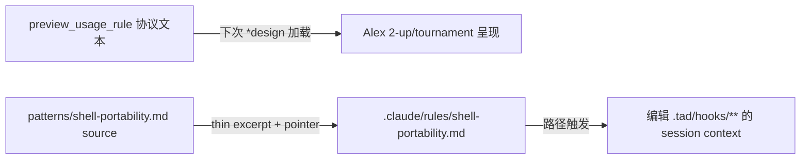

---
# Quality Chain Metadata (Alex 必填 - Phase 4 Hook 将基于此阻塞 Gate 3)
task_type: mixed      # protocol .md edits + .claude/rules config file + doc-verification spike
e2e_required: no      # behavioral fire-test evidence required, but no app e2e
research_required: yes # (b) frontmatter key syntax MUST be verified against current official docs (URL + retrieval date)
git_tracked_dirs: [".claude/rules"]
skip_knowledge_assessment: no
gate4_delta: []
---

# Handoff Document for Agent B (Blake)
## TAD v3.1 - Evidence-Based Development

**From:** Alex (Agent A - Solution Lead)
**To:** Blake (Agent B - Execution Master)
**Date:** 2026-07-13
**Project:** TAD Framework
**Task ID:** TASK-20260713-004
**Handoff Version:** 3.1.0
**Epic:** EPIC-20260712-native-capability-adoption.md (Phase 4/4)
**Supersedes:** N/A

---

## 🔴 Gate 2: Design Completeness (Alex必填)

**执行时间**: 2026-07-13 (YOLO — Conductor runs expert review separately)

### Gate 2 检查结果

| 检查项 | 状态 | 说明 |
|--------|------|------|
| Architecture Complete | ✅ | Two independent sub-tracks: (a) protocol-text preview wiring, (b) spike-gated rules pilot. Degradation matrix defined for (b). |
| Components Specified | ✅ | Exact files, insertion anchors (design-protocol.md step1_5c step 4 / success-pattern touchpoint), rules file structure specified. |
| Functions Verified | ✅ | No code functions called — protocol .md + one config .md. Anchors grep-verified (see §7.3, §9.1 pre-impl rows). |
| Data Flow Mapped | ✅ | (a) protocol text → next *design session behavior; (b) rules frontmatter → path-triggered context load. No app data flow. |

**Gate 2 结果**: ✅ PASS (design-level; Conductor expert review pending per YOLO flow)

**Alex确认**: 我已验证所有设计要素，Blake可以独立根据本文档完成实现。

---

## 📋 Handoff Checklist (Blake必读)

Blake在开始实现前，请确认：
- [ ] 阅读了所有章节
- [ ] **阅读了「📚 Project Knowledge」章节中的历史经验**
- [ ] 所有"强制问题回答（MQ）"都有证据
- [ ] 理解了真正意图（不只是字面需求）
- [ ] 每个Phase的交付物和证据要求都清楚
- [ ] 确认可以独立使用本文档完成实现

❌ 如果任何部分不清楚，**立即返回Alex要求澄清**，不要开始实现。

---

## 1. Task Overview

### 1.1 What We're Building

Two small native-capability adoptions (Epic Phase 4, ideas `askuser-preview-in-design` + `claude-rules-path-scoped`):

**(a) AskUserQuestion `preview` wiring — protocol text ONLY.**
Teach the *design flow WHEN to attach the native per-option `preview` field (markdown
rendered side-by-side in a monospace box) to AskUserQuestion calls: concrete artifact
comparison (code variants, config alternatives, design excerpts, 2-up palette markup) on
SINGLE-SELECT questions — and when NOT (preference questions, multiSelect). Wire it into
three existing option-presentation points in `.claude/skills/alex/references/design-protocol.md`,
with one scripted 2-up example.

**(b) Path-scoped `.claude/rules` pilot — single file, spike-gated, measured.**
Create `.claude/rules/shell-portability.md`: a THIN rule (5 hard constraints + pointer)
derived from `.tad/project-knowledge/patterns/shell-portability.md`, path-scoped to fire
only when touching `.tad/hooks/**`. Frontmatter key syntax verified against current
official docs FIRST (cite URL + retrieval date). Measurement defined before building
(fire / no-fire / content parity / context-delta), per Measure Before Optimizing.

### 1.2 Why We're Building It

**业务价值**：
- (a) Human-domain choice questions (per AI/Human Judgment Domain Awareness principle: give
  humans 选择题 with artifacts, not 验证题) get visual side-by-side artifacts — better
  decisions at *design 2-up comparisons and tournament final display, zero code cost.
- (b) Shell-portability constraints today load ONLY via Blake's keyword-matched context
  refresh inside TAD flow. Non-TAD-flow sessions (quick fixes, "直接帮我" edits) touching
  `.tad/hooks/**` get ZERO shell-portability protection. A path-scoped rule makes the 5
  hardest-won constraints available at edit-time in ANY session — the win is availability,
  NOT removing an existing global tax (CLAUDE.md @imports do NOT include patterns/*.md).

**用户受益**：Design comparisons become visually comparable; hook edits outside TAD flow stop
re-triggering known macOS/BSD portability failures.

**成功的样子**：当下次 *design session 的 2-up/tournament 展示带 preview、且一次真实的
`.tad/hooks/**` 编辑 session 里 rule 实际 fire 时，这个功能就成功了（behavioral evidence,
observe-on-next-use acceptable per grounding — honest_partial for protocol-text phase）。

### 1.3 🆕 Intent Statement（意图声明）

**真正要解决的问题**：把两个已研究验证的 native 能力（preview 字段、path-scoped rules）以
最小、可测量的方式接入现有协议 — (a) 是教学型 protocol text，(b) 是带测量的单文件 pilot。

**不是要做的（避免误解）**：
- ❌ 不是修改任何 `.workflow.js` 或写任何代码 — (a) 是 PROTOCOL TEXT change only。
- ❌ 不是给偏好类问题（pack selection、depth choice）加 preview — 那些是 preference
  questions，明确排除。
- ❌ 不是把 shell-portability.md 全文复制进 rules — 只做 thin excerpt（5 条硬约束 + 指针），
  否则产生 drift（grounding 明确的 risk）。
- ❌ 不是批量建 rules 体系 — 单文件 pilot，先测 context delta，再谈扩展。
- ❌ 不是在 CLI 不支持时假装成功 — Phase 2 的 NEGATIVE-RESULT 教训：frontmatter 可能被
  silently accepted 但 INERT。Spike 先行，INERT → 按降级矩阵处理，不得从绿色 AC 表继承
  "behavioral evidence satisfied"。

**Blake请确认理解**：
```
在开始实现前，请用你自己的话回答：
1. 这个功能解决什么问题？
2. 用户会如何使用？
3. 成功的标准是什么？

只有Human确认你的理解正确后，才能开始实现。
（YOLO mode：向 Conductor 声明理解即可，但必须写出三个回答。）
```

---

## 📚 Project Knowledge（Blake 必读）

**⚠️ MANDATORY READ — Blake 在开始实现前，必须执行以下 Read 操作：**
1. Read ALL `.tad/project-knowledge/*.md` files listed in 步骤 2 below
2. Read the handoff's "⚠️ Blake 必须注意的历史教训" entries carefully
3. This is NOT optional — project knowledge prevents repeated mistakes

### 步骤 1：识别相关类别

本次任务涉及的领域（勾选所有适用项）：
- [x] architecture - 协议文本分层（must-body vs reference）与 rules 分层
- [x] testing - AC 设计、fire-test 证据、negative test
- [x] code-quality - line-set diff discipline、内容 parity
- [ ] security
- [ ] performance（仅 context-delta 测量，非优化）

### 步骤 2：历史经验摘录

**已读取的 project-knowledge 文件**：

| 文件 | 相关记录数 | 关键提醒 |
|------|-----------|----------|
| principles.md | 4 条 | Measure Before Optimizing（先定 metric 再建）；YOLO audit anti-Validation-Theater（结构存在≠行为生效）；grep-count SAFETY 用 line-set diff 做 ground truth；AI/Human 域归属（preview 服务人域选择题） |
| patterns/shell-portability.md | 全文 | (b) 的内容 SOURCE — excerpt 必须逐条引用该文件条目，不得改写事实 |
| patterns/ac-verification.md | 若干 | AC 必须可运行、防 self-leak（AC 命令别匹配到 handoff 自身） |
| patterns/memory-and-learning.md | 若干 | 知识文件指针化优于复制（drift 防护） |

**⚠️ Blake 必须注意的历史教训**：

1. **Frontmatter 可能 silently INERT**（来自 Epic Phase 2 NEGATIVE-RESULT, merge bf51be4）
   - 问题：CLI 2.1.172 对 subagent `memory`/`skills` frontmatter 静默接受但零行为。
     `.claude/rules` 的 path-scoping 同属"文档宣称、harness 解析"类特性，同一 CLI 版本
     （当前仍为 2.1.172，已验证）完全可能同样 INERT。
   - 解决方案：(b) 必须 spike-first（§6 Phase B1）：docs 验证 + 最小 fire-test，拿到
     LOADED/INERT 实证后再决定走交付路径还是降级矩阵。禁止用"文件存在 + frontmatter
     parses"充当行为证据（Validation Theater）。

2. **Protocol .md 修改用 line-set diff 验证改动范围**（来自 principles.md 2026-05-31 条目）
   - 问题：改协议文本容易顺手动到非目标 section。
   - 解决方案：AC-scope 行用 `git diff` 逐文件核对：design-protocol.md 只允许 §6 指定的
     三个锚点区域变更；`comm` line-set diff 归档到 evidence。

3. **YAML frontmatter 冒号必须加引号**（来自 shell-portability.md 2026-06-08 条目）
   - 问题：description 类字段含冒号时严格 parser 报错。
   - 解决方案：rules 文件 frontmatter 值一律双引号；用 yq 验证（本机 python3 无 pyyaml——CR P0-2,勿用 yaml.safe_load）。

4. **双平台镜像 parity**（来自 release-sync pattern / 近期 commit b12e518）
   - 问题：`.claude/skills/alex/references/design-protocol.md` 在 `.agents/skills/...` 有
     byte-identical 镜像（已验证 IDENTICAL）。只改一侧会造成 parity drift。
   - 解决方案：(a) 的修改必须同步到 `.agents/skills/alex/references/design-protocol.md`，
     AC 验证 diff -q IDENTICAL。`.claude/rules/` 是 Claude-native 特性，无 .agents 对应物，
     不镜像（在 completion 中记一行说明即可）。

### Blake 确认

- [ ] 我已阅读上述历史经验
- [ ] 我理解需要避免的问题
- [ ] 如遇到类似情况，我会参考上述解决方案

---

## 2. Background Context

### 2.1 Previous Work

- Epic Phases 1-3 done（P1 PreCompact hook；P2 NEGATIVE-RESULT：`memory`/`skills` frontmatter
  INERT on CLI 2.1.172，交付降级物 + spike evidence；P3 SPIKE PASS + PARTIAL-AUTOMATION）。
  Phase 2/3 树立了本 phase 的两个先例：**spike-first** 和 **honest degradation**。
- Research base: `.tad/evidence/research/claude-native-capabilities/`（23-source notebook +
  harness introspection）。Native facts（grounding 已核）：`preview` 是 OPTIONAL per-option
  字段，markdown 渲染于 monospace box，side-by-side（options 左，preview 右），仅
  SINGLE-SELECT；`.claude/rules/*.md` 带 frontmatter path-scoping，仅当 agent 触碰匹配路径
  时加载 — 但 exact key 语法（`paths:`/`globs:`）研究只到 doc-level，实现时必须对当前文档
  再验证并引用。

### 2.2 Current State

Conductor grounding (`.tad/evidence/yolo/native-capability-adoption/phase4-grounding.md`) +
Alex 复核（2026-07-13）：

- `grep -c 'preview' .claude/skills/alex/references/design-protocol.md` = **0**（baseline）。
- 三个 option-presentation 点已定位：
  1. step1_5b 4a/5c（~L75-81, L93-97）pack 选择/排序 — **preference questions，明确 NOT
     preview 对象**（负面示例写进规则文本）。
  2. SKILL.md success_patterns L1675 "Present 2+ options for every significant technical
     decision" — 这是 preview 的 IS 用例，但 success_patterns 是 body 清单不宜塞协议；
     实际 wiring 落在 design-protocol.md（见 §6 Phase A1 设计决策）。
  3. step1_5c step 4（L146 "Use the merged_design from the result"）— tournament 结果
     呈现点，preview 的第二个 IS 用例。
- frontend 2-up：`.tad/project-knowledge/frontend-design.md` L29 的 2-up confirm step —
  作为规则文本中的 named example（textual artifacts 时用 preview）。
- `.claude/rules/` **不存在**（`ls` → No such file or directory，baseline）。
- 内容 SOURCE `.tad/project-knowledge/patterns/shell-portability.md` = 123 行 15 条 entry。
- `.agents/.../design-protocol.md` 与 `.claude/...` **IDENTICAL**（diff -q 已验证）。
- CLI version = **2.1.172**（与 Phase 2 INERT 发现同版本 — spike 必要性的直接证据）。

### 2.3 Dependencies

- 无外部包。`.claude/rules` 行为依赖 Claude Code harness（版本敏感 — spike 处理）。
- (a)(b) 相互独立，可并行；共享同一 completion report。

---

## 3. Requirements

### 3.1 Functional Requirements

- **FR1 (a)**: design-protocol.md 新增 `preview_usage_rule` 指导块：USE（concrete artifact
  comparison — code/config/design excerpt/2-up palette markup — 且 single-select）/ NOT
  （preference questions — 以 step1_5b pack 选择为 named 负面示例；multiSelect 不支持）。
- **FR2 (a)**: 含一个 scripted 2-up preview 调用示例（markdown 展示 AskUserQuestion 的
  options + 每个 option 的 preview 字段，用 warm-palette 2-up 或 design-option 2-up 为例）。
- **FR3 (a)**: step1_5c step 4 tournament 结果呈现处 wiring：merged_design 呈现给 human 时，
  若为 textual artifact 用带 preview 的 single-select AskUserQuestion（accept / adjust）。
- **FR4 (a)**: `.agents` 镜像同步，byte-identical。
- **FR5 (b)**: spike：当前官方文档验证 `.claude/rules` frontmatter path-scoping 的 exact
  key 语法（引用 doc URL + retrieval date），并做最小 fire-test 取得 LOADED/INERT 实证。
- **FR6 (b)**: spike LOADED → 创建 `.claude/rules/shell-portability.md`：frontmatter
  path-scope 到 `.tad/hooks/**`；正文 = 5 条硬约束 excerpt + 指向 source pattern file 的
  指针 + sync note（"source of truth 是 patterns/shell-portability.md，本文件只做摘录"）。
- **FR7 (b)**: 测量证据（metric 已在 §8 预定义）：fire / no-fire / content parity /
  context-delta 四项写入 evidence 文件。
- **FR8 (b)**: spike INERT → 降级矩阵（§10.2）：不交付 rules 文件为"生效能力"，交付 spike
  evidence + BLOCKED-UNTIL CLI upgrade 标记（复刻 Phase 2 先例），FR6/FR7 转
  NOT_APPLICABLE_WITH_REASON。

### 3.2 Non-Functional Requirements

- **NFR1**: (a) 零代码 — `git diff --stat` 不得出现任何 `.js` 文件。
- **NFR2**: (b) rules 文件 ≤ 60 行 / ≤ 4KB（thin-rule 防 drift 上限；context-delta 即文件
  本身的 token 成本，必须记录）。
- **NFR3**: design-protocol.md 改动范围锁定：仅新增指导块 + step1_5c step 4 一处扩写；
  其余行 line-set 不变（`comm` diff 证据归档）。
- **NFR4**: 所有 frontmatter 值含冒号/括号时双引号（Codex strict parser 教训）。

### 3.3 Optimization Target (Optional — triggers Autoresearch Mode)

N/A — 无数值优化目标（context-delta 是测量记录，不是优化循环）。

---

## 4. Technical Design

### 4.1 Architecture Overview

```
Track (a) — protocol text (no spike needed; native facts already harness-verified):
  design-protocol.md
    ├── [NEW] preview_usage_rule block (after step1_5c, before step2 —
    │        与 tournament/option-presentation 语境相邻)
    │        · USE / NOT 判定规则 + named examples (2-up palette, design options,
    │          tournament final) + scripted example call
    ├── [EDIT] step1_5c step 4: merged_design 呈现 → preview-enabled single-select
    └── mirror → .agents/skills/alex/references/design-protocol.md (byte-identical)

Track (b) — spike-gated pilot:
  B1 SPIKE: docs 验证 frontmatter key 语法 (URL+date) → 最小 rule 文件 → fire-test
    ├── LOADED → B2: .claude/rules/shell-portability.md (thin: 5 constraints + pointer)
    │            └── B3: 测量 (fire / no-fire / parity / context-delta) → evidence
    └── INERT  → 降级: spike evidence + BLOCKED-UNTIL 标记, 不交付"生效"声明
```

### 4.2 Component Specifications

**(a) preview_usage_rule block**（YAML-style 与文件现有风格一致）:
- `use_when`: 具体 artifact 对比（code variants / config alternatives / design excerpts /
  2-up palette markup / tournament merged_design excerpt），single-select。
- `never_when`: preference questions（named 负面示例：step1_5b pack 确认、排序确认）、
  multiSelect（native 不支持 preview+multiSelect）、非文本 artifact（截图路径给不了 preview
  — 写明"textual artifacts only"）。
- `example`: 完整 scripted 调用（question + 2 options，每个 option 带 label + preview
  markdown），标注"preview renders in monospace box, side-by-side"。
- 引用 frontend-design.md warm-palette 2-up 作为 named use-case。

**(b) rules 文件结构**:
```markdown
---
{key verified in B1, e.g. paths/globs}: ["  .tad/hooks/**  " ← exact语法以B1为准]
---
# Shell Portability — hard constraints for .tad/hooks/** edits
> THIN EXCERPT. Source of truth: .tad/project-knowledge/patterns/shell-portability.md
> (sync note: 修改约束请改 source，本文件只跟随摘录)

1-5. [五条硬约束，每条 1-2 行 + 源条目日期引用]
```
五条约束（Alex 选定，均为 hooks 编辑最高频雷区，逐条对应 source entry）：
1. No `grep -P` on macOS — `grep -o`+`sed`（2026-04-03）
2. `$()` 内 grep no-match 在 `set -e` 下触发 ERR trap — 搜索类必须 `|| true`（2026-06-17）
3. `comm`/`sort` 处理 CJK 必须全员 `LC_ALL=C`（2026-05-31）
4. helper 在 `$()` 内 `exit` 只杀 subshell 且吞掉 GATE marker — 在调用点 exit（2026-06-09）
5. 连字符 slug 匹配禁用 `\b`，用 bracket class（2026-04-24）

### 4.3 Data Models

N/A — 无数据结构。唯一"schema"是 rules frontmatter（key 名 B1 确定）。

### 4.4 API Specifications

N/A — 无 API。AskUserQuestion `preview` 是 harness 原生字段，(a) 只写协议文本教用法。

### 4.5 User Interface Requirements

N/A（preview 渲染由 harness 负责；协议文本描述其布局即可）。

---

## 5. 🆕 强制问题回答（Evidence Required）

### MQ1: 历史代码搜索

**回答**：
- [x] 是 → 本任务显式基于"之前的"研究与 grounding。

#### 搜索证据
```bash
grep -c 'preview' .claude/skills/alex/references/design-protocol.md   # → 0 (baseline, 2026-07-13)
ls .claude/rules                                                       # → No such file or directory
grep -rn "preview" .claude/skills/alex/                                # → 仅 discuss-path-protocol.md L64（无关：fulltext preview 展示）
grep -n 'Use the merged_design' .claude/skills/alex/references/design-protocol.md  # → L146
```

#### 决策说明
- **找到了什么**：design-protocol.md 无任何 preview 用法；rules 目录不存在；tournament
  结果消费点在 step1_5c step 4 (L146)。
- **位置**：见上方命令输出。
- **决定**：✅ 复用现有 option-presentation 锚点（不新建协议步骤编号，preview_usage_rule
  作为独立指导块插入）；(b) 复用 patterns/shell-portability.md 为唯一内容源。
- **原因**：grounding 明确 (a) 是 PROTOCOL TEXT only、(b) 防 drift 用 thin pointer。

### MQ2: 函数存在性验证

#### 函数清单

| 函数名 | 文件位置 | 行号 | 代码片段 | 验证 |
|--------|---------|------|---------|------|
| （无 — 本任务不调用任何代码函数） | N/A | N/A | N/A | ✅ N/A |

锚点存在性（替代验证）：

| 锚点 | 文件位置 | 行号 | 验证 |
|------|---------|------|------|
| step1_5c step 4 "Use the merged_design" | design-protocol.md | 146 | ✅ grep 已验 |
| step1_5b pack 选择（负面示例引用） | design-protocol.md | 75-81 | ✅ Read 已验 |
| warm-palette 2-up confirm | frontend-design.md | 29 | ✅ grep 已验 |
| source pattern 条目 ×5 | patterns/shell-portability.md | 7-15, 76-88 等 | ✅ Read 已验（123 行全读） |

### MQ3: 数据流完整性

**回答**：无前后端。协议文本 → 未来 session 行为的"流"：

| 产出 | 用途说明 | 消费者 | 是否生效可测 | 说明 |
|---------|---------|---------|---------|-----------|
| preview_usage_rule | 教 Alex 何时用 preview | 下次 *design session | observe-on-next-use | honest_partial 允许（grounding 明示） |
| rules 文件 | hooks 编辑时注入约束 | 任意触碰 .tad/hooks/** 的 session | fire-test 实证 | spike-gated |

#### 数据流图



### MQ4: 视觉层级

**回答**：
- [ ] 有不同状态
- [x] 无不同状态 → 跳过（preview 渲染样式由 harness 固定：monospace box, side-by-side）

### MQ5: 状态同步

#### 状态存储位置

| 数据 | 存储位置1 | 存储位置2 | 同步时机 | 同步方向 |
|------|----------|----------|---------|---------|
| design-protocol 文本 | .claude/skills/alex/references/ (主) | .agents/skills/alex/references/ (镜像) | 本次实现内一次性 | .claude → .agents |
| shell-portability 约束 | patterns/shell-portability.md (Source of Truth) | .claude/rules/shell-portability.md (thin excerpt) | source 变更时人工跟随（sync note 声明） | source → rule |

**Human验证点**：两处均单向、主从明确；rule 文件顶部 sync note 显式声明从属关系，防 fork drift。

---

## 6. Implementation Steps（分Phase）

## 6.1 Micro-Tasks

| # | File | Operation | Verification Command | Est. Time |
|---|------|-----------|---------------------|-----------|
| A1 | .claude/skills/alex/references/design-protocol.md | 插入 preview_usage_rule 块（**固定插入点:step1_5c 块整体结束之后、step2 标题之前**;与 A2 的 L146 tournament 扩写**互不相邻、互不重叠**——arch P1-2,保证 line-set diff 可解释）：use_when / never_when / scripted 2-up example / named use-cases | `grep -c 'use_when' <file>` ≥1 且 `grep -c 'never_when' <file>` ≥1 | 5 min |
| A2 | 同上 | step1_5c step 4 扩写：merged_design 为 textual 时用 preview-enabled single-select（accept/adjust）呈现 | `sed -n '140,160p' <file>` 人核 + `git diff` 范围核对 | 3 min |
| A3 | .agents/skills/alex/references/design-protocol.md | 镜像同步 | `diff -q` → IDENTICAL | 2 min |
| B1 | .tad/evidence/yolo/native-capability-adoption/phase4-rules-spike.md | SPIKE：官方文档定位 `.claude/rules` frontmatter key 精确语法（URL+retrieval date 落盘）→ 写最小 rule → fire-test（编辑 .tad/hooks 下无害文件的场景中验证 rule 是否入 context）→ 结论 LOADED/INERT | 文件存在且含 `Verdict: LOADED` 或 `Verdict: INERT` + doc URL | 15 min |
| B2 | .claude/rules/shell-portability.md | （LOADED 时）建 thin rule：frontmatter(B1 语法) + 5 约束 + pointer + sync note | `yq -r '.' <(sed -n '/^---$/,/^---$/p' <file> | sed '1d;$d')` exit 0（本机无 pyyaml——CR P0-2） | 5 min |
| B3 | .tad/evidence/yolo/native-capability-adoption/phase4-rules-measurement.md | 测量四项落盘：fire 证据 / no-fire 证据 / parity 表 / context-delta (`wc -c`) | 文件存在且四节齐全 | 10 min |
| C1 | .tad/evidence/yolo/native-capability-adoption/phase4-lineset-diff.txt | design-protocol.md 改动的 line-set diff（`comm` on text lines, before/after）归档 | 文件存在；FORWARD-missing 为空或仅 step1_5c step 4 原句 | 3 min |

### Micro-Task Rules
- 每个 task 单文件；B2/B3 仅在 B1=LOADED 时执行，INERT 时按 §10.2 降级并在 completion 记录。
- fire-test 诚实边界：若当前 harness/session 形态无法在实现 session 内触发 rule 加载
  （例如 rules 仅在新 session 启动时评估），B3 的 fire 项降为 documented manual procedure +
  observe-on-next-use（PENDING-REAL-EVENT，复刻 Phase 1 AC2a 先例），并如实标注 — 禁止
  用"文件存在"冒充 fire 证据。

**🆕 Phase划分原则**：本 handoff 规模小（估 45-60 min），单 Phase 执行，证据分 track 提交。

### Phase 1: 双 track 实现（预计 1 小时）

#### 交付物
- [ ] design-protocol.md preview wiring（A1-A2）+ .agents 镜像（A3）
- [ ] rules spike evidence（B1）；LOADED 时 rules 文件 + 测量（B2-B3）
- [ ] line-set diff 归档（C1）

#### 实施步骤
1. Track B 先跑 B1 spike（结论决定 B2/B3 是否执行 — 最大不确定性前置，fast-fail）
2. Track A：A1 → A2 → C1 line-set diff → A3 镜像
3. B1=LOADED → B2 → B3；INERT → 写降级记录
4. 汇总 completion report（含 Friction Status 表 + Knowledge Assessment）

#### 验证方法
- 逐行执行 §9.1 所有 post-impl Verification Method，粘贴原始输出。

#### 🆕 Phase 1 完成证据（Blake必须提供）
- [ ] `git diff --stat` 输出（范围核对：无 .js，无预期外文件）
- [ ] B1 spike verdict 段落原文（含 doc URL + retrieval date）
- [ ] §9.1 全表逐行验证输出

**Human审查问题**：spike verdict 可信吗（有原始 fire-test 记录而非断言）？rule 文件够 thin 吗？

**Human决策**：✅ 接受 / ⚠️ 调整

---

## 7. File Structure

### 7.1 Files to Create
```
.claude/rules/shell-portability.md                                          # (b) thin rule, spike-gated
.tad/evidence/yolo/native-capability-adoption/phase4-rules-spike.md         # B1 spike evidence
.tad/evidence/yolo/native-capability-adoption/phase4-rules-measurement.md   # B3 四项测量 (LOADED 时)
.tad/evidence/yolo/native-capability-adoption/phase4-lineset-diff.txt       # C1 归档
```

### 7.2 Files to Modify
```
.claude/skills/alex/references/design-protocol.md    # A1 preview_usage_rule 块 + A2 step1_5c step 4 扩写
.agents/skills/alex/references/design-protocol.md    # A3 镜像 (byte-identical)
```

### 7.3 Grounded Against (Phase 2 P2.2 — Alex step1c, 2026-04-24)

**Grounded Against** (Alex step1c 实际 Read 过的源文件):

- .claude/skills/alex/references/design-protocol.md（全文 182 行, read at 2026-07-13）
- .tad/project-knowledge/patterns/shell-portability.md（全文 123 行, read at 2026-07-13）
- .claude/skills/alex/SKILL.md（L1640-1699 success_patterns 区段, read at 2026-07-13）
- .claude/workflows/tournament-design.workflow.js（grep 输出契约 merged_design L61/372/385 — 确认呈现点在协议侧而非 workflow 侧, at 2026-07-13）
- .tad/evidence/yolo/native-capability-adoption/phase4-grounding.md（全文, read at 2026-07-13）
- .claude/rules/shell-portability.md — (new — will be created)
- phase4-rules-spike.md / phase4-rules-measurement.md / phase4-lineset-diff.txt — (new — will be created)

---

## 8. Testing Requirements

### 8.1 Unit Tests
- N/A（无代码）。替代：rules frontmatter YAML parse 测试（AC10）。

### 8.2 Integration Tests
- Fire-test（B1/B3）：编辑 `.tad/hooks/**` 场景下 rule 入 context 的实证或 documented
  manual procedure + PENDING-REAL-EVENT 标注。
- No-fire test：不触碰 hooks 的场景 rule 不加载（同上诚实边界）。

### 8.3 Edge Cases
- B1 发现文档 key 与 grounding 猜测（paths/globs）都不符 → 以文档为准，evidence 记录差异。
- `.claude/rules` 特性在 2.1.172 上 INERT → §10.2 降级矩阵，非失败。
- design-protocol.md 的 YAML-style 内嵌块中新文本含冒号 → 保持与现有文件一致的 block scalar
  风格（`action: |`），避免结构歧义。

## 8.4 Friction Preflight

| Friction Point | Required Step | Expected Fix Path | Allowed Substitute | Gate Impact |
|----------------|---------------|-------------------|--------------------|-------------|
| `.claude/rules` 可能 INERT on CLI 2.1.172 | B1 spike fire-test | LOADED → 正常交付 | INERT → §10.2 降级（spike evidence + BLOCKED-UNTIL 标记），FR6/7 = NOT_APPLICABLE_WITH_REASON | 降级路径本身可 PASS Gate 3（复刻 Phase 2 先例）；未 spike 直接建文件则 BLOCK |
| fire-test 需要 rule 在 session 启动时加载（实现 session 内可能无法触发） | B3 fire 证据 | 同 session 内可观测则直接取证 | documented manual procedure + PENDING-REAL-EVENT（Phase 1 AC2a 先例） | 如实标注则不阻塞；冒充证据 BLOCK |
| 官方文档访问（WebFetch/WebSearch） | B1 语法验证 | 正常联网查询 | 离线时用本地 research notebook 引证 + 标注 retrieval 受限 | 无 doc 引证的 rules 语法 = 未验证，BLOCK B2 |
| 其余 | — | — | — | No friction-sensitive prerequisites identified beyond the above |

**Status Enum**: `READY` / `BLOCKED` / `DEGRADED_WITH_APPROVAL` / `EQUIVALENT_SUBSTITUTE` / `NOT_APPLICABLE_WITH_REASON`

## 8.5 Feedback Collection (Non-Code Artifacts)

N/A — 产出为协议文本与配置文件，质量判定走 AC + 专家审查，无需人域感知反馈。

```yaml
feedback_required: false
```

## 8.6 🆕 Test Evidence Required
Blake必须提供：
- [ ] §9.1 全表逐行原始输出（截图或粘贴）
- [ ] B1 spike 原始 fire-test 记录（非断言）
- [ ] C1 line-set diff 文件

---

## 9. Acceptance Criteria

Blake的实现被认为完成，当且仅当：
- [ ] FR1-FR5 实现并验证；FR6-FR7 实现（LOADED）或 FR8 降级记录完备（INERT）
- [ ] §9.1 全行 PASS（或诚实标注的 PENDING-REAL-EVENT / NOT_APPLICABLE_WITH_REASON）
- [ ] line-set diff 证明 design-protocol.md 改动范围锁定
- [ ] Human/Conductor 验证"这是我期望的"

---

## 9.1 Spec Compliance Checklist ⚠️ PRIMARY VERIFICATION SOURCE — Gate 3 executes each row

> Pipe-escape note: `\|` in table cells → un-escape to `|` when running.
> 所有路径相对 repo root: /Users/sheldonzhao/01-on progress programs/TAD

| # | Acceptance Criterion | Verification Type | Verification Method | Expected Evidence | Verified Output (Alex step1d) |
|---|---------------------|-------------------|--------------------|--------------------|-------------------------------|
| AC0a | Baseline: design-protocol.md 无 preview 用法 | pre-impl-verifiable | `grep -c 'preview' .claude/skills/alex/references/design-protocol.md` | 0 | `0` (2026-07-13) |
| AC0b | Baseline: rules 目录不存在 | pre-impl-verifiable | `ls .claude/rules` | No such file or directory | `ls: .claude/rules: No such file or directory` (2026-07-13) |
| AC0c | Baseline: 镜像 byte-identical | pre-impl-verifiable | `diff -q .agents/skills/alex/references/design-protocol.md .claude/skills/alex/references/design-protocol.md && echo IDENTICAL` | IDENTICAL | `IDENTICAL` (2026-07-13) |
| AC0d | Baseline: tournament 锚点存在 | pre-impl-verifiable | `grep -n 'Use the merged_design' .claude/skills/alex/references/design-protocol.md` | 命中 1 行 | `146:          4. Use the merged_design from the result as input for the rest of *design` |
| AC1 | preview_usage_rule 块存在且含 USE/NOT 双向规则（判别 key 断言,不数任意计数——arch P2-1） | post-impl-verifiable | `grep -c 'use_when' .claude/skills/alex/references/design-protocol.md && grep -c 'never_when' .claude/skills/alex/references/design-protocol.md && grep -c 'multiSelect' .claude/skills/alex/references/design-protocol.md` | 三个计数均 ≥ 1（三 token baseline 均为 0） | (post-impl) |
| AC2 | scripted 2-up example 存在（option 携带 preview 字段的完整示例） | post-impl-verifiable | `grep -n -A8 'example' .claude/skills/alex/references/design-protocol.md \| grep -c 'preview'` | ≥ 1 | (post-impl) |
| AC3 | 负面示例点名 preference questions（判别 token=`preference`,baseline=0——CR P1-1/arch P1-1） | post-impl-verifiable | `grep -c 'preference' .claude/skills/alex/references/design-protocol.md` | ≥ 2（baseline 0,只有新规则块引入） | (post-impl) |
| AC4 | tournament step 4 wiring：merged_design 呈现提及 preview | post-impl-verifiable | `sed -n '/Use the merged_design/,/skip_conditions/p' .claude/skills/alex/references/design-protocol.md \| grep -c 'preview'` | ≥ 1 | (post-impl) |
| AC5 | 零代码：无 .js 变更（`\.js$` 锚定，防 .jsonl 误匹配——CR P0-1） | post-impl-verifiable | `git diff --name-only \| grep -c '\.js$'` | 0 | (post-impl) |
| AC6 | 改动范围锁定：仅 §7.1/7.2 文件（对 tracked 变更判别,躲开 57 行既有噪音——CR P1-3） | post-impl-verifiable | `git diff --name-only \| grep -vE 'design-protocol\.md$'`（新增 untracked 交付物另列:`git status --porcelain .claude/rules .tad/evidence/yolo/native-capability-adoption`） | 第一个命令空输出;第二个仅含 §7.1/7.2 新文件 | (post-impl) |
| AC7 | 镜像 parity 恢复 byte-identical | post-impl-verifiable | `diff -q .agents/skills/alex/references/design-protocol.md .claude/skills/alex/references/design-protocol.md && echo IDENTICAL` | IDENTICAL | (post-impl) |
| AC8 | line-set diff 归档且 FORWARD-missing 可解释 | post-impl-verifiable | `test -s .tad/evidence/yolo/native-capability-adoption/phase4-lineset-diff.txt && echo EXISTS` | EXISTS；文件内 FORWARD-missing 为空或仅 step1_5c step4 被扩写的原句 | (post-impl) |
| AC9 | B1 spike evidence 含 verdict + doc 引证（LOADED 判据必须是"harness 真发现并加载了 rule 内容"——YAML 能 parse ≠ LOADED,arch P2-3;grep 中管道字符按 ERE 原义,勿加反斜杠——CR P1-4） | post-impl-verifiable | `grep -cE "Verdict: (LOADED|INERT)" .tad/evidence/yolo/native-capability-adoption/phase4-rules-spike.md; grep -cE "https?://" 同文件; grep -c "retrieval" 同文件` | 第一个计数恰 `1`（结论行独占,prose 不复现 Verdict:）;后两个计数均 ≥ 1 | (post-impl) |
| AC10 | (LOADED) rules 文件 frontmatter parses（yq——本机无 pyyaml，CR P0-2） | post-impl-verifiable | `yq -r '.paths // .globs // "NO-SCOPE-KEY"' <(sed -n '/^---$/,/^---$/p' .claude/rules/shell-portability.md \| sed '1d;$d') && echo PARSE-OK` | PARSE-OK 且 scope key 非 NO-SCOPE-KEY（INERT 时 NOT_APPLICABLE_WITH_REASON） | (post-impl) |
| AC11 | (LOADED) thin-rule 上限 | post-impl-verifiable | `wc -l .claude/rules/shell-portability.md && wc -c .claude/rules/shell-portability.md` | ≤ 60 行 且 ≤ 4096 bytes（INERT 时 N/A） | (post-impl) |
| AC12 | (LOADED) 内容 parity：5 约束在**deliverable rules 文件**中逐条存在且可溯源（CR P1-2:验交付物不是源文件） | post-impl-verifiable | `for k in 'grep -P' 'LC_ALL=C' 'ERR trap' 'GATE' 'bracket class'; do grep -l "$k" .claude/rules/shell-portability.md >/dev/null && echo "RULE-OK: $k" \|\| echo "MISS: $k"; done` | 5 行 RULE-OK 零 MISS；且 rule 文件每条注明源条目日期（INERT 时 N/A） | (post-impl) |
| AC13 | (LOADED) pointer + sync note 存在 | post-impl-verifiable | `grep -c 'project-knowledge/patterns/shell-portability.md' .claude/rules/shell-portability.md` | ≥ 1（INERT 时 N/A） | (post-impl) |
| AC14 | (LOADED) 四项测量落盘 | post-impl-verifiable | `for t in 'fire-test' 'no-fire' 'parity' 'context'; do grep -qiE "^#+ .*$t" .tad/evidence/yolo/native-capability-adoption/phase4-rules-measurement.md && echo "SEC-OK: $t"; done` | 4 行 SEC-OK（四个 token 各自独立命中,no-fire 不被 fire 吞并——CR P2-3;fire 项允许 PENDING-REAL-EVENT 如实标注；INERT 时 N/A） | (post-impl) |
| AC15 | 行为证据诚实标注（anti-Validation-Theater） | post-impl-verifiable | completion report 中每个 behavioral 声明附实证或 PENDING-REAL-EVENT/observe-on-next-use 标注；spec-compliance-reviewer 人工核对 | 无"文件存在"冒充"行为生效"的行 | (post-impl) |

---

## 9.2 Expert Review Status (Alex 必填)

> YOLO mode：per Epic 流程，expert review 由 Conductor 在 handoff 写就后调度
> （handoff-review workflow / 双 reviewer），本表由 Conductor 回填。

### Audit Trail

| Reviewer | Issue | Resolution Section | Status |
|----------|-------|-------------------|--------|
| (Conductor 调度 — pending) | — | — | Open |

### Experts Selected

1. **code-reviewer** — AC 命令可运行性、self-leak（AC 命令误匹配 handoff 自身）、rules frontmatter/YAML 细节
2. **backend-architect（或 spec-compliance-reviewer）** — spike-gate 降级矩阵完备性、protocol 分层（must-body vs reference）、镜像 parity 纪律

### Overall Assessment (post-integration)

- Pending Conductor review cycle.

---

## 10. Important Notes

### 10.1 Critical Warnings
- ⚠️ **(a) 是 PROTOCOL TEXT ONLY** — 修改 tournament-design.workflow.js 即违规（AC5 卡死）。
- ⚠️ **B1 spike 先于 B2** — Phase 2 证明同版本 CLI 会静默吞掉无效 frontmatter。未 spike
  就建 rules 文件并声称生效 = Validation Theater，Gate 3 BLOCK。
- ⚠️ **preview 仅 single-select** — 规则文本必须写明 multiSelect 不支持，否则下游误用。
- ⚠️ **rules 文件禁止全文复制 source** — thin excerpt + pointer；超 60 行/4KB 视为 drift 风险，AC11 FAIL。

### 10.2 Known Constraints（含降级矩阵）
- CLI 2.1.172（与 Phase 2 INERT 发现同版本）。
- **降级矩阵 (b)**：B1=INERT → 交付 = spike evidence（verdict + doc 引证 + 原始记录）+
  completion 中 `⛔ BLOCKED-UNTIL: CLI upgrade re-spike` 标记 + 不创建 `.claude/rules/`
  文件（避免 dead config 误导后人）或创建后立即删除并在 evidence 留存内容草稿；FR6/FR7
  → NOT_APPLICABLE_WITH_REASON。价值保留（约束内容已在 patterns/ 文件中），自动化推迟。
  Do NOT silently drop（Epic Success Criteria 明令）。
- **(a) 行为证据边界**：protocol-text phase 的真实行为证据 = 下次 *design session 实际
  使用 preview；本 phase 内 observe-on-next-use / honest_partial 可接受（grounding 明示）。
- `.claude/rules/` 无 .agents 对应物（Claude-native 特性），不做镜像；completion 记录一行
  说明即可（对齐 Phase 2 E3 的分发路径讨论）。

### 10.3 🆕 Sub-Agent使用建议

Blake应该考虑使用：
- [ ] **parallel-coordinator** - 不需要（2 个 track，串行 1 小时内）
- [ ] **bug-hunter** - 仅当 fire-test 出现异常行为
- [ ] **test-runner** - 不适用（无测试套件；§9.1 命令直接跑）
- [ ] **refactor-specialist** - 不适用

完成后在"Sub-Agent使用记录"中说明使用情况。

---

## 11. 🆕 Learning Content（可选）

### 11.1 Decision Rationale: preview wiring 落点选择

**选择的方案**：独立 preview_usage_rule 指导块 + step1_5c step 4 一处扩写（reference 文件内）。

**考虑的替代方案**：

| 方案 | 优点 | 缺点 | 为什么没选 |
|------|------|------|-----------|
| 指导块 + 单点扩写（选中）| 改动面最小、line-set 可控、规则集中可引用 | 依赖 Alex 下次加载 reference | ✅ 选中 |
| 在每个 AskUserQuestion 出现点逐一内联 preview 说明 | 就地可见 | 散射式改动、line-set diff 噪声大、后续维护 N 处 | 违反改动范围锁定纪律 |
| 写进 SKILL.md body（success_patterns 加一条） | 常驻 body 不怕 reference 未加载 | body 是清单不是协议；circular-trigger 测试不成立（preview 触发点在 *design 流内，非 body 概念）→ reference-ok | 2026-06-09 principle：非 must-body 内容进 reference |

**权衡分析**：
核心权衡：可发现性 vs 改动面控制。preview 属"锦上添花"型能力，误载成本低，选最小改动面。

**💡 Human学习点**：
给协议加"何时用某 native 能力"的判断规则时，集中成一个 USE/NOT 块 + 在关键锚点留一句
引用，比散射内联更可审、可回滚。

### 11.2 Decision Rationale: rules pilot 的 spike-gate

**选择的方案**：docs 引证 + 最小 fire-test 双证后再建正式文件。

**权衡分析**：Phase 2 花了整个 phase 才发现 frontmatter INERT；本 phase 把同类不确定性
压缩到 15 分钟 spike。fast-fail 前置（shell-portability 2026-05-09 条目的同款原则，用在
流程上）。

---

## 12. 🆕 Sub-Agent使用记录

Blake完成后填写：

| Sub-Agent | 是否调用 | 调用时机 | 输出摘要 | 证据链接 |
|-----------|---------|---------|---------|---------|
| parallel-coordinator | ✅/❌ | [...] | [...] | [...] |
| bug-hunter | ✅/❌ | [...] | [...] | [...] |
| test-runner | ✅/❌ | [...] | [...] | [...] |

**Human验证点**：应该调用的都调用了吗？

---

**Handoff Created By**: Alex (Agent A)
**Date**: 2026-07-13
**Version**: 3.1.0
