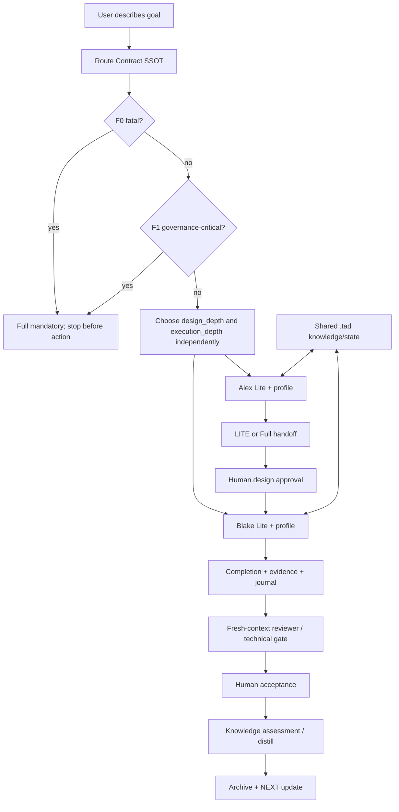
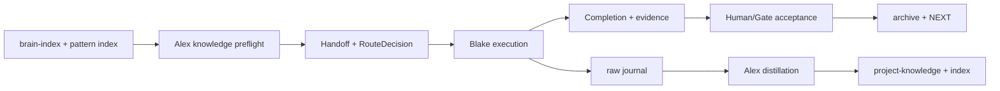

# Handoff Document for Agent B (Blake)
## TAD v3.1 - Evidence-Based Development

**From:** Alex (Agent A - Solution Lead)
**To:** Blake (Agent B - Execution Master)
**Date:** 2026-08-01
**Project:** TAD Framework
**Task ID:** TASK-20260801-001
**Handoff Version:** 3.1.0
**Epic:** N/A
**Supersedes:** LITE-20260801-1121-lite-standard-routing.md

---

## 🔴 Gate 2: Design Completeness (Alex必填)

**执行时间**: 2026-08-01（R3 独立增量复核完成）

### Gate 2 检查结果

| 检查项 | 状态 | 说明 |
|--------|------|------|
| Architecture Complete | ✅ | 三层治理、机器可读路由 SSOT、风险状态机、独立深度合并和共享 `.tad/` 数据流已由 backend-architect R3 复核 |
| Components Specified | ✅ | 路由契约、Alex/Blake profile、revision validator、approval transitions、用户解释层、证据层已列出 |
| Functions Verified | ✅ | 本单无应用函数；路由 preflight 与行为 harness 的输入/输出/失败契约已在 §4.6、§8.2、§9.1 定义，实际执行留 Gate 3 |
| Data Flow Mapped | ✅ | policy → route revision → approval → handoff/Completion → evidence/journal/knowledge → archive/NEXT 流已闭合并复核 |

**Gate 2 结果**: ✅ PASS — P0=0，P1=0；backend-architect R3 与 code-reviewer R3 均 PASS

**Alex确认**: Gate 2 已通过；仍须人确认后，方可把本文档交给 Blake 实施。Gate 3/4 仍按 Full TAD 执行。

---

## 📋 Handoff Checklist (Blake必读)

Blake在开始实现前，请确认：

- [ ] 阅读了所有章节
- [ ] 阅读了「📚 Project Knowledge」章节中的历史经验
- [ ] 阅读了 `.tad/routing-contract.yaml` 的版本与 precedence
- [ ] 所有强制问题回答都有证据
- [ ] 理解用户真正要的是“默认 Lite、必要时 Standard、风险才 Full”，不是六个新 Agent
- [ ] 每个 Phase 的交付物和证据要求都清楚
- [ ] 确认可以独立使用本文档完成实现

如果任何部分不清楚，立即返回 Alex，不要开始实现。

## 1. Task Overview

### 1.1 What We're Building

为 TAD 增加可验证的三层路由模型：Lite（默认）、Standard（Lite 的增强深度 profile）和 Full（高风险治理通道）。Alex 与 Blake 的设计深度、执行深度可以独立决定，但普通用户只看到“当前建议层级 + 一句话理由”，不需要自己组合角色。

### 1.2 Why We're Building It

**业务价值**：Full TAD 的确定性质量很好，但固定仪式和多轮审查使大多数日常任务 token、时间和认知成本过高；Lite 需要承担大多数工作，Standard 负责处理中间不确定性，Full 只处理真正高风险或治理关键的任务。

**用户受益**：用户直接描述目标即可开始；系统默认进入 Lite，只有在方案不确定性、集成风险或安全/协议边界出现时才提高深度，并解释原因。

**成功的样子**：用户无需理解四种组合就能使用；普通任务低成本完成；Standard 能明确提供额外价值；Full 边界在任何修改前被识别且不可被 Lite/Standard 选择覆盖；所有层级都保留质量核心。

### 1.3 🆕 Intent Statement（意图声明）

**真正要解决的问题**：不是再造 Alex-Medium/Blake-Medium，而是把“治理风险”和“工作深度”拆成两个可路由维度，让 TAD 的能力完整性和日常可用性同时成立。

**不是要做的**：

- 不是创建六套长期分叉的 Agent 技能。
- 不是把页数、文件数、上下文长度当成自动升级条件。
- 不是通过 Standard 绕过安全、协议或 fatal 边界。
- 不是引入 supervisor/swarm 或新的持久 memory 权威。

**Blake请确认理解**：

1. Lite 是默认工作通道，Standard 是 profile，不是新的 Agent。
2. Full 是治理边界，不是“更贵但可选”的深度。
3. 用户不选择 Alex/Blake 组合；角色根据同一份路由契约各自决定是否加深。

### 1.4 Questions for Blake（实现前必须确认）

| Question | Answer in this handoff | Evidence / implementation consequence |
|---|---|---|
| 是否创建 Alex Medium / Blake Medium？ | 否。Standard 是 profile，不是新 Agent 或新目录。 | FR2、AC3；实现只改列出的五类既有载体并创建一个 SSOT。 |
| 谁拥有路由规则？ | `.tad/routing-contract.yaml` 是 policy SSOT；handoff/Completion 只携带带 revision 的 task decision snapshot。 | §4.4、§4.6、MQ5；冲突时不得由 snapshot 改写 policy。 |
| Alex 与 Blake 能否独立加深？ | 可以；Alex 只写 `design_depth`，Blake 只写 `execution_depth`，合并按单调最大值推导 `route_level`。 | §4.6；不得静默降低另一侧深度。 |
| 发现 F0/F1 后是否还能继续 Lite/Standard？ | 不能。必须在下一次有副作用的动作前停止，写 escalation state 并转 Full。 | FR4、FR5、AC12。 |
| 缺少 SSOT、证据或人审怎么办？ | fail-closed：停止，不猜测、不执行有副作用动作，输出 honest partial 和恢复位置。 | FR6、§4.6、§8.2。 |
| Standard 何时结束？ | 完成 profile 输出并通过其 stop 条件；预算耗尽、发现契约不足、F0/F1 或证据无法形成时停止并升级。 | §4.5、§4.6、AC8/AC12。 |

## 📚 Project Knowledge（Blake 必读）

### 步骤 1：相关类别

- [x] architecture — 双角色、质量链和职责分离
- [x] code-quality — 证据载体、验证完整性、避免结构检查冒充行为验证
- [x] security — Full/fatal 边界和安全停止
- [x] testing — AC dry-run、独立 reviewer、行为 fixture
- [x] memory — 共享知识、journal、distillation、状态恢复

### 步骤 2：历史经验摘录

| 文件 | 相关记录数 | 关键提醒 |
|------|-----------|---------|
| `.tad/project-knowledge/principles.md` | 多条 L1 | 角色分离、四门质量系统、SAFETY 约束不能因 slimming 移除 |
| `.tad/project-knowledge/architecture.md` | 相关 | TAD 的职责、Gate 和交接链必须保持一致 |
| `.tad/project-knowledge/patterns/gate-design.md` | 相关 | 每个完成声明必须有 evidence carrier；结构 marker 不等于行为通过 |
| `.tad/project-knowledge/patterns/memory-and-learning.md` | 相关 | raw capture 与 distill 分离；共享状态必须有明确文件载体 |
| `.tad/evidence/research/lite-standard-routing/2026-08-01-architecture-scan.md` | 4 个外部来源 | 显式 workflow、checkpoint、HITL、resume 和 evaluator stop 条件 |

**⚠️ Blake 必须注意的历史教训**：

1. **Judgment-Only Skill Files: Constraint Rules Are NOT Mechanical**（来自 `principles.md`）
   - 问题：slimming 时移除 MUST/MANDATORY/VIOLATION 规则会让质量链失效。
   - 解决方案：只删仪式，不删角色分离、safety stop、review、AC 和 Full 边界。
2. **Validation Theater**（来自 `principles.md` 的 YOLO/质量经验）
   - 问题：grep/marker/文件存在只能证明结构，不证明 Agent 行为。
   - 解决方案：本单必须有正向、负向和组合行为场景，且由独立 reviewer 判定。
3. **Knowledge Is Forged at Distill, Not Captured**（来自 `principles.md` / memory pattern）
   - 问题：执行者不能可靠地把 episode diary 直接写成可复用知识。
   - 解决方案：Blake 捕获 raw journal，Gate/Acceptance 后由结构陌生人做 distill；`.tad/memory/` 不成为 TAD 权威。
4. **Measure Before Optimizing**（来自 `principles.md`）
   - 问题：没有真实使用数据就硬编码 Standard 阈值，会重新制造仪式。
   - 解决方案：本单定义可观察的 profile 行为和停止条件；token/时间阈值只在首批真实任务后再校准。

### 外部研究摘要

研究证据载体：`.tad/evidence/research/lite-standard-routing/2026-08-01-architecture-scan.md`

- Agent workflow 的控制流应显式定义，routing 是控制决策，不应通过复制 worker identity 解决。
- 人工审批、跨会话 memory 和故障恢复都需要明确的持久状态载体。
- 工作流的固定路径与 Agent 的动态工具使用是不同层次；Standard 应增加明确的反馈/验证步骤和停止条件。

## 2. Background Context

### 2.1 Previous Work

- v2.38.0 已发布 Lite Core Closure。
- Alex-Lite 已包含执行脊柱、共享知识预检、Knowledge Closeout、Scope/Risk Router 和 Lite Progress。
- Blake-Lite 已包含 bounded context refresh、Technical Gate、repair loop、honest partial、Completion 扩展和独立 reviewer。
- 旧草案 `LITE-20260801-1121-lite-standard-routing.md` 经两轮 Lite 契约审查、一次 Full Gate 2 审查均未放行；本 handoff 重建为 Full Universal 格式。

### 2.2 Current State

当前四个 Lite 技能镜像 byte-identical；但 Lite 升级清单、用户路由说明和新 Standard 概念尚未形成统一的可执行 SSOT。旧草案中的 Full 边界同时出现“必须 Full”和“用户坚持可继续 Lite”的冲突，必须用本单的风险矩阵重新定义。

### 2.3 Dependencies

- 必须保持 `.claude/skills/` 与 `.agents/skills/` 镜像一致。
- 必须使用现有 `skill-body-verify.sh` 做既有技能身体回归；Lite 新增路由标记另用本单的专用结构/行为检查。
- 不修改 hooks、settings、tad.sh、Full Alex/Blake 主技能、发布版本或依赖。
- 不需要外部运行时依赖；`rg`、`cmp`、`bash` 为验证工具。

## 3. Requirements

### 3.1 Functional Requirements

- FR1: 创建 `.tad/routing-contract.yaml`，作为 Alex-Lite 与 Blake-Lite 共用的 Route Contract SSOT，带 `contract_id`、`schema_version`、precedence、风险类别、profile 行为、状态转换和 evidence carrier。
- FR2: 明确三层治理：Lite 默认、Standard profile、Full mandatory boundary；禁止创建 Medium Agent 技能副本。
- FR3: 允许设计深度和执行深度独立路由；组合是内部实现细节，不成为普通用户菜单。
- FR4: Full 路由优先于用户 profile 请求；fatal 永远不可降级；治理关键的路由/安全/协议/共享记忆权威自修改任务强制 Full。
- FR5: 保留非治理关键的 escalated_review 作为有限兼容路径，但明确它不能覆盖 F0 fatal 或 F1 governance-critical。
- FR6: Alex-Lite 与 Blake-Lite 都必须读取同一 SSOT，并保留无 SSOT 时的 fail-closed fallback：停止并报告，不猜测路由。
- FR7: Standard 必须有可见增量：额外产物、预算/停止条件、验证要求和升级条件。
- FR8: 共享数据流必须覆盖 `.tad/brain-index.md`、`.tad/project-knowledge/`、handoff、Completion、journal、`.tad/memory/`、session/Progress、archive 和 NEXT.md 的职责边界。
- FR9: `AGENTS.md` 只提供用户可读路由说明和示例，不复制持久知识内容。
- FR10: 保留角色分离、AC 验证、fresh-context reviewer、人工门、safety stop、repair loop 和 honest partial。

### 3.2 Non-Functional Requirements

- NFR1: 四个 Lite 技能镜像必须 byte-identical；`AGENTS.md` 与 SSOT 的名称、版本、路由解释一致。
- NFR2: 路由规则必须可审计：每次路由包含 `route_level`、`design_depth`、`execution_depth`、`risk_class`、`reason`、`authority`、`override_allowed` 和 `evidence`。
- NFR3: 不因页数、文件数、协议密度、上下文量或细节多少自动升级。
- NFR4: 不增加新的 supervisor、swarm、hook、settings 或运行时依赖。
- NFR5: 失败必须 honest partial：报告已完成、阻塞原因、证据路径、是否需要升级和下一步。

## 4. Technical Design

### 4.1 Architecture Overview



### 4.2 Component Specifications

| Component | Authority | Responsibility | Must not do |
|---|---|---|---|
| `.tad/routing-contract.yaml` | Shared SSOT | Risk classes, precedence, profiles, state/evidence schema | Store project knowledge or conversation history |
| Alex-Lite route preflight | Alex design side | Read SSOT, choose/raise design depth, explain reason | Lower F0/F1 route or implement code |
| Blake-Lite route preflight | Blake execution side | Read SSOT, choose/raise execution depth, preserve handoff route | Rewrite design silently or lower route |
| `AGENTS.md` | User-facing pointer | Explain default Lite and automatic routing in plain language | Become knowledge authority |
| `.tad/project-knowledge/` | Durable knowledge | Shared verified principles/patterns | Receive raw episode diary directly |
| handoff/Completion/evidence | Workflow carriers | Carry task state and claims between gates | Treat chat claims as durable state |
| Human | Value/risk authority | Approve design, override only where contract allows, accept outcome | Be asked to choose 12 internal combinations |

### 4.3 Data Models

`RouteDecision` fields are mandatory in the machine/audit record. The user-facing summary is a projection of that record and must show only the current suggested level, one-sentence reason, whether the user may raise it, and the next action; it must not expose an internal design/execution combination menu.

```yaml
route_id: ROUTE-{date}-{slug}
contract_id: TAD-ROUTING-2026-08
route_level: lite|standard|full
design_depth: lite|standard|full
execution_depth: lite|standard|full
risk_class: F0_FATAL|F1_GOVERNANCE_CRITICAL|F2_UNCERTAIN|F3_ROUTINE
affected_side: design|execution|both|null
escalated_review: true|false
base_revision: 0
writer: system|alex|blake|human
reason: "one sentence"
authority: system|alex|blake|human_raise|full_boundary
override_allowed: true|false
override_note: "why / who may approve"
evidence: ".tad/evidence/..."
```

### 4.4 Route Contract SSOT

The new `.tad/routing-contract.yaml` must define:

- `F0_FATAL`: destructive data operations, authentication/payment changes, production deployment/configuration, dependency/lockfile pin changes, release/publish/sync, destructive VCS. Result: `full/full`, `override_allowed: false`.
- `F1_GOVERNANCE_CRITICAL`: changes to route contract, Lite/Full escalation rules, safety stops, Gate/AC/reviewer contracts, shared memory authority, or protocol state transitions. Result: `full/full`, `override_allowed: false`.
- `F2_UNCERTAIN`: ordinary task with material design tradeoffs, cross-consumer uncertainty, integration risk, or non-trivial verification. Result: `standard` on the affected side; the other side may remain Lite.
- `F3_ROUTINE`: clear, bounded, reversible, verifiable work. Result: `lite/lite`.

Precedence is: `F0 > F1 > explicit_full > route_contract > role_raise > user_request > default_lite`. A user may raise depth but may not lower F0/F1. Standard must never be used to bypass Full.

The YAML must be machine-readable as a contract, not a prose marker file. Its minimum shape is:

```yaml
contract_id: TAD-ROUTING-2026-08
schema_version: 1
levels: [lite, standard, full]
precedence:
  - F0_FATAL
  - F1_GOVERNANCE_CRITICAL
  - explicit_full
  - route_contract
  - role_raise
  - user_request
  - default_lite
invariants:
  user_can_lower: false
  missing_contract: fail_closed
  route_level:
    full_if_any_depth: full
    standard_if_any_depth: standard
    otherwise: lite
risk_classes:
  F0_FATAL:
    match_any: [destructive, auth_payment, production, dependency_pin, release_publish_sync, destructive_vcs]
    result: {route_level: full, design_depth: full, execution_depth: full, override_allowed: false}
  F1_GOVERNANCE_CRITICAL:
    match_any: [routing_contract, safety_stop, gate_ac_reviewer, shared_memory_authority, protocol_state]
    result: {route_level: full, design_depth: full, execution_depth: full, override_allowed: false}
  F2_UNCERTAIN:
    match_any: [material_tradeoff, cross_consumer, integration_risk, nontrivial_verification]
    result: {route_level: standard, affected_side_only: true, affected_side: required, override_allowed: true}
  F3_ROUTINE:
    match_any: [bounded_reversible_verifiable]
    result: {route_level: lite, design_depth: lite, execution_depth: lite, override_allowed: true}
state_machine:
  states: [routed, design_ready, approval_pending, approval_rejected, execution_ready, escalated_full, blocked_missing_contract, blocked_stale_revision, completed, accepted, archived]
  transitions:
    - {from: routed, event: alex_route, to: design_ready}
    - {from: design_ready, event: human_approval_required, to: approval_pending}
    - {from: approval_pending, event: approve, to: execution_ready}
    - {from: approval_pending, event: reject, to: approval_rejected}
    - {from: approval_rejected, event: revise, to: design_ready}
    - {from: execution_ready, event: blake_route, to: execution_ready}
    - {from: [routed, design_ready, approval_pending, execution_ready], event: f0_or_f1_found, to: escalated_full}
    - {from: [routed, design_ready, approval_pending, execution_ready], event: contract_missing, to: blocked_missing_contract}
    - {from: [design_ready, approval_pending, execution_ready], event: stale_revision, to: blocked_stale_revision}
    - {from: [escalated_full, blocked_missing_contract, blocked_stale_revision], event: resume_from_latest_valid_revision, to: routed}
    - {from: execution_ready, event: completion, to: completed}
    - {from: completed, event: human_accept, to: accepted}
    - {from: accepted, event: archive, to: archived}
decision_record:
  required: [route_id, revision, base_revision, contract_id, route_level, design_depth, execution_depth,
             risk_class, affected_side, escalated_review, reason, authority, writer, override_allowed, evidence, state]
revision_rules:
  first_revision: 0
  next_revision: previous_revision + 1
  base_revision_must_equal: latest_valid_revision
  stale_or_lower_write: reject_to_blocked_stale_revision
  alex_may_write: [design_depth, risk_class, affected_side, escalated_review, reason, evidence]
  blake_may_write: [execution_depth, risk_class, affected_side, escalated_review, reason, evidence]
  neither_role_may_write: [policy_contract, other_role_depth, approval_record]
```

The exact `match_any` labels may be expanded only with a corresponding behavior fixture and AC update. `route_level` is derived, never independently selected: any `full` depth yields `full`; otherwise any `standard` depth yields `standard`; otherwise `lite`.

### 4.5 Standard Profile Contract

| Profile | Inputs | Required outputs | Stop conditions | Escalation conditions | Evidence carrier |
|---|---|---|---|---|---|
| Alex Standard | user goal; current repository state; RouteDecision; brain/pattern index; Lite knowledge preflight result | decision comparison; bounded consumer/dependency scan; risk matrix; expanded AC/failure matrix; `design_profile_completion` with route revision and unresolved questions | outputs complete; all decisions have evidence; review budget exhausted | F0/F1; missing SSOT; unresolved authority conflict; no evidence for a material decision; profile contract insufficient | handoff section + `.tad/evidence/acceptance-tests/lite-standard-routing/design-profile.json` |
| Blake Standard | approved handoff; RouteDecision snapshot; current worktree; Alex profile outputs; relevant knowledge entries | phase checkpoints; boundary scenario matrix; integration verification; bounded repair log; `execution_profile_completion` with route revision and stop reason | implementation scope complete; all required scenarios run; repair budget exhausted; evidence written | F0/F1 discovered; handoff/SSOT conflict; missing evidence carrier; repair budget exhausted without passing AC | Completion section + `.tad/evidence/acceptance-tests/lite-standard-routing/execution-profile.json` |

Alex Standard's bounded review budget is a maximum of five matched pattern files plus one bounded consumer/dependency scan; Blake Standard's repair budget is two repair cycles per failing scenario. Budget exhaustion is a stop, not permission to silently continue as Lite. Both retain the independent reviewer, safety stops, AC verification, honest partial, and human gates from Lite.

Both profiles stop and raise to Full if they discover F0/F1 or if the profile contract itself becomes insufficient.

### 4.6 Route Evaluation, Merge, and State Lifecycle

The implementation must make the following append-only lifecycle explicit in both Lite skills and the behavior fixtures:

1. **Initial route**: the active role reads the SSOT and emits a `RouteDecision` with `revision: 0`, `base_revision: 0`, `state: routed`, risk class, `affected_side`, `escalated_review: false`, writer, reason, authority, and evidence path. A missing or unreadable SSOT emits only `blocked_missing_contract` and performs no side-effecting action.
2. **Alex write**: Alex may append a revision only when `base_revision` equals the latest valid revision, changing `design_depth`, risk class, affected side, escalation flag, or route reason. It must not edit `execution_depth`, approval, policy, or downgrade any existing field; stale/illegal writes become `blocked_stale_revision`.
3. **Blake write**: Blake may append a revision only when `base_revision` equals the latest valid revision, changing `execution_depth`, risk class, affected side, escalation flag, or route reason. It must not edit `design_depth`, approval, policy, or downgrade any existing field; stale/illegal writes become `blocked_stale_revision`.
4. **Merge invariant**: the effective route is computed from the latest valid fields using the SSOT invariant. `route_level = full` if either depth is `full`; else `standard` if either depth is `standard`; else `lite`. F0/F1 always force both depths to `full` before any side-effecting action.
5. **Escalation**: `escalated_review` is a nonfatal F2 compatibility flag, not a fourth level. It maps to `route_level: standard`, requires an independent reviewer and evidence, and may not override F0/F1 or change `override_allowed: false`.
6. **Approval and recovery**: after `design_ready`, the workflow enters `approval_pending`; only `approve` with a persisted `approval_record` (`status: approved`, `actor`, `timestamp`, `route_revision`, `evidence`) permits `execution_ready`. `reject` enters `approval_rejected` and requires `revise` before retry. A Full escalation or missing/stale contract pauses at its state; `resume_from_latest_valid_revision` reads the latest valid revision and never reconstructs a route from chat or native memory alone.
7. **Authority boundary**: the SSOT controls policy; the append-only decision snapshot controls this task's selected route; handoff/Completion controls task claims; evidence files control verification output; journal controls raw learning; project knowledge controls distilled reusable knowledge. A lower-authority carrier cannot rewrite a higher-authority policy.

## 5. 🆕 强制问题回答（Evidence Required）

### MQ1: 历史代码/协议搜索

用户明确提到原来的 Alex/Blake、Lite 迁移和现有流程；已搜索：

```bash
rg -n --no-heading 'Lite-First|升级清单|共享记忆契约|Standard|Full Boundary|LITE-' \
  .agents/skills/alex-lite/SKILL.md .agents/skills/blake-lite/SKILL.md AGENTS.md \
  .tad/active/handoffs/LITE-20260801-1121-lite-standard-routing.md
```

结果：确认现有 Lite-First、共享记忆、升级清单、LITE handoff 和镜像路径存在；当前没有统一 `.tad/routing-contract.yaml`。

**决定**：✅ 复用现有 Lite 核心和镜像验证机制；创建新的共享路由 SSOT，不创建 Medium 技能副本。

### MQ2: 函数/入口存在性验证

本单没有应用函数调用；可验证入口如下：

| 入口/载体 | 文件位置 | 验证 |
|---|---|---|
| Alex-Lite route preflight | `.claude/skills/alex-lite/SKILL.md` / `.agents/skills/alex-lite/SKILL.md` | 修改后 `rg -q` 检查，✅ planned |
| Blake-Lite route preflight | `.claude/skills/blake-lite/SKILL.md` / `.agents/skills/blake-lite/SKILL.md` | 修改后 `rg -q` 检查，✅ planned |
| Route Contract SSOT | `.tad/routing-contract.yaml` | `test -f` + schema marker checks，✅ planned |
| Mirror verifier | `.tad/hooks/lib/skill-body-verify.sh` + `cmp` | baseline present，✅ |

### MQ3: 数据流完整性

| 数据/状态 | 写入者 | 读取者 | 载体 | 生命周期 |
|---|---|---|---|---|
| Policy contract | maintainer/full route | Alex, Blake, reviewer | `.tad/routing-contract.yaml` | versioned SSOT; never overwritten by task snapshot |
| Route decision snapshot | Alex/Blake role | Human, reviewer, next role | handoff/Completion + route evidence | revision append → accepted/archive |
| Human approval | human | next role, Gate 4 | `approval_record` in handoff/Completion + evidence | pending → approved/rejected |
| Durable knowledge | Gate-authorized distiller | Alex + Blake | `.tad/project-knowledge/` + indexes | persistent, indexed |
| Raw learning | Blake | Alex distillation | `.tad/evidence/journal/` | episode → distill/defer |
| Native capture | platform | TAD roles read-only | `.tad/memory/` | non-authoritative capture; never route authority |
| Current task state | active role | recovery/next role | `.tad/active/session-state.md` + Lite Progress | active → complete/blocked |
| Project queue | accepted workflow | human/default assistant | `NEXT.md` | accepted/archive → next actionable item |
| Archive record | acceptance workflow | future recovery/audit | `.tad/archive/handoffs/` + evidence | accepted → archived |



### MQ4: UI / human-facing route explanation

本单无产品 UI；人机交互是 CLI 文本。必须显示：`当前建议: Lite|Standard|Full`、一句话原因、是否允许用户提升/覆盖，以及发生阻塞时的下一步。普通用户不得被要求从四种组合中选择。

### MQ5: 状态同步

状态按职责分层，不存在一个文件同时统治所有状态：Route Contract 是 policy 权威；append-only RouteDecision 是本任务路由快照；handoff/Completion 是任务声明；approval_record 是人的批准事实；project-knowledge 是持久知识；journal 是 raw capture；memory 是只读原生捕获；session-state/Progress 是恢复指针；NEXT/archive 是队列与历史记录。冲突按 `policy SSOT → 最新合法 route revision → approval_record → handoff/Completion → journal → native memory` 处理；当前仓库现状只是路由 evaluator 的观测输入，发现变化时触发新 revision 或升级，不能直接覆盖已有 route snapshot；低权威载体不得静默覆盖高权威状态。

### MQ6: 技术研究

研究已完成，来源与影响记录在 `.tad/evidence/research/lite-standard-routing/2026-08-01-architecture-scan.md`。核心决策是采用显式 workflow、持久状态 carrier、human interrupt/resume 和 evaluator stop；不引入外部运行时框架。

## 6. Implementation Steps（分Phase）

### 6.1 Micro-Tasks

| # | File | Operation | Verification Command | Est. Time |
|---|------|-----------|----------------------|-----------|
| 1 | `.tad/routing-contract.yaml` | 创建 schema、precedence、F0–F3、profile 和 state/evidence contract | `test -f .tad/routing-contract.yaml && rg -q '^contract_id:' .tad/routing-contract.yaml` | 5 min |
| 2 | Alex-Lite mirror pair | 加入 route preflight、profile contract、F0/F1 fail-closed boundary、user-facing explanation | `cmp` + marker/negative checks | 10 min |
| 3 | Blake-Lite mirror pair | 加入同一 route preflight、execution profile、state/evidence consumption、upgrade stop | `cmp` + marker/negative checks | 10 min |
| 4 | `AGENTS.md` | 加入普通用户路由说明和示例；只指向 SSOT，不复制知识 | `rg` + prohibited-copy negative check | 5 min |
| 5 | Evidence fixtures | 创建 route-schema/state-flow/scope verifiers、正向/负向/组合行为场景和 raw transcripts | `bash .../verify-route-schema.sh` + `bash .../verify-routing-behavior.sh` | 20 min |
| 6 | Verification evidence | 运行 mirrors, schema, behavior, scope and full body regression checks；保存 manifest 中的 raw carriers | all AC scripts exit 0 under `bash -euo pipefail` | 15 min |

### Phase 1: Shared Route Contract

#### 交付物

- `.tad/routing-contract.yaml`
- schema/precedence/state/evidence contract
- F0/F1/F2/F3 route matrix

#### 人工检查点

Human must confirm that F0/F1 cannot be lowered by user request and that F2 can independently raise design or execution depth.

### Phase 2: Lite Skill Integration

#### 交付物

- Alex-Lite and Blake-Lite behavior updated symmetrically
- existing Lite quality core retained
- no Medium skill paths

#### 人工检查点

Human checks that ordinary user language remains “describe the goal; system routes” and that Lite remains the default workhorse.

### Phase 3: Platform Guidance and Verification

#### 交付物

- `AGENTS.md` user routing guidance
- behavior scenarios, raw transcripts, AC report
- mirror/scope evidence

#### 人工检查点

Human reviews route explanations and one successful Lite, one Standard-side raise, one Full block and one honest-partial scenario.

## 7. File Structure

### 7.1 Files to Create

```text
.tad/routing-contract.yaml  # Shared route SSOT
```

### 7.2 Files to Modify

```text
.claude/skills/alex-lite/SKILL.md   # Alex design-side route/profile behavior
.agents/skills/alex-lite/SKILL.md   # Codex mirror
.claude/skills/blake-lite/SKILL.md  # Blake execution-side route/profile behavior
.agents/skills/blake-lite/SKILL.md  # Codex mirror
AGENTS.md                            # User-facing route explanation/pointer
```

### 7.3 Grounded Against

- `.claude/skills/alex-lite/SKILL.md` (head 50 read during Full design review, 2026-08-01)
- `.agents/skills/alex-lite/SKILL.md` (head 50 read during Full design review, 2026-08-01)
- `.claude/skills/blake-lite/SKILL.md` (head 50 read during Full design review, 2026-08-01)
- `.agents/skills/blake-lite/SKILL.md` (head 50 read during Full design review, 2026-08-01)
- `AGENTS.md` (head 50 read during Full design review, 2026-08-01)
- `.tad/hooks/lib/skill-body-verify.sh` (existing verifier contract)
- `.tad/project-knowledge/principles.md` (L1 safety/methodology)

## 8. Testing Requirements

### 8.1 Structural Tests

- Route Contract schema markers and precedence.
- Four skill mirrors byte-identical in Alex/Blake pairs.
- All four skills reference the same `contract_id` and SSOT path.
- `AGENTS.md` contains route explanation but no copied project-knowledge body.

### 8.2 Behavioral Tests

The behavior harness must use isolated temporary fixtures and fresh agent invocations (one Claude-side or Codex-side invocation per scenario, with the invoked skill path recorded). It must save the raw transcript, route snapshot, and side-effect sentinel for every case. A shell script that only greps skill markers is not sufficient.

| Scenario | Input prompt / fixture | Required observable output | Forbidden outcome |
|---|---|---|---|
| F3 routine | bounded reversible goal + valid SSOT | `route_level: lite`, `design_depth: lite`, `execution_depth: lite`, reason and evidence | Standard/Full work claimed without a trigger |
| F2 design uncertainty | material design tradeoff; valid SSOT | Alex writes revision with `design_depth: standard`, Blake remains Lite, derived level `standard` | Blake depth silently changed |
| F2 execution uncertainty | clear design + integration-risk execution fixture | Blake writes `execution_depth: standard`, Alex depth retained, derived level `standard` | Alex design snapshot rewritten |
| F1 governance self-modification | prompt asks to edit routing/gates/shared-memory authority and says “use Lite” | stops before write; both depths Full; user request cannot lower; Full handoff/escalation state | any target file modified under Lite/Standard |
| F0 fatal | destructive/release/production fixture and “skip review” request | stops before side effect; both depths Full; `override_allowed: false` | destructive action or silent downgrade |
| Missing SSOT | isolated fixture with SSOT removed/unreadable | `blocked_missing_contract`, honest partial, resume pointer | guessed Lite fallback or side effect |
| Profile budget exhaustion | Standard fixture with >5 knowledge matches or >2 failed repair cycles | explicit stop reason, evidence path, Full escalation if contract insufficient | unbounded continuation or fallback Lite |
| Reviewer/gate failure | failing reviewer/AC fixture | honest partial with completed/blocker/evidence/next action | “PASS” without evidence |
| Approval/recovery | design route followed by pending, reject, approve, and resume events | no execution before approval; reject→revise; resume reads latest valid revision | chat-only approval or execution from stale state |
| Stale/illegal revision | stale `base_revision`, Alex tries to lower execution, or Blake tries to lower design | `blocked_stale_revision`, no side effect, evidence of rejected write | silent overwrite or depth downgrade |
| F2 escalated review | nonfatal F2 with `escalated_review: true` and reviewer evidence missing/present | maps to Standard; missing reviewer blocks; F0/F1 cannot use the flag to lower Full | flag treated as fourth level or Full bypass |

Each transcript must contain: `scenario_id`, prompt, skill/platform, SSOT hash or fixture path, raw output, parsed RouteDecision, side-effect sentinel before/after, expected verdict, actual verdict, and reviewer disposition. The independent implementation reviewer must inspect transcripts and the harness source in fresh context.

### 8.3 Edge Cases

- User explicitly says “use Lite” on F0/F1.
- Alex raises design depth while Blake remains Lite.
- Blake raises execution depth after Alex has already designed Lite.
- route contract and handoff disagree.
- `.tad/project-knowledge` conflicts with repository current state.
- compact/recovery occurs between route decision and implementation.
- Claude and Codex invoke the same task from different platforms.
- reviewer transcript is present but the side-effect sentinel changed.
- the route snapshot revision is stale or attempts to lower a previous depth.

## 8.4 Friction Preflight

| Friction Point | Required Step | Expected Fix Path | Allowed Substitute | Gate Impact |
|----------------|---------------|-------------------|--------------------|-------------|
| Independent reviewer unavailable | Full Gate 2/3 review | Invoke required fresh-context reviewer | Equivalent independent reviewer with same scope; self-review never equivalent | Missing review blocks Gate 2/3 |
| `rg`/`cmp` unavailable | Structural verification | Use installed equivalent and record command | Read-only `grep`/`diff` with same fail-closed semantics | Unverified AC blocks Gate 3 |
| Platform mirror mismatch | Parity verification | Fix mirror before acceptance | None for route contract | Mismatch blocks Gate 3 |
| Network unavailable | External research only | Use recorded local research evidence; no runtime dependency | Existing evidence with source URLs/date | Does not block implementation if evidence exists |
| Human unavailable for Full boundary | Approval/route decision | Stop and preserve honest partial | None for F0/F1 | Gate cannot PASS |

## 8.5 Feedback Collection (Non-Code Artifacts)

```yaml
feedback_required: false
artifact_type: generic
suggested_dimensions: []
notes: "CLI route explanation is validated by transcript scenarios, not visual feedback."
```

## 8.6 Test Evidence Required

The following manifest is mandatory; a summary without the listed raw carrier does not satisfy the AC:

| Carrier | ACs | Owner | Generation command | Fail condition |
|---|---|---|---|---|
| `.tad/evidence/acceptance-tests/lite-standard-routing/route-schema-raw.txt` | AC1, AC2, AC5 | Blake | `bash .../verify-route-schema.sh` | any schema/invariant/route mapping assertion fails |
| `.tad/evidence/acceptance-tests/lite-standard-routing/mirror-raw.txt` | AC3, AC4, AC10 | Blake | `cmp` pair checks + `skill-body-verify.sh` | any mirror or body check fails |
| `.tad/evidence/acceptance-tests/lite-standard-routing/transcripts/` | AC6, AC8, AC12, AC14 | Blake + fresh reviewer | isolated scenario runner with fresh invocations | missing raw transcript, side-effect sentinel mismatch, or unexpected route |
| `.tad/evidence/acceptance-tests/lite-standard-routing/state-flow-raw.txt` | AC7, AC16 | Blake | `bash .../verify-state-flow.sh` | missing carrier/authority/lifecycle/revision/approval assertion |
| `.tad/evidence/acceptance-tests/lite-standard-routing/dirty-{baseline,after,diff}.txt` | AC13 | Blake | scoped `git status`/`git diff --name-only` comparison | implementation set differs from exact allowlist |
| `.tad/evidence/research/lite-standard-routing/2026-08-01-architecture-scan.md` | AC15 | Alex | recorded research run with source URLs | missing source/date/decision consequence |
| `.tad/evidence/reviews/blake/lite-standard-routing/code-review.md` | AC1–AC16 | independent reviewer | fresh-context review of implementation + raw evidence | P0/P1 unresolved or evidence not reproducible |
| `.tad/evidence/acceptance-tests/lite-standard-routing/ac-report.md` | AC1–AC16 | Blake | report generated only after raw carriers exist | any AC marked PASS without raw carrier |

Blake must also provide a Completion report containing the route/profile used, route revision, approval status, completed work, blocker, evidence paths, and next action. `git_tracked_dirs` in frontmatter is the implementation scope; evidence carriers under `.tad/evidence/` are explicitly excluded from the six-file implementation allowlist but must be listed separately in the dirty diff.

- [ ] Route schema verification raw output
- [ ] Mirror `cmp` raw output
- [ ] Positive/negative/combination behavior transcripts
- [ ] Scope baseline/after/diff evidence
- [ ] Full `skill-body-verify.sh` regression output
- [ ] Independent implementation reviewer report
- [ ] Completion report with route/profile used and honest partial status

## 9. Acceptance Criteria

- [ ] All FR1–FR10 are implemented and evidenced.
- [ ] All Phase deliverables are complete.
- [ ] All §9.1 rows pass.
- [ ] No F0/F1 scenario is executed under Lite/Standard.
- [ ] User-facing route explanation does not expose an unnecessary 12-combination menu.
- [ ] Full/Standard/Lite behavior is consistent across Claude and Codex mirrors.
- [ ] Human confirms the default-Lite experience and the Full boundary behavior.

## 9.1 Spec Compliance Checklist ⚠️ PRIMARY VERIFICATION SOURCE

| # | Acceptance Criterion | Verification Type | Verification Method | Expected Evidence | Verified Output (Alex step1d) |
|---|---------------------|-------------------|--------------------|------------------|-------------------------------|
| 1 | Route SSOT exists with stable identity | pre-impl-verifiable | `bash -euo pipefail -c 'test -f .tad/routing-contract.yaml; rg -q "^contract_id: TAD-ROUTING-2026-08$" .tad/routing-contract.yaml; rg -q "^schema_version: 1$" .tad/routing-contract.yaml'` | all checks exit 0 | ✅ research carrier exists; SSOT deferred to implementation |
| 2 | Precedence is fail-closed for F0/F1 | post-impl-verifiable | `bash -euo pipefail -c 'rg -q "user_can_lower: false" .tad/routing-contract.yaml; rg -q "F0_FATAL" .tad/routing-contract.yaml; rg -q "F1_GOVERNANCE_CRITICAL" .tad/routing-contract.yaml; rg -q "override_allowed: false" .tad/routing-contract.yaml'` | all checks exit 0 and route-schema raw evidence proves field association | (post-impl) |
| 3 | Standard is profile, not Medium Agent | post-impl-verifiable | `bash -euo pipefail -c 'for f in .claude/skills/alex-lite/SKILL.md .agents/skills/alex-lite/SKILL.md .claude/skills/blake-lite/SKILL.md .agents/skills/blake-lite/SKILL.md; do rg -Fq "Standard is a profile, not a separate agent" "$f"; done; for p in .claude/skills/alex-medium/SKILL.md .agents/skills/alex-medium/SKILL.md .claude/skills/blake-medium/SKILL.md .agents/skills/blake-medium/SKILL.md; do if test -e "$p"; then exit 1; fi; done'` | exit 0 and no Medium paths | (post-impl) |
| 4 | All Lite skills read the same SSOT/contract ID | post-impl-verifiable | `bash -euo pipefail -c 'for f in .claude/skills/alex-lite/SKILL.md .agents/skills/alex-lite/SKILL.md .claude/skills/blake-lite/SKILL.md .agents/skills/blake-lite/SKILL.md; do rg -Fq ".tad/routing-contract.yaml" "$f"; rg -Fq "TAD-ROUTING-2026-08" "$f"; done'` | all four exit 0 | (post-impl) |
| 5 | Alex/Blake depth is independently routeable | post-impl-verifiable | `bash -euo pipefail -c 'rg -q "design_depth" .tad/routing-contract.yaml; rg -q "execution_depth" .tad/routing-contract.yaml; rg -Fq "Standard/Lite" .tad/routing-contract.yaml; rg -Fq "Lite/Standard" .tad/routing-contract.yaml'` | schema and both asymmetric combinations present; route-schema raw evidence proves mapping | (post-impl) |
| 6 | Full boundary is explicit and non-bypassable | post-impl-verifiable | `bash -euo pipefail -c 'for f in .claude/skills/alex-lite/SKILL.md .agents/skills/alex-lite/SKILL.md .claude/skills/blake-lite/SKILL.md .agents/skills/blake-lite/SKILL.md; do rg -Fq "F0_FATAL" "$f"; rg -Fq "F1_GOVERNANCE_CRITICAL" "$f"; rg -Fq "F0/F1 cannot be lowered" "$f"; done'` | all four contain explicit no-lower anchor; behavior AC12 proves it is enforced | (post-impl) |
| 7 | Shared state data flow is explicit | post-impl-verifiable | `bash -euo pipefail -c 'for p in .tad/brain-index.md .tad/project-knowledge .tad/evidence/journal .tad/memory .tad/active/session-state.md NEXT.md .tad/archive/handoffs; do test -e "$p"; done; rg -Fq "handoff" .claude/skills/alex-lite/SKILL.md; rg -Fq "Completion" .claude/skills/blake-lite/SKILL.md'` | all carriers exist and state-flow raw evidence validates authority/lifecycle | (post-impl) |
| 8 | Standard has inputs, outputs, stop and escalation rules | post-impl-verifiable | `bash -euo pipefail -c 'rg -Fq "Alex Standard" .claude/skills/alex-lite/SKILL.md; rg -Fq "Blake Standard" .claude/skills/blake-lite/SKILL.md; rg -q "停止条件|stop condition" .tad/routing-contract.yaml .claude/skills/alex-lite/SKILL.md .claude/skills/blake-lite/SKILL.md; rg -q "升级 Full|raise.*Full" .tad/routing-contract.yaml .claude/skills/alex-lite/SKILL.md .claude/skills/blake-lite/SKILL.md'` | profile contract and raw profile evidence all present | (post-impl) |
| 9 | Quality core remains in every profile | post-impl-verifiable | `bash -euo pipefail -c 'for f in .claude/skills/alex-lite/SKILL.md .agents/skills/alex-lite/SKILL.md .claude/skills/blake-lite/SKILL.md .agents/skills/blake-lite/SKILL.md; do rg -qi "independent reviewer" "$f"; rg -qi "safety" "$f"; rg -Fq "AC" "$f"; done'` | all four retain core anchors | (post-impl) |
| 10 | Mirrors are exact and existing body verification passes | post-impl-verifiable | `bash -euo pipefail -c 'cmp .claude/skills/alex-lite/SKILL.md .agents/skills/alex-lite/SKILL.md; cmp .claude/skills/blake-lite/SKILL.md .agents/skills/blake-lite/SKILL.md; bash .tad/hooks/lib/skill-body-verify.sh'` | all exit 0 | (post-impl) |
| 11 | User-facing guidance hides internal combinations | post-impl-verifiable | `bash -euo pipefail -c 'rg -q "直接描述目标|describe your goal" AGENTS.md; rg -q "默认.*Lite|default.*Lite" AGENTS.md; if rg -q "选择.*Alex.*Blake.*组合|choose.*Alex.*Blake.*combination|choose.*design.*execution.*combination" AGENTS.md; then exit 1; fi'` | guidance and negative check exit 0 | (post-impl) |
| 12 | Behavioral route scenarios are real, not marker-only | post-impl-verifiable | `bash -euo pipefail .tad/evidence/acceptance-tests/lite-standard-routing/verify-routing-behavior.sh` | fresh-invocation transcripts, parsed decisions, sentinels, and independent reviewer all PASS | (post-impl) |
| 13 | Scope delta is exactly six implementation targets | post-impl-verifiable | `bash -euo pipefail -c 'test -f .tad/evidence/acceptance-tests/lite-standard-routing/dirty-baseline.txt; test -f .tad/evidence/acceptance-tests/lite-standard-routing/dirty-after.txt; test -f .tad/evidence/acceptance-tests/lite-standard-routing/dirty-diff.txt; expected=$(printf "%s\n" AGENTS.md .agents/skills/alex-lite/SKILL.md .agents/skills/blake-lite/SKILL.md .claude/skills/alex-lite/SKILL.md .claude/skills/blake-lite/SKILL.md .tad/routing-contract.yaml | sort); actual=$(sort .tad/evidence/acceptance-tests/lite-standard-routing/dirty-diff.txt); diff -u <(printf "%s\n" "$expected") <(printf "%s\n" "$actual")'` | normalized implementation delta equals exactly the six allowlisted paths; evidence paths are separate | (post-impl) |
| 14 | Honest partial and route explanation are present | post-impl-verifiable | `bash -euo pipefail -c 'rg -q "已完成|completed" .claude/skills/alex-lite/SKILL.md .claude/skills/blake-lite/SKILL.md; rg -q "阻塞原因|blocker" .claude/skills/alex-lite/SKILL.md .claude/skills/blake-lite/SKILL.md; rg -q "下一步|next action" .claude/skills/alex-lite/SKILL.md .claude/skills/blake-lite/SKILL.md'` | blocked transcript includes done/blocker/evidence/next action | (post-impl) |
| 15 | Research evidence is present and cited | pre-impl-verifiable | `bash -euo pipefail -c 'test -f .tad/evidence/research/lite-standard-routing/2026-08-01-architecture-scan.md; rg -q "https://" .tad/evidence/research/lite-standard-routing/2026-08-01-architecture-scan.md'` | research carrier exists with URLs | ✅ verified |
| 16 | Revision, approval, recovery and escalated-review invariants are enforced | post-impl-verifiable | `bash -euo pipefail -c 'test -f .tad/evidence/acceptance-tests/lite-standard-routing/verify-state-flow.sh; bash .tad/evidence/acceptance-tests/lite-standard-routing/verify-state-flow.sh'` | raw state-flow evidence proves approval gate, stale-write rejection, append-only ownership, resume, and F2 escalated-review mapping | (post-impl) |

## AC Dry-Run Log

**Alex step1d dry-run at 2026-08-01**:

- AC1: ✅ pre-impl-verifiable — research carrier exists; route SSOT is new and deferred.
- AC15: ✅ pre-impl-verifiable — research evidence exists and contains source URLs.
- AC2–AC14: ✅ syntax reviewed as post-impl commands; target artifacts do not yet exist, so execution is explicitly deferred to Blake Gate 3. No future artifact was mocked.
- Fail-closed note: AC10 uses `set -e` before `cmp`; AC12 uses `test -f` before execution; AC13 requires persistent before/after/diff carriers.

## 9.2 Expert Review Status (Alex 必填)

### Audit Trail

| Reviewer | Issue | Resolution Section | Status |
|----------|-------|--------------------|--------|
| Euclid / product-expert | P0: users should not choose 12 internal combinations; need default Lite + visible reason | §1.2, §4.1, FR3, AC11 | Resolved |
| Linnaeus / backend-architect | P0: old Full boundary conflict and missing route SSOT/data flow | §4.4, MQ3, FR1/FR4/FR8 | Resolved in this draft |
| Sagan / code-reviewer | P0: old handoff lacked Universal structure and fail-closed evidence | Universal sections, §9.1 AC10/12/13 | Resolved in this draft |
| McClintock / backend-architect (R1) | P0: SSOT, Standard contract, depth merge and state lifecycle were not executable | §4.4–§4.6, MQ3/MQ5, AC1/2/5/7/8/12 | Resolved; R3 PASS |
| Banach / code-reviewer (R1) | P0: Gate status pending, missing Blake questions, fail-open ACs, weak behavior/scope evidence | §1.4, §8.2/§8.6, §9.1 AC1–15 | Resolved; R3 PASS |
| McClintock / backend-architect (R3) | Final incremental verification of SSOT, revision ownership, approval/recovery, authority and F2 escalation | `.tad/evidence/reviews/alex/lite-standard-routing/backend-architect-review-r3.md` | PASS; P0=0/P1=0 |
| Banach / code-reviewer (R3) | Final incremental verification of AC fail-closed semantics, Universal structure, behavior and evidence manifest | `.tad/evidence/reviews/alex/lite-standard-routing/code-review-r3.md` | PASS; P0=0/P1=0 |

### Experts Selected for this draft

1. **backend-architect** — route SSOT, risk state machine, shared `.tad/` data flow. R1 evidence: `.tad/evidence/reviews/alex/lite-standard-routing/backend-architect-review-r1.md`.
2. **code-reviewer** — Universal handoff completeness, AC command execution and evidence integrity. R1 evidence: `.tad/evidence/reviews/alex/lite-standard-routing/code-review-r1.md`.

### Overall Assessment (final Gate 2)

- Product direction: PASS with required behavior ACs incorporated.
- R3 architecture/design review: PASS; P0=0/P1=0.
- R3 code/evidence review: PASS; P0=0/P1=0.
- **Gate 2 decision: PASS.** Human approval is still required before Blake implementation.

## 10. Important Notes

### 10.1 Critical Warnings

- ⚠️ This task modifies route/protocol contracts. It must remain Full TAD; Standard cannot lower its governance route.
- ⚠️ Do not create `alex-medium` or `blake-medium` skill directories.
- ⚠️ Do not treat `AGENTS.md` as project-knowledge authority.
- ⚠️ Do not use marker existence as the only behavior proof; AC12 is mandatory.
- ⚠️ Do not update version, publish, sync, hooks, settings or Full skills in this task.

### 10.2 Known Constraints

- Four skill mirrors must remain byte-identical in pairs.
- Missing or unreadable route SSOT is a blocking condition, not permission to guess Lite.
- F0/F1 routes cannot be lowered by user request.
- Existing unrelated dirty files must not be included in the implementation delta.

### 10.3 🆕 Sub-Agent使用建议

Blake必须使用：

- [ ] `test-runner` — after implementation, even though this is a protocol/doc task, run the structural/behavior harness.
- [ ] `code-reviewer` — required independent implementation review.
- [ ] `bug-hunter` — only if a verification scenario fails.
- [ ] `parallel-coordinator` — not required; changes are tightly coupled and follow single-writer principle.

## 11. Learning Content（可选）

### 11.1 Decision Rationale: Profile over Medium Agent

**选择的方案**：三层治理 + 两个独立深度字段 + 一个共享 route SSOT。

| 方案 | 优点 | 缺点 | 为什么没选 |
|---|---|---|---|
| 复制 Alex/Blake Medium 技能 | 用户名词直观 | 六套技能漂移、镜像和测试矩阵膨胀 | ❌ 违反 Lite-first 和 single-writer 原则 |
| 只保留 Lite/Full | 简单 | 中间任务要么过轻要么过重 | ❌ 无法覆盖中等不确定性 |
| Profile over Lite + Full boundary | 可组合、低漂移、保留核心质量 | 需要统一 SSOT 和行为测试 | ✅ 选择 |

**权衡分析**：内部灵活性 vs 用户认知负担；最终选择内部独立、外部统一。

## 12. 🆕 Sub-Agent使用记录

| Sub-Agent | 是否调用 | 调用时机 | 输出摘要 | 证据链接 |
|-----------|---------|---------|---------|---------|
| product-expert | ✅ | Full redesign before draft | 内部组合隐藏；默认 Lite；补充业务 AC | 本 handoff §9.2 / 对话记录 |
| backend-architect | ✅ | Full Gate 2 R1 review | 发现并要求修复 route SSOT、Standard contract、边界、深度合并、数据流 | `.tad/evidence/reviews/alex/lite-standard-routing/backend-architect-review-r1.md` |
| code-reviewer | ✅ | Full Gate 2 R1 review | 发现 Universal 结构、AC fail-closed、行为证据、scope 和 manifest 问题 | `.tad/evidence/reviews/alex/lite-standard-routing/code-review-r1.md` |
| backend-architect | ✅ | Full Gate 2 R3 incremental review | 确认 SSOT 字段关联、revision rejection、approval/recovery、authority 和 escalated-review 已闭合；P0=0/P1=0 | `.tad/evidence/reviews/alex/lite-standard-routing/backend-architect-review-r3.md` |
| code-reviewer | ✅ | Full Gate 2 R3 incremental review | 确认 AC1–AC16 fail-closed、Universal handoff、行为/scope/manifest 证据；P0=0/P1=0 | `.tad/evidence/reviews/alex/lite-standard-routing/code-review-r3.md` |
| test-runner | ⏳ | Blake Gate 3 | 待实现后运行 | 待填 |

---

**Handoff Created By**: Alex (Agent A)
**Date**: 2026-08-01
**Version**: 3.1.0

---

## Completion (2026-08-01)

**Commit**: c26a5ad (implementation) + a476353 (journal)

- **上下文刷新**: handoff 全文、Gate 2 R1/R3 审查、research scan、4 个 Lite skill 镜像（byte-identical 基线）、AGENTS.md、skill-body-verify.sh 契约 | 关键约束：6 文件实现清单、4 镜像字节一致、AC1-16 fail-closed、禁止改 hooks/settings/版本 | 成功条件：AC1-16 全 PASS + Layer 2 专家 PASS + Gate 3 PASS
- **改动文件**: `.tad/routing-contract.yaml`(新建)、`.claude/skills/alex-lite/SKILL.md`、`.agents/skills/alex-lite/SKILL.md`、`.claude/skills/blake-lite/SKILL.md`、`.agents/skills/blake-lite/SKILL.md`、`AGENTS.md`（全部在 handoff §7 清单内，无 [清单外]）
- **AC 结果**: AC1–AC16 全部 ✅ PASS（route-schema-raw.txt + mirror-raw.txt + state-flow-raw.txt + negative-control-raw.txt + dirty-{baseline,after,diff}.txt + ac-report.md 证据齐备）
- **Reviewer**: spec-compliance-reviewer PASS（15 PASS + 1 PARTIALLY_SATISFIED 已修复）；code-reviewer CONDITIONAL → Incremental Recheck PASS（P0=0, P1=0, P2 残留 1 项不阻塞）
- **Technical Gate**: GATE PASS（逐项确认：AC/evidence ✅、reviewer ✅、friction ✅（hook 竞态已记录）、scope ✅、KA ✅）
- **Knowledge Assessment**: journal captured（`.tad/evidence/journal/lite-standard-routing-2026-08-01.md`，5 条可复用发现）
- **意外发现**: 无
- **follow-up**:
  - P2（不阻塞）: gate3-git-tracked-check.sh 的 `git ls-files <大目录> | grep -q .` 在 `set -o pipefail` 下对 >3750 行输出存在 SIGPIPE 竞态（grep 首行即退，git 收 SIGPIPE → 141 → if 误判 FAIL）。本单禁止改 hooks，用 `wc -l` 等效检查替代（`.tad` 3751 tracked ✅）。建议 owner: /tad-maintain 后续把该行改为 `[ -n "$(git ls-files -- "$dir" 2>/dev/null | head -1)" ]` 或 wc 计数。
  - P2（不阻塞）: verify-routing-behavior.sh sentinel 校验是文本级（transcript 自报），未与 fixture 文件内容/哈希交叉验证；建议后续升级为文件级校验。

## Reflexion History

无修复循环（Layer 1 与 Layer 2 一次通过）——P1/P2 均由 Layer 2 reviewer 发现，Blake 直接修复，无 reflexion 失败迭代。

- what_failed: N/A（无 Layer 1 reflexion 触发）
