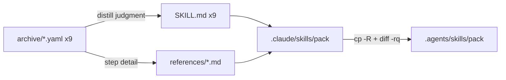

---
# Quality Chain Metadata (Alex 必填 - Phase 4 Hook 将基于此阻塞 Gate 3)
task_type: mixed      # markdown pack authoring + structural verification (no runtime code)
e2e_required: no      # format migration, no runtime behavior to e2e
research_required: no # format migration from existing archived sources, not new research

# Production directories that must have ≥1 git-tracked file at Gate 3
git_tracked_dirs: [".claude/skills", ".agents/skills"]

skip_knowledge_assessment: no  # 9-pack migration, real findings likely

gate4_delta: []

# Surplus provenance
epic: EPHEMERAL-surplus-deprecate-domain-pack-yaml
phase: migrate-9-yaml-packs
authorization: "surplus auto-execution 2026-07-05"
---

# Handoff Document for Agent B (Blake)
## TAD v3.1 - Evidence-Based Development

**From:** Alex (Agent A - Solution Lead)
**To:** Blake (Agent B - Execution Master)
**Date:** 2026-07-05
**Project:** TAD Framework
**Task ID:** TASK-20260705-001
**Handoff Version:** 3.1.0
**Epic:** EPHEMERAL-surplus-deprecate-domain-pack-yaml.md (Phase 1/1 — migrate-9-yaml-packs)
**Supersedes:** N/A

---

## 🔴 Gate 2: Design Completeness (Alex必填)

**执行时间**: 2026-07-05 (YOLO Epic mode)

### Gate 2 检查结果

| 检查项 | 状态 | 说明 |
|--------|------|------|
| Architecture Complete | ✅ | Migration pipeline fully specified: archived YAML → distilled SKILL.md + references/ → .agents mirror → CHANGELOG/README-retired documentation |
| Components Specified | ✅ | All 9 source YAMLs verified on disk (9 files, 7,132 lines); target pack format grounded against live precedent (ai-voice-production: 125-line SKILL.md + references/) |
| Functions Verified | ✅ | No code functions called — verification uses standard tools only (diff, grep, ls, git, wc), all confirmed working in this environment during grounding |
| Data Flow Mapped | ✅ | YAML capability/steps → SKILL.md judgment rules + references/ depth files mapped in §MQ3; .claude/skills is source of truth, .agents/skills is mirror |

**Gate 2 结果**: ✅ PASS

**Alex确认**: 我已验证所有设计要素，Blake可以独立根据本文档完成实现。

> Note: expert review of this handoff is executed by the Conductor per the YOLO Epic
> workflow (see §9.2) — not by Alex spawning reviewers inside this design step.

---

## 📋 Handoff Checklist (Blake必读)

Blake在开始实现前，请确认：
- [ ] 阅读了所有章节
- [ ] **阅读了「📚 Project Knowledge」章节中的历史经验**
- [ ] 所有"强制问题回答（MQ）"都有证据
- [ ] 理解了真正意图（不只是字面需求）
- [ ] 每个Phase的交付物和证据要求都清楚
- [ ] 确认可以独立使用本文档完成实现

❌ 如果任何部分不清楚，**立即返回Alex要求澄清**，不要开始实现。

---

## 1. Task Overview

### 1.1 What We're Building

Convert the 9 remaining archived Domain Pack YAMLs into Capability Pack format:

| # | Source YAML (`.tad/archive/domains/2026-06-11-domain-pack-retirement/`) | Lines | Target pack |
|---|--------------------------------------------------------------------------|-------|-------------|
| 1 | hw-circuit-design.yaml | 917 | `.claude/skills/hw-circuit-design/` |
| 2 | hw-enclosure.yaml | 880 | `.claude/skills/hw-enclosure/` |
| 3 | hw-firmware.yaml | 1,150 | `.claude/skills/hw-firmware/` |
| 4 | hw-testing.yaml | 1,088 | `.claude/skills/hw-testing/` |
| 5 | mobile-development.yaml | 572 | `.claude/skills/mobile-development/` |
| 6 | mobile-release.yaml | 607 | `.claude/skills/mobile-release/` |
| 7 | mobile-testing.yaml | 564 | `.claude/skills/mobile-testing/` |
| 8 | mobile-ui-design.yaml | 710 | `.claude/skills/mobile-ui-design/` |
| 9 | supply-chain-security.yaml | 644 | `.claude/skills/supply-chain-security/` |

Total source: 7,132 YAML lines. Each pack = distilled `SKILL.md` (judgment rules) +
`references/` (depth content), mirrored 1:1 to `.agents/skills/{pack}/` for Codex parity.
Plus: CHANGELOG entry recording full YAML mechanism retirement (incl. domain-router hook
decommission confirmation) and an update to `.tad/domains/README-retired.md`.

**⚠️ Ground-truth corrections vs the original idea text** (verified on disk 2026-07-05):
- Source YAMLs are NOT in `.tad/domains/` — that dir was retired 2026-06-11 and contains
  ONLY `README-retired.md`. Sources live in the archive path above.
- Do NOT delete the archived YAMLs — they are the audit trail; the "deletion" half of the
  idea already happened in the 2026-06-11 retirement.
- Pack format is a DIRECTORY (`.claude/skills/{pack}/SKILL.md` + `references/`), not a flat
  `.claude/skills/{pack}.md` file.
- No `domain-router` hook exists in `.tad/hooks/` — decommission is verify + document,
  not code removal.

### 1.2 Why We're Building It

**业务价值**：Finish the Domain Pack YAML retirement started 2026-06-11
(EPIC-20260611-pack-system-unification). Today the hw/mobile/supply-chain knowledge is
locked in archived YAML nobody loads — 7,132 lines of authored content invisible to agents.
**用户受益**：Any future hw/mobile/supply-chain task gets working Capability Packs instead
of a "migrate on demand" IOU.
**成功的样子**：当一个 mobile 或 hardware 任务到来时，agent 能直接加载
`.claude/skills/mobile-development/SKILL.md` 得到判断规则，而不是去翻 archive 里的 YAML。

### 1.3 🆕 Intent Statement（意图声明）

**真正要解决的问题**：格式迁移 —— 把已归档的 YAML 内容转成活的 SKILL.md Capability Pack
格式，让机制退役闭环（archive 留审计线，活格式承载内容）。

**不是要做的（避免误解）**：
- ❌ 不是内容质量升级 —— 不做新研究、不做 pack-upgrade dual-layer bar、不做 behavioral eval（那是未来 pack-upgrade pass 的事）
- ❌ 不是删除归档 YAML —— 9 个源文件是审计线，一个字节都不能动
- ❌ 不是把 YAML 原样 dump 进 SKILL.md —— SKILL.md 必须是蒸馏后的判断规则，YAML 的 step 流程细节放 references/
- ❌ 不是改动现有 24 个 active pack

**Blake请确认理解**：
```
在开始实现前，请用你自己的话回答：
1. 这个功能解决什么问题？（归档 YAML 内容迁入活的 pack 格式，退役闭环）
2. 用户会如何使用？（未来 hw/mobile/supply-chain 任务直接加载对应 pack）
3. 成功的标准是什么？（9 pack 双目录齐全 + 镜像一致 + archive 未动 + CHANGELOG/README 记录）

只有Human确认你的理解正确后，才能开始实现。（YOLO 模式下由 Conductor gate 代行确认。）
```

---

## 📚 Project Knowledge（Blake 必读）

**⚠️ MANDATORY READ — Blake 在开始实现前，必须执行以下 Read 操作：**
1. Read `.tad/project-knowledge/principles.md`（尤其下列摘录的 3 条）
2. Read `.tad/project-knowledge/patterns/_index.md`，按关键词加载 `pack-build-rules.md`、`shell-portability.md`、`ac-verification.md`
3. Read the "⚠️ Blake 必须注意的历史教训" entries below

### 步骤 1：识别相关类别

本次任务涉及的领域：
- [x] architecture - pack 格式架构（SKILL.md + references/ 双目录镜像）
- [x] code-quality - 蒸馏 vs dump 的判断边界
- [x] testing - AC 结构化验证（diff -rq / grep / git status）
- [ ] security / ux / performance / api-integration / mobile-platform — 不适用（内容迁移，不写运行时代码）

### 步骤 2：历史经验摘录

**已读取的 project-knowledge 文件**：

| 文件 | 相关记录数 | 关键提醒 |
|------|-----------|----------|
| principles.md | 3 条直接相关 | 见下方教训 1-3 |
| patterns/pack-build-rules.md | 相关 | Pack architecture, YAML frontmatter, SKILL.md install 规范 |
| patterns/shell-portability.md | 相关 | macOS/BSD grep/diff 兼容；路径含空格必须加引号 |
| patterns/ac-verification.md | 相关 | AC 命令 dry-run 纪律、grep -c 陷阱 |
| testing.md | 0 条 | 无相关历史记录 |

**⚠️ Blake 必须注意的历史教训**：

1. **Deny-List / diff -r is the Universal Omission Catcher** (来自 principles.md 2026-06-01)
   - 问题：按 pattern 枚举复制（allow-list / glob）会静默漏文件；presence check 抓不到 partial copy
   - 解决方案：镜像验证必须用 `diff -rq source target`（本 handoff AC4 即此），不要用"目录存在+非空"充数

2. **Judgment-Only Skill Files: Constraint Rules Are NOT Mechanical** (来自 principles.md 2026-04-04, SAFETY)
   - 问题：v2.7 精简时把约束规则和机械逻辑一起删了 → 质量链失效
   - 解决方案：蒸馏 YAML 时，MUST/决策规则类内容保留进 SKILL.md 正文；只有流程步骤细节下沉 references/

3. **Execution Discipline Content Must Stay in SKILL Body — Circular Trigger Test** (来自 principles.md 2026-06-09, SAFETY)
   - 问题：内容抽到 references/ 后，如果触发词只在 reference 内部定义，加载永远不会发生
   - 解决方案：SKILL.md 正文必须自含"什么时候去读哪个 reference"的非循环触发描述（参照 ai-voice-production 的 body → references 指针写法）

（其余类别：✅ 已检查，无相关历史记录）

### Blake 确认

- [ ] 我已阅读上述历史经验
- [ ] 我理解需要避免的问题
- [ ] 如遇到类似情况，我会参考上述解决方案

---

## 2. Background Context

### 2.1 Previous Work

- **EPIC-20260611-pack-system-unification** retired the YAML Domain Pack runtime mechanism;
  live `.tad/domains/` now contains ONLY `README-retired.md` (verified 2026-07-05).
- 24 active Capability Packs already exist in `.claude/skills/` with `.agents/skills/` mirrors.
  Verified precedent: `ai-voice-production/` = `SKILL.md` (125 lines) + `references/` (7 files)
  + `examples/` + `scripts/`; `diff -rq` against its `.agents` mirror → identical.
- T2 archive references exist at `.tad/skill-library/tad--hw-domain-archive.md` and
  `tad--supply-chain-security-archive.md` (verified present) — leave them unchanged.

### 2.2 Current State

- Source: 9 YAMLs at `.tad/archive/domains/2026-06-11-domain-pack-retirement/` (9 files,
  7,132 lines, verified). YAML structure: `domain/version/description` header + `capabilities:`
  map; each capability = `steps:` list with `action` prose, `tool_ref`, `output_file`.
- No `domain-router` hook exists in `.tad/hooks/` (verified: `ls .tad/hooks/ | grep -ci
  'domain-router'` → 0). Decommission is verify-and-document only.
- Target dirs `.claude/skills/{9 packs}/` and `.agents/skills/{9 packs}/` do NOT exist yet.
- ⚠️ Grounding note: the Epic's planned grounding file
  `.tad/evidence/yolo/surplus-deprecate-domain-pack-yaml/phase1-grounding.md` does NOT exist
  on disk. All ground truth in this handoff was re-derived live from the repo on 2026-07-05
  (commands + outputs in §7.3, §MQ1, and §9.1 Verified Output column).

### 2.3 Dependencies

- None external. Pure local file authoring + standard CLI tools (ls, grep, diff, git, wc).
- Repo paths contain spaces (`01-on progress programs`) — always quote paths in commands.

---

## 3. Requirements

### 3.1 Functional Requirements

- FR1: Each of the 9 archived YAMLs becomes a Capability Pack at `.claude/skills/{pack}/`
  with `SKILL.md` + `references/` (≥1 depth file per pack).
- FR2: Each `SKILL.md` has YAML frontmatter matching existing pack convention:
  `name`, `description` (usage-trigger sentence included), `version: 0.1.0`,
  `type: reference-based`, `keywords` (bilingual list, per ai-voice-production precedent).
- FR3: `SKILL.md` body = distilled judgment rules (decision rules, selection criteria,
  MUST/anti-pattern constraints) + non-circular pointers to `references/` files.
  NOT a YAML dump: no `tool_ref:`/`output_file:`/`requires_registry:` machinery keys in SKILL.md.
  Every rule traces to source-YAML content (no invented specifics — flag anything uncertain
  rather than asserting it).
- FR4: YAML step-level workflow detail (per-capability procedures, commands, checklists)
  lands in `references/{capability-or-topic}.md` files — content preserved, not discarded.
- FR5: All 9 packs mirrored to `.agents/skills/{pack}/`, byte-identical (`diff -rq` clean).
- FR6: CHANGELOG.md gets a new top entry (new version heading following existing Keep a
  Changelog style) recording: 9 packs migrated (list them), YAML Domain Pack mechanism fully
  retired, domain-router hook confirmed decommissioned (never present in `.tad/hooks/`).
- FR7: `.tad/domains/README-retired.md` "Migrate on demand" note updated to state the
  migration is DONE and point at the 9 new pack paths.
- FR8: The 9 archived source YAMLs remain byte-untouched (audit trail).

### 3.2 Non-Functional Requirements

- NFR1: SKILL.md size discipline — each body ≤ 250 lines (precedent packs run ~125;
  distillation, not dump; 7,132 source lines must NOT reappear as 9 giant SKILL.md files).
- NFR2: Zero changes to the 24 existing active packs, `.tad/hooks/`, `.tad/skill-library/`,
  or `alex`/`blake`/`gate` skills.
- NFR3: macOS/BSD-portable verification commands (no GNU-only flags).

### 3.3 Optimization Target

N/A — no numeric optimization goal.

---

## 4. Technical Design

### 4.1 Architecture Overview

Per-pack conversion pipeline (repeat ×9):

```
archived YAML ──read──▶ classify content ──▶ SKILL.md  (frontmatter + judgment rules
   (unchanged)            │                              + reference pointers)
                          └───────────────▶ references/*.md (per-capability depth:
                                             procedures, commands, checklists)
then: cp -R .claude/skills/{pack} .agents/skills/{pack}   (mirror, after content final)
then: diff -rq both trees per pack                        (verify)
finally: CHANGELOG + README-retired.md documentation pass
```

Content classification rule (from principles.md SAFETY entries):
- **Selection/decision logic** in YAML `action` prose (e.g., mobile-development
  `select_framework`: Expo vs RN CLI vs Swift criteria) → SKILL.md body judgment rules.
- **Procedural step detail** (scaffold commands, verify checklists, optimize steps) →
  `references/{capability}.md`, one file per capability or per coherent topic group.
- **Constraint rules** (MUST/never/anti-patterns embedded in actions) → SKILL.md body,
  never reference-only.
- **`anti_patterns` blocks**（design-review P0 修复 — 每 YAML 每 capability 都有，SAFETY 约束类）→
  SKILL.md body（照 ai-voice-production L111-125 的 `## Anti-Patterns` MUST-table 形态），绝不
  reference-only、绝不丢弃。**每条条目必须原样保留 ❌ 标记**（round-2 P0-1 修复：❌ 是 AC13
  同单位存活计数的锚点——源侧每个 ❌ 恰好是一条 anti-pattern 条目，块外 0 个，2026-07-06 已验证；
  丢标记 = AC13 判 LOST）。per-pack 条目数：hw-circuit=45 hw-enclosure=39 hw-firmware=49
  hw-testing=41 mobile-dev=31 mobile-release=25 mobile-testing=28 mobile-ui=33 supply-chain=15。
- **`quality_criteria` blocks** → SKILL.md body 判断规则，或 `references/quality-criteria.md`
  但 pass/fail 规则必须 body 可达（body 内有明确 pointer + 触发条件）。
- **`reviewers` / `persona` + checklist blocks** → `references/review-checklist.md`（或 body §Review），
  对齐 Domain Pack Design Model（tools + workflow + standards + persona+checklist review）。
- Every references/ file must be reachable from a SKILL.md pointer whose trigger is stated
  in the body (non-circular trigger test).

### 4.2 Component Specifications

Per pack directory:

```
.claude/skills/{pack}/
├── SKILL.md            # frontmatter + distilled judgment (≤250 lines)
└── references/
    ├── {capability-1}.md   # e.g., project-scaffold.md
    └── ...                 # ≥1 file; typically 4-8 (one per YAML capability)
```

`.agents/skills/{pack}/` = exact copy. No `scripts/`/`examples/` required for this
migration (source YAMLs ship no executable scripts; add only if a YAML embeds one).

### 4.3 Data Models

SKILL.md frontmatter schema (grounded against ai-voice-production head):

```yaml
---
name: {pack}
description: "{domain} capability pack. Covers {top capabilities}. Use for any {trigger tasks}."
version: 0.1.0
type: reference-based
keywords: ["english term", "中文词", ...]
---
```

### 4.4 API Specifications

N/A — no APIs.

### 4.5 User Interface Requirements

N/A — no UI.

---

## 5. 🆕 强制问题回答（Evidence Required）

### MQ1: 历史代码搜索

**回答**：
- [x] 是 — Epic 引用"之前的" retirement 工作（EPIC-20260611）与既有 pack 格式

#### 搜索证据
```bash
# 搜索命令与结果（Alex 于 2026-07-05 实际运行，repo root）
ls .tad/domains/
# → README-retired.md            (live mechanism dead, confirmed)
ls .tad/archive/domains/2026-06-11-domain-pack-retirement/*.yaml | wc -l
# → 9                            (all sources present)
wc -l .tad/archive/domains/2026-06-11-domain-pack-retirement/*.yaml | tail -1
# → 7132 total
ls .tad/hooks/ | grep -ci 'domain-router'
# → 0 (grep exit 1)              (hook never present — decommission = document-only)
diff -rq .claude/skills/ai-voice-production .agents/skills/ai-voice-production
# → (empty)                      (mirror precedent confirmed identical)
```

#### 决策说明
- **找到了什么**：既有 Capability Pack 格式（SKILL.md + references/ 双目录镜像）已经过 24 pack 验证
- **位置**：`.claude/skills/ai-voice-production/SKILL.md`（格式样板，125 行）
- **决定**：✅ 复用既有 pack 格式与镜像机制，不发明新格式
- **原因**：24 个 active pack 均遵循此结构；`diff -rq` 镜像校验已是本 repo 既定验收手段

**Human验证点**：搜索输出已内嵌；决策 = 复用，理由成立。

### MQ2: 函数存在性验证

**回答**：本任务不调用任何项目代码函数（纯 markdown 内容迁移）。使用的 CLI 工具清单：

| 工具 | 用途 | 位置 | 验证 |
|------|------|------|------|
| ls / wc / grep / diff / git / cp | grounding + AC 验证 + 镜像 | 系统 PATH | ✅ 全部在 grounding 阶段实际运行成功（见 MQ1 输出） |

**Human验证点**：无项目函数依赖；工具均已实跑验证。

### MQ3: 数据流完整性

#### 数据流对照表

| 源（YAML 段） | 用途说明 | 目标产物 | 是否迁移 | 说明 |
|---------|---------|---------|---------|-----------|
| header (domain/version/description) | pack 身份 | SKILL.md frontmatter | ✅ | version 重置为 0.1.0（新格式初版） |
| capabilities.*.steps action 中的决策规则 | 判断力 | SKILL.md body | ✅ | 蒸馏为 judgment rules |
| capabilities.*.steps 流程细节/命令 | 深度内容 | references/*.md | ✅ | 每 capability 一个文件（或合理归组） |
| tool_ref / output_file / requires_registry 机制字段 | 已死的 YAML runtime 机制 | 不迁移 | ❌ | 机制已退役，无消费者；内容性信息（如工具名）并入 prose |
| 源 YAML 文件本体 | 审计线 | 原地保留 | ✅ 不动 | AC6 验证 git 无改动 |

#### 数据流图



**Human验证点**：唯一"❌ 不迁移"的是死机制字段，理由：runtime 已退役、无消费者。

### MQ4: 视觉层级

**回答**：
- [x] 无不同状态 → 跳过（无 UI）

### MQ5: 状态同步

#### 状态存储位置

| 数据 | 存储位置1 | 存储位置2 | 同步时机 | 同步方向 |
|------|----------|----------|---------|---------|
| 9 个 pack 内容 | `.claude/skills/{pack}/`（主状态，Source of Truth） | `.agents/skills/{pack}/`（镜像） | Phase C：9 pack 内容全部定稿后一次性 `cp -R` | 单向 .claude → .agents |

#### 状态流图

```
[YAML 蒸馏] → .claude/skills/{pack}/ (主状态，Source of Truth)
              ↓ 同步时机：Phase C 一次性镜像 + diff -rq 校验
           .agents/skills/{pack}/ (镜像)
```

**Human验证点**：主状态明确；同步时机 = 内容定稿后一次；镜像后再改 .claude 侧会漂移 →
规则：镜像必须是最后一个内容改动之后执行，AC4 `diff -rq` 在 Gate 3 兜底。
另注意：若 post-write-sync hook 自动镜像 `.claude/skills/` 写入，AC4 仍必须用
`diff -rq` 实测 —— presence-only 检查抓不到 partial copy（principles.md 2026-06-01）。

---

## 6. Implementation Steps（分Phase）

## 6.1 Micro-Tasks

| # | File | Operation | Verification Command | Est. Time |
|---|------|-----------|---------------------|-----------|
| 1 | `.claude/skills/hw-circuit-design/` | Convert hw-circuit-design.yaml → SKILL.md + references/ | `test -f .claude/skills/hw-circuit-design/SKILL.md && ls .claude/skills/hw-circuit-design/references/*.md` | 15-25 min |
| 2 | `.claude/skills/hw-enclosure/` | Convert hw-enclosure.yaml | same pattern as #1 | 15-25 min |
| 3 | `.claude/skills/hw-firmware/` | Convert hw-firmware.yaml | same pattern | 15-25 min |
| 4 | `.claude/skills/hw-testing/` | Convert hw-testing.yaml | same pattern | 15-25 min |
| 5 | `.claude/skills/mobile-development/` | Convert mobile-development.yaml | same pattern | 15-25 min |
| 6 | `.claude/skills/mobile-release/` | Convert mobile-release.yaml | same pattern | 15-25 min |
| 7 | `.claude/skills/mobile-testing/` | Convert mobile-testing.yaml | same pattern | 15-25 min |
| 8 | `.claude/skills/mobile-ui-design/` | Convert mobile-ui-design.yaml | same pattern | 15-25 min |
| 9 | `.claude/skills/supply-chain-security/` | Convert supply-chain-security.yaml | same pattern | 15-25 min |
| 10 | `.agents/skills/{9 packs}/` | Mirror all 9 via `cp -R` | AC4 diff loop (§9.1) | 5 min |
| 11 | `CHANGELOG.md` | Add migration + retirement entry | AC7 grep (§9.1) | 5 min |
| 12 | `.tad/domains/README-retired.md` | Update migrate-on-demand note → done, point at packs | AC8 grep (§9.1) | 5 min |
| 13 | (verification) | Run full AC suite, capture raw outputs | §9.1 all rows | 10 min |

### Micro-Task Rules
- 每个 pack 转换 = 一个 micro-task：Read 完整源 YAML（勿只读 head）→ 分类（判断规则 vs
  流程细节，按 §4.1）→ 写 SKILL.md → 写 references/
- 蒸馏纪律：决策/约束规则进 body；步骤细节进 references/；机制字段（tool_ref 等）丢弃
- 镜像（task 10）必须在 task 1-9 全部内容定稿之后执行

**🆕 Phase划分原则**：packs 彼此独立 —— sub-agents 可并行（hw ×4 / mobile ×4 /
supply-chain ×1），但每个产出必须逐包过 AC1/AC2/AC3/AC5。

### Phase A: hw 四包转换（预计 1-1.5 小时）

#### 交付物
- [ ] micro-tasks 1-4：4 个 hw pack（SKILL.md + references/）

#### 实施步骤
1. Read 格式样板：`.claude/skills/ai-voice-production/SKILL.md` + references/
2. Read 源 YAML 全文（capability 数量与判断规则分布因包而异）
3. 按 §4.1 分类规则写 SKILL.md（frontmatter 按 §4.3 schema，keywords 双语）
4. 每个 capability 的流程细节写成 `references/{capability}.md`
5. SKILL.md body 中为每个 reference 写非循环触发指针（"When doing X, read references/y.md"）

#### 验证方法
- 每包完成后跑：`test -f SKILL.md`、references/ ≥1 文件、SKILL.md ≤250 行、无 `tool_ref:` 残留

#### 🆕 Phase A 完成证据（Blake必须提供）
- [ ] 4 pack 的目录树输出（`ls -R`）
- [ ] 4 个 SKILL.md 的行数（`wc -l`）

**Human决策**：YOLO 模式下由 Conductor 代行 → 继续 Phase B。

### Phase B: mobile 四包 + supply-chain-security 转换（预计 1-1.5 小时）

同 Phase A 结构，micro-tasks 5-9。

#### 🆕 Phase B 完成证据
- [ ] 5 pack 目录树 + SKILL.md 行数

### Phase C: 镜像 + 文档 + 全量验证（预计 0.5 小时）

#### 交付物
- [ ] micro-task 10：`.agents/skills/` 9 pack 镜像
- [ ] micro-task 11：CHANGELOG 条目
- [ ] micro-task 12：README-retired.md 更新
- [ ] micro-task 13：§9.1 全 AC 运行输出

#### 🆕 Phase C 完成证据
- [ ] `diff -rq` 9 pack 循环完整输出（全空 = PASS）
- [ ] `git status --porcelain .tad/archive/domains/` 输出（空 = archive 未动）
- [ ] CHANGELOG diff 片段

**Human决策**：YOLO 模式下由 Conductor impl-review + Gate 3/4 代行。

---

## 7. File Structure

### 7.1 Files to Create

```
.claude/skills/hw-circuit-design/SKILL.md          # + references/*.md
.claude/skills/hw-enclosure/SKILL.md               # + references/*.md
.claude/skills/hw-firmware/SKILL.md                # + references/*.md
.claude/skills/hw-testing/SKILL.md                 # + references/*.md
.claude/skills/mobile-development/SKILL.md         # + references/*.md
.claude/skills/mobile-release/SKILL.md             # + references/*.md
.claude/skills/mobile-testing/SKILL.md             # + references/*.md
.claude/skills/mobile-ui-design/SKILL.md           # + references/*.md
.claude/skills/supply-chain-security/SKILL.md      # + references/*.md
.agents/skills/{same 9 packs}/                     # byte-identical mirrors
```

### 7.2 Files to Modify

```
CHANGELOG.md                        # new top entry: 9 packs migrated, mechanism retired
.tad/domains/README-retired.md      # migrate-on-demand note → done, point at new packs
```

### 7.3 Grounded Against (Phase 2 P2.2 — Alex step1c, 2026-04-24)

**Grounded Against** (Alex 实际 Read 过的源文件, 2026-07-05):

- `.tad/active/epics/EPHEMERAL-surplus-deprecate-domain-pack-yaml.md` — full read
- `.tad/domains/README-retired.md` — full read (11 lines)
- `.tad/archive/domains/2026-06-11-domain-pack-retirement/mobile-development.yaml` — head 60 lines (YAML structure sample: capabilities/steps/action/tool_ref/output_file)
- `.tad/archive/domains/2026-06-11-domain-pack-retirement/` — full `ls -la` + per-file `wc -l` (9 YAMLs, 7,132 lines total)
- `.claude/skills/ai-voice-production/SKILL.md` — head 12 lines (frontmatter schema precedent) + `wc -l` (125)
- `.claude/skills/ai-voice-production/references/` — `ls` (7 depth files)
- `.agents/skills/ai-voice-production/` — `diff -rq` vs .claude twin → identical (mirror precedent)
- `CHANGELOG.md` — head 20 + `## ` heading scan (Keep a Changelog style, `## [x.y.z] - date`)
- `.tad/templates/handoff-a-to-b.md` — full read
- `.claude/skills/hw-circuit-design/SKILL.md` — (new — will be created); same for the other 8 packs and all `.agents` mirrors
- ⚠️ `.tad/evidence/yolo/surplus-deprecate-domain-pack-yaml/phase1-grounding.md` — DOES NOT EXIST; ground truth re-derived live instead (outputs embedded in §MQ1 / §9.1)

---

## 8. Testing Requirements

### 8.1 Unit Tests

N/A（无运行时代码）。结构化验证代替：§9.1 AC 全表。

### 8.2 Integration Tests

- 镜像一致性：`diff -rq` 9 pack 双目录循环（AC4）
- Archive 完整性：`git status --porcelain .tad/archive/domains/`（AC6）
- Scope 完整性：git status 全量对照 §7 声明范围（AC11/AC12）

### 8.3 Edge Cases

- 源 YAML 含 CJK 描述文本 → SKILL.md keywords 保持双语（precedent 如此）
- 路径含空格（repo 根路径）→ 所有命令引号包裹路径（shell-portability pattern）
- 某 YAML capability 极短 → 允许多 capability 合并进一个 reference 文件，但 SKILL.md
  指针必须仍覆盖其判断规则

## 8.4 Friction Preflight

| Friction Point | Required Step | Expected Fix Path | Allowed Substitute | Gate Impact |
|----------------|---------------|-------------------|--------------------|-------------|
| Grounding file missing（phase1-grounding.md 不存在） | Ground truth 输入 | 本 handoff 已内嵌 live re-derivation（§7.3/§MQ1/§9.1） | 无需替代 —— 证据在文内 | 无阻塞；Gate 3 复核 §9.1 即可 |
| 7,132 行源内容在长 session 中的 context 压力 | 逐包 Read 完整 YAML | 每包独立处理，处理完即写盘再进下一包；必要时分 session per Post-Compact Recovery | sub-agent 并行转换（每 sub-agent 1-4 包） | 漏读源内容 → SKILL.md 空洞 → Gate 3 FAIL |
| Post-write-sync hook 可能自动镜像 .claude/skills 写入 | 镜像步骤（task 10） | 无论 hook 是否触发，AC4 都用 `diff -rq` 实测 | — | partial mirror 未被 diff 抓到 → Gate 3 FAIL |

其余：No further friction-sensitive prerequisites identified.

## 8.5 Feedback Collection (Non-Code Artifacts)

```yaml
feedback_required: false
artifact_type: generic
notes: "Format migration; content-quality human feedback deferred to future pack-upgrade pass per Epic Out-of-Scope."
```

## 8.6 🆕 Test Evidence Required

Blake必须提供：
- [ ] §9.1 每行 post-impl AC 的实际命令输出（贴入 Verified Output 列）
- [ ] `diff -rq` 镜像循环完整输出
- [ ] `git status --porcelain .tad/archive/domains/` 输出（必须为空）

---

## 9. Acceptance Criteria

Blake的实现被认为完成，当且仅当：
- [ ] FR1-FR8 全部实现并有 §9.1 命令级证据
- [ ] Phase A/B/C 证据齐全
- [ ] 9 pack 镜像 `diff -rq` 全空
- [ ] 归档 YAML 零改动（git 证据）
- [ ] CHANGELOG + README-retired.md 更新落盘
- [ ] Conductor Gate 3 / Gate 4 PASS（YOLO 模式代行 Human 验证）

---

## 9.1 Spec Compliance Checklist ⚠️ PRIMARY VERIFICATION SOURCE — Gate 3 executes each row

> 运行目录：repo root（`/Users/sheldonzhao/01-on progress programs/TAD`）。
> `PACKS="hw-circuit-design hw-enclosure hw-firmware hw-testing mobile-development mobile-release mobile-testing mobile-ui-design supply-chain-security"`
> ⚠️ Pipe-escape note：表内 `\|` 为 markdown 渲染转义；bash 执行时还原为 `|`。

| # | Acceptance Criterion | Verification Type | Verification Method | Expected Evidence | Verified Output (Alex step1d) |
|---|---------------------|-------------------|--------------------|--------------------|-------------------------------|
| 1 | 9 pack 均有非空 SKILL.md（.claude 侧） | post-impl-verifiable | `for p in $PACKS; do test -s ".claude/skills/$p/SKILL.md" \|\| echo "MISSING $p"; done` | 无输出（0 missing） | (post-impl) |
| 2 | 每 pack references/ ≥1 个 .md 深度文件 | post-impl-verifiable | `for p in $PACKS; do n=$(ls ".claude/skills/$p/references/"*.md 2>/dev/null \| wc -l); [ "$n" -ge 1 ] \|\| echo "EMPTY $p"; done` | 无输出 | (post-impl) |
| 3 | frontmatter 齐全（name/description/version/type/keywords，首行 `---`） | post-impl-verifiable | `for p in $PACKS; do f=".claude/skills/$p/SKILL.md"; head -1 "$f" \| grep -q '^---$' \|\| echo "NOFM $p"; for k in name description version type keywords; do grep -q "^$k:" "$f" \|\| echo "NOKEY $p $k"; done; done` | 无输出 | (post-impl) |
| 4 | .agents 镜像 byte-identical ×9 | post-impl-verifiable | `for p in $PACKS; do diff -rq ".claude/skills/$p" ".agents/skills/$p" \|\| echo "FAIL $p"; done` | 无输出（全部 identical） | (post-impl) |
| 5 | SKILL.md 是蒸馏非 dump：≤250 行且无 YAML 机制键残留 | post-impl-verifiable | `for p in $PACKS; do f=".claude/skills/$p/SKILL.md"; [ "$(grep -c '' "$f")" -le 250 ] \|\| echo "TOOLONG $p"; grep -lE 'tool_ref:\|output_file:\|requires_registry:' "$f"; done` | 无输出 | (post-impl) |
| 6 | 归档源 YAML 零改动 | post-impl-verifiable | `git status --porcelain .tad/archive/domains/ \| wc -l` | `0` | (post-impl) — pre-impl baseline dry-run 2026-07-05: `0` |
| 7 | CHANGELOG 记录迁移 + 机制退役 + domain-router 结论（判别性：design-review P0-1 修复，锚定 baseline 增量 + 最新版本段） | post-impl-verifiable | `grep -c 'domain-router' CHANGELOG.md`（baseline=3，dry-run 2026-07-05，须 ≥4）；`awk '/^## /{n++} n==1' CHANGELOG.md \| grep -ci 'retir'`（baseline=0，须 ≥1，即最新版本段必须含 retirement 记录） | ≥4 ; ≥1 | (post-impl) |
| 8 | README-retired.md 指向新 pack + 迁移完成声明（判别性：design-review P0-2 修复，两个锚点 baseline 均为 0） | post-impl-verifiable | `grep -c 'skills/mobile-development' .tad/domains/README-retired.md`（baseline=0，须 ≥1）；`grep -ciE 'migration complete\|migrated \(all\|migrate-on-demand.*(done\|complete)' .tad/domains/README-retired.md`（baseline=0，须 ≥1） | ≥1 ; ≥1 | (post-impl) |
| 9 | domain-router hook 不存在（decommission 事实确认） | pre-impl-verifiable | `ls .tad/hooks/ \| grep -ci 'domain-router'` | `0` | `0`（grep exit 1，dry-run 2026-07-05） |
| 10 | 源 YAML 计数与规模基线 | pre-impl-verifiable | `ls .tad/archive/domains/2026-06-11-domain-pack-retirement/*.yaml \| wc -l` | `9` | `9`（dry-run 2026-07-05；`wc -l` 合计 `7132 total`） |
| 11 | 未触碰 24 个既有 active pack 与 hooks | post-impl-verifiable | `git status --porcelain .claude/skills/ .agents/skills/ .tad/hooks/ \| grep -vE 'skills/(hw-\|mobile-\|supply-chain-security)'` | 无输出（改动仅限 9 个新 pack 路径） | (post-impl) |
| 12 | 全部改动落在 §7 声明范围内 | post-impl-verifiable | `git status --porcelain \| grep -vE '\.claude/skills/(hw-\|mobile-\|supply)\|\.agents/skills/(hw-\|mobile-\|supply)\|CHANGELOG\.md\|\.tad/domains/README-retired\.md\|\.tad/active/\|\.tad/evidence/'` | 无输出（handoff/evidence 簿记路径已豁免） | (post-impl) |
| 13 | anti_patterns 约束存活（round-2 design-review P0-1 修复：同单位 ITEM-to-ITEM 比较 — per-pack 检查，非全局 floor） | post-impl-verifiable | 迁移规则（§4.1）：每条 anti-pattern 条目必须**原样保留 ❌ 标记**写进 SKILL body 的 `## Anti-Patterns` 段。验证：`for p in $PACKS; do y=".tad/archive/domains/2026-06-11-domain-pack-retirement/$p.yaml"; src=$(grep -c '❌' "$y"); got=$(sed -n '/## Anti-Patterns/,/^## /p' ".claude/skills/$p/SKILL.md" \| grep -c '❌'); [ "$got" -ge "$src" ] \|\| echo "LOST $p src=$src got=$got"; done` | 无输出。单位一致性已验证（2026-07-06 dry-run）：每个 ❌ 都是一条 anti_patterns 条目、块外 0 个 ❌；per-pack baseline：hw-circuit=45 hw-enclosure=39 hw-firmware=49 hw-testing=41 mobile-dev=31 mobile-release=25 mobile-testing=28 mobile-ui=33 supply-chain=15 | (post-impl) |

---

## 9.2 Expert Review Status (Alex 必填)

### Audit Trail

| Reviewer | Issue | Resolution Section | Status |
|----------|-------|-------------------|--------|
| (pending Conductor) | Expert review is executed by the Conductor in the YOLO Epic workflow's review step, per this phase's design constraints ("Do NOT do expert review — Conductor handles that") | Conductor review step will append rows here | Open |

**Status legend:**
- **Resolved** — fix applied in this handoff; Resolution Section points to the fix
- **Open** — not yet addressed; known gap
- **Deferred** — consciously deferred; rationale cited

### Experts Selected

由 Conductor 在 review 步骤选定（建议：code-reviewer + 一名 content/architecture lens，
聚焦 §4.1 分类规则的可执行性与 §9.1 AC 命令的正确性）。

### Overall Assessment (post-integration)

- Pending Conductor review step（YOLO mode）。

---

## 10. Important Notes

### 10.1 Critical Warnings

- ⚠️ **归档 YAML 是审计线** —— 只读。任何对 `.tad/archive/domains/` 的写操作都是 P0 违规（AC6 兜底）。
- ⚠️ **蒸馏不是删减约束** —— YAML action 里的 MUST/never/决策规则必须存活在 SKILL.md body（principles.md 2026-04-04 SAFETY 教训）。
- ⚠️ **镜像必须最后做** —— 先镜像后改 .claude 侧 = 漂移；AC4 会抓，但返工浪费预算。
- ⚠️ **grounding 文件缺失已知** —— 不要去找 phase1-grounding.md；本 handoff §7.3/§MQ1/§9.1 即 ground truth。
- ⚠️ **不发明事实** —— 源 YAML 内容按原样迁移（含出处感）；不确定的技术细节标注而非断言（research-before-upgrade rule）。

### 10.2 Known Constraints

- 不做新研究（research_required: no）；内容以源 YAML 为准，即使个别技术数字可能过时 —— 时效升级属未来 pack-upgrade pass。
- 不改 24 个既有 pack、不改 alex/blake/gate skills、不改 `.tad/hooks/`、不改 `.tad/skill-library/` T2 引用。
- Pack frontmatter 一律 `version: 0.1.0`（格式迁移初版）；框架 version.txt 不在本 handoff 范围（发布走 *publish 流程）。
- 完成后：标准 COMPLETION report + AC 原始输出；随后按 surplus flow 归档本 handoff 与 ephemeral Epic。

### 10.3 🆕 Sub-Agent使用建议

Blake应该考虑使用：
- [x] **parallel-coordinator / 并行 sub-agents** — 9 个 pack 转换彼此独立，可分组并行（hw ×4 / mobile ×4 / supply-chain ×1）；镜像与文档步骤保持串行收尾
- [ ] **bug-hunter** — 仅当 AC 验证意外失败时
- [ ] **test-runner** — N/A（无测试套件；AC 命令直接跑）
- [ ] **refactor-specialist** — N/A

完成后在"Sub-Agent使用记录"中说明使用情况。

---

## 11. 🆕 Learning Content（可选）

### 11.1 Decision Rationale: 一次性迁移 9 包 vs 按需逐包迁移

**选择的方案**：一次性迁移全部 9 包（本 Epic）。

**考虑的替代方案**：

| 方案 | 优点 | 缺点 | 为什么没选 |
|------|------|------|-----------|
| 一次性迁移 9 包（选中） | 退役闭环、README 的 IOU 清零、surplus 预算正好消化 | 单次工作量大 | ✅ 选中 |
| 维持 migrate-on-demand | 零成本直到需要 | IOU 已挂近一个月，hw/mobile 任务来时临时迁移拖慢正事 | 违背 surplus burn 的价值密度逻辑 |
| 迁移 + 同步做内容升级 | 一步到位 | 混入研究工作量 ×9，scope 爆炸 | Epic 明确 Out of Scope |

**权衡分析**：
核心权衡：一次性完成度 vs 单次工作量。
当前优先级：surplus 预算存在 → 完成度优先。

**💡 Human学习点**：格式迁移与内容升级分离 —— 前者是机械可验证的（diff/grep 级 AC），
后者需要研究与评测（pack-upgrade pipeline）。混在一起会让两种验收标准互相污染。

---

## 12. 🆕 Sub-Agent使用记录

Blake完成后填写：

| Sub-Agent | 是否调用 | 调用时机 | 输出摘要 | 证据链接 |
|-----------|---------|---------|---------|---------|
| parallel conversion agents | ✅/❌ | | | |
| bug-hunter | ✅/❌ | | | |
| test-runner | ✅/❌ | | | |

**Human验证点**：应该调用的都调用了吗？

---

**Handoff Created By**: Alex (Agent A)
**Date**: 2026-07-05
**Version**: 3.1.0
