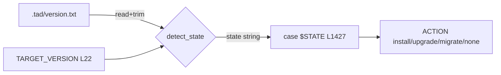

---
# Quality Chain Metadata (Alex 必填 - Phase 4 Hook 将基于此阻塞 Gate 3)
task_type: code       # code | yaml | research | e2e | mixed
e2e_required: no      # fixture IS the executable evidence; no browser/user-journey E2E applies
research_required: no

# Production directories that must have ≥1 git-tracked file at Gate 3
git_tracked_dirs: [".tad/tests"]

# Small single-file fixture task, but task_type=code → keep assessment (default)
skip_knowledge_assessment: no

gate4_delta: []
---

# Handoff Document for Agent B (Blake)
## TAD v3.1 - Evidence-Based Development

**From:** Alex (Agent A - Solution Lead)
**To:** Blake (Agent B - Execution Master)
**Date:** 2026-07-05
**Project:** TAD Framework
**Task ID:** TASK-20260705-001
**Handoff Version:** 3.1.0
**Epic:** EPHEMERAL-surplus-detect-state-glob-arm-hazard.md (Phase 1/1 — verify-and-fixture)
**Supersedes:** The 2026-07-05 express draft previously at this same path (this full-template handoff replaces it in place; the 2026-07-02 run at commit 43c6972 on a worktree branch was superseded by the `_tad_ver_cmp` refactor now live in tad.sh)

---

## 🔴 Gate 2: Design Completeness (Alex必填)

**执行时间**: 2026-07-05

### Gate 2 检查结果

| 检查项 | 状态 | 说明 |
|--------|------|------|
| Architecture Complete | ✅ | Single new fixture script; zero tad.sh changes expected (AC1 pre-verified: 0 hazard arms) |
| Components Specified | ✅ | Fixture structure, extraction method, case matrix, and assertions fully specified in §4/§6 |
| Functions Verified | ✅ | `_tad_ver_cmp` (tad.sh L1330) and `detect_state` (tad.sh L1343) read and behavior empirically simulated under bash (§5 MQ2) |
| Data Flow Mapped | ✅ | `detect_state` output strings → `case $STATE` consumer at tad.sh L1427-1464 mapped in §5 MQ3 |

**Gate 2 结果**: ✅ PASS

**Alex确认**: 我已验证所有设计要素，Blake可以独立根据本文档完成实现。
(Expert review of this handoff is executed by the YOLO Conductor — see §9.2.)

---

## 📋 Handoff Checklist (Blake必读)

Blake在开始实现前，请确认：
- [ ] 阅读了所有章节
- [ ] **阅读了「📚 Project Knowledge」章节中的历史经验**
- [ ] 所有"强制问题回答（MQ）"都有证据
- [ ] 理解了真正意图（不只是字面需求）
- [ ] 每个Phase的交付物和证据要求都清楚
- [ ] 确认可以独立使用本文档完成实现

❌ 如果任何部分不清楚，**立即返回Alex要求澄清**，不要开始实现。

---

## 1. Task Overview

### 1.1 What We're Building

A standalone bash regression fixture `.tad/tests/detect-state-fixture.sh` that exercises tad.sh's `detect_state()` against controlled `.tad/version.txt` values in isolated temp dirs and asserts the emitted state — locking in the already-fixed version-glob behavior so future edits cannot silently reintroduce the 2.x glob-arm misclassification hazard. Plus a final verification that no order-sensitive 2.x glob arms remain in `detect_state` (pre-verified: none do).

### 1.2 Why We're Building It

**业务价值**：The original surplus report found `detect_state` glob arms (`2.1*)/2.2*)`) that would misclassify 3-part versions like `2.19.x` as v2.0-era once `TARGET_VERSION` moved past them — a time-bomb that corrupts installer routing (wrong migration path → wrong upgrade action for every downstream project). The code has since been refactored to `_tad_ver_cmp` 3-part numeric comparison, but **nothing pins that behavior**.
**用户受益**：Every downstream project running `tad.sh` gets correct install/upgrade/migrate routing, permanently.
**成功的样子**：当 fixture 在仓库里存在、可一键运行、全绿，且任何未来把 `detect_state` 改回 order-sensitive glob 的编辑都会被 fixture 变红拦截时，这个功能就成功了。

### 1.3 🆕 Intent Statement（意图声明）

**真正要解决的问题**：`detect_state` 的正确行为目前只存在于代码本身，没有任何回归测试。这是"修好了但没锁住"的状态。本任务把行为锁进一个可执行 fixture。

**不是要做的（避免误解）**：
- ❌ 不是修复 `detect_state` —— 2.x glob 危险臂已经不存在了（本 handoff §5 MQ1 有 grep 证据）。除非 Blake 复核时发现 ground truth 又漂移（见 §10.1），否则 **tad.sh 零改动**。
- ❌ 不是重构 v1.x 遗留臂（`1.8*`/`1.6*|1.5*`/`1.4*`）—— Epic 明确 out of scope（legacy migration routing, no live hazard）。
- ❌ 不是给 tad.sh 加 source-guard（`return` on sourced）—— fixture 用 sed 提取函数，不 source 整个 tad.sh，避免触发文件末尾的无守卫 `main` 调用。

**Blake请确认理解**：
```
在开始实现前，请用你自己的话回答：
1. 这个功能解决什么问题？（行为已修复但无回归保护）
2. 用户会如何使用？（bash .tad/tests/detect-state-fixture.sh，release 前或改动 detect_state 后运行）
3. 成功的标准是什么？（全 case PASS、exit 0、2.x case 永不落入 v1.x 标签）

只有Human确认你的理解正确后，才能开始实现。
（YOLO mode: Conductor 代行确认。）
```

---

## 📚 Project Knowledge（Blake 必读）

**⚠️ MANDATORY READ — Blake 在开始实现前，必须执行以下 Read 操作：**
1. Read `.tad/project-knowledge/patterns/shell-portability.md` and `.tad/project-knowledge/patterns/ac-verification.md`
2. Read the handoff's "⚠️ Blake 必须注意的历史教训" entries carefully
3. This is NOT optional — project knowledge prevents repeated mistakes

### 步骤 1：识别相关类别

本次任务涉及的领域（勾选所有适用项）：
- [x] code-quality - 代码模式/反模式（bash case-glob、sed 提取）
- [x] testing - 测试模式/边界情况（fixture 设计、fail-safe 输入）
- [ ] security
- [ ] ux
- [ ] architecture
- [ ] performance
- [ ] api-integration
- [ ] mobile-platform

### 步骤 2：历史经验摘录

**已读取的 project-knowledge 文件**：

| 文件 | 相关记录数 | 关键提醒 |
|------|-----------|----------|
| patterns/shell-portability.md | 3 条 | grep no-match under `set -e` triggers ERR trap; macOS/BSD-only flags; env-var conventions |
| patterns/ac-verification.md | 2 条 | case-glob/AC shell-expansion consistency; fail-safe defaults need an undecidable-input AC |
| testing.md | 0 条 | 文件不存在（@import 静默跳过），无相关历史记录 |

**⚠️ Blake 必须注意的历史教训**：

1. **grep No-Match in Command Substitution Under set -e Triggers ERR Trap** (来自 shell-portability.md, 2026-06-17)
   - 问题：`set -e` 下 `$(grep ...)` 无匹配时 grep exit 1 直接触发 ERR trap/中止，条件分支根本执行不到。
   - 解决方案：凡"未找到是合法结果"的 grep 管道末尾加 `|| true`。fixture 用 `set -euo pipefail` 时所有断言型 grep 必须遵守。

2. **Fail-Safe-Default Requirements Need an Undecidable-Input AC** (来自 ac-verification.md, 2026-06-10)
   - 问题：只测可判定输入无法区分"默认安全"和"默认放行"。
   - 解决方案：`detect_state` 的 fail-safe 是 unparseable version → `old`。fixture 必须包含 `abc` → `old` case（本 handoff FR3 已包含）。

3. **Shell Case-Glob Backslash and AC Shell-Expansion Consistency** (来自 ac-verification.md, 2026-06-09)
   - 问题：AC 表格里的 `|` 需转义为 `\|`，执行时必须还原；case-glob 与 AC grep 的 quoting 行为要各自独立验证。
   - 解决方案：从 §9.1 提取命令跑 Gate 3 时先 un-escape（§9.1 上方 pipe-escape note）。

4. **（本 handoff 新发现）zsh 下 `_tad_ver_cmp` 静默失效** (Alex step1d 实测, 2026-07-05)
   - 问题：zsh 中 `local -a A=($1)` 不做 word-split，`_tad_ver_cmp` 全返回 0 → `9.9.9` 被误判为 `old`（Alex 第一次模拟就踩中）。tad.sh 是 `#!/bin/bash`，但 fixture 若被 `zsh fixture.sh` 或 `sh fixture.sh` 调用会产生假结果。
   - 解决方案：fixture 顶部必须有 bash 强制守卫：`[ -n "${BASH_VERSION:-}" ] || exec bash "$0" "$@"`（见 §4.2 / AC5）。

### Blake 确认

- [ ] 我已阅读上述历史经验
- [ ] 我理解需要避免的问题
- [ ] 如遇到类似情况，我会参考上述解决方案

---

## 2. Background Context

### 2.1 Previous Work

- **Surplus report (origin)**: flagged `detect_state` glob arms `2.1*)/2.2*)` misclassifying `2.19.x` as v2.0-era.
- **2026-07-02 run** (commit 43c6972, worktree branch): replaced v1.x prefix-globs with dot-bounded patterns (`1.8|1.8.*`). Impl reviews PASS (0 P0/P1) — see `.tad/evidence/yolo/surplus-detect-state-glob-arm-hazard/phase1-impl-review-{arch,cr}.md`. That change is NOT in current main.
- **Independent refactor (now live in main)**: `detect_state` was rewritten around `_tad_ver_cmp` 3-part numeric comparison + major-version routing, which eliminates the 2.x hazard class entirely at the design level. v1.x prefix-globs (`1.8*` etc.) remain but only inside the cross-major branch — out of scope per Epic.
- **Existing test infra**: `.tad/tests/migration-fixtures/run-fixtures.sh` (22-case harness for migration-engine.sh) establishes the house style: temp-dir sandboxes, `report_pass`/`report_fail` helpers, exit 1 on any fail.

### 2.2 Current State

**现状** (tad.sh @ main, verified 2026-07-05):
- `_tad_ver_cmp` at L1330-1341: pure-bash 3-part numeric semver compare, BSD-safe, non-numeric parts coerced to 0.
- `detect_state` at L1343-1373: trims CRLF/whitespace → exact match `current` → unparseable major `old` (fail-safe) → newer-than-target `current` (never downgrade) → same-major-older `upgrade` → cross-major case with v1.x glob arms only (`1.8*`, `1.6*|1.5*`, `1.4*`, `*` → `old`).
- `TARGET_VERSION="2.33.0"` at tad.sh L22.
- `grep -cE '^[[:space:]]*2\.[0-9]+\*\)' tad.sh` → **0** (no 2.x glob arms; Alex pre-verified).
- tad.sh ends with an **unguarded `main` call** — sourcing it executes the installer. Fixture must extract functions, not source.
- **No regression fixture exists** for `detect_state`.

**目标**: same code + a git-tracked fixture that pins the behavior with per-case PASS/FAIL output and non-zero exit on failure, plus recorded run evidence.

### 2.3 Dependencies

- bash (macOS /bin/bash 3.2 compatible — no bash-4-only features), sed, grep, mktemp. All present on macOS by default. No network. No npm/pip.

---

## 3. Requirements

### 3.1 Functional Requirements

- **FR1**: Verify no order-sensitive 2.x glob case arms remain in `detect_state` (`grep -cE '^[[:space:]]*2\.[0-9]+\*\)' tad.sh` = 0). If any are found (ground-truth drift), delete them and route through the existing `_tad_ver_cmp` path — then the rest of this handoff still applies unchanged.
- **FR2**: Create `.tad/tests/detect-state-fixture.sh` that extracts `_tad_ver_cmp` + `detect_state` from tad.sh (sed line-range on `/^_tad_ver_cmp() {/,/^}/` and `/^detect_state() {/,/^}/`), derives `TARGET_VERSION` live from tad.sh, and runs each case in an isolated `mktemp -d` sandbox with a controlled `.tad/version.txt`.
- **FR3**: Fixture case matrix (empirically confirmed expected values under `TARGET_VERSION=2.33.0`, see §5 MQ2):
  | version.txt | expected state | rationale |
  |---|---|---|
  | `2.19.1` | `upgrade` | same major, older — the original hazard input |
  | `2.20.0` | `upgrade` | same major, older — the original hazard input |
  | `$TARGET_VERSION` (live, currently 2.33.0) | `current` | exact match; version-relative so fixture survives bumps |
  | `9.9.9` | `current` | newer than target → never downgrade |
  | `abc` | `old` | unparseable → fail-safe migrate path (undecidable-input AC) |
  | (no `.tad`, no `.claude/commands`) | `fresh` | empty-dir baseline |
- **FR4**: For every 2.x case, additionally assert the output is NOT any of `v1.8`/`v1.6`/`v1.4` — the original misclassification class — independent of the exact-match assertion.
- **FR5**: Fixture prints one `PASS: <ver> -> <state>` line per case, `FAIL: ...` with expected-vs-actual on mismatch, and exits non-zero if any case fails. Extraction-integrity preflight: if the sed extraction yields empty/renamed functions, FAIL loudly (no silent green).
- **FR6**: Evergreen expectations: the two hardcoded 2.x-older cases compute expected as `upgrade` when target major == 2, else `old` (cross-major) — so a future 3.x bump degrades gracefully instead of turning the fixture red/rotten.
- **FR7**: Run the fixture; save full output to `.tad/evidence/yolo/surplus-detect-state-glob-arm-hazard/phase1-fixture-run.txt`.

### 3.2 Non-Functional Requirements

- **NFR1**: macOS/BSD-portable: no GNU-only sed/grep flags; bash 3.2-safe (no associative arrays, no `${var,,}`).
- **NFR2**: Bash-enforced: top-of-file guard `[ -n "${BASH_VERSION:-}" ] || exec bash "$0" "$@"` (zsh silently breaks `_tad_ver_cmp` — see 📚 lesson 4).
- **NFR3**: Zero tad.sh modification expected (FR1 pre-verified 0). Zero side effects outside `mktemp -d` sandboxes; sandboxes cleaned up on exit.
- **NFR4**: Self-contained: path-resolves tad.sh relative to its own location (`$(dirname "$0")/../..` → repo root) so it runs from any cwd.

*(§3.3 Optimization Target: N/A — no numeric optimization goal.)*

---

## 4. Technical Design

### 4.1 Architecture Overview

```
.tad/tests/detect-state-fixture.sh
  ├─ [guard] re-exec under bash if not bash
  ├─ [resolve] REPO_ROOT = script_dir/../.. ; TAD_SH = $REPO_ROOT/tad.sh
  ├─ [extract] sed -n '/^_tad_ver_cmp() {/,/^}/p' + '/^detect_state() {/,/^}/p' → tmp funcs file
  ├─ [preflight] assert extraction non-empty & contains both function names; else FAIL hard
  ├─ [derive] eval "$(grep -m1 '^TARGET_VERSION=' tad.sh)" ; tmaj="${TARGET_VERSION%%.*}"
  ├─ [source] the extracted funcs file (NOT tad.sh itself — unguarded main at EOF)
  ├─ [run] per case: mktemp -d → write .tad/version.txt → (cd sandbox && detect_state) → assert
  └─ [report] PASS/FAIL per case; summary; exit 0 iff all pass
```

### 4.2 Component Specifications

Single file, ~90-120 lines, following the house style of `.tad/tests/migration-fixtures/run-fixtures.sh` (`report_pass`/`report_fail` helpers, PASS_COUNT/FAIL_COUNT, colored output when `[ -t 1 ]`).

Key implementation constraints:
- `set -euo pipefail` at top; every grep whose no-match is a legal outcome gets `|| true` (📚 lesson 1).
- Case runner signature: `run_case "<version-string|FRESH>" "<expected-state>" ["hazard-check"]`. The `hazard-check` flag adds the FR4 negative assertion (`actual` not in `v1.8 v1.6 v1.4`).
- `FRESH` sentinel: sandbox with neither `.tad` nor `.claude/commands`.
- Evergreen expectation for `2.19.1`/`2.20.0`: `expected=$([ "$tmaj" = "2" ] && echo upgrade || echo old)` (FR6).
- Cleanup: `trap 'rm -rf "$WORK"' EXIT` with all sandboxes under one `$WORK` mktemp root.

### 4.3 Data Models

`detect_state` emits exactly one of: `fresh` / `current` / `upgrade` / `v1.8` / `v1.6` / `v1.4` / `old` / `partial` (string on stdout). Fixture treats this closed set as the contract; consumer mapping in §5 MQ3.

### 4.4 API Specifications

CLI contract: `bash .tad/tests/detect-state-fixture.sh` → exit 0 all-pass / exit 1 any-fail; stdout: one PASS/FAIL line per case + summary line. No flags, no env vars required (optional `TAD_SH` override env var allowed but not required).

### 4.5 User Interface Requirements

N/A — CLI-only test script.

---

## 5. 🆕 强制问题回答（Evidence Required）

### MQ1: 历史代码搜索

**问题**：用户是否提到"之前的"、"原来的"、"我们的方案"？

**回答**：
- [x] 是 → surplus report 引用了"原来的" `2.1*)/2.2*)` glob 臂

**搜索证据**：
```bash
# 搜索命令
grep -n "detect_state\|_tad_ver_cmp" tad.sh
grep -cE '^[[:space:]]*2\.[0-9]+\*\)' tad.sh

# 搜索结果 (2026-07-05)
1330:_tad_ver_cmp() {
1343:detect_state() {
1355:        elif [ "$(_tad_ver_cmp "$ver" "$TARGET_VERSION")" = "1" ]; then
1417:    STATE=$(detect_state)
1472:            cmp_result="$(_tad_ver_cmp "$CURRENT_VERSION" "$TARGET_VERSION")"
# 2.x glob 臂计数:
0
```

**决策说明**：
- **找到了什么**：`detect_state` 已被重构为 `_tad_ver_cmp` 数值比较 + major 路由；report 里的 2.x glob 臂已不存在
- **位置**：tad.sh:1330-1373
- **决定**：✅ 复用现有实现（零 tad.sh 改动），只补 fixture
- **原因**：Epic ground truth（2026-07-05）明确：缺的是回归 fixture，不是修复

### MQ2: 函数存在性验证

**问题**：设计中调用了哪些函数？它们都存在吗？

#### 函数清单

| 函数名 | 文件位置 | 行号 | 代码片段 | 验证 |
|--------|---------|------|---------|------|
| `_tad_ver_cmp` | tad.sh | L1330-1341 | `local IFS=.; local -a A=($1) B=($2)` … 3-part numeric compare | ✅ |
| `detect_state` | tad.sh | L1343-1373 | `elif [ "$(_tad_ver_cmp "$ver" "$TARGET_VERSION")" = "1" ]; then echo "current"` | ✅ |
| `TARGET_VERSION` (const) | tad.sh | L22 | `TARGET_VERSION="2.33.0"` | ✅ |

**行为实测证据**（Alex 2026-07-05，bash 强制，sed 提取后逐 case 在 mktemp 沙盒运行）：
```
2.19.1 -> upgrade
2.20.0 -> upgrade
2.33.0 -> current
2.34.0 -> current
9.9.9  -> current
abc    -> old
fresh-dir -> fresh
```
（同一模拟在 zsh 下 `9.9.9 -> old` —— 即 📚 lesson 4 的来源。）

### MQ3: 数据流完整性

**问题**：后端计算/返回了哪些字段？前端都显示了吗？

#### 数据流对照表（此处 = detect_state 输出 → main 的 case 消费者）

| detect_state 输出 | 用途说明 | 消费者 (tad.sh L1427-1464) | 是否消费 | 备注 |
|---------|---------|---------|---------|-----------|
| `fresh` | 全新安装 | `ACTION="install"` | ✅ | fixture FRESH case |
| `current` | 已是目标版本/更新 | `ACTION="none"` | ✅ | fixture target + 9.9.9 cases |
| `upgrade` | 同 major 较旧 | `ACTION="upgrade"` | ✅ | fixture 2.19.1/2.20.0 cases |
| `v1.8`/`v1.6` | v1.x 粒度迁移路由 | `ACTION="upgrade"` | ✅ | out of scope；fixture 只负断言 (FR4) |
| `v1.4`/`old` | 迁移+升级 | `ACTION="migrate"` | ✅ | fixture abc case → `old` |
| `partial` | 残缺安装 | `ACTION="install"` | ✅ | 不在 fixture 矩阵（需 .claude/commands 无 .tad，收益低；见 §10.2） |

#### 数据流图



**Human验证点**：每个输出字符串都有对应消费分支；`partial` 未覆盖有明确理由。

### MQ4: 视觉层级

**回答**：
- [x] 无不同状态 → 跳过（CLI 测试脚本，无 UI）

### MQ5: 状态同步

**问题**：数据存在几个地方？什么时候同步？

#### 状态存储位置

| 数据 | 存储位置1 | 存储位置2 | 同步时机 | 同步方向 |
|------|----------|----------|---------|---------|
| 版本行为契约 | tad.sh (代码本身) | fixture (提取式，运行时从 tad.sh sed 提取) | 每次 fixture 运行时实时提取 | tad.sh → fixture（单向，无副本） |

#### 状态流图

```
tad.sh (唯一 Source of Truth: 函数体 + TARGET_VERSION)
   ↓ 运行时 sed 提取 + eval grep（不落盘副本）
fixture 断言
✅ 无第二份持久状态，无失同步可能 —— 这正是选提取式而非复制函数体进 fixture 的原因
```

**Human验证点**：主状态 = tad.sh；fixture 不持有任何会漂移的函数体副本。

---

## 6. Implementation Steps（分Phase）

## 6.1 Micro-Tasks

| # | File | Operation | Verification Command | Est. Time |
|---|------|-----------|---------------------|-----------|
| 1 | tad.sh (read-only) | Re-verify FR1: no 2.x glob arms | `grep -cE '^[[:space:]]*2\.[0-9]+\*\)' tad.sh \|\| true` → `0` | 2 min |
| 2 | .tad/tests/detect-state-fixture.sh | Create fixture per §4.2 (guard, extract, preflight, 6-case matrix, FR4 hazard assertions, summary) | `bash -n .tad/tests/detect-state-fixture.sh` | 5 min |
| 3 | .tad/tests/detect-state-fixture.sh | Run fixture green | `bash .tad/tests/detect-state-fixture.sh; echo "exit=$?"` → all PASS, exit=0 | 2 min |
| 4 | .tad/evidence/yolo/surplus-detect-state-glob-arm-hazard/phase1-fixture-run.txt | Save run output as evidence | `test -s .tad/evidence/yolo/surplus-detect-state-glob-arm-hazard/phase1-fixture-run.txt && echo OK` | 2 min |
| 5 | (repo) | Confirm tad.sh untouched | `git diff --stat -- tad.sh` → empty | 1 min |

### Micro-Task Rules
- Each task targets ONE file; verification is runnable.

**🆕 Phase划分原则**：single-phase express-scale task (<1h) — one phase only.

### Phase 1: verify-and-fixture（预计 0.5-1 小时）

#### 交付物
- [ ] `.tad/tests/detect-state-fixture.sh`（git-tracked，可执行语义：`bash <file>` 运行）
- [ ] `.tad/evidence/yolo/surplus-detect-state-glob-arm-hazard/phase1-fixture-run.txt`（全绿运行记录）
- [ ] tad.sh 零改动（除非 FR1 复核发现漂移 —— 那时按 FR1 修复并在 completion report 记录）

#### 实施步骤
1. Micro-task 1（FR1 复核）。若 grep ≠ 0：删除危险臂、走 `_tad_ver_cmp` 路径、`bash -n tad.sh`，然后继续。
2. Micro-tasks 2-3（fixture 创建 + 运行全绿）。负向自检：临时把某 case 的 expected 改错，确认 fixture 变红且 exit 1，再改回（防"永远绿"的假 fixture；在 completion report 记录这次红/绿证据）。
3. Micro-task 4（evidence 落盘）。
4. Micro-task 5（scope 确认）。

#### 验证方法
- 运行 `bash .tad/tests/detect-state-fixture.sh` 应看到 6 行 PASS（含 `2.20.0 -> upgrade`、`2.33.0 -> current`）+ summary，exit 0。

#### 🆕 Phase 1 完成证据（Blake必须提供）
- [ ] **fixture 全文**（新文件，git diff 即证据）
- [ ] **测试结果**：fixture 运行输出（全 PASS + exit 0）+ 负向自检的红/绿对照
- [ ] **evidence 文件**：phase1-fixture-run.txt 内容

**Human审查问题**：fixture 会在行为回退时真的变红吗？（负向自检证据回答此问题）

**Human决策**：✅ 完成（单 phase）/ ⚠️ 调整

---

## 7. File Structure

### 7.1 Files to Create
```
.tad/tests/detect-state-fixture.sh                                          # regression fixture (FR2-FR6)
.tad/evidence/yolo/surplus-detect-state-glob-arm-hazard/phase1-fixture-run.txt  # run evidence (FR7)
```

### 7.2 Files to Modify
```
(none expected — tad.sh only if FR1 re-check finds drifted 2.x glob arms)
```

### 7.3 Grounded Against (Phase 2 P2.2 — Alex step1c, 2026-04-24)

**Grounded Against** (Alex step1c 实际 Read 过的源文件):

- tad.sh L1320-1470（`_tad_ver_cmp` + `detect_state` 全函数体 + `case $STATE` 消费者 + `TARGET_VERSION` L22, read at 2026-07-05）
- .tad/tests/migration-fixtures/run-fixtures.sh head 60 lines（house style 参照, read at 2026-07-05）
- .tad/evidence/yolo/surplus-detect-state-glob-arm-hazard/phase1-impl-review-arch.md（2026-07-02 前次运行审查, read at 2026-07-05）
- .tad/tests/detect-state-fixture.sh — (new — will be created)
- .tad/evidence/yolo/surplus-detect-state-glob-arm-hazard/phase1-fixture-run.txt — (new — will be created)

---

## 8. Testing Requirements

### 8.1 Unit Tests
- The fixture IS the unit test suite for `detect_state`. 6 cases per FR3 + FR4 hazard-class negative assertions.

### 8.2 Integration Tests
- Extraction-integrity preflight (FR5) is the integration test between fixture and tad.sh: if `detect_state` is renamed/moved, the fixture FAILs loudly instead of passing vacuously.

### 8.3 Edge Cases
- `abc` (unparseable) → `old` — fail-safe default under undecidable input (📚 lesson 2).
- `9.9.9` (newer-than-target) → `current` — never-downgrade branch.
- FRESH sandbox (no `.tad`, no `.claude/commands`) → `fresh`.
- Non-bash invocation → guard re-execs under bash (zsh hazard, 📚 lesson 4).
- Future target-major bump → FR6 conditional expectation keeps 2.x-older cases meaningful (`upgrade` iff tmaj==2, else `old`).

## 8.4 Friction Preflight

| Friction Point | Required Step | Expected Fix Path | Allowed Substitute | Gate Impact |
|----------------|---------------|-------------------|--------------------|-------------|
| Shell mismatch (zsh default on macOS) | Fixture must run under bash | `BASH_VERSION` guard re-exec (NFR2) | None — guard is mandatory | Missing guard → false results → Gate 3 FAIL on AC5 |
| tad.sh unguarded `main` at EOF | Must NOT source tad.sh whole | sed function extraction (§4.1) | Adding a source-guard line to tad.sh (NOT preferred; expands scope) | Sourcing whole file runs installer → sandbox pollution |
| `set -e` + no-match grep | Assertion greps may exit 1 legitimately | `\|\| true` on such pipelines | Drop `set -e` (NOT preferred) | Fixture aborts mid-run → false FAIL |

No other friction-sensitive prerequisites identified (no deps, no network, no auth).

## 8.5 Feedback Collection (Non-Code Artifacts)

N/A — code-only task.

## 8.6 🆕 Test Evidence Required
Blake必须提供：
- [ ] fixture 运行输出（全 PASS + exit code 证明）
- [ ] 负向自检红/绿对照（证明 fixture 有判别力，不是永绿）
- [ ] Edge case 覆盖即 FR3 矩阵本身（6/6 case 全在输出里）

（覆盖率报告 N/A —— 无覆盖率工具适用于 bash fixture；判别力由负向自检替代。）

---

## 9. Acceptance Criteria

Blake的实现被认为完成，当且仅当：
- [ ] 所有FR实现并验证（FR1-FR7）
- [ ] Phase 1 完成并提供证据（fixture 全文 + 运行输出 + 负向自检 + evidence 文件）
- [ ] 所有测试通过（fixture exit 0，输出留档）
- [ ] tad.sh 未被修改（或 FR1 漂移分支下修改有记录且 `bash -n` 通过）
- [ ] Human/Conductor 验证"这是我期望的"

---

## 9.1 Spec Compliance Checklist ⚠️ PRIMARY VERIFICATION SOURCE — Gate 3 executes each row

> Pipe-escape note: `\|` in cells must be un-escaped to `|` before running.
> All commands run from repo root `/Users/sheldonzhao/01-on progress programs/TAD`.

| # | Acceptance Criterion | Verification Type | Verification Method | Expected Evidence | Verified Output (Alex step1d) |
|---|---------------------|-------------------|--------------------|--------------------|-------------------------------|
| AC1 | No order-sensitive 2.x glob case arms in tad.sh | pre-impl-verifiable | `grep -cE '^[[:space:]]*2\.[0-9]+\*\)' tad.sh \|\| true` | stdout `0` | `0` (run 2026-07-05; grep exit 1 = no match, hence `\|\| true`) |
| AC2 | Fixture exists and is git-tracked | post-impl-verifiable | `git ls-files .tad/tests/detect-state-fixture.sh \| wc -l` | `1` | (post-impl) |
| AC3 | Fixture passes: all cases green, exit 0, includes the two named hazard cases | post-impl-verifiable | `bash .tad/tests/detect-state-fixture.sh > /tmp/dsf.out; echo "exit=$?"; grep -c '^.*PASS' /tmp/dsf.out; grep -E '2\.20\.0 -> upgrade\|2\.19\.1 -> upgrade' /tmp/dsf.out \| wc -l; grep -c 'current' /tmp/dsf.out` | `exit=0`; PASS count ≥ 6; hazard-case line count = 2; ≥1 `current` line (target + 9.9.9) | (post-impl) |
| AC4 | Hazard-class negative assertion present: 2.x cases explicitly assert NOT v1.8/v1.6/v1.4 | post-impl-verifiable | `grep -cE 'v1\.8\|v1\.6\|v1\.4' .tad/tests/detect-state-fixture.sh \|\| true` | ≥ 1 (the FR4 assertion references the forbidden label set) | (post-impl) |
| AC5 | Bash-enforcement guard present (zsh hazard) | post-impl-verifiable | `grep -c 'BASH_VERSION' .tad/tests/detect-state-fixture.sh \|\| true` | ≥ 1 | (post-impl) |
| AC6 | Fixture syntax valid + fail-safe input covered | post-impl-verifiable | `bash -n .tad/tests/detect-state-fixture.sh && echo SYNTAX_OK; grep -c 'abc' .tad/tests/detect-state-fixture.sh \|\| true` | `SYNTAX_OK`; ≥1 (unparseable-version case present) | (post-impl) |
| AC7 | Run evidence recorded | post-impl-verifiable | `test -s '.tad/evidence/yolo/surplus-detect-state-glob-arm-hazard/phase1-fixture-run.txt' && echo EVIDENCE_OK` | `EVIDENCE_OK` | (post-impl) |
| AC8 | tad.sh untouched; change scope limited to §7 files | post-impl-verifiable | `git diff --stat -- tad.sh \| wc -l; git status --porcelain \| grep -v 'detect-state-fixture.sh\|phase1-fixture-run.txt\|HANDOFF-surplus\|COMPLETION' \| wc -l` | `0`; `0` (allowing this handoff + completion report) | (post-impl) |
| AC9 | tad.sh syntax still valid (guards FR1 drift branch) | pre-impl-verifiable | `bash -n tad.sh && echo OK` | `OK` | `OK` (run 2026-07-05) |

---

## 9.2 Expert Review Status (Alex 必填)

### Audit Trail

| Reviewer | Issue | Resolution Section | Status |
|----------|-------|-------------------|--------|
| (YOLO Conductor — pending) | Expert review of this handoff is executed by the Conductor's design-review step per YOLO Epic flow; Alex does not self-run it | Conductor design-review artifacts → `.tad/evidence/yolo/surplus-detect-state-glob-arm-hazard/` | Open |

**Status legend:** Resolved / Open / Deferred（见模板）。

### Experts Selected

Selection deferred to Conductor. Recommended lenses given risk profile:
1. **code-reviewer** — bash quoting/`set -e`/BSD-portability of the fixture (highest-risk surface)
2. **backend-architect** — extraction-vs-source design, fixture evergreen-ness across version bumps

### Overall Assessment (post-integration)

- Pending Conductor review (this handoff written under YOLO; Conductor gates before Blake implements).

---

## 10. Important Notes

### 10.1 Critical Warnings
- ⚠️ **不要 source tad.sh 整个文件** —— 文件末尾是无守卫的 `main` 调用，source 即执行安装器。必须用 sed 提取两个函数（提取范围已实测：`_tad_ver_cmp` 12 行、`detect_state` 31 行，均以列 0 的 `}` 结束）。
- ⚠️ **不要用 zsh/sh 跑 fixture** —— zsh 下 `local -a A=($1)` 不分词，`_tad_ver_cmp` 全返回 0，`9.9.9` 会假报 `old`。NFR2 的 bash 守卫是硬性要求。
- ⚠️ **若 FR1 复核发现 2.x glob 臂重现**（ground truth 漂移）：删臂走 `_tad_ver_cmp` 路径，`bash -n tad.sh`，completion report 里记录 —— 其余 AC 不变。
- ⚠️ **`set -euo pipefail` 下断言型 grep 必须 `|| true`**（📚 lesson 1），否则合法的"未匹配"直接炸掉 fixture。

### 10.2 Known Constraints
- v1.x 遗留臂（`1.8*`/`1.6*|1.5*`/`1.4*`）不改、不测其粒度路由 —— Epic out of scope。FR4 只做负向断言（2.x 输入不得落入 v1.x 标签）。
- `partial` 状态不在 fixture 矩阵（构造需 `.claude/commands` 无 `.tad`，与 glob 危险类无关，收益低）。如 Blake 认为便宜可加，允许加为第 7 case（`partial` 期望值），不算 scope creep。
- 2026-07-02 前次运行的 worktree commit 43c6972（dot-bounded v1.x 臂）不合入 —— 已被 `_tad_ver_cmp` 重构在设计层面取代。

### 10.3 🆕 Sub-Agent使用建议

Blake应该考虑使用：
- [ ] **parallel-coordinator** — 不需要（单文件任务）
- [ ] **bug-hunter** — 仅当 fixture 出现难解释的 FAIL 时
- [ ] **test-runner** — 可选（fixture 本身即测试）
- [ ] **refactor-specialist** — 不需要

完成后在"Sub-Agent使用记录"中说明使用情况。

---

## 11. 🆕 Learning Content（可选）

### 11.1 Decision Rationale: 提取式 fixture vs 复制函数体 vs 给 tad.sh 加 source-guard

**选择的方案**：运行时 sed 提取函数体（零 tad.sh 改动，零函数体副本）

**考虑的替代方案**：

| 方案 | 优点 | 缺点 | 为什么没选 |
|------|------|------|-----------|
| sed 运行时提取（选中） | 单一事实源；tad.sh 零改动；函数改名会被 preflight 抓住 | 依赖"函数以列 0 `}` 结束"的格式约定 | ✅ 选中 |
| 复制函数体进 fixture | 最简单 | 副本必然漂移，fixture 测的不再是真代码 | 违反 MQ5 单一状态原则 |
| tad.sh 加 source-guard 后整体 source | 提取最干净 | 改动生产安装器只为测试；guard 行为本身需验证 | 扩 scope，收益不抵 |

**权衡分析**：核心权衡：测试保真度 vs 生产文件侵入。当前优先级：零侵入 + 真代码。

**💡 Human学习点**：给"结尾无守卫 `main`"的脚本写测试时，提取被测函数优于加 guard —— 生产文件的任何改动都要额外的验证成本。

---

## 12. 🆕 Sub-Agent使用记录

Blake完成后填写：

| Sub-Agent | 是否调用 | 调用时机 | 输出摘要 | 证据链接 |
|-----------|---------|---------|---------|---------|
| parallel-coordinator | ✅/❌ | | | |
| bug-hunter | ✅/❌ | | | |
| test-runner | ✅/❌ | | | |

**Human验证点**：应该调用的都调用了吗？

---

**Handoff Created By**: Alex (Agent A)
**Date**: 2026-07-05
**Version**: 3.1.0
