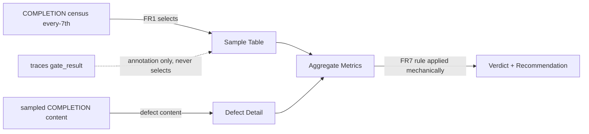

---
# Quality Chain Metadata (Alex 必填 - Phase 4 Hook 将基于此阻塞 Gate 3)
task_type: research   # code | yaml | research | e2e | mixed
e2e_required: no      # yes | no
research_required: yes # the deliverable IS a research report
git_tracked_dirs: [".tad/evidence/research"]  # new report file must be git-tracked at Gate 3 (review-cr P1-2: dir-tracked ≠ file-tracked)
skip_knowledge_assessment: no  # yes | no
gate4_delta: []
# Surplus provenance
epic: EPHEMERAL-surplus-gate-roi-measurement
phase: measure-and-verdict
authorization: "HUMAN-AUTHORIZED 2026-07-05 via *surplus review"
---

# Handoff Document for Agent B (Blake)
## TAD v3.1 - Evidence-Based Development

**From:** Alex (Agent A - Solution Lead)
**To:** Blake (Agent B - Execution Master)
**Date:** 2026-07-05
**Project:** TAD
**Task ID:** TASK-20260705-001
**Handoff Version:** 3.1.0
**Epic:** EPHEMERAL-surplus-gate-roi-measurement.md (Phase 1/1)
**Supersedes:** N/A (this file replaces its own earlier express-format draft in place)

---

## 🔴 Gate 2: Design Completeness (Alex必填)

**执行时间**: 2026-07-12 (v3.3.0 re-run — normal TAD flow, replaces the 2026-07-05 YOLO-pass)

### Gate 2 检查结果

| 检查项 | 状态 | 说明 |
|--------|------|------|
| Architecture Complete | ✅ | Catch-agnostic every-7th census pipeline → rubric classification → FR7 mechanical verdict. No code/protocol changes. |
| Components Specified | ✅ | Single deliverable report, mandated section titles + `label = value` metric format (§4.2/§4.3/FR5) — ACs mechanically verifiable, mutation-tested. |
| Functions Verified | ✅ | Read-only jq/grep/awk; all pre-impl AC rows re-measured 2026-07-12 (census 189 → 27 samples, 11/27 no-P0). AC10/AC12 self-tested against mock. |
| Data Flow Mapped | ✅ | census → sample (FR1) ← traces annotate only; content → Defect Detail → aggregates (incl. named P01) → FR7 rule → verdict. §4.1 + MQ3 updated. |
| Expert Review (min 2) | ✅ | Round-2: backend-architect + code-reviewer (2 P0 + 6 P1). Round-3 on v3.2.0: same two lenses (1 new P0 in my own fix + 3 P1) — all resolved v3.3.0. Full Audit Trail §9.2. |

**Gate 2 结果**: ✅ PASS (v3.3.0)

**Alex确认**: 我已验证所有设计要素，Blake可以独立根据本文档完成实现。

---

## 📋 Handoff Checklist (Blake必读)

Blake在开始实现前，请确认：
- [ ] 阅读了所有章节
- [ ] **阅读了「📚 Project Knowledge」章节中的历史经验**
- [ ] 所有"强制问题回答（MQ）"都有证据
- [ ] 理解了真正意图（不只是字面需求）
- [ ] 每个Phase的交付物和证据要求都清楚
- [ ] 确认可以独立使用本文档完成实现

❌ 如果任何部分不清楚，**立即返回Alex要求澄清**，不要开始实现。

---

## 1. Task Overview

### 1.1 What We're Building

A single evidence-backed research report — `.tad/evidence/research/gate-roi-measurement-2026-07.md` — that measures whether TAD's Quality Gates actually catch real defects. It draws a **catch-agnostic systematic sample** (every-7th of the full name-sorted COMPLETION census — NOT conditioned on any catch having occurred), classifies every gate-caught defect (severity, catching stage, counterfactual impact if shipped), and applies a **pre-registered decision rule (FR7)** to issue a verdict: **net-positive / net-neutral / net-negative** on defect-catch effectiveness, plus a go/no-go recommendation on investing in mechanical gate enforcement. Scope note: this measures the BENEFIT side of gate ROI; gate cost is explicitly unmeasured (Limitations).

### 1.2 Why We're Building It

**业务价值**: The 2026-06-09 repositioning stress-test (O1/KR2) named "gate-ROI unproven" as an explicit gap. TAD positions itself as a quality framework but has never measured whether Gates earn their overhead — the claim is rhetorical until measured.
**用户受益**: The human gets a data-grounded answer to "are Gates worth it?" and a go/no-go on mechanical enforcement investment, instead of anecdotes.
**成功的样子**: When the user can open one report, see ≥20 evidence-cited samples, a defect classification table with raw counts a skeptic could recompute from, and a one-line falsifiable verdict, this task is successful.

### 1.3 🆕 Intent Statement（意图声明）

**真正要解决的问题**: Prove or falsify TAD's core quality claim using its own historical record — archival evidence, not intuition.

**不是要做的（避免误解）**：
- ❌ 不是 changing any gate protocol, SKILL file, or hook code (explicitly out of scope)
- ❌ 不是 re-running historical gates — this is archival analysis of what the record already says
- ❌ 不是 a marketing document — net-neutral / net-negative / "unmeasurable with current evidence" are all acceptable, honest outcomes

**Blake请确认理解**：
```
在开始实现前，请用你自己的话回答：
1. 这个功能解决什么问题？— Gates 的 ROI 从未被测量；用历史证据给出可证伪的裁决。
2. 用户会如何使用？— 读一份报告，据此决定是否投资 mechanical gate enforcement。
3. 成功的标准是什么？— ≥20 个 evidence-cited 系统抽样样本 + 缺陷分类 + 明确 verdict + go/no-go。
```

---

## 📚 Project Knowledge（Blake 必读）

**⚠️ MANDATORY READ — Blake 在开始实现前，必须执行以下 Read 操作：**
1. Read `.tad/project-knowledge/patterns/gate-design.md`
2. Read `.tad/project-knowledge/patterns/memory-and-learning.md`
3. Read `.tad/project-knowledge/patterns/shell-portability.md`
4. Read `.tad/project-knowledge/patterns/ac-verification.md`

### 步骤 1：识别相关类别

- [x] architecture - gate system design history
- [x] testing - AC/verification design
- [x] code-quality - shell/jq patterns for trace parsing
- [ ] security / ux / performance / api-integration / mobile-platform — N/A

### 步骤 2：历史经验摘录

**已读取的 project-knowledge 文件**：

| 文件 | 相关记录数 | 关键提醒 |
|------|-----------|----------|
| patterns/gate-design.md | multiple | Gate = smoke alarm not fire suppressor; 禁止纸面验收; claims need carriers — every defect claim in the report must cite the file that carries it |
| patterns/memory-and-learning.md | multiple | Trace schema v2.0: traces are event timeline, NOT content — defect content lives in archived COMPLETION reports |
| patterns/shell-portability.md | multiple | macOS/BSD grep/jq quirks; CJK content in archives (use `LC_ALL=C` if byte-matching misbehaves); prefer jq over ad-hoc jsonl parsing |
| patterns/ac-verification.md | multiple | AC self-leak prevention: verification greps must match report STRUCTURE (anchored table-row IDs), not prose that quotes AC text |

**⚠️ Blake 必须注意的历史教训**：

1. **A coverage gate's global-count floor cannot detect must-cover loss** (principles.md 2026-06-01)
   - 问题：global tallies conflate populations
   - 解决方案：classify PER-defect; per-sample rows are ground truth, aggregates are derived from them.
2. **Validation Theater** (principles.md 2026-05-15 YOLO audit)
   - 问题：structural checks prove files exist, not that conclusions are sound
   - 解决方案：every row cites its concrete evidence file so a skeptic can re-derive the classification; report presents raw counts.
3. **Mechanical Enforcement Rejected on Single-User CLI** (principles.md 2026-04-15)
   - 问题：fail-closed hooks were rejected; trace + human audit chosen instead
   - 解决方案：the go/no-go recommendation (FR5) MUST explicitly engage this principle — it is the standing prior the verdict must confirm or overturn, not ignore.

### Blake 确认

- [ ] 我已阅读上述历史经验
- [ ] 我理解需要避免的问题
- [ ] 如遇到类似情况，我会参考上述解决方案

---

## 2. Background Context

### 2.1 Previous Work

- Epic: `.tad/active/epics/EPHEMERAL-surplus-gate-roi-measurement.md` — human-authorized 2026-07-05 via *surplus review.
- The 2026-06-09 repositioning stress-test flagged O1/KR2 "gate-ROI unproven".
- The 2026-04-15 principle "Mechanical Enforcement Rejected on Single-User CLI" is the standing decision this report's recommendation must engage with.
- The handoff template frontmatter already anticipates this work: `gate4_delta` comments mention a "Future gate-roi-report.sh".

### 2.2 Current State (grounded 2026-07-05, measured on disk — see §7.3)

- `.tad/evidence/traces/` = **56** daily jsonl files (Epic text says 57; measured today = 56, including the git-untracked `2026-07-04.jsonl`; use the measured value).
- Trace event types include: `gate_result` (**73** events: 69 pass / 3 fail / 1 partial, across **70** distinct slugs, earliest 2026-05-19), `expert_review_finding` (**79**), `handoff_created` (937), `task_completed` (163).
- `gate_result` schema: `{ts, type, context ("Gate 3: ..."), outcome (pass/fail/partial), slug, agent}`. Defect CONTENT is NOT in traces — it lives in archived COMPLETION/HANDOFF files (P0/P1 fix logs, Audit Trail tables, gate4_delta frontmatter, honest_partial records).
- `.tad/archive/handoffs/` = **486** files, of which **184** are `COMPLETION-*` reports; **137** COMPLETION reports mention "P0".
- Target output dir `.tad/evidence/research/` exists (naming precedent: dated topic reports).

### 2.3 Dependencies

- `jq`, `grep`, standard BSD userland — all verified present via the grounding dry-runs. No network, no new packages, no code.

---

## 3. Requirements

### 3.1 Functional Requirements

- **FR1 — Catch-agnostic systematic sample frame (design-review P0-2 fix)**: Population = the FULL census of `.tad/archive/handoffs/COMPLETION-*.md` at impl time, name-sorted, EXCLUDING only this Epic's own bookkeeping files. Sample = **every 7th file starting at index 1** (`ls .tad/archive/handoffs/COMPLETION-*.md | sort | awk 'NR%7==1'`) — deterministic, reproducible, and **NOT conditioned on any gate event, P0 mention, or fix log existing**. Grounded: census 184 at design time (2026-07-05), 189 at re-measure (2026-07-12) → 27 samples; the census only grows, so ≥20 is guaranteed. The Epic-bookkeeping exclusion is applied as a PRE-FILTER before `awk 'NR%7==1'` (round-3 P2-B: filter-then-sample keeps indices deterministic; never post-drop sampled rows). Trace `gate_result` events are used ONLY as per-row ANNOTATION (did this handoff hit a formal gate, per traces?), never as a selector. Zero-catch COMPLETIONs stay in the sample as `none` rows — they are the point. The frame rule must be restated verbatim in `## Method` with the census denominator shown. Frame survivorship note (→ FR6): population is completed handoffs only; cancelled/abandoned work and express edits without COMPLETIONs are outside the frame.
- **FR2 — Per-sample classification table**: One row per sampled handoff, ID format `GR-01` … `GR-NN`, columns: `| GR-## | handoff slug | gate/review stage(s) | defects caught (count) | max severity (P0/P1/P2/none) | counterfactual impact | evidence file |`. Counterfactual enum: `broken-ship` / `silent-degradation` / `cosmetic` / `none`. Zero-catch handoffs MUST appear as explicit `none` rows — they are the no-gate-baseline signal, dropping them fakes the ROI upward.
- **FR3 — Defect detail list**: For every defect counted in FR2: what it was (1 line), which stage caught it (Gate 2 expert review / Gate 3 / Gate 4 / self), severity, counterfactual reasoning (1-2 lines), evidence file path. No defect enters from memory.
- **FR4 — Aggregate metrics**: defects by severity; **P0+P1 total (P01) as an explicitly named line, summed from the FR3 per-defect severity tags** (round-3 P1-B: the FR7 input must be recomputable from Defect Detail — Gate 3 recomputes it); defects by catching stage; counterfactual distribution; zero-catch handoff ratio; NC% (share of sampled handoffs where gates caught ≥1 non-cosmetic defect). Severity counting note: P01 counts EVERY P0/P1 defect individually (a sample row with one P0 + two P1 contributes 3), independent of the row's max_severity display.
- **FR5 — Verdict + recommendation (mechanical application of FR7)**: Exactly one line `**Verdict**: net-positive` (or `net-neutral` / `net-negative`, or `unmeasurable-with-current-evidence` per NFR3), derived by APPLYING the FR7 pre-registered rule to the aggregates — no judgment call at this step, no hedged "it depends". The Verdict section must show the three labeled inputs in EXACTLY this ASCII format (line layout free, labels verbatim — AC10 greps these strings): `NC% = <value>`, `P0+P1 total = <value>`, `zero-catch ratio = <value>`; plus the rule branch taken. Then exactly one line `**Recommendation**: GO` or `**Recommendation**: NO-GO` per the FR7 mapping, whose rationale explicitly engages the 2026-04-15 "Mechanical Enforcement Rejected on Single-User CLI" principle INCLUDING its cost claim (the words cost/overhead/recovery or 成本/恢复 must appear — a bare date citation is not engagement).
- **FR6 — Limitations section**: selection/survivorship bias (frame = completed handoffs only; express/small-edit work under-represented); self-reported fix logs; the analyst being structurally inside TAD (bias guard — raw counts + stated rubric let a skeptic recompute the ARITHMETIC; classification-level audit happens via the FR8 spot-check); false negatives (defects gates missed) are unmeasurable from this record; **gate COST (overhead time, review churn, blocked-ship friction) is unmeasured — the verdict speaks to defect-catch effectiveness only, NOT full ROI**; traces only cover gate_result from 2026-05-19; threshold provenance (FR7 note) restated; state verdict confidence accordingly.
- **FR7 — Pre-registered decision rule (design-review P0-1 fix; STRICT tier, human-selected 2026-07-12)**: The report's `## Method` section MUST restate this rule verbatim BEFORE any counts appear, and `## Verdict` MUST apply it mechanically. Definitions: S = sample size; NC = number of samples with >=1 caught defect whose counterfactual is broken-ship or silent-degradation; NC% = NC/S; P01 = total P0+P1 gate-caught defects across the sample; Z = none-row count / S. Rule: **net-positive iff NC% >= 25% AND P01 >= 10; net-negative iff NC% <= 5%; net-neutral otherwise.** (ASCII note: the Method restatement MUST use ASCII `>=`/`<=` exactly as written — AC11 is a byte-exact grep; unicode `≥` fails it.) Recommendation mapping: net-positive → `GO` (= proceed to revisit the 2026-04-15 mechanical-enforcement decision with these numbers, next step being cost-side measurement); anything else → `NO-GO` (the 2026-04-15 prior stands). Threshold provenance (state in Method, verbatim honesty required): registered 2026-07-12 knowing the population P0-mention rate (137/184 ≈ 74%) but BEFORE any per-sample counterfactual classification existed. **Disclosure (round-3 P1-C): given that density, the P01 >= 10 conjunct is expected-satisfied by construction — the OPERATIVE discriminator is NC%, which rides entirely on the counterfactual axis (unknown at registration, rubric-constrained via §4.3 + FR8 audit). The reader must not be led to believe two independent gates must clear.**
- **FR8 — Counterfactual classification audit (review-cr P1-3 fix)**: classification uses the §4.3 rubric (criteria + anchors + tie-break). At Gate 3, an INDEPENDENT reviewer (not the classifying analyst) re-derives the counterfactual enum for 5 randomly selected GR rows from their cited evidence files alone; agreement >=4/5 required, else the full classification pass is re-run with the rubric tightened and the disagreement documented.

### 3.2 Non-Functional Requirements

- **NFR1 — Read-only analysis**: The ONLY new/modified file is the report. No modifications to traces, archives, `.tad/hooks/`, `.claude/skills/`, or gate protocols.
- **NFR2 — Reproducibility**: Every count traceable to a runnable command (key commands pasted in the report's Method section) or a cited file path.
- **NFR3 — Honesty over marketing (extended per review-arch P1-3)**: Two honest-partial routes, both using the anchored line `**Verdict**: unmeasurable-with-current-evidence` (mechanically distinguishable per review-cr P2-2): (a) <20 usable samples (unlikely given census >=184); (b) >=20 samples but the counterfactual classification cannot be made at >=4/5 spot-check agreement even after one rubric-tightening re-pass (FR8) — classification instability IS a finding, not a failure to hide. Note the verdict is ALREADY scoped to defect-catch effectiveness (FR6/FR7); cost being unmeasured does NOT trigger honest-partial, it triggers the mandatory Limitations scope statement.

### 3.3 Optimization Target

N/A — no numeric optimization goal; Autoresearch Mode not triggered.

---

## 4. Technical Design

### 4.1 Architecture Overview

Read-only archival pipeline, four stages:

```
Stage A: Sample frame     catch-agnostic every-7th scan of the full COMPLETION-* census
                          (FR1; traces NEVER select — annotation only)
Stage B: Extraction       per sample: read COMPLETION/HANDOFF for P0/P1/P2 fix logs,
                          Audit Trail tables, gate4_delta, Gate 3/4 sections;
                          annotate row with trace gate_result evidence if any
Stage C: Classification   severity + catching stage + counterfactual per defect (§4.3 rubric)
Stage D: Synthesis        aggregates → FR7 rule applied mechanically → verdict → go/no-go → limitations
```

### 4.2 Component Specifications

Single component: the report at `.tad/evidence/research/gate-roi-measurement-2026-07.md` with six mandatory H2 sections (exact titles, load-bearing for ACs):

1. `## Method` — sampling rule stated verbatim + key commands used + exclusion count
2. `## Sample Table` — the GR-## table (FR2)
3. `## Defect Detail` — per-defect bullets (FR3)
4. `## Aggregate Metrics` — FR4 tables
5. `## Verdict` — FR5 verdict + recommendation lines with numeric basis
6. `## Limitations` — FR6

Helper scripts NOT required; ad-hoc jq/grep in the terminal is fine (record commands in Method). Any throwaway script goes under `/tmp`, never the repo.

### 4.3 Data Models

Sample row: `| GR-## | slug | stages | defect_count | max_severity | counterfactual | evidence_file |`

Counterfactual enum RUBRIC (review-cr P1-3 / review-arch P2-2 fix — classify by counterfactual AT SHIP TIME, not eventual outcome; each criterion is testable against the cited evidence file):

- `broken-ship` — the shipped artifact would VISIBLY fail on a normal-use path: crash, install failure, dead UI, wrong output the user notices on first use. Anchors: reading-companion CSP P0 (strict CSP blocked the reader's own inline script — page dead in any enforcing browser); npx installer regex injection (install breaks on legal input).
- `silent-degradation` — ships and appears to work, but silently does the wrong thing OR a protection it claims is void: guard that never fires, data silently lost/misclassified, verification that passes when it shouldn't. Anchors: detect-state fixture P0 (fixture never exercises the glob block it exists to protect — green test, void protection); AC13 unit-mismatch (count compares incomparable units — gate green while measuring nothing). Worst class: no failure signal ever reaches the user.
- `cosmetic` — style/doc/comment/format only; behavior identical if shipped. Anchor: tad.sh:165 stale "MAJOR.MINOR" comment.
- `none` — no defect caught by ANY gate/review stage for this handoff (legitimate, must-report — this row class is the no-gate-baseline signal).

Tie-break rules: (1) a defect fitting two classes takes the MORE severe (visible failure > silent wrongness > cosmetic); (2) a cosmetic-looking defect in a VERIFICATION artifact (AC, fixture, gate script) that weakens what the verification proves is `silent-degradation`, not `cosmetic`; (3) when the evidence file is too thin to decide, classify DOWN (toward cosmetic) and flag the row `low-confidence` — biasing against the gates, never for them.

Defect counting rules:
- A "gate-caught defect" = any P0/P1/P2 recorded as found by Gate 2 expert review, Gate 3 verification, or Gate 4 acceptance BEFORE ship.
- Bugs found after archive/ship do NOT count as catches (they are false negatives → Limitations).
- Same defect in both a HANDOFF Audit Trail and its COMPLETION fix log → count once.

### 4.4 API Specifications

N/A — no APIs. Read-only file access.

### 4.5 User Interface Requirements

N/A — markdown report only.

---

## 5. 🆕 强制问题回答（Evidence Required）

### MQ1: 历史代码搜索

**回答**: [x] 是 — the Epic references prior positioning work and existing evidence stores.

#### 搜索证据
```bash
ls .tad/evidence/traces/*.jsonl | wc -l                       # → 56
ls .tad/archive/handoffs/ | grep -c '^COMPLETION-'            # → 184
grep -l 'P0' .tad/archive/handoffs/COMPLETION-*.md | wc -l    # → 137
cat .tad/evidence/traces/*.jsonl | jq -r 'select(.type=="gate_result")|.outcome' | sort | uniq -c
#   → 3 fail / 1 partial / 69 pass (73 events, 70 distinct slugs)
```

#### 决策说明
- **找到了什么**: traces = gate EVENT timeline (73 gate_result events since 2026-05-19); archives = defect CONTENT (137 COMPLETIONs mention P0).
- **位置**: `.tad/evidence/traces/`, `.tad/archive/handoffs/`
- **决定**: ✅ 复用 both stores as the sample frame; ❌ 不建 new tooling.
- **原因**: Epic mandates archival analysis; both stores verified non-empty and parseable.

### MQ2: 函数存在性验证

**回答**: N/A with reason — no functions are called; the task is jq/grep over files. Tool availability verified:

| 函数名 | 文件位置 | 行号 | 代码片段 | 验证 |
|--------|---------|------|---------|------|
| jq (CLI) | system PATH | N/A | `jq -r 'select(.type=="gate_result")'` | ✅ (MQ1 dry-run succeeded 2026-07-05) |
| grep/ls (BSD) | system PATH | N/A | `grep -c '^COMPLETION-'` | ✅ |

### MQ3: 数据流完整性

**回答**: adapted for research task — "backend fields" = evidence sources, "frontend" = report sections.

| 后端字段 (evidence source) | 用途说明 | 前端组件 (report section) | 是否显示 | 不显示原因 |
|---------|---------|---------|---------|-----------|
| gate_result events (traces) | which handoffs hit which gates | ## Method + ## Sample Table | ✅ | |
| COMPLETION P0/P1 fix logs | defect content + severity | ## Defect Detail | ✅ | |
| Audit Trail tables (archived handoffs) | Gate 2 expert-review catches | ## Defect Detail + ## Aggregate Metrics | ✅ | |
| gate4_delta frontmatter | Alex-said vs actual gaps | ## Defect Detail (when present) | ✅ | |
| expert_review_finding events | review timeline corroboration | ## Method | ✅ | timeline only; content lives in archives |

#### 数据流图



### MQ4: 视觉层级

**回答**: [ ] 无不同状态 → 跳过（markdown report; severity/counterfactual distinctions are textual enums, defined §4.3）。

### MQ5: 状态同步

**回答**:
```
[evidence files (read-only)] → report (唯一新产物)
✅ 只有一个输出文件，无需同步。No state lives anywhere else.
```

---

## 6. Implementation Steps（分Phase）

## 6.1 Micro-Tasks

| # | File | Operation | Verification Command | Est. Time |
|---|------|-----------|---------------------|-----------|
| 1 | (terminal) | Draw the FR1 catch-agnostic frame: `ls .tad/archive/handoffs/COMPLETION-*.md \| sort \| awk 'NR%7==1'` (exclude this Epic's own bookkeeping files if sampled); record census denominator + sample list verbatim into Method notes | ≥20 sampled files, deterministic list | 5 min |
| 2 | (terminal) | Annotate each sampled slug with trace gate evidence: `cat .tad/evidence/traces/*.jsonl \| jq -r 'select(.type=="gate_result") \| [.slug,.context,.outcome] \| @tsv' \| sort -u` joined by slug (annotation ONLY — never add/remove samples based on this) | per-sample gate annotation column | 10 min |
| 3 | (terminal) | Read each sampled COMPLETION/HANDOFF; extract defects (P0/P1/P2 fix logs, Audit Trail rows, Gate 3/4 findings, gate4_delta) with file citations | per-sample notes with evidence paths | 40 min |
| 4 | report | Write `## Method` + `## Sample Table` (GR-## rows) | `grep -cE '^\| GR-[0-9]{2} ' "$RPT"` ≥ 20 | 15 min |
| 5 | report | Write `## Defect Detail` + `## Aggregate Metrics` | severity + counterfactual + zero-catch-ratio present | 15 min |
| 6 | report | Write `## Verdict` (numeric basis + 2026-04-15 principle engagement) + `## Limitations` | exactly 1 Verdict line + 1 Recommendation line | 10 min |
| 7 | (terminal) | Run all §9.1 post-impl verification commands | all rows pass | 5 min |

### Micro-Task Rules
- Each task is independently verifiable; verification commands are runnable as written (un-escape `\|`).

### Phase 1: measure-and-verdict（预计 ~1.5-2 小时）

#### 交付物
- [ ] `.tad/evidence/research/gate-roi-measurement-2026-07.md` — the complete report

#### 实施步骤
1. Micro-tasks 1-7, in order.
2. Sampling rule (restate in report Method verbatim): FR1 catch-agnostic every-7th census sample — population, command, denominator, and exclusions all shown. Never cherry-pick; never sample from memory; never let gate evidence influence sample membership.
3. Restate the FR7 decision rule verbatim in `## Method` BEFORE any counts appear; apply the §4.3 rubric + defect counting rules; flag low-confidence rows per tie-break rule 3.

#### 验证方法
- Run every `post-impl-verifiable` command in §9.1 against the report; all rows must pass.

#### 🆕 Phase 1 完成证据（Blake必须提供）
- [ ] Report file path + `wc -l` output
- [ ] Raw outputs of all §9.1 verification commands
- [ ] The Verdict + Recommendation lines quoted verbatim in the completion report
- [ ] `git status --porcelain` output proving no collateral writes (AC7)

**Human审查问题**（人域 — 只有人能答）: verdict 的推理站得住吗？是否符合你对 TAD 的实际体感？go/no-go 你接受吗？

**Human决策**: ✅ Accept / ⚠️ 调整

---

## 7. File Structure

### 7.1 Files to Create
```
.tad/evidence/research/gate-roi-measurement-2026-07.md  # The single deliverable
```

### 7.2 Files to Modify
```
(none — read-only analysis; zero modifications to existing files)
```

### 7.3 Grounded Against (Phase 2 P2.2 — Alex step1c, 2026-04-24)

**Grounded Against** (Alex 实际 Read/measured 的源，2026-07-05):

- `.tad/active/epics/EPHEMERAL-surplus-gate-roi-measurement.md` (full read)
- `.tad/evidence/traces/2026-07-04.jsonl` (head — schema inspection of handoff_created event shape)
- `.tad/evidence/traces/*.jsonl` aggregate via jq (12 event types; gate_result=73 [69 pass / 3 fail / 1 partial, 70 slugs, earliest 2026-05-19]; expert_review_finding=79; handoff_created=937)
- `.tad/archive/handoffs/` listing (486 files; 184 COMPLETION-*; 137 mention P0)
- `.tad/evidence/research/` listing (target dir exists; naming precedent confirmed)
- `.tad/evidence/research/gate-roi-measurement-2026-07.md` — (new — will be created)
- ⚠️ NOTE: the planned grounding file `.tad/evidence/yolo/surplus-gate-roi-measurement/phase1-grounding.md` did NOT exist at design time; Alex substituted direct disk measurement — all numbers above are measured 2026-07-05, not recalled. Epic's "57 traces" measures as 56.

---

## 8. Testing Requirements

### 8.1 Unit Tests
N/A — no code. Verification = §9.1 AC commands executed against the report.

### 8.2 Integration Tests
N/A. The report's Method-section commands must be re-runnable by Gate 3 to reproduce the sample frame.

### 8.3 Edge Cases
- Trace slug with no matching sampled COMPLETION → irrelevant to the frame (traces never select); note in Method that trace annotation coverage is partial.
- Sampled COMPLETION with no trace event (pre-2026-05-19) → stays in the sample (FR1 frame is census-based); its gate evidence, if any, comes from the file content itself.
- Handoff where gates caught ZERO defects → mandatory `none` row (FR2); dropping it is selection bias.
- Same defect in HANDOFF Audit Trail AND COMPLETION fix log → count once (§4.3).
- <20 usable samples overall → honest-partial verdict "unmeasurable with current evidence" (NFR3), never a fabricated table.

## 8.4 Friction Preflight

| Friction Point | Required Step | Expected Fix Path | Allowed Substitute | Gate Impact |
|----------------|---------------|-------------------|--------------------|-------------|
| Grounding file missing (already hit at design time) | Ground truth for data volumes | §7.3 measured values embedded in this handoff | Re-measure with §5 MQ1 commands | None if re-measured |
| jq not on PATH in Blake's shell | jsonl parsing | jq verified installed at design time | `python3 -c 'import json,sys...'` one-liner fallback | Unresolved BLOCKED prevents Gate 3 PASS |
| Census shrinks below 140 (every-7th < 20 samples) | FR1 sample size | Not expected (census 189 measured 2026-07-12, monotonically growing) — if it somehow occurs, switch to every-5th and DOCUMENT the change in Method | Honest-partial "unmeasurable" verdict per NFR3(a) | AC2 FAIL if <20 rows without the honest-partial route |
| CJK content breaks grep byte-matching | Archive text extraction | `LC_ALL=C` prefix (shell-portability.md) | jq/python extraction | None if applied |

**Status Enum**: `READY` / `BLOCKED` / `DEGRADED_WITH_APPROVAL` / `EQUIVALENT_SUBSTITUTE` / `NOT_APPLICABLE_WITH_REASON`

## 8.5 Feedback Collection (Non-Code Artifacts)

```yaml
feedback_required: false
artifact_type: generic
suggested_dimensions: []
notes: "Research report; human judgment happens at Gate 4 acceptance (verdict plausibility — a human-domain question), not via feedback collector."
```

## 8.6 🆕 Test Evidence Required
Blake必须提供：
- [ ] Raw output of every §9.1 post-impl verification command
- [ ] `git status --porcelain` output proving the only new tracked-tree path is the deliverable (plus this Epic's own bookkeeping files)
- [ ] N/A: coverage report / test screenshots (no code)

---

## 9. Acceptance Criteria

Blake的实现被认为完成，当且仅当：
- [ ] All FR1-FR6 implemented in the report and verified via §9.1
- [ ] ≥20 evidence-cited GR-## samples, each row traceable to a real on-disk file (3 randomly chosen cited paths spot-checked to exist)
- [ ] Exactly one Verdict line and one Recommendation line in the mandated formats, with numeric basis
- [ ] Recommendation explicitly engages the 2026-04-15 mechanical-enforcement principle
- [ ] Zero modifications outside the single new report file
- [ ] Human验证 "这个 verdict 的推理我信"

---

## 9.1 Spec Compliance Checklist ⚠️ PRIMARY VERIFICATION SOURCE — Gate 3 executes each row

> All paths relative to repo root `/Users/sheldonzhao/01-on progress programs/TAD`.
> Set `RPT=".tad/evidence/research/gate-roi-measurement-2026-07.md"` first.
> Pipe-escape note: un-escape `\|` when extracting commands to run in bash.

| # | Acceptance Criterion | Verification Type | Verification Method | Expected Evidence | Verified Output (Alex step1d) |
|---|---------------------|-------------------|--------------------|--------------------|-------------------------------|
| AC-P1 | ANNOTATION pool exists (traces used for per-row gate annotation only, never as selector — FR1) | pre-impl-verifiable | `cat .tad/evidence/traces/*.jsonl \| jq -r 'select(.type=="gate_result")\|.slug' \| sort -u \| wc -l` | ≥ 1 (informational) | `70` (re-measured 2026-07-12) |
| AC-P2 | Catch-agnostic census pool sufficient: every-7th sample of full COMPLETION census yields ≥20 | pre-impl-verifiable | `ls .tad/archive/handoffs/COMPLETION-*.md \| sort \| awk 'NR%7==1' \| wc -l` | ≥ 20 | `27` (2026-07-12 measured: census 189 → 27 sampled; 11/27 sampled files contain NO 'P0' mention → frame demonstrably includes zero-catch candidates) |
| AC1 | Report exists and is non-trivial | post-impl-verifiable | `test -s "$RPT" && wc -l < "$RPT"` | exit 0, ≥ 150 lines | (post-impl) |
| AC2 | ≥20 sample rows in mandated GR-## format | post-impl-verifiable | `grep -cE '^\| GR-[0-9]{2} ' "$RPT"` | ≥ 20 | (post-impl) |
| AC3 | Every sample row cites an evidence file under traces/ or archive/handoffs/; ALL cited paths exist (full check per review-cr P2-3) | post-impl-verifiable | `grep -E '^\| GR-[0-9]{2} ' "$RPT" \| grep -cvE '\.tad/(archive/handoffs\|evidence/traces)/'` ; then `grep -E '^\| GR-[0-9]{2} ' "$RPT" \| awk -F'\|' '{gsub(/^ +\| +$/,"",$8); print $8}' \| sed 's/^ *//;s/ *$//' \| while read -r f; do [ -f "$f" ] \|\| echo "MISSING $f"; done` | 0 uncited rows; empty MISSING output | (post-impl) |
| AC4 | All six mandated H2 sections present | post-impl-verifiable | `grep -cE '^## (Method\|Sample Table\|Defect Detail\|Aggregate Metrics\|Verdict\|Limitations)$' "$RPT"` | 6 | (post-impl) |
| AC5 | Exactly one verdict line in enum format (honest-partial has its own anchored value per review-cr P2-2) | post-impl-verifiable | `grep -cE '^\*\*Verdict\*\*: (net-(positive\|neutral\|negative)\|unmeasurable-with-current-evidence)$' "$RPT"` | 1 | (post-impl) |
| AC6 | Exactly one go/no-go line; rationale engages the 2026-04-15 principle INCLUDING its cost claim (review-arch P2-1: date-citation alone ≠ engagement) | post-impl-verifiable | `grep -cE '^\*\*Recommendation\*\*: (GO\|NO-GO)$' "$RPT" ; sed -n '/^## Verdict$/,/^## /p' "$RPT" \| grep -ci '2026-04-15' ; sed -n '/^## Verdict$/,/^## /p' "$RPT" \| grep -ciE 'cost\|overhead\|recovery\|成本\|恢复'` | 1 ; ≥ 1 ; ≥ 1 | (post-impl) |
| AC7 | Read-only scope (BASELINE-DIFF per design-review P0-1): no NEW out-of-scope writes vs pre-impl baseline | post-impl-verifiable | Pre-impl first action: `git status --porcelain \| sort > /tmp/gate-roi-baseline.txt`. Post-impl: `git status --porcelain \| sort \| comm -13 /tmp/gate-roi-baseline.txt - \| grep -v 'gate-roi-measurement\|EPHEMERAL-surplus-gate-roi' \| grep -cE '\.claude/skills/\|\.tad/hooks/\|\.tad/archive/\|\.tad/evidence/traces/\|\.tad/project-knowledge/\|\.tad/active/'` | 0 — pre-existing untracked files are baseline-excluded; only NEW writes count (also closes P2-4: protected list broadened) | (post-impl) |
| AC8 | Every sample row carries a counterfactual enum value (zero-catch rows included as `none`) | post-impl-verifiable | `grep -E '^\| GR-[0-9]{2} ' "$RPT" \| grep -cvE 'broken-ship\|silent-degradation\|cosmetic\|none'` | 0 unclassified rows | (post-impl) |
| AC9 | Limitations addresses false negatives + insider bias | post-impl-verifiable | `sed -n '/^## Limitations$/,$p' "$RPT" \| grep -ciE 'false.negative\|missed'` ; `sed -n '/^## Limitations$/,$p' "$RPT" \| grep -ciE 'bias'` | ≥ 1 each | (post-impl) |
| AC10 | LABELED numeric basis present in Verdict section — all 3 distinct labels, line-layout-free (round-3 cr-P0 fix: count DISTINCT labels via grep -o, not matching lines; FR5 now mandates the `label = value` format) | post-impl-verifiable | `sed -n '/^## Verdict$/,/^## /p' "$RPT" \| grep -oiE 'NC% =\|P0\+P1 total =\|zero-catch ratio =' \| sort -uf \| wc -l` ; Gate 3 additionally recomputes P01 from Defect Detail severity tags and matches the Verdict value (round-3 P1-B) | 3 distinct labels ; recomputed P01 == Verdict P01 | (post-impl) |
| AC11 | FR7 decision rule pre-registered VERBATIM in Method (before counts) | post-impl-verifiable | `sed -n '/^## Method$/,/^## /p' "$RPT" \| grep -c 'net-positive iff NC% >= 25% AND P01 >= 10; net-negative iff NC% <= 5%; net-neutral otherwise'` | 1 | (post-impl) |
| AC12 | Zero-catch rows present (none-row guard, design-review P0-2): ≥1 row whose COUNTERFACTUAL column is `none` (round-3 cr-P1: scope to column 7, not any pipe-bounded cell) OR Method documents the census denominator legitimately producing zero none-rows | post-impl-verifiable | `grep -E '^\| GR-[0-9]{2} ' "$RPT" \| awk -F'\|' '{gsub(/ /,"",$7); if ($7=="none") n++} END {print n+0}'` ; if 0 → `sed -n '/^## Method$/,/^## /p' "$RPT" \| grep -ci 'zero none'` | ≥ 1 (primary) ; documented-exception path ≥ 1 | (post-impl) |
| AC13 | FR8 counterfactual spot-check executed at Gate 3: independent reviewer re-derived 5 random rows' enum from evidence files, agreement recorded | post-impl-verifiable (Gate 3 step) | Gate 3 evidence: spot-check table (5 rows: GR-id, analyst enum, reviewer enum, agree?) in the completion report; recompute agreement ≥ 4/5 | table present; ≥4/5 agree (else NFR3(b) route documented) | (post-impl) |

> ⚠️ §9.1 is the PRIMARY VERIFICATION SOURCE — Gate 3 executes each row. Empty §9.1 → Gate 3 BLOCK.

---

## 9.2 Expert Review Status (Alex 必填)

> YOLO Epic execution: expert review is run by the Conductor (yolo-epic workflow review stage), NOT hand-spawned by Alex in this design pass. Table to be filled by the Conductor review before the implement stage.

### Audit Trail

| Reviewer | Issue | Resolution Section | Status |
|----------|-------|-------------------|--------|
| backend-architect (2026-07-05) | P0-1: no aggregates→verdict decision rule — verdict not recomputable | FR7 (STRICT tier, human-selected 2026-07-12) + AC10/AC11 | ✅ Resolved v3.2.0 |
| backend-architect (2026-07-05) | P0-2: sample frame conditions on catches, no none-row guarantee | FR1 rewritten (catch-agnostic every-7th census; traces = annotation only) + AC12 + AC-P2 re-grounded (11/27 no-P0) | ✅ Resolved v3.2.0 |
| backend-architect (2026-07-05) | P1-1: cost side unmeasured, cannot honestly claim ROI | FR6 scope statement + FR5/§1.1 "defect-catch effectiveness" scoping + AC6 cost-keyword check | ✅ Resolved v3.2.0 |
| backend-architect (2026-07-05) | P1-2: every-Nth N unpinned; formal-handoff skew | FR1 pins N=7 + offset 1 + command; FR6 survivorship note | ✅ Resolved v3.2.0 |
| backend-architect (2026-07-05) | P1-3: honest-partial only wired for <20 samples | NFR3 extended: route (b) classification instability; scoped verdict via FR7 | ✅ Resolved v3.2.0 |
| code-reviewer (2026-07-05) | P1-1: AC10 always-green via mandated 2026-04-15 date | AC10 rewritten to 3 LABELED metrics (NC% / P0+P1 total / zero-catch ratio) | ✅ Resolved v3.2.0 |
| code-reviewer (2026-07-05) | P1-2: git_tracked_dirs [] contradicts new tracked deliverable | frontmatter → [".tad/evidence/research"] | ✅ Resolved v3.2.0 |
| code-reviewer (2026-07-05) | P1-3: counterfactual enum unverified analyst discretion | §4.3 rubric (criteria+anchors+tie-breaks incl. classify-DOWN rule) + FR8 5-row inter-rater spot-check + AC13 | ✅ Resolved v3.2.0 |
| both (P2 batch) | AC5 honest-partial anchor / AC6 keyword / AC3 full-check / FR1 reword | AC5 alternation + AC6 third grep + AC3 full path check + FR1 rewrite | ✅ Resolved v3.2.0 |
| backend-architect r3 (2026-07-12) | Verdict CONDITIONAL, 0 P0; both round-2 P0s confirmed CLOSED. P1-A stale trace-join refs ×4; P1-B P01 not a named/recomputable aggregate; P1-C P01>=10 conjunct near-decorative | P1-A: §4.1 Stage A + MQ3 mermaid + §8.3 + §8.4 + §10.1 + §11.1 title all rewritten to census frame; P1-B: FR4 names P01 + per-defect counting note + Gate-3 recompute in AC10; P1-C: FR7 provenance discloses NC% as operative discriminator. P2s: census 184/189 annotated (FR1), exclusion = pre-filter (FR1), ASCII >= note (FR7) | ✅ Resolved v3.3.0 |
| code-reviewer r3 (2026-07-12) | Verdict CONDITIONAL; P0: AC10 rewrite over-shot — grep -c counts lines + '=' separator unmandated → correct report FAILS. P1: AC12 matched any pipe-bounded `none`, not the counterfactual column | AC10: grep -o + sort -uf distinct-label count, FR5 mandates ASCII `label = value` format (layout-free); AC12: awk -F'\|' $7 column-scoped. Both self-tested against mock (3 / 1) | ✅ Resolved v3.3.0 |
| (round-4 verification: adversarial mutations a-e all correctly FAIL per cr r3 raw outputs; passing-mock now passes AC10 post-fix per Alex self-test 2026-07-12) | — | — | Closed |

### Experts Selected

1. **code-reviewer** — mandatory baseline; AC command correctness (BSD grep/jq portability, AC self-leak check)
2. **methodology/data-analysis lens** — sampling-bias and counterfactual-classification rigor; the dominant risk here is methodological (cherry-picking, survivorship), not technical

### Overall Assessment (post-integration)

- Pending Conductor review stage.

---

## 10. Important Notes

### 10.1 Critical Warnings
- ⚠️ **Do NOT modify anything but the report.** Out of scope: gate protocols, SKILLs, hooks, archived files, traces. AC7 mechanically enforces this.
- ⚠️ **Do NOT drop zero-defect samples.** A handoff where gates caught nothing is data, not noise — dropping it is selection bias that fakes ROI upward (FR2/AC8/AC12). Grounded expectation: 11/27 of the pre-measured sample contain no P0 mention — if your sample table shows zero `none` rows, suspect your extraction before suspecting the frame.
- ⚠️ **Sample membership is FROZEN by the FR1 command output.** Gate evidence (traces, P0 logs) may only ANNOTATE rows, never add/remove them. Restate the FR7 decision rule in Method BEFORE writing any counts — the rule is pre-registered (human-selected STRICT tier, 2026-07-12) and not adjustable after seeing data.
- ⚠️ **Traces only cover gate_result from 2026-05-19** — pre-trace-era sampled rows simply get an empty trace-annotation; their gate evidence comes from file content. State the partial annotation coverage in Limitations.
- ⚠️ **AC self-leak**: don't paste raw AC grep patterns into report prose in a way that AC3/AC8 negative-greps would misfire; those greps are anchored to `^| GR-` rows precisely to avoid this.
- ⚠️ **Bias guard**: the analyst is structurally inside TAD. The report must present raw counts so a skeptic can recompute the verdict from the Sample Table alone (FR6/NFR2).

### 10.2 Known Constraints
- Archival record is pass-heavy (69/73 gate_result = pass) — the interesting signal is mostly in Gate 2 expert-review P0s and P0-Fix Logs inside COMPLETION reports, not in trace outcomes.
- The data cannot measure false negatives directly; verdict confidence must reflect this (FR6).
- CJK content in archives: prefix `LC_ALL=C` where grep byte-matching misbehaves (shell-portability.md).

### 10.3 🆕 Sub-Agent使用建议

Blake应该考虑使用：
- [ ] **parallel-coordinator** — NOT needed (single sequential pipeline)
- [ ] **bug-hunter** — NOT applicable (no code)
- [ ] **test-runner** — NOT applicable (§9.1 commands run directly)
- [x] Optional: ONE general-purpose reader agent to batch-extract defect logs from the 20+ COMPLETION files if context pressure appears; otherwise read directly.

完成后在"Sub-Agent使用记录"中说明使用情况。

---

## 11. 🆕 Learning Content（可选）

### 11.1 Decision Rationale: Sample frame = catch-agnostic COMPLETION census (traces demoted to annotation)

**选择的方案** (v3.2.0 REVISED per design-review P0-2): Catch-agnostic every-7th systematic sample of the full COMPLETION census; traces demoted to per-row annotation.

**考虑的替代方案**：

| 方案 | 优点 | 缺点 | 为什么没选 |
|------|------|------|-----------|
| A (v3.1.0 原选, REJECTED): traces join archives + COMPLETION extension | Covers pre-trace era | **P0-2: both selectors condition on a catch having occurred** — zero-catch class systematically absent, ROI inflated by construction | ❌ 评审证明其循环论证 |
| B: traces only | Simple, uniform | Same catch-conditioning + starts 2026-05-19 + no defect content | Under-samples, content-blind, biased |
| C: full census of all 189 COMPLETIONs | Zero sampling bias | ~7x reading cost for a verdict-grade answer | Over-scoped; every-7th preserves the unbiasedness at 1/7 cost |
| D（选中）: every-7th of name-sorted census, gate evidence as annotation only | Catch-agnostic (11/27 pre-measured samples have no P0 mention); deterministic; reproducible; census denominator visible | Frame limited to completed handoffs (survivorship → Limitations) | ✅ 选中 |

**权衡分析**：核心权衡：coverage vs reading cost。当前优先级：a falsifiable verdict at surplus-budget cost.

**💡 Human学习点**: Event logs answer WHEN/WHETHER; artifact archives answer WHAT. ROI measurement needs both joined — either alone gives a hollow number.

---

## 12. 🆕 Sub-Agent使用记录

Blake完成后填写：

| Sub-Agent | 是否调用 | 调用时机 | 输出摘要 | 证据链接 |
|-----------|---------|---------|---------|---------|
| (per §10.3, likely none) | ✅/❌ | | | |

**Human验证点**：应该调用的都调用了吗？

---

**Handoff Created By**: Alex (Agent A)
**Date**: 2026-07-05 (v3.2.0 2026-07-12: P0-1/P0-2 + 6 P1 + 4 P2 round-2 fixes, decision rule human-selected STRICT tier; v3.3.0 2026-07-12: round-3 expert review — cr P0 AC10 false-negative + arch P1-A/B/C + P2s all resolved, AC10/AC12 self-tested)
**Version**: 3.3.0
