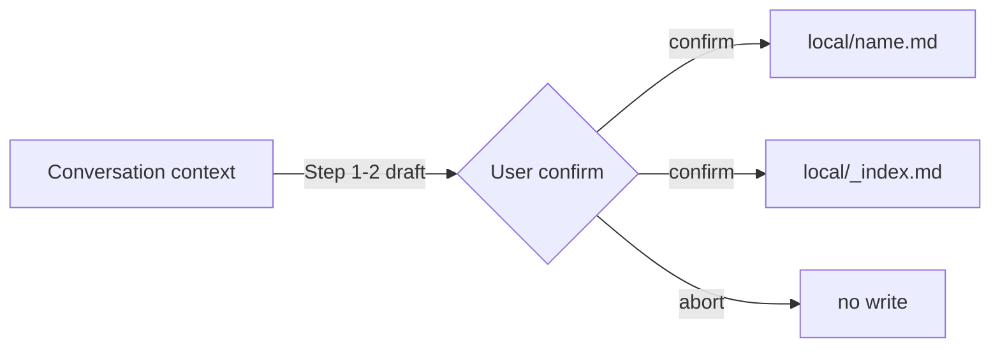

---
# Identity (carried over from surplus-scan stub — replaced in place by Alex design step)
handoff_id: HANDOFF-surplus-local-skill-capture
epic: EPHEMERAL-surplus-local-skill-capture
mode: surplus-auto
status: ready
scope_estimate: 3-4 files (~250 lines), single session

# Quality Chain Metadata (Alex 必填 - Phase 4 Hook 将基于此阻塞 Gate 3)
task_type: mixed      # SKILL.md authoring (agent-behavior spec) + .gitignore config + fixture evidence
e2e_required: no      # prompt-skill; validation = structural ACs + one in-session demo fixture capture
research_required: no

# Production dirs that must have ≥1 git-tracked file at Gate 3.
# NOTE: .claude/skills/local/ is deliberately NOT listed — it is gitignored by design (FR4).
git_tracked_dirs: [".claude/skills/save-skill"]

skip_knowledge_assessment: no

gate4_delta: []
---

# Handoff Document for Agent B (Blake)
## TAD v3.1 - Evidence-Based Development

**From:** Alex (Agent A - Solution Lead)
**To:** Blake (Agent B - Execution Master)
**Date:** 2026-07-05
**Project:** TAD Framework
**Task ID:** TASK-20260705-local-skill-capture
**Handoff Version:** 3.1.0
**Epic:** EPHEMERAL-surplus-local-skill-capture.md (Phase 1/1, surplus-auto YOLO)
**Supersedes:** surplus-scan stub of the same filename (replaced in place; stub intent preserved, corrected against grounding — see §2.1)

---

## 🔴 Gate 2: Design Completeness (Alex必填)

**执行时间**: 2026-07-05 (YOLO design step)

### Gate 2 检查结果

| 检查项 | 状态 | 说明 |
|--------|------|------|
| Architecture Complete | ✅ | Single new skill dir + gitignore line + on-demand local/ convention; sync-isolation surfaces all grounded against live tad.sh / release-verify.sh / derive-sync-set.sh |
| Components Specified | ✅ | §4.2 specifies SKILL.md required sections, exact constraint strings (AC-greppable), local-skill frontmatter schema, `_index.md` format |
| Functions Verified | ✅ | No code functions called; all referenced mechanisms (tad.sh copy loop, release-verify FR7 tolerance, blake T1 ceremony, patterns/_index.md precedent) verified on disk with line numbers (MQ2) |
| Data Flow Mapped | ✅ | conversation → draft → user confirm → local/<name>.md + _index.md (MQ3/MQ5) |

**Gate 2 结果**: ✅ PASS

**Alex确认**: 我已验证所有设计要素，Blake可以独立根据本文档完成实现。

> ⚠️ **Grounding note**: The Conductor-referenced grounding file
> `.tad/evidence/yolo/surplus-local-skill-capture/phase1-grounding.md` did NOT exist at design
> time (directory absent). Alex performed grounding directly against the live repo; all
> grounding evidence is embedded in §2.2, §7.3, and MQ2 with file:line citations and raw
> dry-run outputs in §9.1. Reviewers should treat §7.3 as the grounding record.

---

## 📋 Handoff Checklist (Blake必读)

Blake在开始实现前，请确认：
- [ ] 阅读了所有章节
- [ ] **阅读了「📚 Project Knowledge」章节中的历史经验**
- [ ] 所有"强制问题回答（MQ）"都有证据
- [ ] 理解了真正意图（不只是字面需求）
- [ ] 每个Phase的交付物和证据要求都清楚
- [ ] 确认可以独立使用本文档完成实现

❌ 如果任何部分不清楚，**立即返回Alex要求澄清**，不要开始实现。

---

## 1. Task Overview

### 1.1 What We're Building

A new user-invokable skill **`*save-skill`** (`.claude/skills/save-skill/SKILL.md`) that
captures a reusable pattern from the CURRENT conversation into a structured local skill file
under **`.claude/skills/local/<name>.md`**, via an LLM-draft → user-edit/confirm → write loop.
Local skill files carry `local: true` frontmatter and are isolated from framework
sync/install/publish by directory convention + a one-line `.gitignore` entry in the TAD repo.

### 1.2 Why We're Building It

**业务价值**：Knowledge compounds at the moment of discovery. Today reusable patterns are only
captured via the Gate 4 KA / distill loop; small tactical patterns evaporate.
**用户受益**：Zero-ceremony, in-the-moment capture — no Gate 4 cycle, no framework release.
**成功的样子**：当用户在对话中说 "把这个存成 skill" / `*save-skill`，30 秒内得到一个草稿、确认后
落盘到 `local/`，且下次 TAD 升级/安装/发布完全不碰它时，这个功能就成功了。

### 1.3 🆕 Intent Statement（意图声明）

**真正要解决的问题**：给「对话中刚刚被验证过的小型可复用模式」一个持久、可发现、免发布开销的家，
并且保证它永远不会被框架分发链路（tad.sh install / *publish / release-verify）覆盖或带走。

**不是要做的（避免误解）**：
- ❌ 不是替代 Gate 4 Knowledge Assessment / distill 流程（那是框架级知识；这是项目本地战术模式）
- ❌ 不是 Blake 的 skillify/SCAND T1 materialization 流水线（那个产出自动发现的
  `.claude/skills/{slug}/SKILL.md`；本功能产出 local/ 下的轻量模式文件，且必须用户显式发起）
- ❌ 不是修改 tad.sh / derive-sync-set.sh / *publish —— 隔离靠目录约定 + gitignore，只做验证
- ❌ 不是 sibling epic 的 `*save-workflow`（那是后续任务，会复用本 handoff 建立的约定）

**Blake请确认理解**：
```
在开始实现前，请用你自己的话回答：
1. 这个功能解决什么问题？
2. 用户会如何使用？
3. 成功的标准是什么？

只有Human确认你的理解正确后，才能开始实现。
（YOLO surplus-auto 模式：Conductor review 步骤代行此确认。）
```

---

## 📚 Project Knowledge（Blake 必读）

**⚠️ MANDATORY READ — Blake 在开始实现前，必须执行以下 Read 操作：**
1. Read `.tad/project-knowledge/principles.md`（重点：下方列出的 4 条）
2. Read `.tad/project-knowledge/patterns/_index.md`（本设计复用其 index 行格式）
3. Read the handoff's "⚠️ Blake 必须注意的历史教训" entries carefully

### 步骤 1：识别相关类别

本次任务涉及的领域（勾选所有适用项）：
- [x] architecture - 架构决策（sync 隔离、skill 发现机制）
- [x] code-quality - SKILL 文件写作规范（circular trigger test）
- [ ] security
- [ ] ux
- [ ] performance
- [x] testing - AC 设计（greppable 常量字符串）
- [ ] api-integration
- [ ] mobile-platform

### 步骤 2：历史经验摘录

**已读取的 project-knowledge 文件**：

| 文件 | 相关记录数 | 关键提醒 |
|------|-----------|----------|
| principles.md | 4 条 | Deny-list 思维、copy 粒度、circular trigger、existing-tool 优先 |
| patterns/_index.md | 1 条 | index 行格式：`- [title](file.md) — hook (max 120 chars)` |
| testing.md | 0 条 | 无相关历史记录 |

**⚠️ Blake 必须注意的历史教训**：

1. **Execution Discipline Content Must Stay in SKILL Body — Circular Trigger Test** (principles.md, 2026-06-09)
   - 问题：把约束规则抽到 references/ 后 agent 跳过执行纪律
   - 解决方案：save-skill 的全部约束（confirm-before-write、overwrite guard、scope 限制）必须写在
     SKILL.md **正文**，禁止抽出到 references/。本 skill 很小，单文件即可。

2. **Deny-List Must Be Applied at EVERY Copy Granularity** (principles.md, 2026-06-01)
   - 问题：修好一个粒度的 allow-list，遗漏症在另一个粒度复发
   - 解决方案：本设计已核对全部 3 个分发面（tad.sh dir-copy glob / derive-sync-set.sh /
     release-verify.sh），见 §2.2。Blake 不得新增任何分发面改动（out of scope），只跑验证 AC。

3. **Never Hand-Write What an Existing Tool Already Does** (principles.md, 2026-05-28)
   - 问题：绕过已有机制手写替代品 → 不完整
   - 解决方案：本地 skill 的"可发现性"复用已验证的 `patterns/_index.md` one-line index 约定，
     不发明新索引格式。

4. **Judgment-Only Skill Files: Constraint Rules Are NOT Mechanical** (principles.md, 2026-04-04)
   - 问题：精简 skill 时误删 MUST/MANDATORY 约束 → 质量链失效
   - 解决方案：§4.2 规定的约束字符串必须逐字出现（它们同时是 AC 的 grep 目标）。

### Blake 确认

- [ ] 我已阅读上述历史经验
- [ ] 我理解需要避免的问题
- [ ] 如遇到类似情况，我会参考上述解决方案

---

## 2. Background Context

### 2.1 Previous Work

- **Surplus-scan stub**（本文件旧版，88 行）：定义了 Extract/Draft/Confirm/Write 四步流、
  `local: true` 标记、overwrite guard、隔离检查。本 handoff 全量保留其意图，并依 grounding 做了
  两处修正：(a) skill 形态取目录式 `save-skill/SKILL.md`（stub 已预留该选项，flat .md 不被加载，
  §2.2）；(b) local/ 不放 committed README/.gitkeep — tracked local/ 会进分发 clone 被 tad.sh
  拷贝（§2.2），never-synced 约定改为写进随框架分发的 save-skill/SKILL.md 正文（AC6）。
- **Blake skillify / T1 materialization ceremony** (`.claude/skills/blake/SKILL.md` L1820-1870):
  existing pipeline where Blake DETECTS patterns post-KA and a human ceremony materializes
  `.claude/skills/{slug}/SKILL.md`. Contains SAFETY `forbidden_implementations`:
  *"MUST NOT create .claude/skills/{slug}/SKILL.md from Blake UNATTENDED"*. `*save-skill` is a
  DIFFERENT, complementary path: **user-explicitly-invoked** capture into `local/` flat files —
  see §10.1 for why this handoff does not conflict with that SAFETY entry.
- **release-verify.sh FR7 (2026-06-10) "T1 local-skill model"** (L193-217): sync-mode
  verification already treats `Only in $TGT` extras under `.claude/skills` as
  `ℹ️ local-skill` INFO, not FAIL — target-side local skills are anticipated by design.
- **patterns/_index.md** (`.tad/project-knowledge/patterns/_index.md`): the proven one-line
  keyword-index convention this design reuses for `local/_index.md`.
- **Sibling epic** `EPHEMERAL-surplus-saveable-skills-from-conversation.md` (*save-workflow):
  explicitly "reuse local-skill-capture conventions" — the frontmatter schema + overwrite
  guard + index format defined HERE become its contract. Get them right once.

### 2.2 Current State (grounded 2026-07-05, live repo)

| Fact | Evidence |
|------|----------|
| `.claude/skills/` has 48 skill DIRS + 1 flat file `doc-organization.md`; flat `.md` files are NOT loaded as skills (doc-organization absent from live skill list) | `ls .claude/skills/`; live available-skills list |
| `.claude/skills/local/` does not exist; 0 git-tracked files under it | `git ls-files '.claude/skills/local' \| wc -l` → `0` |
| tad.sh install copies ONLY skill DIRECTORIES: `for skill_dir in "$src"/.claude/skills/*/` (tad.sh L804), `cp -r` per dir (L821) — a `local/` dir present in a SOURCE clone WOULD be copied to targets | tad.sh L800-824 |
| tad.sh + derive-sync-set.sh contain ZERO special-casing of `skills/local` | `grep -l 'skills/local' tad.sh .tad/hooks/lib/derive-sync-set.sh \| wc -l` → `0` |
| derive-sync-set.sh governs `.tad/` dirs only, never touches `.claude/skills` | grep of derive-sync-set.sh: no `skills` matches |
| release-verify.sh sync mode ignores target-side skill extras (FR7) | release-verify.sh L193-217; `grep -c 'local-skill'` → `7` |
| `.gitignore` does NOT yet ignore `.claude/skills/local/` | `grep -c '^\.claude/skills/local/$' .gitignore` → `0`; `git check-ignore` exit 1 |
| Working skill frontmatter format = `name` + `description` + `trigger` | `.claude/skills/surplus/SKILL.md` L1-5 |

**⚠️ Design deviation from Epic literal text (grounding-driven)**: the Epic says "New skill file
`.claude/skills/save-skill.md`" (flat). Grounding shows flat `.md` files under `.claude/skills/`
are **not recognized as skills** (doc-organization.md precedent) and are **not distributed**
(tad.sh dir-only glob). A flat file would make `*save-skill` 永远无法触发。Therefore the skill is
built as **`.claude/skills/save-skill/SKILL.md`** (directory form) — same intent, working form.
The stub (§2.1) already anticipated this: "or `.claude/skills/save-skill/SKILL.md` if
directory-per-skill is the established convention in this repo — match what exists".

### 2.3 Dependencies

- None external. Pure markdown + one `.gitignore` line. No scripts, no npm, no hooks.

---

## 3. Requirements

### 3.1 Functional Requirements

- **FR1**: New skill `.claude/skills/save-skill/SKILL.md` defining the `*save-skill` flow:
  scan current conversation → draft local skill → present draft → user edit/confirm →
  write `.claude/skills/local/<name>.md` → update `.claude/skills/local/_index.md`.
- **FR2**: Local skill output convention — file at `.claude/skills/local/<name>.md`
  (kebab-case `[a-z0-9-]+`, name derived from the pattern's TRIGGER, not the session topic)
  with YAML frontmatter: `name`, `description` (one line incl. trigger keywords),
  `local: true`, `created: YYYY-MM-DD`, `source: save-skill`.
- **FR3**: Confirm-before-write loop — the skill MUST show the full draft and get explicit user
  confirmation (AskUserQuestion or equivalent) before ANY file write; user may edit the draft
  (rename / trim / reject — taste & direction are human-domain judgments).
- **FR4**: Isolation — add `.claude/skills/local/` to the TAD repo `.gitignore` so
  framework-repo-saved local skills never enter git → never enter the distribution clone →
  never hit the tad.sh dir-copy glob. Downstream projects may commit THEIR local skills freely
  (their gitignore is untouched — tad.sh does not copy `.gitignore`).
- **FR5**: `local/` directory + `_index.md` created ON-DEMAND (`mkdir -p` at first write).
  **NO committed `.gitkeep`/README** — a tracked `local/` dir in the framework repo would enter
  the distribution clone and be copied to targets by tad.sh L804 (grounded, §2.2), defeating
  isolation. The never-synced convention is documented in the SHIPPED save-skill/SKILL.md body
  instead (AC6).
- **FR6**: Overwrite guard — if `local/<name>.md` already exists, the skill MUST ask
  (overwrite / rename / abort), never silently clobber.
- **FR7**: Discoverability — `_index.md` keeps one line per local skill in the
  `patterns/_index.md` format; SKILL.md documents the load path (read index → match keywords →
  Read the file).

### 3.2 Non-Functional Requirements

- **NFR1**: All execution-discipline constraints live in SKILL.md BODY (circular trigger test —
  no references/ extraction). Single file, target ≤ 250 lines.
- **NFR2**: Constraint strings in §4.2 appear VERBATIM (they are AC grep targets).
- **NFR3**: Zero changes to tad.sh / derive-sync-set.sh / release-verify.sh / *publish /
  alex/blake SKILL.md / CLAUDE.md (Epic out-of-scope; enforced by AC11/AC14).

### 3.3 Optimization Target

N/A — no numeric optimization goal.

---

## 4. Technical Design

### 4.1 Architecture Overview

```
user: "*save-skill [hint]"            (user-explicit; NEVER auto-invoked)
        │
        ▼
.claude/skills/save-skill/SKILL.md    (framework skill — git-tracked, ships via tad.sh dir copy)
        │  1. scan conversation for the reusable pattern
        │  2. draft (template §4.3)
        │  3. present draft → user edit/confirm loop   [BLOCKING]
        │  4. overwrite guard if name exists            [BLOCKING]
        ▼
.claude/skills/local/<name>.md        (local skill — gitignored in TAD repo, never synced)
.claude/skills/local/_index.md        (one-line keyword index, patterns/_index.md format)
```

Isolation model (3 surfaces, all verified — no code changes needed):
1. **tad.sh install**: copies only source-clone skill dirs; `local/` is gitignored in the
   framework repo → absent from clones → never copied (FR4+FR5).
2. **derive-sync-set.sh**: `.tad/` only; `.claude/skills` untouched (grounded §2.2).
3. **release-verify.sh sync mode**: FR7 tolerance already treats target-side `local/` as INFO.

### 4.2 Component Specifications

**`.claude/skills/save-skill/SKILL.md`** — required content (Blake authors; wording of prose is
free EXCEPT the verbatim constraint strings marked 🔒):

1. **Frontmatter**:
   ```yaml
   ---
   name: save-skill
   description: "Capture a reusable pattern from the current conversation into a local skill file under .claude/skills/local/ — LLM-draft + user-confirm, local-only, never synced. Use when the user says *save-skill, 'save this as a skill', '把这个存成 skill', or wants to keep a just-validated pattern."
   trigger: "*save-skill [optional name/topic hint]"
   ---
   ```
2. **Purpose** — one short paragraph (bottom-up capture vs Gate 4 KA; complements, not replaces).
3. **Flow** (numbered steps 1-6, all in body):
   - Step 1 Scan: identify the ONE reusable pattern (what problem / what solution / when to
     apply / when NOT to apply) from the current conversation; if user gave a hint, scope to
     it; if nothing capturable, say so and STOP.
   - Step 2 Draft: fill the Local Skill Template (§4.3); name = kebab-case `[a-z0-9-]+`,
     derived from the pattern's trigger, not the session topic.
   - Step 3 Confirm: show the FULL draft. 🔒 verbatim constraint line:
     `MUST NOT write any file before the user confirms the draft` — offer confirm / edit / abort
     (AskUserQuestion). Loop on edits.
   - Step 4 🔒 `OVERWRITE GUARD`: if `.claude/skills/local/<name>.md` exists → ask
     overwrite / rename / abort. Never silently clobber.
   - Step 5 Write: `mkdir -p .claude/skills/local` then write the file; create `_index.md`
     with header if absent; append/update the skill's index line
     (format: `- [Title](<name>.md) — hook (max 120 chars)`).
   - Step 6 Report: file path + index line + reminder that the file is local-only.
4. **Local Skill Template** (embedded fenced block — the schema of FR2 + body sections:
   `## When to use` / `## When NOT to use` / `## Steps` / `## Example` / `## Gotchas`).
5. **Using local skills** — load path: Read `_index.md` → keyword match → Read the file.
6. **Constraints block** (body, 🔒 verbatim lines):
   - `MUST NOT write any file before the user confirms the draft`
   - `MUST only write under .claude/skills/local/` (plus `_index.md` in the same dir)
   - `MUST NOT be auto-invoked — user-explicit command only` (respects blake
     skillify forbidden_implementations boundary; see §10.1)
   - `local skills are never synced, published, or overwritten by TAD install`
   - TAD-repo note: in the TAD framework repo itself `.claude/skills/local/` is gitignored;
     in downstream projects committing local skills is the project's choice.

**`.gitignore`** (TAD repo) — append under the existing "Local settings" cluster:
```
# Local skills (*save-skill output — project-local, never distributed)
.claude/skills/local/
```

**Demo fixture (Gate 3 evidence)**: `.claude/skills/local/_example.md` + `_index.md` created by
Blake EXECUTING the skill's own Step 4-5 mechanics against a canned pattern (see §8.2). The
fixture doubles as living documentation of the template. It is gitignored (stays local evidence).

### 4.3 Data Models

Local skill file schema (single source of truth — sibling epic *save-workflow will reuse it):

```markdown
---
name: <kebab-case-name>
description: "<one line: what + trigger keywords>"
local: true
created: YYYY-MM-DD
source: save-skill
---

# <Title>

## When to use
## When NOT to use
## Steps
## Example
## Gotchas
```

`_index.md` line format (identical to `.tad/project-knowledge/patterns/_index.md`):
`- [<Title>](<name>.md) — <one-line hook, max 120 chars>`

### 4.4 API Specifications

N/A — no APIs. Tools used at skill runtime: Read, Write, Bash (`mkdir -p`), AskUserQuestion.

### 4.5 User Interface Requirements

Conversational only. Draft presented as a fenced markdown block; confirmation via
AskUserQuestion with options: Confirm write / Edit draft / Abort.

---

## 5. 🆕 强制问题回答（Evidence Required）

### MQ1: 历史代码搜索

**问题**：用户是否提到"之前的"、"原来的"、"我们的方案"？

**回答**：
- [x] 是 → Epic 引用了既有的 KA/distill 循环与 local-skill 概念

**如果是，提供证据**：

#### 搜索证据
```bash
grep -rln "local-skill\|local skill\|T1 local" .claude/skills/blake/ .claude/skills/alex/ .tad/active/epics/
# → EPHEMERAL-surplus-saveable-skills-from-conversation.md, EPHEMERAL-surplus-local-skill-capture.md
grep -n "local-skill" .tad/hooks/lib/release-verify.sh
# → 7 matches, FR7 (2026-06-10) target-side local-skill tolerance block at L193-217
sed -n '1820,1870p' .claude/skills/blake/SKILL.md
# → T1 materialization ceremony + forbidden_implementations (unattended materialization forbidden)
```

#### 决策说明
- **找到了什么**：(a) release-verify FR7 已容忍 target 侧 local skills；(b) blake T1 ceremony 是
  另一条（Blake 侦测型）落盘路径；(c) sibling epic *save-workflow 将复用本约定
- **位置**：release-verify.sh:193-217；blake/SKILL.md:1834-1846；epics/ 两个 EPHEMERAL 文件
- **决定**：✅ 复用 FR7 隔离模型 + patterns/_index.md 索引格式；❌ 不复用 SCAND/T1 流水线（用途不同）
- **原因**：FR7 证明"target 侧 local/ 目录"已是受支持形态；T1 是 Blake 自动侦测 + 仪式确认，
  本功能是用户显式发起 + 轻量 local 文件，二者互补（§10.1）

**Human验证点**：搜索确实执行（原始输出见上）；复用/不复用理由明确。

---

### MQ2: 函数存在性验证

**问题**：设计中调用了哪些函数？它们都存在吗？

**回答**：本设计不调用代码函数；它依赖 4 个既有机制，全部验证存在：

#### 函数清单（🆕 必填表格）

| 机制/引用 | 文件位置 | 行号 | 代码片段 | 验证 |
|--------|---------|------|---------|------|
| tad.sh skills dir-copy loop（隔离面 1 的依据） | tad.sh | 804 | `for skill_dir in "$src"/.claude/skills/*/; do` | ✅ |
| release-verify FR7 local-skill tolerance（隔离面 3） | .tad/hooks/lib/release-verify.sh | 194-211 | `# FR7 (2026-06-10): "Only in target" extras are local-skill INFO, not fail.` | ✅ |
| blake T1 ceremony forbidden_implementations（边界约束） | .claude/skills/blake/SKILL.md | ~1844 | `MUST NOT create .claude/skills/{slug}/SKILL.md from Blake UNATTENDED` | ✅ |
| patterns/_index.md 行格式（索引约定来源） | .tad/project-knowledge/patterns/_index.md | 4-5 | `Format: \`- [title](filename.md) — one-line hook (max 120 chars)\`` | ✅ |

**Human验证点**：每个机制都有 ✅ 与具体位置。

---

### MQ3: 数据流完整性

**问题**：后端计算/返回了哪些字段？前端都显示了吗？

**回答**：无前后端；数据流 = 对话上下文 → 文件。

#### 数据流对照表（🆕 必填表格）

| 产出字段 | 用途说明 | 落点 | 是否落盘 | 不落盘原因 |
|---------|---------|---------|---------|-----------|
| frontmatter (name/description/local/created/source) | 标识 + 隔离标记 + 关键词发现 | `local/<name>.md` | ✅ | - |
| body (When/When-NOT/Steps/Example/Gotchas) | 模式内容 | `local/<name>.md` | ✅ | - |
| index line | 可发现性 | `local/_index.md` | ✅ | - |
| 被拒绝的草稿 | 用户 abort | （无） | ❌ | confirm-before-write：abort 即零落盘 |

#### 数据流图（🆕 必填）



**Human验证点**：每个产出字段都有落点；abort 分支零副作用。

---

### MQ4: 视觉层级

**问题**：功能有不同状态/类型吗？用户如何区分？

**回答**：
- [ ] 有不同状态
- [x] 无不同状态 → 跳过（纯对话流，AskUserQuestion 选项即状态区分）

---

### MQ5: 状态同步

**问题**：数据存在几个地方？什么时候同步？

**回答**：

#### 状态存储位置（🆕 必填）

| 数据 | 存储位置1 | 存储位置2 | 同步时机 | 同步方向 |
|------|----------|----------|---------|---------|
| local skill | `local/<name>.md`（Source of Truth） | `local/_index.md`（一行摘要） | Step 5 同一次写入内 | file → index |

#### 状态流图（🆕 必填）

```
[user confirm] → local/<name>.md (主状态，Source of Truth)
                  ↓ 同步时机：同一 Step 5 原子完成（先写文件，后写 index 行）
               local/_index.md (派生索引，仅一行/skill)
```

**Human验证点**：主状态明确（文件本体）；index 是派生物；SKILL.md Step 5 要求两者同步写，
若 index 行缺失可由重跑 Step 5 幂等修复 — 不同步窗口 = 单次写入中断，风险可接受。

---

## 6. Implementation Steps（分Phase）

## 6.1 Micro-Tasks

| # | File | Operation | Verification Command | Est. Time |
|---|------|-----------|---------------------|-----------|
| 1 | .gitignore | Append `.claude/skills/local/` ignore block (FR4, §4.2) | `grep -c '^\.claude/skills/local/$' .gitignore` → `1` | 2 min |
| 2 | .claude/skills/save-skill/SKILL.md | Create per §4.2 spec (frontmatter + flow + template + constraints, 🔒 strings verbatim) | AC1-AC7 grep suite (§9.1) | 40-60 min |
| 3 | .claude/skills/local/_example.md + _index.md | Demo fixture via the skill's own Step 4-5 mechanics (§8.2) | `test -f .claude/skills/local/_example.md && grep -c 'local: true' .claude/skills/local/_example.md` → `1` | 10 min |
| 4 | (verification only) | Run full §9.1 AC suite + scope check | all rows PASS | 10 min |

### Micro-Task Rules
- Each task targets ONE file; verification is a runnable command.

### Phase 1: save-skill-command（预计 1.5-2 小时，单 Phase）

#### 交付物
- [ ] `.claude/skills/save-skill/SKILL.md`（§4.2 全部 required content）
- [ ] `.gitignore` 追加 local/ 隔离行
- [ ] Demo fixture：`.claude/skills/local/_example.md` + `_index.md`（gitignored 证据）

#### 实施步骤
1. Micro-task 1（gitignore）→ 立即验证 `git check-ignore .claude/skills/local/x.md` exit 0
2. Micro-task 2（SKILL.md）→ 🔒 constraint strings 逐字写入正文
3. Micro-task 3（fixture）→ 走 skill 自己的 Step 4-5 机制产出
4. Micro-task 4（AC suite）

#### 验证方法
- 运行 §9.1 每行 Verification Method，应得到 Expected Evidence
- `git status --porcelain` 应只出现 `.gitignore` 修改 + `.claude/skills/save-skill/`（local/ 因
  gitignore 不出现）

#### 🆕 Phase 1 完成证据（Blake必须提供）
- [ ] **AC suite 原始输出**：§9.1 全部 post-impl 行的命令 + 输出
- [ ] **Fixture 内容**：`_example.md` 与 `_index.md` 全文（cat 输出）
- [ ] **Scope 证据**：`git status --porcelain` 输出

**Human审查问题**：约束字符串齐全吗？隔离三面都验证了吗？fixture 符合 §4.3 schema 吗？
**Human决策**：✅ Accept / ⚠️ 调整（YOLO 模式下由 Conductor review 代行）

---

## 7. File Structure

### 7.1 Files to Create
```
.claude/skills/save-skill/SKILL.md   # *save-skill capture flow (framework skill, git-tracked)
.claude/skills/local/_example.md     # demo fixture (gitignored evidence, via skill mechanics)
.claude/skills/local/_index.md       # created on-demand by fixture run (gitignored)
```

### 7.2 Files to Modify
```
.gitignore                           # +2 lines: comment + `.claude/skills/local/`
```

### 7.3 Grounded Against (Phase 2 P2.2 — Alex step1c, 2026-04-24)

**Grounded Against** (Alex 实际 Read 过的源文件，read at 2026-07-05):

- `.tad/active/epics/EPHEMERAL-surplus-local-skill-capture.md` (full)
- `.tad/active/epics/EPHEMERAL-surplus-saveable-skills-from-conversation.md` (full — sibling contract)
- `.tad/active/handoffs/HANDOFF-surplus-local-skill-capture.md` (surplus-scan stub, 88 lines — replaced in place by this document)
- `tad.sh` L460-530, L794-860 (skills copy loop, deny mechanism, both-platform copy)
- `.tad/hooks/lib/release-verify.sh` L185-220, L528-546 (FR7 tolerance block, platform parity)
- `.tad/hooks/lib/derive-sync-set.sh` (grep sweep: zero `.claude/skills` references)
- `.claude/skills/blake/SKILL.md` L1820-1870 (T1 ceremony + forbidden_implementations)
- `.claude/skills/surplus/SKILL.md` L1-15 (frontmatter format precedent)
- `.tad/project-knowledge/patterns/_index.md` (index line format)
- `.gitignore` (full — current ignore state)
- `.claude/skills/save-skill/SKILL.md` — (new — will be created)
- `.claude/skills/local/*` — (new — will be created, gitignored)
- ⚠️ `.tad/evidence/yolo/surplus-local-skill-capture/phase1-grounding.md` — ABSENT at design
  time; grounding performed live instead (see Gate 2 note)

---

## 8. Testing Requirements

### 8.1 Unit Tests

N/A（无代码）。结构等价物 = §9.1 grep suite：frontmatter 完整性、🔒 constraint 字符串、
路径约定出现次数、gitignore 行、零 sync 特判。

### 8.2 Integration Tests

- **Fixture 走真实机制**：Blake 以固定输入（canned pattern：任选本 handoff 中一条简单约定，如
  "kebab-case naming for local skills"）执行 SKILL.md 的 Step 4-5：`mkdir -p` → 写
  `_example.md`（符合 §4.3 schema）→ 创建 `_index.md` header → 追加 index 行。
  这验证：on-demand 目录创建、schema、index 行格式、gitignore 生效
  （`git status --porcelain` 不出现 local/）。
- **注意**：fixture 是 schema 验证测试产物，不是"unattended skill materialization"——它是 flat
  `.md`、非自动发现、gitignored，且由本 Epic-approved handoff 授权（§10.1）。confirm-before-write
  约束绑定的是 skill 的运行时行为（SKILL.md 文本必须含 🔒 行），不是本 fixture 测试。

### 8.3 Edge Cases

- 名称冲突：`_example.md` 已存在时重跑 → SKILL.md 必须描述 overwrite guard 路径（文本验证 AC3）
- 非法名称：SKILL.md 必须要求 kebab-case `[a-z0-9-]+`（文本验证 AC4）
- 无可捕获模式：SKILL.md Step 1 必须含 "if nothing capturable → say so and STOP" 语义（文本验证）
- local/ 不存在：`mkdir -p` 幂等（fixture 运行即覆盖此 case）

## 8.4 Friction Preflight

| Friction Point | Required Step | Expected Fix Path | Allowed Substitute | Gate Impact |
|----------------|---------------|-------------------|--------------------|-------------|
| YOLO 无人在场，无法演示真实 AskUserQuestion confirm 循环 | FR3 运行时行为验证 | 文本级验证：🔒 constraint 行 + AskUserQuestion 流程描述在 SKILL.md 正文（AC2/AC5） | EQUIVALENT_SUBSTITUTE：fixture 验证 Step 4-5 机制；Step 3 confirm 循环留待首次真人使用（Gate 4 可现场演示） | 文本 AC 全过 → 不阻塞 Gate 3 |
| grounding 文件缺失（Conductor 侧缺口） | 设计对地基 | 已由 Alex 现场 grounding（§2.2/§7.3） | NOT_APPLICABLE_WITH_REASON：证据已内嵌 | 无 |

其余无 friction-sensitive prerequisites。

## 8.5 Feedback Collection (Non-Code Artifacts)

N/A（feedback_required: false — skill 文本由 AC + Conductor review 验收，无需 feedback HTML）。

## 8.6 🆕 Test Evidence Required

Blake必须提供：
- [ ] §9.1 全部 post-impl 行的命令原始输出
- [ ] `cat .claude/skills/local/_example.md` + `cat .claude/skills/local/_index.md`
- [ ] `git status --porcelain` + `git check-ignore -v .claude/skills/local/_example.md` 输出

---

## 9. Acceptance Criteria

Blake的实现被认为完成，当且仅当：
- [ ] FR1-FR7 全部实现并有 §9.1 逐行证据
- [ ] 🔒 constraint 字符串逐字存在于 SKILL.md 正文
- [ ] 隔离三面验证通过（gitignore 生效、零 sync 特判、FR7 tolerance 在位）
- [ ] Demo fixture 符合 §4.3 schema 且未进入 git
- [ ] 改动范围仅限 §7.1/§7.2 所列文件

---

## 9.1 Spec Compliance Checklist ⚠️ PRIMARY VERIFICATION SOURCE — Gate 3 executes each row

> 所有命令在 repo root 运行。表格内 `\|` 提取到 bash 时需还原为 `|`。

| # | Acceptance Criterion | Verification Type | Verification Method | Expected Evidence | Verified Output (Alex step1d) |
|---|---------------------|-------------------|--------------------|--------------------|-------------------------------|
| AC1 | save-skill SKILL.md 存在且 frontmatter 含 name/description/trigger 三键 | post-impl-verifiable | `awk '/^---$/{n++;next} n==1' .claude/skills/save-skill/SKILL.md \| grep -cE '^(name\|description\|trigger):'` | `3` | (post-impl) |
| AC2 | confirm-before-write 🔒 约束在正文 | post-impl-verifiable | `grep -c 'MUST NOT write any file before the user confirms the draft' .claude/skills/save-skill/SKILL.md` | `>= 1` | (post-impl) |
| AC3 | overwrite guard 🔒 在正文 | post-impl-verifiable | `grep -c 'OVERWRITE GUARD' .claude/skills/save-skill/SKILL.md` | `>= 1` | (post-impl) |
| AC4 | 输出路径约定 + kebab-case 规则成文 | post-impl-verifiable | `grep -c '\.claude/skills/local/' .claude/skills/save-skill/SKILL.md; grep -c '\[a-z0-9-\]+' .claude/skills/save-skill/SKILL.md` | 第一条 `>= 3`；第二条 `>= 1` | (post-impl) |
| AC5 | user-explicit-only 🔒 约束在正文（skillify 边界） | post-impl-verifiable | `grep -c 'MUST NOT be auto-invoked' .claude/skills/save-skill/SKILL.md` | `>= 1` | (post-impl) |
| AC6 | `local: true` 约定 + never-synced 🔒 声明在正文 | post-impl-verifiable | `grep -c 'local: true' .claude/skills/save-skill/SKILL.md; grep -c 'never synced' .claude/skills/save-skill/SKILL.md` | 均 `>= 1` | (post-impl) |
| AC7 | SKILL.md 单文件成体（无 references/ 抽取），≤ 250 行 | post-impl-verifiable | `ls .claude/skills/save-skill/ \| wc -l; wc -l < .claude/skills/save-skill/SKILL.md` | 文件数 `1`；行数 `<= 250` | (post-impl) |
| AC8 | .gitignore 隔离行恰好 1 条 | post-impl-verifiable | `grep -c '^\.claude/skills/local/$' .gitignore` | `1` | (post-impl; pre-impl baseline dry-run 2026-07-05 → `0`) |
| AC9 | gitignore 实际生效于 local/ 下文件 | post-impl-verifiable | `git check-ignore .claude/skills/local/_example.md; echo exit=$?` | `exit=0` | (post-impl) |
| AC10 | local/ 下零 git-tracked 文件（隔离面 1 前提） | pre-impl-verifiable | `git ls-files '.claude/skills/local' \| wc -l` | `0`（post-impl 复跑仍须 0） | `0` (dry-run 2026-07-05) |
| AC11 | 零 sync 特判：tad.sh / derive-sync-set.sh 不出现 skills/local | pre-impl-verifiable | `grep -l 'skills/local' tad.sh .tad/hooks/lib/derive-sync-set.sh \| wc -l` | `0`（post-impl 复跑仍须 0 — NFR3） | `0` (dry-run 2026-07-05) |
| AC12 | release-verify FR7 local-skill tolerance 在位（隔离面 3） | pre-impl-verifiable | `grep -c 'local-skill' .tad/hooks/lib/release-verify.sh` | `>= 2` | `7` (dry-run 2026-07-05) |
| AC13 | Demo fixture 符合 schema 且入索引 | post-impl-verifiable | `grep -c 'local: true' .claude/skills/local/_example.md; grep -c '_example' .claude/skills/local/_index.md` | 均 `>= 1` | (post-impl) |
| AC14 | 改动范围：git 可见改动仅 .gitignore + save-skill/ + 本 handoff 及 completion 产物 | post-impl-verifiable | `git status --porcelain \| grep -vE '(\.gitignore\|\.claude/skills/save-skill/\|HANDOFF-surplus-local-skill-capture\|COMPLETION\|EPHEMERAL-surplus\|\.tad/evidence/)' \| wc -l` | `0` | (post-impl) |

---

## 9.2 Expert Review Status (Alex 必填)

### Audit Trail

| Reviewer | Issue | Resolution Section | Status |
|----------|-------|-------------------|--------|
| (Conductor-managed) | YOLO Epic workflow：expert review 由 Conductor 在 design 步骤后统一执行，本表由 review 步骤回填 | — | Open |

**Status legend:** Resolved / Open / Deferred

### Expert Prompts Used

(Conductor review 步骤填写)

### Experts Selected

1. **(Conductor 指派)** — per yolo-epic workflow, review step follows design step; Alex 依本次
   任务约束不自行 spawn reviewers。

### Overall Assessment (post-integration)

- Pending Conductor review step.

---

## 10. Important Notes

### 10.1 Critical Warnings

- ⚠️ **skillify/T1 SAFETY 边界（必读）**：blake/SKILL.md forbidden_implementations 规定
  *"MUST NOT create .claude/skills/{slug}/SKILL.md from Blake UNATTENDED"*。该条约束的对象是
  **SCAND skillify 流水线的自动 materialization**（绕过人类仪式）。本 handoff 下 Blake 创建
  `.claude/skills/save-skill/SKILL.md` 走的是 **Epic-approved handoff 正常实现路径**（TAD 的
  sanctioned path），不构成违规。同理，`*save-skill` 的运行时约束（🔒 user-explicit only +
  confirm-before-write）保证它不会成为绕过该 SAFETY 条目的后门 — 这正是 AC2/AC5 存在的原因。
  **禁止**在实现中弱化这两条约束的措辞。
- ⚠️ **不得 commit local/ 下任何文件**（含 `.gitkeep`/README）：tracked local/ → 进分发 clone →
  tad.sh L804 dir-copy → 污染下游（grounded §2.2）。AC10 post-impl 复跑必须仍为 0。
- ⚠️ **不得改 tad.sh / derive-sync-set.sh / release-verify.sh / *publish / alex / blake
  SKILL.md / CLAUDE.md**（Epic out-of-scope）。AC11/AC14 post-impl 复跑守此约束。

### 10.2 Known Constraints

- release-verify **sync mode** 若以「TAD 工作副本（含未跟踪 local/）为 SRC」运行，local/ 会以
  `Only in $SRC` 出现 → real_diffs FAIL。现实影响低（分发已转 pull-based，sync mode 以 clone 为
  SRC 时无此问题）。**本 handoff 不修**（out of scope）；SKILL.md 的 TAD-repo note 提及即可，
  如未来复发按 principles.md deny-list 条目走独立 handoff。
- Epic 字面路径 `.claude/skills/save-skill.md`（flat）已依 grounding 修正为目录形态（§2.2
  deviation note；stub 已预留该选项）— Conductor review 请确认接受该修正。
- Stub AC4 的「committed README/.gitkeep in local/」已改为「约定写进随框架分发的
  save-skill/SKILL.md 正文」（FR5 rationale：tracked local/ 违背隔离目标）。
- `_example.md` / `_index.md` 为 gitignored 证据，不入库；clone 后不存在，属预期。

### 10.3 🆕 Sub-Agent使用建议

Blake应该考虑使用：
- [ ] **parallel-coordinator** - 不需要（4 个 micro-task 串行，1 个文件为主）
- [ ] **bug-hunter** - 仅当 AC suite 意外失败
- [x] **test-runner / AC verifier** - Micro-task 4 跑 §9.1 全表
- [ ] **refactor-specialist** - 不需要

完成后在"Sub-Agent使用记录"中说明使用情况。

---

## 11. 🆕 Learning Content（可选）

### 11.1 Decision Rationale: local/ 隔离靠 gitignore + on-demand 创建，而非 deny-list 改码

**选择的方案**：`.gitignore` 一行 + 无 committed 文件（on-demand `mkdir -p`）。

**考虑的替代方案**：

| 方案 | 优点 | 缺点 | 为什么没选 |
|------|------|------|-----------|
| gitignore + on-demand（选中） | 零代码改动；分发源头（git clone）即无 local/；三个分发面全部自然免疫 | TAD repo 内 local skills 不入库（git clean 可能删） | ✅ 选中 |
| tad.sh platform deny-list 加 `.claude/skills/local` | 显式、机械 | 改 tad.sh = Epic out-of-scope；且只护 install 一面 | Epic 禁改 + 单面防御 |
| committed README/`.gitkeep` 的 local/（stub 原案） | 目录始终存在、约定可见 | tracked dir 进 clone → tad.sh L804 会拷贝 → 框架"拥有"了本应 local-only 的目录 | 与隔离目标冲突；约定改写进分发的 SKILL.md 正文 |

**权衡分析**：核心权衡 = 隔离强度 vs 改动范围。分发以 git clone 为源 → 在 git 层切断是最上游、
覆盖面最全的一刀。

**💡 Human学习点**：当分发管道以 git 为源头时，"不让它进 git"是比任何管道内 deny-list 更上游的
隔离手段 — 一处切断，所有下游 copy 粒度自动免疫（呼应 principles.md「every copy granularity」条目）。

---

## 12. 🆕 Sub-Agent使用记录

Blake完成后填写：

| Sub-Agent | 是否调用 | 调用时机 | 输出摘要 | 证据链接 |
|-----------|---------|---------|---------|---------|
| parallel-coordinator | ❌ | - | - | - |
| bug-hunter | ✅/❌ | - | - | - |
| test-runner / AC verifier | ✅/❌ | - | - | - |

**Human验证点**：应该调用的都调用了吗？

---

**Handoff Created By**: Alex (Agent A)
**Date**: 2026-07-05
**Version**: 3.1.0
