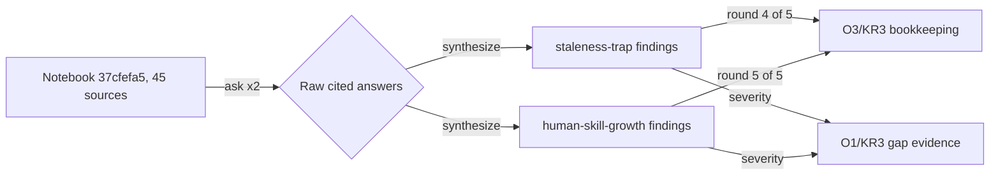

---
# Quality Chain Metadata (Alex 必填 - Phase 4 Hook 将基于此阻塞 Gate 3)
task_type: research   # deliverable = two research findings files (no code)
e2e_required: no
research_required: yes # Blake MUST produce the two findings files as research evidence

# No production code directories touched — doc-only deliverables into
# .tad/evidence/research/ (already a git-tracked dir).
git_tracked_dirs: []

skip_knowledge_assessment: no

gate4_delta: []

# Surplus provenance
epic: EPHEMERAL-surplus-o3-kr3-deep-ask-rounds-4-5
phase: deep-ask-rounds-4-5
authorization: "HUMAN-AUTHORIZED 2026-07-05 via *surplus review"
---

# Handoff Document for Agent B (Blake)
## TAD v3.1 - Evidence-Based Development

**From:** Alex (Agent A - Solution Lead)
**To:** Blake (Agent B - Execution Master)
**Date:** 2026-07-05
**Project:** TAD
**Task ID:** TASK-20260705-001
**Handoff Version:** 3.1.0
**Epic:** EPHEMERAL-surplus-o3-kr3-deep-ask-rounds-4-5.md (Phase 1/1)
**Supersedes:** N/A

---

## 🔴 Gate 2: Design Completeness (Alex必填)

**执行时间**: 2026-07-05

### Gate 2 检查结果

| 检查项 | 状态 | 说明 |
|--------|------|------|
| Architecture Complete | ✅ | Single pipeline: notebook ask → synthesis → findings files. No code architecture involved. |
| Components Specified | ✅ | research-notebook skill (ask sub-command, SKILL.md L271) + notebooklm CLI 0.3.4 (verified installed) + notebook `37cfefa5-52b3-4a8a-a8e3-a83f32150759` (verified in REGISTRY.yaml L55) |
| Functions Verified | ✅ | No functions called; CLI invocation path verified — see MQ2 |
| Data Flow Mapped | ✅ | Notebook (45 sources) → 2 ask rounds → 2 findings files → O3/KR3 count 3→5. See MQ3 |

**Gate 2 结果**: ✅ PASS

**Alex确认**: 我已验证所有设计要素，Blake可以独立根据本文档完成实现。

> Note: Expert review (Gate 2 step2-4) is Conductor-managed in this YOLO Epic run —
> see §9.2. Blake must not start until Conductor review completes.

---

## 📋 Handoff Checklist (Blake必读)

Blake在开始实现前，请确认：
- [ ] 阅读了所有章节
- [ ] **阅读了「📚 Project Knowledge」章节中的历史经验**
- [ ] 所有"强制问题回答（MQ）"都有证据
- [ ] 理解了真正意图（不只是字面需求）
- [ ] 每个Phase的交付物和证据要求都清楚
- [ ] 确认可以独立使用本文档完成实现

❌ 如果任何部分不清楚，**立即返回Alex要求澄清**，不要开始实现。

---

## 1. Task Overview

### 1.1 What We're Building

Execute NotebookLM deep-ask synthesis **rounds 4 and 5** for O3/KR3 against the
**TAD Evolution Research** notebook (registry id `tad-evolution-research`,
notebook_id `37cfefa5-52b3-4a8a-a8e3-a83f32150759`, 45 sources, status dormant,
3 rounds completed), and save two structured findings files:

- Round 4 — **Staleness Trap**: `.tad/evidence/research/2026-07-staleness-trap-findings.md`
- Round 5 — **Human skill growth**: `.tad/evidence/research/2026-07-human-skill-growth-findings.md`

### 1.2 Why We're Building It

**业务价值**：O3/KR3 ("Cross-source synthesis findings documented", OBJECTIVES.md L47)
has been stalled at 3/5 rounds since May. These two rounds bring it to 5/5 → DONE.
**用户受益**：The two questions are the exact named residual gaps from the 2026-06-09
repositioning research; answering them also feeds O1/KR3 ("Capability gaps identified
with severity assessment", OBJECTIVES.md L17) with severity-rated gap evidence.
**成功的样子**：当两个 findings 文件各含 ≥3 条带引用的跨源综合点 + O1/KR3 severity
判断，且 grep 可数出 round 4/5 记账时，这个任务就成功了。

### 1.3 🆕 Intent Statement（意图声明）

**真正要解决的问题**：把 2026-06-09 研究明确留下的两个 open questions（Staleness Trap
残留半衰期、人类技能是否真增长）用已有的 45-source notebook 做跨源综合回答，同时完成
O3/KR3 的轮次记账。

**不是要做的（避免误解）**：
- ❌ 不是 web search / deep-research skill 研究 — `*research` NotebookLM 路径是
  CLAUDE.md §2 规定的唯一入口（研究工具排除规则）
- ❌ 不是修改 OBJECTIVES/KR 定义、SKILL 文件或 project-knowledge（发现落盘即可，
  行动是后续任务）
- ❌ 不是给 notebook 加新 sources — 用现有 45 sources 综合

**Blake请确认理解**：
```
在开始实现前，请用你自己的话回答：
1. 这个功能解决什么问题？
2. 用户会如何使用？
3. 成功的标准是什么？

只有Human确认你的理解正确后，才能开始实现。
（YOLO Epic 模式下：由 Conductor 的 review 环节代行此确认。）
```

---

## 📚 Project Knowledge（Blake 必读）

**⚠️ MANDATORY READ — Blake 在开始实现前，必须执行以下 Read 操作：**
1. Read `.tad/project-knowledge/patterns/research-methodology.md`
2. Read `.tad/project-knowledge/patterns/ac-verification.md`
3. Read the "⚠️ Blake 必须注意的历史教训" entries below

### 步骤 1：识别相关类别

本次任务涉及的领域：
- [x] research-methodology — NotebookLM / cross-model / source quality
- [x] ac-verification — AC design, grep -c discipline
- [ ] code-quality / security / ux / architecture / performance / testing / api-integration / mobile-platform — 不适用

### 步骤 2：历史经验摘录

**已读取的 project-knowledge 文件**：

| 文件 | 相关记录数 | 关键提醒 |
|------|-----------|----------|
| patterns/research-methodology.md | 多条 | NotebookLM 是持久知识资产；引用要带 source 名与检索日期 |
| patterns/ac-verification.md | 多条 | grep AC 要防 self-leak；表格内正则的 `\|` 提取时要还原 |
| principles.md | 2 条直接相关 | 见下 |

**⚠️ Blake 必须注意的历史教训**：

1. **YOLO Epic 研究证据缺可审计性** (principles.md — YOLO Epic Cross-Model Audit 2026-05-15)
   - 问题：findings 只引工具名和数字、不带来源与检索日期 → 无法验证新鲜度/准确性
   - 解决方案：每条 synthesis point 必须带 `Sources:` 行（NotebookLM 返回的 source 名），
     Provenance 节写明 notebook id + 检索日期
2. **Honest partial 优于捏造** (principles.md — Express/Honest-partial 谱系)
   - 问题：notebook 覆盖不足时补造引用 = validation theater
   - 解决方案：覆盖薄弱处显式标 UNVERIFIED，宁可 honest-partial 也不虚构（见 NFR2）
3. **AI/Human Judgment Domain Awareness** (principles.md 2026-07-03)
   - 问题：severity 判断全交人 → 橡皮图章；全自判 → 方向域出错不自知
   - 解决方案：Blake 给出 severity 建议 + 理由（AI 域：文本综合）；"severity 是否符合
     人的优先级感受"留给 Gate 4 的人域选择题

### Blake 确认

- [ ] 我已阅读上述历史经验
- [ ] 我理解需要避免的问题
- [ ] 如遇到类似情况，我会参考上述解决方案

---

## 2. Background Context

### 2.1 Previous Work

- **Round 1**: `.tad/evidence/research/2026-05-05-tad-evolution-deep-ask-findings.md`
- **Rounds 2-3**: `.tad/evidence/research/2026-05-14-kr2-kr3-ask-findings.md`
- **Open-question provenance (2026-06-09)**:
  `.tad/evidence/research/repositioning-3-walls/2026-06-09-ask-findings.md` — GAP-2 (L130):
  "NO evidence of permanent INDEPENDENT human skill growth";
  `.tad/evidence/research/repositioning-3-walls/2026-06-09-depth-axis-findings.md` (L90):
  "Staleness Trap: residue half-life → hallucination anchor; needs autonomous deprecation".
- OBJECTIVES.md L56-57 HTML comments record the 2026-06-09 verdict naming both gaps.

### 2.2 Current State

- O3/KR3 status 🔄 at "3 rounds saved" vs target "≥5 deep-ask findings saved" (OBJECTIVES.md L47).
- Notebook `tad-evolution-research` is registered (REGISTRY.yaml L54-114), status
  **dormant**, last_queried 2026-05-31, 45 sources. Registry pre-check verified 2026-07-05.
- Target findings files do NOT exist yet (verified: `ls` fails for both, 2026-07-05).
- Toolchain verified 2026-07-05: `~/.tad-notebooklm-venv/bin/notebooklm` executable,
  version **0.3.4** (meets ≥0.3.4 requirement). Auth NOT pre-verified — Blake runs the
  skill preflight (auth check) as Step 1.

### 2.3 Dependencies

- NotebookLM cloud reachability + valid auth (`notebooklm auth check`). If auth/network
  fails → BLOCKED per §8.4, do NOT substitute web search.
- research-notebook skill: `.claude/skills/research-notebook/SKILL.md`
  (`ask` sub-command at L271; preflight block at L36-54).

---

## 3. Requirements

### 3.1 Functional Requirements

- **FR1 — Two deep-ask rounds**: Ask each question against notebook
  `37cfefa5-52b3-4a8a-a8e3-a83f32150759` via the research-notebook skill's `ask`
  sub-command with `--notebook` targeting (the registry `active_notebook` is
  currently `agent-computer-control` — the `--notebook` flag is MANDATORY).
  One round per question. The skill's dynamic-follow (max_depth 4) plus at most 2
  manual refinement asks per round are allowed; **the round is the QUESTION, not the
  individual API call**.
  - Round 4 question: "How does an agent framework's persistent instruction layer
    (CLAUDE.md / project-knowledge / accumulated residue) stay current as the
    underlying model's capabilities evolve? What staleness-detection, deprecation,
    and refresh mechanisms do the sources describe, and what failure modes follow
    from stale residue (hallucination anchoring, half-life decay)?"
  - Round 5 question: "Is there evidence that humans using AI-agent workflows gain
    permanent, independently exercisable skill — or only AI-augmented output that
    evaporates without the tool? What conditions (deliberate practice, explanation
    prompts, judgment-domain routing) differentiate the two outcomes?"
- **FR2 — Two findings files** (exact paths, repo-root relative):
  - `.tad/evidence/research/2026-07-staleness-trap-findings.md`
  - `.tad/evidence/research/2026-07-human-skill-growth-findings.md`
- **FR3 — File structure** (both files, exact H2 titles, load-bearing for ACs):
  1. `## Question` — the round's research question + round number (4 resp. 5) + notebook id
  2. `## Synthesis Points` — ≥3 points, numbered `### SP1` … `### SPn`; each point must
     synthesize across ≥2 sources (name them) and end with a line starting `Sources:`
     listing the cited source titles/identifiers as returned by NotebookLM
  3. `## TAD Implications` — mapping to the corresponding O1/KR3 capability gap:
     severity assessment (High/Medium/Low) with rationale + 1-2 concrete follow-up
     candidates (proposals only — NOT executed in this task)
  4. `## Provenance` — notebook id `37cfefa5-52b3-4a8a-a8e3-a83f32150759`, retrieval
     date 2026-07-05, tool + version used, and any UNVERIFIED/thin-coverage caveats
- **FR4 — Round bookkeeping**: staleness file contains the literal string
  `O3/KR3 round 4 of 5`; skill-growth file contains `O3/KR3 round 5 of 5` — so a
  later audit can count rounds by grep.

### 3.2 Non-Functional Requirements

- **NFR1 — Scope containment**: The ONLY new files are the two findings files. No edits
  to OBJECTIVES.md, SKILL files, hooks, or project-knowledge. Exception: the skill's own
  REGISTRY.yaml bookkeeping (`last_queried`, notes) is normal operation and allowed.
  OBJECTIVES.md status flip (🔄→✅) is Alex's job at acceptance, not Blake's.
- **NFR2 — Honest partial**: If the notebook genuinely lacks coverage for a question,
  say so in Provenance and mark affected points UNVERIFIED — never pad with invented
  citations. If <3 well-sourced points are achievable, deliver what is real and record
  honest-partial status in the completion report rather than fabricating.
- **NFR3 — Citation discipline**: match rounds 1-3 (source names as returned by
  NotebookLM, retrieval date stated).

### 3.3 Optimization Target

N/A — no numeric optimization goal.

---

## 4. Technical Design

### 4.1 Architecture Overview

```
research-notebook skill (preflight → ask --notebook 37cfefa5-…)
        │  2 questions, ≤2 refinement asks each + skill dynamic-follow
        ▼
raw NotebookLM answers (cited)
        │  Blake synthesizes per FR3 structure
        ▼
2 findings files in .tad/evidence/research/
        │  grep-countable bookkeeping (FR4)
        ▼
O3/KR3: 3/5 → 5/5 (Alex flips status at Gate 4)
```

### 4.2 Component Specifications

| Component | Location | Role |
|-----------|----------|------|
| notebooklm CLI 0.3.4 | `~/.tad-notebooklm-venv/bin/notebooklm` | ask execution (absolute path, never bare `notebooklm`) |
| research-notebook skill | `.claude/skills/research-notebook/SKILL.md` | preflight (L36-54) + `ask` protocol (L271+, dynamic-follow max_depth 4) |
| Notebook registry | `.tad/research-notebooks/REGISTRY.yaml` L54-114 | notebook_id + source inventory; skill updates last_queried |
| Findings files ×2 | `.tad/evidence/research/2026-07-*.md` | the deliverables |

### 4.3 Data Models

Findings file schema = FR3's 4 mandated H2 sections. Machine-checkable invariants:
`^## (Question|Synthesis Points|TAD Implications|Provenance)$` ×4, `^### SP[0-9]+` ≥3,
`^Sources:` count ≥ SP count, literal round-bookkeeping string, notebook id string.

### 4.4 API Specifications

Single external interface: `~/.tad-notebooklm-venv/bin/notebooklm ask "<question>" -n 37cfefa5-52b3-4a8a-a8e3-a83f32150759`
(via the skill's ask protocol). Fail-fast on CLI error per skill rules — no retry loops.

### 4.5 User Interface Requirements

N/A — no UI.

---

## 5. 🆕 强制问题回答（Evidence Required）

### MQ1: 历史代码搜索

**回答**：[x] 是 — Epic 引用"3 rounds completed"的既有产物。

#### 搜索证据
```bash
grep -rln "deep-ask\|deep ask" .tad/evidence/research/*.md .tad/research-notebooks/REGISTRY.yaml
# → 2026-05-05-tad-evolution-deep-ask-findings.md (round 1)
# → 2026-05-14-kr2-kr3-ask-findings.md (rounds 2-3, per OBJECTIVES.md L55 comment)
# → REGISTRY.yaml L61: "3 rounds of deep ask completed"
```

#### 决策说明
- **找到了什么**：rounds 1-3 findings 文件 + registry 轮次记录
- **位置**：见上
- **决定**：❌ 创建新的（两个新文件），✅ 复用其引用格式规范
- **原因**：每轮独立成文是既有惯例；修改旧文件会破坏历史记录的可审计性

### MQ2: 函数存在性验证

**回答**：本任务不调用代码函数；调用的是 CLI/skill 入口，逐一验证：

| 函数名/入口 | 文件位置 | 行号 | 代码片段 | 验证 |
|--------|---------|------|---------|------|
| notebooklm binary | `~/.tad-notebooklm-venv/bin/notebooklm` | N/A | `--version` → `NotebookLM CLI, version 0.3.4` | ✅ (2026-07-05 实测) |
| skill `ask` sub-command | `.claude/skills/research-notebook/SKILL.md` | L271 | `*research-notebook ask <question> [--notebook <id>]` | ✅ |
| notebook 注册项 | `.tad/research-notebooks/REGISTRY.yaml` | L54-61 | `notebook_id: "37cfefa5-52b3-4a8a-a8e3-a83f32150759"` / `source_count: 45` | ✅ (grep -c → 1) |

### MQ3: 数据流完整性

**回答**：无前端；数据流为 notebook → findings 文件 → KR 记账。

| 后端字段 | 用途说明 | 前端组件 | 是否显示 | 不显示原因 |
|---------|---------|---------|---------|-----------|
| NotebookLM answer + citations | synthesis 原料 | findings 文件 `## Synthesis Points` | ✅ | — |
| source titles | 可审计引用 | `Sources:` 行 | ✅ | — |
| round number | KR3 记账 | 文件内 literal 字符串 (FR4) | ✅ | — |
| severity 判断 | O1/KR3 输入 | `## TAD Implications` | ✅ | — |

#### 数据流图



### MQ4: 视觉层级

**回答**：[x] 无不同状态 → 跳过（无 UI）。

### MQ5: 状态同步

**回答**：

| 数据 | 存储位置1 | 存储位置2 | 同步时机 | 同步方向 |
|------|----------|----------|---------|---------|
| 轮次计数 | findings 文件 literal 字符串 (Source of Truth) | OBJECTIVES.md L47 状态列 | Gate 4 acceptance 时由 Alex 更新 | 文件 → OBJECTIVES |
| last_queried | REGISTRY.yaml | — | skill ask 自动更新 | 单向 |

```
[findings 文件] (主状态，Source of Truth，grep 可数)
      ↓ 同步时机：Gate 4 acceptance（Alex 手动，本任务不做）
[OBJECTIVES.md O3/KR3 状态]
```

---

## 6. Implementation Steps（分Phase）

## 6.1 Micro-Tasks

| # | File | Operation | Verification Command | Est. Time |
|---|------|-----------|---------------------|-----------|
| 1 | (none) | Run skill preflight: binary + version + auth check | `~/.tad-notebooklm-venv/bin/notebooklm auth check --test 2>&1 \| grep -q authenticated` | 2 min |
| 2 | (none) | Round 4 ask (Staleness Trap, `-n 37cfefa5-…`, ≤2 refinements) | raw answer text captured in session | 5 min |
| 3 | `.tad/evidence/research/2026-07-staleness-trap-findings.md` | Write per FR3 + FR4 | §9.1 AC2-AC6 greps on $R1 | 5 min |
| 4 | (none) | Round 5 ask (Human skill growth, same flags) | raw answer text captured in session | 5 min |
| 5 | `.tad/evidence/research/2026-07-human-skill-growth-findings.md` | Write per FR3 + FR4 | §9.1 AC2-AC6 greps on $R2 | 5 min |
| 6 | (none) | Run ALL §9.1 verification commands; paste outputs into completion report | all ACs pass | 3 min |

### Phase 1: deep-ask-rounds-4-5（预计 ~30 分钟，单 Phase）

#### 交付物
- [ ] `.tad/evidence/research/2026-07-staleness-trap-findings.md`
- [ ] `.tad/evidence/research/2026-07-human-skill-growth-findings.md`

#### 实施步骤
1. Micro-tasks 1-6 顺序执行。
2. Fallback：preflight 或 ask 失败（auth/network）→ **STOP，报 BLOCKED + 精确错误**，
   禁止改用 web search / deep-research skill（协议排除）。

#### 验证方法
- 运行 §9.1 全部命令应逐行 PASS。

#### 🆕 Phase 1 完成证据（Blake必须提供）
- [ ] §9.1 每行命令的原始输出（粘贴进 completion report）
- [ ] 两轮 ask 的原始问题文本 + 使用的 notebook flag
- [ ] honest-partial 情况说明（如有 UNVERIFIED 点）

**Human审查问题**（Gate 4，人域选择题）：
- 两个 severity 判断（High/Medium/Low + 理由）符合你的优先级感受吗？如不符，选哪档？

**Human决策**：✅ 接受 → O3/KR3 flips to DONE / ⚠️ 调整

---

## 7. File Structure

### 7.1 Files to Create
```
.tad/evidence/research/2026-07-staleness-trap-findings.md       # Round 4 deliverable
.tad/evidence/research/2026-07-human-skill-growth-findings.md   # Round 5 deliverable
```

### 7.2 Files to Modify
```
(none intentionally; .tad/research-notebooks/REGISTRY.yaml last_queried may be
 touched by the skill's normal ask bookkeeping — allowed per NFR1)
```

### 7.3 Grounded Against (Phase 2 P2.2 — Alex step1c)

**Grounded Against** (Alex 实际 Read 过的源文件):

- `.tad/active/epics/EPHEMERAL-surplus-o3-kr3-deep-ask-rounds-4-5.md` (full, read 2026-07-05)
- `.tad/research-notebooks/REGISTRY.yaml` (full — notebook entry L54-114, read 2026-07-05)
- `.claude/skills/research-notebook/SKILL.md` (head 80 + ask-protocol greps, read 2026-07-05)
- `OBJECTIVES.md` (KR3 sections L17/L47/L55-57, read 2026-07-05)
- `.tad/evidence/research/repositioning-3-walls/2026-06-09-ask-findings.md` (GAP-2 L130-149, read 2026-07-05)
- `.tad/evidence/research/repositioning-3-walls/2026-06-09-depth-axis-findings.md` (L80-100, read 2026-07-05)
- `.tad/active/SURPLUS-PLAN-2026-07-05.md` (task row L12, read 2026-07-05)
- `.tad/evidence/research/2026-07-staleness-trap-findings.md` — (new — will be created)
- `.tad/evidence/research/2026-07-human-skill-growth-findings.md` — (new — will be created)

> Grounding note: the YOLO workflow's expected grounding file
> `.tad/evidence/yolo/surplus-o3-kr3-deep-ask-rounds-4-5/phase1-grounding.md` did NOT
> exist at design time; grounding was performed directly against the sources above.

---

## 8. Testing Requirements

### 8.1 Unit Tests
N/A（无代码）。等价物 = §9.1 的逐文件结构 grep。

### 8.2 Integration Tests
- Preflight → ask → file write 全链路一次跑通即集成验证（micro-task 6）。

### 8.3 Edge Cases
- Notebook 覆盖薄弱 → NFR2 honest-partial 路径（UNVERIFIED 标注，不虚构）
- ask 超时/失败 → skill fail-fast 规则，保存已有链，报 BLOCKED
- active_notebook 指向别的 notebook → 必须显式 `-n 37cfefa5-…`（FR1）

## 8.4 Friction Preflight

| Friction Point | Required Step | Expected Fix Path | Allowed Substitute | Gate Impact |
|----------------|---------------|-------------------|--------------------|-------------|
| NotebookLM auth 过期 | `notebooklm auth check` 通过 | `bash .tad/cross-model/setup-notebooklm.sh` 重新认证；仍失败则报 BLOCKED | 无（web search 是协议禁用替代品） | Unresolved BLOCKED prevents Gate 3 PASS |
| 网络不可达 NotebookLM cloud | ask 调用成功 | 报 BLOCKED + 原始错误 | 无 | Unresolved BLOCKED prevents Gate 3 PASS |
| Notebook dormant（5 周未查询） | 首个 ask 正常返回 | dormant 只是标签，不阻塞查询；若 cloud 端 notebook 被删则报 BLOCKED | 无 | 同上 |
| 覆盖不足（<3 个可引用综合点） | FR3 ≥3 点 | NFR2 honest-partial：交付真实点数 + UNVERIFIED 标注 + completion report 说明 | honest-partial 状态本身即合法替代 | Gate 3 记 honest-partial，Gate 4 人裁 |

**Status Enum**: `READY` / `BLOCKED` / `DEGRADED_WITH_APPROVAL` / `EQUIVALENT_SUBSTITUTE` / `NOT_APPLICABLE_WITH_REASON`

## 8.5 Feedback Collection (Non-Code Artifacts)

N/A — findings 文件由 §9.1 机器检查 + Gate 4 人域选择题覆盖，不走 feedback HTML。

```yaml
feedback_required: false
```

## 8.6 🆕 Test Evidence Required

Blake必须提供：
- [ ] §9.1 全部命令的原始输出（completion report 内）
- [ ] 两轮 ask 的实际 CLI 调用（含 `-n` flag）证据
- [ ] （不适用截图/覆盖率 — 无代码）

---

## 9. Acceptance Criteria

Blake的实现被认为完成，当且仅当：
- [ ] FR1-FR4 全部满足并有证据
- [ ] §9.1 所有行 PASS（或 NFR2 honest-partial 显式记录）
- [ ] NFR1 scope 干净（git status 复核）
- [ ] Human (Gate 4) 确认 severity 判断"这是我期望的"

---

## 9.1 Spec Compliance Checklist ⚠️ PRIMARY VERIFICATION SOURCE — Gate 3 executes each row

> Shell setup (repo root):
> `R1=".tad/evidence/research/2026-07-staleness-trap-findings.md"`
> `R2=".tad/evidence/research/2026-07-human-skill-growth-findings.md"`
> Pipe-escape note: `\|` in table cells un-escapes to `|` when run.

| # | Acceptance Criterion | Verification Type | Verification Method | Expected Evidence | Verified Output (Alex step1d) |
|---|---------------------|-------------------|--------------------|--------------------|-------------------------------|
| AC0a | Notebook registered with correct id | pre-impl-verifiable | `grep -c "37cfefa5-52b3-4a8a-a8e3-a83f32150759" .tad/research-notebooks/REGISTRY.yaml` | ≥ 1 | `1` (2026-07-05) |
| AC0b | notebooklm CLI present at required version | pre-impl-verifiable | `~/.tad-notebooklm-venv/bin/notebooklm --version` | version ≥ 0.3.4 | `NotebookLM CLI, version 0.3.4` (2026-07-05) |
| AC0c | Target files absent pre-impl (no clobber) | pre-impl-verifiable | `ls "$R1" "$R2"` | both "No such file" pre-impl | `ls: … No such file or directory` ×2 (2026-07-05) |
| AC1 | Both findings files exist and are non-trivial | post-impl-verifiable | `test -s "$R1" && test -s "$R2" && wc -l "$R1" "$R2"` | exit 0; each ≥ 40 lines | (post-impl) |
| AC2 | Each file has ≥3 synthesis points | post-impl-verifiable | `grep -cE '^### SP[0-9]+' "$R1"; grep -cE '^### SP[0-9]+' "$R2"` | ≥ 3 each | (post-impl) |
| AC3 | Every synthesis point carries citations | post-impl-verifiable | `test $(grep -cE '^Sources:' "$R1") -ge $(grep -cE '^### SP[0-9]+' "$R1") && test $(grep -cE '^Sources:' "$R2") -ge $(grep -cE '^### SP[0-9]+' "$R2") && echo PASS` | `PASS` | (post-impl) |
| AC4 | 4 mandated H2 sections present in both files | post-impl-verifiable | `grep -cE '^## (Question\|Synthesis Points\|TAD Implications\|Provenance)$' "$R1"; grep -cE '^## (Question\|Synthesis Points\|TAD Implications\|Provenance)$' "$R2"` | 4 each | (post-impl) |
| AC5 | Round bookkeeping literal strings | post-impl-verifiable | `grep -c 'O3/KR3 round 4 of 5' "$R1"; grep -c 'O3/KR3 round 5 of 5' "$R2"` | ≥ 1 each | (post-impl) |
| AC6 | Notebook provenance + retrieval date recorded | post-impl-verifiable | `grep -c '37cfefa5' "$R1"; grep -c '37cfefa5' "$R2"; grep -c '2026-07-05' "$R1"; grep -c '2026-07-05' "$R2"` | ≥ 1 each (4 counts) | (post-impl) |
| AC7 | Scope clean per NFR1 | post-impl-verifiable | `git status --porcelain` | new/modified limited to the 2 findings files + REGISTRY.yaml bookkeeping + epic/handoff/completion bookkeeping; nothing in OBJECTIVES.md / SKILLs / project-knowledge | (post-impl) |
| AC8 | Severity assessment present in both files | post-impl-verifiable | `grep -cE 'Severity: (High\|Medium\|Low)' "$R1"; grep -cE 'Severity: (High\|Medium\|Low)' "$R2"` | ≥ 1 each | (post-impl) |

Done = AC1-AC8 all pass → O3/KR3 moves 3/5 → 5/5; Alex flips OBJECTIVES.md status at
Gate 4 and notes the two O1/KR3 severity assessments in the acceptance record.

---

## 9.2 Expert Review Status (Alex 必填)

### Audit Trail

| Reviewer | Issue | Resolution Section | Status |
|----------|-------|-------------------|--------|
| (Conductor-managed) | YOLO Epic workflow: expert review runs as the workflow's dedicated review step AFTER this design step; per run constraints Alex did not spawn reviewers inside design | — | Open (pending Conductor review) |

**Status legend:** Resolved / Open / Deferred

### Experts Selected

Selection delegated to the Conductor's review step (yolo-epic workflow). Suggested
lenses for the Conductor: (1) research-methodology reviewer — question quality +
citation discipline; (2) AC-verification reviewer — §9.1 grep robustness (BSD grep,
self-leak, pipe-escape).

### Overall Assessment (post-integration)

- Pending Conductor review — Blake MUST NOT start implementation before the review
  step completes and P0s (if any) are integrated.

---

## 10. Important Notes

### 10.1 Critical Warnings
- ⚠️ **绝不改用 web search / deep-research skill** — 即使 NotebookLM 失败。失败 = BLOCKED，
  不是换工具（CLAUDE.md §2 研究工具排除 + Epic Out of Scope）。
- ⚠️ **必须带 `-n 37cfefa5-52b3-4a8a-a8e3-a83f32150759`** — registry 的 active_notebook
  当前指向 `agent-computer-control`，省略 flag 会问错 notebook。
- ⚠️ **不虚构引用** — 覆盖不足走 honest-partial（NFR2），validation theater 是本项目
  L1 principles 点名的失败模式。

### 10.2 Known Constraints
- Notebook 状态 dormant（2026-05-31 起未查询）— 查询本身会把它唤醒，属正常。
- 每轮 ≤2 次手动 refinement + skill 内建 dynamic-follow（max_depth 4）；不许无限追问。
- 本任务不修改 OBJECTIVES/KR/SKILL/project-knowledge（NFR1）。

### 10.3 🆕 Sub-Agent使用建议

Blake应该考虑使用：
- [ ] parallel-coordinator — 不需要（两轮有先后依赖弱但串行更稳，总量小）
- [ ] bug-hunter — 仅当 CLI 报错需诊断时
- [ ] test-runner — 不适用；用 micro-task 6 的 §9.1 命令自验
- [ ] refactor-specialist — 不适用

---

## 11. 🆕 Learning Content（可选）

### 11.1 Decision Rationale: 为什么用既有 notebook 而非新建/网搜

**选择的方案**：对 45-source 既有 notebook 做 2 轮 targeted ask。

**考虑的替代方案**：

| 方案 | 优点 | 缺点 | 为什么没选 |
|------|------|------|-----------|
| 既有 notebook ask（选中）| 零建库成本；引用可审计；恰好是 KR3 的定义动作 | 覆盖受限于 2026-05 的 45 sources | ✅ 选中 |
| 新建 notebook + 新 sources | 覆盖新 | 建库成本高；不推进 O3/KR3 轮次记账本意 | KR3 数的是"对既有库的综合轮次" |
| WebSearch / deep-research | 最新信息 | 协议禁用；引用不落持久知识库 | CLAUDE.md 研究工具排除 |

**💡 Human学习点**：KR 的"完成"要按 KR 的度量定义执行 —— O3/KR3 度量的是持久知识库的
综合轮次，不是"任何研究都算"。

---

## 12. 🆕 Sub-Agent使用记录

Blake完成后填写：

| Sub-Agent | 是否调用 | 调用时机 | 输出摘要 | 证据链接 |
|-----------|---------|---------|---------|---------|
| parallel-coordinator | ✅/❌ | | | |
| bug-hunter | ✅/❌ | | | |
| test-runner | ✅/❌ | | | |

**Human验证点**：应该调用的都调用了吗？

---

**Handoff Created By**: Alex (Agent A)
**Date**: 2026-07-05
**Version**: 3.1.0
