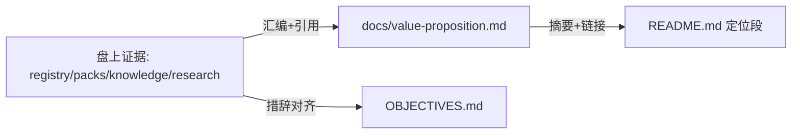

---
# Quality Chain Metadata (Alex 必填 - Phase 4 Hook 将基于此阻塞 Gate 3)
task_type: doc-only   # docs repositioning: README.md + OBJECTIVES.md edits + new docs/value-proposition.md
e2e_required: no      # no runtime behavior changes
research_required: no # evidence already exists on disk; task is synthesis + doc edits
git_tracked_dirs: ["docs"]  # new docs/value-proposition.md must be git-tracked at Gate 3
skip_knowledge_assessment: no  # positioning work may surface real findings (narrative-vs-evidence gaps)
gate4_delta: []
# Surplus provenance
epic: EPHEMERAL-surplus-repositioning-capability-acquisition
phase: reposition-docs (Phase 1/1)
authorization: "surplus auto-execution (source: ideas backlog)"
---

# Handoff Document for Agent B (Blake)
## TAD v3.1 - Evidence-Based Development

**From:** Alex (Agent A - Solution Lead)
**To:** Blake (Agent B - Execution Master)
**Date:** 2026-07-05
**Project:** TAD
**Task ID:** TASK-20260705-001
**Handoff Version:** 3.1.0
**Epic:** EPHEMERAL-surplus-repositioning-capability-acquisition.md (Phase 1/1)
**Supersedes:** N/A

---

## 🔴 Gate 2: Design Completeness (Alex必填)

**执行时间**: 2026-07-05 22:30

### Gate 2 检查结果

| 检查项 | 状态 | 说明 |
|--------|------|------|
| Architecture Complete | ✅ | Doc-only：3 个交付物边界清晰（README 定位段、OBJECTIVES 修订、新 value-proposition.md） |
| Components Specified | ✅ | 每个交付物的必含内容在 FR1-FR4 中逐条列出 |
| Functions Verified | ✅ | 无代码函数调用；所有引用的证据路径已由 Alex 在盘上 `test -e` 验证（见 §5 MQ2 与 §7.3） |
| Data Flow Mapped | ✅ | 单向：盘上证据 → value-proposition.md → README 链接；无状态同步 |

**Gate 2 结果**: ✅ PASS

**Alex确认**: 我已验证所有设计要素，Blake可以独立根据本文档完成实现。

> ⚠️ 备注：Epic 引用的 grounding 文件
> `.tad/evidence/yolo/surplus-repositioning-capability-acquisition/phase1-grounding.md`
> **在盘上不存在**（目录未创建）。Alex 已改为直接对真实文件做 grounding
> （README.md 392 行、OBJECTIVES.md 57 行、docs/ 目录清单、sync-registry.yaml 14 项目、
> 候选证据路径逐一 `test -e`），结果记录在 §2.2 与 §7.3。Blake 无需寻找该 grounding 文件。

---

## 📋 Handoff Checklist (Blake必读)

Blake在开始实现前，请确认：
- [ ] 阅读了所有章节
- [ ] **阅读了「📚 Project Knowledge」章节中的历史经验**
- [ ] 所有"强制问题回答（MQ）"都有证据
- [ ] 理解了真正意图（不只是字面需求）
- [ ] 每个Phase的交付物和证据要求都清楚
- [ ] 确认可以独立使用本文档完成实现

❌ 如果任何部分不清楚，**立即返回Alex要求澄清**，不要开始实现。

---

## 1. Task Overview

### 1.1 What We're Building

Three doc deliverables that align TAD's public narrative with its evidence-backed value:

1. **`README.md`** — a new positioning H2（置于 Philosophy 之后、Installation 之前）：
   TAD is a **capability acquisition methodology** — human + AI agents + persistent
   documents (handoffs, project-knowledge, capability packs, research notebooks)
   compounding capability over time. Explicit non-goal: NOT a software-dev framework
   competing with Devin/LangGraph-class autonomous coding / orchestration products.
2. **`OBJECTIVES.md`** — revise objective wording to the capability-acquisition mission
   while preserving the existing OKR structure (O1-O3, KR tables, comment trailer).
3. **NEW `docs/value-proposition.md`** — the full grounded argument: what TAD actually
   delivered across 14 registered downstream projects and multiple non-code domains
   (voice/podcast production, reading companion, academic research, 24 capability packs,
   knowledge systems), every claim cited to a real on-disk artifact path.

### 1.2 Why We're Building It

**业务价值**：TAD 现有文档把自己框成 dev-workflow framework，招致与它并不竞争的
agent-orchestration 产品比较，同时低估了它已被证明的价值——单个人类跨任意领域的
可重复能力获取。
**用户受益**：唯一真实用户（及未来读者）看到的叙事与 14 个下游项目的真实用法一致。
**成功的样子**：当读者读完 README 定位段 + value-proposition.md 后，能准确说出
"TAD 是能力获取方法论，不是和 Devin 抢活的编码 agent"，且每个价值主张可以顺着
引用路径在盘上核实时，这个功能就成功了。

### 1.3 🆕 Intent Statement（意图声明）

**真正要解决的问题**：docs 的叙事与实际价值错位；把叙事校准到证据支持的定位。

**不是要做的（避免误解）**：
- ❌ 不是营销吹捧 — 每个价值主张必须引用一个真实盘上证据（文件路径），否则降级为方向性表述或删除
- ❌ 不是重写整个 README — 只动定位相关段落；安装、命令、changelog、Troubleshooting 不碰
- ❌ 不是改任何代码/SKILL/hook/gate 协议（Epic Out of Scope 明确排除）
- ❌ 不是发布 — 不做版本 bump，不跑 *publish / *sync

**Blake请确认理解**：
```
在开始实现前，请用你自己的话回答：
1. 这个功能解决什么问题？
2. 用户会如何使用？
3. 成功的标准是什么？

（Surplus 自动执行模式：确认写入 completion notes 即可，无需等待人类实时回复。）
```

---

## 📚 Project Knowledge（Blake 必读）

**⚠️ MANDATORY READ — Blake 在开始实现前，必须执行以下 Read 操作：**
1. Read `.tad/project-knowledge/principles.md`（与本任务直接相关的条目见下表）
2. Read the handoff's "⚠️ Blake 必须注意的历史教训" entries carefully
3. This is NOT optional — project knowledge prevents repeated mistakes

### 步骤 1：识别相关类别

本次任务涉及的领域（勾选所有适用项）：
- [x] architecture - 定位/叙事是方法论级决策
- [x] testing - AC 设计与验证纪律（doc greps）
- [ ] code-quality / security / ux / performance / api-integration / mobile-platform - 不适用

### 步骤 2：历史经验摘录

**已读取的 project-knowledge 文件**：

| 文件 | 相关记录数 | 关键提醒 |
|------|-----------|----------|
| principles.md | 3 条 | AI/Human 判断域；证据优先；版本 grep 要 scope 到 git ls-files |
| patterns/ac-verification.md | 按需 | AC 命令必须可直接运行；grep -c 计数陷阱 |

**⚠️ Blake 必须注意的历史教训**：

1. **AI/Human Judgment Domain Awareness** (来自 principles.md, 2026-07-03)
   - 问题：定位/叙事是"方向对不对"的人域判断，AI 不应自判终稿质量。
   - 解决方案：技术验证（路径存在、结构完整）由 AC 命令自查；叙事质量留给
     Gate 4 人类验收，且 completion notes 里给人**选择题式**摘要（改了什么、为何这样改），
     不是"对不对？"验证题。

2. **Deny-List / Version Grep 教训的 doc 版** (来自 principles.md, 2026-06-01)
   - 问题：一致性 sweep 若用裸 FS grep 会命中 archive/legacy 噪声，训练人忽略告警。
   - 解决方案：FR4 的 stale-framing sweep 只 scope 到本次 3 个交付文件，不做全库 grep。

3. **Knowledge Is Forged at Distill, Not Captured** (来自 principles.md, 2026-06-22)
   - 问题：doer 写"完成的知识"会带知识诅咒。
   - 解决方案：value-proposition.md 的证据引用必须让零上下文读者可循径核实
     （路径 + 一句话说明该路径证明什么），不写只有作者懂的内部黑话。

### Blake 确认

- [ ] 我已阅读上述历史经验
- [ ] 我理解需要避免的问题
- [ ] 如遇到类似情况，我会参考上述解决方案

---

## 2. Background Context

### 2.1 Previous Work

- Epic 来源：`*surplus` ideas backlog；Epic 文件
  `.tad/active/epics/EPHEMERAL-surplus-repositioning-capability-acquisition.md`。
- 相关先例：2026-06-09 repositioning stress-test（OBJECTIVES.md 尾部注释引用
  `.tad/evidence/research/repositioning-3-walls/2026-06-09-ask-findings.md`）——
  三面"定位墙"被证伪，幸存定位是 "displaced-expert operating system" 方向；
  本次 capability-acquisition 框架与该结论一致，写作时可参考但不要求引用。
- 用户既有反馈：deflated-mechanism 风格（先讲机制和证据，不喊口号）。

### 2.2 Current State（Alex 实测，2026-07-05）

- `README.md` 392 行。现有 H2 结构（节选）：`## 💡 Philosophy: Beneficial Friction`(L9)、
  `## 🔄 Codex CLI Support`(L51)、`## 🎯 What's New in v2.33`(L65)、
  `## 🚀 Installation & Upgrade`(L80)、`## 🔺 The Triangle Model`(L147)、
  `## 🤔 When to Use TAD`(L320)、`## 💡 Key Principles`(L336)。
  **无任何 "capability acquisition" 字样**（`grep -ci` = 0）。
  "When to Use TAD" 一节完全以 dev 任务（feature/refactor/bugfix）定义使用边界 —— 是主要错位点之一。
- `OBJECTIVES.md` 57 行，OKR 格式（O1 竞争定位 / O2 升级方向 / O3 研究知识库），
  `grep -ci 'capability acquisition'` = 0。O1 的框架是"AI Agent framework 竞争格局"——
  正是要修订的 dev-framework 视角。
- `docs/value-proposition.md` **不存在**；`docs/` 目录已存在（含 README.md、TAD-OVERVIEW.md 等）。
- `.tad/sync-registry.yaml` 存在，注册 **14 个下游项目**（`grep -c '  - '` = 14）。
- Epic 引用的 grounding 文件不存在（见 Gate 2 备注）；本节即替代 grounding。

### 2.3 Dependencies

- 无外部依赖。全部素材在本仓库盘上。
- 不依赖网络；禁止为"补证据"发起 web research（research_required: no）。

---

## 3. Requirements

### 3.1 Functional Requirements

- **FR1 — README positioning section**: 新增一个 H2 `## 🧭 What TAD Is`（或语义等价标题，
  必须含 "capability acquisition" 字样），位置在 Philosophy 段之后、Installation 之前。
  必含三要素：(a) capability acquisition methodology 定义（human + AI + documents 复利）；
  (b) 显式非目标对比：不与 Devin/LangGraph 类自主编码/编排框架竞争（点名至少这两个作对照）；
  (c) 一段跨域证据摘要 + 指向 `docs/value-proposition.md` 的链接。
  同时把 `## 🤔 When to Use TAD` 中纯 dev 的措辞放宽为跨域表述（保留原 dev 例子，但不再暗示仅限软件开发）。
- **FR2 — OBJECTIVES revision**: 把 `OBJECTIVES.md` 的目标表述修订为 capability-acquisition
  框架（如 O1 的 "AI Agent framework competitive landscape" 视角改为能力获取定位视角）。
  **保留 OKR 结构**（O1-O3 编号、KR 表格、尾部 HTML 注释）——改措辞不毁结构。
  在被修订处加 `<!-- repositioned 2026-07-05 -->` 注释或带日期的 changelog 行，使 delta 可审计。
- **FR3 — value-proposition doc**: 创建 `docs/value-proposition.md`，至少含 4 个 H2：
  `## The Claim`、`## The Evidence`、`## What TAD Is Not`、`## Who It Is For`。
  Evidence 一节必须引用 ≥5 个具体跨域使用实例，每个附真实盘上证据路径。
  Blake 引用每个路径前必须 `test -e` 验证（Alex 已预验证的候选见 §5 MQ2 表）。
- **FR4 — Consistency sweep**: 编辑完成后，在 **本次 3 个交付文件内**（不做全库 grep）
  搜索残留旧定位表述（如以 "software dev framework" / "development methodology" 作为
  主要身份的句子）并消解——同一文件内不得同时存在新旧定位互相矛盾。

### 3.2 Non-Functional Requirements

- **NFR1 — Evidence over rhetoric**: 新增/修改的每个价值主张要么 (a) 引用盘上文物路径，
  要么 (b) 明确写成方向/意图，绝不写成既成事实。
- **NFR2 — Scope discipline**: 只修改/创建 `README.md`、`OBJECTIVES.md`、
  `docs/value-proposition.md` 三个文件。无版本 bump、无代码、无 SKILL 编辑。
- **NFR3 — Tone**: deflated-mechanism 风格——先讲它做什么、为什么，不用口号开头。

---

## 4. Technical Design

### 4.1 Architecture Overview

Doc-only 叙事手术。信息流单向：盘上证据（sync-registry、SKILL packs、project-knowledge、
evidence/research）→ 汇编进 `docs/value-proposition.md`（证据全文）→ `README.md` 定位段
（摘要 + 链接）→ `OBJECTIVES.md`（目标措辞对齐）。无代码、无运行时、无状态。

### 4.2 Component Specifications

| 交付物 | 操作 | 关键规格 |
|--------|------|----------|
| README.md | 编辑 | 新 H2 定位段（FR1 三要素）+ When-to-Use 措辞放宽；其余节 byte-for-byte 保留 |
| OBJECTIVES.md | 编辑 | 措辞修订 + 结构保留 + 日期标记（FR2） |
| docs/value-proposition.md | 新建 | 4 个必含 H2 + ≥5 条带路径证据（FR3） |

### 4.3 Data Models

N/A（无数据结构）。唯一"模型"是 Evidence 条目形状：`领域 — 一句话成果 — 盘上路径`。

### 4.4 API Specifications

N/A。

### 4.5 User Interface Requirements

N/A（Markdown 文档；遵循仓库现有 README 的标题/表格风格即可）。

---

## 5. 🆕 强制问题回答（Evidence Required）

### MQ1: 历史代码搜索

**问题**：用户是否提到"之前的"、"原来的"、"我们的方案"？

**回答**：
- [x] 是 → Epic 要求"add/replace a positioning section"，需确认现状

#### 搜索证据
```bash
grep -ci 'capability acquisition' README.md   # → 0
grep -ci 'capability acquisition' OBJECTIVES.md  # → 0
grep -n "^## " README.md   # → 15 个 H2，无现成定位专节（Philosophy 最接近，保留不动）
test -e docs/value-proposition.md   # → absent
```

#### 决策说明
- **找到了什么**：README 无定位专节；Philosophy 段（L9-49）讲的是 Beneficial Friction 机制，不是身份定位
- **位置**：README.md L9-49（Philosophy）、L320-334（When to Use）
- **决定**：✅ 新建定位 H2（不复用/不改写 Philosophy 段）；When-to-Use 就地放宽措辞
- **原因**：Philosophy 讲"怎么工作"，定位段讲"是什么/不是什么"——职责不同，混写会破坏两者

### MQ2: 函数存在性验证

**问题**：设计中调用了哪些函数？它们都存在吗？

**回答**：doc-only，无函数调用。等价物是**证据路径存在性**（Alex 已于 2026-07-05 实测）：

#### 证据路径清单（🆕 必填表格 — 函数表的 doc 等价物）

| 证据路径 | 证明什么 | 验证 |
|----------|---------|------|
| `.tad/sync-registry.yaml` | 14 个注册下游项目（跨域采用面） | ✅ exists, 14 entries |
| `.claude/skills/ai-voice-production/SKILL.md` | 语音生产能力包（非代码域） | ✅ exists |
| `.claude/skills/ai-podcast-production/SKILL.md` | 播客生产能力包（非代码域） | ✅ exists |
| `.claude/skills/reading-companion/SKILL.md` | 阅读伴侣（EPUB→标注阅读面，非代码域） | ✅ exists |
| `.claude/skills/academic-research/SKILL.md` | 学术研究能力包（非代码域） | ✅ exists |
| `.tad/project-knowledge/principles.md` | 知识复利机制的活证据（15+ 条 distilled 原则） | ✅ exists |
| `.tad/evidence/research/agent-knowledge-systems/2026-06-22-findings.md` | 研究系统产出实例 | ✅ exists |
| `.tad/evidence/research/` (目录) | 持久研究知识库 | ✅ exists |

Blake 可另选证据，但每条引用前必须自行 `test -e`。
（注意 `.tad/sync-registry.json` **不存在** —— 正确扩展名是 `.yaml`。）

### MQ3: 数据流完整性

**问题**：后端计算/返回了哪些字段？前端都显示了吗？

**回答**：N/A（无后端/前端）。等价检查：value-proposition.md 的每条 Evidence 是否都被
README 摘要段代表？—— 要求 README 摘要提到"跨域"+"14 个项目"两个事实并链接全文即可，
不要求逐条复述。

#### 数据流图（🆕 必填）



### MQ4: 视觉层级

**问题**：功能有不同状态/类型吗？用户如何区分？

**回答**：
- [x] 无不同状态 → 跳过（静态文档，无状态/类型区分）

### MQ5: 状态同步

**问题**：数据存在几个地方？什么时候同步？

**回答**：定位表述存在 3 个文件中，但**单一事实源是 `docs/value-proposition.md`**：

```
docs/value-proposition.md (全文, Source of Truth)
   ↑ README 定位段 = 摘要+链接（不复制细节 → 不产生漂移面）
   ↑ OBJECTIVES = 目标措辞对齐（引用方向，不复制证据清单）
✅ 同步时机：本 handoff 一次性建立；后续漂移由 FR4 式 sweep 在未来维护时捕获
```

**Human验证点**：README/OBJECTIVES 是否只保留摘要级复述（细节单源）？

---

## 6. Implementation Steps（分Phase）

## 6.1 Micro-Tasks (Optional — recommended for Full/Standard TAD)

| # | File | Operation | Verification Command | Est. Time |
|---|------|-----------|---------------------|-----------|
| 1 | (read-only) README.md + OBJECTIVES.md | 全文通读，列出定位相关段与残留旧表述清单（写入 completion notes） | inventory 见 completion notes | 5 min |
| 2 | (read-only) 证据收集 | 从 §5 MQ2 表出发，`test -e` 每条最终引用路径，锁定 ≥5 条 | 每路径 `test -e` exit 0 | 5 min |
| 3 | docs/value-proposition.md | 新建：4 个 H2 + ≥5 条带路径证据 | AC3, AC4 | 15 min |
| 4 | README.md | 新增定位 H2（FR1 三要素）+ When-to-Use 措辞放宽 | AC1 | 10 min |
| 5 | OBJECTIVES.md | 措辞修订 + `<!-- repositioned 2026-07-05 -->` 标记 | AC2 | 5 min |
| 6 | (verify) 3 个交付文件 | FR4 一致性 sweep + 跑全部 AC 命令 | AC5 + 全 AC 绿 | 5 min |

### Micro-Task Rules
- Each task targets ONE file
- Verification is runnable: a grep, test, or `git status` command

---

### Phase 1: reposition-docs（预计 <1 小时，单 Phase）

#### 交付物
- [ ] `docs/value-proposition.md`（新建）
- [ ] `README.md` 定位段（编辑）
- [ ] `OBJECTIVES.md` 修订（编辑）

#### 实施步骤
1. Micro-task 1-2（inventory + 证据锁定）
2. Micro-task 3（先写全文证据 doc — 它是单一事实源）
3. Micro-task 4-5（README/OBJECTIVES 引用它）
4. Micro-task 6（sweep + AC 验证）

#### 验证方法
- 运行 §9.1 每行 Verification Method，应得到对应 Expected Evidence

#### 🆕 Phase 1 完成证据（Blake必须提供）
- [ ] **AC 命令输出**：§9.1 全表逐行的真实命令输出（粘贴，不转述）
- [ ] **`git status --porcelain` 输出**：证明只动了 3 个交付文件（+ handoff/epic 簿记）
- [ ] **Evidence 路径核验记录**：每条被引用路径的 `test -e` 结果

**Human审查问题**：定位读起来对吗？（人域判断 — 方向/品味）
**Human决策**：✅ 接受 / ⚠️ 调整措辞

---

## 7. File Structure

### 7.1 Files to Create
```
docs/value-proposition.md  # Full grounded positioning argument (FR3)
```

### 7.2 Files to Modify
```
README.md      # New positioning H2 + When-to-Use wording (FR1, FR4)
OBJECTIVES.md  # Capability-acquisition goal wording + dated marker (FR2, FR4)
```

### 7.3 Grounded Against (Phase 2 P2.2 — Alex step1c, 2026-04-24)

**Grounded Against** (Alex step1c 实际 Read 过的源文件):

- README.md, L1-60 全读 + L147-180 + L320-356 + 全部 H2 标题清单, read at 2026-07-05 22:28
- OBJECTIVES.md, 全文 57 行, read at 2026-07-05 22:28
- docs/ 目录清单 (`ls docs/`), read at 2026-07-05 22:27
- .tad/sync-registry.yaml, head 20 + 项目计数 (14), read at 2026-07-05 22:29
- .tad/active/epics/EPHEMERAL-surplus-repositioning-capability-acquisition.md, 全文, read at 2026-07-05 22:26
- docs/value-proposition.md — (new — will be created)
- ⚠️ Epic 引用的 phase1-grounding.md 不存在于盘上；以上直接 grounding 为其替代（见 Gate 2 备注）

---

## 8. Testing Requirements

### 8.1 Unit Tests

N/A（doc-only）。等价物 = §9.1 的逐行 grep/test 命令。

### 8.2 Integration Tests

- Test README→doc 链接：README 中 `docs/value-proposition.md` 链接指向的文件存在（AC1+AC3 联合覆盖）。

### 8.3 Edge Cases

- 证据不足 5 条：不得注水——报告真实数量并按 honest-partial 处理（见 §10.1）。
- 引用路径含空格（本仓库路径含 "01-on progress programs"）：引用用仓库相对路径，验证命令在仓库根执行并加引号。
- OBJECTIVES 尾部 HTML 注释块：属于研究溯源记录，**保留**，不当作"旧定位残留"删除。

## 8.4 Friction Preflight

| Friction Point | Required Step | Expected Fix Path | Allowed Substitute | Gate Impact |
|----------------|---------------|-------------------|--------------------|-------------|
| Grounding 文件缺失 | 读取 Epic 引用的 phase1-grounding.md | Alex 已用直接盘上 grounding 替代（§2.2/§7.3） | EQUIVALENT_SUBSTITUTE（已发生，记录在案） | 无 — 替代已完成且等价 |
| 专家审查（Layer 2） | Gate 2 expert review | Orchestrator 的 review stage 在 implement 前执行 | 无（不得自审替代） | Review 缺失阻塞 Gate 3 PASS |
| 无其他 | — | — | — | No friction-sensitive prerequisites beyond the above |

**Status Enum**: `READY` / `BLOCKED` / `DEGRADED_WITH_APPROVAL` / `EQUIVALENT_SUBSTITUTE` / `NOT_APPLICABLE_WITH_REASON`

## 8.5 Feedback Collection (Non-Code Artifacts)

```yaml
feedback_required: false   # Phase 1 规则：read_feedback_protocol 未上线前必须 false
artifact_type: generic
suggested_dimensions:
  - "positioning accuracy (does the claim match the evidence)"
  - "tone (deflated mechanism, not slogan)"
notes: "叙事质量属人域判断，由 Gate 4 人类验收承担，不走 feedback HTML"
```

## 8.6 🆕 Test Evidence Required

Blake必须提供：
- [ ] §9.1 全表逐行命令的真实输出（粘贴原文）
- [ ] `git status --porcelain` 输出（scope 证明）
- [ ] 每条被引用证据路径的 `test -e` 核验记录
- [ ] （覆盖率报告 N/A — doc-only）

---

## 9. Acceptance Criteria

Blake的实现被认为完成，当且仅当：
- [ ] FR1-FR4 全部实现并按 §9.1 逐行验证
- [ ] Phase 1 完成证据（§6）全部提供
- [ ] 所有 §9.1 AC 命令输出符合 Expected Evidence（粘贴证明）
- [ ] 无 UI（N/A）
- [ ] Human 验证"定位读起来是对的"（Gate 4 人域判断）

---

## 9.1 Spec Compliance Checklist ⚠️ PRIMARY VERIFICATION SOURCE — Gate 3 executes each row

> 所有命令在仓库根 `/Users/sheldonzhao/01-on progress programs/TAD` 执行。
> Pipe-escape note: 表格内 `\|` 提取到 bash 时须还原为 `|`。

| # | Acceptance Criterion | Verification Type | Verification Method | Expected Evidence | Verified Output (Alex step1d) |
|---|---------------------|-------------------|--------------------|--------------------|-------------------------------|
| AC0a | 基线：README 当前无 capability-acquisition 表述（证明本 handoff 非空转） | pre-impl-verifiable | `grep -ci 'capability acquisition' README.md` | 0 (pre-impl) | `0` (run 2026-07-05 22:29) |
| AC0b | 基线：value-proposition doc 当前不存在 | pre-impl-verifiable | `test -e docs/value-proposition.md; echo $?` | 1 (pre-impl) | `1` — absent (run 2026-07-05 22:29) |
| AC0c | 基线：sync registry 含 14 个下游项目（证据事实核验） | pre-impl-verifiable | `grep -c '  - ' .tad/sync-registry.yaml` | 14 | `14` (run 2026-07-05 22:29) |
| AC1 | README 定位 H2 含 capability-acquisition 框架 + Devin/LangGraph 非目标对比 + 链接 value-prop doc | post-impl-verifiable | `grep -ci 'capability acquisition' README.md && grep -ciE 'Devin\|LangGraph' README.md && grep -c 'docs/value-proposition.md' README.md` | 每个 ≥1，exit 0 | (post-impl) |
| AC2 | OBJECTIVES 修订且带可审计日期标记，OKR 结构保留 | post-impl-verifiable | `grep -ci 'capability acquisition' OBJECTIVES.md && grep -c 'repositioned 2026-07-05' OBJECTIVES.md && grep -c '^## O' OBJECTIVES.md` | ≥1, ≥1, =3 | (post-impl) |
| AC3 | value-proposition doc 存在且含 4 个必需 H2 | post-impl-verifiable | `test -s docs/value-proposition.md && grep -cE '^## (The Claim\|The Evidence\|What TAD Is Not\|Who It Is For)' docs/value-proposition.md` | exit 0; count = 4 | (post-impl) |
| AC4 | Evidence 节引用 ≥5 条盘上路径且每条存在 | post-impl-verifiable | `awk '/^## The Evidence/,/^## [^T]/' docs/value-proposition.md \| grep -oE '(\.tad\|\.claude\|docs)/[^ )\x60]*' \| sort -u` 计数 ≥5；对每条 `test -e "<path>"` | ≥5 条 unique 路径；全部 exit 0 | (post-impl) |
| AC5 | Scope discipline：只动 3 个交付文件（+ handoff/epic 簿记） | post-impl-verifiable | `git status --porcelain \| grep -vE 'README\.md\|OBJECTIVES\.md\|docs/value-proposition\.md\|\.tad/(active\|evidence)/'` | 输出为空 | (post-impl) |

> ⚠️ 任何一行 FAIL → Gate 3 BLOCK。AC4 若真实证据 <5 条 → honest-partial 报告，不注水。

---

## 9.2 Expert Review Status (Alex 必填)

> Surplus/YOLO 自动执行：本设计 pass 不 hand-spawn reviewers（设计 subagent 无 Task 工具且
> 任务约束禁止）。Expert review 由 orchestrator（Conductor）的 review stage 在 implement 前
> 执行 —— 这满足 "Express is NOT review-exemption" 原则（min 1 expert 由 review stage 保证）。

### Audit Trail

| Reviewer | Issue | Resolution Section | Status |
|----------|-------|-------------------|--------|
| (Conductor review stage — pending) | 待 review stage 填写 | — | Open |

### Experts Selected

1. **code-reviewer** — 强制默认；核 AC 命令可运行性与 scope 纪律
2. **docs/positioning lens (第二 reviewer)** — 叙事一致性 + 证据-主张对应关系

### Overall Assessment (post-integration)

- Pending orchestrator review stage（本表在 review stage 后更新）

---

## 10. Important Notes

### 10.1 Critical Warnings

- ⚠️ **不得发明证据**。若某跨域项目在本仓库无可达文物，引用记录它的 project-knowledge/
  MEMORY 条目路径，或删掉该主张。证据 <5 条时按 honest-partial 上报 AC4，不注水。
- ⚠️ **叙事手术，不是重写**。README 与定位无关的节 byte-for-byte 保留；OBJECTIVES 的
  OKR 结构与尾部研究溯源注释保留。
- ⚠️ **正确的 registry 文件是 `.tad/sync-registry.yaml`**（`.json` 不存在——Alex 实测）。

### 10.2 Known Constraints

- Epic Out of Scope：任何代码/SKILL/hook/gate 协议改动；版本 bump / *publish。
- 仓库路径含空格：所有验证命令在仓库根执行，路径加引号。
- FR4 sweep 只 scope 到 3 个交付文件，不做全库 grep（避免 archive/legacy 噪声）。

### 10.3 🆕 Sub-Agent使用建议

Blake应该考虑使用：
- [ ] **parallel-coordinator** - 不建议（3 个文件有单源依赖顺序，串行更安全）
- [ ] **bug-hunter** - 不适用（无代码）
- [ ] **test-runner** - 可选：用于逐行执行 §9.1 AC 命令并留痕
- [ ] **refactor-specialist** - 不适用

完成后在"Sub-Agent使用记录"中说明使用情况。

---

## 11. 🆕 Learning Content（可选）

### 11.1 Decision Rationale: 单一事实源放在哪

**选择的方案**：value-proposition.md 承载全文证据；README/OBJECTIVES 只做摘要+链接。

**考虑的替代方案**：

| 方案 | 优点 | 缺点 | 为什么没选 |
|------|------|------|-----------|
| 全文进 README（选中的反面） | 读者一站看完 | README 膨胀；三处复制 → 漂移面大 | ❌ |
| 独立 doc + 摘要链接（选中） | 单源；README 保持导航性 | 多一跳 | ✅ 选中 |

**💡 Human学习点**：定位类内容和机制类内容（Philosophy）职责不同——身份定位单独成节/成文，
避免把"是什么"混进"怎么工作"。

---

## 12. 🆕 Sub-Agent使用记录

Blake完成后填写：

| Sub-Agent | 是否调用 | 调用时机 | 输出摘要 | 证据链接 |
|-----------|---------|---------|---------|---------|
| parallel-coordinator | ❌ (预期) | — | — | — |
| bug-hunter | ❌ (预期) | — | — | — |
| test-runner | ✅/❌ | — | — | — |

**Human验证点**：应该调用的都调用了吗？

---

**Handoff Created By**: Alex (Agent A)
**Date**: 2026-07-05
**Version**: 3.1.0
