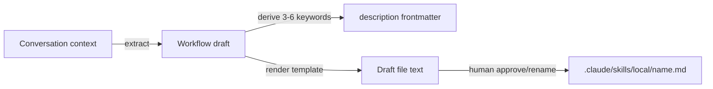

---
# Quality Chain Metadata (Alex 必填 - Phase 4 Hook 将基于此阻塞 Gate 3)
task_type: code       # skill markdown deliverable, treated as code for gate purposes
e2e_required: no
research_required: no

# Production directories that must have ≥1 git-tracked file at Gate 3
git_tracked_dirs: [".claude/skills/save-workflow"]

skip_knowledge_assessment: no
gate4_delta: []

# Traceability (surplus-auto)
handoff_id: HANDOFF-surplus-saveable-skills-from-conversation
epic: EPHEMERAL-surplus-saveable-skills-from-conversation
mode: surplus-auto
created: 2026-07-05
status: ready
scope_estimate: 1 file (~150-250 lines), single session
---

# Handoff Document for Agent B (Blake)
## TAD v3.1 - Evidence-Based Development

**From:** Alex (Agent A - Solution Lead)
**To:** Blake (Agent B - Execution Master)
**Date:** 2026-07-05
**Project:** TAD Framework
**Task ID:** TASK-20260705-surplus-saveable-skills
**Handoff Version:** 3.1.0
**Epic:** EPHEMERAL-surplus-saveable-skills-from-conversation.md (Phase 1/1)
**Supersedes:** N/A (this document expands the surplus-scan stub previously at this path)

---

## 🔴 Gate 2: Design Completeness (Alex必填)

**执行时间**: 2026-07-05 (YOLO Epic design step)

### Gate 2 检查结果

| 检查项 | 状态 | 说明 |
|--------|------|------|
| Architecture Complete | ✅ | Single self-contained skill file; no framework wiring needed |
| Components Specified | ✅ | SKILL.md frontmatter + 5-step capture flow + generated-file template fully specified in §4 |
| Functions Verified | ✅ | No code functions called — deliverable is instruction text. Repo conventions verified against live tree (see §7.3) |
| Data Flow Mapped | ✅ | Conversation context → extraction → draft → human confirm → `.claude/skills/local/<name>.md` (§4.3) |

**Gate 2 结果**: ✅ PASS (expert review pending — Conductor runs it per YOLO flow; see §9.2)

**Grounding note (honesty)**: the expected grounding file
`.tad/evidence/yolo/surplus-saveable-skills-from-conversation/phase1-grounding.md`
did NOT exist at design time (directory absent). Alex grounded directly against the
live repo instead; every grounded fact and its source is listed in §2.2 and §7.3.

**Alex确认**: 我已验证所有设计要素，Blake可以独立根据本文档完成实现。

---

## 📋 Handoff Checklist (Blake必读)

Blake在开始实现前，请确认：
- [ ] 阅读了所有章节
- [ ] **阅读了「📚 Project Knowledge」章节中的历史经验**
- [ ] 所有"强制问题回答（MQ）"都有证据
- [ ] 理解了真正意图（不只是字面需求）
- [ ] 每个Phase的交付物和证据要求都清楚
- [ ] 确认可以独立使用本文档完成实现

❌ 如果任何部分不清楚，**立即返回Alex要求澄清**，不要开始实现。

---

## 1. Task Overview

### 1.1 What We're Building

A new Claude Code skill `*save-workflow` (`.claude/skills/save-workflow/SKILL.md`)
that lets a user capture the workflow just executed in the current conversation —
goal, ordered steps with concrete commands, gotchas — into a structured, reusable
local skill file at `.claude/skills/local/<workflow-name>.md`, with auto-detected
trigger keywords and usage instructions. Confirm-before-write, overwrite-guarded.

### 1.2 Why We're Building It

**业务价值**：Workflows (ordered multi-step procedures) evaporate faster than
patterns. Capturing them at the moment of execution — while step order, exact
commands, and gotchas are hot in context — is far cheaper than the formal Gate 4
Knowledge Assessment cycle.
**用户受益**：One command turns "we just did something worth repeating" into a
discoverable, reusable local workflow file. UX inspired by Linear Agent Skills
(one-click capture).
**成功的样子**：当用户在任意对话末尾说 `*save-workflow`，agent 能重建刚执行的
workflow、起好名字、抽好触发词、给用户确认后写入 `local/` 时，这个功能就成功了。

### 1.3 🆕 Intent Statement（意图声明）

**真正要解决的问题**：把"刚刚做过的多步流程"在上下文还热的时候固化为可复用资产，
降低知识捕获门槛（相对正式 KA 流程）。

**不是要做的（避免误解）**：
- ❌ 不是 pattern/judgment-rule 捕获 —— 那是 `*save-skill`（local-skill-capture
  任务，目前尚未实现，见 §2.1）的职责。本命令只管 WORKFLOW（有序步骤+命令）。
- ❌ 不是 framework 集成 —— 不改 alex/blake SKILL.md、CLAUDE.md 路由表、tad.sh、
  derive-sync-set.sh、*publish。隔离靠目录约定。
- ❌ 不是 Linear MCP 集成 —— Linear Agent Skills 仅是 UX 灵感，禁止任何 API 调用。
- ❌ 不是 promotion pipeline —— local workflow → framework skill/capability pack
  的晋升机制 out of scope。
- ❌ 不是可执行脚本 —— 交付物是纯 judgment/instruction 文本（markdown skill）。

**Blake请确认理解**：
```
在开始实现前，请用你自己的话回答：
1. 这个功能解决什么问题？（对话中刚执行的 workflow 一键固化为本地可复用 skill）
2. 用户会如何使用？（对话末尾 *save-workflow → 看草稿 → 确认/改名 → 写入 local/）
3. 成功的标准是什么？（§9.1 全部 AC 行 PASS，且无 framework 文件被改动）

YOLO surplus-auto 模式：Conductor 代行人类确认。
```

---

## 📚 Project Knowledge（Blake 必读）

**⚠️ MANDATORY READ — Blake 在开始实现前，必须执行以下 Read 操作：**
1. Read the pattern files listed in 步骤 2 below
2. Read the handoff's "⚠️ Blake 必须注意的历史教训" entries carefully
3. This is NOT optional — project knowledge prevents repeated mistakes

### 步骤 1：识别相关类别

本次任务涉及的领域（勾选所有适用项）：
- [x] architecture - skill 文件布局约定、sync 隔离
- [x] code-quality - skill 文本的 judgment-vs-mechanical 边界
- [ ] security
- [ ] ux
- [ ] performance
- [ ] testing
- [ ] api-integration
- [ ] mobile-platform

### 步骤 2：历史经验摘录

**已读取的 project-knowledge 文件**：

| 文件 | 相关记录数 | 关键提醒 |
|------|-----------|----------|
| principles.md | 3 条 | Judgment-only skill files; deny-list/copy-granularity for sync sets; knowledge forged at distill |
| patterns/_index.md → pack-build-rules.md | 1 条 | SKILL.md install conventions, judgment-vs-capability boundary |
| patterns/_index.md → handoff-design.md | 1 条 | scope estimation, express/archive conventions |

**⚠️ Blake 必须注意的历史教训**：

1. **Judgment-Only Skill Files** (来自 principles.md, 2026-06-09 + v2.8.1)
   - 问题：skill 里的 constraint rules（MUST/禁止）被当成"机械内容"删掉会导致质量链失效。
   - 解决方案：save-workflow SKILL.md 中的 confirm-before-write / overwrite-guard /
     no-framework-mutation 属于 constraint rules，必须用 MUST 语气写进 body，不可弱化。

2. **Deny-List / Copy Granularity — sync 隔离不是免费的** (来自 principles.md, 2026-06-01)
   - 问题：tad.sh 按目录整体复制 `.claude/skills/*/`（`cp -R src/. tgt/` 同名覆盖）。
     若在 TAD 源仓库预置 `.claude/skills/local/` 目录，安装时会被复制到下游项目，
     同名文件（如 README.md）会覆盖下游用户文件。
   - 解决方案：**不在源仓库预置 `local/` 目录**。`local/` 由 save-workflow skill
     在【运行时、消费项目内】首次写入时创建（含一个说明 README）。这是本设计与
     surplus-scan stub 第 4 步（"create with .gitkeep"）的有意分歧，理由见 §11。

3. **Knowledge Is Forged at Distill — 防日记化** (来自 principles.md, 2026-06-22)
   - 问题：doer 刚做完就写"可复用知识"会写成 session diary（curse of knowledge）。
   - 解决方案：skill body 必须包含 variabilize 规则 —— episode-specific 值（路径、
     名称、日期）替换为 `{placeholder}`；"只能重放一个 session 的 workflow 是日记
     不是 skill"要作为 MUST 规则写入。

### Blake 确认

- [ ] 我已阅读上述历史经验
- [ ] 我理解需要避免的问题
- [ ] 如遇到类似情况，我会参考上述解决方案

---

## 2. Background Context

### 2.1 Previous Work

- **Sibling task `local-skill-capture` (`*save-skill`)**: referenced by the Epic as
  the pattern-capture counterpart. **Grounded fact: it is NOT yet implemented** —
  `ls .claude/skills/ | grep -i save` returns nothing (verified 2026-07-05). So its
  "conventions" exist only as spec; this handoff defines the shared conventions
  directly (frontmatter template, `local: true`, confirm/overwrite-guard,
  `.claude/skills/local/` layout) and `*save-skill` can reuse them later.
- **Linear Agent Skills**: UX inspiration only (one-click capture from context). No
  API usage.

### 2.2 Current State (grounded 2026-07-05, live repo)

| Fact | Evidence source |
|------|-----------------|
| `.claude/skills/` contains ~48 skill DIRECTORIES each with `SKILL.md`; the single flat file `doc-organization.md` is NOT registered in the live skill list | `ls .claude/skills/`; harness available-skills list |
| Skill frontmatter convention: `name:` + `description:` (+ optional `trigger:`) | `.claude/skills/surplus/SKILL.md` L1-5 |
| `.claude/skills/local/` does NOT exist | `ls -d .claude/skills/local` → No such file |
| No `save-workflow` / `save-skill` skill exists | `ls .claude/skills/ | grep -c 'save-workflow'` → 0 |
| tad.sh copies each `.claude/skills/*/` dir at install; merge copy `cp -R src/. tgt/` overwrites same-name files (tad.sh L802-812, L565-583) | tad.sh `copy_pack_skill_smart`, install loop |
| Framework paths clean at baseline | `git status --porcelain -- .claude/skills/alex .claude/skills/blake CLAUDE.md tad.sh .tad/hooks` → empty |

### 2.3 Dependencies

None. No packages, no network, no framework file edits. Pure markdown authoring.

---

## 3. Requirements

### 3.1 Functional Requirements

- **FR1**: New skill at `.claude/skills/save-workflow/SKILL.md` with valid YAML
  frontmatter: `name: save-workflow`, trigger-oriented `description:` (routes
  cleanly vs future `*save-skill`: "save the workflow/steps we just did" vs "save
  this reusable pattern/rule"), and `trigger:` line listing `*save-workflow`.
- **FR2 (Extract)**: skill body instructs the agent to reconstruct from recent
  conversation context the workflow actually performed: goal, ordered steps with
  the concrete commands/tools used per step, inputs/preconditions, outputs, gotchas.
- **FR3 (Auto-detect triggers)**: explicit rule to derive **3-6 trigger
  keywords/phrases** from the workflow's goal + step vocabulary (what a user would
  say to want this again) and embed them in the generated file's `description`.
- **FR4 (Draft + template)**: skill body embeds the exact generated-file template:
  - Frontmatter: `name`, `description` (with trigger keywords), `local: true`,
    `created: <date>`, `source: save-workflow`
  - Body sections: `Purpose` / `When to use` / `Steps` / `Usage instructions` /
    `Gotchas`
  - **Variabilize rule (MUST)**: episode-specific values (paths, names, dates,
    IDs) replaced with `{placeholders}`; a workflow that only replays one session
    is a diary, not a skill.
- **FR5 (Confirm-before-write, MUST)**: show full draft + proposed kebab-case
  filename to the user for edit/approval BEFORE any write. Naming and keep/reject
  are human-domain choices (AI/Human Judgment Domain Awareness principle) — present
  as choices, not "对不对?" rubber-stamp verification.
- **FR6 (Write + overwrite guard, MUST)**: save to
  `.claude/skills/local/<workflow-name>.md`; create `local/` (plus a short
  README.md stating the local-only / never-synced convention) at runtime if
  missing; REFUSE to overwrite an existing file without explicit user confirmation.

### 3.2 Non-Functional Requirements

- **NFR1**: Judgment/instruction text only — no executable scripts, no hooks.
- **NFR2**: Zero framework mutation — no edits to alex/blake SKILL.md, CLAUDE.md,
  tad.sh, derive-sync-set.sh, or any `.tad/` file.
- **NFR3**: Source-repo hygiene — do NOT create `.claude/skills/local/` inside the
  TAD source repo during this implementation (runtime-created in consumer projects
  only; rationale in §11).
- **NFR4**: SKILL.md length target ~150-250 lines (single-purpose skill; avoid
  rule-soup bloat).

### 3.3 Optimization Target

N/A — no numeric optimization goal.

---

## 4. Technical Design

### 4.1 Architecture Overview

One self-contained skill directory, matching the dominant repo convention
(dir + SKILL.md; the flat `.md` variant is demonstrably not registered by the
harness — see §2.2):

```
.claude/skills/save-workflow/SKILL.md   ← the only file this task creates
```

At RUNTIME (in whatever project the user invokes it), the skill's Write step
creates on demand:

```
.claude/skills/local/                   ← created on first save, consumer project
  README.md                             ← 3-5 lines: local-only, never synced, local: true convention
  <workflow-name>.md                    ← the captured workflow
```

**Deviation from Epic literal path** (`.claude/skills/save-workflow.md` flat):
grounded decision, not preference — flat skill files are not discovered by the
harness (doc-organization.md precedent, §2.2), so a flat deliverable would produce
a `*save-workflow` command that never fires. Dir/SKILL.md preserves the Epic's
intent (a working command).

### 4.2 Component Specifications

`SKILL.md` structure (Blake authors; exact wording is Blake's latitude, structure
and MUST-rules are not):

1. **Frontmatter** — per FR1.
2. **Purpose + boundary** — workflow capture vs `*save-skill` pattern capture
   (one table row each; note `*save-skill` not yet implemented).
3. **The 5-step flow** (numbered, imperative):
   - Step 1 Extract (FR2)
   - Step 2 Auto-detect triggers (FR3, "3-6 keywords" explicit)
   - Step 3 Draft (FR4 template embedded verbatim in a fenced block)
   - Step 4 Confirm (FR5, MUST + choice-not-verification framing)
   - Step 5 Write (FR6, MUST overwrite guard + runtime `local/` creation + README)
4. **Variabilize rule** (FR4, MUST, with one before/after mini-example, e.g.
   `podcasts/EP04-colin/final/` → `{project_output_dir}`).
5. **Constraints block** — no framework files, no scripts, no Linear MCP,
   generated files MUST carry `local: true`.

### 4.3 Data Models

Generated-file frontmatter (embed EXACTLY this template in the skill body):

```yaml
---
name: {workflow-name}
description: "{one-line what it does}. Triggers: {kw1}, {kw2}, {kw3}[, kw4-6]."
local: true
created: {YYYY-MM-DD}
source: save-workflow
---
```

Data flow: conversation context → extraction (steps/commands/gotchas) →
trigger-keyword derivation → draft render → human approve/rename →
`.claude/skills/local/<name>.md`.

### 4.4 API Specifications

N/A — no APIs. Explicitly forbidden: Linear MCP calls.

### 4.5 User Interface Requirements

Conversational UX only: the Confirm step MUST present (a) proposed kebab-case
filename, (b) full draft, (c) explicit options (save / rename / edit / discard) —
choices, not yes/no verification.

---

## 5. 🆕 强制问题回答（Evidence Required）

### MQ1: 历史代码搜索

**回答**：
- [x] 是 → Epic references "*save-skill pattern capture (local-skill-capture task)" as prior art

#### 搜索证据
```bash
ls "/Users/sheldonzhao/01-on progress programs/TAD/.claude/skills/" | grep -i save
# → (no output)
ls -d "/Users/sheldonzhao/01-on progress programs/TAD/.claude/skills/local"
# → No such file or directory
grep -rl "local-skill-capture" .tad/active/ | head
# → only SURPLUS-PLAN / session-state references (backlog entries, no implementation)
```

#### 决策说明
- **找到了什么**：`*save-skill` 与 `.claude/skills/local/` 均不存在——只有 backlog 引用。
- **位置**：n/a（无实现）
- **决定**：❌ 无可复用实现 → 本 handoff 直接定义共享约定（§4.3 模板），供未来 `*save-skill` 复用
- **原因**：sibling task 未实现；等待它会造成人为依赖，且约定由本任务先定义同样成立。

### MQ2: 函数存在性验证

**回答**：本任务不调用任何代码函数（交付物为 instruction markdown）。

#### 函数清单

| 函数名 | 文件位置 | 行号 | 代码片段 | 验证 |
|--------|---------|------|---------|------|
| (none — no code functions invoked) | n/a | n/a | n/a | ✅ N/A |

引用到的既有机制（只读、不修改）：tad.sh `copy_pack_skill_smart` (tad.sh L565-583)
与 install skill loop (L802-812)，用于论证 §11 的 local/ 不预置决策 — 已实读验证存在。

### MQ3: 数据流完整性

**回答**：无前后端；数据流为对话→文件。

| 后端字段 | 用途说明 | 前端组件 | 是否显示 | 不显示原因 |
|---------|---------|---------|---------|-----------|
| (n/a — 单向 conversation→file 流) | — | — | — | — |

#### 数据流图



### MQ4: 视觉层级

**回答**：
- [ ] 有不同状态
- [x] 无不同状态 → 跳过（纯文本 skill，无 UI 状态）

### MQ5: 状态同步

**回答**：

#### 状态存储位置

| 数据 | 存储位置1 | 存储位置2 | 同步时机 | 同步方向 |
|------|----------|----------|---------|---------|
| Captured workflow | `.claude/skills/local/<name>.md` | (none) | n/a | n/a |

```
[对话确认] → .claude/skills/local/<name>.md (唯一存储)
✅ 只有一个状态，无需同步
```

设计上刻意**排除**同步：`local/` 不进 sync/install 集合（目录约定 + 源仓库不预置）。

---

## 6. Implementation Steps（分Phase）

## 6.1 Micro-Tasks

| # | File | Operation | Verification Command | Est. Time |
|---|------|-----------|---------------------|-----------|
| 1 | `.claude/skills/save-workflow/SKILL.md` | Create with frontmatter (`name: save-workflow`, trigger-oriented `description`, `trigger:` line) | `head -1 .claude/skills/save-workflow/SKILL.md` = `---`; `grep -c '^name: save-workflow' ...` = 1 | 3 min |
| 2 | same | Write 5-step flow body (Extract/Detect/Draft/Confirm/Write) with MUST rules per §4.2 | `grep -icE 'extract' f` ≥1 且 `grep -cE '3-6|3–6' f` ≥1 | 5 min |
| 3 | same | Embed generated-file template (§4.3) in fenced block | `grep -c 'local: true' f` ≥1; `grep -c 'source: save-workflow' f` ≥1 | 3 min |
| 4 | same | Add variabilize rule + before/after example + Gotchas/Usage sections spec | `grep -icE 'variabiliz|placeholder' f` ≥2 | 3 min |
| 5 | same | Add confirm-before-write + overwrite guard MUST rules + runtime local/ creation (incl. README content spec) | `grep -icE 'overwrite' f` ≥1; `grep -icE 'confirm|approval' f` ≥2 | 3 min |
| 6 | (verify) | Run all §9.1 post-impl rows + scope check | `git status --porcelain` shows ONLY `.claude/skills/save-workflow/` + this handoff/epic bookkeeping | 3 min |

### Micro-Task Rules
- All tasks target the single deliverable file; no other file may be created or modified (except completion-report bookkeeping under `.tad/`).
- **Do NOT create `.claude/skills/local/` in this repo** — runtime-only (NFR3).

### Phase 1: save-workflow SKILL.md（预计 0.5 小时，单 Phase）

#### 交付物
- [ ] `.claude/skills/save-workflow/SKILL.md`（唯一新文件）

#### 实施步骤
1. Micro-tasks 1-5 顺序执行（同一文件，一次写成亦可，但每条 MUST 规则齐备）。
2. Micro-task 6 验证。

#### 验证方法
- 运行 §9.1 每一行 Verification Method，应得到对应 Expected Evidence。

#### 🆕 Phase 1 完成证据（Blake必须提供）
- [ ] §9.1 各行命令的原始输出（粘贴进 completion report）
- [ ] `git status --porcelain` 输出（证明零 framework 改动）
- [ ] SKILL.md 全文（≤250 行，可直接附）

**Human审查问题**（YOLO 下由 Conductor 代审）：
- 5-step 流程完整且 MUST 规则未被弱化吗？
- 生成模板含 `local: true` + `source: save-workflow` 吗？
- 有没有创建不该创建的 `local/` 目录？

**Human决策**：✅ 完成 → Gate 3 / ⚠️ 调整

---

## 7. File Structure

### 7.1 Files to Create
```
.claude/skills/save-workflow/SKILL.md  # the *save-workflow capture skill (only deliverable)
```

### 7.2 Files to Modify
```
(none)
```

### 7.3 Grounded Against (Phase 2 P2.2 — Alex step1c)

**Grounded Against** (Alex 实际 Read 过的源文件, 2026-07-05):

- `.tad/active/epics/EPHEMERAL-surplus-saveable-skills-from-conversation.md` (full, read 2026-07-05)
- `.tad/active/handoffs/HANDOFF-surplus-saveable-skills-from-conversation.md` (surplus-scan stub, full 97 lines — superseded by this document)
- `.tad/templates/handoff-a-to-b.md` (full)
- `.claude/skills/surplus/SKILL.md` (head 8 — frontmatter convention)
- `.claude/skills/doc-organization.md` (head 8 — flat-file precedent, unregistered)
- `tad.sh` L326-338 (`is_denied`), L565-583 (`copy_pack_skill_smart`), L785-812 (skills install loop)
- `.claude/skills/` directory listing; `.claude/skills/local` absence check
- `.claude/skills/save-workflow/SKILL.md` — (new — will be created)
- ⚠️ `.tad/evidence/yolo/surplus-saveable-skills-from-conversation/phase1-grounding.md` — **expected but ABSENT at design time**; grounding performed directly as listed above

---

## 8. Testing Requirements

### 8.1 Unit Tests
N/A（markdown 交付物）。等价物 = §9.1 的 grep/结构断言。

### 8.2 Integration Tests
N/A for this phase. 真实调用 `*save-workflow`（需要新会话上下文）属于 dogfood，
留给 Gate 4 后的自然使用；不作为本 handoff AC（避免 validation theater 的伪 e2e）。

### 8.3 Edge Cases（必须写进 SKILL.md 的行为规则）
- 目标文件已存在 → 停止并询问（overwrite guard），绝不静默覆盖。
- 对话里没有可辨识的 workflow（闲聊/纯讨论）→ 明确拒绝并说明，不硬造。
- 用户在 Confirm 步骤改名/要求修改 → 应用修改后重新展示，再写入。
- `local/` 不存在 → 先建目录 + README 再写文件。

## 8.4 Friction Preflight

No friction-sensitive prerequisites identified（单文件 markdown 创建；无依赖、无
网络、无审批面）。Expert review 由 Conductor 编排（YOLO 流程），不构成 Blake 侧 friction。

## 8.5 Feedback Collection (Non-Code Artifacts)

```yaml
feedback_required: false
artifact_type: generic
suggested_dimensions: []
notes: "Skill instruction text; quality assessed via AC greps + Conductor review, not feedback HTML."
```

## 8.6 🆕 Test Evidence Required
Blake必须提供：
- [ ] §9.1 全部 Verification Method 的原始命令输出
- [ ] `git status --porcelain` 范围证明
- [ ] （覆盖率报告 N/A — 无代码）

---

## 9. Acceptance Criteria

Blake的实现被认为完成，当且仅当：
- [ ] FR1-FR6 全部落实在 SKILL.md 中并可 grep 验证
- [ ] §9.1 每一行 post-impl 验证 PASS（原始输出附证）
- [ ] 零 framework 文件改动；未在本仓库创建 `.claude/skills/local/`
- [ ] Conductor（代 Human）验证"这是我期望的"

---

## 9.1 Spec Compliance Checklist ⚠️ PRIMARY VERIFICATION SOURCE — Gate 3 executes each row

> 所有命令在 repo root 运行；`F=.claude/skills/save-workflow/SKILL.md`。
> Pipe-escape note: 表内 `\|` 提取执行时还原为 `|`。

| # | Acceptance Criterion | Verification Type | Verification Method | Expected Evidence | Verified Output (Alex step1d) |
|---|---------------------|-------------------|--------------------|--------------------|-------------------------------|
| 0a | Baseline: no save-workflow skill exists pre-impl | pre-impl-verifiable | `ls .claude/skills/ \| grep -c 'save-workflow'` | `0` | `0` (run 2026-07-05) |
| 0b | Baseline: framework paths clean pre-impl | pre-impl-verifiable | `git status --porcelain -- .claude/skills/alex .claude/skills/blake CLAUDE.md tad.sh .tad/hooks` | empty output | empty (run 2026-07-05) |
| 1 | Skill exists with valid frontmatter (`name` + trigger-oriented `description`) | post-impl-verifiable | `head -1 "$F"; grep -c '^name: save-workflow' "$F"; grep -c '^description:' "$F"` | `---` / `1` / `1` | (post-impl) |
| 2 | Trigger auto-detection rule: 3-6 keywords derived from conversation, embedded in generated `description` | post-impl-verifiable | `grep -cE '3-6\|3–6' "$F"; grep -icE 'trigger (keyword\|phrase)\|keywords?.*description' "$F"` | both ≥ 1 | (post-impl) |
| 3 | Generated-file template embedded: `local: true` + `source: save-workflow` + required sections | post-impl-verifiable | `grep -c 'local: true' "$F"; grep -c 'source: save-workflow' "$F"; grep -icE '^#+.*purpose\|when to use\|^#+.*steps\|usage instruction\|gotcha' "$F"` | first two ≥ 1; section grep ≥ 4 | (post-impl) |
| 4 | Confirm-before-write mandated (MUST) + choice framing | post-impl-verifiable | `grep -icE 'MUST.*(confirm\|approv)\|BEFORE (any )?writ' "$F"` | ≥ 1 | (post-impl) |
| 5 | Overwrite guard mandated (MUST, explicit user confirmation) | post-impl-verifiable | `grep -icE 'overwrit' "$F"; grep -icE 'refus\|never silently\|without explicit' "$F"` | both ≥ 1 | (post-impl) |
| 6 | Variabilize rule present with placeholder convention | post-impl-verifiable | `grep -icE 'variabiliz\|placeholder' "$F"` | ≥ 2 | (post-impl) |
| 7 | Runtime `local/` creation + README convention specified | post-impl-verifiable | `grep -c '.claude/skills/local/' "$F"; grep -icE 'README' "$F"` | both ≥ 1 | (post-impl) |
| 8 | No framework mutation; scope = deliverable only | post-impl-verifiable | `git status --porcelain \| grep -vE '^\?\? \.claude/skills/save-workflow/\|\.tad/(active\|evidence)/' \| grep -vE 'session-state'` | empty (only deliverable + TAD bookkeeping paths present) | (post-impl) |
| 9 | `local/` NOT created in this repo | post-impl-verifiable | `ls -d .claude/skills/local 2>&1 \| grep -c 'No such file'` | `1` | (post-impl) |
| 10 | Deliverable is git-tracked at Gate 3 (`git_tracked_dirs`) | post-impl-verifiable | `git add -n .claude/skills/save-workflow/SKILL.md; git ls-files --others --cached .claude/skills/save-workflow \| wc -l` | ≥ 1 after staging per Blake's commit step | (post-impl) |
| 11 | Length discipline | post-impl-verifiable | `wc -l < "$F"` | ≤ 300 (target 150-250) | (post-impl) |

---

## 9.2 Expert Review Status (Alex 必填)

> YOLO Epic 流程：expert review 由 **Conductor** 在 design 步之后编排
> （yolo-epic workflow review 步），本设计 agent 按指令不自行 spawn reviewer。
> Conductor 完成后应把 findings 回填进下方 Audit Trail。

### Audit Trail

| Reviewer | Issue | Resolution Section | Status |
|----------|-------|-------------------|--------|
| (pending — Conductor-orchestrated review) | — | — | Open |

### Experts Selected

1. **code-reviewer** (ALWAYS) — verifies AC greps are runnable/discriminative and scope guard (§9.1 row 8) is airtight
2. **architecture reviewer** — verifies the local/ runtime-creation vs source-repo pre-creation decision (§11) against tad.sh copy semantics

### Overall Assessment (post-integration)

- (pending Conductor review)

---

## 10. Important Notes

### 10.1 Critical Warnings
- ⚠️ **不要在 TAD 源仓库创建 `.claude/skills/local/`**（NFR3 / §11）。stub handoff
  的第 4 步（预置 .gitkeep/README）已被本设计有意推翻。
- ⚠️ **不要改任何 framework 文件**：alex/blake SKILL.md、CLAUDE.md、tad.sh、
  derive-sync-set.sh、`.tad/` 一律只读（本 handoff/epic 的 bookkeeping 除外）。
- ⚠️ **交付物路径是 `save-workflow/SKILL.md`（dir 形式）**，不是 Epic 字面上的
  flat `.md` —— 理由已 grounded（§4.1），不要"纠正"回 flat。

### 10.2 Known Constraints
- `local/` 下的文件不会被 harness 自动注册为可调用 skill（它们不是 `dir/SKILL.md`
  形式）。v1 的使用方式：用户提及 workflow 名/触发词 → agent Read 该文件照做。
  自动注册/promotion 属 out of scope，未来任务处理。
- `*save-skill`（pattern capture）尚未实现；SKILL.md 中提及它时注明 "if present"。
- No Linear MCP calls — inspiration only.

### 10.3 🆕 Sub-Agent使用建议

Blake应该考虑使用：
- [ ] **parallel-coordinator** — 不需要（单文件）
- [ ] **bug-hunter** — 不需要（无代码执行路径）
- [x] **test-runner / 自验证** — 完成后逐行跑 §9.1
- [ ] **refactor-specialist** — 不需要

---

## 11. 🆕 Learning Content（可选）

### 11.1 Decision Rationale: `local/` 目录 — 源仓库预置 vs 运行时创建

**选择的方案**：运行时创建（skill 首次 Write 时在消费项目内 mkdir + README）。

**考虑的替代方案**：

| 方案 | 优点 | 缺点 | 为什么没选 |
|------|------|------|-----------|
| 运行时创建（选中）| 零 sync 耦合；tad.sh 无需 deny-list 改动；源仓库不会向下游播散 local/ 内容 | skill 多两行 mkdir 指令 | ✅ 选中 |
| 源仓库预置 .gitkeep/README（stub 方案）| 目录"看得见" | tad.sh 按目录整体复制 `.claude/skills/*/`，`cp -R src/. tgt/` 会把源 README 覆盖到下游同名文件；且把"永不同步"的目录放进会被安装复制的树里自相矛盾 | 违反隔离目标本身 |
| 改 tad.sh 加 deny-list 条目 | 根治 | Epic 明确 out of scope | 越界 |

**权衡分析**：核心权衡 = 可见性 vs 隔离正确性。隔离是这个功能的存在前提（`local:
true` 的承诺），优先级压倒可见性。

**💡 Human学习点**：宣称"永不同步"的目录，第一原则是别把它放进任何会被复制的
集合里 —— 目录约定要和复制机制的实际粒度对齐（principles.md 2026-06-01 教训的应用）。

---

## 12. 🆕 Sub-Agent使用记录

Blake完成后填写：

| Sub-Agent | 是否调用 | 调用时机 | 输出摘要 | 证据链接 |
|-----------|---------|---------|---------|---------|
| parallel-coordinator | ❌ 预期不用 | — | — | — |
| bug-hunter | ❌ 预期不用 | — | — | — |
| test-runner (self-verify) | — | §9.1 逐行验证时 | — | — |

**Human验证点**：§9.1 每行都有原始输出吗？

---

**Handoff Created By**: Alex (Agent A)
**Date**: 2026-07-05
**Version**: 3.1.0
