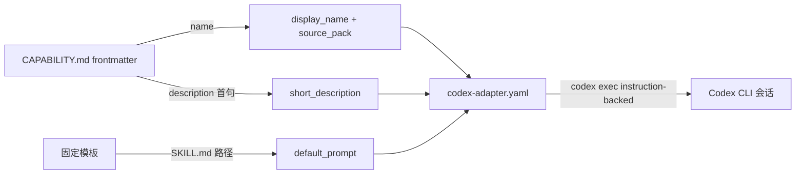

# Handoff Document for Agent B (Blake)
## TAD v3.1 - Evidence-Based Development

**From:** Alex (Agent A - Solution Lead)
**To:** Blake (Agent B - Execution Master)
**Date:** 2026-07-06
**Project:** TAD Framework
**Task ID:** TASK-20260706-codex-adapter-yaml
**Handoff Version:** 3.1.0
**Epic:** EPHEMERAL-surplus-codex-adapter-yaml.md (Phase 1/1, surplus-auto YOLO)
**Supersedes:** N/A

---

## 🔴 Gate 2: Design Completeness (Alex必填)

**执行时间**: 2026-07-06

### Gate 2 检查结果

| 检查项 | 状态 | 说明 |
|--------|------|------|
| Architecture Complete | ✅ | Adapter spec + installer extension + demo artifact + codex exec verification, all grounded in current install.sh (198 lines, read in full) |
| Components Specified | ✅ | §4.2 specifies the exact case-branch change, TARGET_DIR parameterization, and heredoc adapter generation |
| Functions Verified | ✅ | §5 MQ2: `case "$AGENT"` L46-68, `DRY_RUN` L18/L135, `FORCE` L19/L172, `COPY_PAIRS` L98-115 all verified with line numbers |
| Data Flow Mapped | ✅ | §5 MQ3: SKILL.md frontmatter fields → adapter fields mapping table |

**Gate 2 结果**: ✅ PASS

**Alex确认**: 我已验证所有设计要素，Blake可以独立根据本文档完成实现。
(Expert review of this handoff is executed by the YOLO Conductor per yolo-epic workflow — see §9.2.)

---

## 📋 Handoff Checklist (Blake必读)

Blake在开始实现前，请确认：
- [ ] 阅读了所有章节
- [ ] **阅读了「📚 Project Knowledge」章节中的历史经验**
- [ ] 所有"强制问题回答（MQ）"都有证据
- [ ] 理解了真正意图（不只是字面需求）
- [ ] 每个Phase的交付物和证据要求都清楚
- [ ] 确认可以独立使用本文档完成实现

❌ 如果任何部分不清楚，**立即返回Alex要求澄清**，不要开始实现。

---

## 1. Task Overview

### 1.1 What We're Building

Zero-cost Codex CLI compatibility for capability packs, proven on one demo pack:

1. A **format spec** (`.tad/capability-packs/CODEX-ADAPTER-SPEC.md`) for a minimal
   (~6-line) `codex-adapter.yaml`, modeled on ECC's `agents/openai.yaml`
   (`display_name`, `short_description`, `default_prompt`, `allow_implicit_invocation`,
   optional `brand_color` / `source_pack`), with a mechanical generation rule from the
   pack SKILL.md YAML frontmatter.
2. An **install.sh extension** for the web-backend demo pack: the `--agent=codex`
   path installs the pack to `.agents/skills/web-backend/` and generates
   `codex-adapter.yaml` there, honoring existing `--dry-run` / `--force` semantics.
3. A **committed demo artifact**: the generated
   `.agents/skills/web-backend/codex-adapter.yaml` in this repo, verified end-to-end
   via `codex exec`.

### 1.2 Why We're Building It

**业务价值**：Codex 用户消费 capability packs 目前依赖手工维护的 AGENTS.md 路由表；
adapter 让每个包自带 Codex 入口，同一模式可机械复制到全部 24 个包。
**用户受益**：Codex CLI 用户一条 install 命令即可获得可发现、可隐式调用的 pack。
**成功的样子**：当 `bash install.sh --agent=codex` 在任意项目产出一个 `codex exec`
可实际消费的 adapter 时，这个功能就成功了。

### 1.3 🆕 Intent Statement（意图声明）

**真正要解决的问题**：给包一个自描述的 Codex 入口文件（约 6 行），消除"每加一个包
就要手改一次 AGENTS.md 路由表"的维护负担，并验证该入口真的能被 Codex 消费。

**不是要做的（避免误解）**：
- ❌ 不是把 adapter 推广到其余 23 个包（后续机械任务，本次只做 web-backend）
- ❌ 不是修改现有 AGENTS.md 路由或 Codex strip-only SKILL 规则（adapter 是补充，不是替代）
- ❌ 不是改动 Claude Code 安装路径的任何行为（`--agent=claude-code` 必须逐字节等效）
- ❌ 不是让 Codex "原生"读取该文件 —— Codex 无此机制；adapter 是 instruction-backed
  （由 AGENTS.md / 用户 prompt 指向它），spec 必须如实说明

**Blake请确认理解**：
```
在开始实现前，请用你自己的话回答：
1. 这个功能解决什么问题？
2. 用户会如何使用？
3. 成功的标准是什么？

（surplus-auto YOLO 模式：以 completion report 首段自答代替 Human 逐条确认。）
```

---

## 📚 Project Knowledge（Blake 必读）

**⚠️ MANDATORY READ — Blake 在开始实现前，必须执行以下 Read 操作：**
1. Read `.tad/project-knowledge/patterns/shell-portability.md`
2. Read `.tad/project-knowledge/patterns/ac-verification.md`
3. Read the "⚠️ Blake 必须注意的历史教训" entries below

### 步骤 1：识别相关类别

本次任务涉及的领域（勾选所有适用项）：
- [x] code-quality - bash installer 扩展模式
- [x] testing - AC 可运行验证命令设计
- [x] architecture - Codex adapter 与现有 AGENTS.md 路由的关系
- [ ] security / ux / performance / api-integration / mobile-platform - 不适用

### 步骤 2：历史经验摘录

**已读取的 project-knowledge 文件**：

| 文件 | 相关记录数 | 关键提醒 |
|------|-----------|----------|
| patterns/shell-portability.md | 多条 | macOS/BSD 兼容：无 GNU-only flags；heredoc 安全（quoted delimiter 防意外展开） |
| patterns/ac-verification.md | 多条 | AC 命令必须 raw-form dry-run；`grep -c` 管道转义规则；防 self-leak |
| principles.md | 3 条直接相关 | 见下方教训 1-3 |

**⚠️ Blake 必须注意的历史教训**：

1. **Validation Theater**（来自 principles.md, YOLO Cross-Model Audit 2026-05-15）
   - 问题：结构检查（文件存在、字段齐全）只证明文件操作成功，不证明功能有效。
   - 解决方案：AC9 要求真实 `codex exec` 冒烟测试；禁止未运行就声称通过（§10.1）。

2. **Never Hand-Write What an Existing Tool Already Does**（来自 principles.md, 2026-05-28）
   - 问题：绕过已有机制手写一次性脚本 → 遗漏、不完整。
   - 解决方案：复用 install.sh 现有 COPY_PAIRS 循环 + dry-run/force 逻辑（参数化
     TARGET_DIR），不要另写独立 codex 安装脚本。

3. **Express Handoff is NOT Review-Exemption**（来自 principles.md, 2026-04-14）
   - 问题："小改动"合理化跳过审查。
   - 解决方案：本 handoff 的专家审查由 YOLO Conductor 在 review 阶段执行（§9.2）。

4. **PyYAML 不在系统 python3 中**（本次 grounding 实测，2026-07-06）
   - 问题：`python3 -c "import yaml"` → `ModuleNotFoundError`。
   - 解决方案：adapter 有效性验证用 grep 键名 + 行数检查（AC6），不用 PyYAML；
     也不要为此全局 pip install（违反用户包安装安全原则）。

### Blake 确认

- [ ] 我已阅读上述历史经验
- [ ] 我理解需要避免的问题
- [ ] 如遇到类似情况，我会参考上述解决方案

---

## 2. Background Context

### 2.1 Previous Work

- **Idea 来源**: `.tad/active/ideas/IDEA-20260527-codex-adapter-yaml.md` — ECC 在每个
  SKILL.md 旁放 6 行 `agents/openai.yaml`（display_name, short_description,
  brand_color, default_prompt, allow_implicit_invocation）。
- **Codex CLI Adaptation Epic**（已归档 `.tad/archive/epics/EPIC-20260427-codex-cli-adaptation.md`）：
  建立了 `.agents/skills/{pack}/` 布局 + AGENTS.md 关键词路由表（本 repo AGENTS.md L54
  已有 web-backend 路由行）+ Codex SKILL strip-only 规则。
- **web-backend pack**: `.tad/capability-packs/web-backend/`，源文件 `CAPABILITY.md`
  （frontmatter: `name: web-backend`, `description: ...`, `keywords: [...]`,
  `type: reference-based`），installer 198 行。

### 2.2 Current State

- `install.sh` 的 `case "$AGENT"` (L46-68) 中 `codex` 与 `claude-code|claude` 共用同一
  fall-through 分支 → 目前 `--agent=codex` 的行为与 claude-code 完全相同（装进
  `.claude/skills/web-backend/`），**没有任何 codex 特有行为**
  （`grep -c 'codex-adapter' install.sh` = 0，pre-impl 实测）。
- 本 repo `.agents/skills/web-backend/` 已存在（SKILL.md/CONVENTIONS.md/references/
  scripts/examples，git-tracked）——由框架同步机制装入，**不是** install.sh 装的。
- 目标状态：`--agent=codex` → 装包进 `.agents/skills/web-backend/` 并生成
  `codex-adapter.yaml`；`--agent=claude-code`（默认）行为逐字节不变。

### 2.3 Dependencies

- `codex` CLI：**本 session 实测可用** — `/opt/homebrew/bin/codex`, `codex-cli 0.142.2`。
- bash 3.2+ (macOS 默认) / BSD userland — 无 GNU-only 依赖。
- 无网络、无包安装需求。PyYAML 不可用（见 Project Knowledge 教训 4）。

---

## 3. Requirements

### 3.1 Functional Requirements

- **FR1 — Format spec**: 新建 `.tad/capability-packs/CODEX-ADAPTER-SPEC.md`，内容必须含：
  (a) 字段表 — 必填 `display_name`, `short_description`, `default_prompt`,
  `allow_implicit_invocation`；可选 `brand_color`, `source_pack`；
  (b) 从 SKILL.md/CAPABILITY.md frontmatter 的机械生成规则（见 §4.3 映射表）；
  (c) 一个完整示例 adapter（即 web-backend 的实际产物）；
  (d) 与 AGENTS.md 路由和 strip-only 规则的关系声明：**补充而非替代**，且如实说明
  adapter 在 Codex 上是 instruction-backed（Codex 不会自动读它）。
- **FR2 — install.sh 扩展（仅 demo 包）**: `--agent=codex` 时：目标目录切换为
  `.agents/skills/web-backend/`，复用现有 COPY_PAIRS 循环装包文件，并额外生成
  `codex-adapter.yaml`（字段值运行时从 `CAPABILITY.md` frontmatter 派生，不是硬编码
  死值）；完整遵守 `--dry-run`（打印计划含 adapter 预览，零写入）与 `--force`
  （adapter 已存在且无 --force → skip 不报错）语义；`set -euo pipefail` 下无裸退出。
- **FR3 — Demo artifact + 端到端验证**: 在本 repo 根目录真实运行 codex 安装，产出并
  git-track `.agents/skills/web-backend/codex-adapter.yaml`；随后用 `codex exec` 运行
  一条消费该 adapter 的 prompt（见 §8.2），把命令与输出摘录写入 completion report。
  若 `codex exec` 因沙箱/认证不可运行 → 按 honest-partial 记录（精确原因 + 人工验证
  命令），**禁止未运行即声称通过**。

### 3.2 Non-Functional Requirements

- NFR1: macOS/BSD 可移植（无 `sed -i` 无后缀、无 `grep -P`、无 `mapfile` 依赖 bash4）。
- NFR2: adapter 文件 ≤ 10 行（"约 6 行"的硬上限），键为顶层扁平标量（无嵌套）。
- NFR3: 默认 claude-code 路径零回归（AC7/AC8 逐字节行为对照）。
- NFR4: install.sh 净增 ≤ 60 行（防 scope creep；超出需在 completion report 说明）。

---

## 4. Technical Design

### 4.1 Architecture Overview

```
.tad/capability-packs/web-backend/CAPABILITY.md (frontmatter = source of truth)
        │  install.sh --agent=codex （运行时派生）
        ▼
.agents/skills/web-backend/
   ├── SKILL.md, CONVENTIONS.md, references/, scripts/   ← 复用 COPY_PAIRS 循环
   └── codex-adapter.yaml                                ← 新增，heredoc 生成
        ▲
        │  instruction-backed 消费（AGENTS.md 路由 / 用户 prompt 指向）
   codex exec "Read .agents/skills/web-backend/codex-adapter.yaml ..."
```

### 4.2 Component Specifications

**install.sh 改动（唯一被修改的现有文件）**：

1. `case "$AGENT"` (L46-68)：把 `codex` 从 `claude-code|claude|codex)` 拆出为独立分支，
   设 `CODEX_MODE=true`。
2. 目标目录选择：`CODEX_MODE=true` → 跳过 `.claude/` 探测（L71-91），直接
   `TARGET_DIR=".agents/skills/web-backend"`；否则走现有探测逻辑不变。
   注意：`COPY_PAIRS` 在定义时展开 `${TARGET_DIR}` (L98-115)，所以 TARGET_DIR 必须在
   数组定义前就绪 —— 将探测/选择逻辑整体保持在 L98 之前。
3. adapter 生成函数 `generate_codex_adapter()`：
   - 从 `${PACK_DIR}/CAPABILITY.md` frontmatter 派生：`name` 行 → `source_pack` 与
     `display_name`（连字符转空格、首字母大写，用 awk/tr 实现）；`description` 行 →
     取第一个句号前的首句、截断 ≤ 120 字符 → `short_description`。
   - `default_prompt` 固定模板：
     `Read .agents/skills/web-backend/SKILL.md and apply its judgment rules to the current task.`
   - `allow_implicit_invocation: true`。
   - dry-run：打印 `would write .agents/skills/web-backend/codex-adapter.yaml` + 内容预览，不写。
   - 真实运行：`mkdir -p`；文件已存在且非 --force → `Skipped (exists, use --force)`。
4. 收尾输出：CODEX_MODE 下把 "To activate in Claude Code" 提示换成 codex 提示。

**CODEX-ADAPTER-SPEC.md（新文件，~80-120 行）**：字段表 / 生成规则 / 示例 /
与 AGENTS.md 关系 + instruction-backed 声明 / 推广到其余 23 包的机械步骤（一段即可）。

### 4.3 Data Models

生成的 `codex-adapter.yaml`（web-backend 实例，6 行核心）：

```yaml
display_name: Web Backend
short_description: Web backend capability pack. Gives AI agents the judgment rules a senior backend engineer applies.
default_prompt: Read .agents/skills/web-backend/SKILL.md and apply its judgment rules to the current task.
allow_implicit_invocation: true
source_pack: web-backend
```

字段派生映射（spec 的核心表）：

| adapter 字段 | 来源 | 规则 |
|--------------|------|------|
| display_name | frontmatter `name` | 连字符→空格，词首大写 |
| short_description | frontmatter `description` | 首句，截断 ≤ 120 字符 |
| default_prompt | 固定模板 | 指向已安装 SKILL.md 路径 |
| allow_implicit_invocation | 常量 | `true` |
| source_pack | frontmatter `name` | 原样 |
| brand_color (可选) | 手工 | 生成器不产出，允许手工补 |

### 4.4 API Specifications

CLI 契约（install.sh 已有 flags 不变）：
`bash install.sh [--dry-run] [--force] [--global] [--agent=claude-code|codex|...]`
新语义仅一条：`--agent=codex` → 目标 `.agents/skills/web-backend/` + adapter 生成。
`--global` 与 codex 组合：本次不支持全局 codex 安装，CODEX_MODE 下忽略并打印一行说明。

### 4.5 User Interface Requirements

CLI 输出：dry-run 计划中 adapter 行清晰可 grep（含字符串 `codex-adapter.yaml`）；
真实安装的汇总统计沿用现有 `Installed/Skipped` 计数。无图形 UI。

---

## 5. 🆕 强制问题回答（Evidence Required）

### MQ1: 历史代码搜索

**回答**：
- [x] 是 → idea 提到 "ECC 的方案"、"现有 AGENTS.md 路由"

#### 搜索证据
```bash
find . -name "openai.yaml" -not -path "*/worktrees/*"   # → 无结果（repo 内无 ECC 实例文件）
grep -n "web-backend" AGENTS.md                          # → L54 路由行存在
grep -c 'codex-adapter' .tad/capability-packs/web-backend/install.sh   # → 0
ls .agents/skills/web-backend/                           # → SKILL.md 等已存在（框架同步装入）
```

#### 决策说明
- **找到了什么**：AGENTS.md L54 已路由 web-backend；`.agents/skills/web-backend/` 已就位；install.sh 无任何 adapter 逻辑。
- **决定**：✅ 复用（COPY_PAIRS 循环、dry-run/force 语义、`.agents/skills/` 布局） + ❌ 新建（adapter 生成器与 spec，repo 内无先例）
- **原因**：Never Hand-Write What an Existing Tool Already Does。

### MQ2: 函数存在性验证

#### 函数清单（🆕 必填表格）

| 函数名/构造 | 文件位置 | 行号 | 代码片段 | 验证 |
|--------|---------|------|---------|------|
| `case "$AGENT"` 分支 | web-backend/install.sh | L46-68 | `claude-code\|claude\|codex)` | ✅ |
| `DRY_RUN` flag + 短路 | web-backend/install.sh | L18, L135-142 | `if [ "$DRY_RUN" = true ]; then ... exit 0` | ✅ |
| `FORCE` skip 逻辑 | web-backend/install.sh | L19, L172-175 | `if [ -f "$dst" ] && [ "$FORCE" = false ]` | ✅ |
| `COPY_PAIRS` 循环 | web-backend/install.sh | L98-115, L161-181 | `"CAPABILITY.md:${TARGET_DIR}/SKILL.md"` | ✅ |
| frontmatter 源字段 | web-backend/CAPABILITY.md | L2-3 | `name: web-backend` / `description: ...` | ✅ |
| `generate_codex_adapter()` | (新增) | — | 本次实现 | N/A 新建 |

### MQ3: 数据流完整性

#### 数据流对照表（🆕 必填表格）

| 源字段 (CAPABILITY.md frontmatter) | 用途说明 | 落点 (codex-adapter.yaml) | 是否使用 | 不使用原因 |
|---------|---------|---------|---------|-----------|
| `name` | pack 标识 | `source_pack` + `display_name` | ✅ | |
| `description` | 一句话能力描述 | `short_description`（首句截断） | ✅ | |
| `keywords` | 路由关键词 | — | ❌ | AGENTS.md 路由已承载；adapter 保持 ≤10 行 |
| `type` | 包结构类型 | — | ❌ | Codex 消费不需要 |

#### 数据流图（🆕 必填）



### MQ4: 视觉层级

**回答**：
- [x] 无不同状态 → 跳过（CLI 工具，输出状态沿用现有 `[exists]` / `✓ Installed` / `! Skipped` 前缀约定）

### MQ5: 状态同步

#### 状态存储位置（🆕 必填）

| 数据 | 存储位置1 | 存储位置2 | 同步时机 | 同步方向 |
|------|----------|----------|---------|---------|
| pack 元数据 | `.tad/capability-packs/web-backend/CAPABILITY.md` (SoT) | `.agents/skills/web-backend/codex-adapter.yaml` | 每次 `install.sh --agent=codex` 运行时重派生 | 单向 SoT→adapter |

```
CAPABILITY.md frontmatter (主状态, Source of Truth)
   ↓ 同步时机：install.sh --agent=codex 运行时（运行时派生，不缓存）
codex-adapter.yaml (派生产物)
```

- 主状态清楚：✅ frontmatter。adapter 是纯派生物，drift 靠重跑 installer 消除。
- 可能不同步的窗口：frontmatter 改了但没重跑 installer —— spec 中注明 adapter 是
  generated file，手改会被 `--force` 重装覆盖。

---

## 6. Implementation Steps（分Phase）

## 6.1 Micro-Tasks (Optional — recommended for Full/Standard TAD)

| # | File | Operation | Verification Command | Est. Time |
|---|------|-----------|---------------------|-----------|
| 1 | .tad/capability-packs/CODEX-ADAPTER-SPEC.md | Create spec: field table, generation rule, example, AGENTS.md relationship | `grep -c 'display_name\|default_prompt' CODEX-ADAPTER-SPEC.md` ≥ 2 | 5 min |
| 2 | .tad/capability-packs/web-backend/install.sh | Split `codex` out of the case fall-through; set CODEX_MODE + TARGET_DIR before COPY_PAIRS | `bash -n install.sh` | 3 min |
| 3 | .tad/capability-packs/web-backend/install.sh | Add `generate_codex_adapter()` (frontmatter derivation + heredoc + dry-run/force) | `bash install.sh --dry-run --agent=codex \| grep codex-adapter.yaml` | 5 min |
| 4 | (temp dir) | Fresh-dir install test: dry-run writes nothing; real run creates adapter; rerun w/o --force skips | see AC4/AC5/AC10 | 4 min |
| 5 | .agents/skills/web-backend/codex-adapter.yaml | Real run at repo root (--force), git add demo artifact | `test -f .agents/skills/web-backend/codex-adapter.yaml` | 2 min |
| 6 | (evidence) | `codex exec` smoke test, capture output excerpt | see AC9 | 4 min |

### Micro-Task Rules
- Each task targets ONE file; verification is runnable.

**🆕 Phase划分原则**：单 phase 任务（~30-45 min），完成后一次性提交证据。

### Phase 1: Spec + Installer + Demo + Verification（预计 45 分钟）

#### 交付物
- [ ] `.tad/capability-packs/CODEX-ADAPTER-SPEC.md`（新）
- [ ] `.tad/capability-packs/web-backend/install.sh`（扩展，净增 ≤60 行）
- [ ] `.agents/skills/web-backend/codex-adapter.yaml`（生成的 demo artifact，git-tracked）
- [ ] `codex exec` 冒烟测试证据（completion report 内）

#### 实施步骤
1. Read install.sh 全文 + CAPABILITY.md frontmatter + AGENTS.md L50-60（重建上下文）。
2. Micro-task 1：写 spec。
3. Micro-tasks 2-3：改 installer（注意 TARGET_DIR 必须先于 COPY_PAIRS 定义就绪）。
4. Micro-task 4：在 `mktemp -d` 的干净目录里跑 dry-run / real / rerun 三连测试。
5. Micro-task 5：repo 根目录真实运行 `--agent=codex --force`，git add adapter。
   ⚠️ 运行前 `git status --porcelain .agents/skills/web-backend` 记录基线；--force 会
   覆盖该目录下同名文件，运行后用 `git diff` 确认除新增 adapter 外无意外内容变更
   （若框架同步版 SKILL.md 与 pack 源 CAPABILITY.md 有差异，恢复被覆盖文件并在
   completion report 记录 —— 见 §10.1 W3）。
6. Micro-task 6：`codex exec` 冒烟测试（§8.2 的固定 prompt），摘录输出。
7. 写 completion report `.tad/active/handoffs/COMPLETION-surplus-codex-adapter-yaml.md`
   （含 Friction Status 表 + §1.3 三问自答 + Knowledge Assessment marker 如有发现）。

#### 验证方法
- 逐行执行 §9.1 全部 Verification Method，全绿。

#### 🆕 Phase 1 完成证据（Blake必须提供）
- [ ] **代码 diff**：install.sh 改动（`git diff --stat` + 关键 hunk）
- [ ] **测试输出**：干净目录三连测试的原始输出
- [ ] **codex exec 输出摘录**：或 honest-partial 记录

**Human审查问题**（YOLO 模式由 Conductor impl-review 代答，人类 Gate 4 终审）：
- adapter 真的被 codex exec 消费了吗（不是 validation theater）？
- claude-code 默认路径零回归吗？

**Human决策**：✅ 通过 / ⚠️ 调整

---

## 7. File Structure

### 7.1 Files to Create
```
.tad/capability-packs/CODEX-ADAPTER-SPEC.md        # adapter 格式 spec + 生成规则
.agents/skills/web-backend/codex-adapter.yaml      # 生成的 demo artifact（由 installer 产出）
```

### 7.2 Files to Modify
```
.tad/capability-packs/web-backend/install.sh       # codex 分支：TARGET_DIR 切换 + adapter 生成
```

### 7.3 Grounded Against (Phase 2 P2.2 — Alex step1c, 2026-04-24)

**Grounded Against** (Alex step1c 实际 Read 过的源文件):

- `.tad/capability-packs/web-backend/install.sh` — 全文 198 行, read at 2026-07-06
- `.tad/capability-packs/web-backend/CAPABILITY.md` — head 15 行（frontmatter 全量）, read at 2026-07-06
- `.agents/skills/web-backend/SKILL.md` — head 12 行（frontmatter 与 pack 源一致）, read at 2026-07-06
- `.tad/active/ideas/IDEA-20260527-codex-adapter-yaml.md` — 全文 30 行, read at 2026-07-06
- `.tad/active/epics/EPHEMERAL-surplus-codex-adapter-yaml.md` — 全文 48 行, read at 2026-07-06
- `AGENTS.md` — grep 验证 L54 web-backend 路由行, read at 2026-07-06
- `.tad/capability-packs/CODEX-ADAPTER-SPEC.md` — (new — will be created)
- `.agents/skills/web-backend/codex-adapter.yaml` — (new — will be created)

---

## 8. Testing Requirements

### 8.1 Unit Tests
- 干净目录（`mktemp -d`，无 `.claude/` 无 `.agents/`）跑 `--agent=codex`：
  dry-run 零写入；real run 创建 `.agents/skills/web-backend/` 全套 + adapter。
- `--agent=codex` 重复运行（无 --force）：adapter 与包文件均 `Skipped (exists)`，exit 0。
- 默认（claude-code）dry-run：输出不含 `codex-adapter` 字符串，行为与基线一致。

### 8.2 Integration Tests
- `codex exec` 冒烟测试（固定 prompt，repo 根目录执行）：
  ```bash
  codex exec "Read .agents/skills/web-backend/codex-adapter.yaml, then follow its default_prompt and answer: for a new orders table, should the primary key be UUIDv4 or ULID, and why?"
  ```
  预期：回答引用/体现 web-backend SKILL 的数据库判断规则（证明 default_prompt 链路真实可用）。

### 8.3 Edge Cases
- frontmatter `description` 含冒号/引号 → short_description 需安全转义（heredoc 用
  quoted delimiter + 单独 printf 字段值，或对值做 `tr -d '"'`）。
- `description` 首句超 120 字符 → 硬截断（截断点不落在多字节字符中间：本包描述为
  ASCII，spec 注明 CJK 包需按字节安全截断）。
- 干净目录无 `.agents/` → `mkdir -p` 创建，不报错。
- `--global` + `--agent=codex` → 打印忽略说明，不失败。

## 8.4 Friction Preflight

| Friction Point | Required Step | Expected Fix Path | Allowed Substitute | Gate Impact |
|----------------|---------------|-------------------|--------------------|-------------|
| codex CLI 认证/沙箱限制 | AC9 `codex exec` 冒烟测试 | 直接运行（CLI 已实测在位：codex-cli 0.142.2） | honest-partial：精确失败原因 + 人工验证命令；DEGRADED_WITH_APPROVAL | 无证据且无 honest-partial → Gate 3 FAIL |
| PyYAML 缺失 | adapter YAML 校验 | 不修复（不装包） | grep 键名 + 行数检查（AC6，已内建为主方案） | NOT_APPLICABLE_WITH_REASON |
| repo 根目录 --force 覆盖 `.agents/skills/web-backend/` 已 track 文件 | Micro-task 5 demo artifact | 运行前基线 + 运行后 `git diff` 审查 | 恢复意外变更文件并记录 | 意外内容变更未处理 → Gate 3 FAIL |

**Status Enum**: `READY` / `BLOCKED` / `DEGRADED_WITH_APPROVAL` / `EQUIVALENT_SUBSTITUTE` / `NOT_APPLICABLE_WITH_REASON`

## 8.5 Feedback Collection (Non-Code Artifacts)

N/A — code-only task.

## 8.6 🆕 Test Evidence Required
Blake必须提供：
- [ ] 干净目录三连测试（dry-run / real / rerun）原始输出
- [ ] `codex exec` 冒烟测试输出摘录（或 honest-partial 记录）
- [ ] `git diff --stat` + `git status --porcelain .agents/skills/web-backend` 前后对照

---

## 9. Acceptance Criteria

Blake的实现被认为完成，当且仅当：
- [ ] FR1-FR3 全部实现并验证（§9.1 逐行绿）
- [ ] Phase 1 完成并提供 §8.6 全部证据
- [ ] `codex exec` 端到端证据在 completion report 中（或合规 honest-partial）
- [ ] claude-code 默认路径零回归
- [ ] Human (Gate 4) 验证"这是我期望的"

---

## 9.1 Spec Compliance Checklist ⚠️ PRIMARY VERIFICATION SOURCE — Gate 3 executes each row

> Pipe-escape note: `\|` in rendered cells → un-escape to `|` when running.
> `$REPO` = `/Users/sheldonzhao/01-on progress programs/TAD`（含空格，命令中必须引号包裹）。

| # | Acceptance Criterion | Verification Type | Verification Method | Expected Evidence | Verified Output (Alex step1d) |
|---|---------------------|-------------------|--------------------|--------------------|-------------------------------|
| AC1 | Spec exists with 4 required field names | post-impl-verifiable | `grep -c 'display_name\|short_description\|default_prompt\|allow_implicit_invocation' "$REPO/.tad/capability-packs/CODEX-ADAPTER-SPEC.md"` | count ≥ 4 | (post-impl) |
| AC2 | Spec states frontmatter generation rule + AGENTS.md supplement + instruction-backed | post-impl-verifiable | `grep -ci 'frontmatter' spec` ≥ 1 AND `grep -ci 'AGENTS.md' spec` ≥ 1 AND `grep -ci 'instruction-backed' spec` ≥ 1 | all ≥ 1 | (post-impl) |
| AC3 | install.sh syntax valid | post-impl-verifiable | `bash -n "$REPO/.tad/capability-packs/web-backend/install.sh"; echo $?` | exit 0 | (post-impl) |
| AC4 | Codex dry-run mentions adapter, writes NOTHING | post-impl-verifiable | `T=$(mktemp -d) && cd "$T" && bash "$REPO/.tad/capability-packs/web-backend/install.sh" --dry-run --agent=codex \| grep -c 'codex-adapter.yaml'; test ! -e "$T/.agents" && echo NO-WRITE` | count ≥ 1 AND `NO-WRITE` | (post-impl) |
| AC5 | Codex real run creates adapter in fresh dir | post-impl-verifiable | `T=$(mktemp -d) && cd "$T" && bash "$REPO/.tad/capability-packs/web-backend/install.sh" --agent=codex && test -f "$T/.agents/skills/web-backend/codex-adapter.yaml" && echo CREATED` | exit 0 + `CREATED` | (post-impl) |
| AC6 | Adapter shape: 4 required keys, ≤ 10 lines, values derived from frontmatter | post-impl-verifiable | on AC5's file: `grep -c '^display_name:\|^short_description:\|^default_prompt:\|^allow_implicit_invocation:' f` == 4 AND `[ $(wc -l < f) -le 10 ] && echo LEN-OK` AND `grep -q 'web-backend' f && echo DERIVED` | 4 + `LEN-OK` + `DERIVED` | (post-impl) |
| AC7 | Default claude-code dry-run still exits 0 (baseline preserved) | pre-impl-verifiable | `cd "$REPO" && bash .tad/capability-packs/web-backend/install.sh --dry-run >/dev/null 2>&1; echo "exit=$?"` | exit=0 pre AND post | `exit=0` (baseline run 2026-07-06; tail: "=== DRY RUN — no files written ===") — Blake re-runs post-impl, must still be exit=0 |
| AC8 | Default path emits NO codex-adapter output | post-impl-verifiable | `cd "$REPO" && bash .tad/capability-packs/web-backend/install.sh --dry-run 2>&1 \| grep -c 'codex-adapter'` | count == 0 (pre-impl baseline: install.sh has 0 `codex-adapter` matches, grep exit 1) | (post-impl; baseline `grep -c codex-adapter install.sh` = 0 verified 2026-07-06) |
| AC9 | codex exec smoke test consumed the adapter (or honest-partial) | post-impl-verifiable | run §8.2 command; excerpt command + output into completion report; else honest_partial entry with exact failure + manual verification command | output shows backend-judgment answer via adapter's default_prompt; NO unrun-claimed pass | (post-impl; pre-impl grounding: `codex --version` → codex-cli 0.142.2 at /opt/homebrew/bin/codex — CLI available, honest-partial bar is HIGH) |
| AC10 | Rerun without --force skips existing adapter, exit 0 | post-impl-verifiable | in AC5's `$T`: `bash "$REPO/.tad/capability-packs/web-backend/install.sh" --agent=codex; echo "exit=$?"` | exit=0, output contains `Skipped (exists` for adapter | (post-impl) |
| AC11 | Demo artifact committed in repo | post-impl-verifiable | `cd "$REPO" && git ls-files --error-unmatch .agents/skills/web-backend/codex-adapter.yaml && echo TRACKED` | `TRACKED` | (post-impl) |
| AC12 | Change scope limited to §7 files | post-impl-verifiable | `cd "$REPO" && git status --porcelain \| grep -v 'CODEX-ADAPTER-SPEC\|install.sh\|codex-adapter.yaml\|COMPLETION-\|HANDOFF-\|EPHEMERAL-\|traces/'` | empty (no out-of-scope changes) | (post-impl) |

---

## 9.2 Expert Review Status (Alex 必填)

> ⚠️ YOLO surplus-auto mode: expert review is executed by the Conductor's review stage
> (yolo-epic workflow) AFTER this design step — per task constraints Alex does NOT spawn
> reviewers here. Conductor MUST fill the Audit Trail below before Blake implements;
> Express-review-exemption is forbidden (principles.md 2026-04-14).

### Audit Trail

| Reviewer | Issue | Resolution Section | Status |
|----------|-------|-------------------|--------|
| (Conductor review stage) | — pending — | — | Open |

### Experts Selected

1. **code-reviewer** — bash installer 改动 + dry-run/force 语义回归风险（ALWAYS required）
2. **backend-architect / tooling reviewer** — adapter 格式与 AGENTS.md 路由关系、频道推广到 23 包的可复制性

### Overall Assessment (post-integration)

- Pending Conductor review stage.

---

## 10. Important Notes

### 10.1 Critical Warnings
- ⚠️ **W1 禁止 validation theater**：不运行 `codex exec` 就声称 AC9 通过 = 直接 Gate 3 FAIL。
  CLI 已实测在位（0.142.2），honest-partial 只在真实沙箱/认证失败时可用。
- ⚠️ **W2 TARGET_DIR 先于 COPY_PAIRS**：COPY_PAIRS 数组在定义时展开 `${TARGET_DIR}`
  (L98)，codex 分支的目录切换必须发生在数组定义之前，否则 pairs 指向空/旧目录。
- ⚠️ **W3 repo 根目录 --force 有覆盖半径**：`.agents/skills/web-backend/` 下文件已
  git-tracked；demo 运行后必须 `git diff` 审查，意外内容变更要恢复并记录。
- ⚠️ **W4 不装 PyYAML**：系统 python3 无 yaml 模块；用 grep 校验，禁止全局 pip install。

### 10.2 Known Constraints
- 仅 web-backend 一个包；其余 23 包推广是后续机械任务（spec 里写清步骤即可）。
- AGENTS.md 路由与 Codex strip-only SKILL 规则不改。
- Claude Code 安装路径行为不改（AC7/AC8 守护）。
- macOS/BSD 可移植；bash 3.2 兼容（无 `declare -A`、无 `mapfile`；现有 `declare -a` 可用）。
- install.sh 净增 ≤ 60 行（NFR4）。

### 10.3 🆕 Sub-Agent使用建议

Blake应该考虑使用：
- [ ] **parallel-coordinator** - 不需要（单文件主改动，串行即可）
- [x] **bug-hunter** - 若干净目录测试或 codex exec 出现非预期失败
- [x] **test-runner** - Phase 1 收尾统一执行 §9.1 全行
- [ ] **refactor-specialist** - 不需要（净增 ≤60 行）

完成后在"Sub-Agent使用记录"中说明使用情况。

---

## 11. 🆕 Learning Content（可选）

### 11.1 Decision Rationale: codex 分支目标目录

**选择的方案**：`--agent=codex` 切换 TARGET_DIR 到 `.agents/skills/web-backend/`（复用 COPY_PAIRS 循环）+ 生成 adapter。

**考虑的替代方案**：

| 方案 | 优点 | 缺点 | 为什么没选 |
|------|------|------|-----------|
| A（选中）TARGET_DIR 切换 + 复用循环 | 最小 diff；dry-run/force 免费继承；目录语义正确 | 改变了 codex fall-through 的旧行为（原先装进 .claude/skills） | ✅ 选中 |
| B 保持 fall-through，仅追加 adapter 写入 | 完全不动现有行为 | codex 用户的包文件装进 .claude/ 语义错误；adapter 与 SKILL.md 分家 | 旧行为本是 fall-through 意外产物，非契约 |
| C 独立 codex 安装脚本 | 隔离干净 | 违反 "Never Hand-Write What an Existing Tool Already Does"；双份维护 | 历史教训明确禁止 |

**权衡分析**：核心权衡 = 行为兼容 vs 语义正确。`--agent=codex` 从未被文档承诺过
claude-code 等效行为（--help 里 codex 还标着 "Planned (Phase 3)"），语义正确优先。

**💡 Human学习点**：fall-through 分支的"现状行为"不等于契约；判断回归时先问
"这个行为是被设计的还是意外的"。

---

## 12. 🆕 Sub-Agent使用记录

Blake完成后填写：

| Sub-Agent | 是否调用 | 调用时机 | 输出摘要 | 证据链接 |
|-----------|---------|---------|---------|---------|
| parallel-coordinator | ✅/❌ | | | |
| bug-hunter | ✅/❌ | | | |
| test-runner | ✅/❌ | | | |

**Human验证点**：应该调用的都调用了吗？

---

**Handoff Created By**: Alex (Agent A)
**Date**: 2026-07-06
**Version**: 3.1.0
