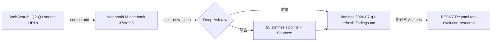

# Handoff Document for Agent B (Blake)
## TAD v3.1 - Evidence-Based Development

**From:** Alex (Agent A - Solution Lead)
**To:** Blake (Agent B - Execution Master)
**Date:** 2026-07-05
**Project:** TAD Framework
**Task ID:** TASK-20260705-o1-landscape-refresh
**Handoff Version:** 3.1.0
**Epic:** EPHEMERAL-surplus-o1-landscape-refresh-2026q3.md (Phase 1/1: q3-landscape-refresh)
**Supersedes:** N/A (本文件的早期 stub 版本由 surplus 生成器写入，本完整版原地覆盖并吸收其 `--new` conversation-isolation 教训)

---

## 🔴 Gate 2: Design Completeness (Alex必填)

**执行时间**: 2026-07-05 (YOLO Epic design step)

### Gate 2 检查结果

| 检查项 | 状态 | 说明 |
|--------|------|------|
| Architecture Complete | ✅ | 单链路研究流程：preflight → reactivate → add sources → 2 deep-ask rounds → findings + registry update，含 WebSearch 降级路径 |
| Components Specified | ✅ | NotebookLM CLI 命令逐条验证（`ask --help` / `source add --help` 实测），findings 文件格式与 registry 字段逐一指定 |
| Functions Verified | ✅ | CLI 存在于 `~/.tad-notebooklm-venv/bin/notebooklm`；`ask -n/--new`、`source add -n` 参数经 --help 实测确认（见 MQ2） |
| Data Flow Mapped | ✅ | notebook → deep-ask raw output → findings synthesis → REGISTRY.yaml 状态更新（见 MQ3） |

**Gate 2 结果**: ✅ PASS

**说明**:
- 专家审查（§9.2）由 YOLO Conductor 在 design-review 步骤执行，本 handoff 创建时不自行 spawn reviewer（YOLO workflow 契约）。
- ⚠️ Epic 指定的 grounding 文件 `.tad/evidence/yolo/surplus-o1-landscape-refresh-2026q3/phase1-grounding.md` 在磁盘上**不存在**（目录亦不存在）。Alex 已改为直接对真实状态落地（REGISTRY.yaml L54-61、OBJECTIVES.md L8-19、CLI --help 实测），全部记录在 §7.3 Grounded Against。Blake 无需寻找该 grounding 文件。

**Alex确认**: 我已验证所有设计要素，Blake可以独立根据本文档完成实现。

---

## 📋 Handoff Checklist (Blake必读)

Blake在开始实现前，请确认：
- [ ] 阅读了所有章节
- [ ] **阅读了「📚 Project Knowledge」章节中的历史经验**
- [ ] 所有"强制问题回答（MQ）"都有证据
- [ ] 理解了真正意图（不只是字面需求）
- [ ] 每个Phase的交付物和证据要求都清楚
- [ ] 确认可以独立使用本文档完成实现

❌ 如果任何部分不清楚，**立即返回Alex要求澄清**，不要开始实现。

---

## 1. Task Overview

### 1.1 What We're Building

重新激活休眠的 NotebookLM notebook「TAD Evolution — AI Agent Framework Landscape 2025-2026」（notebook_id `37cfefa5-52b3-4a8a-a8e3-a83f32150759`，当前 45 sources，status: dormant，last_queried 2026-05-31），补充 2026 Q2-Q3 生态新源，跑 2 轮 deep-ask 对照 OBJECTIVES.md O1 KR1-KR3，产出带引用的 findings 文件，并更新 notebook registry 状态。

### 1.2 Why We're Building It

**业务价值**：O1（TAD 竞争格局定位）的 KR1-KR3 自 Q2 起全部停在 🔄；生态已发生结构性变化（Claude Fable 5 / Mythos 5 发布、Codex subagents GA、Claude Code Workflow tool + agent teams）。休眠的 landscape notebook 正是 O1 的指定研究工具（designated instrument），不刷新它 O1 无法推进。
**用户受益**：用户获得基于 2026 Q3 现状的 TAD 差异化定位与能力缺口评估，为下一波开发排优先级。
**成功的样子**：当 findings 文件里有 ≥5 条跨源综合观点（每条带 `Sources:`）+ 一段 O1 KR 状态评估、且 registry 显示 notebook 回到 active 时，这个任务就成功了。

### 1.3 🆕 Intent Statement（意图声明）

**真正要解决的问题**：O1 的研究基底过期了（notebook 最后一次查询是 2026-05-31，缺 Q2-Q3 生态大事件），需要把这个持久知识库刷新到 Q3 现状并产出可引用的 KR 证据。

**不是要做的（避免误解）**：
- ❌ 不是直接修改 OBJECTIVES.md 的 KR 状态（评估段落只写在 findings 文件里，KR 状态由人后续决定）
- ❌ 不是新建一个 notebook（复用现有 `37cfefa5-...`，其他 notebook 一律不碰）
- ❌ 不是升级任何 pack/skill（纯研究任务，零代码/零 skill 变更）
- ❌ 不是调用 `/deep-research` skill 或 spawn generic web-search agent（CLAUDE.md 研究工具排除规则；本任务的工具就是 NotebookLM CLI，失败才降级 WebSearch）

**Blake请确认理解**：
```
在开始实现前，请用你自己的话回答：
1. 这个功能解决什么问题？
2. 用户会如何使用？
3. 成功的标准是什么？

（YOLO 模式下由 Conductor 代确认；Blake 在 completion report 中回答即可。）
```

---

## 📚 Project Knowledge（Blake 必读）

**⚠️ MANDATORY READ — Blake 在开始实现前，必须执行以下 Read 操作：**
1. Read `.tad/project-knowledge/patterns/research-methodology.md`（NotebookLM / 源质量 / deep research 模式）
2. Read the handoff's "⚠️ Blake 必须注意的历史教训" entries carefully
3. This is NOT optional — project knowledge prevents repeated mistakes

### 步骤 1：识别相关类别

本次任务涉及的领域（勾选所有适用项）：
- [x] api-integration - 外部工具（NotebookLM CLI）集成
- [x] research - 研究方法论 / 源质量
- [ ] code-quality / security / ux / architecture / performance / testing / mobile-platform - 不适用

### 步骤 2：历史经验摘录

**已读取的 project-knowledge 文件**：

| 文件 | 相关记录数 | 关键提醒 |
|------|-----------|----------|
| patterns/research-methodology.md | 多条 | NotebookLM 为默认研究后端；源质量优先；cross-source synthesis 而非单源转述 |
| principles.md | 3 条直接相关 | 见下方历史教训 1-3 |
| testing.md | 0 条 | 无相关历史记录 |

**⚠️ Blake 必须注意的历史教训**：

1. **研究证据必须可审计**（来自 principles.md「YOLO Epic Execution: Cross-Model Audit Findings」2026-05-15）
   - 问题：findings 只引用工具名和数字、不带 source URL 和检索日期 → 新鲜度/准确性无法验证
   - 解决方案：findings 文件每条综合观点必须带 `Sources:` 行（含 URL 或 notebook source 标题）；文件头部写明检索日期

2. **Never Hand-Write What an Existing Tool Already Does**（来自 principles.md 2026-05-28）
   - 问题：现有工具失败时，从记忆里手写替代方案 → 不完整、出错
   - 解决方案：CLI preflight 失败先看错误（auth 过期 → 提示需 `notebooklm login`）；确认无法恢复才走本 handoff 明确定义的 WebSearch 降级路径，不要自行发明第三条路

3. **AI/Human Judgment Domain Awareness**（来自 principles.md 2026-07-03）
   - 问题：把方向类判断（TAD 该往哪走）当成 AI 自判事项
   - 解决方案：findings 的 KR 评估段落只做**证据陈述 + 建议**，不改 OBJECTIVES.md；方向决策留给人

4. **Conversation isolation：每轮开场 ask 必须 `--new`**（来自 stub handoff 吸收的既有教训）
   - 问题：`ask` 默认续上一次对话，跨轮/跨任务上下文串扰会污染回答与引用
   - 解决方案：Round 1 与 Round 2 的第一问都带 `--new`；轮内后续问题续同一 conversation

### Blake 确认

- [ ] 我已阅读上述历史经验
- [ ] 我理解需要避免的问题
- [ ] 如遇到类似情况，我会参考上述解决方案

---

## 2. Background Context

### 2.1 Previous Work

- Notebook `tad-evolution-research`（`.tad/research-notebooks/REGISTRY.yaml` L54-61）：45 curated sources，已完成 3 轮 deep-ask（2026-05-05 / 2026-05-14 / 2026-05-31），覆盖 competitive landscape / failure modes / evaluation / memory / cost / observability。
- 既有 findings：`.tad/evidence/research/2026-05-05-tad-evolution-deep-ask-findings.md`、`.tad/evidence/research/2026-05-14-kr2-kr3-ask-findings.md`、`.tad/evidence/research/tad-evolution-refresh/2026-05-31-ask-findings.md`。新一轮 findings 应延续这些文件的「综合观点 + Sources 行」风格。
- O1 KR 现状（OBJECTIVES.md L13-17）：KR1「8+ analyzed (Round 1)」🔄、KR2「3 found (Round 1)」🔄、KR3「5+ found (Round 2-3)」🔄。

### 2.2 Current State

- Notebook status: **dormant**，last_queried **2026-05-31**，source_count **45**。
- 目标输出目录 `.tad/evidence/research/framework-landscape/` **不存在**，需创建。
- NotebookLM CLI 存在：`~/.tad-notebooklm-venv/bin/notebooklm`（venv 安装）。auth 状态未验证 → Phase A preflight 验证。
- Registry 是本地索引，头部注释明文「Canonical truth is NotebookLM cloud」。
- ⚠️ Epic 引用的 grounding 文件 `.tad/evidence/yolo/surplus-o1-landscape-refresh-2026q3/phase1-grounding.md` 不存在。本 handoff 的落地依据见 §7.3。

### 2.3 Dependencies

- NotebookLM CLI（`~/.tad-notebooklm-venv/bin/notebooklm`）+ 有效的 NotebookLM 登录态（`~/.notebooklm/storage_state.json`）
- 网络访问（NotebookLM cloud；降级路径需 WebSearch）
- 降级授权：Epic 明文「preflight first; degrade to WebSearch if CLI fails」+ 人类已授权本 batch（Epic 头部 HUMAN-AUTHORIZED 2026-07-05）

---

## 3. Requirements

### 3.1 Functional Requirements

- FR1: **Preflight + reactivate** — 用 CLI 对 notebook `37cfefa5-52b3-4a8a-a8e3-a83f32150759` 做一次轻量验证（`notebooklm source list -n 37cfefa5...`），确认可达且能列出 ~45 sources。失败且不可恢复 → 进入 FR6 降级路径。
- FR2: **补充 Q2-Q3 sources** — 通过 `notebooklm source add -n 37cfefa5...` 添加 ≥5 个新源，必须覆盖这 5 个主题（每主题 ≥1 源）：(a) Claude Fable 5 / Mythos 5 release，(b) Codex subagents GA，(c) Claude Code Workflow tool + agent teams，(d) LangGraph/CrewAI/AutoGen 2026 现状，(e) agent framework consolidation 趋势。源 URL 由 Blake 用 WebSearch 定点找权威来源（官方 blog/docs/release notes 优先），记录 URL + 检索日期。
- FR3: **2 轮 deep-ask** — 用 `notebooklm ask -n 37cfefa5...` 跑 2 轮深问（每轮 ≥3 个问题）。**每轮第一问必须带 `--new`**（conversation-isolation 教训，见历史教训 4）。Round 1 = KR1 framework comparison refresh（TAD vs 主流框架 2026 Q3 现状）；Round 2 = KR2+KR3（TAD differentiators 是否仍成立 + 新出现的 capability gaps）。等新源 processing 完成后再 ask（`notebooklm source wait` / `source stale`）。
- FR4: **Findings 文件** — 写 `.tad/evidence/research/framework-landscape/2026-07-q3-refresh-findings.md`：≥5 条跨源综合观点（每条带独立 `Sources:` 行）+ 一段 `## O1 KR Status Assessment` 评估段落（逐 KR1/KR2/KR3 陈述证据与建议状态，不改 OBJECTIVES.md）+ 头部检索日期 + 附录保留 2 轮 deep-ask 的原始问答（`## Deep-Ask Round 1` / `## Deep-Ask Round 2` 标题，轮边界在文件结构中可见）。
- FR5: **Registry 更新** — 更新 `.tad/research-notebooks/REGISTRY.yaml` 中 `tad-evolution-research` 条目：`status: dormant → active`、`last_queried:` 改为执行日期、`source_count:` 改为实际新总数（45 + 新增数）、`notes:` 追加一句 Q3 refresh 摘要 + findings 路径。同时更新文件头 `last_updated:`。
- FR6: **降级路径（仅 CLI 不可恢复失败时）** — 用 WebSearch 覆盖 FR2 的 5 个主题做 2 轮综合研究（轮结构保留，标题改为 `## Deep-Ask Round N (Degraded: WebSearch)`），findings 文件头部必须含字面标记 `Degraded-Mode: WebSearch (CLI preflight failed: <原因>)` 并附 preflight 错误原文；此时 registry 仅在 `notes:` 追加降级尝试记录（含 `Degrade` 字样），`status` 保持 dormant、`source_count` 不变。FR4 的综合观点/评估段落要求不变。

### 3.2 Non-Functional Requirements

- NFR1: 每条综合观点必须是 **cross-source synthesis**（≥2 源支撑），不是单源转述。
- NFR2: 所有引用可审计：URL 或 notebook source 标题 + 检索日期（principles.md YOLO audit 教训；CLI 无 native citation 时必须补 URL）。
- NFR3: 变更范围锁死：只允许 (a) 新建 `.tad/evidence/research/framework-landscape/`、(b) 修改 `.tad/research-notebooks/REGISTRY.yaml`、(c) 常规 trace/session 副产物。OBJECTIVES.md 与任何 pack/skill 文件零改动。
- NFR4: CLI 调用失败先重试 1 次再判定失败（NotebookLM CLI 有已知偶发不稳定，registry `open-notebook-evaluation` notes 有记录）。

---

## 4. Technical Design

### 4.1 Architecture Overview

单链路研究流程，无代码产物：

```
[Preflight: source list -n 37cfefa5...] ──失败(重试1次仍不可恢复)──> [FR6 WebSearch 降级]
        │成功                                                          │
        v                                                              v
[FR2: WebSearch 找 URL → source add x5+]                    [2 轮 WebSearch 综合研究]
        v                                                              │
[source wait / stale 确认 processing 完成]                              │
        v                                                              v
[FR3: ask --new Round 1 (KR1) → ask --new Round 2 (KR2+KR3)]  [Findings (Degraded-Mode 标记)]
        v                                                              v
[FR4: findings (≥5 points + KR assessment + raw appendix)]    [Registry notes-only 追加]
        v
[FR5: REGISTRY.yaml 更新 (active / last_queried / source_count / notes)]
```

### 4.2 Component Specifications

| 组件 | 规格 |
|------|------|
| CLI 调用 | 一律用绝对路径 `~/.tad-notebooklm-venv/bin/notebooklm`，一律带 `-n 37cfefa5-52b3-4a8a-a8e3-a83f32150759`（不依赖 `use` 的全局 current-notebook 状态，避免污染 `active_notebook: agent-computer-control`） |
| deep-ask | `ask -n <id> --new "<第一问>"`；轮内后续问续同一 conversation；建议 `--json` 拿 source references 便于写 `Sources:` 行 |
| findings 文件 | Markdown；必含字面量：`Sources:`（≥5 处）、`## O1 KR Status Assessment`（1 处，段内显式提及 KR1/KR2/KR3）、`## Deep-Ask Round 1`、`## Deep-Ask Round 2`（降级时标题追加 `(Degraded: WebSearch)` 后缀） |
| registry 编辑 | 手工 Edit YAML（无 CLI 命令管 registry）；只动 `tad-evolution-research` 条目 4 个字段 + 文件头 `last_updated` |

### 4.3 Data Models

REGISTRY.yaml 条目目标态（正常路径）：

```yaml
  - id: "tad-evolution-research"
    notebook_id: "37cfefa5-52b3-4a8a-a8e3-a83f32150759"
    topic: "TAD Evolution — AI Agent Framework Landscape 2025-2026"
    created: "2026-05-05"
    status: active            # was: dormant
    last_queried: "2026-07-05" # 实际执行日期
    source_count: 50          # 45 + 实际新增数（示例值）
    notes: "<原 notes 保留>. Q3 REFRESH 2026-07-05: +N sources (Fable 5, Codex subagents GA, CC Workflow/agent teams, LangGraph/CrewAI/AutoGen, consolidation), 2 deep-ask rounds vs O1 KR1-KR3. Findings: .tad/evidence/research/framework-landscape/2026-07-q3-refresh-findings.md"
```

### 4.4 API Specifications

N/A（外部接口即 NotebookLM CLI，规格见 4.2；无 HTTP API 直调）。

### 4.5 User Interface Requirements

N/A（无 UI 产物）。

---

## 5. 🆕 强制问题回答（Evidence Required）

### MQ1: 历史代码搜索

**问题**：用户是否提到"之前的"、"原来的"、"我们的方案"？

**回答**：
- [x] 是 → Epic 明确指向"dormant notebook"这一既有资产

#### 搜索证据
```bash
grep -n -B2 -A8 "37cfefa5" ".tad/research-notebooks/REGISTRY.yaml"
# 输出（节选，run 2026-07-05）：
# 55:    notebook_id: "37cfefa5-52b3-4a8a-a8e3-a83f32150759"
# 56:    topic: "TAD Evolution — AI Agent Framework Landscape 2025-2026"
# 58:    status: dormant
# 59:    last_queried: "2026-05-31"
# 60:    source_count: 45
```

#### 决策说明
- **找到了什么**：既有 notebook 条目 + 3 轮历史 findings（见 §2.1）
- **位置**：`.tad/research-notebooks/REGISTRY.yaml:54-61`
- **决定**：✅ 复用（reactivate），❌ 不新建 notebook
- **原因**：Epic Goal 明文要求复用该 notebook；45 个既有源是 deep-ask 跨源综合的价值基础

**Human验证点**：搜索确实执行了（原始输出在上），复用决策与 Epic 一致。

### MQ2: 函数存在性验证

**问题**：设计中调用了哪些函数（CLI 命令）？它们都存在吗？

#### 函数清单（🆕 必填表格）

| 函数/命令 | 文件位置 | 行号 | 代码片段/证据 | 验证 |
|--------|---------|------|---------|------|
| `notebooklm` 二进制 | `~/.tad-notebooklm-venv/bin/notebooklm` | N/A | `ls` 实测存在 (2026-07-05) | ✅ |
| `ask -n / --new / --json` | CLI 子命令 | N/A | `ask --help`: `-n, --notebook TEXT`；docstring `Use --new to start fresh` | ✅ |
| `source add -n` | CLI 子命令 | N/A | `source add --help`: `-n, --notebook TEXT; --type [url\|text\|file\|youtube]` | ✅ |
| `source list / wait / stale` | CLI 子命令组 | N/A | 顶层 `--help`: `source  add, add-drive, ..., list, ..., stale, wait` | ✅ |

**Human验证点**：每个命令都有"✅存在"和实测证据来源。

### MQ3: 数据流完整性

**问题**：上游产出了哪些数据？下游都落地了吗？

#### 数据流对照表（🆕 必填表格）

| 上游产出 | 用途说明 | 下游落点 | 是否显示/落地 | 不落地原因 |
|---------|---------|---------|---------|-----------|
| deep-ask 原始问答 | 可审计证据 | findings 附录 `## Deep-Ask Round 1/2` | ✅ | — |
| 跨源综合观点 | KR1-KR3 证据 | findings 正文 ≥5 条 + `Sources:` 行 | ✅ | — |
| KR 状态评估 | 供人决策 | findings `## O1 KR Status Assessment` | ✅ | — |
| 新 source 数量/状态 | registry 一致性 | REGISTRY.yaml 4 字段 | ✅ | — |
| KR 状态变更 | — | OBJECTIVES.md | ❌ | Out of Scope（Epic 明文；方向判断属人域） |

#### 数据流图（🆕 必填）



**Human验证点**：上游每类数据都有落点；唯一 ❌ 项有 Epic 明文依据。

### MQ4: 视觉层级

**问题**：功能有不同状态/类型吗？用户如何区分？

**回答**：
- [x] 无不同状态 → 跳过（无 UI 产物；唯一"状态"是 findings 头部的 Degraded-Mode 文本标记，属 AC10 验证范围）

### MQ5: 状态同步

**问题**：数据存在几个地方？什么时候同步？

#### 状态存储位置（🆕 必填）

| 数据 | 存储位置1 | 存储位置2 | 同步时机 | 同步方向 |
|------|----------|----------|---------|---------|
| notebook 状态/源数 | NotebookLM cloud（真值源） | REGISTRY.yaml 本地索引 | FR5（所有 ask 完成后一次性更新） | cloud → local |
| 研究结论 | findings 文件（唯一存储） | — | — | — |

#### 状态流图（🆕 必填）

```
NotebookLM cloud (主状态, Source of Truth)
   ↓ 同步时机：FR2/FR3 全部完成后（FR5 一次性）
REGISTRY.yaml (本地索引；registry 头部注释明文 "Canonical truth is NotebookLM cloud")
```

**Human验证点**：
- 主状态 = cloud，已明确标注 ✅
- 同步时机 = 任务收尾一次性单向刷新，无双写不同步窗口 ✅
- 降级模式下 status 不改 active，保证 registry 不对 cloud 撒谎 ✅

---

## 6. Implementation Steps（分Phase）

## 6.1 Micro-Tasks

| # | File/Target | Operation | Verification Command | Est. Time |
|---|------|-----------|---------------------|-----------|
| 1 | NotebookLM CLI | Preflight: `~/.tad-notebooklm-venv/bin/notebooklm source list -n 37cfefa5-52b3-4a8a-a8e3-a83f32150759`（失败重试 1 次） | exit 0 且列出 ~45 sources | 2 min |
| 2 | WebSearch | 定点找 5 主题的权威 URL（官方 blog/release notes 优先），记录 URL + 检索日期 | 5 主题各 ≥1 URL | 5 min |
| 3 | notebook | `source add -n 37cfefa5... <url>` × ≥5；然后 `source wait` | add 全部 exit 0；wait 完成 | 5-10 min |
| 4 | notebook | Deep-Ask Round 1（KR1，≥3 问，第一问 `--new`，建议 `--json`） | 每问有带引用的回答 | 10 min |
| 5 | notebook | Deep-Ask Round 2（KR2+KR3，≥3 问，第一问 `--new`） | 同上 | 10 min |
| 6 | `.tad/evidence/research/framework-landscape/2026-07-q3-refresh-findings.md` | Create：≥5 synthesis points 各带 `Sources:` 行 + `## O1 KR Status Assessment`（显式 KR1/KR2/KR3）+ 2 轮 raw 附录 + 头部检索日期 | `grep -c 'Sources:' <file>` ≥ 5 | 15 min |
| 7 | `.tad/research-notebooks/REGISTRY.yaml` | Edit：status/last_queried/source_count/notes + 头部 last_updated | §9.1 AC8 命令 | 3 min |

### Micro-Task Rules
- 每个 CLI 调用显式带 `-n 37cfefa5-52b3-4a8a-a8e3-a83f32150759`，禁止 `notebooklm use` 改全局 current notebook
- 每轮第一问必须 `--new`（conversation isolation）
- Micro-task 1 失败且不可恢复 → 走降级分支：3-5 改为 2 轮 WebSearch 综合研究，7 改为 notes-only（FR6）

**🆕 Phase划分原则**：本任务总量 ~1.5 小时，分 3 个短 Phase，里程碑清晰。

### Phase A: Preflight + Reactivate + Sources（预计 0.5 小时）

#### 交付物
- [ ] Preflight 结果（成功：source list 输出；失败：错误信息 + 重试记录 + 降级判定）
- [ ] ≥5 个新源已添加且 processing 完成（正常路径）

#### 实施步骤
1. Micro-task 1（preflight）。若失败：检查是否 auth 过期（错误提示含 login/auth）→ `notebooklm login` 需人操作浏览器，YOLO 中不可行 → 记 BLOCKED-auth，走降级分支并在 Friction Status 表记 `DEGRADED_WITH_APPROVAL`（授权源 = Epic 头部 HUMAN-AUTHORIZED 2026-07-05 + Epic Scope 降级条款）
2. Micro-task 2-3（找源 + 添加 + wait）

#### 验证方法
- `source list -n 37cfefa5...` 显示 source 总数 ≥ 50（45 + ≥5）

#### 🆕 Phase A 完成证据（Blake必须提供）
- [ ] preflight 命令 + 原始输出（或降级判定依据）
- [ ] 新增源清单（URL + 标题 + 添加时间 + 对应主题）

**Human审查问题**：方向正确吗？降级判定（如有）站得住吗？
**Human决策**：✅ 继续 Phase B / ⚠️ 调整（YOLO 中由 Conductor 代审）

### Phase B: 2 轮 Deep-Ask（预计 0.5 小时）

#### 交付物
- [ ] Round 1（KR1）≥3 问原始问答（第一问 `--new`）
- [ ] Round 2（KR2+KR3）≥3 问原始问答（第一问 `--new`）

#### 实施步骤
1. Round 1 问题方向（Blake 可微调措辞，不可缩范围）：主流框架 2026 Q3 对比刷新（Devin/OpenHands/Cursor + LangGraph/CrewAI/AutoGen + 新变量 Fable 5/Codex subagents GA/CC Workflow & agent teams）；哪些 2025 结论已过期
2. Round 2 问题方向：TAD 的 3 个已验证 differentiators（Round 1 遗产）在 Q3 是否仍成立；新 capability gaps 及严重度线索

#### 验证方法
- 每问回答含 inline citations（`--json` 的 references 非空）

#### 🆕 Phase B 完成证据（Blake必须提供）
- [ ] 全部问答原文（将进入 findings 附录）

### Phase C: Findings + Registry（预计 0.5 小时）

#### 交付物
- [ ] `2026-07-q3-refresh-findings.md`（FR4 全部结构要件）
- [ ] REGISTRY.yaml 更新（FR5；降级时 FR6 notes-only）

#### 实施步骤
1. Micro-task 6：综合 2 轮问答 + 新源，写 ≥5 条跨源观点（每条 ≥2 源）、`## O1 KR Status Assessment`（逐 KR1/KR2/KR3）、2 轮附录
2. Micro-task 7：registry 更新

#### 验证方法
- 跑 §9.1 全部 post-impl AC 命令，逐条粘贴输出

#### 🆕 Phase C 完成证据（Blake必须提供）
- [ ] findings 文件全文
- [ ] `git diff .tad/research-notebooks/REGISTRY.yaml` 输出
- [ ] §9.1 AC3-AC10 命令原始输出

---

## 7. File Structure

### 7.1 Files to Create
```
.tad/evidence/research/framework-landscape/2026-07-q3-refresh-findings.md  # FR4 findings（目录一并新建）
```

### 7.2 Files to Modify
```
.tad/research-notebooks/REGISTRY.yaml  # tad-evolution-research 条目 4 字段 + 头部 last_updated（FR5/FR6）
```

### 7.3 Grounded Against (Phase 2 P2.2 — Alex step1c, 2026-04-24)

**Grounded Against** (Alex step1c 实际 Read 过的源文件):

- `.tad/research-notebooks/REGISTRY.yaml` — 头部 L1-30 + L53-75（tad-evolution-research 条目全字段），read at 2026-07-05
- `OBJECTIVES.md` — L8-19（O1 + KR1-KR3 现状表），read at 2026-07-05
- `~/.tad-notebooklm-venv/bin/notebooklm` — `--help` / `ask --help` / `source add --help` 实测输出，run at 2026-07-05
- `.tad/evidence/research/framework-landscape/` — 确认不存在（将新建）
- `.tad/evidence/yolo/surplus-o1-landscape-refresh-2026q3/phase1-grounding.md` — **确认不存在**（Epic 引用失效；本节即替代落地记录）
- `.tad/evidence/research/tad-evolution-refresh/`（目录清单）+ `2026-05-05-tad-evolution-deep-ask-findings.md` 等历史 findings — 存在性已确认（风格参考）
- `2026-07-q3-refresh-findings.md` — (new — will be created)

---

## 8. Testing Requirements

### 8.1 Unit Tests

N/A（无代码产物）。等效验证 = §9.1 AC 行逐条执行。

### 8.2 Integration Tests

- Test CLI 全链路：preflight → source add → source wait → ask（`--new`）全部 exit 0 且回答带引用（或降级判定成立且有 preflight 错误原文）

### 8.3 Edge Cases

- CLI auth 过期：错误含 login/auth 提示 → 降级路径，Friction Status 记 DEGRADED_WITH_APPROVAL
- 新源 processing 卡住：`source wait` 超时 → 用已 ready 的源先 ask，findings 注明未就绪源
- ask 偶发失败：重试 1 次（NFR4）后再判定
- 某主题找不到官方源：用次级权威源（主流技术媒体/GitHub release）并在 `Sources:` 行标注来源等级

## 8.4 Friction Preflight

| Friction Point | Required Step | Expected Fix Path | Allowed Substitute | Gate Impact |
|----------------|---------------|-------------------|--------------------|-------------|
| NotebookLM 登录态过期 | CLI preflight (FR1) | `notebooklm login` 需人操作浏览器 → YOLO 中不可行 | WebSearch 降级（FR6），DEGRADED_WITH_APPROVAL，授权源 = Epic HUMAN-AUTHORIZED 2026-07-05 + Epic 降级条款，preflight 错误原文入 findings 头部 | 无降级判定证据 → Gate 3 不 PASS |
| NotebookLM cloud 网络不可达 | source add / ask | 重试 1 次（NFR4） | 同上 WebSearch 降级 | 同上 |
| 新源 processing 慢 | source wait | 等待/分批 ask | 用已 ready 源 ask + findings 注明 | 无（注明即可） |
| 5 主题权威源缺失 | FR2 找源 | 官方 blog/docs 优先 | 次级权威源 + `Sources:` 行标注 | 无（标注即可） |

**Status Enum** (use exactly these values in Friction Status table at completion):
`READY` / `BLOCKED` / `DEGRADED_WITH_APPROVAL` / `EQUIVALENT_SUBSTITUTE` / `NOT_APPLICABLE_WITH_REASON`

## 8.5 Feedback Collection (Non-Code Artifacts)

```yaml
feedback_required: false
artifact_type: generic
notes: "研究 findings 由 Gate 3 AC 行 + Conductor review 验证；KR 状态的方向判断留给人（principles.md 2026-07-03 域归属），不走 feedback collector。"
```

## 8.6 🆕 Test Evidence Required

Blake必须提供：
- [ ] §9.1 每条 post-impl AC 的实际命令输出（粘贴进 completion report）
- [ ] preflight 命令原始输出（或降级判定证据 + 错误原文）
- [ ] `git status --porcelain` 输出证明变更范围（AC6）
- [ ] Friction Status 表（用 8.4 的 Status Enum）

---

## 9. Acceptance Criteria

Blake的实现被认为完成，当且仅当：
- [ ] FR1-FR5 实现并验证（或 FR1 失败时 FR6 降级路径完整执行且有证据）
- [ ] 所有 Phase 完成并提供证据
- [ ] §9.1 全部 AC 行 PASS（有命令原始输出证明）
- [ ] OBJECTIVES.md 与 pack/skill 文件零改动
- [ ] Human（YOLO 中为 Conductor + 最终 Gate 4）验证"这是我期望的"

---

## 9.1 Spec Compliance Checklist ⚠️ PRIMARY VERIFICATION SOURCE — Gate 3 executes each row

> 所有命令在 repo root 执行；FINDINGS = `.tad/evidence/research/framework-landscape/2026-07-q3-refresh-findings.md`。
> **Pipe-escape note**: 表格内 `\|` 提取到 bash 执行时还原为 `|`（step1d Sub-rule 1：从 raw 形式 dry-run）。

| # | Acceptance Criterion | Verification Type | Verification Method | Expected Evidence | Verified Output (Alex step1d) |
|---|---------------------|-------------------|--------------------|--------------------|-------------------------------|
| AC1 | CLI 二进制存在（preflight 前提） | pre-impl-verifiable | `ls ~/.tad-notebooklm-venv/bin/notebooklm` | 路径输出，exit 0 | `/Users/sheldonzhao/.tad-notebooklm-venv/bin/notebooklm` (run 2026-07-05, exit 0) |
| AC2 | Registry 现有条目在场（改前基线） | pre-impl-verifiable | `grep -c 'notebook_id: "37cfefa5-52b3-4a8a-a8e3-a83f32150759"' .tad/research-notebooks/REGISTRY.yaml` | `1` | `1` (run 2026-07-05；同 grep 确认 `status: dormant` / `source_count: 45` 基线) |
| AC3 | Findings 文件存在且非空 | post-impl-verifiable | `test -s ".tad/evidence/research/framework-landscape/2026-07-q3-refresh-findings.md" && echo OK` | `OK` | (post-impl) |
| AC4 | ≥5 条综合观点各带 Sources 行 | post-impl-verifiable | `grep -c 'Sources:' ".tad/evidence/research/framework-landscape/2026-07-q3-refresh-findings.md"` | 数值 ≥ 5（Gate 3 另做人工 spot-check：观点与 Sources 行一一配对，非堆在文末） | (post-impl) |
| AC5 | KR 评估段落显式覆盖 KR1/KR2/KR3 | post-impl-verifiable | `sed -n '/## O1 KR Status Assessment/,/^## /p' ".tad/evidence/research/framework-landscape/2026-07-q3-refresh-findings.md" \| grep -c 'KR[123]'` | ≥ 3（KR1/KR2/KR3 各至少 1 次出现在评估节内） | (post-impl) |
| AC6 | 2 轮 deep-ask 附录在场（轮边界可见） | post-impl-verifiable | `grep -cE '^## Deep-Ask Round [12]' ".tad/evidence/research/framework-landscape/2026-07-q3-refresh-findings.md"` | `2`（降级模式标题为 `## Deep-Ask Round N (Degraded: WebSearch)`，仍匹配） | (post-impl) |
| AC7 | OBJECTIVES.md 未被改动 | post-impl-verifiable | `git diff --stat OBJECTIVES.md \| wc -l` | `0` | (post-impl) |
| AC8 | 变更范围锁死 | post-impl-verifiable | `git status --porcelain \| grep -vE '(framework-landscape\|research-notebooks/REGISTRY.yaml\|\.tad/evidence/traces/\|\.tad/active/)' \| wc -l` | `0`（pack/skill 零改动） | (post-impl) |
| AC9 | Registry 更新到位 | post-impl-verifiable | 正常路径：`grep -A6 'id: "tad-evolution-research"' .tad/research-notebooks/REGISTRY.yaml \| grep -cE 'status: active\|last_queried: "2026-07'` | 正常路径：`2`，且 diff 中 `source_count` > 45。**降级路径替代验证**：同 grep 范围扩到 `-A9` 后 `grep -c 'Degrade'` = `1` 且 `status: dormant` 保持 | (post-impl) |
| AC10 | 可审计性：头部检索日期；降级时降级标记 | post-impl-verifiable | `head -20 ".tad/evidence/research/framework-landscape/2026-07-q3-refresh-findings.md" \| grep -cE '2026-07\|Degraded-Mode:'` | ≥ 1（正常 = 检索日期在场；降级 = `Degraded-Mode: WebSearch (CLI preflight failed: ...)` 在场） | (post-impl) |
| AC11 | 正常路径：notebook 源数 ≥ 50 | post-impl-verifiable | `~/.tad-notebooklm-venv/bin/notebooklm source list -n 37cfefa5-52b3-4a8a-a8e3-a83f32150759`（计数其输出条目） | 源计数 ≥ 50。降级路径：`NOT_APPLICABLE_WITH_REASON`（completion report 注明 preflight 失败原因） | (post-impl) |

---

## 9.2 Expert Review Status (Alex 必填)

> ⚠️ YOLO Epic 契约：本 handoff 的专家审查由 Conductor 在 design-review 步骤执行（handoff-review workflow），Alex 创建时不自行 spawn reviewer。下表由 Conductor review 后回填 Audit Trail。

### Audit Trail

| Reviewer | Issue | Resolution Section | Status |
|----------|-------|-------------------|--------|
| (pending Conductor design-review) | — | — | Open |

### Expert Prompts Used (optional, for reproducibility)

(由 Conductor handoff-review workflow 记录)

### Experts Selected

1. **(Conductor 指派)** — 预期至少 code-reviewer（AC 命令可执行性 / grep 正则正确性）
2. **(Conductor 指派)** — 研究方法论视角 reviewer（synthesis 质量 / 源可审计性 / 降级路径合理性）

### Overall Assessment (post-integration)

- Pending Conductor design-review.

---

## 10. Important Notes

### 10.1 Critical Warnings
- ⚠️ **禁止 `notebooklm use`** 切全局 current notebook（会污染 `active_notebook: agent-computer-control`）；所有命令显式 `-n 37cfefa5-52b3-4a8a-a8e3-a83f32150759`。
- ⚠️ **每轮第一问必须 `--new`**（conversation-isolation 教训）；漏掉会让上一次会话上下文污染引用。
- ⚠️ **禁止改 OBJECTIVES.md**（AC7 硬卡）；KR 状态评估只写在 findings 里。
- ⚠️ **禁止 invoke `/deep-research` skill 或 spawn generic web-search agent**（CLAUDE.md 研究工具排除规则）。FR2 的 WebSearch 是定点找 URL；FR6 降级是 Epic 明文授权的例外。
- ⚠️ Epic 引用的 phase1-grounding.md 不存在 — 不要去找它，本 handoff §7.3 即替代落地记录。

### 10.2 Known Constraints
- 只碰 notebook `37cfefa5-...`；其他 notebook 一律不动（Epic Out of Scope）。
- 零 pack/skill 变更（Epic Out of Scope）。
- Ephemeral Epic：Gate 4 PASS 后 Epic + handoff 归档，无长期 Epic registry 条目。
- NotebookLM CLI 有已知偶发不稳定 → NFR4 重试 1 次规则。

### 10.3 🆕 Sub-Agent使用建议

Blake应该考虑使用：
- [ ] **parallel-coordinator** - 不建议（单链路，步骤强依赖）
- [ ] **bug-hunter** - 仅当 CLI 报错难判因时
- [ ] **test-runner** - N/A（无测试套件；AC 行手动执行）
- [ ] **refactor-specialist** - N/A

完成后在"Sub-Agent使用记录"中说明使用情况。

---

## 11. 🆕 Learning Content（可选）

### 11.1 Decision Rationale: 降级路径设计成"同产物、降标记"而非"砍产物"

**选择的方案**：CLI 失败时仍要求完整 findings（≥5 points + KR assessment + 2 轮结构），只是证据来源换成 WebSearch、打 `Degraded-Mode:` 标记、registry 改 notes-only 且 status 保持 dormant。

**考虑的替代方案**：

| 方案 | 优点 | 缺点 | 为什么没选 |
|------|------|------|-----------|
| 同产物+降级标记（选中） | O1 价值仍交付；降级可审计 | WebSearch 综合质量低于 45 源 notebook | ✅ 选中 |
| CLI 失败即 BLOCKED 停摆 | 最保守 | O1 继续停摆，surplus 预算浪费 | Epic 明文给了降级授权 |
| 降级时也把 registry 改 active | registry"看起来"完成 | 说谎：notebook 并没被激活 | registry 必须反映 cloud 真值（MQ5） |

**权衡分析**：
核心权衡：交付完整性 vs 证据等级诚实性。
当前优先级：两者都要 — 产物结构不降，证据等级如实标记。

**💡 Human学习点**：降级路径的设计原则 = 保住业务产物、如实标记证据等级、状态字段只反映真值。

---

## 12. 🆕 Sub-Agent使用记录

Blake完成后填写：

| Sub-Agent | 是否调用 | 调用时机 | 输出摘要 | 证据链接 |
|-----------|---------|---------|---------|---------|
| parallel-coordinator | ✅/❌ | [...] | [...] | [...] |
| bug-hunter | ✅/❌ | [...] | [...] | [...] |
| test-runner | ✅/❌ | [...] | [...] | [...] |

**Human验证点**：应该调用的都调用了吗？

---

**Handoff Created By**: Alex (Agent A)
**Date**: 2026-07-05
**Version**: 3.1.0
