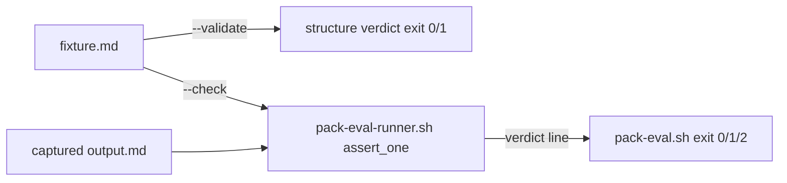

# Handoff Document for Agent B (Blake)
## TAD v3.1 - Evidence-Based Development

**From:** Alex (Agent A - Solution Lead)
**To:** Blake (Agent B - Execution Master)
**Date:** 2026-07-05
**Project:** TAD Framework
**Task ID:** TASK-20260705-001
**Handoff Version:** 3.1.0
**Epic:** EPHEMERAL-surplus-pack-behavioral-examples-scaffold.md (Phase 1/1)
**Supersedes:** earlier non-template draft at this same path (overwritten in place, 2026-07-05)

---

## 🔴 Gate 2: Design Completeness (Alex必填)

**执行时间**: 2026-07-05 (YOLO Epic — design pass)

### Gate 2 检查结果

| 检查项 | 状态 | 说明 |
|--------|------|------|
| Architecture Complete | ✅ | Thin-wrapper design: new `--validate` lint + `--check` delegation to existing runner. No duplication of `.tad/scripts/pack-eval-runner.sh` |
| Components Specified | ✅ | §4.2 specifies pack-eval.sh modes, exit codes, 3 new fixtures' required structure, gate checklist wording |
| Functions Verified | ✅ | MQ2 table — all delegated-to functions exist in pack-eval-runner.sh with line numbers |
| Data Flow Mapped | ✅ | MQ3 — fixture → parse → count → verdict → exit code |

**Gate 2 结果**: ⚠️ PARTIAL PASS

**如果 PARTIAL PASS 或 FAIL，说明**:
- Expert review (min 2) NOT yet run — deferred to the Conductor's review pass per YOLO Epic workflow. §9.2 Audit Trail is pending Conductor integration.

**Alex确认**: 我已验证所有设计要素（grounded against live repo state, §7.3），Blake可以独立根据本文档完成实现。

---

## 📋 Handoff Checklist (Blake必读)

Blake在开始实现前，请确认：
- [ ] 阅读了所有章节
- [ ] **阅读了「📚 Project Knowledge」章节中的历史经验**
- [ ] 所有"强制问题回答（MQ）"都有证据
- [ ] 理解了真正意图（不只是字面需求）
- [ ] 每个Phase的交付物和证据要求都清楚
- [ ] 确认可以独立使用本文档完成实现

❌ 如果任何部分不清楚，**立即返回Alex要求澄清**，不要开始实现。

---

## 1. Task Overview

### 1.1 What We're Building

Three deliverables, closing the "validation theater" P0 from the cross-model YOLO audit:

1. **`.tad/hooks/lib/pack-eval.sh`** — a gate-usable CLI with two modes:
   - `--validate <fixture.md>`: NEW capability — structural lint of a behavioral fixture (frontmatter fields, required body sections, regex sanity, portability rules). Deterministic exit codes (0 pass / 1 fail).
   - `--check <fixture.md> <output.md>`: DELEGATES marker-checking to the existing `.tad/scripts/pack-eval-runner.sh` and maps its printed verdict to a real exit code (0 PASS / 1 FAIL / 2 SKIP), because the runner itself is advisory (always exits 0 in single mode).
2. **One additional behavioral fixture per pilot pack** (ai-agent-architecture, web-frontend, code-security), bringing each to **2 input/expected fixture pairs**, each targeting rule areas DISJOINT from the pack's existing fixture.
3. **Gate 3 checklist item** — "(pack handoffs only) examples/ fixtures present and passing pack-eval.sh --validate" added to `.tad/gates/gate-canonical-checklist.md` (SSOT) and propagated to the `gate/SKILL.md` inline copy. Additive-only edit (SAFETY constraint count guarded, AC13).

### 1.2 Why We're Building It

**业务价值**：Cross-model YOLO audit (Codex 3/5, Gemini 2/5, codified in principles.md "YOLO Epic Execution" entry) flagged that "13/13 installed" proves file operations, not behavioral quality. Fixtures + a mechanical validator make pack quality checkable instead of presence-only.
**用户受益**：Future pack builds/upgrades get a blocking, runnable quality floor at Gate 3 instead of paper acceptance.
**成功的样子**：当任何 pack handoff 在 Gate 3 能一条命令验证 "examples/ 结构有效 + 输出可判 PASS/FAIL" 时，这个功能就成功了。

### 1.3 🆕 Intent Statement（意图声明）

**真正要解决的问题**：让 pack 行为质量的最低门槛（fixtures 存在、结构可解析、markers 可判别）变成 Gate 3 可机械执行的检查，而不是"文件装上了 = 质量合格"。

**⚠️ GROUNDING DELTA（Epic 文本 vs 仓库实际状态 — Blake 必读）**:
The Epic scope line was written by a surplus scan WITHOUT grounding (the referenced grounding file `.tad/evidence/yolo/surplus-pack-behavioral-examples-scaffold/phase1-grounding.md` does not exist). Live-repo grounding (2026-07-05, §7.3) found prior work — YOLO P5, commit `68c85a1` + discriminative fix `2311f9e` — already shipped:
- 1 discriminative fixture per pilot pack at `.claude/skills/<pack>/examples/<name>.md` (flat, NOT `examples/fixtures/`), across 14 packs total
- `.tad/scripts/pack-eval-runner.sh` (236-line advisory assertion engine, BSD-safe)
- `.tad/capability-packs/behavioral-eval-status.yaml` side-file

Therefore this handoff ADAPTS the Epic's literal text:
- **Fixtures stay in flat `examples/`** (not `examples/fixtures/`) — consistent with the 14 existing fixtures and the runner's path-fallback `sed 's#.*/skills/\([^/]*\)/examples/.*#\1#p'`. A `fixtures/` subdirectory would create a two-convention split and a SECOND fixture format for zero benefit.
- **"Add 2 fixture pairs" → "bring each pilot pack to 2 fixture pairs"** — each pack already has 1 (a single fixture .md IS an input/expected pair: `## Input Scenario` + `## Expected Markers`). Blake adds 1 new fixture per pack.
- **pack-eval.sh reuses, never reimplements, the runner** — per the L1 principle "Never Hand-Write What an Existing Tool Already Does". Only `--validate` (structure lint) is genuinely new logic.

**不是要做的（避免误解）**：
- ❌ 不是重写/替代 `.tad/scripts/pack-eval-runner.sh` — `--check` 必须委托它
- ❌ 不是新建 `examples/fixtures/` 子目录或第二种 fixture 格式（.input/.expected 对文件）
- ❌ 不是给其余 21 个 packs 补 fixtures（out of scope）
- ❌ 不是接进 release-verify.sh，也不是 live agent-execution eval（fixtures 是 marker-checked，不是 agent-replayed）
- ❌ 不是修改 `behavioral-eval-status.yaml`（pending→verified 只能由 Conductor 在真实 eval run 后翻转）

**Blake请确认理解**：
```
在开始实现前，请用你自己的话回答：
1. 这个功能解决什么问题？（validation theater — 存在性检查 ≠ 行为质量）
2. 用户会如何使用？（Gate 3 对 pack handoff 跑 pack-eval.sh --validate；开发时用 --check 判输出）
3. 成功的标准是什么？（§9.1 全绿：6 个 fixtures 全过 --validate，新 fixtures 的合成自测 PASS/控制组 FAIL，gate 两文件含新条目且 SAFETY count 不降）

只有Human确认你的理解正确后，才能开始实现。（YOLO mode: Conductor 代行确认）
```

---

## 📚 Project Knowledge（Blake 必读）

**⚠️ MANDATORY READ — Blake 在开始实现前，必须执行以下 Read 操作：**
1. Read `.tad/project-knowledge/patterns/shell-portability.md`
2. Read `.tad/project-knowledge/patterns/pack-evaluation.md`
3. Read `.tad/project-knowledge/patterns/ac-verification.md`
4. Read the handoff's "⚠️ Blake 必须注意的历史教训" entries carefully

### 步骤 1：识别相关类别

本次任务涉及的领域：
- [x] code-quality - shell script patterns
- [x] testing - fixture self-test / discrimination
- [x] architecture - reuse-not-rewrite, SSOT propagation

### 步骤 2：历史经验摘录

**已读取的 project-knowledge 文件**：

| 文件 | 相关记录数 | 关键提醒 |
|------|-----------|----------|
| principles.md | 4 条 | Never hand-write what an existing tool does; YOLO audit validation theater; grep -c SAFETY count 是 smoke alarm（改 gate prose 时保留 constraint 原词）; 判断域归属 |
| patterns/shell-portability.md | 多条 | BSD/macOS-safe：无 `grep -P`；distinct-match 计数用 `grep -oE \| sort -u \| wc -l` 而非 `grep -c` |
| patterns/pack-evaluation.md | 多条 | Discriminative gate：只有 pack-specific markers 驱动 PASS/FAIL；generic markers 会让 no-pack 输出误 PASS（实证：ai-evaluation CONTROL combined 3/3 但 discriminative 0） |
| patterns/ac-verification.md | 多条 | AC 命令 dry-run 纪律；表格内 `\|` 转义，提取执行时先反转义；防 self-leak |

**⚠️ Blake 必须注意的历史教训**：

1. **Never Hand-Write What an Existing Tool Already Does** (来自 principles.md, 2026-05-28)
   - 问题：绕过已有机制从记忆里重写 → 14 个目录漏装
   - 解决方案：`--check` 模式必须 `bash .tad/scripts/pack-eval-runner.sh "$fixture" "$output"` 委托，只解析其 verdict 行映射 exit code

2. **Discriminative gate, not combined count** (来自 patterns/pack-evaluation.md / commit 2311f9e)
   - 问题：combined pattern 混入 generic markers，no-pack 输出也能过
   - 解决方案：新 fixtures 必须设 `discriminative_pattern` + `min_discriminative`（只含 pack-introduced 术语），且合成控制组输出必须 FAIL

3. **Validation theater** (来自 principles.md YOLO audit entry, 2026-05-15)
   - 问题：结构检查证明文件存在，不证明行为质量
   - 解决方案：本任务的 self-test AC（§9.1 行 6/7）要求每个新 fixture 有 PASS 合成输出 + FAIL 控制输出双向证据

4. **Gate prose 改动可能触发 SAFETY count 误报** (来自 principles.md, 2026-05-31)
   - 问题：`grep -c 'MUST\|MANDATORY\|VIOLATION'` 基线把 constraint 实体和 prose 引用混在一个数字里
   - 解决方案：本任务是纯 additive 编辑 — count 只允许 ≥ 基线（gate/SKILL.md 基线 32，canonical 基线 1，已 pre-impl 记录于 §9.1 行 B4）

### Blake 确认

- [ ] 我已阅读上述历史经验
- [ ] 我理解需要避免的问题
- [ ] 如遇到类似情况，我会参考上述解决方案

---

## 2. Background Context

### 2.1 Previous Work

- **YOLO P5** (`68c85a1`, 2026-05-31): `pack-eval-runner.sh` + 14 discriminative fixtures (1 per installed pack). Runner is intentionally advisory — no `set -e`, always exits 0 from `main` in single mode; verdict is in the PRINTED line (`→ PASS` / `→ FAIL` / `SKIP`).
- **Discriminative fix** (`2311f9e`): PASS/FAIL driven by frontmatter `discriminative_pattern`/`min_discriminative`; combined count demoted to secondary context.
- **behavioral-eval-status.yaml**: side-file tracking pending/verified per pack. DO NOT TOUCH — only the Conductor flips status after a real eval run.
- **Precedent for a strict hooks/lib verifier**: `.tad/hooks/lib/skill-body-verify.sh` (`set -euo pipefail`, exit 0/1, prints per-check lines).

### 2.2 Current State

| Artifact | Current | Target |
|----------|---------|--------|
| `.claude/skills/ai-agent-architecture/examples/` | 1 fixture (multi-agent-design-decisions.md, 70 lines) | 2 fixtures |
| `.claude/skills/web-frontend/examples/` | 1 fixture (design-token-consumption.md, 55 lines) | 2 fixtures |
| `.claude/skills/code-security/examples/` | 1 fixture (sast-dast-triage-pipeline.md, 62 lines) | 2 fixtures |
| `.tad/hooks/lib/pack-eval.sh` | does not exist | exists, `--validate` + `--check` |
| `.tad/gates/gate-canonical-checklist.md` Gate 3 | 6 items, 0 mentions of pack-eval | +1 conditional item |
| `gate/SKILL.md` inline Gate 3 checklist | 5 items (pre-existing drift vs canonical — see §10.2) | +1 conditional item |

### 2.3 Dependencies

- `.tad/scripts/pack-eval-runner.sh` (exists, unmodified by this task)
- bash 3.2+/BSD userland (macOS) — no GNU-only flags

---

## 3. Requirements

### 3.1 Functional Requirements

- FR1: `pack-eval.sh --validate <fixture.md>` exits 0 iff the fixture satisfies ALL structural rules in §4.2.1; exits 1 otherwise, printing each failed rule on its own `FAIL:` line.
- FR2: `pack-eval.sh --check <fixture.md> <output.md>` invokes `.tad/scripts/pack-eval-runner.sh` in single-fixture mode, re-prints its verdict line, and exits 0 on `→ PASS`, 1 on `→ FAIL`, 2 on `SKIP`.
- FR3: Each pilot pack gains 1 new fixture following the exact structure of the existing 14 (frontmatter: `name`, `description`, `pack`, `tests_rules`, `min_marker_count`, `discriminative_pattern`, `min_discriminative`; body: `# Fixture:`, `## Input Scenario`, `## Expected Markers`, `## Verification Command` with a `grep -oE` bash block, `## Anti-Slop Check`), whose `tests_rules` are DISJOINT from the pack's existing fixture.
- FR4: All 6 pilot fixtures (3 existing + 3 new) pass `--validate` — existing fixtures unmodified (§10.1 warning 3 if a lint rule trips on them).
- FR5: Gate 3 canonical checklist gains the conditional item (exact text in §4.2.3), propagated to the `gate/SKILL.md` inline copy; both edits additive-only.
- FR6: Per new fixture: a synthetic marker-rich output PASSes `--check` and a synthetic generic (no-pack) control output FAILs `--check`; both captured to `.tad/evidence/pack-eval/2026-07-05/`.

### 3.2 Non-Functional Requirements

- NFR1: BSD/macOS-portable — no `grep -P`, no `mapfile`/`readarray`, no GNU-only `sed -i` semantics; counting via `grep -oE | sort -u | wc -l`.
- NFR2: `--validate` uses strict mode (`set -euo pipefail` acceptable — it is a gate verifier like skill-body-verify.sh, not a hook); it must degrade a MISSING file to `FAIL: file not found` + exit 1, never an unbound-variable crash.
- NFR3: pack-eval.sh is NOT a Claude Code hook and must never be wired into settings.json (principles.md: mechanical enforcement rejected on single-user CLI).
- NFR4: Script header must carry a SAFETY comment stating: gate-verifier, not a hook; `--check` delegates to pack-eval-runner.sh.
- NFR5: Script is executable (`chmod +x`).

### 3.3 Optimization Target

N/A — no numeric optimization goal.

---

## 4. Technical Design

### 4.1 Architecture Overview

```
Gate 3 (pack handoffs)                Developer / Conductor
        │                                      │
        ▼                                      ▼
.tad/hooks/lib/pack-eval.sh ──--check──▶ .tad/scripts/pack-eval-runner.sh (UNCHANGED)
        │--validate                            │ assert_one(): discriminative gate
        ▼                                      ▼
.claude/skills/<pack>/examples/*.md    captured output .md → verdict line → exit code
```

Division of labour: `--validate` = fixture STRUCTURE lint (new logic, lives in pack-eval.sh). Marker assertion = runner (existing, delegated). Agent-output PRODUCTION = Conductor spawning sub-agents (out of scope, unchanged).

### 4.2 Component Specifications

#### 4.2.1 `--validate <fixture.md>` structural rules (each prints `OK:`/`FAIL:`/`WARN:` line)

1. File exists and has a closed frontmatter fence (two `---` lines).
2. Frontmatter contains non-empty: `name`, `pack`, `discriminative_pattern`; numeric: `min_marker_count`, `min_discriminative`.
3. `pack:` value equals the parent pack dir name (path form `.claude/skills/<pack>/examples/<file>.md`); if the path doesn't match that shape, print `WARN:` (not FAIL) — keeps the tool usable on out-of-tree drafts.
4. Body contains sections: `## Input Scenario`, `## Expected Markers`, `## Verification Command`.
5. The `## Verification Command` section contains a `grep -oE` line (parse the same way as runner's `parse_pattern`, L103).
6. `discriminative_pattern` is a valid ERE after the runner's own un-escaping (`parse_disc_pattern` L127-148 collapses YAML `\\` → `\`): `printf 'x' | grep -oE "$pat" >/dev/null 2>&1; [ $? -le 1 ]` (exit 2 = bad regex → FAIL).
7. Portability: fixture contains no `grep -P` occurrences.
8. Exit 0 iff zero FAIL lines.

#### 4.2.2 `--check <fixture.md> <output.md>`

- Run `verdict=$(bash .tad/scripts/pack-eval-runner.sh "$fixture" "$output")`, print `$verdict`.
- Map: contains `→ PASS` → exit 0; `→ FAIL` → exit 1; otherwise (SKIP/no pattern) → exit 2.
- Do NOT re-parse frontmatter or re-count markers — delegation only.

#### 4.2.3 Gate 3 checklist item (exact text)

In `.tad/gates/gate-canonical-checklist.md` under `## Gate 3: Implementation Quality`, append:

```
- [ ] Pack examples valid (pack handoffs only) — handoff 创建/修改 `.claude/skills/<pack>/` 时，该 pack `examples/` 目录存在 ≥1 fixture 且全部通过 `bash .tad/hooks/lib/pack-eval.sh --validate`. Why ME: 只检查 fixture 结构有效性（非 pack handoff → N/A，不阻塞）
```

Propagate the same item (one `- [ ]` line, may be condensed to one sentence containing the load-bearing string `pack-eval.sh --validate`) into the `gate/SKILL.md` inline `Critical Check` list for Gate 3 (around L277-282). Update both files' stated item counts if present. Do NOT touch the pre-existing provenance drift (§10.2).

#### 4.2.4 New fixtures (1 per pilot pack)

Blake MUST first Read the pack's `SKILL.md` (and references it cites) to select pack-introduced discriminative markers — markers must be REAL rule names/thresholds/tool facts from the pack, not invented (invented markers = slop). Requirements per fixture:

| Pack | Existing fixture covers | New fixture MUST target (suggested) |
|------|------------------------|--------------------------------------|
| ai-agent-architecture | `/design` Phase 0-1, D1-D10 walk, disaster mapping | `/audit` mode on an EXISTING agent system (audit report artifact, decision-gap findings) |
| web-frontend | DESIGN.md token consumption, container queries, RSC boundary | testing/a11y/performance judgment area (pick from SKILL.md, e.g. component test strategy or a11y rules) |
| code-security | SAST/DAST four-gate triage, EPSS/KEV/SSVC, exit 183 | secret detection workflow (Gitleaks/TruffleHog verified-vs-unverified, rotation-not-suppression, `# gitleaks:allow` anti-pattern) or IaC/Checkov |

Hard constraints (all three):
- `tests_rules` list DISJOINT from the existing fixture's `tests_rules` (zero overlapping entries).
- `discriminative_pattern` contains ONLY pack-introduced terms/thresholds/named rules — nothing that restates the input scenario or generic vocabulary. Justify each marker in `## Anti-Slop Check` with ✅/❌ lines, matching the existing fixtures' format.
- `min_discriminative: 3` (default parity with existing fixtures).
- 45-70 lines each (parity with existing 55-70 line fixtures).

### 4.3 Data Models

Fixture frontmatter schema (established, do not extend): `name`, `description`, `pack`, `tests_rules[]`, `min_marker_count`, `discriminative_pattern`, `min_discriminative`.

### 4.4 API Specifications

CLI contract only (no HTTP): `pack-eval.sh --validate <f>` / `--check <f> <o>` / `-h|--help` (usage text). Unknown/missing args → usage + exit 1.

### 4.5 User Interface Requirements

N/A — CLI only.

---

## 5. 🆕 强制问题回答（Evidence Required）

### MQ1: 历史代码搜索

**回答**：
- [x] 是 — Epic 引用 "html-anything examples/ pattern"，需确认已有实现

#### 搜索证据
```bash
find . -name "pack-eval*" -not -path "*/worktrees/*" -not -path "*/.tad.backup*"
# → ./.tad/evidence/pack-eval  ./.tad/scripts/pack-eval-runner.sh  ./.tad/project-knowledge/patterns/pack-evaluation.md
git log --oneline -3 -- .claude/skills/ai-agent-architecture/examples/
# → f7e4efb Batch 3 upgrade; 2311f9e discriminative gate fix; 68c85a1 pack behavioral eval runner + fixtures [YOLO P5]
```

#### 决策说明
- **找到了什么**：完整的 fixture 体系 + assertion runner 已存在（14 packs, 1 fixture each）
- **位置**：`.tad/scripts/pack-eval-runner.sh`; `.claude/skills/<pack>/examples/*.md`
- **决定**：✅ 复用 runner（--check 委托）；✅ 复用 fixture 格式与目录约定；新建仅 --validate 逻辑 + 3 个新 fixtures
- **原因**：L1 principle "Never Hand-Write What an Existing Tool Already Does"

**Human验证点**：搜索确实执行了；复用决策与 L1 原则一致。

---

### MQ2: 函数存在性验证

**回答**：

#### 函数清单

| 函数名 | 文件位置 | 行号 | 代码片段 | 验证 |
|--------|---------|------|---------|------|
| `parse_min_count` | .tad/scripts/pack-eval-runner.sh | 36 | `parse_min_count() {` | ✅ |
| `parse_pack` | .tad/scripts/pack-eval-runner.sh | 56 | `parse_pack() {` | ✅ |
| `parse_name` | .tad/scripts/pack-eval-runner.sh | 80 | `parse_name() {` | ✅ |
| `parse_pattern` | .tad/scripts/pack-eval-runner.sh | 103 | `parse_pattern() {` | ✅ |
| `parse_disc_pattern` | .tad/scripts/pack-eval-runner.sh | 127 | `parse_disc_pattern() {` | ✅ |
| `count_matches` | .tad/scripts/pack-eval-runner.sh | 170 | `count_matches() {` | ✅ |
| `assert_one` | .tad/scripts/pack-eval-runner.sh | 191 | `assert_one() {` | ✅ |
| `run_all` | .tad/scripts/pack-eval-runner.sh | 240 | `run_all() {` | ✅ |
| `main`（single mode maps rc→0） | .tad/scripts/pack-eval-runner.sh | tail | `# Map verdict rc to 0 for advisory mode` | ✅ |

注：pack-eval.sh 不 source 这些函数 — 只以子进程调用 runner 并解析其 verdict 行（`→ PASS`/`→ FAIL`/`SKIP` 输出契约见 assert_one L191-236）。

**Human验证点**：每个函数都有位置与行号。✅

---

### MQ3: 数据流完整性

**回答**：

#### 数据流对照表

| 数据 | 来源 | 消费者 | 是否使用 | 说明 |
|------|------|--------|---------|------|
| fixture frontmatter 字段 | fixture.md | --validate 规则 2/6; runner parse_* | ✅ | 同一 schema，两个消费者 |
| runner verdict 行 | runner stdout | --check exit-code 映射 | ✅ | 唯一的委托接口 |
| 合成输出 .md | Blake 手写 | --check → evidence | ✅ | §9.1 行 6/7 证据 |
| behavioral-eval-status.yaml | side-file | 无（本任务不读不写） | ❌ | 状态翻转是 Conductor 职责 |

#### 数据流图



**Human验证点**：runner verdict 是唯一委托接口；status.yaml 明确不动。✅

---

### MQ4: 视觉层级

**回答**：
- [x] 无不同状态（CLI 文本输出，OK:/FAIL:/WARN: 前缀即状态区分）→ 跳过

---

### MQ5: 状态同步

**回答**：

#### 状态存储位置

| 数据 | 存储位置1 | 存储位置2 | 同步时机 | 同步方向 |
|------|----------|----------|---------|---------|
| Gate 3 checklist 条目 | .tad/gates/gate-canonical-checklist.md (SSOT) | gate/SKILL.md inline copy | 本次实现内一次性 | canonical → inline |

#### 状态流图

```
gate-canonical-checklist.md (Source of Truth, edit FIRST)
        ↓ 同步时机：canonical 编辑后同一 micro-task 内传播
gate/SKILL.md Gate 3 Critical Check (inline copy)
```

**Human验证点**：主状态 = canonical（文件头自述 "Edit here FIRST, then propagate"）；§9.1 行 9 双文件 grep 防不同步。✅

---

## 6. Implementation Steps（分Phase）

## 6.1 Micro-Tasks

| # | File | Operation | Verification Command | Est. Time |
|---|------|-----------|---------------------|-----------|
| 1 | .tad/hooks/lib/pack-eval.sh | Create script: usage, `--validate` (§4.2.1 rules 1-8), `--check` (§4.2.2), SAFETY header (NFR4), `chmod +x` | `bash -n .tad/hooks/lib/pack-eval.sh && test -x .tad/hooks/lib/pack-eval.sh` | 15 min |
| 2 | /tmp/broken-fixture.md (not committed) | Negative self-test: fixture missing `discriminative_pattern` → `--validate` exit 1 | §9.1 行 5 | 3 min |
| 3 | 3 existing pilot fixtures | Run `--validate` on each — expect 3× exit 0, zero edits | §9.1 行 4 | 2 min |
| 4 | .claude/skills/ai-agent-architecture/examples/<new>.md | Read pack SKILL.md → write fixture 2 per §4.2.4 | `--validate` exit 0 | 15 min |
| 5 | .claude/skills/web-frontend/examples/<new>.md | Same for web-frontend | `--validate` exit 0 | 15 min |
| 6 | .claude/skills/code-security/examples/<new>.md | Same for code-security | `--validate` exit 0 | 15 min |
| 7 | .tad/evidence/pack-eval/2026-07-05/ | Per new fixture: synthetic PASS output + generic control output; run `--check` on both; write results record | §9.1 行 6/7 | 15 min |
| 8 | .tad/gates/gate-canonical-checklist.md → .claude/skills/gate/SKILL.md | Add §4.2.3 item to canonical FIRST, then propagate to inline copy (additive-only) | §9.1 行 9 + 行 13 | 5 min |
| 8b | .agents/skills/ mirrors (design-review P0-1) | Copy every modified/created .claude/skills/ file byte-identically to .agents/skills/ same relative path: 3 new example fixtures + gate/SKILL.md. Use `cp` (never hand-retype) | §9.1 行 14 | 5 min |
| 9 | (all) | Run full §9.1 suite; git commit | §9.1 全部 | 10 min |

### Micro-Task Rules
- Each task targets ONE file (or 2-3 closely related files)
- Task 3 must precede tasks 4-6: if a lint rule FAILs an existing (proven) fixture, fix the LINT RULE, not the fixture (§10.1 warning 3)
- Task 8 order is mandated by the canonical file's own header (edit canonical FIRST)

### Phase 1: examples-scaffold-and-eval（预计 1.5-2 小时，单 Phase）

#### 交付物
- [ ] `.tad/hooks/lib/pack-eval.sh`（新，executable）
- [ ] 3 个新 fixtures（每 pilot pack 1 个）
- [ ] Gate 3 checklist 条目（canonical + inline，additive-only）
- [ ] `.tad/evidence/pack-eval/2026-07-05/` 合成自测证据（6 个输出文件 + 结果记录）

#### 实施步骤
按 §6.1 micro-tasks 1→9 顺序执行。

#### 验证方法
- 运行 §9.1 每行 Verification Method，全部符合 Expected Evidence

#### 🆕 Phase 1 完成证据（Blake必须提供）
提交以下证据给Human：
- [ ] **命令输出**：`--validate` 对 6 个 fixtures 的原始 terminal 输出
- [ ] **测试结果**：§9.1 行 6/7 双向自测输出（PASS + FAIL 各 3 组）
- [ ] **范围证明**：`git diff --stat` 证明改动仅限 §7 文件

**Human审查问题**：
- 新 fixtures 的 markers 真的来自 pack SKILL.md 吗？
- 控制组输出真的 FAIL 了吗？

**Human决策**：✅ Gate 3 → Gate 4（YOLO: Conductor 代审）

---

## 7. File Structure

### 7.1 Files to Create
```
.tad/hooks/lib/pack-eval.sh                                # --validate lint + --check delegation
.claude/skills/ai-agent-architecture/examples/<slug>.md   # fixture 2 (audit-mode area)
.claude/skills/web-frontend/examples/<slug>.md            # fixture 2 (disjoint rule area)
.claude/skills/code-security/examples/<slug>.md           # fixture 2 (secret-detection or IaC area)
.agents/skills/ai-agent-architecture/examples/<slug>.md   # Codex mirror — byte-identical copy (design-review P0-1)
.agents/skills/web-frontend/examples/<slug>.md            # Codex mirror — byte-identical copy
.agents/skills/code-security/examples/<slug>.md           # Codex mirror — byte-identical copy
.tad/evidence/pack-eval/2026-07-05/*                      # synthetic self-test outputs + results record
```

### 7.2 Files to Modify
```
.tad/gates/gate-canonical-checklist.md    # +1 Gate 3 conditional item (§4.2.3), edit FIRST
.claude/skills/gate/SKILL.md              # propagate same item into inline Gate 3 Critical Check
.agents/skills/gate/SKILL.md              # Codex mirror — byte-identical to .claude/skills/gate/SKILL.md (design-review P0-1)
```

### 7.3 Grounded Against (Phase 2 P2.2 — Alex step1c, 2026-04-24)

**Grounded Against** (Alex 实际 Read 过的源文件, 2026-07-05):

- .tad/active/epics/EPHEMERAL-surplus-pack-behavioral-examples-scaffold.md (full)
- .tad/scripts/pack-eval-runner.sh (L1-236: SAFETY header, all parse_* fns, assert_one, main/exit contract)
- .claude/skills/ai-agent-architecture/examples/multi-agent-design-decisions.md (full, 70 lines)
- .claude/skills/web-frontend/examples/design-token-consumption.md (L1-55: frontmatter + body sections + Anti-Slop Check)
- .claude/skills/code-security/examples/sast-dast-triage-pipeline.md (L1-25 frontmatter)
- .tad/gates/gate-canonical-checklist.md (full, 59 lines)
- .claude/skills/gate/SKILL.md (L270-300 Gate 3 inline checklist; grep map of Gate 3 sections)
- .tad/capability-packs/behavioral-eval-status.yaml (L1-30 semantics header)
- .tad/hooks/lib/skill-body-verify.sh (L1-30 strict-verifier precedent)
- .tad/hooks/lib/ directory listing (pack-eval.sh confirmed absent)
- (new — will be created): all §7.1 files

注：Epic 引用的 grounding file `.tad/evidence/yolo/surplus-pack-behavioral-examples-scaffold/phase1-grounding.md` **不存在**（目录未建）。Alex 以上述 live-repo reads 替代 grounding，delta 记录于 §1.3。

---

## 8. Testing Requirements

### 8.1 Unit Tests
- Test `--validate` positive: 3 existing pilot fixtures → exit 0 each
- Test `--validate` negative: temp fixture missing `discriminative_pattern` → exit 1 with `FAIL:` line naming the field
- Test `--check` mapping: PASS→0, FAIL→1, missing output file→2

### 8.2 Integration Tests
- Test end-to-end per new fixture: `--validate` exit 0 → synthetic PASS output `--check` exit 0 → generic control output `--check` exit 1

### 8.3 Edge Cases
- Fixture path outside `.claude/skills/<pack>/examples/` → `--validate` WARN (rule 3), not FAIL
- Missing file argument → usage + exit 1 (no unbound-var crash under `set -u`)
- `discriminative_pattern` with YAML-escaped `\\.` (see design-token-consumption.md) → regex-sanity check must un-escape the same way runner `parse_disc_pattern` (L127-148) does

## 8.4 Friction Preflight

| Friction Point | Required Step | Expected Fix Path | Allowed Substitute | Gate Impact |
|----------------|---------------|-------------------|--------------------|-------------|
| Runner single-mode always exits 0 (advisory by design) | `--check` needs real exit codes | Parse the PRINTED verdict line (`→ PASS`/`→ FAIL`), never modify the runner | None — modifying runner is out of scope | Wrong mapping fails §9.1 行 6/7 |
| gate/SKILL.md inline list already drifted from canonical (5 vs 6 items) | Propagate new item only | Add the new item; leave provenance drift untouched, flag in completion report | N/A | Fixing drift = scope creep; flagging = required |
| Lint rule too strict for a proven existing fixture | Task 3 baseline run | Adjust the lint rule, not the fixture | N/A | §9.1 行 4 requires 3 existing fixtures pass unmodified |

No installs, no network, no auth required. 其余无 friction-sensitive prerequisites。

**Status Enum**: `READY` / `BLOCKED` / `DEGRADED_WITH_APPROVAL` / `EQUIVALENT_SUBSTITUTE` / `NOT_APPLICABLE_WITH_REASON`

## 8.5 Feedback Collection (Non-Code Artifacts)

N/A — no human-judgment artifact (CLI + fixtures verified mechanically).

## 8.6 🆕 Test Evidence Required
Blake必须提供：
- [ ] §9.1 全行执行输出（completion report 粘贴原始 terminal 输出）
- [ ] `.tad/evidence/pack-eval/2026-07-05/` 下 6 个合成输出文件 + 一个 results 记录（每行: fixture, output, verdict, exit code）
- [ ] Edge case 输出（8.3 三项）

---

## 9. Acceptance Criteria

Blake的实现被认为完成，当且仅当：
- [ ] 所有FR（FR1-FR6）实现并验证
- [ ] §9.1 每行 Verification Method 执行且符合 Expected Evidence
- [ ] 合成自测双向证据落盘（PASS 与 FAIL 控制组）
- [ ] 改动范围仅限 §7 文件（git diff 证明）
- [ ] Human/Conductor 验证"这是我期望的"

---

## 9.1 Spec Compliance Checklist ⚠️ PRIMARY VERIFICATION SOURCE — Gate 3 executes each row

> Pipe-escape note: 表格内 `\|` 提取执行时需反转义为 `|`。所有命令在 repo root 运行。

| # | Acceptance Criterion | Verification Type | Verification Method | Expected Evidence | Verified Output (Alex step1d) |
|---|---------------------|-------------------|--------------------|--------------------|-------------------------------|
| B1 | Baseline: each pilot pack has exactly 1 fixture | pre-impl-verifiable | `for p in ai-agent-architecture web-frontend code-security; do echo "$p $(ls .claude/skills/$p/examples/*.md \| wc -l \| tr -d ' ')"; done` | 3 lines, each ending `1` | `ai-agent-architecture 1` / `web-frontend 1` / `code-security 1` (2026-07-05) |
| B2 | Baseline: pack-eval.sh absent | pre-impl-verifiable | `ls .tad/hooks/lib/pack-eval.sh` | No such file or directory | `ls: .tad/hooks/lib/pack-eval.sh: No such file or directory` (2026-07-05) |
| B3 | Baseline: gate files have zero pack-eval mentions | pre-impl-verifiable | `grep -c "pack-eval" .tad/gates/gate-canonical-checklist.md .claude/skills/gate/SKILL.md` | 0 and 0 | `.tad/gates/gate-canonical-checklist.md:0` / `.claude/skills/gate/SKILL.md:0` (2026-07-05) |
| B4 | Baseline: SAFETY constraint counts | pre-impl-verifiable | `grep -c 'MUST\|MANDATORY\|VIOLATION' .claude/skills/gate/SKILL.md .tad/gates/gate-canonical-checklist.md` | record baseline | `gate/SKILL.md:32` / `gate-canonical-checklist.md:1` (2026-07-05) |
| 1 | Script parses clean + executable | post-impl-verifiable | `bash -n .tad/hooks/lib/pack-eval.sh && test -x .tad/hooks/lib/pack-eval.sh && echo SCRIPT_OK` | `SCRIPT_OK` | (post-impl) |
| 2 | Each pilot pack has 2 fixtures | post-impl-verifiable | `for p in ai-agent-architecture web-frontend code-security; do echo "$p $(ls .claude/skills/$p/examples/*.md \| wc -l \| tr -d ' ')"; done` | 3 lines, each ending `2` | (post-impl) |
| 3 | New fixtures' tests_rules disjoint from existing fixture's | post-impl-verifiable | For each pack: paste the two fixtures' `tests_rules` lists side by side in completion report | zero overlapping entries per pack | (post-impl) |
| 4 | All 6 fixtures pass --validate; existing 3 unmodified | post-impl-verifiable | `for f in .claude/skills/ai-agent-architecture/examples/*.md .claude/skills/web-frontend/examples/*.md .claude/skills/code-security/examples/*.md; do bash .tad/hooks/lib/pack-eval.sh --validate "$f" >/dev/null 2>&1 && echo "PASS $f" \|\| echo "FAIL $f"; done; git diff --name-only .claude/skills/ai-agent-architecture/examples/multi-agent-design-decisions.md .claude/skills/web-frontend/examples/design-token-consumption.md .claude/skills/code-security/examples/sast-dast-triage-pipeline.md` | 6× `PASS`, 0× `FAIL`; git diff output empty | (post-impl) |
| 5 | --validate rejects broken fixture | post-impl-verifiable | `printf -- '---\nname: x\npack: y\n---\n# Fixture\n' > /tmp/broken-fixture.md; bash .tad/hooks/lib/pack-eval.sh --validate /tmp/broken-fixture.md; echo "exit=$?"` | ≥1 `FAIL:` line; `exit=1` | (post-impl) |
| 6 | Synthetic PASS self-test (3 new fixtures) | post-impl-verifiable | Per new fixture: `bash .tad/hooks/lib/pack-eval.sh --check <fixture> .tad/evidence/pack-eval/2026-07-05/<name>-pass.md; echo "exit=$?"`（Blake 代入实际路径） | 3× verdict 行含 `→ PASS`; 3× `exit=0` | (post-impl) |
| 7 | Generic control FAIL self-test (3 new fixtures) | post-impl-verifiable | Per new fixture: same command with `<name>-control.md` (generic no-pack answer) | 3× verdict 行含 `→ FAIL`; 3× `exit=1` | (post-impl) |
| 8 | --check delegates (no reimplementation) | post-impl-verifiable | `grep -c "pack-eval-runner.sh" .tad/hooks/lib/pack-eval.sh` ；Blake 在 report 确认 --check 代码路径无 marker 计数逻辑 | ≥1；确认陈述 | (post-impl) |
| 9 | Gate 3 item in BOTH gate files | post-impl-verifiable | `grep -c "pack-eval.sh --validate" .tad/gates/gate-canonical-checklist.md .claude/skills/gate/SKILL.md` | ≥1 and ≥1 | (post-impl) |
| 10 | BSD portability | post-impl-verifiable | `grep -n 'mapfile\|readarray\|grep -P' .tad/hooks/lib/pack-eval.sh; echo "exit=$?"` | no matches, `exit=1` | (post-impl) |
| 11 | Change scope limited to §7 files | post-impl-verifiable | `git diff --stat HEAD` (pre-commit) or `git show --stat` (post-commit) | only §7.1/§7.2 paths (+evidence) | (post-impl) |
| 12 | Runner + status side-file untouched | post-impl-verifiable | `git diff --name-only .tad/scripts/pack-eval-runner.sh .tad/capability-packs/behavioral-eval-status.yaml` | empty output | (post-impl) |
| 13 | Gate edits additive-only (SAFETY) | post-impl-verifiable | `grep -c 'MUST\|MANDATORY\|VIOLATION' .claude/skills/gate/SKILL.md .tad/gates/gate-canonical-checklist.md` | gate/SKILL.md ≥ 32; canonical ≥ 1 (B4 baseline; count is smoke alarm — if lower, run line-set diff per principles.md 2026-05-31) | (post-impl) |
| 14 | Claude↔Codex byte-parity holds (design-review P0-1) | post-impl-verifiable | `bash .tad/hooks/lib/release-verify.sh parity "$(pwd)"; echo "exit=$?"` — plus per-file spot check: `for f in ai-agent-architecture web-frontend code-security; do cmp .claude/skills/$f/examples/<new-slug>.md .agents/skills/$f/examples/<new-slug>.md && echo "IDENTICAL $f"; done; cmp .claude/skills/gate/SKILL.md .agents/skills/gate/SKILL.md && echo "IDENTICAL gate"` | parity `exit=0`; 4× `IDENTICAL` (Blake 代入实际 slug — post-impl 模板行同 6/7) | (post-impl) |

> 行 6/7 命令含 Blake 实现时才确定的文件名，属 post-impl 模板行 — Blake 必须在 completion report 中粘贴代入实际路径后的完整命令与原始输出（ac-verification.md dry-run 纪律）。

---

## 9.2 Expert Review Status (Alex 必填)

### Audit Trail

| Reviewer | Issue | Resolution Section | Status |
|----------|-------|-------------------|--------|
| (pending) | Expert review deferred to the Conductor's review pass per YOLO Epic workflow — this table to be filled before Blake starts | — | Open |

### Expert Prompts Used (optional, for reproducibility)

(to be added by Conductor review pass)

### Experts Selected

Conductor to select. Suggested risk profile: **code-reviewer** (ALWAYS) + a shell-portability-aware second reviewer (e.g. backend-architect) — the risk surface is bash portability, exit-code contracts, and gate-doc SAFETY edits.

### Overall Assessment (post-integration)

Pending Conductor review pass.

---

## 10. Important Notes

### 10.1 Critical Warnings
- ⚠️ 1. **不要改 `.tad/scripts/pack-eval-runner.sh`**，也不要改 `behavioral-eval-status.yaml`（§9.1 行 12 verify）。runner 的 advisory exit-0 是设计决定；--check 的 exit code 来自解析 verdict 行。
- ⚠️ 2. **不要建 `examples/fixtures/` 子目录、不要发明 .input/.expected 双文件格式** — Epic 文本未 grounding，flat `examples/` 单文件 fixture 是既有约定（§1.3 delta）。
- ⚠️ 3. **如果 --validate 的某条 lint 规则 FAIL 了 3 个既有 fixture 之一：改规则，不改 fixture**（既有 fixtures 是 proven convention，§9.1 行 4 要求它们 unmodified 通过）。
- ⚠️ 4. 新 fixtures 的 discriminative markers 必须是 pack SKILL.md/references 里的真实规则名/阈值 — generic 或 invented marker 会让控制组误 PASS 或 fixture 变 slop，§9.1 行 7 直接 FAIL。
- ⚠️ 5. Gate 文件编辑顺序：canonical FIRST，再传播 inline（canonical 文件头自述的契约）；纯 additive，SAFETY count 只能升不能降（§9.1 行 13）。

### 10.2 Known Constraints
- gate/SKILL.md inline Gate 3 checklist（5 items, "MECE verified 2026-06-23"）已落后 canonical（6 items, "verified 2026-07-03", 多出 Provenance 行）。**本任务不修此 drift**（scope creep）；Blake 在 completion report 里 flag 即可。
- Rollout 到其余 21 packs、release-verify.sh 接线、live agent-replay eval 全部 out of scope（Epic 原文）。
- `pack-eval.sh` 放在 `.tad/hooks/lib/` 是 Epic 指定路径；它不是 hook，NFR4 的 SAFETY header 必须写明。

### 10.3 🆕 Sub-Agent使用建议

Blake应该考虑使用：
- [ ] **parallel-coordinator** - 不建议（任务串行依赖：lint 先于 fixtures）
- [ ] **bug-hunter** - 如 --check exit-code 映射异常
- [ ] **test-runner** - §9.1 suite 批量执行
- [ ] **refactor-specialist** - 不需要

完成后在"Sub-Agent使用记录"中说明使用情况。

---

## 11. 🆕 Learning Content（可选）

### 11.1 Decision Rationale: 复用 runner vs 新写完整 eval 脚本

**选择的方案**：thin wrapper（--validate 新逻辑 + --check 委托）

**考虑的替代方案**：

| 方案 | 优点 | 缺点 | 为什么没选 |
|------|------|------|-----------|
| Thin wrapper（选中）| 单一 marker-断言实现；lint 是真正的新能力 | 依赖 runner 的 verdict 行输出契约 | ✅ 选中 |
| 按 Epic 字面新写完整 pack-eval.sh（.input/.expected 对 + grep -F） | 与 Epic 文本一字不差 | 第二套 fixture 格式 + 复制断言逻辑 → 双实现漂移；grep -F 字面串比 discriminative ERE 更脆 | 违反 L1 "Never Hand-Write What an Existing Tool Already Does" |
| 直接扩展 runner 加 --validate | 单文件 | 改动 proven advisory 工具、破坏其 SAFETY 契约 | §9.1 行 12 明确 runner untouched |

**权衡分析**：
核心权衡：Epic 字面服从 vs 仓库既有约定一致性。当前优先级：一致性（唯一 fixture 格式、唯一断言引擎）。

**💡 Human学习点**：surplus 生成的 Epic 文本可能未 grounding — handoff 设计必须以仓库实际状态为准，并把 delta 显式写进 §1.3 让 reviewer 可审。

---

## 12. 🆕 Sub-Agent使用记录

Blake完成后填写：

| Sub-Agent | 是否调用 | 调用时机 | 输出摘要 | 证据链接 |
|-----------|---------|---------|---------|---------|
| parallel-coordinator | ✅/❌ | [...] | [...] | [...] |
| bug-hunter | ✅/❌ | [...] | [...] | [...] |
| test-runner | ✅/❌ | [...] | [...] | [...] |

**Human验证点**：应该调用的都调用了吗？

---

**Handoff Created By**: Alex (Agent A)
**Date**: 2026-07-05
**Version**: 3.1.0
