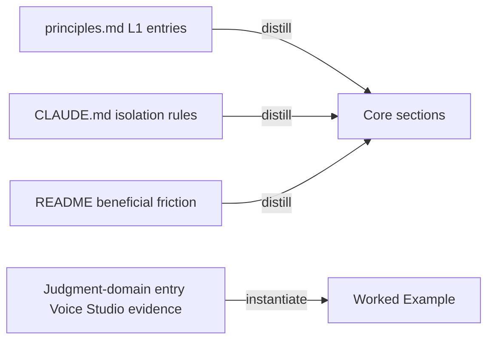

# Handoff Document for Agent B (Blake)
## TAD v3.1 - Evidence-Based Development

**From:** Alex (Agent A - Solution Lead, YOLO Epic design stage)
**To:** Blake (Agent B - Execution Master)
**Date:** 2026-07-06
**Project:** TAD Framework
**Task ID:** TASK-20260706-001
**Handoff Version:** 3.1.0
**Epic:** EPHEMERAL-surplus-tad-methodology-skeleton.md (Phase 1/1)
**Supersedes:** N/A (in-place upgrade of the surplus auto-plan stub at this same path; requirements preserved and expanded)

---

## 🔴 Gate 2: Design Completeness (Alex必填)

**执行时间**: 2026-07-06 00:15

### Gate 2 检查结果

| 检查项 | 状态 | 说明 |
|--------|------|------|
| Architecture Complete | ✅ | Document structure fully specified (§4.1); single new file, no framework changes |
| Components Specified | ✅ | Every required section of the deliverable enumerated with content source (§4.2) |
| Functions Verified | ✅ | Doc-only task — no functions called. Substitute check: all 4 grounding source files verified to exist on disk (§5 MQ2 table) |
| Data Flow Mapped | ✅ | Source-material → deliverable-section coverage map complete (§5 MQ3) |

**Gate 2 结果**: ✅ PASS

**Alex确认**: 我已验证所有设计要素，Blake可以独立根据本文档完成实现。
(Expert review of this handoff is executed by the YOLO Conductor's review stage — see §9.2.)

---

## 📋 Handoff Checklist (Blake必读)

Blake在开始实现前，请确认：
- [ ] 阅读了所有章节
- [ ] **阅读了「📚 Project Knowledge」章节中的历史经验**
- [ ] 所有"强制问题回答（MQ）"都有证据
- [ ] 理解了真正意图（不只是字面需求）
- [ ] 每个Phase的交付物和证据要求都清楚
- [ ] 确认可以独立使用本文档完成实现

❌ 如果任何部分不清楚，**立即返回Alex要求澄清**，不要开始实现。

---

## 1. Task Overview

### 1.1 What We're Building

A single new standalone document, `docs/tad-methodology.md`, that extracts the TAD
methodology as a **domain-agnostic process framework** usable by non-developers
(design, research, writing, audio production), plus one embedded worked example
instantiating the methodology for voice/podcast production (grounded in the Voice
Studio experience recorded in project knowledge).

### 1.2 Why We're Building It

**业务价值**：TAD's methodology (two-agent separation, four gates, human-as-bridge,
knowledge layers) is currently locked inside code-specific skill files and repo-internal
docs. Extracting it lets TAD expand beyond software development — the user's stated
strategic goal (memory: `project_tad-universal-method.md`, IDEA-20260527).
**用户受益**：A designer, researcher, writer, or audio producer can read one document
and apply the full TAD process to their domain without any software context.
**成功的样子**：当一个从未见过这个 repo 的非开发者读完 `docs/tad-methodology.md`
就能为自己的领域（例如播客制作）画出自己的两角色分工、四道门和 handoff 工件时，
这个功能就成功了。

### 1.3 🆕 Intent Statement（意图声明）

**真正要解决的问题**：Separate TAD's *methodology* (the "-ology": roles, gates,
handoff contract, knowledge layers, judgment-domain awareness) from TAD's
*implementation* (Claude Code skills, `.tad/` directories, bash verifiers), so the
methodology travels to domains where the implementation cannot.

**不是要做的（避免误解）**：
- ❌ 不是写新工具/脚本，也不是把 skeleton 做成新的 SKILL.md（IDEA 的 open question，本 phase 明确 OUT）
- ❌ 不是修改任何现有 `.tad/` framework 文件、skills 或 CLAUDE.md
- ❌ 不是把 README/TAD-OVERVIEW 复制拼接 —— 必须**蒸馏**成 domain-agnostic 语言（Knowledge Is Forged at Distill 原则）
- ❌ 不是多领域示例集 —— 只做 voice/podcast 一个 worked example

**Blake请确认理解**：
```
在开始实现前，请用你自己的话回答：
1. 这个功能解决什么问题？(方法论与代码实现的解耦，让非开发者可用)
2. 用户会如何使用？(读一份自包含文档 → 映射到自己的领域)
3. 成功的标准是什么？(§9.1 的 8 条 AC 全绿 + 核心章节零代码词汇)

YOLO mode: understanding confirmation is satisfied by restating the above
in the completion report; the human reviews at Epic acceptance.
```

---

## 📚 Project Knowledge（Blake 必读）

**⚠️ MANDATORY READ — Blake 在开始实现前，必须执行以下 Read 操作：**
1. Read ALL `.tad/project-knowledge/*.md` files listed in 步骤 2 below
2. Read the handoff's "⚠️ Blake 必须注意的历史教训" entries carefully
3. This is NOT optional — project knowledge prevents repeated mistakes

### 步骤 1：识别相关类别

本次任务涉及的领域（勾选所有适用项）：
- [x] architecture - 方法论抽取的结构决策
- [x] 其他类别 - documentation / knowledge-distillation
- [ ] code-quality / security / ux / performance / testing / api-integration / mobile-platform — 不涉及

### 步骤 2：历史经验摘录

**已读取的 project-knowledge 文件**：

| 文件 | 相关记录数 | 关键提醒 |
|------|-----------|----------|
| principles.md | 4 条直接相关 | 这既是**源材料**又是历史经验：Two-Agent System、Four-Gate System、Knowledge Is Forged at Distill、AI/Human Judgment Domain Awareness 四条必须进入交付物 |
| patterns/_index.md | 0 条 | 无 doc-extraction 相关 pattern；无需加载 L2 文件 |
| testing.md / ux.md / performance.md | 0 条 | 与 doc-only 任务无关 |

**⚠️ Blake 必须注意的历史教训**：

1. **Knowledge Is Forged at Distill, Not Captured** (来自 principles.md)
   - 问题：直接照搬原文（session-diary 式复制）产出的文档零上下文读者读不懂
   - 解决方案：写作时以"从未见过本 repo 的读者"为对象；每个概念都要给出 WHY（failure mode），不只是 WHAT

2. **AI/Human Judgment Domain Awareness** (来自 principles.md, 2026-07-03)
   - 问题：这是最新的 L1 原则，容易被漏掉；且它正是 non-dev 扩展的经验基础（Voice Studio 切点/品味 vs AI 语义分析）
   - 解决方案：R2 明确要求覆盖；worked example 中 Gate 4 必须落在人域判断（选择题不是验证题，避免 Rubber Stamp Effect）

3. **Plain Language Quality**（来自 auto-memory 反馈）
   - 问题：模板化、啰嗦、不解释为什么的文档没有读者价值
   - 解决方案：用读者价值测试——非开发者读完能否回答"角色怎么分、门在哪、handoff 里写什么"

### Blake 确认

- [ ] 我已阅读上述历史经验
- [ ] 我理解需要避免的问题
- [ ] 如遇到类似情况，我会参考上述解决方案

---

## 2. Background Context

### 2.1 Previous Work

- `IDEA-20260527-tad-methodology-skeleton.md` — captured idea: extract the
  Alex/Blake + 4-Gate + knowledge-accumulation skeleton as a domain-agnostic
  framework (ECC/Hermes comparison: TAD's differentiator is enforced process depth,
  not skill-library breadth). Promoted via Surplus Burn Mode 2026-07-05.
- `docs/TAD-OVERVIEW.md` (445 lines, Chinese, repo-facing) — full framework intro,
  but code-specific and repo-anchored; **not reusable as-is** (fails R4
  self-containment and R1 domain-agnostic core). See §11 decision rationale.
- Voice Studio + academic-research pack — practical proof TAD concepts already
  transfer to non-dev domains; Voice Studio evidence lives in the
  `AI/Human Judgment Domain Awareness` principles entry (cut-point precision 人域
  vs semantic analysis AI 域), which grounds the worked example WITHOUT needing
  access to the Voice Studio repo.

### 2.2 Current State

- `docs/` exists (43 git-tracked files). `docs/tad-methodology.md` does NOT exist
  (verified 2026-07-06, see §9.1 row P2). No naming collision.
- ⚠️ Grounding note: the Conductor's expected grounding file
  `.tad/evidence/yolo/surplus-tad-methodology-skeleton/phase1-grounding.md` was
  absent at design time. Alex grounded directly against live repo state instead
  (all reads + dry-runs listed in §7.3 and §9.1 Verified Output column).

### 2.3 Dependencies

- None external. All source material is local and verified to exist:
  `.tad/project-knowledge/principles.md`, `CLAUDE.md`, `README.md`,
  `docs/TAD-OVERVIEW.md` (optional contrast reference only).
- No build, no packages, no network.

---

## 3. Requirements

### 3.1 Functional Requirements

- **FR1**: Create `docs/tad-methodology.md` describing the TAD methodology with
  **zero code-specific vocabulary in the core sections** (everything before the
  worked example). Replace code terms with generic ones: "implementation" →
  "execution/production", "code review" → "deliverable review", "tests pass" →
  "acceptance evidence", "codebase" → "body of work".
- **FR2**: Core document MUST cover all six concept groups:
  1. **Two-agent system** — Solution Lead (design/planning/requirements/business
     acceptance) vs Execution Master (production/testing/technical quality), and
     WHY self-review fails (distill the L1 failure_mode: no second perspective,
     designer cannot objectively evaluate own design).
  2. **Human-as-bridge terminal isolation** — the human is the ONLY information
     channel between the two agents; why this beneficial friction is load-bearing.
  3. **Four-gate quality system** — Gate 1 requirements clarity → Gate 2 design
     completeness → Gate 3 production quality → Gate 4 integration/acceptance,
     with the cost-of-late-detection rationale (defects caught at Gate 3/4 cost
     2-10x more than at Gate 1/2).
  4. **Handoff contract** — what a handoff must contain in ANY domain:
     requirements + true intent, background, execution steps, and *verifiable*
     acceptance criteria (each criterion paired with a concrete check anyone can run).
  5. **Three-layer knowledge model** — L1 principles (domain-transcending, with
     failure modes), L2 patterns (reusable playbook), L3 project knowledge —
     including Capture/Distill separation: the doer journals raw, a structural
     stranger distills the reusable entry.
  6. **AI/human judgment domain awareness** — AI-domain judgments (text/data/
     logic: agent decides or cross-checks with another AI) vs human-domain
     judgments (taste/perception/direction: give humans CHOICE questions with a
     shortlist, never VERIFICATION questions — the rubber-stamp effect).
- **FR3**: Include ONE worked-example section for voice/podcast production under
  the exact heading `## Worked Example: Voice/Podcast Production`, mapping every
  abstract concept to a concrete role/artifact. Minimum mappings (≥5 rows, table
  or list): handoff = episode **production brief**; Gate 1 = episode
  concept/audience clarity; Gate 2 = brief completeness review; Gate 3 = audio
  technical QC by AI (levels/noise/timing — AI-domain); Gate 4 = human listens
  for cut-point precision and music taste (human-domain, choice-questions).
- **FR4**: Self-contained: a reader with no access to this repo or any TAD skill
  files can understand and apply the method. No `.tad/` paths, no `/alex` `/blake`
  `/gate` skill invocations referenced as required reading.
- **FR5**: Include a short "Instantiation Guide" section (how to map the skeleton
  to YOUR domain: pick the two roles, define the four gates' questions, define
  the handoff artifact, identify your human-domain judgments).

### 3.2 Non-Functional Requirements

- **NFR1**: Substance — ≥ 1500 words (not a stub outline).
- **NFR2**: Standalone tone — written for external readers; no assumption of
  Claude Code, terminals, or this repository. English language.
- **NFR3**: Distilled, not copied — do not paste principles.md entries verbatim;
  rewrite for a zero-context reader (Knowledge Is Forged at Distill).
- **NFR4**: Change isolation — the ONLY file created/modified is
  `docs/tad-methodology.md` (plus the completion report under `.tad/active/handoffs/`).

---

## 4. Technical Design

### 4.1 Architecture Overview

One new markdown document; no code, no scripts, no framework changes.

Document structure (top-level headings, in order):

```
# TAD Methodology — a domain-agnostic process framework
## Overview (what TAD is, beneficial-friction philosophy, who this is for)
## The Two Agents (Solution Lead / Execution Master + why self-review fails)
## The Human Bridge (terminal isolation, human as sole information channel)
## The Handoff Contract (required contents in any domain)
## The Four Gates (Gate 1-4, cost-of-late-detection rationale)
## The Three Knowledge Layers (L1/L2/L3 + Capture vs Distill)
## Judgment Domain Awareness (AI-domain vs human-domain, choice not verification)
## Instantiation Guide (how to map the skeleton to YOUR domain)
## Worked Example: Voice/Podcast Production   ← exact heading, load-bearing anchor
```

The worked-example heading is the mechanical split point for AC3/AC4 — its exact
text MUST NOT be changed.

### 4.2 Component Specifications

| Deliverable section | Content source (distill, don't copy) |
|--------------------|--------------------------------------|
| Overview | README.md "Beneficial Friction" + three friction points (generalize away from coding) |
| The Two Agents | principles.md "Two-Agent System" entry + its failure_mode |
| The Human Bridge | CLAUDE.md §4 Terminal 隔离 rules, generalized (human relays context between two independent sessions/actors) |
| The Handoff Contract | This handoff template's essence generalized: intent, background, steps, verifiable acceptance criteria, evidence |
| The Four Gates | principles.md "Four-Gate Quality System" + failure_mode (2-10x late-detection cost) |
| The Three Knowledge Layers | principles.md structure (L1) + patterns/_index.md concept (L2) + "Knowledge Is Forged at Distill" entry |
| Judgment Domain Awareness | principles.md "AI/Human Judgment Domain Awareness" entry (Voice Studio evidence, rubber-stamp effect, choice vs verification questions) |
| Instantiation Guide | New synthesis: 4-step mapping recipe (roles → gates → handoff artifact → human-domain boundary) |
| Worked Example | Voice/podcast mapping table per FR3, grounded in the judgment-domain entry's Voice Studio specifics |

### 4.3 Data Models

N/A (prose document). The only structured data is the worked example's mapping
table: columns `TAD concept | Podcast-production equivalent | Who judges (AI/human)`.

### 4.4 API Specifications

N/A.

### 4.5 User Interface Requirements

N/A (markdown document; standard heading hierarchy, one mapping table, no HTML).

---

## 5. 🆕 强制问题回答（Evidence Required）

### MQ1: 历史代码搜索

**问题**：用户是否提到"之前的"、"原来的"、"我们的方案"？

**回答**：
- [x] 是 → Epic 要求"extract the TAD methodology"——即抽取已有方案

#### 搜索证据
```bash
# 搜索命令
ls docs/  &&  find .tad -name "*methodology*"

# 搜索结果
docs/ 含 TAD-OVERVIEW.md (445 行, 中文, repo-facing 完整介绍)
.tad/active/ideas/IDEA-20260527-tad-methodology-skeleton.md (源想法)
docs/tad-methodology.md 不存在
```

#### 决策说明
- **找到了什么**：`docs/TAD-OVERVIEW.md` 已有完整框架介绍
- **位置**：docs/TAD-OVERVIEW.md:1-445
- **决定**：❌ 创建新的（不复用/不改写 TAD-OVERVIEW）
- **原因**：TAD-OVERVIEW 是中文、面向本 repo/外部 agent、充满代码专属词汇与
  `.tad/` 路径 —— 违反 FR1（domain-agnostic core）与 FR4（self-contained）。
  作为对照参考可读，禁止拼接复制。

### MQ2: 函数存在性验证

**问题**：设计中调用了哪些函数？它们都存在吗？

**回答**：doc-only 任务，不调用任何函数。替代验证 —— 所有 grounding 源文件存在性：

| 源文件（替代"函数"） | 文件位置 | 行数 | 代码片段 | 验证 |
|--------|---------|------|---------|------|
| principles.md | .tad/project-knowledge/principles.md | 118 | `# TAD Methodology Principles (Layer 1)` | ✅ |
| CLAUDE.md | ./CLAUDE.md | 87 | `## 4. Terminal 隔离 ⚠️ CRITICAL` | ✅ |
| README.md | ./README.md | 392 | `## 💡 Philosophy: Beneficial Friction` | ✅ |
| TAD-OVERVIEW.md | docs/TAD-OVERVIEW.md | 445 | `# TAD Framework 完整介绍` | ✅ |

（Alex 于 2026-07-06 实际 Read/dry-run 验证，见 §7.3 与 §9.1 P3 行。）

### MQ3: 数据流完整性

**问题**：后端计算/返回了哪些字段？前端都显示了吗？

**回答**：N/A（无后端/前端）。替代对照 —— 源概念 → 交付物章节覆盖表：

| 源概念（"后端字段"） | 用途说明 | 交付物章节（"前端组件"） | 是否覆盖 | 不覆盖原因 |
|---------|---------|---------|---------|-----------|
| Two-Agent System + failure_mode | FR2.1 | The Two Agents | ✅ | - |
| Terminal 隔离/人类桥梁 | FR2.2 | The Human Bridge | ✅ | - |
| Four-Gate System + 迟发现成本 | FR2.3 | The Four Gates | ✅ | - |
| Handoff 合同要素 | FR2.4 | The Handoff Contract | ✅ | - |
| L1/L2/L3 + Capture/Distill | FR2.5 | The Three Knowledge Layers | ✅ | - |
| AI/人域判断 + rubber-stamp | FR2.6 | Judgment Domain Awareness | ✅ | - |
| Voice Studio 实证 | FR3 | Worked Example | ✅ | - |
| SAFETY 条目/发布流程/包体系 | 不适用 | （无） | ❌ | repo 实现细节，非方法论骨架；OUT of scope |



### MQ4: 视觉层级

**问题**：功能有不同状态/类型吗？用户如何区分？

**回答**：
- [x] 无不同状态 → 跳过（静态 markdown 文档，无状态/无 UI）

### MQ5: 状态同步

**问题**：数据存在几个地方？什么时候同步？

**回答**：

| 数据 | 存储位置1 | 存储位置2 | 同步时机 | 同步方向 |
|------|----------|----------|---------|---------|
| 方法论文本 | docs/tad-methodology.md（唯一） | 无 | 无需同步 | - |

```
[Blake 写作] → docs/tad-methodology.md (唯一存储)
✅ 只有一个状态，无需同步
```
源文件（principles.md 等）保持只读，不产生双向同步问题。发布/同步到下游明确 OUT。

---

## 6. Implementation Steps（分Phase）

## 6.1 Micro-Tasks (Optional — recommended for Full/Standard TAD)

| # | File | Operation | Verification Command | Est. Time |
|---|------|-----------|---------------------|-----------|
| 1 | (reads only) | Read principles.md (4 entries), CLAUDE.md §4, README.md philosophy section | reads logged in completion report | 5 min |
| 2 | docs/tad-methodology.md | Draft core sections: Overview → Two Agents → Human Bridge → Handoff Contract → Four Gates → Knowledge Layers → Judgment Domain Awareness → Instantiation Guide | `grep -c '^## ' docs/tad-methodology.md` ≥ 8 | 4-5 min blocks per section |
| 3 | docs/tad-methodology.md | Add `## Worked Example: Voice/Podcast Production` with ≥5-row mapping table + narrative | AC4/AC6 commands (§9.1) | 5 min |
| 4 | docs/tad-methodology.md | Vocabulary sweep of core sections (code terms → generic) | AC3 command (§9.1) = 0 | 3 min |
| 5 | docs/tad-methodology.md | Self-containment sweep (no .tad/ paths, no skill invocations) | AC5 commands (§9.1) = 0 | 2 min |
| 6 | (verification) | Run ALL §9.1 post-impl rows, paste raw outputs | all AC rows green | 3 min |

### Micro-Task Rules
- Each task targets ONE file (only one deliverable file exists)
- Verification is runnable: every check is a grep/awk/test command from §9.1

---

### Phase 1: Write and verify docs/tad-methodology.md（预计 2-3 小时，唯一 Phase）

#### 交付物
- [ ] `docs/tad-methodology.md`（≥1500 词，9 个顶级章节，含 worked example）
- [ ] Completion report（含全部 AC 原始输出）

#### 实施步骤
1. Read source material for grounding（蒸馏，禁止逐字复制）：
   - `.tad/project-knowledge/principles.md`（Two-Agent、Four-Gate、
     Knowledge-Is-Forged-at-Distill、AI/Human Judgment Domain Awareness 四条）
   - `CLAUDE.md`（terminal 隔离规则）
   - `README.md`（Beneficial Friction 哲学，略读）
2. 按 §4.1 结构写 `docs/tad-methodology.md`，遵守 §4.2 的逐节内容来源。
3. 核心章节代码词汇清扫（worked example 之前的全部内容）；worked example 可用
   音频领域词汇。
4. 运行 §9.1 全部 post-impl 验证命令并修复任何失败。

#### 验证方法
- 运行 §9.1 每一行 Verification Method，应得到对应 Expected Evidence
- 快速人工抽查：随机挑一个核心章节，确认无 "code/repo/test suite" 类词汇残留

#### 🆕 Phase 1 完成证据（Blake必须提供）
- [ ] **AC 原始输出**：§9.1 所有 post-impl 行命令的 raw output（粘贴进 completion report）
- [ ] **结构证据**：`grep '^## ' docs/tad-methodology.md` 输出（9 个章节标题）
- [ ] **scope 证据**：`git status --porcelain` 输出（仅新增 docs/tad-methodology.md + completion report）

**Human审查问题**（YOLO：由 Conductor impl-review + Epic 收尾时人类审）：
- 核心章节读起来像给非开发者写的吗？
- worked example 的人域/AI 域划分符合 Voice Studio 实证吗？

**Human决策**：✅ 完成（单 Phase） / ⚠️ 调整本Phase

---

## 7. File Structure

### 7.1 Files to Create
```
docs/tad-methodology.md  # The domain-agnostic methodology skeleton + voice/podcast worked example
```

### 7.2 Files to Modify
```
(none — change isolation per NFR4; do NOT touch .tad/, skills, CLAUDE.md, README.md)
```

### 7.3 Grounded Against (Phase 2 P2.2 — Alex step1c, 2026-04-24)

**Grounded Against** (Alex step1c 实际 Read 过的源文件):

- .tad/project-knowledge/principles.md (full 118 lines via session context, read at 2026-07-06 00:05)
- CLAUDE.md (full 87 lines via session context, read at 2026-07-06 00:05)
- README.md (head 60 lines, read at 2026-07-06 00:12)
- docs/TAD-OVERVIEW.md (head 50 lines, read at 2026-07-06 00:12)
- .tad/active/epics/EPHEMERAL-surplus-tad-methodology-skeleton.md (full, read at 2026-07-06 00:05)
- .tad/active/ideas/IDEA-20260527-tad-methodology-skeleton.md (full, read at 2026-07-06 00:10)
- docs/tad-methodology.md — (new — will be created)

⚠️ Note: the Conductor grounding file `phase1-grounding.md` was absent; the above
direct reads + §9.1 pre-impl dry-runs serve as grounding evidence.

---

## 8. Testing Requirements

### 8.1 Unit Tests
- N/A (no code). Equivalent: per-AC mechanical checks in §9.1 (existence, word
  count, concept greps, vocabulary sweep, anchor check, scope check).

### 8.2 Integration Tests
- Self-containment reading test: §9.1 AC5 (no repo-internal references) is the
  mechanical proxy; Conductor impl-review performs the judgment-level check
  ("could an outsider apply this?").

### 8.3 Edge Cases
- Word "test/testing" in core sections is ALLOWED (generic QA vocabulary); only
  the unambiguous code phrases in the AC3 regex are forbidden.
- "handoff" is TAD vocabulary, not code vocabulary — it stays, but must be
  defined on first use for outside readers.
- The worked-example heading must match AC3/AC4's awk anchor EXACTLY (see §10.1).

## 8.4 Friction Preflight

| Friction Point | Required Step | Expected Fix Path | Allowed Substitute | Gate Impact |
|----------------|---------------|-------------------|--------------------|-------------|
| Heading anchor drift | AC3/AC4 awk split on exact heading text | Use the exact heading `## Worked Example: Voice/Podcast Production`; do not restyle | None — anchor is load-bearing | AC3/AC4 FAIL prevents Gate 3 PASS |
| None else | — | — | — | All operations are local file reads/writes; no installs, no network, no auth |

No other friction-sensitive prerequisites identified.

**Status Enum**: `READY` / `BLOCKED` / `DEGRADED_WITH_APPROVAL` / `EQUIVALENT_SUBSTITUTE` / `NOT_APPLICABLE_WITH_REASON`

## 8.5 Feedback Collection (Non-Code Artifacts)

```yaml
feedback_required: false  # per template Phase-1 rule; quality judged via Conductor impl-review + Epic human acceptance
artifact_type: generic
suggested_dimensions:
  - "readability for non-developers"
  - "concept completeness vs principles.md"
  - "worked-example fidelity to Voice Studio evidence"
notes: "Human-domain judgment (is this understandable/usable by outsiders?) belongs to Epic acceptance, not automated gates."
```

## 8.6 🆕 Test Evidence Required
Blake必须提供：
- [ ] §9.1 全部 post-impl 行的命令原始输出（等价于"测试运行截图"）
- [ ] 覆盖率等价物：MQ3 覆盖表逐行确认（6 个概念组 + worked example 全覆盖）
- [ ] Edge case 证据：AC3 输出 0 且 AC2 六个概念 grep 全部 ≥1（证明清扫没有误伤必需概念）

---

## 9. Acceptance Criteria

Blake的实现被认为完成，当且仅当：
- [ ] 所有 FR1-FR5 实现并通过 §9.1 对应 AC 验证
- [ ] 唯一 Phase 完成并在 completion report 提供全部证据
- [ ] §9.1 所有 post-impl 行 PASS（原始输出粘贴为证）
- [ ] 变更范围仅限 docs/tad-methodology.md（+ completion report）
- [ ] Epic 收尾时 Human 验证"这是我期望的"（YOLO：延后到 Epic acceptance）

---

## 9.1 Spec Compliance Checklist ⚠️ PRIMARY VERIFICATION SOURCE — Gate 3 executes each row

> Run all commands from the repo root. Un-escape `\|` → `|` when extracting
> commands from table cells (template pipe-escape rule).

| # | Acceptance Criterion | Verification Type | Verification Method | Expected Evidence | Verified Output (Alex step1d) |
|---|---------------------|-------------------|--------------------|--------------------|-------------------------------|
| P1 | docs/ directory exists | pre-impl-verifiable | `test -d docs && echo EXISTS` | `EXISTS` | `EXISTS` (2026-07-06) |
| P2 | Target file absent pre-impl (no collision) | pre-impl-verifiable | `test -f docs/tad-methodology.md && echo EXISTS \|\| echo ABSENT` | `ABSENT` | `ABSENT (will be created)` (2026-07-06) |
| P3 | All 4 grounding sources exist | pre-impl-verifiable | `for f in .tad/project-knowledge/principles.md CLAUDE.md README.md docs/TAD-OVERVIEW.md; do test -f "$f" && echo "EXISTS: $f"; done \| wc -l` | `4` | `4` — principles.md 118L, CLAUDE.md 87L, README.md 392L, TAD-OVERVIEW.md 445L (2026-07-06) |
| AC1 | File exists and is substantial (≥1500 words) | post-impl-verifiable | `test -f docs/tad-methodology.md && [ "$(wc -w < docs/tad-methodology.md)" -ge 1500 ] && echo AC1-PASS` | `AC1-PASS` | (post-impl) |
| AC2 | All six required concept groups present | post-impl-verifiable | `for t in 'Solution Lead' 'Execution Master' 'Gate 1' 'Gate 4' 'handoff' 'knowledge'; do [ "$(grep -ci "$t" docs/tad-methodology.md)" -ge 1 ] \|\| echo "FAIL: $t"; done; echo AC2-DONE` | `AC2-DONE` with zero `FAIL:` lines | (post-impl) |
| AC3 | Core sections (before worked example) contain zero code-specific phrases | post-impl-verifiable | `awk '/^## Worked Example: Voice\/Podcast Production$/{exit} {print}' docs/tad-methodology.md \| grep -ciE 'source code\|pull request\|unit test\|compile\|repositor\|git \|CI/CD' \|\| true` | `0` | (post-impl) |
| AC4 | Worked example maps all 4 gates + a handoff-equivalent artifact (≥5 mapping rows) | post-impl-verifiable | `awk '/^## Worked Example: Voice\/Podcast Production$/,0' docs/tad-methodology.md > /tmp/we.md && echo "gates:$(grep -oE 'Gate [1-4]' /tmp/we.md \| sort -u \| wc -l) brief:$(grep -ci 'production brief' /tmp/we.md)"` | `gates:` count = 4 AND `brief:` count ≥ 1 | (post-impl) |
| AC5 | Self-contained: no repo paths or skill invocations | post-impl-verifiable | `echo "tad:$(grep -c '\.tad/' docs/tad-methodology.md)" ; echo "skills:$(grep -cE '/alex\|/blake\|/gate' docs/tad-methodology.md)"` | `tad:0` and `skills:0` | (post-impl) |
| AC6 | Load-bearing heading anchor exact-match present exactly once | post-impl-verifiable | `grep -cx '## Worked Example: Voice/Podcast Production' docs/tad-methodology.md` | `1` | (post-impl) |
| AC7 | Document structure complete (≥8 top-level `##` sections incl. Instantiation Guide) | post-impl-verifiable | `echo "h2:$(grep -c '^## ' docs/tad-methodology.md) inst:$(grep -ci 'Instantiation Guide' docs/tad-methodology.md)"` | `h2:` ≥ 8 AND `inst:` ≥ 1 | (post-impl) |
| AC8 | Change scope isolation: only the deliverable (+ completion report) changed | post-impl-verifiable | `git status --porcelain \| grep -vE 'docs/tad-methodology\.md\|\.tad/active/handoffs/\|\.tad/evidence/' \| wc -l` | `0` | (post-impl) |

> Pre-impl rows dry-run by Alex 2026-07-06 (raw outputs in Verified Output column).
> Post-impl rows filled by Blake at Gate 3 Layer 1.

---

## 9.2 Expert Review Status (Alex 必填)

### Audit Trail

| Reviewer | Issue | Resolution Section | Status |
|----------|-------|-------------------|--------|
| (Conductor review stage) | Expert review is executed by the YOLO Conductor's dedicated review stage AFTER this design stage, per yolo-epic workflow. This designer sub-agent is constrained NOT to spawn reviewers. | Conductor review artifacts in `.tad/evidence/yolo/surplus-tad-methodology-skeleton/` | Open (pending Conductor) |

**Status legend:** Resolved / Open / Deferred（同模板）

### Experts Selected

Delegated to Conductor. Recommended lenses for the review stage:
1. **code-reviewer (AC-mechanics lens)** — verify every §9.1 command is runnable as written (pipe un-escaping, awk anchor, grep exit codes under `set -e`)
2. **docs/methodology lens** — verify FR2's six concept groups are faithfully distilled from principles.md (no drift, no verbatim copying)

### Overall Assessment (post-integration)

- Pending Conductor review stage (design-stage handoff; no expert verdicts yet).

---

## 10. Important Notes

### 10.1 Critical Warnings
- ⚠️ **Heading anchor is load-bearing**: `## Worked Example: Voice/Podcast Production`
  must appear EXACTLY once, exactly as written — AC3/AC4/AC6 split on it mechanically.
- ⚠️ **Do NOT modify any `.tad/` framework file, skill, CLAUDE.md, or README.md**
  (Epic OUT-scope + NFR4). Only `docs/tad-methodology.md` is writable.
- ⚠️ **Grounding file was absent**: `.tad/evidence/yolo/surplus-tad-methodology-skeleton/phase1-grounding.md`
  did not exist at design time. Grounding was done via direct reads (§7.3) and
  dry-runs (§9.1 P1-P3). If the Conductor later supplies a grounding file that
  contradicts §2.2, STOP and flag before implementing.
- ⚠️ **AC3 regex nuance**: `grep -c` exits non-zero when the count is 0 — keep the
  `\|\| true` (un-escaped: `|| true`) suffix when running under `set -e`.

### 10.2 Known Constraints
- Distill, don't copy: verbatim pasting of principles.md entries fails the
  zero-context-reader requirement (NFR3) even if all greps pass.
- The word-count floor (1500) is words (`wc -w`), not lines.
- English deliverable; worked example may use audio-domain vocabulary but core
  sections must stay domain-agnostic AND code-free.
- Multi-domain examples, new tooling, SKILL.md parameterization, publish/sync:
  all OUT (Epic scope + IDEA open questions deferred).

### 10.3 🆕 Sub-Agent使用建议

Blake应该考虑使用：
- [ ] **parallel-coordinator** - 不需要（单文件交付物）
- [ ] **bug-hunter** - 不需要（无代码）
- [x] **general-purpose 校验 agent（可选）** - 完稿后可让一个零上下文 sub-agent 只读
  docs/tad-methodology.md 并复述方法论，作为 R4 self-containment 的廉价冒烟测试
- [ ] **refactor-specialist** - 不需要

完成后在"Sub-Agent使用记录"中说明使用情况。

---

## 11. 🆕 Learning Content（可选）

### 11.1 Decision Rationale: 新建独立文档 vs 改写 TAD-OVERVIEW.md

**选择的方案**：新建 `docs/tad-methodology.md`

**考虑的替代方案**：

| 方案 | 优点 | 缺点 | 为什么没选 |
|------|------|------|-----------|
| 新建独立文档（选中）| 干净满足 FR1/FR4；不动现有文件；面向外部读者 | 与 TAD-OVERVIEW 部分概念重叠 | ✅ 选中 |
| 改写/翻译 TAD-OVERVIEW.md | 复用已有结构 | 中文、repo-anchored、代码词汇密布；改写=大改现有文件（违反 Epic OUT-scope） | 违反变更隔离与 self-containment |
| 直接参数化 alex/blake SKILL.md | 一步到位做成可用 skeleton | IDEA open question，未设计；涉及框架文件修改 | 明确 OUT，留给后续 Epic |

**权衡分析**：
核心权衡：复用已有内容 vs 交付物纯净度。本任务的价值恰恰在"纯净的、可携带的方法论"，
所以纯净度优先。
当前优先级：先有可流通的方法论骨架，工具化后议。

**💡 Human学习点**：
当交付物的核心价值是"与实现解耦"时，从零蒸馏比改写既有实现文档更快也更安全 ——
改写会不自觉继承实现细节（curse of knowledge 的文档版）。

---

## 12. 🆕 Sub-Agent使用记录

Blake完成后填写：

| Sub-Agent | 是否调用 | 调用时机 | 输出摘要 | 证据链接 |
|-----------|---------|---------|---------|---------|
| parallel-coordinator | ❌ | - | - | - |
| bug-hunter | ❌ | - | - | - |
| zero-context 校验 agent（可选） | ✅/❌ | 完稿后 | [...] | [...] |

**Human验证点**：应该调用的都调用了吗？

---

**Handoff Created By**: Alex (Agent A — YOLO Epic design stage)
**Date**: 2026-07-06
**Version**: 3.1.0
