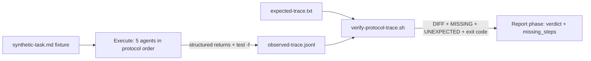

# Handoff Document for Agent B (Blake)
## TAD v3.1 - Evidence-Based Development

**From:** Alex (Agent A - Solution Lead)
**To:** Blake (Agent B - Execution Master)
**Date:** 2026-07-05
**Project:** TAD
**Task ID:** TASK-20260705-001
**Handoff Version:** 3.1.0
**Epic:** EPHEMERAL-surplus-tad-self-test-agent.md (Phase 1/1)
**Supersedes:** N/A (completes the v0 skeletal draft previously at this same path; its
decisions — 9-step expected trace incl. socratic, UNEXPECTED diff lines, hermetic check,
CONSTs-fallback args quirk — are integrated below)

---

## 🔴 Gate 2: Design Completeness (Alex必填)

**执行时间**: 2026-07-05 (YOLO Epic design step)

### Gate 2 检查结果

| 检查项 | 状态 | 说明 |
|--------|------|------|
| Architecture Complete | ✅ | Workflow (orchestrator) + bash verifier (testable core) + fixtures (discrimination pair) — 3-layer split follows established TAD pattern (workflow orchestrates, eval scripts verify) |
| Components Specified | ✅ | 8 files fully specified in §4.2 with I/O contracts, output format, exit codes |
| Functions Verified | ✅ | Workflow harness globals (agent/phase/log/budget/args) verified against loop-discover.workflow.js; trace event schema verified against live .tad/evidence/traces/*.jsonl (MQ2) |
| Data Flow Mapped | ✅ | Synthetic run → sandboxed artifacts → observed-trace.jsonl → verifier diff vs expected-trace.txt → PASS/FAIL + MISSING/UNEXPECTED (§4.3, MQ3) |

**Gate 2 结果**: ✅ PASS

**注**: 本 handoff 由 YOLO Epic Conductor 流程产生。Layer 2 expert review 由 Conductor 在
design 步骤之后独立执行（见 §9.2）。

**Grounding 说明**: Conductor 指定的 grounding file
(`.tad/evidence/yolo/surplus-tad-self-test-agent/phase1-grounding.md`) 在磁盘上**不存在**
（已用 find 全 evidence 树确认）。Alex 未做任何假设，直接对仓库实际状态做了 grounding：
读取 `.claude/workflows/` 现有 10 个 workflow、`loop-discover.workflow.js` 全文、
`yolo-epic.workflow.js` 头部、`.tad/evidence/traces/*.jsonl` 全量事件类型清单与
live `gate_result` 行、`.tad/eval/` 与 `.tad/hooks/lib/` 目录、trajectory-eval Epic
完成报告、以及本路径上的 v0 draft handoff。所有设计事实以 §7.3 Grounded Against 为准。

**Alex确认**: 我已验证所有设计要素，Blake可以独立根据本文档完成实现。

---

## 📋 Handoff Checklist (Blake必读)

Blake在开始实现前，请确认：
- [ ] 阅读了所有章节
- [ ] **阅读了「📚 Project Knowledge」章节中的历史经验**
- [ ] 所有"强制问题回答（MQ）"都有证据
- [ ] 理解了真正意图（不只是字面需求）
- [ ] 每个Phase的交付物和证据要求都清楚
- [ ] 确认可以独立使用本文档完成实现

❌ 如果任何部分不清楚，**立即返回Alex要求澄清**，不要开始实现。

---

## 1. Task Overview

### 1.1 What We're Building

A **TAD self-test workflow** (`.claude/workflows/tad-self-test.workflow.js`) that runs a
synthetic TAD task end-to-end (design → handoff → expert review → implement → accept)
inside a sandboxed run directory, records the observed protocol steps as a trace file,
and mechanically diffs that observed trace against an **expected-trace fixture** (9
protocol steps: gate_1, socratic, handoff_created, expert_review≥2, gate_2,
implementation, gate_3, gate_4, completion_report). Missing steps produce a FAIL that
names each missing step; extra observed event types are reported as informational
UNEXPECTED lines. The trace-comparison core lives in a standalone bash verifier
(`.tad/eval/self-test/verify-protocol-trace.sh`) so it is testable without running the
workflow harness.

### 1.2 Why We're Building It

**业务价值**：Validates that TAD agents actually follow the protocol (Socratic step,
expert review min 2, Gates 1-4, completion report) via automated behavioral tests instead
of manual spot-checks. Manual spot-checks don't scale and miss slow protocol drift (the
v2.7 quality-chain failure is the canonical precedent). The trajectory eval harness
(EPIC-20260701, archived, complete) proves gates catch real P0s; this self-test catches
protocol **DRIFT** before it ships.
**用户受益**：Framework maintainer gets a one-command regression check ("did a
SKILL/protocol edit silently break a protocol step?") runnable after any framework change.
**成功的样子**：当 verifier 对 PASS fixture 输出 `SELF-TEST: PASS` (exit 0)，对 FAIL
fixture 输出 `MISSING: <named step>` + `SELF-TEST: FAIL` (exit 1)，且 workflow 文件结构
完整、可被 Conductor live test-run 时，这个功能就成功了。

### 1.3 🆕 Intent Statement（意图声明）

**真正要解决的问题**：Protocol-step compliance is currently verified by human transcript
reading. We need a mechanical, recomputable detector: given a protocol run's artifacts
and trace, assert every mandatory TAD step happened — and name the step when one didn't.
Verification must be evidence-based (grep/parse produced artifacts + trace events), NOT
agent self-report — no "the agent says it gated" acceptance.

**不是要做的（避免误解）**：
- ❌ 不是 judging output QUALITY of the synthetic task — only protocol-STEP compliance
  (quality judging is the trajectory eval harness's job at `.tad/eval/judge/`)
- ❌ 不是 changing any gate protocol, SKILL file, or hook code — zero edits to
  `.claude/skills/`, `.tad/hooks/`, `.tad/gates/`, `.tad/references/`
- ❌ 不是 multi-model (Codex) runs — Claude Workflow only
- ❌ 不是 writing to REAL TAD state — synthetic artifacts are sandboxed under
  `.tad/eval/self-test/runs/`; never write to `.tad/active/` or `.tad/evidence/traces/`
- ❌ 不是 CI scheduling — a later task may cron this

**Blake请确认理解**：
```
在开始实现前，请用你自己的话回答：
1. 这个功能解决什么问题？— 用机械 diff 检测 TAD 协议步骤漂移（缺步骤 → FAIL 并点名）
2. 用户会如何使用？— 框架改动后跑 verifier / Conductor 跑 workflow 做行为回归
3. 成功的标准是什么？— §9.1 全绿：PASS/FAIL fixtures 判别正确 + workflow 结构完整 + 零协议文件改动 + 零真实状态写入

只有Human确认你的理解正确后，才能开始实现。（YOLO 模式下由 Conductor 的 review 步骤代行。）
```

---

## 📚 Project Knowledge（Blake 必读）

**⚠️ MANDATORY READ — Blake 在开始实现前，必须执行以下 Read 操作：**
1. Read `.tad/project-knowledge/patterns/shell-portability.md`
2. Read `.tad/project-knowledge/patterns/ac-verification.md`
3. Read `.tad/project-knowledge/patterns/gate-design.md`
4. Read the "⚠️ Blake 必须注意的历史教训" entries below

### 步骤 1：识别相关类别

本次任务涉及的领域（勾选所有适用项）：
- [x] code-quality - workflow JS + bash 脚本模式
- [x] testing - fixture discrimination（PASS/FAIL 判别对）
- [x] architecture - workflow 编排 vs 可测试核心的分层
- [ ] security
- [ ] ux
- [ ] performance
- [ ] api-integration
- [ ] mobile-platform

### 步骤 2：历史经验摘录

**已读取的 project-knowledge 文件**：

| 文件 | 相关记录数 | 关键提醒 |
|------|-----------|----------|
| patterns/shell-portability.md | 多条 | macOS/BSD grep/awk 兼容；不用 `grep -P`；heredoc 安全 |
| patterns/ac-verification.md | 多条 | AC 必须有 fixture discrimination；dry-run discipline；防 self-leak |
| patterns/gate-design.md | 多条 | 禁纸面验收；claims-need-carriers（结论必须有证据文件） |
| principles.md | 3 条直接相关 | Validation Theater；工具已存在就别手写；quality-chain failure 前车之鉴 |

**⚠️ Blake 必须注意的历史教训**：

1. **Validation Theater**（来自 principles.md, YOLO Epic Cross-Model Audit 2026-05-15）
   - 问题：结构性检查（grep、文件存在）证明文件存在，不证明行为正确
   - 解决方案：verifier 必须用 **判别性 fixture 对** 测试 —— 一个必须 PASS、一个必须
     FAIL 且点名缺失步骤。只测 PASS 路径 = validation theater
2. **Workflow args quirk**（来自 MEMORY: yolo-epic-workflow-args + v0 draft）
   - 问题：named Workflow 的 args 曾出现收不到（0-agent 失败）
   - 解决方案：top-of-file CONSTs 作为默认值 + `Object.keys(args)` 遍历 override
     （loop-discover.workflow.js L22-34 为 Object.keys 实例；pack-upgrade 为
     CONSTs-fallback 实例）——两层都要有
3. **Sub-agent 不能调 Workflow**（来自 MEMORY: tier1-workflow-formalization）
   - 问题：Blake 的 sub-agent 无法 live 运行 `.workflow.js` 文件
   - 解决方案：Blake 只做 workflow 的结构验证（grep meta/phases/budget guard）+ verifier
     的 live e2e；workflow live test-run 由 Conductor 在 impl-review 后执行（§10.2）
4. **沙箱隔离防污染**（来自 principles.md 2026-06-01 deny-list 系列 + v0 draft R2）
   - 问题：合成运行如果写进真实 trace/active 目录会污染框架状态
   - 解决方案：所有合成产物限定 `.tad/eval/self-test/runs/` 沙箱；代码文本层 AC8 grep +
     运行层 AC13 hermetic check 双保险

（✅ 已检查，以上为全部直接相关记录）

### Blake 确认

- [ ] 我已阅读上述历史经验
- [ ] 我理解需要避免的问题
- [ ] 如遇到类似情况，我会参考上述解决方案

---

## 2. Background Context

### 2.1 Previous Work

- **v0 draft handoff（本路径原内容）** — 定义了 9 步 expected trace（含 socratic）、
  MISSING/UNEXPECTED diff、hermetic 要求、evidence-based 验证原则。本 handoff 全部继承
  并补齐模板结构与可执行 AC。
- **Trajectory Eval Harness (EPIC-20260701, 3/3 complete, archived)** — built
  `.tad/eval/golden-set/` (12 golden trajectories) + `.tad/eval/judge/`
  (assemble-bundle.sh, step4d-run.sh, gate-roi-report.sh). That harness judges trajectory
  QUALITY; this task adds protocol-STEP compliance. New files live beside it at
  `.tad/eval/self-test/`.
- **Existing Workflow corpus** — 10 workflows in `.claude/workflows/`. Canonical
  structural pattern (verified by reading loop-discover.workflow.js in full):
  `export const meta = { name, description, whenToUse, phases }`; args via
  `Object.keys(args)` loop; `phase('Name')` markers; `await agent(prompt, { label,
  schema, model, phase })`; `log()`; `budget.remaining()` guard (loop-discover L96-99).
- **Trace system** — real traces at `.tad/evidence/traces/YYYY-MM-DD.jsonl`. Live event
  types (verified by grep across ALL trace files): `gate_result`, `handoff_created`,
  `evidence_created`, `expert_review_finding`, `task_completed`, `step_start`,
  `decision_point` + 5 others. Example live `gate_result` line:
  `{"ts":"2026-07-02T14:59:00Z","type":"gate_result",...,"context":"Gate 3: Gate 3","outcome":"pass","slug":"trajectory-eval-p1","agent":"blake"}`.
  The observed-trace written by the self-test MUST reuse these `type` values (same event
  vocabulary) — but writes to its OWN sandboxed file, never `.tad/evidence/traces/`.

### 2.2 Current State

- `.claude/workflows/tad-self-test.workflow.js` — **does not exist** (verified §9.1 PRE1)
- `.tad/eval/self-test/` — **does not exist** (verified §9.1 PRE2)
- No automated protocol-compliance check exists; compliance today = human transcript
  reading + trace spot-checks.
- Target: the §7.1 files exist, verifier discriminates the PASS/FAIL fixture pair
  correctly, workflow is structurally ready for a Conductor live test-run.

### 2.3 Dependencies

- Claude Code Workflow harness (provides `agent`, `phase`, `log`, `budget`, `args`
  globals) — no npm packages, no external deps.
- bash 3.2+ (macOS default), BSD grep/awk only. No jq in the verifier (observed-trace
  lines matched by fixed-string patterns, not full JSON parse — zero-dep; §4.2 C).

---

## 3. Requirements

### 3.1 Functional Requirements

- **FR1**: `.claude/workflows/tad-self-test.workflow.js` exists and follows the canonical
  workflow structure: `export const meta` with `name: 'tad-self-test'`, `description`,
  `whenToUse`, ≥4 `phases`; top-of-file CONST defaults + `Object.keys(args)` override
  (args-quirk defense, both layers); contains a `budget.remaining()` guard.
- **FR2** (REWRITTEN per design-review P0-1 — SKILL-driven, not spoon-fed): The workflow
  runs a synthetic TAD task end-to-end via sub-agents whose prompts contain ONLY (i) the
  role activation pointer — "You are Agent A. Read and follow the protocol at
  {SKILL_PATH_ALEX}" (CONST default `.claude/skills/alex/SKILL.md`, arg-overridable; same
  for {SKILL_PATH_BLAKE}) — (ii) the fixture task text, and (iii) the runDir for artifacts.
  Prompts MUST NOT enumerate protocol steps (no "do Socratic", no "run Gate 1", no
  artifact list): every protocol step must EMERGE from the agent reading the SKILL file.
  If a step is absent from the SKILL, the agent must not perform it — that missing event
  IS the drift signal this tool exists to catch. Order: (a) design agent (synthetic-alex,
  SKILL-driven), (b) TWO parallel expert-review agents with distinct reviewer names, (c)
  implement agent (synthetic-blake, SKILL-driven), (d) accept agent — Gate 4. Each step's
  events are appended to `runs/<run-id>/observed-trace.jsonl` by the workflow (from agent
  structured returns AND artifact existence checks via `test -f` — evidence-based, not
  self-report alone).
- **FR2b** (NEW per design-review P0-1 — discriminative red/green proof): deliverable must
  include a live drift-detection self-test: (GREEN) run with the real alex SKILL → expect
  `SELF-TEST: PASS`; (RED) create `.tad/eval/self-test/fixtures/mutated-alex-SKILL.md` (a
  copy with the Socratic protocol section sed-stripped), run with SKILL_PATH_ALEX pointing
  at it → expect `SELF-TEST: FAIL` + `MISSING: socratic`. Both run dirs preserved as
  evidence (AC12). A self-test that cannot fail on injected drift is Validation Theater
  and must not ship.
- **FR3**: The observed trace records, minimum: 4 distinct `gate_result` events
  (Gate 1/2/3/4), 1 socratic evidence event, ≥2 `expert_review_finding` events with
  distinct reviewer names, 1 `handoff_created`, 1 implementation `evidence_created`,
  1 `task_completed` (completion report filed).
- **FR4**: `verify-protocol-trace.sh <observed.jsonl> <expected-trace.txt>`:
  every expected step present at min-count → `SELF-TEST: PASS`, exit 0; any step short →
  one `MISSING: <step_id> (found N, need M)` line per missing step, then
  `SELF-TEST: FAIL`, exit 1. Also prints a per-step `DIFF:` section (observed vs
  expected, OK/MISS) and informational `UNEXPECTED: <event-type>` lines for observed
  `"type"` values not referenced by any expected pattern (non-failing).
- **FR5**: Final workflow phase runs the verifier against the run's observed trace (via
  a haiku agent executing the bash command) and returns
  `{ self_test_verdict, missing_steps, run_dir, observed_trace_path }`. On PASS the run
  dir may be cleaned; on FAIL artifacts are LEFT in place for debugging (v0 draft rule).
- **FR6**: Fixture pair for the verifier itself: `observed-trace-pass.jsonl` (all 9
  steps, correct counts) and `observed-trace-fail.jsonl` (gate_3 event ABSENT and only
  ONE expert review) — FAIL fixture triggers BOTH failure classes (missing step +
  insufficient count).

### 3.2 Non-Functional Requirements

- **NFR1**: Workflow JS uses top-of-file CONSTs + `Object.keys(args)` override (harness
  quirk); ES5-compatible style in loop bodies (`var`, `function`) matching the corpus.
- **NFR2**: Verifier is macOS/BSD-portable: no `grep -P`, no GNU-only flags, no jq;
  `bash -n` clean.
- **NFR3**: Hermetic/isolation: synthetic run writes ONLY under
  `.tad/eval/self-test/runs/`; zero writes to `.tad/active/`, `.tad/evidence/traces/`,
  `.claude/skills/`, `.tad/hooks/`, `.tad/gates/`. `git status --porcelain .tad/active`
  identical before vs after any run.
- **NFR4**: Budget guard: workflow checks `budget.remaining()` before each agent spawn
  batch and degrades gracefully (partial result with `stopped_reason: 'budget'`).

---

## 4. Technical Design

### 4.1 Architecture Overview

Three-layer split (mirrors the proven TAD pattern: workflow orchestrates, standalone
script verifies, fixtures discriminate):

```
.claude/workflows/tad-self-test.workflow.js      ← orchestrator (agents + trace assembly)
        │  writes runs/<run-id>/observed-trace.jsonl
        ▼
.tad/eval/self-test/verify-protocol-trace.sh     ← testable core (diff observed vs expected)
        │  reads
        ▼
.tad/eval/self-test/fixtures/expected-trace.txt  ← contract (9 required protocol steps)
```

Why the verifier is bash, not inline JS: sub-agents cannot invoke Workflows, so inline-JS
verification logic would be untestable by Blake. A standalone bash script gets a real e2e
test (AC3/AC4/AC5) TODAY, and the workflow just shells it in its final phase.

### 4.2 Component Specifications

**A. `tad-self-test.workflow.js`** — phases:
1. `Setup` — top-of-file CONSTs: `FIXTURE_PATH` default
   `.tad/eval/self-test/fixtures/synthetic-task.md`, `EXPECTED_TRACE_PATH` default
   `.tad/eval/self-test/fixtures/expected-trace.txt`, `RUN_ID` default timestamp string;
   then `Object.keys(args)` override loop. Compute
   `runDir = '.tad/eval/self-test/runs/' + runId`. Haiku agent reads fixture task text.
2. `Execute` — sequential sub-agents (order IS the protocol; prompts are SKILL-driven per
   FR2 — the workflow NEVER enumerates protocol steps inside any agent prompt):
   - design agent (label `synthetic-alex`): prompt = "You are Agent A. Read the protocol
     at {SKILL_PATH_ALEX} and execute your design role for the fixture task below. Write
     every artifact your protocol mandates into {runDir}. Perform ONLY what the protocol
     file mandates — nothing more." Returns `{ artifacts_written: [...], gates_run: [...] }`.
     The workflow derives trace events from artifact existence (`test -f`), NOT from a
     hardcoded step list. (Design-review P0-1: spoon-fed steps made drift undetectable.)
   - 2 parallel review agents (labels `reviewer-code`, `reviewer-spec`): each reads the
     synthetic handoff, writes `runDir/review-<name>.md`, returns
     `{ reviewer: '<name>', verdict, findings }`.
   - implement agent (label `synthetic-blake`): reads synthetic handoff, writes the
     synthetic deliverable + `runDir/completion-report.md`, runs Gate 3 self-check
     against the handoff's AC table. Returns `{ gate3, completion_written, deliverable_path }`.
   - accept agent (label `synthetic-accept`): reads completion report + deliverable,
     runs Gate 4 business-acceptance check, writes `runDir/acceptance.md`. Returns
     `{ gate4 }`.
   After EACH step the workflow appends event lines (JSON strings built in JS, one per
   line) to `runDir/observed-trace.jsonl` via a haiku file-append agent — an event is
   appended ONLY IF the structured return says the step happened AND the corresponding
   artifact exists (`test -f` by the append agent). Event `type` values reuse the live
   vocabulary: `gate_result` (`"context":"Gate N"`), `expert_review_finding`
   (`"reviewer":"<name>"`), `handoff_created`, `evidence_created` (socratic + deliverable),
   `task_completed`.
3. `Verify` — haiku agent runs
   `bash .tad/eval/self-test/verify-protocol-trace.sh <runDir>/observed-trace.jsonl <expectedTracePath>`
   and returns `{ exit_code, stdout }`.
4. `Report` — parse stdout for `MISSING:` lines; `log()` verdict + diff; return
   `{ self_test_verdict, missing_steps, run_dir, observed_trace_path }`. PASS → run dir
   may be cleaned; FAIL → leave artifacts for debugging.

**B. `fixtures/expected-trace.txt`** — the contract. Plain text, `#` comments allowed,
format `step_id<TAB>fixed-string match pattern<TAB>min_count`:
```
# TAD protocol expected trace — step_id, grep -F pattern, min count
gate_1	"context":"Gate 1	1
socratic	socratic	1
handoff_created	"type":"handoff_created"	1
expert_review	"type":"expert_review_finding"	2
gate_2	"context":"Gate 2	1
implementation	"type":"evidence_created"	1
gate_3	"context":"Gate 3	1
gate_4	"context":"Gate 4	1
completion_report	"type":"task_completed"	1
```
(9 steps; min_count=2 on expert_review encodes "min 2 experts" as data, not code.)

**C. `verify-protocol-trace.sh`** — `#!/bin/bash`, `set -euo pipefail` with every grep
capture guarded (`|| true` — grep no-match exits 1). Logic: for each non-comment,
non-blank line of expected-trace.txt, `count=$(grep -cF "$pattern" "$observed" || true)`
(missing observed file → count 0, not crash); `count < min_count` → emit
`MISSING: <step_id> (found $count, need $min_count)` + set fail flag. Every step also
gets a `DIFF: <step_id> observed=N expected>=M [OK|MISS]` line. After steps: extract
observed `"type":"..."` values, report any type not appearing in an expected pattern as
`UNEXPECTED: <type>` (informational, non-failing). End: fail flag → `SELF-TEST: FAIL`
exit 1, else `SELF-TEST: PASS` exit 0. Wrong arg count → usage line, exit 2.

**D. `fixtures/synthetic-task.md`** — deterministic synthetic task, content-free of real
TAD state: "Produce a 3-entry FAQ file for a fictional `tadctl` CLI covering install,
version, and uninstall."

**E. `fixtures/observed-trace-pass.jsonl` + `fixtures/observed-trace-fail.jsonl`** —
hand-written verifier test fixtures. PASS: all 9 steps at correct counts (2 distinct
expert_review_finding lines). FAIL: `gate_3` line ABSENT + only ONE
expert_review_finding (tests both failure classes).

### 4.3 Data Models

Observed-trace event line (subset of the live schema-2.0 trace shape, same key names):
```json
{"ts":"<ISO8601>","type":"gate_result","context":"Gate 3","outcome":"pass","slug":"self-test-<run-id>","agent":"synthetic-blake"}
{"ts":"<ISO8601>","type":"expert_review_finding","reviewer":"reviewer-code","slug":"self-test-<run-id>"}
{"ts":"<ISO8601>","type":"handoff_created","file":"<runDir>/synthetic-handoff.md","slug":"self-test-<run-id>"}
{"ts":"<ISO8601>","type":"evidence_created","file":"<runDir>/socratic-qa.md","context":"socratic","slug":"self-test-<run-id>"}
{"ts":"<ISO8601>","type":"task_completed","file":"<runDir>/completion-report.md","slug":"self-test-<run-id>"}
```
Workflow final return: `{ self_test_verdict: string, missing_steps: string[],
run_dir: string, observed_trace_path: string }`.

### 4.4 API Specifications

- `verify-protocol-trace.sh <observed.jsonl> <expected-trace.txt>` → stdout `DIFF:` +
  `MISSING:` + `UNEXPECTED:` + verdict line; exit 0 = PASS, 1 = FAIL, 2 = usage error.
- Workflow inputs: top-of-file CONSTs `FIXTURE_PATH` / `EXPECTED_TRACE_PATH` / `RUN_ID`,
  overridable via `args={ fixture_path?, expected_trace_path?, run_id? }`.

### 4.5 User Interface Requirements

N/A (CLI/workflow only). Human-facing surface = verifier stdout (DIFF section +
MISSING/UNEXPECTED lines + `SELF-TEST: PASS|FAIL` verdict) and workflow `log()` lines.

---

## 5. 🆕 强制问题回答（Evidence Required）

### MQ1: 历史代码搜索

**问题**：用户是否提到"之前的"、"原来的"、"我们的方案"？

**回答**：
- [x] 是 → Epic goal cites "the trajectory eval harness"; a v0 draft existed at this path

#### 搜索证据
```bash
find . -iname "*trajectory*" -not -path "*/node_modules/*"
# → .tad/archive/epics/EPIC-20260701-trajectory-eval-harness.md
# → .tad/archive/handoffs/{HANDOFF,COMPLETION}-20260702-trajectory-eval-p{1,2,3}.md
ls .tad/eval/golden-set .tad/eval/judge
# → 12 golden trajectories + judge scripts (assemble-bundle.sh, step4d-run.sh, gate-roi-report.sh)
# v0 draft: Read .tad/active/handoffs/HANDOFF-surplus-tad-self-test-agent.md (105 lines)
```

#### 决策说明
- **找到了什么**：(a) trajectory eval harness（判 QUALITY）在 `.tad/eval/`；(b) 本路径
  v0 draft（R1-R5 + AC1-AC4 骨架）
- **位置**：`.tad/eval/judge/*.sh`；本文件路径（已覆盖）
- **决定**：❌ 创建新的 `.tad/eval/self-test/`（与 judge 并列）；✅ 复用 v0 draft 全部
  设计决策（9 步 trace、UNEXPECTED、hermetic、CONSTs quirk）
- **原因**：judge 层判轨迹质量（LLM rubric），self-test 判协议步骤存在性（机械 diff）——
  不同问题不同机制；共享 `.tad/eval/` 目录约定与 live trace 事件词汇表

**Human验证点**：能看到搜索确实执行了吗？决策理由合理吗？

---

### MQ2: 函数存在性验证

**问题**：设计中调用了哪些函数？它们都存在吗？

**回答**：

#### 函数清单（🆕 必填表格）

| 函数名 | 文件位置 | 行号 | 代码片段 | 验证 |
|--------|---------|------|---------|------|
| `agent()` (harness global) | .claude/workflows/loop-discover.workflow.js | L79, L110 | `await agent(prompt, { label, schema, model })` | ✅ |
| `phase()` (harness global) | .claude/workflows/loop-discover.workflow.js | L72, L135 | `phase('Discover')` | ✅ |
| `log()` (harness global) | .claude/workflows/loop-discover.workflow.js | L59 | `log('Loop-discover: ...')` | ✅ |
| `budget.remaining()` | .claude/workflows/loop-discover.workflow.js | L96-97 | `budget.remaining() < 30000` | ✅ |
| `args` + Object.keys workaround | .claude/workflows/loop-discover.workflow.js | L22-34 | `const keys = Object.keys(args)` | ✅ |
| CONSTs-fallback pattern | .claude/workflows/pack-upgrade.workflow.js (per its skill description) | — | "Input via args={...} or the top-of-file CONSTs" | ✅ |
| `gate_result` trace event shape | .tad/evidence/traces/2026-07-02.jsonl | first grep hit | `{"type":"gate_result",...,"context":"Gate 3: Gate 3","outcome":"pass"}` | ✅ |
| `expert_review_finding` event type | .tad/evidence/traces/*.jsonl | grep -ho 全量类型清单 | 12 个 live event types 之一 | ✅ |

**Human验证点**：每个函数都有"✅存在"和具体位置吗？

---

### MQ3: 数据流完整性

**问题**：后端计算/返回了哪些字段？前端都显示了吗？

**回答**：

#### 数据流对照表（🆕 必填表格）

| 产出字段 | 用途说明 | 消费者 | 是否显示 | 不显示原因 |
|---------|---------|---------|---------|-----------|
| agent structured returns (gate1..gate4, reviewer, *_written) | 决定是否 append 对应 trace 事件 | workflow Execute phase | ✅ | — |
| runDir artifacts (socratic-qa.md 等 6 个) | trace 事件的存在性载体（claims-need-carriers，`test -f` 确认） | append agent + 人工抽查 | ✅ | — |
| observed-trace.jsonl | 协议步骤的持久记录 | verify-protocol-trace.sh | ✅ | — |
| verifier `DIFF:` lines | 人类可读 observed vs expected 明细 | workflow Report → log() | ✅ | — |
| verifier `MISSING:` lines | 点名缺失步骤 | workflow return `missing_steps[]` | ✅ | — |
| verifier `UNEXPECTED:` lines | 提示未预期事件类型（信息性，不判 FAIL） | 人工阅读 | ✅ | — |
| verifier exit code | 机器判定 | workflow return `self_test_verdict` | ✅ | — |

#### 数据流图（🆕 必填）



**Human验证点**：每个产出字段都有对应消费者；无悬空字段。

---

### MQ4: 视觉层级

**问题**：功能有不同状态/类型吗？用户如何区分？

**回答**：
- [x] 有不同状态（CLI 文本区分，无 GUI）

#### 状态视觉设计（🆕 必填）

| 状态 | 视觉表现 | 颜色 | 图标 | 文字 |
|------|---------|------|------|------|
| 通过 | 末行 verdict + exit 0 | N/A (纯文本) | N/A | `SELF-TEST: PASS` |
| 失败 | 每缺失步骤一行 + 末行 verdict + exit 1 | N/A | N/A | `MISSING: gate_3 (found 0, need 1)` … `SELF-TEST: FAIL` |
| 步骤明细 | 每步一行 | N/A | N/A | `DIFF: expert_review observed=1 expected>=2 [MISS]` |
| 未预期事件 | 信息行（不影响 verdict） | N/A | N/A | `UNEXPECTED: decision_point` |
| 用法错误 | usage 行 + exit 2 | N/A | N/A | `Usage: verify-protocol-trace.sh <observed.jsonl> <expected.txt>` |

**Human验证点**：PASS/FAIL/usage 三态 exit code 唯一且文字可 grep。

---

### MQ5: 状态同步

**问题**：数据存在几个地方？什么时候同步？

**回答**：

#### 状态存储位置（🆕 必填）

| 数据 | 存储位置1 | 存储位置2 | 同步时机 | 同步方向 |
|------|----------|----------|---------|---------|
| 观测到的协议步骤 | runDir/observed-trace.jsonl（唯一） | 无 | — | — |
| 期望协议步骤 | fixtures/expected-trace.txt（唯一） | 无 | — | — |

#### 状态流图（🆕 必填）

```
[agent returns + test -f] → observed-trace.jsonl (唯一存储, append-only, 每 run 一份)
✅ 只有一个状态，无需同步
⚠️ 刻意隔离：绝不写 .tad/evidence/traces/（真实 trace）——见 NFR3 / AC8 / AC13
```

**Human验证点**：单一 Source of Truth；与真实 trace 系统零共享写入。

---

## 6. Implementation Steps（分Phase）

## 6.1 Micro-Tasks (Optional — recommended for Full/Standard TAD)

| # | File | Operation | Verification Command | Est. Time |
|---|------|-----------|---------------------|-----------|
| 1 | .tad/eval/self-test/fixtures/expected-trace.txt | Create 9-step contract per §4.2 B（TAB 分隔） | `grep -v "^#" file \| grep -vc "^$"` → 9 | 3 min |
| 2 | .tad/eval/self-test/verify-protocol-trace.sh | Create verifier per §4.2 C, `chmod +x` | `bash -n .tad/eval/self-test/verify-protocol-trace.sh` → exit 0 | 5 min |
| 3 | .tad/eval/self-test/fixtures/observed-trace-pass.jsonl | Create all-9-steps fixture | AC3 command → PASS, exit 0 | 3 min |
| 4 | .tad/eval/self-test/fixtures/observed-trace-fail.jsonl | Create gate_3-absent + 1-expert fixture | AC4/AC5 → FAIL names gate_3 AND expert_review | 3 min |
| 5 | .tad/eval/self-test/fixtures/synthetic-task.md | Create deterministic fixture task per §4.2 D | `test -s` file | 3 min |
| 6 | .claude/workflows/tad-self-test.workflow.js | Create workflow per §4.2 A | AC1/AC2/AC6/AC7/AC8 greps | 15 min |

### Micro-Task Rules
- Each task targets ONE file
- Build the verifier + fixtures FIRST (tasks 1-5) so task 6's workflow shells a proven
  verifier — never the reverse order

---

### Phase 1: Verifier core + fixtures（预计 0.5 小时）

#### 交付物
- [ ] `.tad/eval/self-test/verify-protocol-trace.sh`（可执行）
- [ ] `.tad/eval/self-test/fixtures/expected-trace.txt`（9 步契约）
- [ ] `.tad/eval/self-test/fixtures/observed-trace-pass.jsonl`
- [ ] `.tad/eval/self-test/fixtures/observed-trace-fail.jsonl`
- [ ] `.tad/eval/self-test/fixtures/synthetic-task.md`

#### 实施步骤
1. 建目录 `.tad/eval/self-test/fixtures/` `.tad/eval/self-test/runs/`（runs/ 加
   `.gitkeep`；在 `.tad/eval/self-test/.gitignore` 写 `runs/*`、`!runs/.gitkeep` 排除
   run 产物入库）
2. 写 expected-trace.txt（§4.2 B 的 9 行契约，TAB 分隔）
3. 写 verify-protocol-trace.sh（§4.2 C），`chmod +x`
4. 写 PASS/FAIL 两个 jsonl fixture（§4.2 E）+ synthetic-task.md（§4.2 D）

#### 验证方法
- 运行 AC3 命令应看到 `SELF-TEST: PASS` 且 exit 0
- 运行 AC4 命令应看到 `MISSING: gate_3` + `SELF-TEST: FAIL` 且 exit 1
- 运行 AC5 命令应确认 `MISSING: expert_review` 同时出现（count 判别）

#### 🆕 Phase 1 完成证据（Blake必须提供）
- [ ] AC3/AC4/AC5 的原始终端输出（含 exit code echo）
- [ ] `bash -n` 输出（空 = 通过）

**Human决策**：✅ 继续Phase 2 / ⚠️ 调整本Phase

---

### Phase 2: Workflow orchestrator（预计 1 小时）

#### 交付物
- [ ] `.claude/workflows/tad-self-test.workflow.js`

#### 实施步骤
1. 按 §4.2 A 写 meta（4 phases: Setup/Execute/Verify/Report）
2. top-of-file CONSTs + `Object.keys(args)` override（NFR1，双层防 args quirk）
3. Execute phase：5 个 agent（design → 2 review 并行 → implement → accept），每步后由
   haiku append agent 写 observed-trace 行（含 `test -f` 存在性确认——evidence-based）
4. 每个 agent spawn 批次前加 `budget.remaining()` guard（NFR4）
5. Verify phase：haiku agent 跑 verifier；Report phase：解析 stdout 组装返回值；
   PASS 可清理 run dir，FAIL 保留现场

#### 验证方法
- AC1/AC2/AC6/AC7 的 grep 全部命中
- AC8 确认 workflow + verifier 文本中不含任何指向 `.tad/active/` 或
  `.tad/evidence/traces/` 的路径

#### 🆕 Phase 2 完成证据（Blake必须提供）
- [ ] §9.1 全表逐行执行的原始输出
- [ ] `git status --short` 显示只有 §7.1 文件新增（AC12）

**Human审查问题**：workflow live test-run 由 Conductor 执行（sub-agent 不能调 Workflow）——
Blake 不要试图 live 跑 workflow；跑不了不算 BLOCKED（见 §8.4）。Conductor live run 时
须执行 §10.2 的 hermetic 前后对照（AC13）与 FAIL 注入测试。

---

## 7. File Structure

### 7.1 Files to Create
```
.claude/workflows/tad-self-test.workflow.js            # Orchestrator: synthetic run + trace assembly + verify + report
.tad/eval/self-test/verify-protocol-trace.sh           # Testable core: observed vs expected diff, PASS/FAIL + named steps
.tad/eval/self-test/fixtures/expected-trace.txt        # Contract: 9 required protocol steps with min counts
.tad/eval/self-test/fixtures/synthetic-task.md         # Deterministic synthetic task for the e2e run
.tad/eval/self-test/fixtures/observed-trace-pass.jsonl # Discrimination fixture: must PASS
.tad/eval/self-test/fixtures/observed-trace-fail.jsonl # Discrimination fixture: must FAIL naming gate_3 + expert_review
.tad/eval/self-test/.gitignore                         # runs/* + !runs/.gitkeep (sandbox artifacts untracked)
.tad/eval/self-test/runs/.gitkeep                      # sandbox dir placeholder
```

### 7.2 Files to Modify
```
(none — this task creates new files only; zero edits to existing files)
```

### 7.3 Grounded Against (Phase 2 P2.2 — Alex step1c, 2026-04-24)

**Grounded Against** (Alex step1c 实际 Read 过的源文件):

- `.tad/active/handoffs/HANDOFF-surplus-tad-self-test-agent.md` (v0 draft, full 105
  lines, read at 2026-07-05 — decisions integrated, file replaced in place)
- `.claude/workflows/loop-discover.workflow.js` — full file (149 lines), read at
  2026-07-05 (canonical harness API: meta/args/phase/agent/log/budget)
- `.claude/workflows/yolo-epic.workflow.js` — head 80 lines, read at 2026-07-05
  (schema conventions, args list pattern)
- `.tad/evidence/traces/2026-07-04.jsonl` head + all-trace event-type grep, read at
  2026-07-05 (live event vocabulary: 12 types incl. gate_result/expert_review_finding)
- `.tad/evidence/traces/2026-07-02.jsonl` — live gate_result lines, read at 2026-07-05
  (exact gate_result field shape)
- `.tad/hooks/lib/trace-writer.sh` — head 15 lines, read at 2026-07-05 (real trace
  writer exists; self-test deliberately does NOT use it — sandbox isolation)
- `.tad/archive/handoffs/COMPLETION-20260702-trajectory-eval-p3.md` — head 60 lines,
  read at 2026-07-05 (adjacent harness scope; quality-judging covered there)
- `.claude/workflows/` directory listing + `.tad/eval/` listing, read at 2026-07-05
  (target filenames collision-free)
- All §7.1 files: (new — will be created)

---

## 8. Testing Requirements

### 8.1 Unit Tests
- Test verify-protocol-trace.sh PASS path: pass fixture → `SELF-TEST: PASS`, exit 0 (AC3)
- Test verify-protocol-trace.sh FAIL path: fail fixture → names BOTH `gate_3` (missing
  step) and `expert_review` (count 1 < 2), exit 1 (AC4, AC5)
- Test usage error: zero args → usage line, exit 2

### 8.2 Integration Tests
- Workflow structural integration: workflow text references the verifier script path and
  the expected-trace fixture (AC6) — full live run is Conductor's test-run (§8.4), which
  must also exercise the FAIL-injection path (suppress one artifact → diff names it)

### 8.3 Edge Cases
- Observed trace file missing/empty: verifier FAILs cleanly (all steps MISSING), no crash
  — `grep -cF ... || true` → count 0
- Expected-trace comment (`#`) and blank lines: skipped, not treated as steps
- Patterns containing `"` quotes: `grep -F` (fixed-string) so JSON quotes never need
  regex escaping
- grep no-match under `set -euo pipefail`: every grep capture wrapped `|| true`
- Duplicate reviewer name (2 events, 1 distinct reviewer): count-based check passes but
  distinctness is enforced upstream by fixed distinct agent labels (`reviewer-code`,
  `reviewer-spec`) — documented limitation, acceptable for v1

## 8.4 Friction Preflight

| Friction Point | Required Step | Expected Fix Path | Allowed Substitute | Gate Impact |
|----------------|---------------|-------------------|--------------------|-------------|
| Sub-agents cannot invoke Workflows | Live run of tad-self-test.workflow.js | Conductor performs live test-run AFTER impl-review (established Tier-1 workflow-building practice) | Blake does structural verification (AC1/AC2/AC6/AC7/AC8) + verifier live e2e (AC3/AC4/AC5); EQUIVALENT_SUBSTITUTE for Gate 3, NOT BLOCKED | Structural + verifier ACs green → Gate 3 can PASS; live-run deferral noted in completion report |
| Reviewer unavailable | Expert review (Layer 2) | Conductor-managed parallel reviewers (YOLO flow) | Independent reviewer with equivalent scope (self-review is NEVER equivalent) | Missing or non-equivalent review prevents Gate 3 PASS |
| None else | — | — | — | No installs, no network, no auth (stdlib bash + harness globals only) |

**Status Enum**: `READY` / `BLOCKED` / `DEGRADED_WITH_APPROVAL` / `EQUIVALENT_SUBSTITUTE` / `NOT_APPLICABLE_WITH_REASON`

## 8.5 Feedback Collection (Non-Code Artifacts)

N/A — code-only task.

## 8.6 🆕 Test Evidence Required
Blake必须提供：
- [ ] AC3/AC4/AC5 原始终端输出（PASS/FAIL fixture 判别 + exit codes）
- [ ] `bash -n` + `grep -c 'grep -P'`（=0）可移植性证据
- [ ] `git status --short` 变更范围证据（AC12）

---

## 9. Acceptance Criteria

Blake的实现被认为完成，当且仅当：
- [ ] FR1-FR6 全部实现并按 §9.1 逐行验证
- [ ] 两个 Phase 完成并提供 §8.6 证据
- [ ] verifier 对判别 fixture 对的行为正确（PASS 通过 / FAIL 点名两类缺失）
- [ ] 零协议文件改动（AC9）+ 零真实状态写路径（AC8）
- [ ] Human（YOLO 下为 Conductor + Gate 4）验证"这是我期望的"

---

## 9.1 Spec Compliance Checklist ⚠️ PRIMARY VERIFICATION SOURCE — Gate 3 executes each row

> 所有命令在 repo root 执行。表内 `\|` 提取到 bash 时按规范 un-escape 为 `|`。

| # | Acceptance Criterion | Verification Type | Verification Method | Expected Evidence | Verified Output (Alex step1d) |
|---|---------------------|-------------------|--------------------|--------------------|-------------------------------|
| PRE1 | Workflow filename collision-free | pre-impl-verifiable | `test ! -f .claude/workflows/tad-self-test.workflow.js && echo "NEW - does not exist yet"` | `NEW - does not exist yet` | `NEW - does not exist yet` |
| PRE2 | self-test dir is greenfield | pre-impl-verifiable | `ls .tad/eval/self-test 2>&1; echo "exit=$?"` | No such file, exit=1 | `ls: .tad/eval/self-test: No such file or directory` / `exit=1` |
| PRE3 | Object.keys pattern exists in corpus | pre-impl-verifiable | `grep -c "Object.keys(args)" .claude/workflows/loop-discover.workflow.js` | 1 | `1` |
| AC1 | Workflow structure complete | post-impl-verifiable | `grep -c "export const meta" .claude/workflows/tad-self-test.workflow.js; grep -c "title:" .claude/workflows/tad-self-test.workflow.js` | first=1, second>=4 | (post-impl) |
| AC2 | args quirk defense (both layers) | post-impl-verifiable | `grep -c "Object.keys(args)" .claude/workflows/tad-self-test.workflow.js; grep -cE "^const (FIXTURE_PATH\|EXPECTED_TRACE_PATH\|RUN_ID)" .claude/workflows/tad-self-test.workflow.js` | first>=1, second>=2 | (post-impl) |
| AC3 | Verifier PASS discrimination | post-impl-verifiable | `bash .tad/eval/self-test/verify-protocol-trace.sh .tad/eval/self-test/fixtures/observed-trace-pass.jsonl .tad/eval/self-test/fixtures/expected-trace.txt; echo "exit=$?"` | stdout contains `SELF-TEST: PASS`, `exit=0` | (post-impl) |
| AC4 | Verifier FAIL names missing step | post-impl-verifiable | `bash .tad/eval/self-test/verify-protocol-trace.sh .tad/eval/self-test/fixtures/observed-trace-fail.jsonl .tad/eval/self-test/fixtures/expected-trace.txt; echo "exit=$?"` | stdout contains `MISSING: gate_3` AND `SELF-TEST: FAIL`, `exit=1` | (post-impl) |
| AC5 | Min-2-experts enforced as count | post-impl-verifiable | `bash .tad/eval/self-test/verify-protocol-trace.sh .tad/eval/self-test/fixtures/observed-trace-fail.jsonl .tad/eval/self-test/fixtures/expected-trace.txt \| grep -c "MISSING: expert_review"` | 1 (fail fixture has exactly 1 expert line, needs 2) | (post-impl) |
| AC6 | Workflow wires verifier + fixtures | post-impl-verifiable | `grep -c "verify-protocol-trace.sh" .claude/workflows/tad-self-test.workflow.js; grep -c "expected-trace.txt" .claude/workflows/tad-self-test.workflow.js` | both >=1 | (post-impl) |
| AC7 | Budget guard present | post-impl-verifiable | `grep -c "budget.remaining()" .claude/workflows/tad-self-test.workflow.js` | >=1 | (post-impl) |
| AC8 | Sandbox isolation — no real-state write paths | post-impl-verifiable | `grep -cE "\.tad/active/\|\.tad/evidence/traces/" .claude/workflows/tad-self-test.workflow.js .tad/eval/self-test/verify-protocol-trace.sh` | 0 hits in both files (un-escape `\|` when running) | (post-impl) |
| AC9 | Zero protocol-file edits | post-impl-verifiable | `git status --porcelain .claude/skills/ .tad/hooks/ .tad/gates/ .tad/references/ \| wc -l` | 0 | (post-impl) |
| AC10 | Shell portability | post-impl-verifiable | `bash -n .tad/eval/self-test/verify-protocol-trace.sh; echo "exit=$?"; grep -c "grep -P" .tad/eval/self-test/verify-protocol-trace.sh` | exit=0 and 0 | (post-impl) |
| AC11 | Expected-trace contract = 9 steps incl. 4 gates + socratic | post-impl-verifiable | `grep -v "^#" .tad/eval/self-test/fixtures/expected-trace.txt \| grep -vc "^$"; grep -c "Gate" .tad/eval/self-test/fixtures/expected-trace.txt; grep -c "socratic" .tad/eval/self-test/fixtures/expected-trace.txt` | 9, 4, 1 | (post-impl) |
| AC12 | Change scope confined to §7.1 | post-impl-verifiable | `git status --porcelain \| grep -vE "\.claude/workflows/tad-self-test\.workflow\.js\|\.tad/eval/self-test/\|\.tad/active/handoffs/\|\.tad/evidence/" \| wc -l` | 0 | (post-impl) |
| AC13 | Hermetic (Conductor live run) | post-impl-verifiable (Conductor test-run) | `git status --porcelain .tad/active > /tmp/before.txt` → run workflow → `git status --porcelain .tad/active \| diff /tmp/before.txt -` | empty diff (no real TAD state mutated) | (post-impl) — executed by Conductor at live test-run, per §8.4 row 1) |
| AC14 | Red/green drift-detection proof (FR2b — design-review P0-1 fix) | post-impl-verifiable (live dual run) | GREEN: run workflow with real SKILL → run dir verdict contains `SELF-TEST: PASS`. RED: `sed '/socratic_inquiry_protocol/,/^# /d' .claude/skills/alex/SKILL.md > .tad/eval/self-test/fixtures/mutated-alex-SKILL.md`（或等效 section 剥除，Blake 验证剥除后 grep -c socratic = 0）→ run workflow with SKILL_PATH_ALEX=mutated copy → run dir verdict contains `SELF-TEST: FAIL` AND `MISSING: socratic`. Blake 在 completion report 粘贴两个 run 的原始 verdict 输出 + 两个 run dir 路径（均保留） | GREEN=PASS; RED=FAIL+MISSING: socratic（证明自测能测出注入的漂移；测不出 = Validation Theater，不得交付） | (post-impl) |
| AC15 | Agent prompts contain zero spoon-fed protocol steps (FR2 — design-review P0-1 fix) | post-impl-verifiable | `grep -ciE 'socratic\|gate [0-9]\|write.*handoff' .claude/workflows/tad-self-test.workflow.js`——仅统计 AGENT PROMPT 字符串内的命中；workflow 结构代码（trace event 常量、verifier 调用）不计。Blake 在 completion report 说明每个命中行属于 prompt 还是结构代码 | agent prompt 字符串内命中 = 0（协议步骤只能来自 SKILL 文件，不能来自 prompt 枚举） | (post-impl) |

> PRE1-PRE3 已由 Alex 于 2026-07-05 dry-run，原始输出已贴入。AC1-AC12 由 Blake 在
> Gate 3 Layer 1 逐行执行并回填 Verified Output；AC13 由 Conductor live test-run 执行。

---

## 9.2 Expert Review Status (Alex 必填)

### Audit Trail

| Reviewer | Issue | Resolution Section | Status |
|----------|-------|-------------------|--------|
| (Conductor-managed) | YOLO Epic flow: Layer 2 expert review 由 Conductor 在 design 步骤后以独立并行 reviewer agents 执行（min 2），发现项将以 P0/P1/P2 回填本表 | — | Open |

**Status legend:**
- **Resolved** — fix applied in this handoff
- **Open** — not yet addressed（本行为 Conductor review 占位，非跳过——Express/YOLO 均
  不豁免 expert review，见 principles.md "Express Handoff is NOT Review-Exemption"）
- **Deferred** — consciously deferred

### Experts Selected

1. **code-reviewer** — bash verifier 的 set -e/grep 边界与 workflow JS 结构是本任务主要风险面
2. **spec-compliance-reviewer** — §9.1 共 16 行 AC 的可执行性与判别性（防 validation theater）

### Overall Assessment (post-integration)

- Pending Conductor review step (YOLO flow) — 本 handoff 在 review 步骤输出 P0 修复后才进入实现

---

## 10. Important Notes

### 10.1 Critical Warnings
- ⚠️ **绝不写真实 TAD 状态**：合成运行的一切产物只落 `.tad/eval/self-test/runs/`。
  禁止调用 `.tad/hooks/lib/trace-writer.sh`（它写真实 trace）。AC8 grep 检查代码文本，
  AC13 hermetic 前后对照检查运行行为，双保险。
- ⚠️ **Blake 不要 live 跑 workflow**：sub-agent 不能调 Workflow（已知 harness 限制）。
  live test-run 由 Conductor 执行。结构 AC + verifier e2e = Blake 的完成标准。
- ⚠️ **先 verifier 后 workflow**（Micro-task 顺序）：workflow shells verifier；反过来
  写会造出无法测试的内联验证逻辑（validation theater）。
- ⚠️ **grep -F not -E** in the verifier's pattern matching: expected patterns contain
  JSON quotes; fixed-string matching avoids the escaping trap entirely.
- ⚠️ **evidence-based，非 self-report**：trace 事件只有在 agent 结构化返回 + `test -f`
  artifact 存在双条件下才写入——"agent 说它 gated" 不算数（v0 draft R3）。

### 10.2 Known Constraints
- Out of scope（Epic 明确）: 改任何 gate protocol / SKILL / hook code；判合成任务输出
  质量；Codex 运行；CI scheduling（后续任务再 cron）
- Workflow harness quirks: named workflow args 可能收不到 → CONSTs 默认值 +
  Object.keys override 双层；顶层 await/return 在 harness 环境合法，因此
  `node --check` **不适用**（v0 draft AC1 的 node --check 已被 grep 结构检查取代）
- Conductor live test-run 职责（impl-review 之后）：(a) 跑一次 happy path 确认 PASS +
  9 步全 present；(b) FAIL 注入测试——压掉一个步骤/删一个 artifact，确认 diff 点名该
  步骤；(c) AC13 hermetic 前后对照
- Conductor 指定的 grounding file 缺失（见 Gate 2 块说明）——本 handoff 的 grounding
  直接来自磁盘实况（§7.3）。Blake 若发现 §7.3 与实况不符，立即停手回报

### 10.3 🆕 Sub-Agent使用建议

Blake应该考虑使用：
- [ ] **parallel-coordinator** - 不需要（文件少且有严格顺序依赖）
- [x] **bug-hunter** - 如果 AC3/AC4 判别行为不符预期
- [x] **test-runner** - Phase 1 完成后跑 AC3/AC4/AC5 三连
- [ ] **refactor-specialist** - 不需要（新建代码，无遗留复杂度）

完成后在"Sub-Agent使用记录"中说明使用情况。

---

## 11. 🆕 Learning Content（可选）

### 11.1 Decision Rationale: Verifier 放 bash 独立脚本 vs 内联 workflow JS

**选择的方案**：独立 bash 脚本 `.tad/eval/self-test/verify-protocol-trace.sh`

**考虑的替代方案**：

| 方案 | 优点 | 缺点 | 为什么没选 |
|------|------|------|-----------|
| 独立 bash 脚本（选中）| Blake 今天就能 e2e 测试；契约（expected-trace.txt）是数据不是代码；复用 .tad/eval/ 既有模式 | workflow 需一个 haiku agent 来 shell 它 | ✅ 选中 |
| 内联 workflow JS diff | 少一个文件 | sub-agent 不能调 Workflow → 核心逻辑上线前无法被任何 AC 真验证 = validation theater | 违反判别性验证原则 |
| 复用 .tad/eval/judge/ LLM judge | 已存在 | judge 判质量（rubric 打分），本任务判步骤存在性——LLM 判存在性引入非确定性 | 机械问题用机械解 |

**权衡分析**：
核心权衡：文件数最少 vs 核心逻辑可独立验证。
当前优先级：可验证性（本任务本身就是"验证工具"，它自己必须先被真验证）。

**💡 Human学习点**：
把"编排"和"可验证核心"拆开——编排层暂时跑不了 live 测试没关系，只要核心逻辑有独立
可运行的判别 fixture 对，质量就有真实载体（claims-need-carriers）。

---

## 12. 🆕 Sub-Agent使用记录

Blake完成后填写：

| Sub-Agent | 是否调用 | 调用时机 | 输出摘要 | 证据链接 |
|-----------|---------|---------|---------|---------|
| parallel-coordinator | ✅/❌ | [...] | [...] | [...] |
| bug-hunter | ✅/❌ | [...] | [...] | [...] |
| test-runner | ✅/❌ | [...] | [...] | [...] |

**Human验证点**：应该调用的都调用了吗？

---

**Handoff Created By**: Alex (Agent A)
**Date**: 2026-07-05
**Version**: 3.1.0
