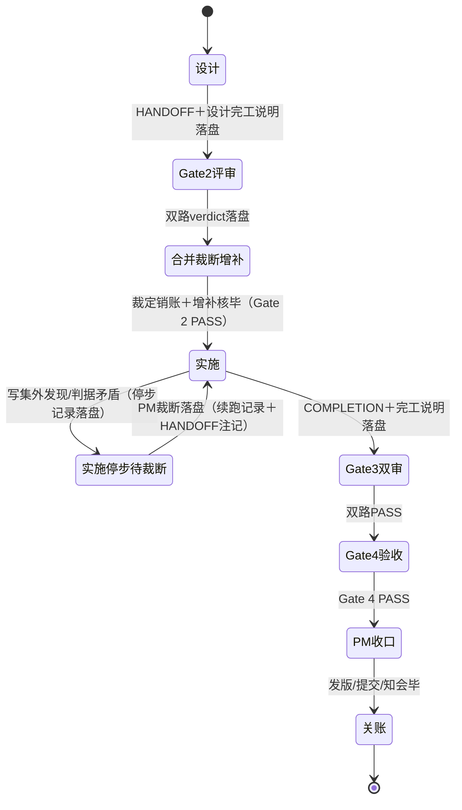

# Gate 链状态图 — 以 Phase 1 链（TASK-20261006-EPIC-P1-CLEARANCE）为对象

件 2.2 交付一。状态、转换与证据指针全部回指对象链盘上实件（实施时逐个 `test -f` 自核，全在盘）。本图同时是件 2.3 脚本中断分类表的设计源。

## 状态图（Mermaid）

## 状态表（进入证据／退出证据／恢复入口）

| # | 状态 | 进入证据 | 退出证据 | 恢复入口（恢复者先读） |
|---|---|---|---|---|
| S1 | 设计 | `.tad/active/TICKET-20261006-epic-p1-clearance.md`、`docs/pm/open-cards/2026-10-06-epic-p1-design-start-card.md` | `.tad/archive/handoffs/HANDOFF-2026-10-06-epic-p1-clearance.md`（设计时在 active）、`.tad/evidence/completions/2026-10-06-tad-epic-p1-design-note.md` | 票＋Epic Phase 1 节 |
| S2 | Gate 2 评审 | HANDOFF、`docs/pm/open-cards/2026-10-06-epic-p1-gate2-start-card.md` | `.tad/evidence/reviews/2026-10-06-gate2-tech-review-epic-p1.md`、`.tad/evidence/reviews/2026-10-06-gate2-fit-review-epic-p1.md` | 两份 verdict 的条件清单 |
| S3 | 合并裁断/增补 | S2 两份 verdict | `.tad/evidence/pm/2026-10-06-epic-p1-gate2-merged-ruling.md`（含销账行）、`.tad/evidence/completions/2026-10-06-tad-epic-p1-gate2-amend-note.md` | 合并裁定的条件与销账段 |
| S4 | 实施 | HANDOFF（增补后修订锚）、`docs/pm/open-cards/2026-10-06-epic-p1-impl-start-card.md` | `.tad/evidence/completions/COMPLETION-2026-10-06-epic-p1-clearance.md`、`.tad/evidence/completions/2026-10-06-tad-epic-p1-impl-note.md`、`.tad/evidence/epic-p1-clearance-20261006/`（59 件） | HANDOFF §6 分期＋证据目录内 baseline |
| S5 | 实施停步待裁断 | `.tad/evidence/epic-p1-clearance-20261006/stop-note-item1.1-mirror-divergence.md`（停步事实段）；第二停步点：AC23 判读（COMPLETION 自报 PARTIAL） | 同文件「续跑记录」段＋HANDOFF §7 WRITE-SET EXPANSION 注记；AC23：`.tad/evidence/pm/2026-10-06-epic-p1-ac23-ruling.md` | 停步记录（事实＋待裁三案＋Blake 倾向同文件齐备） |
| S6 | Gate 3 双审 | COMPLETION、`docs/pm/open-cards/2026-10-06-epic-p1-gate3-start-card.md` | `.tad/evidence/reviews/2026-10-06-gate3-code-review-epic-p1.md`、`.tad/evidence/reviews/2026-10-06-gate3-safety-review-epic-p1.md` | 两份 verdict（逐值复算口径） |
| S7 | Gate 4 验收 | S6 双 verdict、`docs/pm/open-cards/2026-10-06-epic-p1-gate4-start-card.md` | `.tad/evidence/reviews/2026-10-06-gate4-acceptance-epic-p1.md` | Gate 4 verdict（可执行性终判） |
| S8 | PM 收口 | S7 PASS | `docs/pm/open-cards/done-20261006-epic-p1-clearance.md`、`.tad/evidence/releases/3.0.2-version-triage.md`、freshness 日志收口行（`.tad/evidence/pm/evidence-freshness-log.md`） | 完事卡的收口动作与遗留段 |
| S9 | 关账 | S8 完事卡 | HANDOFF 已迁 `.tad/archive/handoffs/`、Epic Phase Map 行 1 标已收口、COMPLETION gate3_verdict 已回填 | 完事卡＋Epic |

## 允许转换表

| 转换 | 触发者 | 留痕件 |
|---|---|---|
| 立票 → S1 | PM | 票＋开跑卡（design） |
| S1 → S2 | PM 验盘后派审 | 开跑卡（gate2） |
| S2 → S3 | 双路评审完成（runtime 送达） | 两份 verdict |
| S3 → S4 | PM 定点核销账、Gate 2 转 PASS | 合并裁定尾行销账 |
| S4 → S5 | Blake 撞红线自停 | 停步记录 |
| S5 → S4 | PM 裁断（案 A／AC23 两例） | 停步记录续跑段／PM 裁定件＋HANDOFF 注记 |
| S4 → S6 | Blake 完工、PM 验盘 | COMPLETION＋开跑卡（gate3） |
| S6 → S7 | 双审 PASS、PM 派验收 | 开跑卡（gate4） |
| S7 → S8 | Gate 4 PASS | Gate 4 verdict |
| S8 → S9 | PM 收口动作毕（提交推送＋知会 GM） | 完事卡 |

不允许的转换（对象链实况中均未发生）：S4 直达 S6 前的自审充 Gate（评审须独立会话）；S5 未裁断自行续跑；S7 未过即收口。

## 中断分类表（件 2.3 分类源，逐类：何物存活／何物易失／恢复入口／对应 2.3 断言）

| 类 | 定义 | 何物存活 | 何物易失 | 恢复入口 | 对应 2.3 断言 |
|---|---|---|---|---|---|
| INT-1 进程中断 | spawn/会话死亡，工作未收口 | 已落盘文件、证据目录、git 工作区 | 会话内未落盘的推理与临时状态 | session-state＋最新 HANDOFF＋证据目录 baseline | 断言 1（已执行不重跑）、断言 4（Gate 证据完整） |
| INT-2 压缩中断 | compact 后上下文丢失 | 盘上全件（含 HANDOFF、各 verdict） | 对话内已达成的临时共识、未写入件的口头裁断 | `.tad/active/session-state.md`＋precompact 快照＋HANDOFF 本体 | 断言 5（step_id 不变＝身份锚）、断言 4 |
| INT-3 环境中断 | VM 重启/隧道断 | git 已提交面、同步面文件 | /tmp 内 fixture 目录、未同步的工作区新件 | git log＋证据目录（fixture 须凭记录重建） | 断言 2（未提交编辑无损——以证据落盘形态判）、断言 4 |
| INT-4 人工停步 | 裁断/人闸等待（设计内红线自停或等人决策） | 停步记录（事实＋选项＋倾向）、全部已完成面 | 等待时长本身（无信息损失） | 停步记录＋PM 裁断件 | 断言 3（无重复副作用——续跑只补未完成集）、断言 1 |
