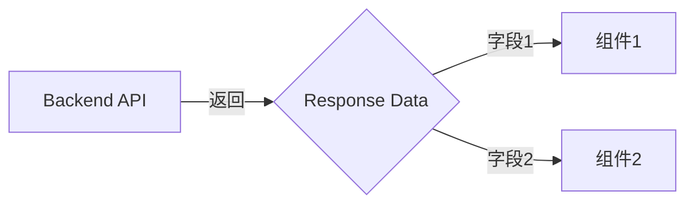

---
# Quality Chain Metadata (Alex 必填 - Phase 4 Hook 将基于此阻塞 Gate 3)
task_type: code       # code | yaml | research | e2e | mixed
e2e_required: no      # yes | no - yes 时 Blake 必须产出 E2E evidence
research_required: no # yes | no - yes 时 Blake 必须产出研究文件

# Optional: production directories that must have ≥1 git-tracked file at Gate 3
# (Phase 1 P1.1, 2026-04-24). Leave blank/omit for doc-only or config-only handoffs.
# Smoke-alarm check: missing/absent → skip; covered-by-.gitignore → warn, not fail.
git_tracked_dirs: []  # e.g., ["src/pages", "packages/api/routes"]

# Optional: Skip Alex Gate 4 Knowledge Assessment ceremony for trivial handoffs
# (Phase 3 P3.3, 2026-04-24). Alex sets default; Blake can override unskip via
# completion-report `## Knowledge Assessment` marker if implementation surfaces real findings.
# Recommended: yes for task_type=doc-only / trivial CSS / copy / single-file config.
#              no  for task_type=mixed / code / research (default).
# Backward compat: field absent → treated as `no` (existing behavior preserved).
skip_knowledge_assessment: no  # yes | no

# Optional: Capture "Alex 提议 vs Gate 4 reality" gaps surfaced during *accept
# (Phase 5 P5.1, 2026-04-25). Empty list is the default and means handoff
# predictions held up. Alex MAY append entries with 4 keys (field/alex_said/
# actual/caught_by) when raw-TSV recompute or AC alignment shows a gap.
# Future *evolve queries use this for cross-project drift detection.
# Cancelled handoffs do NOT use this field — they use cancel_reason instead.
gate4_delta: []
---

# Handoff Document for Agent B (Blake)
## TAD v3.1 - Evidence-Based Development

**From:** Alex (Agent A - Solution Lead)
**To:** Blake (Agent B - Execution Master)
**Date:** [Current Date]
**Project:** [Project Name]
**Task ID:** TASK-[YYYYMMDD]-[###]
**Handoff Version:** 3.1.0
**Epic:** N/A <!-- Optional: EPIC-{YYYYMMDD}-{slug}.md (Phase {N}/{M}) -->
**Supersedes:** N/A <!-- Optional: HANDOFF-YYYYMMDD-{slug}.md — cite previous handoff if this one supersedes. Enables /tad-maintain drift check (Phase 1 P1.2.c) to propose archiving the superseded one. -->

---

## 🔴 Gate 2: Design Completeness (Alex必填)

**执行时间**: [YYYY-MM-DD HH:MM]

### Gate 2 检查结果

| 检查项 | 状态 | 说明 |
|--------|------|------|
| Architecture Complete | ✅/⚠️/❌ | [架构是否完整，有无遗漏] |
| Components Specified | ✅/⚠️/❌ | [组件规格是否明确] |
| Functions Verified | ✅/⚠️/❌ | [调用的函数是否都存在于代码库] |
| Data Flow Mapped | ✅/⚠️/❌ | [数据流是否完整映射] |

**Gate 2 结果**: ✅ PASS / ⚠️ PARTIAL PASS / ❌ FAIL

**如果 PARTIAL PASS 或 FAIL，说明**:
- [遗留问题1]
- [遗留问题2]

**Alex确认**: 我已验证所有设计要素，Blake可以独立根据本文档完成实现。

---

## 📋 Handoff Checklist (Blake必读)

Blake在开始实现前，请确认：
- [ ] 阅读了所有章节
- [ ] **阅读了「📚 Project Knowledge」章节中的历史经验**
- [ ] 所有"强制问题回答（MQ）"都有证据
- [ ] 理解了真正意图（不只是字面需求）
- [ ] 每个Phase的交付物和证据要求都清楚
- [ ] 确认可以独立使用本文档完成实现

❌ 如果任何部分不清楚，**立即返回Alex要求澄清**，不要开始实现。

---

## 1. Task Overview

### 1.1 What We're Building
[清晰、简洁的描述]

### 1.2 Why We're Building It
**业务价值**：[...]
**用户受益**：[...]
**成功的样子**：[当用户能够...时，这个功能就成功了]

### 1.3 🆕 Intent Statement（意图声明）

**真正要解决的问题**：[...]

**不是要做的（避免误解）**：
- ❌ 不是[常见误解1]
- ❌ 不是[常见误解2]

**Blake请确认理解**：
```
在开始实现前，请用你自己的话回答：
1. 这个功能解决什么问题？
2. 用户会如何使用？
3. 成功的标准是什么？

只有Human确认你的理解正确后，才能开始实现。
```

---

## 📚 Project Knowledge（Blake 必读）

**Alex 在创建 handoff 时必须完成以下步骤：**

**⚠️ MANDATORY READ — Blake 在开始实现前，必须执行以下 Read 操作：**
1. Read ALL `.tad/project-knowledge/*.md` files listed in 步骤 2 below
2. Read the handoff's "⚠️ Blake 必须注意的历史教训" entries carefully
3. This is NOT optional — project knowledge prevents repeated mistakes

> **Why this matters**: In long sessions, project knowledge loaded at startup gets compressed
> by Claude Code's context management. Reading it again here ensures Blake has full awareness
> before writing any code.

### 步骤 1：识别相关类别

本次任务涉及的领域（勾选所有适用项）：
- [ ] code-quality - 代码模式/反模式
- [ ] security - 安全问题
- [ ] ux - 用户体验决策
- [ ] architecture - 架构决策
- [ ] performance - 性能优化
- [ ] testing - 测试模式/边界情况
- [ ] api-integration - 外部 API 集成
- [ ] mobile-platform - iOS/Android 特定问题
- [ ] [其他类别]

### 步骤 2：历史经验摘录

**已读取的 project-knowledge 文件**：

| 文件 | 相关记录数 | 关键提醒 |
|------|-----------|----------|
| [category].md | X 条 | [最重要的 1-2 点摘要] |
| [category].md | 0 条 | 无相关历史记录 |

**⚠️ Blake 必须注意的历史教训**：

1. **[标题]** (来自 [category].md)
   - 问题：[...]
   - 解决方案：[...]

2. **[标题]** (来自 [category].md)
   - 问题：[...]
   - 解决方案：[...]

（如果无相关记录，写：✅ 已检查，无相关历史记录）

### Blake 确认

- [ ] 我已阅读上述历史经验
- [ ] 我理解需要避免的问题
- [ ] 如遇到类似情况，我会参考上述解决方案

---

## 2. Background Context

### 2.1 Previous Work
[已有代码或模式]

### 2.2 Current State
[现状 vs 目标]

### 2.3 Dependencies
[外部依赖]

---

## 3. Requirements

### 3.1 Functional Requirements
- FR1: [...]
- FR2: [...]

### 3.2 Non-Functional Requirements
- NFR1: [性能、可用性等]
- NFR2: [...]

### 3.3 Optimization Target (Optional — triggers Autoresearch Mode)

> Only include this section if the task has a measurable numeric optimization goal.
> When present, Blake's Ralph Loop activates Layer 0.5 (autonomous optimization) before Layer 1+2.

```yaml
optimization_target:
  metric: "{metric_name}"           # e.g., "response_time_ms", "accuracy_pct", "bundle_size_kb"
  baseline: {current_value}         # Measured current value
  target: {goal_value}              # Target value to reach
  direction: "lower"                # "lower" = lower is better, "higher" = higher is better
  benchmark_cmd: "{command}"        # Command that outputs the metric
  metric_pattern: "{pattern}"       # Regex with capture group to extract metric value
  scope:                            # Files agent can modify (limit blast radius)
    - "{file_path_1}"
    - "{file_path_2}"
  time_budget: 60                   # Seconds per experiment (default: 60)
  max_iterations: 50                # Max attempts (default: 50)
  constraints:                      # Things agent must NOT change
    - "{constraint_1}"
    - "{constraint_2}"
```

---

## 4. Technical Design

### 4.1 Architecture Overview
[架构描述]

### 4.2 Component Specifications
[组件规格]

### 4.3 Data Models
[数据结构]

### 4.4 API Specifications
[API设计]

### 4.5 User Interface Requirements
[UI需求]

---

## 5. 🆕 强制问题回答（Evidence Required）

**重要**：这些问题必须回答，并提供证据。Human会验证。

### MQ1: 历史代码搜索

**问题**：用户是否提到"之前的"、"原来的"、"我们的方案"？

**回答**：
- [ ] 是 → 继续填写下面
- [ ] 否 → 跳过此问题

**如果是，提供证据**：

#### 搜索证据
```bash
# 搜索命令
[实际执行的搜索命令]

# 搜索结果
[搜索输出或截图]
```

#### 决策说明
- **找到了什么**：[...]
- **位置**：[文件:行号]
- **决定**：✅ 复用 / ❌ 创建新的
- **原因**：[...]

**Human验证点**：能看到搜索确实执行了吗？决策理由合理吗？

---

### MQ2: 函数存在性验证

**问题**：设计中调用了哪些函数？它们都存在吗？

**回答**：

#### 函数清单（🆕 必填表格）

| 函数名 | 文件位置 | 行号 | 代码片段 | 验证 |
|--------|---------|------|---------|------|
| [函数1] | [位置] | [行号] | `[代码]` | [✅/❌] |
| [函数2] | [位置] | [行号] | `[代码]` | [✅/❌] |

**Human验证点**：每个函数都有"✅存在"和具体位置吗？

---

### MQ3: 数据流完整性

**问题**：后端计算/返回了哪些字段？前端都显示了吗？

**回答**：

#### 数据流对照表（🆕 必填表格）

| 后端字段 | 用途说明 | 前端组件 | 是否显示 | 不显示原因 |
|---------|---------|---------|---------|-----------|
| [字段1] | [用途] | [组件] | ✅/❌ | [...] |
| [字段2] | [用途] | [组件] | ✅/❌ | [...] |

#### 数据流图（🆕 必填）



**Human验证点**：
- 后端每个字段都有对应的前端组件吗？
- "❌不显示"的字段有合理原因吗？

---

### MQ4: 视觉层级

**问题**：功能有不同状态/类型吗？用户如何区分？

**回答**：
- [ ] 有不同状态 → 继续填写
- [ ] 无不同状态 → 跳过

**如果有，提供UI对比**：

#### 状态视觉设计（🆕 必填）

| 状态 | 视觉表现 | 颜色 | 图标 | 文字 |
|------|---------|------|------|------|
| [状态1] | [描述] | [颜色] | [图标] | [文字] |
| [状态2] | [描述] | [颜色] | [图标] | [文字] |

#### UI Mockup（🆕 建议提供）
[截图或手绘UI草图]

**Human验证点**：不同状态是否视觉上能明显区分？

---

### MQ5: 状态同步

**问题**：数据存在几个地方？什么时候同步？

**回答**：

#### 状态存储位置（🆕 必填）

| 数据 | 存储位置1 | 存储位置2 | 同步时机 | 同步方向 |
|------|----------|----------|---------|---------|
| [数据] | [位置1] | [位置2] | [时机] | [方向] |

#### 状态流图（🆕 必填）

```
[用户输入] → state.data (主状态，Source of Truth)
              ↓ 同步时机：[触发条件]
           backup.data (备份状态)
```

**或单一状态**：
```
[用户输入] → state.data (唯一存储)
✅ 只有一个状态，无需同步
```

**Human验证点**：
- 清楚标注哪个是主状态了吗？
- 同步时机明确吗？
- 是否可能出现不同步？

---

## 6. Implementation Steps（分Phase）

## 6.1 Micro-Tasks (Optional — recommended for Full/Standard TAD)

> Break implementation into 2-5 minute tasks with precise targets.
> Each micro-task should be independently verifiable.
> Skip this section for Light TAD or simple tasks.

| # | File | Operation | Verification Command | Est. Time |
|---|------|-----------|---------------------|-----------|
| 1 | {path/to/file.ts} | {Add function X / Modify Y / Create Z} | {grep/test/build command to verify} | {2-5 min} |
| 2 | {path/to/file.ts} | {description} | {verification} | {2-5 min} |

### Micro-Task Rules
- Each task targets ONE file (or 2-3 closely related files)
- Operation is specific: "Add validateInput() function" not "add validation"
- Verification is runnable: a grep, test, or build command
- If TDD mode is enabled, each micro-task = one RED-GREEN-REFACTOR cycle

---

**🆕 Phase划分原则**：
- 每个Phase：2-4小时
- Phase之间有清晰的里程碑
- 每个Phase完成后，Blake提供证据给Human审查

### Phase 1: [名称]（预计X小时）

#### 交付物
- [ ] [具体交付1]
- [ ] [具体交付2]

#### 实施步骤
1. [步骤1]
2. [步骤2]

#### 验证方法
- 运行[测试命令]应该看到[预期结果]
- 浏览器访问[URL]应该显示[预期UI]

#### 🆕 Phase 1 完成证据（Blake必须提供）
提交以下证据给Human：
- [ ] **代码截图**：关键函数[XXX]的实现
- [ ] **测试结果**：`npm test`的输出（✓ 42 tests passing）
- [ ] **UI截图**（如有UI）：浏览器显示效果

**Human审查问题**：
- 方向正确吗？
- 测试通过了吗？
- 需要调整吗？

**Human决策**：✅ 继续Phase 2 / ⚠️ 调整本Phase

---

### Phase 2: [名称]（预计X小时）
[同上结构]

---

## 7. File Structure

### 7.1 Files to Create
```
path/to/new-file.ts  # Purpose
```

### 7.2 Files to Modify
```
path/to/existing.ts  # Changes
```

### 7.3 Grounded Against (Phase 2 P2.2 — Alex step1c, 2026-04-24)

**Grounded Against** (Alex step1c 实际 Read 过的源文件):

<!--
  Alex step1c 强制填写: After step1b (frontmatter validation) and BEFORE step2
  (expert review), Alex Reads head 50 lines of every existing file in §7.1/7.2
  and lists them here. Files marked "(new — will be created)" are skipped.

  Exemptions (skip the section entirely):
    - Pre-Phase-2 handoffs (filename date < 2026-04-24)
    - task_type: doc-only
    - §7.1 + §7.2 both empty
-->

- _(file path 1, head 50 lines, read at YYYY-MM-DD HH:MM)_
- _(file path 2 — or "(new — will be created)" for new files)_

---

## 8. Testing Requirements

### 8.1 Unit Tests
- Test [Component]: [Expected behavior]

### 8.2 Integration Tests
- Test [Flow]: [Expected outcome]

### 8.3 Edge Cases
- [Edge case 1]: [How to handle]

## 8.4 Friction Preflight

> Alex must fill this section before sending the handoff to Blake. List every
> prerequisite that may create friction during implementation. If none, state
> "No friction-sensitive prerequisites identified."

| Friction Point | Required Step | Expected Fix Path | Allowed Substitute | Gate Impact |
|----------------|---------------|-------------------|--------------------|-------------|
| *Example: reviewer unavailable* | *Expert review (Layer 2)* | *Invoke required reviewer* | *Independent reviewer with equivalent scope/expertise (self-review is NEVER equivalent)* | *Missing or non-equivalent review prevents Gate 3 PASS* |
| *Example: dependency install required* | *Install package/tool* | *Request install via user/sandbox approval* | *DEGRADED_WITH_APPROVAL with approval source, date/context, accepted risk, rationale* | *Unresolved BLOCKED prevents Gate 3 PASS* |
| *Example: auth/approval required* | *Obtain auth token or approval* | *Request auth renewal or approval from user/admin* | *DEGRADED_WITH_APPROVAL if user accepts risk* | *Unresolved BLOCKED prevents Gate 3 PASS* |
| *Example: platform sandbox/network restriction* | *Network access for external API* | *Request sandbox approval (Codex) or permission (Claude Code)* | *Offline fallback if equivalent and documented* | *Unresolved BLOCKED prevents Gate 3 PASS* |

**Status Enum** (use exactly these values in Friction Status table at completion):
`READY` / `BLOCKED` / `DEGRADED_WITH_APPROVAL` / `EQUIVALENT_SUBSTITUTE` / `NOT_APPLICABLE_WITH_REASON`

## 8.5 Feedback Collection (Non-Code Artifacts)

<!-- Optional: omit this entire section for code-only tasks. -->
<!-- Phase 1: feedback_required MUST be false until Alex read_feedback_protocol
     is implemented (Phase 2). Setting true before Phase 2 creates feedback HTML
     that nobody can process yet. -->

> Fill this section when the task produces non-code artifacts that require human
> judgment for quality assessment. If the task is code-only, write "N/A".

```yaml
feedback_required: true|false
artifact_type: frontend_page|audio|video|design|brand|generic
suggested_dimensions:
  - "text content"
  - "layout"
  - "color palette"
notes: "Any specific feedback focus areas for Blake"
```

## 8.6 🆕 Test Evidence Required
Blake必须提供：
- [ ] 测试运行截图（所有测试通过）
- [ ] 覆盖率报告（目标：>80%）
- [ ] Edge case测试日志

---

## 9. Acceptance Criteria

Blake的实现被认为完成，当且仅当：
- [ ] 所有FR实现并验证
- [ ] 所有Phase完成并提供证据
- [ ] 所有测试通过（有截图证明）
- [ ] UI符合设计（有截图证明）
- [ ] Human验证"这是我期望的"

---

## 9.1 Spec Compliance Checklist ⚠️ PRIMARY VERIFICATION SOURCE — Gate 3 executes each row

> **⚠️ 主验证源 (TAD v3.1)**: §9.1 是 Gate 3 的 PRIMARY VERIFICATION SOURCE。Gate 3 会
> **真正执行**每一行的 `Verification Method`，对比 `Expected Evidence`，逐行判断 pass/fail。
> 任何一行 FAIL → Gate 3 BLOCK。**§9.1 为空 → Gate 3 BLOCK**（不是 silent pass）。
> 因此 Alex 必须把每行的 Verification Method 写成可直接运行的命令（grep / 测试 / 脚本）。
> Gate 3 不再硬编码 tsc/test/lint —— 对 dev 项目，这些是 Alex 在此自动生成的 AC 行
> (alex step1_ac_generation)；对非 dev 项目，这些是域特定命令。
>
> **AC 行示例（按项目类型）**：
>
> ```
> # dev 项目（Alex 按 §6 文件类型自动生成）：
> | AC1 | TypeScript compiles | `npx tsc --noEmit` | exit 0, no errors |
> | AC2 | Unit tests pass     | `npm test`         | all pass |
> | AC3 | Lint clean          | `eslint .`         | 0 errors |
> | AC4 | Python tests pass   | `pytest`           | all pass |
> | AC5 | Change scope        | `git diff --stat`  | only §6 files |
>
> # 非 dev 项目（播客/内容/电商 —— Socratic 确定的域标准）：
> | AC1 | Pitch consistency   | `python scripts/measure_consistency.py EP04 \| grep overall` | > 70 |
> | AC2 | Eval build passes   | `python scripts/build_podcast_eval.py EP04 --check`         | exit 0 |
> | AC3 | Final audio exists  | `ls podcasts/EP04-colin/final/*.wav \| wc -l`               | >= 1 |
>
> # rubric/judge 类 AC（task_type: deliverable）：
> | AC1 | Report passes rubric | spawn independent judge per Rubric Evaluation Protocol against {rubric_ref} | verdict: PASS |
> ```

Blake的实现将由 spec-compliance-reviewer 自动核对以下条目：

> **Verification Type column** (Phase 6-A.1, 2026-04-25):
> - `pre-impl-verifiable` — Alex dry-runs at handoff drafting (step1d); paste raw output into Verified Output column
> - `post-impl-verifiable` — Blake runs at Gate 3 v2 Layer 1 after implementation creates the artifact
>
> **Pipe-escape note**: Markdown tables require `|` inside regex to be written `\|` for cell rendering.
> When extracting commands to run in bash, **un-escape**: `grep -cE 'a\|b\|c'` (rendered) → `grep -cE 'a|b|c'` (run).
> Step1d Sub-rule 1 mandates dry-running from raw form, not rendered.
>
> The `Verified Output` column is filled by Alex during step1d for pre-impl rows;
> by Blake during Gate 3 for post-impl rows. Empty Verified Output post step1d
> with non-empty Verification Method = handoff incomplete.

| # | Acceptance Criterion | Verification Type | Verification Method | Expected Evidence | Verified Output (Alex step1d) |
|---|---------------------|-------------------|--------------------|--------------------|-------------------------------|
| 1 | {same as AC above} | pre-impl-verifiable / post-impl-verifiable | {how to verify: file check, grep, test run} | {what the reviewer should find} | {Alex paste raw output, OR "(post-impl)" for post-impl rows} |

> ⚠️ This section is now MANDATORY (TAD v3.1) — it is the PRIMARY VERIFICATION SOURCE Gate 3
> executes row-by-row. An empty/missing §9.1 → Gate 3 BLOCKS. Every row's Verification Method
> must be a runnable command. (Previously optional; the AC-driven Gate makes it load-bearing.)

---

## 9.2 Expert Review Status (Alex 必填)

> Alex MUST integrate every expert finding into an Audit Trail table row before sending to Blake.
> Free-text narratives are NOT acceptable — the table is the canonical format (Phase 1 P1.5, 2026-04-24, dogfooded by HANDOFF-20260424-phase1-state-consistency).

### Audit Trail

| Reviewer | Issue | Resolution Section | Status |
|----------|-------|-------------------|--------|
| code-reviewer | _(concise: severity + one-line symptom, e.g., "P0: shell script crashes on empty array")_ | _(cite specific section, e.g., "§Task P1.2 实现提示 #3" or "AC-P1.2-i")_ | Resolved / Open / Deferred |
| backend-architect | ... | ... | ... |

**Status legend:**
- **Resolved** — fix applied in this handoff; Resolution Section MUST point to where the fix lives
- **Open** — not yet addressed; Blake should see this as a known gap
- **Deferred** — consciously deferred to future handoff; cite rationale in Notes

### Expert Prompts Used (optional, for reproducibility)

<!-- If you want reviewers to be able to re-run the same review later: paste the full prompt(s) sent to each reviewer here. Helps when a later regression needs the same reviewer lens. -->

### Experts Selected

1. **{reviewer-name}** — {why this reviewer was chosen for this handoff's risk profile}
2. **{reviewer-name}** — {why}

### Overall Assessment (post-integration)

- {reviewer-name}: {CONDITIONAL PASS / PASS / FAIL} ({N} P0 resolved, {N} P1 resolved)
- {reviewer-name}: {verdict}

---

## 10. Important Notes

### 10.1 Critical Warnings
- ⚠️ [警告1]
- ⚠️ [警告2]

### 10.2 Known Constraints
- [约束1]
- [约束2]

### 10.3 🆕 Sub-Agent使用建议

Blake应该考虑使用：
- [ ] **parallel-coordinator** - 如果有3个以上独立组件
- [ ] **bug-hunter** - 如果遇到错误或测试失败
- [ ] **test-runner** - 完成每个Phase后
- [ ] **refactor-specialist** - 如果代码复杂度高

完成后在"Sub-Agent使用记录"中说明使用情况。

---

## 11. 🆕 Learning Content（可选）

### 11.1 Decision Rationale: [决策主题]

**选择的方案**：[...]

**考虑的替代方案**：

| 方案 | 优点 | 缺点 | 为什么没选 |
|------|------|------|-----------|
| 方案A（选中）| [...] | [...] | ✅ 选中 |
| 方案B | [...] | [...] | [...] |

**权衡分析**：
核心权衡：[维度1] vs [维度2]
当前优先级：[...]

**💡 Human学习点**：
[提炼的通用原则]

---

## 12. 🆕 Sub-Agent使用记录

Blake完成后填写：

| Sub-Agent | 是否调用 | 调用时机 | 输出摘要 | 证据链接 |
|-----------|---------|---------|---------|---------|
| parallel-coordinator | ✅/❌ | [...] | [...] | [...] |
| bug-hunter | ✅/❌ | [...] | [...] | [...] |
| test-runner | ✅/❌ | [...] | [...] | [...] |

**Human验证点**：应该调用的都调用了吗？

---

**Handoff Created By**: Alex (Agent A)
**Date**: [Date]
**Version**: 3.1.0
