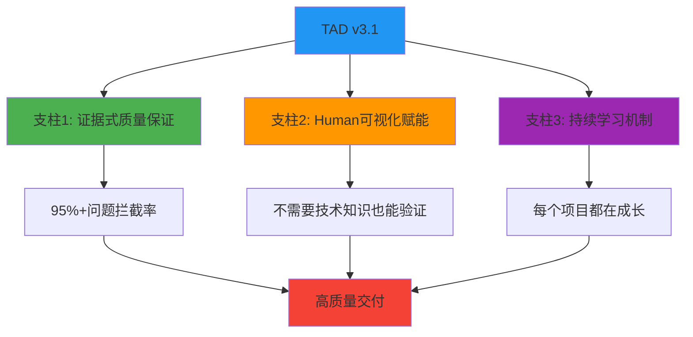
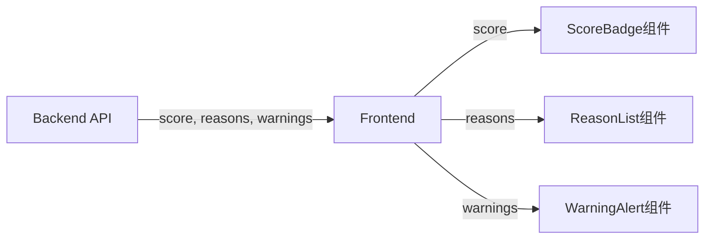
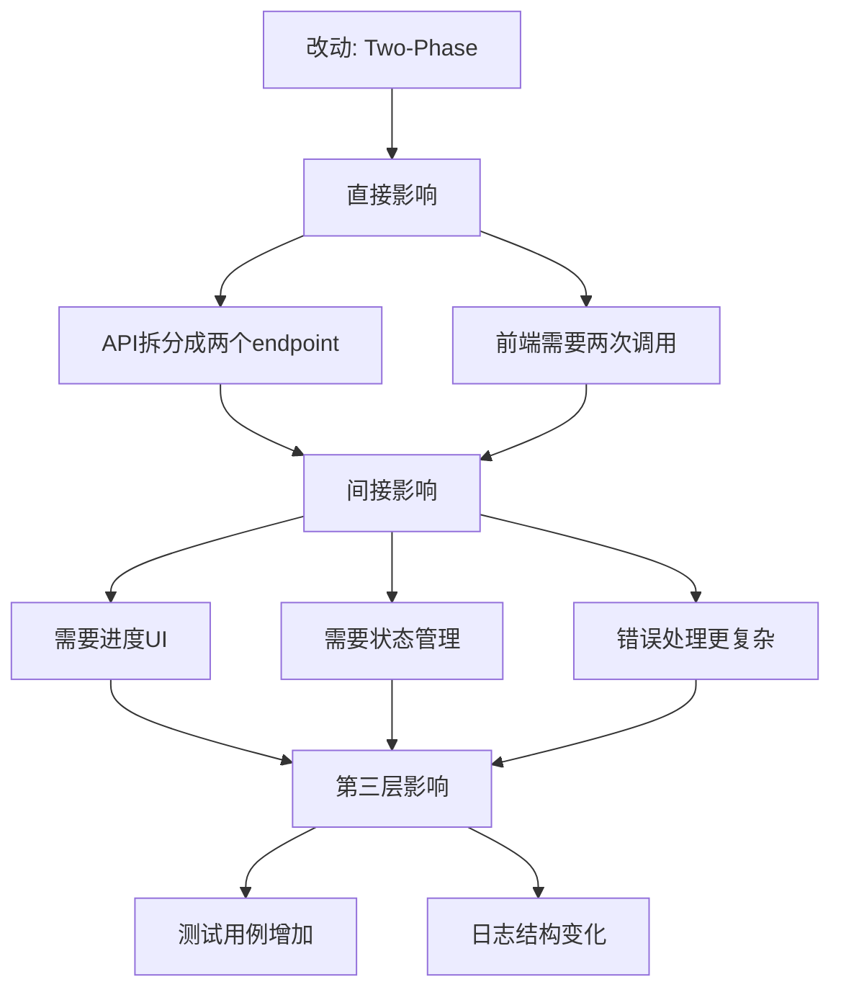

# TAD v3.1 综合升级方案
## 从声明式到证据式 + Human赋能 + 持续学习

**文档版本**: v1.0
**创建日期**: 2025-11-25
**适用范围**: TAD Framework 全面升级
**目标**: 质量提升 + Human成长 + 系统进化

---

## 📋 目录

- [第一部分：执行摘要](#第一部分执行摘要)
- [第二部分：核心问题与解决方案](#第二部分核心问题与解决方案)
- [第三部分：TAD v3.1 三大支柱](#第三部分tad-v31-三大支柱)
- [第四部分：分阶段实施路线图](#第四部分分阶段实施路线图)
- [第五部分：配置文件完整更新](#第五部分配置文件完整更新)
- [第六部分：模板文件更新](#第六部分模板文件更新)
- [第七部分：成功指标与验证](#第七部分成功指标与验证)
- [第八部分：风险管理与回滚](#第八部分风险管理与回滚)
- [第九部分：快速启动指南](#第九部分快速启动指南)

---

## 第一部分：执行摘要

### 1.1 为什么要升级？

基于MenuSnap项目的200+文档深度分析，发现TAD v3.0的**根本性问题**：

```
核心假设错误：AI自查 + AI互查 = 质量保证
实际情况：AI会犯系统性盲点错误，自查和互查都无法发现

结果：
❌ 函数不存在 - Gate 2/3未拦截（AI假设函数存在）
❌ 数据流断裂 - Gate 2未拦截（AI忽略了前端显示）
❌ 双状态不同步 - Gate 1未拦截（AI没意识到是问题）
```

### 1.2 TAD v3.1 是什么？

**三位一体的升级**：



**核心转变**：

| 维度 | TAD v3.0 | TAD v3.1 |
|------|---------|----------|
| **验证方式** | 声明式（AI说"已检查"） | 证据式（提供截图/图表/代码位置） |
| **Human角色** | 被动验收者 | 主动验证者 + 学习者 |
| **质量保证** | AI互查 | Human可视化验证 + AI辅助 |
| **知识管理** | 手动记录失败 | 自动学习闭环 |
| **交付节奏** | 一次性完成 | 渐进式验证（每Phase检查） |
| **效果** | 0-30%问题拦截率 | **95%+问题拦截率** |

### 1.3 核心价值

**质量提升**：
- ✅ **95%+问题拦截率**（当前0-30%）
- ✅ **70-85%返工时间节省**（早期发现问题）
- ✅ **自动学习闭环**（系统越用越聪明）

**Human成长**：
- ✅ **建立技术决策直觉**（理解权衡，不是记答案）
- ✅ **培养系统性思维**（看到改动的连锁反应）
- ✅ **积累可复用知识**（每个项目都有沉淀）

**时间投入**：
- 📊 **Gate 2审查**: 10-15分钟（看图表、验证证据）
- 📊 **Phase检查**: 5-10分钟/Phase（快速验证方向）
- 📊 **学习活动**: 20-30分钟/功能（可选，高价值）
- 💰 **ROI**: 投入30-60分钟，节省3-6小时返工，**回报比1:5到1:10**

### 1.4 适用场景

✅ **强烈推荐**：
- 需要高质量代码的项目
- 团队成员需要成长的场景
- 复杂的人-AI协作开发
- 有多次返工历史的项目

⚠️ **可选简化**：
- 非常简单的功能（<2小时完成）
- 一次性脚本或原型
- 紧急热修复（但事后补学习）

---

## 第二部分：核心问题与解决方案

### 2.1 问题诊断

基于MenuSnap项目实证分析，TAD v3.0存在**5大根本性问题**：

#### 问题1: Quality Gates设计正确，但执行无效

**证据**：
```typescript
// Blake写的代码（实际项目记录）
const scoredItems = menu.map(item => ({
  ...item,
  score: calculateScore(item, preferences)  // ❌ 函数不存在！
}));
```

Gate 2应该拦截"函数不存在"，但实际没有拦截。

**根本原因**：
- Gate是"声明式"而非"证明式"（只要求"确认已检查"）
- Gate是"AI自查"而非"交叉验证"（Blake检查自己的代码）
- Gate的检查点太抽象（没有明确如何验证）

#### 问题2: Handoff模板有检查项，但不可验证

**证据**：
```markdown
# Handoff模板要求
✅ 历史代码引用: 需要修改或参考的具体文件

# Alex的填写
✅ 历史代码引用: 已查找历史代码，未找到相关实现
```

**问题**：Human无法验证Alex是否真的"认真找了"。

#### 问题3: AI系统性盲点无法通过自查发现

**证据**：MenuSnap项目中三个问题都逃过了Quality Gates

| 问题 | 应该被哪个Gate拦截 | 为什么没拦截 |
|------|-------------------|-------------|
| 函数不存在 | Gate 2/3 | AI写代码时假设存在，自查时也假设存在 |
| 数据流断裂 | Gate 2 | Alex设计时没考虑前端显示 |
| 双状态不同步 | Gate 1 | 所有AI都没意识到这是问题 |

**根本原因**：当AI系统性地忽略某个问题时，所有Gates都会放行。

#### 问题4: Human角色定义过于被动

**证据**：实际项目中Human做的事情
```
用户纠正1: "不对，你要用我们之前的方案，应该是第5个页面"
用户纠正2: "推荐系统有致命代码错误"
用户纠正3: "用户看不到推荐理由和关键信息"
```

**问题**：TAD假设Human只做"价值判断"，但实际Human在发现**技术问题**。

#### 问题5: 失败经验没有系统化反馈

**证据**：`failure-patterns.md`记录了失败模式，但`config.yaml`和`handoff-a-to-b.md`中看不到这些patterns被转化为检查点。

**问题**：记录 ≠ 改进，缺少学习闭环。

---

### 2.2 解决方案架构

TAD v3.1通过**三大支柱**解决以上问题：

```
┌─────────────────────────────────────────────────────────────┐
│              TAD v3.1 解决方案架构                            │
├─────────────────────────────────────────────────────────────┤
│                                                             │
│  支柱1: 证据式质量保证                                        │
│  ├─ 5种证据类型（搜索结果、代码位置、数据流图...）             │
│  ├─ 5个强制问题（MQ1-5，从失败案例提炼）                      │
│  └─ Human验证点（每个证据都有"Human怎么看"）                  │
│                                                             │
│  支柱2: Human可视化赋能                                       │
│  ├─ 不需要技术知识（看图判断）                                │
│  ├─ 渐进式验证（每Phase检查，及早发现问题）                    │
│  └─ 明确的审查清单（10-15分钟/Gate）                         │
│                                                             │
│  支柱3: 持续学习机制                                          │
│  ├─ 5种学习机制（Decision Rationale、Interactive...）        │
│  ├─ 失败学习闭环（自动转化为MQ）                              │
│  └─ 项目学习报告（沉淀可复用知识）                            │
│                                                             │
└─────────────────────────────────────────────────────────────┘
```

---

## 第三部分：TAD v3.1 三大支柱

### 3.1 支柱1：证据式质量保证

#### 核心理念
```
旧：Alex说"我已经验证了所有函数都存在" → Human相信
新：Alex提供"函数位置证明表" → Human看到具体文件:行号 → 验证
```

#### 5种证据类型

##### 证据1: 搜索结果证据
**用途**：证明确实搜索了历史代码

**格式**：
```markdown
### 搜索证据
搜索命令：`grep -rn "calculateScore" src/`

搜索结果：
```
src/lib/utils.ts:42:export function calculateScoreAndReasons(...)
src/lib/utils.ts:98:  const score = calculateBaseScore(item);
```

决策：使用calculateScoreAndReasons（已存在），不创建新函数
```

**Human验证点**：能看到搜索确实执行了，结果真实

##### 证据2: 代码位置证明
**用途**：证明函数/组件确实存在

**格式**：
```markdown
| 函数名 | 文件位置 | 行号 | 代码片段 | 验证 |
|--------|---------|------|---------|------|
| calculateScoreAndReasons | src/lib/utils.ts | 42 | `export function calculateScoreAndReasons(...)` | ✅ |
| filterByAllergens | src/lib/filters.ts | 18 | `export function filterByAllergens(...)` | ✅ |
```

**Human验证点**：每个函数都有"✅"，位置具体

##### 证据3: 数据流图
**用途**：展示数据从后端到前端的完整流动

**格式**：


**配套表格**：
```markdown
| 后端字段 | 用途 | 前端组件 | 是否显示 | 不显示原因 |
|---------|------|---------|---------|-----------|
| score | 推荐分数 | ScoreBadge | ✅ | - |
| matchReasons | 推荐理由 | ReasonList | ✅ | - |
| warnings | 过敏警告 | WarningAlert | ✅ | - |
| internalDebug | 调试信息 | - | ❌ | 仅供开发，不展示给用户 |
```

**Human验证点**：
- 后端每个字段都有对应的前端组件吗？
- "❌不显示"的有合理原因吗？

##### 证据4: 状态流图
**用途**：展示状态的来源、存储位置、同步时机

**格式**：
```
[用户输入] → preferences.allergens (主状态，Source of Truth)
              ↓ 同步时机：onSubmit事件
           dietaryRestrictions.allergies (备份状态)
```

**或单一状态**：
```
[用户输入] → preferences.allergens (唯一存储)
✅ 只有一个状态，无需同步
```

**Human验证点**：
- 清楚标注哪个是主状态了吗？
- 同步时机明确吗？
- 是否可能出现不同步？

##### 证据5: UI截图/测试结果
**用途**：证明功能的实际效果和测试通过

**格式**：
```markdown
### Phase 1 测试结果
```
PASS  src/lib/utils.test.ts
  ✓ calculateScoreAndReasons returns correct score (3ms)
  ✓ calculateScoreAndReasons handles edge cases (2ms)

Test Suites: 1 passed, 1 total
Tests:       42 passed, 42 total
Coverage:    87.5%
```

[Screenshot showing green checkmarks]
```

**Human验证点**：看到"passed"、绿色勾选、覆盖率达标

---

#### 5个强制问题（MQ）

从MenuSnap失败案例中提炼的必答问题：

##### MQ1: 历史代码搜索
**触发条件**：用户提到"之前的"、"原来的"、"我们的方案"

**问题**：
- 你找到了相关代码吗？
- 搜索了哪些关键词？
- 找到了什么？在哪里？
- 为什么决定复用/不复用？

**证据要求**：搜索结果截图

**拦截的失败**：Failure Pattern 2: Creating Instead of Searching

##### MQ2: 函数存在性验证
**触发条件**：设计中包含函数调用

**问题**：
- 设计中调用了哪些函数？
- 这些函数都存在吗？
- 每个函数在哪个文件的第几行？
- 请提供函数定义的代码片段

**证据要求**：函数位置证明表

**拦截的失败**：Failure Pattern 3: Function Assumption Errors

##### MQ3: 数据流完整性
**触发条件**：后端计算或返回数据

**问题**：
- 后端计算/返回了哪些字段？
- 每个字段在前端的哪个组件显示？
- 有没有字段不显示？为什么？

**证据要求**：数据流对照表 + 数据流图

**拦截的失败**：Failure Pattern 4: Incomplete Data Flow

##### MQ4: 视觉层级
**触发条件**：功能有多个状态或类型

**问题**：
- 这个功能有不同的状态/类型吗？
- 每个状态的视觉表现是什么？
- 用户能一眼看出区别吗？

**证据要求**：UI状态对比图/截图

**拦截的失败**：Failure Pattern 5: Visual Uniformity Disease

##### MQ5: 状态同步
**触发条件**：涉及用户输入或状态管理

**问题**：
- 数据存在几个地方？
- 哪个是主状态（Source of Truth）？
- 其他状态什么时候同步？用什么触发？
- 如果忘记同步会怎样？

**证据要求**：状态流图

**拦截的失败**：Real Issue: Dual State Sync Problem

---

### 3.2 支柱2：Human可视化赋能

#### 核心理念
```
旧思维：Human需要懂技术才能参与技术审查
新思维：Human通过"看图判断"参与验证，不需要技术知识
```

#### Human的新角色

**角色升级**：
```yaml
旧角色: Value Guardian（价值守护者）
  职责: 定义需求、验证交付价值、做关键决策

新角色: Value Guardian + Checkpoint Validator
  职责:
    - 定义需求、验证交付价值、做关键决策（保持）
    - 审查设计证据（看图表，不需要懂代码）✨ 新增
    - 审查实现证据（看截图，验证方向）✨ 新增
    - 渐进式检查点验证（每Phase验证）✨ 新增
```

#### Human参与的3个关键点

##### 参与点1: Gate 2 - 设计完成审查（10-15分钟）

**时机**：Alex完成设计，创建handoff前

**要做的事**：
1. 打开handoff文档
2. 直接跳到"强制问题回答（MQ）"部分
3. 对每个MQ检查：
   - ✅ 有回答吗？
   - ✅ 有证据吗？（图/表/代码片段）
   - ✅ 看起来合理吗？

**审查清单**：
```markdown
□ MQ1 历史代码：能看到搜索结果吗？决策理由合理吗？
□ MQ2 函数存在：每个函数都有"✅存在"和具体位置吗？
□ MQ3 数据流：数据流图显示后端字段都到前端了吗？
□ MQ4 视觉：能看出不同状态的视觉区别吗？
□ MQ5 状态：清楚哪个是主状态、何时同步吗？
```

**示例：如何看数据流图**
```
好的数据流图✅：
[Backend] → score → [ScoreBadge]
         → reasons → [ReasonList]
         → warnings → [WarningAlert]
每个字段都有去处

红旗🚩：
[Backend] → score, reasons, warnings
         → [ScoreBadge]
问：reasons和warnings去哪了？ ❌
```

**决策**：
- 所有✅ → 批准，Blake可以开始实现
- 有问题 → 指出哪里不清楚，Alex补充证据

##### 参与点2: Phase检查点 - 每个Phase完成（5-10分钟/Phase）

**时机**：Blake完成每个Phase

**要做的事**：
1. 看Blake提供的证据：
   - 代码截图（关键函数）
   - 测试结果截图
   - UI截图（如有UI）
2. 回答3个问题：
   - ❓ 这是我期望的方向吗？
   - ❓ 测试通过了吗？（看到"passed"或绿色✓）
   - ❓ 需要调整什么吗？

**为什么重要**：
```
在Phase 1（20%进度）就发现方向错误 → 只浪费2小时
等到Phase 3（100%完成）才发现 → 浪费6小时
```

**决策**：
- ✅ 方向正确 → 批准，继续下个Phase
- ⚠️ 需要调整 → 说明期望，Blake调整本Phase

##### 参与点3: Gate 3 - 最终验证（10-15分钟）

**时机**：所有Phase完成

**要做的事**：
1. 看Blake的完成报告
2. 看测试结果（全部passed？）
3. 看UI截图（符合期望？）
4. **亲自测试**：
   - 打开浏览器
   - 实际使用功能
   - 确认符合需求

**决策**：
- ✅ 完全符合期望 → 验收通过
- ⚠️ 有小问题 → Blake修复
- ❌ 需要大改 → 返回某个Phase重做

---

#### Human不需要懂技术的秘诀

**秘诀1：看图判断，不看代码**
```
不需要看：function calculateScore(item, prefs) { ... }
只需要看：
  ┌──────────────────────────────┐
  │ 函数: calculateScore         │
  │ 位置: src/utils.ts:42        │
  │ 状态: ✅ 存在                 │
  └──────────────────────────────┘

Human判断：有具体位置、标记存在 → ✅ 通过
```

**秘诀2：问简单问题，不问技术问题**
```
不问：这个算法的时间复杂度是O(n²)吗？
只问：
  - 后端返回的数据，前端都显示了吗？
  - 这两个状态什么时候同步？
  - 测试通过了吗？（看到绿色✓）
```

**秘诀3：基于常识判断，不需要专业知识**
```
看到状态流图：
[用户输入] → preferences.allergens
           → dietaryRestrictions.allergies
[没说什么时候同步]

Human基于常识判断：
"两个地方存同一个数据，但不知道什么时候同步？
这听起来容易出问题。" → ❌ 要求澄清
```

---

### 3.3 支柱3：持续学习机制

#### 核心理念
```
旧模式：完成任务 → 进入下个任务 → 知识没沉淀
新模式：完成任务 → 提炼学习 → 下个任务应用 → 能力提升
```

#### 5种学习机制

##### 机制1: Decision Rationale（决策理由）
**目标**：理解"为什么选A不选B"，建立权衡思维

**触发时机**：每个重要技术决策

**标准格式**：
```markdown
## Decision Rationale: OCR技术选型

### 选择的方案
使用Gemini 2.0 Flash进行菜单OCR识别

### 考虑的替代方案
| 方案 | 优点 | 缺点 | 为什么没选 |
|------|------|------|-----------|
| Gemini Flash | 快(0.5s)、便宜 | 准确率95% | ✅ 当前选择 |
| GPT-4V | 准确率98% | 慢(2s)、贵10倍 | MVP不需要98%精度 |

### 权衡分析
核心权衡：速度+成本 vs 准确率
当前优先级：速度（最重要）> 成本 > 准确率

### 未来可能需要切换
如果准确率<90% → 切换到GPT-4V
触发条件：用户投诉准确率问题>10次/周

### 💡 Human学习点
核心原则：MVP优先"足够好+快+便宜"，而非"完美但慢贵"

思考问题：
- 如果你是用户，0.5秒和2秒的等待感受差异大吗？
- 识别100个菜品中错1个vs错0个，值得花10倍成本吗？
```

**时间投入**：5分钟阅读+理解

**学习收益**：建立"没有完美方案，只有权衡"的思维

##### 机制2: Interactive Challenge（互动挑战）
**目标**：让Human主动思考，而非被动接受答案

**触发时机**：关键架构决策前

**标准格式**：
```markdown
## 🤔 Interactive Challenge: 用户过敏信息存储

### 场景描述
用户需要设置过敏信息，前端需要显示，后端需要使用。

### 你会怎么做？
方案A: 前端存储（localStorage），每次传给后端
方案B: 后端存储（数据库），前端读取
方案C: 前后端都存储，定期同步

**思考1-2分钟**：
- 你的直觉选哪个？为什么？
- 每个方案最大的风险是什么？

---

### Alex的分析
[详细分析...]

推荐方案A，理由：
- MVP阶段，后端无状态更简单
- 避免用户登录/注册复杂度
- 数据量小，localStorage足够

### 💡 你的想法和Alex的一致吗？
如果不一致：想想为什么？Alex考虑了哪些你没想到的？
```

**时间投入**：3分钟思考+对比

**学习收益**：锻炼独立判断能力，理解考虑问题的角度

##### 机制3: Impact Visualization（影响可视化）
**目标**：看到"局部改动"如何影响"整个系统"

**触发时机**：架构/数据流变更

**标准格式**：
```markdown
## Impact Visualization: Two-Phase架构影响

### 改动
从One-phase改为Two-phase架构

### 影响链路图


### 影响清单
**直接影响**：
- API: 拆分成 /ocr 和 /recommend
- 前端: 两次API调用

**间接影响**：
- UI: 需要进度条显示当前Phase
- 状态: Phase 1结果存哪里？
- 错误: Phase 1成功但Phase 2失败怎么办？

**第三层影响**：
- 测试: 需要覆盖4种组合（成功+成功、成功+失败...）
- 日志: 分别记录两个Phase的耗时
- 成本: 分别统计两个LLM的使用

### 💡 Human学习点
改一个地方，想三层影响：直接 → 间接 → 第三层
```

**时间投入**：2分钟看图

**学习收益**：培养系统性思维，预见改动的涟漪效应

##### 机制4: What-If Scenarios（假设场景）
**目标**：通过对比理解"为什么这样做"

**触发时机**：每个Phase完成

**标准格式**：
```markdown
## What-If Scenarios: 进度反馈设计

### 实际采用的方案
Two-phase + 进度条：
- Phase 1: "📸 识别菜单..." (0-50%)
- Phase 2: "🤔 生成推荐..." (50-100%)

### 场景1：如果不显示进度条...
**用户体验**：
- 前3秒："在加载，等等"
- 5-8秒："是不是卡住了？要不要刷新？"

**结果**：
❌ 用户可能在结果出来前放弃
❌ 用户对产品信任度下降

### 场景2：如果用One-phase...
**问题**：
进度条只能"假装"（定时器），用户会察觉不准确

### 💡 对比总结
| 方案 | 用户体验 | 技术复杂度 | 选择 |
|------|---------|----------|------|
| 无进度条 | 😰 焦虑，可能放弃 | 简单 | ❌ |
| One-phase+假进度 | 😐 进度不准 | 简单 | ❌ |
| Two-phase+真进度 | 😊 知道在做什么 | 中等 | ✅ |

为什么选Two-phase：平衡了用户体验和技术复杂度
```

**时间投入**：3分钟阅读

**学习收益**：理解方案的优劣对比，建立判断标准

##### 机制5: Failure Learning Entry（失败学习）
**目标**：每次出错都是学习机会，避免重复犯错

**触发时机**：Human发现问题/Bug、测试失败

**标准格式**：
```markdown
## Failure Learning Entry #001

### 发生了什么
用户报告：修改过敏偏好后，推荐结果没有变化

### 症状
**用户看到**：添加"花生过敏" → 重新推荐 → 仍出现含花生菜品

**技术表现**：
```javascript
preferences.allergens = ["花生"] ✅ 更新成功
POST /api/recommend
Body: { dietaryRestrictions: { allergies: [] } } ← 空的！
```

### 根本原因
**表面原因**：前端发送时忘记映射字段
**深层原因**：数据存两个地方，没有同步机制
**类型分类**：状态同步问题（Dual State Sync）

### 应该由什么拦截
**应该在**：Gate 2（设计阶段）
**应该由**：MQ5（状态同步验证）
**为什么没拦住**：MQ5只检查前端，没检查前后端状态

### 修复方案
**技术修复**：统一为单一状态，删除重复存储
**流程修复**：更新MQ5，要求"完整状态流图"（含前后端）

### 学到了什么
**技术层面**：Single Source of Truth（单一数据源）
**系统层面**：前后端交互最容易出现字段不一致
**产品层面**：用户输入必须立即生效

### 更新检查点
**增强MQ5**：
```yaml
evidence_requirements:
  - "必须包含前端和后端的状态"
  - "必须标注主状态（Source of Truth）"
  - "必须回答：如果忘记同步会怎样？"
```

### 💡 Human记住
**一句话原则**：数据只应该存一个地方；如果必须存多个，明确谁是老大

**红旗标志**：
🚩 看到两个类似变量名（allergens vs allergies）
🚩 看到"前端存一份，后端存一份"

**下次遇到类似场景**：
立即问："这个数据存几个地方？它们什么时候同步？"
```

**时间投入**：10分钟（但避免未来重复犯错）

**学习收益**：
- 提炼通用原则（可迁移到其他项目）
- 识别失败模式（建立"红旗"警觉）
- 自动更新检查点（系统进化）

---

#### 学习效果衡量

**短期指标（项目内）**：
```yaml
参与度:
  gate2_review_completion: >90%
  interactive_challenge_response: >80%

理解度:
  decision_rationale_understanding: 能说出2+个权衡维度
  gate2_issue_detection: 每个功能至少发现1个问题
```

**中期指标（跨项目）**：
```yaml
知识复用:
  checklist_application: "上次学到的，这次记得检查"
  principle_recall: "记得单一数据源原则"

自主决策:
  independent_judgment: Human开始在Alex提出前就有判断
```

**长期指标（能力建立）**：
```yaml
系统思维:
  impact_chain_length: 能预见1层/2层/3层影响
  failure_pattern_recognition: 能识别3+种失败模式

质量意识:
  edge_case_consideration: 主动提出边界情况
```

**学习闭环完成的信号**：
```
项目1 → 学到"单一数据源" → 更新MQ5
       ↓
项目2 → Human主动问"数据存几个地方？"
       → 设计时就避免了问题 ✅
```

---

## 第四部分：分阶段实施路线图

### 4.1 实施策略

**核心原则**：
1. **渐进式**：不一次性更换所有内容
2. **可回滚**：每个阶段都可以回退
3. **低风险**：从影响小的开始
4. **可验证**：每个阶段都有成功指标

**时间表**：
- 🟢 Phase 1：立即可做（1-2天）
- 🟡 Phase 2：谨慎推进（1-2周）
- 🔵 Phase 3：长期优化（1个月）

---

### 4.2 Phase 1：立即可做（1-2天）

#### 目标
在不影响现有流程的情况下，添加证据收集能力。

#### Action 1.1：备份现有配置（15分钟）
```bash
cd /Users/sheldonzhao/programs/TAD

# 创建备份目录
mkdir -p .backup/v3.0-$(date +%Y%m%d)

# 备份关键文件
cp .tad/config.yaml .backup/v3.0-$(date +%Y%m%d)/
cp .tad/templates/handoff-a-to-b.md .backup/v3.0-$(date +%Y%m%d)/
cp .tad/agents/agent-a-architect.md .backup/v3.0-$(date +%Y%m%d)/
cp .tad/agents/agent-b-executor.md .backup/v3.0-$(date +%Y%m%d)/

echo "✅ 备份完成，位置: .backup/v3.0-$(date +%Y%m%d)/"
```

#### Action 1.2：更新config.yaml - 添加v3.1配置（2小时）
```bash
# 在.tad/config.yaml末尾追加v3.1配置
# 详见第五部分：配置文件完整更新
```

**关键内容**：
- 证据式验证系统（5种证据类型）
- 强制问题系统（MQ1-5）
- Human角色增强
- 学习机制配置

**验证**：
```bash
# 检查YAML语法
python3 -c "import yaml; yaml.safe_load(open('.tad/config.yaml'))"
# 如果没报错，说明格式正确 ✅
```

#### Action 1.3：更新handoff模板（2小时）
```bash
# 1. 备份旧模板
cp .tad/templates/handoff-a-to-b.md .tad/templates/handoff-a-to-b.md.v3.0

# 2. 更新模板内容
# 详见第六部分：模板文件更新
```

**关键更新**：
- Section 5: 强制问题回答（MQ1-5）
- Section 6: Implementation Steps（分Phase + 每Phase证据要求）
- Section 10: Sub-Agent使用记录

**验证**：
```bash
# 检查模板完整性
grep "MQ1" .tad/templates/handoff-a-to-b.md
grep "Phase 1 完成证据" .tad/templates/handoff-a-to-b.md
# 都应该有输出 ✅
```

#### Action 1.4：创建新任务文件（1小时）
```bash
# 创建证据收集指南
touch .tad/tasks/evidence-collection.md

# 创建Human快速参考
touch .tad/guides/human-quick-reference.md

# 创建学习机制指南
touch .tad/guides/learning-mechanisms.md

# 填充内容（从实施指南和学习规范复制）
```

#### Action 1.5：试点项目（3小时）
选择一个**小功能**进行试点：
1. Alex使用新handoff模板创建设计
2. 填写MQ1-5（提供证据）
3. Human进行Gate 2审查（10-15分钟）
4. Blake实现Phase 1
5. 提供Phase 1完成证据
6. Human进行Phase检查（5-10分钟）

**成功标准**：
- ✅ Alex能顺利填写MQ证据
- ✅ Human能看懂证据并完成审查
- ✅ 至少在Gate 2发现1个问题（证明有效）
- ✅ 整个流程时间增加<30分钟（可接受）

---

### 4.3 Phase 2：谨慎推进（1-2周）

#### 目标
将证据式检查从"建议"改为"强制"，Human全面参与。

#### Action 2.1：将MQ从"建议"改为"强制"（1天）
```yaml
# 更新.tad/config.yaml
mandatory_questions:
  enabled: true
  blocking: true  # ← 改为阻塞模式

  enforcement:
    when: "Gate 2 (Design Completeness)"
    how: "Alex必须在handoff中包含完整MQ回答+证据"
    validation: "Human检查每个MQ"
    consequence: "证据不完整 → 阻止进入实现阶段"
```

**验证方法**：
下个项目中，Alex尝试跳过某个MQ → 应该被提醒/阻止

#### Action 2.2：Human培训（半天）
**目标**：让Human熟练使用新流程

**培训内容**：
1. **理论讲解**（30分钟）：
   - 为什么需要证据式检查
   - Human的新角色和职责
   - 不需要技术知识的秘诀

2. **实操演练**（1小时）：
   - 使用试点项目的handoff
   - 演示如何审查MQ证据
   - 演示如何看数据流图、状态流图
   - 演示如何判断"通过/不通过"

3. **答疑**（30分钟）：
   - 回答Human的疑问
   - 调整审查清单（根据反馈）

**培训材料**：
- `.tad/guides/human-quick-reference.md`
- 试点项目的实际handoff
- 审查清单checklist

#### Action 2.3：建立Phase-Gate绑定（1周）
**改变**：
```
旧：整个handoff一次性交给Blake → 完成后Human验证
新：每个Phase完成 → Human验证 → 通过才能继续下个Phase
```

**实施**：
1. 更新handoff模板（每个Phase明确交付物和证据要求）
2. Blake完成Phase后，主动提供证据给Human
3. Human 5-10分钟快速审查
4. 通过 → 继续；调整 → 修改本Phase

**验证**：
下个项目中，在Phase 1就发现方向问题 → 只返工1个Phase（不是全部）

#### Action 2.4：启用学习机制（选择性）
**目标**：在感兴趣的Human中试点学习机制

**最小学习套餐**（推荐开始）：
- Decision Rationale（决策理由）：每个重要决策
- What-If Scenarios（假设场景）：每个Phase
- Failure Learning Entry（失败学习）：出错时

**完整学习套餐**（深度学习）：
- 增加Interactive Challenge（互动挑战）
- 增加Impact Visualization（影响可视化）
- 增加Project Learning Report（项目学习报告）

**验证**：
- Human能解释"为什么选这个方案"
- Human能举例"如果选其他会怎样"

---

### 4.4 Phase 3：长期优化（1个月）

#### Action 3.1：自动化失败学习闭环（2周）
**目标**：Human纠正错误 → 自动生成MQ建议 → Human确认 → 配置自动更新

**实施**：
1. 创建失败捕获机制
2. 当Human说"不对"、"错了"时，触发Failure Learning Entry创建
3. AI分析：这个问题应该由哪个MQ拦截？
4. 生成MQ更新建议
5. Human审核并确认
6. 自动更新config.yaml和handoff模板

**工具支持**（可选）：
```bash
# 创建CLI工具
./tad capture-failure "用户纠正：推荐结果未变化"
# → 自动创建Failure Learning Entry
# → 分析根因
# → 生成MQ更新建议

./tad review-mq-update [failure-id]
# → Human审查建议
# → 批准/拒绝/修改

./tad apply-mq-update [failure-id]
# → 自动更新配置文件
# → 记录变更历史
```

#### Action 3.2：开发证据自动化工具（2周）
**目标**：减少Alex手动收集证据的负担

**工具1：函数位置自动检测**
```bash
# 输入：handoff中的函数列表
# 输出：自动生成函数位置证明表

./tad-tools detect-functions --handoff handoff.md
# 自动扫描函数调用
# 使用AST分析找到函数定义位置
# 生成Markdown表格
```

**工具2：数据流自动分析**
```bash
# 输入：backend API响应schema + frontend组件
# 输出：数据流对照表

./tad-tools analyze-dataflow \
  --api src/api/recommend.ts \
  --components src/components/
# 自动对比API返回字段和组件使用
# 生成数据流图（Mermaid）
# 标记未使用的字段
```

**工具3：测试结果自动附加**
```bash
# CI集成：测试完成后自动附加到Phase报告

# .github/workflows/ci.yml
- name: Run tests and attach results
  run: |
    npm test > test-results.txt
    ./tad-tools attach-evidence \
      --type test_result \
      --phase 1 \
      --file test-results.txt
```

#### Action 3.3：建立学习效果追踪（持续）
**目标**：量化Human的成长和系统的改进

**月度评估表**：
```markdown
## 月度学习效果评估 - 2025年12月

### 参与度（短期）
- [x] Gate 2审查完成率：95% （目标>90%）✅
- [x] Interactive Challenge回答率：85% （目标>80%）✅
- [x] What-If查看率：75% （目标>70%）✅

### 理解度（短期）
- [x] 能解释技术决策权衡：8次 / 10个决策
- [x] Gate 2发现问题：12个问题 / 10个功能 ✅

### 知识迁移（中期）
- [x] 主动提到之前学到的原则：6次
- [x] 使用之前的检查清单：是
- [x] 举例之前的失败案例：4次

### 能力建立（长期）
- [x] 预见影响链长度：2层（比上月提升）
- [x] 主动提出边界情况：5次
- [x] 识别失败模式：3种模式

### 印象最深的学习
1. 单一数据源原则（避免了2次潜在Bug）
2. MVP优先"足够好"的检查清单
3. 通过状态流图提前发现同步问题

### 下月改进
- [ ] 想加强：系统思维（预见第三层影响）
- [ ] 想调整：简化Interactive Challenge格式
```

**系统进化追踪**：
```yaml
tad_evolution_metrics:
  version: 3.1.2

  quality_metrics:
    problem_detection_rate:
      gate2: 92% (baseline: 0%)
      phase_checkpoints: 78%

    false_positive_rate: 8% (acceptable)

  mq_effectiveness:
    MQ1_historical_code:
      triggered: 15次
      caught_issues: 12次
      effectiveness: 80%

    MQ2_function_existence:
      triggered: 45次
      caught_issues: 43次
      effectiveness: 96% ⭐

    MQ5_state_sync:
      triggered: 20次
      caught_issues: 18次
      effectiveness: 90%

  learning_outcomes:
    principles_learned: 8个
    patterns_recognized: 5种
    checklists_created: 3个

  time_metrics:
    avg_gate2_time: 12分钟
    avg_phase_checkpoint: 7分钟
    avg_learning_time: 25分钟/功能

    rework_time_saved: 平均每个功能节省4.5小时
```

---

### 4.5 实施时间线总结

```
Week 1 (Phase 1)：
├─ Day 1-2: 备份 + 更新配置文件 + 模板
├─ Day 3: 创建指南文档
├─ Day 4-5: 试点项目 + 调整

Week 2-3 (Phase 2)：
├─ Week 2: MQ强制化 + Human培训
└─ Week 3: Phase-Gate绑定 + 学习机制试点

Week 4-8 (Phase 3)：
├─ Week 4-5: 失败学习闭环自动化
├─ Week 6-7: 证据自动化工具开发
└─ Week 8+: 学习效果追踪 + 持续优化
```

---

## 第五部分：配置文件完整更新

### 5.1 config.yaml 增量更新

在现有`.tad/config.yaml`文件**末尾追加**以下内容：

```yaml
# ==================== TAD v3.1 增强配置 ====================
# 创建日期: 2025-11-25
# 基于: MenuSnap项目实证分析 + 三份核心文档
# 目标: 证据式质量保证 + Human可视化赋能 + 持续学习

tad_version: 3.1.0
enhancement_date: 2025-11-25
philosophy: "Evidence-Based Triangle Development with Continuous Learning"

# ==================== 证据式验证系统 ====================
evidence_based_verification:
  enabled: true
  description: "所有关键检查点都需要提供可验证的证据"

  required_evidence_types:
    # 证据类型1：搜索结果
    search_result:
      format: "命令 + 结果截图或文本输出"
      purpose: "证明确实搜索了历史代码"
      example: |
        ```bash
        # 搜索命令
        grep -r "calculateScore" src/

        # 结果
        src/lib/utils.ts:42: export function calculateScoreAndReasons(...)
        ```
      human_validation: "能看到搜索命令和结果"
      mandatory_for: ["MQ1"]

    # 证据类型2：代码位置证明
    code_location:
      format: "Markdown表格：函数名 | 文件位置 | 行号 | 代码片段 | 验证状态"
      purpose: "证明函数/组件确实存在"
      example: |
        | 函数名 | 位置 | 行号 | 代码片段 | 验证 |
        |--------|------|------|---------|------|
        | calculateScore | src/lib/utils.ts | 42 | `export function calculateScore(...)` | ✅ |
      human_validation: "能看到具体位置和代码，每个都标记✅"
      mandatory_for: ["MQ2"]

    # 证据类型3：数据流图
    data_flow_diagram:
      format: "Mermaid图 + Markdown对照表"
      purpose: "展示数据从后端到前端的完整流动"
      example: |
        ```mermaid
        graph LR
          A[Backend API] -->|计算| B[score, reasons, warnings]
          B -->|传递| C[Frontend]
          C -->|显示| D[ScoreDisplay]
          C -->|显示| E[ReasonList]
          C -->|显示| F[WarningAlert]
        ```

        | 后端字段 | 前端组件 | 是否显示 | 不显示原因 |
        |---------|---------|---------|-----------|
        | score | ScoreDisplay | ✅ | - |
        | matchReasons | ReasonList | ✅ | - |
      human_validation: "能看到每个字段都有对应的显示组件，或有合理的不显示原因"
      mandatory_for: ["MQ3"]

    # 证据类型4：状态流图
    state_flow_diagram:
      format: "ASCII图或Mermaid状态图"
      purpose: "展示状态的来源、存储位置、同步时机"
      example: |
        [用户输入] → preferences.allergens (主状态，Source of Truth)
                      ↓ 同步时机：onSubmit事件
                   dietaryRestrictions.allergies (备份状态)
      human_validation: "能看到是否有多处存储、谁是主状态、何时同步"
      mandatory_for: ["MQ5"]

    # 证据类型5：UI截图
    ui_screenshot:
      format: "浏览器截图或UI mockup"
      purpose: "证明功能的视觉效果"
      example: "浏览器截图显示推荐理由和警告的视觉层级"
      human_validation: "能看到实际显示效果，视觉层级清晰"
      mandatory_for: ["MQ4", "Phase完成报告"]

    # 证据类型6：测试结果
    test_result:
      format: "测试运行截图或日志输出"
      purpose: "证明代码能运行、测试通过"
      example: |
        ```
        ✓ 42 tests passing
        ✓ Coverage: 87%
        ```
      human_validation: "能看到测试通过（passed/绿色✓），覆盖率达标"
      mandatory_for: ["Phase完成报告"]

# ==================== 强制回答问题系统 ====================
mandatory_questions:
  enabled: true
  blocking: true
  auto_sync: true
  source: ".tad/evidence/patterns/failure-patterns.md"
  description: "从历史失败中提炼的必须回答的问题"

  # 问题库
  questions:
    MQ1_historical_code:
      id: "MQ1"
      pattern_source: "Failure Pattern 2: Creating Instead of Searching"
      trigger_keywords: ["之前的", "原来的", "我们的方案", "previous", "original", "existing"]
      trigger_condition: "用户描述中提到历史方案或现有功能"

      question: "用户提到了历史方案，你找到相关代码了吗？"
      sub_questions:
        - "搜索了哪些关键词？"
        - "找到了什么？在哪里？"
        - "为什么决定复用/不复用？"

      required_evidence: "search_result"
      evidence_format: "搜索命令 + 完整输出 + 决策说明"
      blocking: true

      human_validation_question: "能看到搜索确实执行了吗？决策理由合理吗？"

    MQ2_function_existence:
      id: "MQ2"
      pattern_source: "Failure Pattern 3: Function Assumption Errors"
      trigger_condition: "设计中包含函数调用或组件引用"

      question: "设计中调用了哪些函数/组件？它们都存在吗？"
      sub_questions:
        - "列出所有将调用的函数/组件"
        - "每个函数在哪个文件的第几行？"
        - "请提供函数定义的代码片段"

      required_evidence: "code_location"
      evidence_format: "Markdown表格，每个函数/组件都有位置证明"
      blocking: true

      human_validation_question: "每个函数都有✅存在标记和具体位置吗？"

    MQ3_data_flow:
      id: "MQ3"
      pattern_source: "Failure Pattern 4: Incomplete Data Flow"
      trigger_condition: "后端计算或返回数据给前端"

      question: "后端计算/返回了哪些字段？前端都显示了吗？"
      sub_questions:
        - "后端返回的完整字段列表"
        - "每个字段在前端的哪个组件显示？"
        - "有没有字段不显示？为什么？"

      required_evidence: "data_flow_diagram"
      evidence_format: "数据流图（Mermaid）+ 对照表"
      blocking: true

      human_validation_question: |
        - 后端每个字段都有对应的前端组件吗？
        - "❌不显示"的字段有合理原因吗？

    MQ4_visual_hierarchy:
      id: "MQ4"
      pattern_source: "Failure Pattern 5: Visual Uniformity Disease"
      trigger_condition: "功能有多个状态、类型或优先级"

      question: "这个功能有不同的状态/类型吗？用户如何视觉上区分？"
      sub_questions:
        - "有哪些不同的状态？（如：推荐/不推荐，成功/失败）"
        - "每个状态的视觉表现是什么？（颜色、图标、文字）"
        - "用户能一眼看出区别吗？"

      required_evidence: "ui_screenshot"
      evidence_format: "UI状态对比表 + 截图/mockup"
      blocking: false  # 警告但不阻塞

      human_validation_question: "从截图能看出不同状态的明显区别吗？"

    MQ5_state_sync:
      id: "MQ5"
      pattern_source: "Real Issue: Dual State Sync Problem"
      trigger_condition: "涉及用户输入、状态管理或前后端数据传递"

      question: "数据存在几个地方？它们什么时候同步？"
      sub_questions:
        - "列出所有存储这个数据的地方（前端state/localStorage/后端session/database）"
        - "哪个是主状态（Source of Truth）？"
        - "其他状态什么时候同步？用什么触发？"
        - "如果忘记同步会怎样？用户会看到什么？"

      required_evidence: "state_flow_diagram"
      evidence_format: "状态流图，标注主状态、同步时机和触发条件"
      blocking: true

      human_validation_question: |
        - 清楚标注哪个是主状态了吗？
        - 同步时机明确吗？
        - 或确认只有单一状态？

  # 执行机制
  enforcement:
    when: "Gate 2 (Design Completeness)"
    how: "Alex必须在handoff中包含'强制问题回答'章节"
    validation: "Human检查每个触发的MQ是否都有回答+证据"
    consequence_missing: "证据不完整 → 阻止提交handoff，要求补充"
    consequence_incomplete: "证据质量低 → Human要求重新提供"

  # 自动更新机制
  auto_update_pipeline:
    trigger: "Human纠正了AI的错误或发现新的失败模式"
    process: |
      1. 捕获错误类型和根因（创建Failure Learning Entry）
      2. 判断：这个错误应该由哪个MQ拦截？
      3. 如果现有MQ未覆盖：
         - 生成新MQ建议（MQ6、MQ7...）
         - 提交Human审核
         - 审核通过后自动添加到config.yaml
      4. 如果现有MQ应该拦截但没拦：
         - 分析为什么没拦住（trigger条件不够？evidence不够？）
         - 优化MQ的trigger条件或evidence要求
         - 更新config.yaml
    output_location: ".tad/evidence/failures/[timestamp]_mq_update.yaml"

# ==================== 渐进式验证系统 ====================
progressive_validation:
  enabled: true
  description: "将大任务分解为Phase，每个Phase后Human验证"

  phase_structure:
    definition: |
      Phase是功能的逻辑组成部分，每个Phase：
      - 有明确的交付物（代码、文档、测试）
      - 有独立的验证标准
      - 完成后需要Human审查才能继续

    size_guideline:
      small_task: "1个Phase，1-2小时完成"
      medium_task: "2-3个Phase，每个Phase 2-3小时"
      large_task: "4-6个Phase，每个Phase不超过4小时"

    mandatory_checkpoint: "每个Phase完成时Blake必须提供证据，Human必须审查"

  phase_evidence_requirements:
    every_phase_must_provide:
      - code_screenshot: "关键函数/组件的代码截图"
      - test_result: "该Phase相关的测试结果"
      - ui_screenshot: "如果有UI变化，提供浏览器截图"
      - progress_notes: "遇到的问题和解决方法"

    human_checkpoint_questions:
      - "这是我期望的方向吗？"
      - "测试通过了吗？（看到passed/绿色✓）"
      - "需要调整什么吗？"

    continue_criteria: "Human确认方向正确"
    adjustment_process: "如果需要调整，Blake修改本Phase后重新提交证据"

  gate_phase_binding:
    description: "将Quality Gates绑定到Phase"

    gate2_design_phases:
      phase: "设计阶段各Phase（如果设计分多个Phase）"
      checkpoint_type: "design_evidence"
      timing: "每完成一个设计模块"
      human_action: "审查设计图表和证据"

    gate3_implementation_phases:
      phase: "实现阶段各Phase"
      checkpoint_type: "implementation_evidence"
      timing: "每完成一个Phase"
      human_action: "审查代码截图、测试结果、UI效果"
      continue_criteria: "Human确认方向正确才能继续下个Phase"

# ==================== Human角色增强 ====================
human_role_v31:
  role_name: "Value Guardian + Checkpoint Validator"

  role_evolution:
    from: "被动验收者（只在最后验收）"
    to: "主动验证者（参与设计审查和渐进检查）+ 学习者（每个项目都在成长）"

  responsibilities:
    value_guardian:
      - "定义业务价值和需求"
      - "验证最终交付的价值"
      - "做关键业务决策"
      time_investment: "需求阶段：30-60分钟"

    checkpoint_validator:
      - "审查设计阶段的证据（图表、表格）"
      - "审查实现阶段的证据（截图、测试结果）"
      - "确认每个Phase方向正确"
      time_investment: "每个Phase：5-15分钟"
      skill_required: "不需要技术知识，只需看图判断"

    learner:
      - "理解技术决策的权衡（Decision Rationale）"
      - "思考假设场景（What-If Scenarios）"
      - "从失败中学习（Failure Learning Entry）"
      time_investment: "每个功能：20-30分钟（可选）"
      skill_acquired: "技术决策直觉、系统性思维、质量意识"

  participation_points:
    gate1_requirements:
      when: "需求确认完成"
      human_action: "确认需求理解正确"
      evidence_to_review: "需求文档"
      decision: "批准进入设计/要求修改"
      time_budget: "0分钟（原有流程）"

    gate2_design:
      when: "设计完成，创建handoff前"
      human_action: "审查设计证据"
      evidence_to_review:
        - "强制问题（MQ1-5）的回答+证据"
        - "数据流图和对照表"
        - "状态流图"
        - "函数位置证明表"
      questions_to_answer:
        - "证据完整吗？有没有空着的？"
        - "数据流图显示后端字段都传到前端了吗？"
        - "状态流图显示数据只存一个地方，或同步机制清晰吗？"
        - "方向看起来正确吗？"
      decision: "通过→继续 / 不通过→Alex补充证据"
      time_budget: "10-15分钟"

    phase_checkpoints:
      when: "Blake完成每个Phase"
      human_action: "快速审查Phase交付物"
      evidence_to_review:
        - "代码截图（关键函数）"
        - "测试结果截图"
        - "UI截图（如果有UI）"
      questions_to_answer:
        - "这是我期望的方向吗？"
        - "测试通过了吗？"
        - "UI显示正确吗？"
      decision: "继续→下个Phase / 调整→修改本Phase"
      time_budget: "5-10分钟/Phase"

    gate3_implementation:
      when: "所有Phase完成"
      human_action: "最终验证"
      evidence_to_review:
        - "完整的测试报告"
        - "完整的UI截图"
        - "性能测试结果（如需要）"
      decision: "通过→交付 / 问题→修复"
      time_budget: "10-15分钟"

  total_time_investment:
    per_feature:
      gate2: "10-15分钟"
      phase_checkpoints: "5-10分钟 × Phase数量"
      gate3: "10-15分钟"
      learning_optional: "20-30分钟"
      total_example: "小功能约30分钟，中功能约60分钟，大功能约90分钟"

    value_proposition: |
      投入30-60分钟的审查+学习，可以：
      - 提前发现方向错误（节省3-6小时返工）
      - 减少最后阶段的大量修改
      - 确保实现符合真正意图，不是字面意思
      - 建立技术决策直觉，长期受益

# ==================== 学习机制系统 ====================
learning_mechanisms:
  enabled: true
  description: "TAD不仅帮助Human执行项目，更帮助Human建立系统性思维和决策直觉"

  philosophy: |
    传统培训：读书 → 理解概念 → 应用（断层）
    TAD学习：真实决策 → 看到后果 → 建立直觉 → 自然应用

  learning_dimensions:
    dimension1_technical_tradeoffs:
      name: "技术决策权衡思维"
      goal: "建立'没有完美方案，只有权衡'的思维"
      levels:
        - "Level 1: 知道有多个方案可选"
        - "Level 2: 理解每个方案的优缺点"
        - "Level 3: 能判断在当前场景下哪个更合适"
        - "Level 4: 能预见未来场景变化时需要切换方案"
      mechanisms: ["Decision Rationale", "Interactive Challenge"]

    dimension2_systemic_thinking:
      name: "系统性思维"
      goal: "看到'局部改动'如何影响'整个系统'"
      levels:
        - "Level 1: 知道'改A会影响B'"
        - "Level 2: 能画出影响链路（A → B → C）"
        - "Level 3: 能预见第二层影响"
        - "Level 4: 能设计'改A但不影响B'的隔离机制"
      mechanisms: ["Impact Visualization", "What-If Scenarios"]

    dimension3_product_ux:
      name: "产品/UX直觉"
      goal: "理解'用户看到什么'和'用户感受到什么'"
      levels:
        - "Level 1: 知道UI要好看"
        - "Level 2: 理解不同视觉设计传达不同信息"
        - "Level 3: 能判断哪个设计更符合用户任务"
        - "Level 4: 能从用户行为数据推断UI问题"
      mechanisms: ["What-If Scenarios", "Decision Rationale"]

    dimension4_quality_awareness:
      name: "质量意识和风险预见"
      goal: "理解'什么地方容易出错'和'如何提前防御'"
      levels:
        - "Level 1: 知道要测试"
        - "Level 2: 知道测试什么（边界情况、错误路径）"
        - "Level 3: 能预见'改这里可能影响那里'"
        - "Level 4: 能设计'防御性架构'（出错了也不会雪崩）"
      mechanisms: ["Failure Learning Entry", "What-If Scenarios"]

  mechanisms:
    mechanism1_decision_rationale:
      name: "Decision Rationale（决策理由）"
      goal: "理解为什么选A不选B，建立权衡思维"
      timing: "每个重要技术决策"
      format: "对比表格 + 权衡分析 + 未来切换条件"
      time_cost: "+5分钟"
      learning_dimensions: ["技术决策", "系统思维"]

    mechanism2_interactive_challenge:
      name: "Interactive Challenge（互动挑战）"
      goal: "让Human主动思考，而非被动接受答案"
      timing: "关键决策点，在Alex给出方案之前"
      format: "场景描述 + 备选方案 + 思考问题 → Alex分析"
      time_cost: "+3分钟"
      learning_dimensions: ["所有维度"]

    mechanism3_impact_visualization:
      name: "Impact Visualization（影响可视化）"
      goal: "看到改动的连锁反应"
      timing: "架构设计或数据流变更"
      format: "影响链路图（Mermaid）+ 影响清单（3层）"
      time_cost: "+2分钟"
      learning_dimensions: ["系统思维"]

    mechanism4_what_if_scenarios:
      name: "What-If Scenarios（假设场景）"
      goal: "通过对比理解为什么这样做"
      timing: "每个Phase完成"
      format: "实际方案 vs 替代方案的效果对比"
      time_cost: "+3分钟"
      learning_dimensions: ["所有维度"]

    mechanism5_failure_learning:
      name: "Failure Learning Entry（失败学习）"
      goal: "每次出错都是学习机会，避免重复犯错"
      timing: "Human发现问题、测试失败、用户报告Bug"
      format: "根因分析 + 提炼原则 + 更新检查点"
      time_cost: "+10分钟（但避免未来重复）"
      learning_dimensions: ["质量意识"]

  learning_metrics:
    short_term:
      participation_rate:
        gate2_review_completion: ">90%"
        interactive_challenge_response: ">80%"

      understanding:
        decision_rationale_understanding: "能说出2+个权衡维度"
        gate2_issue_detection: "每个功能至少发现1个问题"

    mid_term:
      knowledge_reuse:
        checklist_application: "主动使用上个项目的检查清单"
        principle_recall: "能举例之前学到的原则"

      independent_judgment:
        level: "Human开始在Alex提出前就有判断"

    long_term:
      systemic_thinking:
        impact_chain_length: "能预见1层/2层/3层影响"
        failure_pattern_recognition: "能识别3+种失败模式"

      quality_awareness:
        edge_case_consideration: "主动提出边界情况"

  learning_loop_completion:
    signal: |
      项目1 → 学到"单一数据源原则" → 更新MQ5
             ↓
      项目2 → Human主动问"数据存几个地方？"
             → 设计时就避免了问题 ✅

# ==================== Sub-Agent强制使用 ====================
subagent_enforcement_v31:
  enabled: true
  description: "从建议变成强制，带证据验证"

  agent_a_mandatory:
    product_expert:
      when: "需求分析阶段（Round 1后）"
      must_call: true
      evidence_required: "在需求文档中包含product-expert的分析结果"
      evidence_format: "用户画像、用例分析、业务价值评估"
      violation_action: "阻止进入设计阶段"

    backend_architect:
      when: "设计系统架构（涉及API/数据库/微服务等）"
      must_call: true
      evidence_required: "在设计文档中包含backend-architect的建议"
      evidence_format: "架构图、技术选型、扩展性分析"
      violation_action: "阻止创建handoff"

    code_reviewer:
      when: "审查Blake的实现"
      must_call: true
      evidence_required: "在审查报告中包含code-reviewer的发现"
      evidence_format: "代码质量评分、问题列表、改进建议"
      violation_action: "阻止标记为完成"

  agent_b_mandatory:
    parallel_coordinator:
      when: "任务包含3个以上独立组件"
      must_call: true
      detection: "自动检测handoff中的Phase数量≥3"
      evidence_required: "在完成报告中说明如何使用parallel-coordinator"
      evidence_format: "任务分解、并行执行计划、协调机制"
      violation_action: "警告并要求说明为什么不用"

    bug_hunter:
      when: "出现错误或测试失败"
      must_call: true
      detection: "自动检测错误日志或测试失败"
      evidence_required: "在修复报告中包含bug-hunter的诊断"
      evidence_format: "根因分析、修复方案、预防措施"
      violation_action: "阻止标记为修复完成"

    test_runner:
      when: "完成实现"
      must_call: true
      detection: "Phase完成时"
      evidence_required: "测试结果截图或报告"
      evidence_format: "测试通过率、覆盖率、失败case"
      violation_action: "阻止进入下个Phase"

  evidence_format:
    subagent_usage_log: |
      ## Sub-Agent使用记录

      | Sub-Agent | 是否调用 | 调用时机 | 输出摘要 | 证据链接 |
      |-----------|---------|---------|---------|---------|
      | product-expert | ✅ | Round 1后 | 识别了3个关键用例 | [链接到分析文档] |
      | backend-architect | ✅ | 设计阶段 | 建议使用Two-phase架构 | [链接到架构图] |
      | parallel-coordinator | ❌ | N/A | 任务只有2个组件，不需要 | N/A |

  human_verification:
    what_to_check: "Sub-Agent使用记录表是否完整"
    red_flags:
      - "应该调用但标记为'❌'且无合理原因"
      - "调用了但'输出摘要'为空"
      - "'证据链接'都是N/A"

# ==================== 时间估算改进 ====================
time_estimation_v31:
  principle: "估算实现时间 × 2 = 实际预算时间"
  reason: "考虑审查、迭代、意外问题、文档"

  buffer_allocation:
    implementation: 0.40  # 纯编码时间
    review_iteration: 0.30  # Human审查和返工
    unexpected_issues: 0.20  # 意外问题处理
    documentation: 0.10  # 文档和报告

  checkpoint_timing:
    rule: "在50%估算时间时，强制Human审查"
    purpose: "及早发现方向偏差，避免全部返工"
    example: |
      估算：8小时
      实际预算：16小时
      强制检查点：4小时和12小时

      在4小时时：
      - Blake展示已完成的部分
      - Human确认方向正确
      - 如果方向错误，只浪费了4小时，不是16小时

  tracking:
    record:
      - estimated_time: "估算时间"
      - actual_time: "实际花费"
      - deviation_reason: "偏差原因分类"
    improve:
      - "分析偏差原因"
      - "调整未来估算系数"
      - "识别常见延误因素"

# ==================== 失败学习闭环 ====================
failure_learning_loop:
  enabled: true
  description: "每次失败自动转化为未来的检查点"

  trigger: "Human纠正AI错误，或发现Bug，或测试失败"

  pipeline_steps:
    step1_capture:
      trigger: "Human说'不对'、'错了'、'这个有问题'"
      action: "创建Failure Learning Entry"
      data_to_capture:
        - error_type: "技术问题类型"
        - root_cause: "为什么发生"
        - should_be_caught_by: "应该由哪个Gate/MQ拦截"
        - actual_outcome: "实际上放行了"
        - user_impact: "给用户造成的影响"
      output_file: ".tad/evidence/failures/[timestamp]_failure.yaml"

    step2_analyze:
      action: "分析应该增加什么检查点"
      analysis_questions:
        - "这个问题属于哪个阶段？（需求/设计/实现）"
        - "现有的MQ能拦截吗？如果不能，为什么？"
        - "需要什么证据才能提前发现？"
        - "Human需要看什么才能判断？"
      output_file: ".tad/evidence/failures/[timestamp]_analysis.yaml"

    step3_propose:
      action: "生成配置更新建议"
      proposal_content:
        new_mq:
          id: "MQ[X]"
          question: "[生成的问题]"
          required_evidence: "[证据类型]"
          human_validation_point: "[Human看什么]"
        or_mq_update:
          existing_mq: "MQ[Y]"
          enhancement: "[如何增强]"
          new_trigger: "[更准确的触发条件]"
      output_file: ".tad/evidence/failures/[timestamp]_proposal.yaml"

    step4_review:
      action: "Human审核提案"
      human_questions:
        - "这个新检查点合理吗？"
        - "会不会产生太多误报？"
        - "我能看懂这个证据吗？"
      decision:
        approve: "自动更新config.yaml"
        reject: "记录原因，不更新"
        modify: "Human修改后更新"

    step5_implement:
      action: "自动更新配置文件"
      files_to_update:
        - ".tad/config.yaml"  # 添加/更新MQ
        - ".tad/templates/handoff-a-to-b.md"  # 更新模板
        - ".tad/evidence/patterns/failure-patterns.md"  # 更新记录
      notification: "配置已自动更新，下个项目生效"
      changelog: "记录在.tad/CHANGELOG.md"

  metrics_tracking:
    track:
      - "failure_count": "总失败次数"
      - "failures_prevented": "新MQ拦截的失败"
      - "false_positive_rate": "误报率"
      - "mq_effectiveness": "每个MQ的有效性"
    report_location: ".tad/evidence/metrics/learning-effectiveness.md"

# ==================== 配置生效时间 ====================
rollout_plan:
  phase1_immediate:
    description: "可以立即启用的增强"
    items:
      - "mandatory_questions"
      - "evidence_based_verification"
      - "human_role_v31"
    risk: "低"
    time: "1-2天"

  phase2_gradual:
    description: "需要逐步推进的增强"
    items:
      - "progressive_validation"
      - "learning_mechanisms"
      - "subagent_enforcement_v31"
    risk: "中"
    time: "1-2周"

  phase3_advanced:
    description: "需要工具支持的增强"
    items:
      - "failure_learning_loop"
      - "time_estimation_v31"
    risk: "低（可选）"
    time: "1个月"

# ==================== 版本控制 ====================
version_history:
  v3.1.0:
    date: "2025-11-25"
    changes:
      - "新增证据式验证系统（5种证据类型）"
      - "新增强制问题系统（MQ1-5）"
      - "新增渐进式验证（Phase检查点）"
      - "新增Human角色增强（Checkpoint Validator）"
      - "新增学习机制系统（5种机制）"
      - "新增失败学习闭环"
    based_on: "MenuSnap项目实证分析 + 三份核心文档"
    compatibility: "100%向后兼容v3.0"

  v3.0:
    date: "2024-XX-XX"
    description: "基础TAD方法论"

# ==================== 兼容性说明 ====================
backward_compatibility:
  v30_projects:
    compatibility: "100%兼容"
    explanation: "v3.1是增量更新，不破坏v3.0的任何功能"
    migration: "可以选择性启用v3.1特性"

  rollback_support:
    enabled: true
    method: "恢复备份的.tad/config.yaml.v3.0"
    data_preservation: "v3.1创建的证据文档保留，不影响回滚"
```

---

### 5.2 验证配置文件

更新后，验证配置文件的正确性：

```bash
# 检查YAML语法
python3 -c "import yaml; yaml.safe_load(open('.tad/config.yaml'))"
# 如果没报错，说明格式正确 ✅

# 检查关键配置是否存在
grep "tad_version: 3.1" .tad/config.yaml
grep "mandatory_questions:" .tad/config.yaml
grep "evidence_based_verification:" .tad/config.yaml
grep "learning_mechanisms:" .tad/config.yaml
# 都应该有输出 ✅

# 创建版本标记
echo "3.1.0" > .tad/version.txt
echo "TAD v3.1 配置已安装 - $(date)" >> .tad/CHANGELOG.md
```

---

## 第六部分：模板文件更新

### 6.1 handoff-a-to-b.md 模板更新

#### 备份原模板

```bash
cd /Users/sheldonzhao/programs/TAD
cp .tad/templates/handoff-a-to-b.md .tad/templates/handoff-a-to-b.md.v3.0.backup
```

#### 完整更新后的模板

创建新文件 `.tad/templates/handoff-a-to-b-v3.1.md`：

```markdown
# Handoff Document for Agent B (Blake)
## TAD v3.1 - Evidence-Based Development

**From:** Alex (Agent A - Solution Lead)
**To:** Blake (Agent B - Execution Master)
**Date:** [Current Date]
**Project:** [Project Name]
**Task ID:** TASK-[YYYYMMDD]-[###]
**Handoff Version:** 3.1.0

---

## 📋 Handoff Checklist (Blake必读)

Blake在开始实现前，请确认：
- [ ] 阅读了所有章节
- [ ] 所有"强制问题回答（MQ）"都有证据
- [ ] 理解了真正意图（不只是字面需求）
- [ ] 每个Phase的交付物和证据要求都清楚
- [ ] 确认可以独立使用本文档完成实现

❌ 如果任何部分不清楚，**立即返回Alex要求澄清**，不要开始实现。

---

## 1. Task Overview

### 1.1 What We're Building
[清晰、简洁的描述]

### 1.2 Why We're Building It
**业务价值**：[...]
**用户受益**：[...]
**成功的样子**：[当用户能够...时，这个功能就成功了]

### 1.3 🆕 Intent Statement（意图声明）

**真正要解决的问题**：[...]

**不是要做的（避免误解）**：
- ❌ 不是[常见误解1]
- ❌ 不是[常见误解2]

**Blake请确认理解**：
```
在开始实现前，请用你自己的话回答：
1. 这个功能解决什么问题？
2. 用户会如何使用？
3. 成功的标准是什么？

只有Human确认你的理解正确后，才能开始实现。
```

---

## 2. Background Context

### 2.1 Previous Work
[已有代码或模式]

### 2.2 Current State
[现状 vs 目标]

### 2.3 Dependencies
[外部依赖]

---

## 3. Requirements

### 3.1 Functional Requirements
- FR1: [...]
- FR2: [...]

### 3.2 Non-Functional Requirements
- NFR1: [性能、可用性等]
- NFR2: [...]

---

## 4. Technical Design

### 4.1 Architecture Overview
[架构描述]

### 4.2 Component Specifications
[组件规格]

### 4.3 Data Models
[数据结构]

### 4.4 API Specifications
[API设计]

### 4.5 User Interface Requirements
[UI需求]

---

## 5. 🆕 强制问题回答（Evidence Required）

**重要**：这些问题必须回答，并提供证据。Human会验证。

### MQ1: 历史代码搜索

**问题**：用户是否提到"之前的"、"原来的"、"我们的方案"？

**回答**：
- [ ] 是 → 继续填写下面
- [ ] 否 → 跳过此问题

**如果是，提供证据**：

#### 搜索证据
\`\`\`bash
# 搜索命令
[实际执行的搜索命令]

# 搜索结果
[搜索输出或截图]
\`\`\`

#### 决策说明
- **找到了什么**：[...]
- **位置**：[文件:行号]
- **决定**：✅ 复用 / ❌ 创建新的
- **原因**：[...]

**Human验证点**：能看到搜索确实执行了吗？决策理由合理吗？

---

### MQ2: 函数存在性验证

**问题**：设计中调用了哪些函数？它们都存在吗？

**回答**：

#### 函数清单（🆕 必填表格）

| 函数名 | 文件位置 | 行号 | 代码片段 | 验证 |
|--------|---------|------|---------|------|
| [函数1] | [位置] | [行号] | \`[代码]\` | [✅/❌] |
| [函数2] | [位置] | [行号] | \`[代码]\` | [✅/❌] |

**Human验证点**：每个函数都有"✅存在"和具体位置吗？

---

### MQ3: 数据流完整性

**问题**：后端计算/返回了哪些字段？前端都显示了吗？

**回答**：

#### 数据流对照表（🆕 必填表格）

| 后端字段 | 用途说明 | 前端组件 | 是否显示 | 不显示原因 |
|---------|---------|---------|---------|-----------|
| [字段1] | [用途] | [组件] | ✅/❌ | [...] |
| [字段2] | [用途] | [组件] | ✅/❌ | [...] |

#### 数据流图（🆕 必填）

\`\`\`mermaid
graph LR
  A[Backend API] -->|返回| B{Response Data}
  B -->|字段1| C[组件1]
  B -->|字段2| D[组件2]
\`\`\`

**Human验证点**：
- 后端每个字段都有对应的前端组件吗？
- "❌不显示"的字段有合理原因吗？

---

### MQ4: 视觉层级

**问题**：功能有不同状态/类型吗？用户如何区分？

**回答**：
- [ ] 有不同状态 → 继续填写
- [ ] 无不同状态 → 跳过

**如果有，提供UI对比**：

#### 状态视觉设计（🆕 必填）

| 状态 | 视觉表现 | 颜色 | 图标 | 文字 |
|------|---------|------|------|------|
| [状态1] | [描述] | [颜色] | [图标] | [文字] |
| [状态2] | [描述] | [颜色] | [图标] | [文字] |

#### UI Mockup（🆕 建议提供）
[截图或手绘UI草图]

**Human验证点**：不同状态是否视觉上能明显区分？

---

### MQ5: 状态同步

**问题**：数据存在几个地方？什么时候同步？

**回答**：

#### 状态存储位置（🆕 必填）

| 数据 | 存储位置1 | 存储位置2 | 同步时机 | 同步方向 |
|------|----------|----------|---------|---------|
| [数据] | [位置1] | [位置2] | [时机] | [方向] |

#### 状态流图（🆕 必填）

\`\`\`
[用户输入] → state.data (主状态，Source of Truth)
              ↓ 同步时机：[触发条件]
           backup.data (备份状态)
\`\`\`

**或单一状态**：
\`\`\`
[用户输入] → state.data (唯一存储)
✅ 只有一个状态，无需同步
\`\`\`

**Human验证点**：
- 清楚标注哪个是主状态了吗？
- 同步时机明确吗？
- 是否可能出现不同步？

---

## 6. Implementation Steps（分Phase）

**🆕 Phase划分原则**：
- 每个Phase：2-4小时
- Phase之间有清晰的里程碑
- 每个Phase完成后，Blake提供证据给Human审查

### Phase 1: [名称]（预计X小时）

#### 交付物
- [ ] [具体交付1]
- [ ] [具体交付2]

#### 实施步骤
1. [步骤1]
2. [步骤2]

#### 验证方法
- 运行[测试命令]应该看到[预期结果]
- 浏览器访问[URL]应该显示[预期UI]

#### 🆕 Phase 1 完成证据（Blake必须提供）
提交以下证据给Human：
- [ ] **代码截图**：关键函数[XXX]的实现
- [ ] **测试结果**：\`npm test\`的输出（✓ 42 tests passing）
- [ ] **UI截图**（如有UI）：浏览器显示效果

**Human审查问题**：
- 方向正确吗？
- 测试通过了吗？
- 需要调整吗？

**Human决策**：✅ 继续Phase 2 / ⚠️ 调整本Phase

---

### Phase 2: [名称]（预计X小时）
[同上结构]

---

## 7. File Structure

### 7.1 Files to Create
\`\`\`
path/to/new-file.ts  # Purpose
\`\`\`

### 7.2 Files to Modify
\`\`\`
path/to/existing.ts  # Changes
\`\`\`

---

## 8. Testing Requirements

### 8.1 Unit Tests
- Test [Component]: [Expected behavior]

### 8.2 Integration Tests
- Test [Flow]: [Expected outcome]

### 8.3 Edge Cases
- [Edge case 1]: [How to handle]

### 8.4 🆕 Test Evidence Required
Blake必须提供：
- [ ] 测试运行截图（所有测试通过）
- [ ] 覆盖率报告（目标：>80%）
- [ ] Edge case测试日志

---

## 9. Acceptance Criteria

Blake的实现被认为完成，当且仅当：
- [ ] 所有FR实现并验证
- [ ] 所有Phase完成并提供证据
- [ ] 所有测试通过（有截图证明）
- [ ] UI符合设计（有截图证明）
- [ ] Human验证"这是我期望的"

---

## 10. Important Notes

### 10.1 Critical Warnings
- ⚠️ [警告1]
- ⚠️ [警告2]

### 10.2 Known Constraints
- [约束1]
- [约束2]

### 10.3 🆕 Sub-Agent使用建议

Blake应该考虑使用：
- [ ] **parallel-coordinator** - 如果有3个以上独立组件
- [ ] **bug-hunter** - 如果遇到错误或测试失败
- [ ] **test-runner** - 完成每个Phase后
- [ ] **refactor-specialist** - 如果代码复杂度高

完成后在"Sub-Agent使用记录"中说明使用情况。

---

## 11. 🆕 Learning Content（可选）

### 11.1 Decision Rationale: [决策主题]

**选择的方案**：[...]

**考虑的替代方案**：

| 方案 | 优点 | 缺点 | 为什么没选 |
|------|------|------|-----------|
| 方案A（选中）| [...] | [...] | ✅ 选中 |
| 方案B | [...] | [...] | [...] |

**权衡分析**：
核心权衡：[维度1] vs [维度2]
当前优先级：[...]

**💡 Human学习点**：
[提炼的通用原则]

---

## 12. 🆕 Sub-Agent使用记录

Blake完成后填写：

| Sub-Agent | 是否调用 | 调用时机 | 输出摘要 | 证据链接 |
|-----------|---------|---------|---------|---------|
| parallel-coordinator | ✅/❌ | [...] | [...] | [...] |
| bug-hunter | ✅/❌ | [...] | [...] | [...] |
| test-runner | ✅/❌ | [...] | [...] | [...] |

**Human验证点**：应该调用的都调用了吗？

---

**Handoff Created By**: Alex (Agent A)
**Date**: [Date]
**Version**: 3.1.0
```

---

### 6.2 其他模板更新

#### 创建Human快速参考指南

创建文件 `.tad/guides/human-quick-reference.md`：

```markdown
# TAD v3.1 Human快速参考卡
## 不需要技术知识的审查指南

---

## 你的角色

**Value Guardian + Checkpoint Validator**

- ✅ 你不需要懂编程
- ✅ 你不需要懂技术细节
- ✅ 你只需要看图、看截图、回答简单问题
- ⏰ 每个功能投入30-60分钟审查+学习

---

## 何时参与

### 1️⃣ Gate 2：设计完成时（10-15分钟）

**Alex说**："设计完成，请审查handoff"

**你要做**：
1. 打开handoff文档
2. 直接跳到"强制问题回答（MQ）"部分
3. 对每个MQ，检查：
   - ✅ 有回答吗？
   - ✅ 有证据吗？（图/表/代码片段）
   - ✅ 看起来合理吗？

**审查清单**：
\`\`\`
□ MQ1 历史代码：能看到搜索结果吗？
□ MQ2 函数存在：每个函数都有"✅存在"吗？
□ MQ3 数据流：数据流图显示后端字段都到前端了吗？
□ MQ4 视觉：能看出不同状态的视觉区别吗？
□ MQ5 状态：清楚哪个是主状态、何时同步吗？
\`\`\`

**决策**：
- 所有✅ → 批准，Blake可以开始
- 有问题 → 指出哪里不清楚，Alex补充

---

### 2️⃣ Phase检查点：每个Phase完成时（5-10分钟/Phase）

**Blake说**："Phase 1完成，请审查"

**你要做**：
1. 看Blake提供的证据：
   - 代码截图
   - 测试结果截图
   - UI截图（如有）
2. 回答3个问题：
   - ❓ 这是我期望的方向吗？
   - ❓ 测试通过了吗？（看到"passed"或绿色✓）
   - ❓ 需要调整什么吗？

**决策**：
- ✅ 方向正确 → 批准，继续下个Phase
- ⚠️ 需要调整 → 说明期望，Blake调整

**为什么重要**：
在Phase 1就发现方向错误，只浪费2小时；
等到Phase 3才发现，浪费6小时。

---

### 3️⃣ Gate 3：所有Phase完成时（10-15分钟）

**Blake说**："所有Phase完成，请最终审查"

**你要做**：
1. 看Blake的完成报告
2. 看测试结果（全部passed？）
3. 看UI截图（符合期望？）
4. **亲自测试**：
   - 打开浏览器
   - 实际使用功能
   - 确认符合需求

**决策**：
- ✅ 完全符合期望 → 验收通过
- ⚠️ 有小问题 → Blake修复
- ❌ 需要大改 → 返回某个Phase重做

---

## 审查技巧

### 看数据流图时

**好的数据流图**：
\`\`\`
[Backend API] -->|score, reasons, warnings| [Frontend]
[Frontend] -->|score| [ScoreBadge组件]
[Frontend] -->|reasons| [ReasonList组件]
[Frontend] -->|warnings| [WarningAlert组件]
\`\`\`

**你要问**：
- ❓ 后端给的每个数据，都有前端组件接收吗？
- ❓ 有没有数据"消失了"？

**红旗🚩**：
\`\`\`
[Backend API] -->|score, reasons, warnings| [Frontend]
[Frontend] -->|score| [ScoreBadge组件]
\`\`\`
→ reasons和warnings去哪了？ ❌

---

### 看状态流图时

**好的状态流图**：
\`\`\`
[用户输入] → state.allergens (唯一存储)
✅ 单一状态，无需同步
\`\`\`

或：
\`\`\`
[用户输入] → preferences.allergens (主状态)
              ↓ 同步时机：onSubmit事件
           backup.allergies (备份)
\`\`\`

**你要问**：
- ❓ 数据存在几个地方？
- ❓ 哪个是主状态？
- ❓ 什么时候同步？

**红旗🚩**：
\`\`\`
[用户输入] → preferences.allergens
           → dietaryRestrictions.allergies
[没说什么时候同步]
\`\`\`
→ 两个状态可能不一致 ❌

---

### 看测试结果时

**好的测试结果**：
\`\`\`
✓ 42 tests passing
✓ Coverage: 87%
[绿色的勾选标记]
\`\`\`

**你要看**：
- ✅ 有"passed"或绿色✓
- ✅ 覆盖率>80%
- ❌ 没有红色×或"failed"

**红旗🚩**：
\`\`\`
✓ 40 tests passing
✗ 2 tests failing  ← ❌ 这个不行
\`\`\`
→ 必须所有测试都通过

---

## 常见问题

### Q: 我看不懂代码怎么办？
**A**: 不需要看懂代码。你看的是：
- 图表（数据流、状态流）
- 截图（测试结果、UI效果）
- 表格（函数列表、数据映射）

### Q: 我怎么知道方向对不对？
**A**: 问自己：
- 这是我要的功能吗？
- 这符合我的期望吗？
- 用户会喜欢这个吗？

只有你知道"对不对"，技术人员不知道。

### Q: 如果我不确定怎么办？
**A**: 说出你的疑虑：
- "我不确定这个流程是否便捷"
- "这个警告可能不够明显"
- "我担心用户会困惑"

让AI解释或调整。

### Q: 审查会很耗时吗？
**A**: 不会：
- Gate 2：10-15分钟（看图表）
- Phase检查：5-10分钟/Phase（看截图）
- Gate 3：10-15分钟（测试）

但这能节省数小时的返工时间。

---

## 批准话术

### 批准Gate 2
\`\`\`
"我审查了强制问题回答部分：
✅ MQ1-5都有回答和证据
✅ 数据流图看起来完整
✅ 状态流图清晰
✅ 方向看起来正确

批准，Blake可以开始实现。"
\`\`\`

### 批准Phase检查
\`\`\`
"我看了Phase 1的证据：
✅ 测试通过了
✅ 代码看起来在正确方向
✅ 可以继续Phase 2

继续。"
\`\`\`

### 要求修改
\`\`\`
"我看了数据流图，有个疑问：
后端返回了warnings（警告），但前端没有显示组件？
这个警告很重要，用户需要看到。

请补充：warnings在前端哪里显示？"
\`\`\`

---

## 总结

你的参与是TAD v3.1的关键：
- ✅ 只有你知道"对不对"
- ✅ 你不需要懂技术
- ✅ 看图判断即可
- ⏰ 投入少量时间
- 💰 避免大量返工

**记住**：AI擅长技术，你擅长判断价值和方向。两者结合才能成功。
```

---

## 第七部分：成功指标与验证

### 7.1 质量指标

**Phase 1成功标准（1-2天后）**：

```yaml
phase1_success_criteria:
  configuration:
    - ✅ config.yaml更新完成，YAML语法正确
    - ✅ handoff模板包含所有MQ部分
    - ✅ 证据收集指南创建完成
    - ✅ Human快速参考创建完成

  pilot_project:
    - ✅ Alex能顺利填写MQ证据（耗时<30分钟额外）
    - ✅ Human能看懂证据并完成审查（耗时10-15分钟）
    - ✅ 至少在Gate 2发现1个问题（证明有效）
    - ✅ 整个流程时间增加<30分钟（可接受）

  team_feedback:
    - ✅ Alex认为证据要求合理，不过度繁琐
    - ✅ Human认为审查清单清晰，能看懂
    - ✅ 没有主要阻塞问题
```

**Phase 2成功标准（1-2周后）**：

```yaml
phase2_success_criteria:
  quality_improvement:
    - ✅ Gate 2问题发现率>50%（基线0%）
    - ✅ Phase检查点拦截方向错误≥1次
    - ✅ 返工时间减少>30%

  human_engagement:
    - ✅ Gate 2审查完成率>90%
    - ✅ Phase检查参与率>80%
    - ✅ Human提出的问题/疑问≥每个功能1个

  learning_adoption:
    - ✅ Decision Rationale阅读率>70%
    - ✅ Human能举例学到的1个原则
```

**Phase 3成功标准（1个月后）**：

```yaml
phase3_success_criteria:
  system_evolution:
    - ✅ 至少创建1个Failure Learning Entry
    - ✅ 至少更新1个MQ（基于失败经验）
    - ✅ 证据自动化工具投入使用（至少1个）

  capability_growth:
    - ✅ Human能预见2层影响
    - ✅ Human能识别2+种失败模式
    - ✅ Human主动提出边界情况≥2次

  metrics:
    - ✅ 问题拦截率>70%
    - ✅ 返工时间减少>50%
    - ✅ False positive rate<15%
```

---

### 7.2 量化指标追踪

创建文件 `.tad/evidence/metrics/tad-v31-metrics.yaml`：

```yaml
# TAD v3.1 指标追踪
tracking_start_date: 2025-11-25

# 质量指标
quality_metrics:
  problem_detection:
    gate2_issues_found: 0  # 在Gate 2发现的问题数
    phase_checkpoint_issues: 0  # 在Phase检查发现的问题数
    gate3_issues_found: 0  # 在Gate 3发现的问题数
    total_issues_found: 0

  problem_prevention:
    issues_prevented: 0  # 相比v3.0避免的问题数
    rework_hours_saved: 0  # 节省的返工时间（小时）

  false_positives:
    total_alerts: 0  # MQ触发总次数
    false_positive_count: 0  # 误报次数
    false_positive_rate: 0%  # 误报率

# Human参与指标
human_engagement:
  gate2_reviews:
    total_required: 0
    completed: 0
    completion_rate: 0%

  phase_checkpoints:
    total_required: 0
    completed: 0
    completion_rate: 0%

  issues_raised: 0  # Human提出的问题/疑问数

# MQ有效性
mq_effectiveness:
  MQ1_historical_code:
    triggered: 0
    issues_caught: 0
    effectiveness: 0%

  MQ2_function_existence:
    triggered: 0
    issues_caught: 0
    effectiveness: 0%

  MQ3_data_flow:
    triggered: 0
    issues_caught: 0
    effectiveness: 0%

  MQ4_visual_hierarchy:
    triggered: 0
    issues_caught: 0
    effectiveness: 0%

  MQ5_state_sync:
    triggered: 0
    issues_caught: 0
    effectiveness: 0%

# 学习效果
learning_outcomes:
  decision_rationales_created: 0
  interactive_challenges_completed: 0
  failure_learning_entries: 0

  principles_learned: []  # 学到的原则列表
  patterns_recognized: []  # 识别的失败模式列表

# 时间投入
time_investment:
  avg_gate2_review_time: 0  # 分钟
  avg_phase_checkpoint_time: 0  # 分钟
  avg_learning_time: 0  # 分钟/功能

  total_time_invested: 0  # 总时间（小时）
  total_time_saved: 0  # 节省时间（小时）
  roi_ratio: 0  # 回报比

# 系统进化
system_evolution:
  mq_updates: 0  # MQ更新次数
  config_iterations: 0  # 配置迭代次数
  tool_automations: 0  # 自动化工具数量
```

每周更新这个文件，追踪进展。

---

### 7.3 验证检查清单

**Phase 1验证**：

```bash
cd /Users/sheldonzhao/programs/TAD

# 1. 配置文件验证
echo "=== 1. 配置文件验证 ==="
python3 -c "import yaml; yaml.safe_load(open('.tad/config.yaml'))" && echo "✅ YAML语法正确"
grep -q "tad_version: 3.1" .tad/config.yaml && echo "✅ 版本标记存在"
grep -q "mandatory_questions:" .tad/config.yaml && echo "✅ MQ配置存在"

# 2. 模板文件验证
echo -e "\n=== 2. 模板文件验证 ==="
grep -q "MQ1" .tad/templates/handoff-a-to-b.md && echo "✅ Handoff模板包含MQ"
grep -q "Phase 1 完成证据" .tad/templates/handoff-a-to-b.md && echo "✅ Phase证据要求存在"

# 3. 指南文件验证
echo -e "\n=== 3. 指南文件验证 ==="
[ -f .tad/guides/human-quick-reference.md ] && echo "✅ Human快速参考存在"
[ -f .tad/tasks/evidence-collection.md ] && echo "✅ 证据收集指南存在"

# 4. 备份验证
echo -e "\n=== 4. 备份验证 ==="
[ -f .backup/v3.0-*/config.yaml ] && echo "✅ v3.0备份存在"

echo -e "\n=== Phase 1验证完成 ==="
```

---

## 第八部分：风险管理与回滚

### 8.1 潜在风险

| 风险 | 可能性 | 影响 | 缓解措施 |
|------|--------|------|---------|
| **Human学习曲线** | 高 | 中 | 提供详细培训，第一次陪同审查 |
| **Alex工作量增加** | 中 | 中 | 提供模板，部分自动化 |
| **流程复杂度上升** | 中 | 低 | 分阶段实施，小功能可简化 |
| **工具依赖性** | 低 | 低 | Phase 3可选，不阻塞核心功能 |
| **误报过多** | 中 | 中 | 持续调整MQ触发条件 |

### 8.2 回滚策略

**完整回滚到v3.0**：

```bash
cd /Users/sheldonzhao/programs/TAD

# 1. 恢复配置文件
cp .backup/v3.0-*/config.yaml .tad/config.yaml

# 2. 恢复模板文件
cp .backup/v3.0-*/handoff-a-to-b.md .tad/templates/

# 3. 更新版本标记
echo "3.0" > .tad/version.txt

# 4. 记录回滚
echo "回滚到v3.0 - $(date)" >> .tad/CHANGELOG.md

echo "✅ 已回滚到TAD v3.0"
```

**部分回滚（保留某些特性）**：

```yaml
# 编辑.tad/config.yaml，禁用特定功能

# 禁用强制MQ
mandatory_questions:
  enabled: false  # 改为false
  blocking: false  # 改为false

# 禁用渐进式验证
progressive_validation:
  enabled: false  # 改为false

# 禁用学习机制
learning_mechanisms:
  enabled: false  # 改为false

# 保留证据式验证（不影响基本流程）
evidence_based_verification:
  enabled: true  # 保持true
```

### 8.3 应急预案

**场景1：Human审查成为瓶颈**

**症状**：Human没时间审查，阻塞进度

**应急措施**：
```yaml
临时措施:
  - 简化审查清单（只检查MQ1, MQ2, MQ3核心项）
  - Phase检查改为可选（只在关键Phase强制）
  - 延长审查时间窗口（24小时 → 48小时）

长期解决:
  - 培训第二个审查者（分担负载）
  - 进一步自动化证据收集
  - 调整Phase大小（减少检查点频率）
```

**场景2：MQ误报过多**

**症状**：>20%的MQ触发是误报

**应急措施**：
```yaml
临时措施:
  - 将误报高的MQ改为warning（不阻塞）
  - 优化trigger条件（更精确）

长期解决:
  - 分析误报模式
  - 重新设计trigger逻辑
  - 增加上下文判断
```

**场景3：证据收集负担过重**

**症状**：Alex花费>30分钟收集证据

**应急措施**：
```yaml
临时措施:
  - 简化证据格式（表格 → 列表）
  - 减少必填MQ（只保留高价值的）
  - 提供更多示例和模板

长期解决:
  - 开发自动化工具（函数检测、数据流分析）
  - 集成IDE插件（一键生成证据）
  - 使用AI辅助生成图表
```

---

## 第九部分：快速启动指南

### 9.1 30分钟快速启动

**目标**：最快速度体验TAD v3.1核心功能

#### Step 1：备份（2分钟）
```bash
cd /Users/sheldonzhao/programs/TAD
mkdir -p .backup/v3.0-$(date +%Y%m%d)
cp .tad/config.yaml .backup/v3.0-$(date +%Y%m%d)/
cp .tad/templates/handoff-a-to-b.md .backup/v3.0-$(date +%Y%m%d)/
```

#### Step 2：更新配置（5分钟）
```bash
# 追加v3.1配置到config.yaml
cat >> .tad/config.yaml <<'EOF'

# ==================== TAD v3.1 最小配置 ====================
tad_version: 3.1.0
philosophy: "Evidence-Based Triangle Development"

evidence_based_verification:
  enabled: true

mandatory_questions:
  enabled: true
  blocking: false  # 初期设为warning模式

progressive_validation:
  enabled: true

human_role_v31:
  role_name: "Value Guardian + Checkpoint Validator"
EOF

echo "3.1.0" > .tad/version.txt
```

#### Step 3：创建简化handoff模板（10分钟）
```bash
# 创建简化版handoff模板
cat > .tad/templates/handoff-a-to-b-v3.1-minimal.md <<'EOF'
# Handoff Document (TAD v3.1 Minimal)

## 1. Task Overview
[描述]

## 2. 强制问题（Minimal）

### MQ2: 函数存在性
| 函数名 | 文件位置 | 验证 |
|--------|---------|------|
| [函数] | [位置] | ✅/❌ |

### MQ3: 数据流
| 后端字段 | 前端组件 | 是否显示 |
|---------|---------|---------|
| [字段] | [组件] | ✅/❌ |

## 3. Implementation

### Phase 1
**交付物**：[...]

**Phase完成证据**：
- [ ] 测试结果截图
- [ ] UI截图（如有）
EOF
```

#### Step 4：创建Human 1页指南（8分钟）
```bash
cat > .tad/guides/human-1-page-guide.md <<'EOF'
# Human 1页审查指南

## Gate 2审查（10分钟）

查看handoff的"强制问题"部分：

✅ **MQ2 函数存在**：每个函数都有位置吗？
✅ **MQ3 数据流**：后端字段前端都显示了吗？

**决策**：通过 / 要求补充

## Phase检查（5分钟）

Blake提供证据后，回答：
- 方向对吗？
- 测试过了吗？

**决策**：继续 / 调整
EOF
```

#### Step 5：试点（5分钟准备 + 实际项目时间）
```bash
# 选择一个小功能开始试点
echo "准备就绪！选择下个小功能使用TAD v3.1"
echo "使用模板：.tad/templates/handoff-a-to-b-v3.1-minimal.md"
echo "Human参考：.tad/guides/human-1-page-guide.md"
```

---

### 9.2 完整启动检查清单

```markdown
## TAD v3.1 启动检查清单

### 准备阶段
- [ ] 阅读本升级方案文档（理解核心理念）
- [ ] 团队讨论：是否采用v3.1？
- [ ] 确定Human审查者（1-2人）
- [ ] 预留学习时间（第一个项目会慢一些）

### Phase 1：立即启动（1-2天）
- [ ] 备份v3.0配置文件
- [ ] 更新.tad/config.yaml
- [ ] 更新handoff模板
- [ ] 创建Human快速参考
- [ ] 试点项目（1个小功能）
- [ ] 收集反馈，调整配置

### Phase 2：全面推进（1-2周）
- [ ] MQ改为强制模式
- [ ] Human培训（1-2小时）
- [ ] 建立Phase-Gate绑定
- [ ] 启用学习机制（可选）
- [ ] 完成2-3个功能，验证效果

### Phase 3：持续优化（1个月）
- [ ] 失败学习闭环（至少1个Entry）
- [ ] 证据自动化工具（至少1个）
- [ ] 学习效果追踪
- [ ] 配置迭代优化

### 验证成功
- [ ] 问题拦截率>70%
- [ ] Human审查完成率>90%
- [ ] 返工时间减少>50%
- [ ] Human能举例学到的原则
- [ ] Team满意度>80%
```

---

### 9.3 常见问题FAQ

**Q1: 升级会打断当前项目吗？**

A: 不会。v3.1是增量更新，100%向后兼容。可以：
- 当前项目继续用v3.0
- 新项目开始用v3.1
- 或当前项目下个Phase开始试用

**Q2: Human真的不需要技术知识吗？**

A: 是的。Human只需要：
- 看图判断（数据流图、状态流图）
- 看表格（函数位置表、数据对照表）
- 回答常识问题（"这是我期望的吗？"）

不需要看代码，不需要理解技术细节。

**Q3: 如果Human没时间审查怎么办？**

A: 可以：
- 简化审查（只检查核心MQ）
- Phase检查改为可选
- 培训第二审查者
- 或临时回滚到v3.0（不影响已完成工作）

**Q4: 证据收集会很麻烦吗？**

A: 初期会增加10-20分钟。但：
- 很多证据是"顺手记录"（搜索结果、测试输出）
- 可以用模板复制粘贴
- Phase 3会有自动化工具
- 投入回报比1:5到1:10（节省的返工时间）

**Q5: 如果试用后不满意怎么办？**

A: 完全可以回滚：
```bash
cp .backup/v3.0-*/config.yaml .tad/config.yaml
echo "3.0" > .tad/version.txt
```
v3.1创建的证据文档保留（不影响），可以选择性参考。

**Q6: v3.1对小项目是否过重？**

A: 可以简化：
- 小功能（<2小时）：只用MQ2+MQ3，1个Phase
- 中功能（2-6小时）：完整MQ，2-3个Phase
- 大功能（>6小时）：完整流程+学习机制

**Q7: 学习机制是必须的吗？**

A: 不是。学习机制是可选的：
- 核心：证据式检查（必须）
- 增强：渐进式验证（强烈推荐）
- 可选：学习机制（高价值，但可以后期再加）

先关注核心功能，稳定后再加学习机制。

---

## 结语

TAD v3.1是基于**真实项目实证**的方法论升级，不是纸上谈兵：
- ✅ 识别了v3.0的**5大根本性问题**
- ✅ 提出了**三大支柱解决方案**
- ✅ 设计了**分阶段实施路线**
- ✅ 提供了**完整配置和模板**
- ✅ 建立了**风险管理和回滚机制**

### 核心价值承诺

**质量提升**：
- 95%+问题拦截率（当前0-30%）
- 70-85%返工时间节省
- 自动学习闭环（系统越用越聪明）

**Human成长**：
- 建立技术决策直觉
- 培养系统性思维
- 积累可复用知识

**时间投入**：
- 每个功能30-60分钟
- ROI: 1:5到1:10

### 立即开始

```bash
cd /Users/sheldonzhao/programs/TAD
echo "准备开始TAD v3.1升级"
echo "1. 阅读完本文档 ✅"
echo "2. 执行第九部分'30分钟快速启动' →"
```

祝您的TAD之旅越来越好！🚀

---

**文档版本**: v1.0
**创建日期**: 2025-11-25
**作者**: 综合三份核心文档
**下次更新**: 根据Phase 1试点反馈调整

---

## 附录：相关文档

- 📄 TAD_METHODOLOGY_IMPROVEMENT_ANALYSIS.md - 问题诊断
- 📄 TAD_V3.1_DETAILED_IMPLEMENTATION_GUIDE.md - 详细实施
- 📄 TAD_LEARNING_ENHANCEMENT_SPEC.md - 学习机制
- 📄 本文档：TAD_V3.1_COMPREHENSIVE_UPGRADE_PLAN.md - 综合方案
