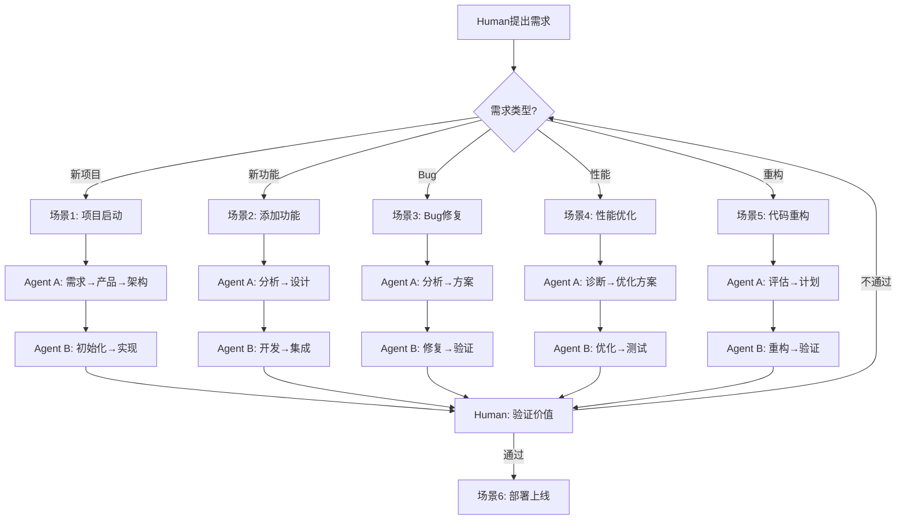

# TAD工作流程手册 - 场景化指南

## 核心原则
每个场景都遵循：需求理解 → 方案设计 → 执行实现 → 双层验证

## 场景1：全新项目启动

### 触发条件
- 没有任何代码
- 只有初步想法
- 需要从零开始

### Agent A工作流程
```yaml
Step 1 - 需求梳理:
  调用: product-expert
  输入: Human的初步想法
  输出:
    文档: .tad/context/REQUIREMENTS.md
    内容:
      - 用户故事
      - 功能清单
      - 优先级排序
      - 成功指标

Step 2 - 产品定义:
  调用: product-expert + ux-expert-reviewer
  输入: REQUIREMENTS.md
  输出:
    文档: .tad/context/PRD.md
    内容:
      - 产品愿景
      - 核心功能
      - 用户流程
      - 验收标准

Step 3 - 架构设计:
  调用: backend-architect (opus)
  输入: PRD.md
  输出:
    文档: .tad/context/ARCHITECTURE.md
    内容:
      - 技术栈选择
      - 系统架构图
      - 数据模型
      - API设计
      - 性能要求

Step 4 - 首个Sprint规划:
  输入: PRD + Architecture
  输出:
    文档: .tad/working/sprint-1.md
    内容:
      - MVP功能范围
      - 具体任务分解
      - 时间估算
      - 风险评估
```

### Agent B工作流程
```yaml
Step 1 - 项目初始化:
  调用: devops-engineer
  任务:
    - 创建项目结构
    - 配置开发环境
    - 设置Git仓库
  输出:
    - 项目框架代码
    - .tad/working/setup-report.md

Step 2 - MVP实现:
  调用: parallel-coordinator
  协调:
    - frontend-specialist: 创建基础UI
    - fullstack-dev-expert: 实现核心API
    - database-expert: 设置数据库
    - test-runner: 编写基础测试
  输出:
    - 可运行的MVP代码
    - .tad/working/implementation-report.md
```

### Human验证点
- [ ] 需求理解正确？
- [ ] 产品定义符合预期？
- [ ] 技术方案可行？
- [ ] MVP功能完整？

---

## 场景2：现有项目添加功能

### 触发条件
- 项目已在运行
- 需要新功能
- 不影响现有功能

### Agent A工作流程
```yaml
Step 1 - 功能分析:
  调用: product-expert
  输入:
    - 新功能需求
    - 现有PROJECT.md
  输出:
    文档: .tad/working/feature-analysis.md
    内容:
      - 功能描述
      - 影响分析
      - 依赖关系
      - 集成点

Step 2 - 设计方案:
  调用: api-designer + backend-architect
  输入: feature-analysis.md
  输出:
    文档: .tad/working/feature-design.md
    内容:
      - API变更
      - 数据模型更新
      - 前端组件设计
      - 向后兼容策略

Step 3 - Sprint计划:
  输出:
    文档: .tad/working/current-sprint.md
    内容:
      - 开发任务
      - 测试要求
      - 部署步骤
      - 回滚方案
```

### Agent B工作流程
```yaml
Step 1 - 影响评估:
  调用: code-reviewer
  任务: 检查哪些代码需要修改
  输出: 影响代码列表

Step 2 - 功能开发:
  调用: fullstack-dev-expert
  任务: 实现新功能
  输出:
    - 新功能代码
    - 更新的测试

Step 3 - 集成测试:
  调用: test-runner
  任务: 确保新旧功能兼容
  输出: 测试报告
```

---

## 场景3：Bug修复流程

### 触发条件
- 发现问题
- 影响用户
- 需要紧急修复

### Agent A工作流程
```yaml
Step 1 - 问题分析:
  输入: Bug描述
  输出:
    文档: .tad/working/bug-analysis.md
    内容:
      - 问题症状
      - 影响范围
      - 严重程度
      - 修复优先级

Step 2 - 修复方案:
  调用: backend-architect (如果是架构问题)
  输出:
    文档: .tad/working/fix-plan.md
    内容:
      - 根本原因
      - 修复策略
      - 测试方案
      - 预防措施
```

### Agent B工作流程
```yaml
Step 1 - 定位问题:
  调用: bug-hunter
  任务: 找出bug原因
  输出: 问题定位报告

Step 2 - 实施修复:
  调用: 相应的specialist
  任务: 修复代码
  输出: 修复补丁

Step 3 - 验证修复:
  调用: test-runner
  任务: 确认修复有效
  输出: 验证报告
```

---

## 场景4：性能优化

### 触发条件
- 响应变慢
- 资源消耗高
- 用户抱怨

### Agent A工作流程
```yaml
Step 1 - 性能诊断:
  调用: performance-optimizer (opus)
  输入: 性能问题描述
  输出:
    文档: .tad/working/performance-diagnosis.md
    内容:
      - 瓶颈分析
      - 性能指标
      - 影响因素
      - 优化建议

Step 2 - 优化方案:
  调用: backend-architect
  输出:
    文档: .tad/working/optimization-plan.md
    内容:
      - 优化策略
      - 实施步骤
      - 预期改进
      - 风险评估
```

### Agent B工作流程
```yaml
Step 1 - 实施优化:
  调用: refactor-specialist
  任务: 重构性能瓶颈代码

Step 2 - 性能测试:
  调用: performance-optimizer
  任务: 验证优化效果
  输出: 性能对比报告
```

---

## 场景5：代码重构

### 触发条件
- 技术债累积
- 代码难维护
- 需要升级架构

### Agent A工作流程
```yaml
Step 1 - 重构评估:
  调用: code-reviewer (opus)
  输出:
    文档: .tad/working/refactor-assessment.md
    内容:
      - 技术债清单
      - 重构范围
      - 影响评估
      - ROI分析

Step 2 - 重构计划:
  输出:
    文档: .tad/working/refactor-plan.md
    内容:
      - 分阶段计划
      - 每阶段目标
      - 测试策略
      - 回滚方案
```

### Agent B工作流程
```yaml
Step 1 - 渐进重构:
  调用: refactor-specialist
  任务: 按计划重构
  原则:
    - 保持功能不变
    - 小步快跑
    - 持续测试
```

---

## 场景6：部署上线

### 触发条件
- 功能开发完成
- 测试通过
- 准备发布

### Agent A工作流程
```yaml
Step 1 - 发布准备:
  输出:
    文档: .tad/working/release-checklist.md
    内容:
      - 功能清单
      - 已知问题
      - 部署步骤
      - 回滚方案
```

### Agent B工作流程
```yaml
Step 1 - 部署执行:
  调用: devops-engineer
  任务:
    - 配置CI/CD
    - 准备环境
    - 执行部署
  输出: 部署报告

Step 2 - 上线验证:
  调用: test-runner
  任务: 生产环境验证
  输出: 上线验证报告
```

---

## 文档模板规范

### 需求文档模板 (REQUIREMENTS.md)
```markdown
# 需求文档

## 背景
[为什么需要这个功能]

## 用户故事
- 作为[用户角色]
- 我想要[功能]
- 以便[价值]

## 功能需求
1. [具体功能点]

## 非功能需求
- 性能：[要求]
- 安全：[要求]
- 可用性：[要求]

## 验收标准
- [ ] [可验证的标准]
```

### Sprint文档模板 (current-sprint.md)
```markdown
# Sprint [N] - [日期]

## 目标
[本Sprint要实现的价值]

## 任务列表
- [ ] Task 1: [描述] - Agent: [谁执行]
- [ ] Task 2: [描述] - Agent: [谁执行]

## 技术方案
[Agent A的设计]

## 风险
[识别的风险和缓解措施]

## 验证
- Technical Gate: [Agent A验收标准]
- Value Gate: [Human验收标准]
```

### 执行报告模板 (execution-report.md)
```markdown
# 执行报告 - [日期]

## 完成情况
- [x] 已完成：[内容]
- [ ] 进行中：[内容]
- [ ] 待开始：[内容]

## 问题与解决
| 问题 | 解决方案 | 状态 |
|------|----------|------|
| [问题描述] | [解决方法] | [已解决/进行中] |

## 测试结果
- 单元测试：[通过率]
- 集成测试：[结果]
- 性能测试：[如果有]

## 下一步
[计划]
```

---

## 决策流程图



---

## 关键约束规则

### 文档生成规则
1. **每个场景必须生成对应文档**
2. **文档放在正确位置**：
   - 长期信息 → `.tad/context/`
   - 当前工作 → `.tad/working/`
3. **文档要可追溯**：包含日期、决策理由、负责agent

### 沟通规则
1. **Agent A → Agent B**：通过sprint文档传递任务
2. **Agent B → Agent A**：通过report文档报告结果
3. **Both → Human**：关键决策点需要Human确认

### 质量规则
1. **不跳过设计直接编码**（除非是简单bug修复）
2. **不跳过测试直接部署**
3. **不跳过Human验证**

这个手册让TAD在任何场景下都知道该做什么、生成什么文档、如何协作。